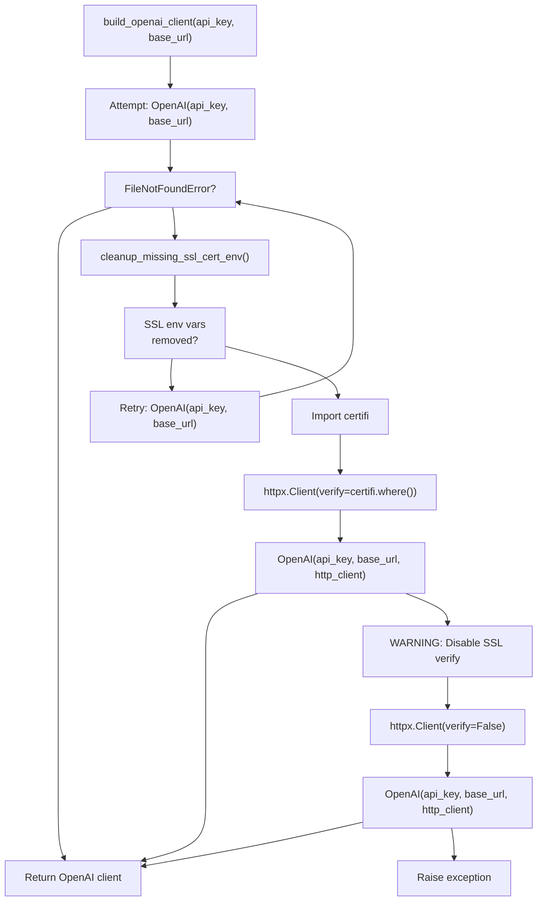
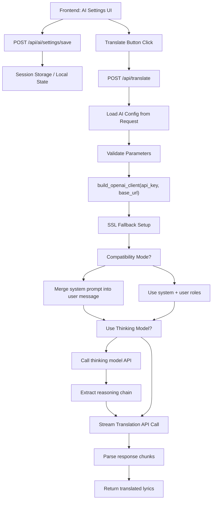

# AI Provider Configuration

> **Relevant source files**
> * [CHANGELOG.md](https://github.com/HKLHaoBin/LyricSphere/blob/7864cfe0/CHANGELOG.md)
> * [LICENSE](https://github.com/HKLHaoBin/LyricSphere/blob/7864cfe0/LICENSE)
> * [README.md](https://github.com/HKLHaoBin/LyricSphere/blob/7864cfe0/README.md)
> * [backend.py](https://github.com/HKLHaoBin/LyricSphere/blob/7864cfe0/backend.py)

This document describes the configuration and management of AI providers used for lyric translation in LyricSphere. It covers supported providers, configuration parameters, the OpenAI client builder with SSL fallback strategy, and testing endpoints. For the overall translation workflow, see [Translation Workflow](/HKLHaoBin/LyricSphere/2.4.1-translation-workflow). For two-stage translation with analysis models, see [Thinking Model Integration](/HKLHaoBin/LyricSphere/2.4.3-thinking-model-integration).

## Supported AI Providers

LyricSphere supports five AI providers through a unified OpenAI-compatible API interface. Each provider requires specific configuration for API key, base URL, and model selection.

### Provider List

| Provider | Base URL | Example Models | Notes |
| --- | --- | --- | --- |
| DeepSeek | `https://api.deepseek.com` | `deepseek-chat`, `deepseek-reasoner` | Supports reasoning chain extraction |
| OpenAI | `https://api.openai.com/v1` | `gpt-4`, `gpt-3.5-turbo` | Standard OpenAI models |
| OpenRouter | `https://openrouter.ai/api/v1` | Various third-party models | Model marketplace |
| Together | `https://api.together.xyz/v1` | `meta-llama/Llama-3.3-70B-Instruct-Turbo` | Open-source models |
| Groq | `https://api.groq.com/openai/v1` | `llama3-70b-8192` | Fast inference optimization |

All providers use the OpenAI-compatible API format, allowing unified client code through the `OpenAI` class from the `openai` package.

**Sources:** [backend.py L40](https://github.com/HKLHaoBin/LyricSphere/blob/7864cfe0/backend.py#L40-L40)

 [README.md L67](https://github.com/HKLHaoBin/LyricSphere/blob/7864cfe0/README.md#L67-L67)

 [README.md L144](https://github.com/HKLHaoBin/LyricSphere/blob/7864cfe0/README.md#L144-L144)

## Configuration Parameters

### Core Parameters

The following parameters are required for AI provider configuration:

| Parameter | Type | Description | Default |
| --- | --- | --- | --- |
| `api_key` | `str` | Provider API authentication key | Required |
| `base_url` | `str` | API endpoint URL | Provider-specific |
| `model` | `str` | Model identifier | Required |
| `system_prompt` | `str` | Custom system message for translation style control | Optional |
| `max_tokens` | `int` | Maximum generation length | 4096 |
| `temperature` | `float` | Controls randomness (0.0-1.0) | 0.7 |
| `thinking_model` | `str` | Pre-analysis model for two-stage translation | Optional |

### Advanced Parameters

| Parameter | Type | Description |
| --- | --- | --- |
| `compatibility_mode` | `bool` | Merges system prompt into user message for single-role models |
| `strip_brackets` | `bool` | Removes bracket content from lyrics before translation |
| `use_thinking_stage` | `bool` | Enables pre-translation analysis with thinking model |

**Sources:** [backend.py L910-L948](https://github.com/HKLHaoBin/LyricSphere/blob/7864cfe0/backend.py#L910-L948)

 [CHANGELOG.md L125-L136](https://github.com/HKLHaoBin/LyricSphere/blob/7864cfe0/CHANGELOG.md#L125-L136)

 [README.md L143-L155](https://github.com/HKLHaoBin/LyricSphere/blob/7864cfe0/README.md#L143-L155)

## OpenAI Client Builder

### Client Creation with SSL Resilience

The `build_openai_client()` function creates OpenAI clients with a three-tier SSL fallback strategy to handle certificate issues gracefully.



**Diagram: OpenAI Client Builder SSL Fallback Strategy**

### Implementation Details

#### Tier 1: Default SSL Configuration

The function first attempts to create the client with default SSL settings:

```python
def _create_openai_client(http_client=None) -> OpenAI:
    return OpenAI(api_key=api_key, base_url=base_url, http_client=http_client)
```

**Sources:** [backend.py L912-L913](https://github.com/HKLHaoBin/LyricSphere/blob/7864cfe0/backend.py#L912-L913)

#### Tier 2: SSL Environment Variable Cleanup

If a `FileNotFoundError` occurs, the system cleans up invalid SSL environment variables:

```python
def cleanup_missing_ssl_cert_env() -> List[str]:
    """Remove SSL-related environment variables that point to missing files/dirs."""
    removed: List[str] = []
    file_envs = ('SSL_CERT_FILE', 'REQUESTS_CA_BUNDLE', 'CURL_CA_BUNDLE')
    for env_key in file_envs:
        candidate = os.environ.get(env_key)
        if candidate and not os.path.isfile(candidate):
            removed.append(f"{env_key}={candidate}")
            os.environ.pop(env_key, None)
    
    cert_dir = os.environ.get('SSL_CERT_DIR')
    if cert_dir and not os.path.isdir(cert_dir):
        removed.append(f"SSL_CERT_DIR={cert_dir}")
        os.environ.pop('SSL_CERT_DIR', None)
    return removed
```

The function checks four environment variables:

* `SSL_CERT_FILE`: Points to CA certificate file
* `REQUESTS_CA_BUNDLE`: Used by requests library
* `CURL_CA_BUNDLE`: Used by curl/libcurl
* `SSL_CERT_DIR`: Directory containing CA certificates

**Sources:** [backend.py L890-L908](https://github.com/HKLHaoBin/LyricSphere/blob/7864cfe0/backend.py#L890-L908)

#### Tier 3: Certifi CA Bundle Fallback

If default retry fails, the system attempts to use the `certifi` package's CA bundle:

```javascript
import certifi
import httpx
ca_path = certifi.where()
app.logger.warning(
    "OpenAI客户端初始化时SSL默认证书加载失败，改用certifi CA文件: %s",
    ca_path
)
http_client = httpx.Client(verify=ca_path, timeout=httpx.Timeout(30.0))
return _create_openai_client(http_client=http_client)
```

This approach uses a bundled, known-good set of CA certificates from the `certifi` package.

**Sources:** [backend.py L929-L938](https://github.com/HKLHaoBin/LyricSphere/blob/7864cfe0/backend.py#L929-L938)

#### Tier 4: Disable SSL Verification (Last Resort)

As a last resort for temporary compatibility, SSL verification can be disabled:

```
app.logger.warning("将禁用SSL验证以继续运行AI翻译（仅用于临时兼容）")
http_client = httpx.Client(verify=False, timeout=httpx.Timeout(30.0))
return _create_openai_client(http_client=http_client)
```

This mode is logged as a warning and should only be used when no other options work.

**Sources:** [backend.py L941-L944](https://github.com/HKLHaoBin/LyricSphere/blob/7864cfe0/backend.py#L941-L944)

## Provider Configuration Flow

The following diagram shows how configuration parameters flow from the frontend UI through the backend to the AI provider API:



**Diagram: AI Provider Configuration Flow from UI to API Call**

**Sources:** [backend.py L910-L948](https://github.com/HKLHaoBin/LyricSphere/blob/7864cfe0/backend.py#L910-L948)

 [CHANGELOG.md L125-L136](https://github.com/HKLHaoBin/LyricSphere/blob/7864cfe0/CHANGELOG.md#L125-L136)

## Testing and Health Check Endpoints

### API Connection Test

**Endpoint:** `POST /api/ai/test`

Tests connectivity to the configured AI provider. This endpoint creates a temporary client and attempts a minimal API call to verify authentication and network connectivity.

**Request Body:**

```json
{
  "api_key": "sk-...",
  "base_url": "https://api.deepseek.com",
  "model": "deepseek-chat"
}
```

**Response:**

```json
{
  "success": true,
  "message": "Connection successful"
}
```

### Model List Retrieval

**Endpoint:** `POST /api/ai/models`

Retrieves available models from the provider. This endpoint is compatible with services that return 404 for the `/v1/models` endpoint, gracefully handling such responses.

**Request Body:**

```json
{
  "api_key": "sk-...",
  "base_url": "https://api.openai.com/v1"
}
```

**Response (Success):**

```json
{
  "models": [
    {"id": "gpt-4", "name": "GPT-4"},
    {"id": "gpt-3.5-turbo", "name": "GPT-3.5 Turbo"}
  ]
}
```

**Response (404 Compatibility):**

```json
{
  "models": [],
  "note": "Model list endpoint not available for this provider"
}
```

The 404 compatibility feature allows providers like Groq and some OpenRouter models that don't expose a models endpoint to still be used for translation.

**Sources:** [CHANGELOG.md L54-L65](https://github.com/HKLHaoBin/LyricSphere/blob/7864cfe0/CHANGELOG.md#L54-L65)

 [README.md L154](https://github.com/HKLHaoBin/LyricSphere/blob/7864cfe0/README.md#L154-L154)

## Configuration Examples

### DeepSeek Configuration

```json
{
  "provider": "deepseek",
  "api_key": "sk-...",
  "base_url": "https://api.deepseek.com",
  "model": "deepseek-chat",
  "system_prompt": "You are a professional translator...",
  "max_tokens": 4096,
  "temperature": 0.7,
  "thinking_model": "deepseek-reasoner"
}
```

DeepSeek supports reasoning chain extraction through the `deepseek-reasoner` model, which can be used as a thinking model for pre-translation analysis.

### OpenAI Configuration

```json
{
  "provider": "openai",
  "api_key": "sk-...",
  "base_url": "https://api.openai.com/v1",
  "model": "gpt-4",
  "system_prompt": "Translate the following lyrics...",
  "max_tokens": 4096,
  "temperature": 0.7
}
```

### OpenRouter Configuration

```json
{
  "provider": "openrouter",
  "api_key": "sk-...",
  "base_url": "https://openrouter.ai/api/v1",
  "model": "anthropic/claude-3-sonnet",
  "system_prompt": "Translate these song lyrics...",
  "compatibility_mode": true
}
```

OpenRouter aggregates multiple providers and may require compatibility mode for certain models.

### Together Configuration

```json
{
  "provider": "together",
  "api_key": "...",
  "base_url": "https://api.together.xyz/v1",
  "model": "meta-llama/Llama-3.3-70B-Instruct-Turbo",
  "system_prompt": "Translate the lyrics...",
  "compatibility_mode": false
}
```

### Groq Configuration

```json
{
  "provider": "groq",
  "api_key": "gsk_...",
  "base_url": "https://api.groq.com/openai/v1",
  "model": "llama3-70b-8192",
  "system_prompt": "Translate lyrics...",
  "compatibility_mode": false
}
```

Groq specializes in fast inference with quantized models.

**Sources:** [README.md L67](https://github.com/HKLHaoBin/LyricSphere/blob/7864cfe0/README.md#L67-L67)

 [backend.py L910-L948](https://github.com/HKLHaoBin/LyricSphere/blob/7864cfe0/backend.py#L910-L948)

## Compatibility Mode

Compatibility mode is designed for AI models that only support single-role conversations (user messages only, no separate system role). When enabled, the system prompt is merged into the user message.

### When to Use

Enable compatibility mode if:

* The provider returns errors about unsupported message roles
* The model documentation indicates it doesn't support system messages
* Translation results ignore the system prompt entirely

### Implementation

When compatibility mode is enabled, the prompt construction changes:

**Normal Mode:**

```json
{
  "messages": [
    {"role": "system", "content": "You are a translator..."},
    {"role": "user", "content": "Translate: [lyrics]"}
  ]
}
```

**Compatibility Mode:**

```json
{
  "messages": [
    {"role": "user", "content": "You are a translator...\n\nTranslate: [lyrics]"}
  ]
}
```

The system parses the `compatibility_mode` boolean parameter using a `parse_bool()` utility function to ensure consistency across the translation request pipeline, settings persistence, and logging.

**Sources:** [CHANGELOG.md L125-L136](https://github.com/HKLHaoBin/LyricSphere/blob/7864cfe0/CHANGELOG.md#L125-L136)

 [README.md L41](https://github.com/HKLHaoBin/LyricSphere/blob/7864cfe0/README.md#L41-L41)

## Security Considerations

### API Key Storage

API keys are stored in session state on the frontend and transmitted only during API calls. The backend does not persist API keys to disk.

### SSL Certificate Validation

The three-tier SSL fallback strategy prioritizes security:

1. **Tier 1:** Use system default certificates (most secure)
2. **Tier 2:** Use certifi bundle (verified CA certificates)
3. **Tier 3:** Disable verification (logged as warning, temporary only)

The system logs all SSL-related warnings and fallbacks for audit purposes.

### Rate Limiting

Rate limiting is handled by the individual AI providers. LyricSphere does not implement additional rate limiting at the application layer.

**Sources:** [backend.py L890-L948](https://github.com/HKLHaoBin/LyricSphere/blob/7864cfe0/backend.py#L890-L948)

 [backend.py L920-L946](https://github.com/HKLHaoBin/LyricSphere/blob/7864cfe0/backend.py#L920-L946)