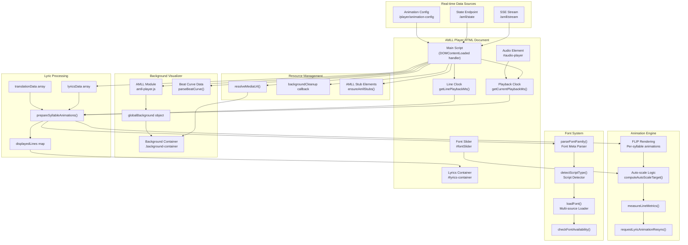
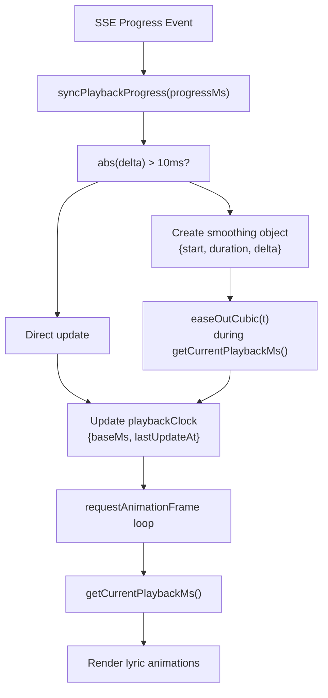
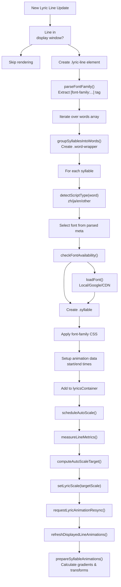
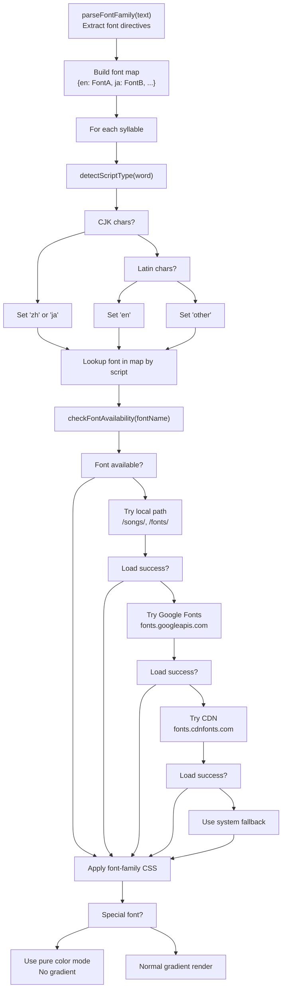
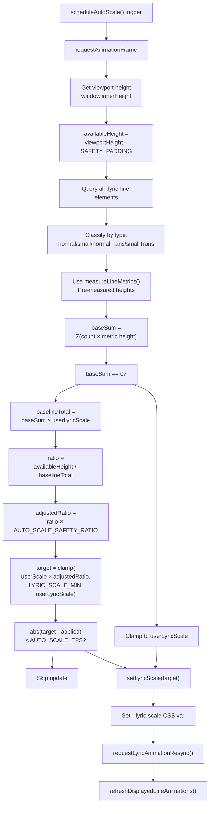
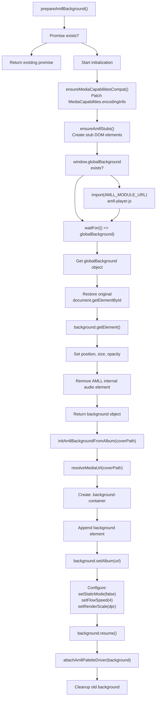
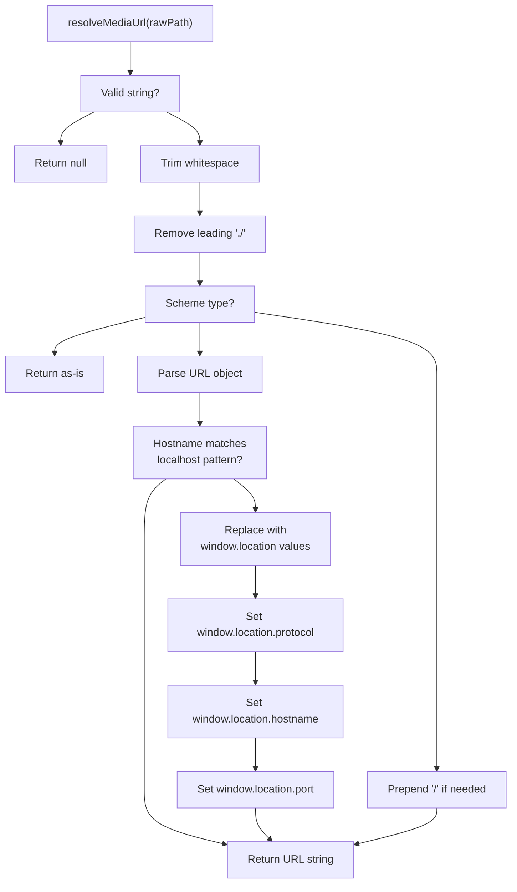
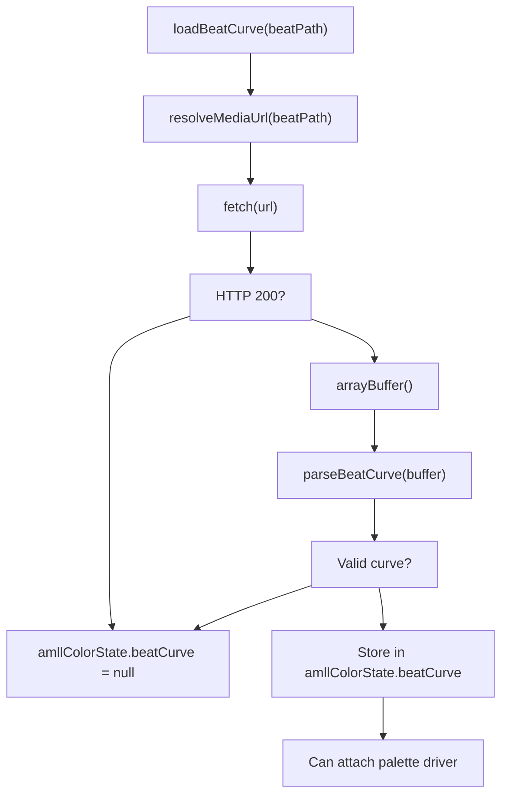
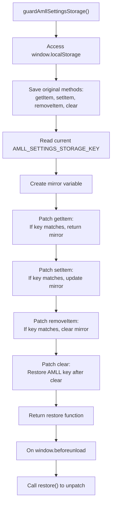
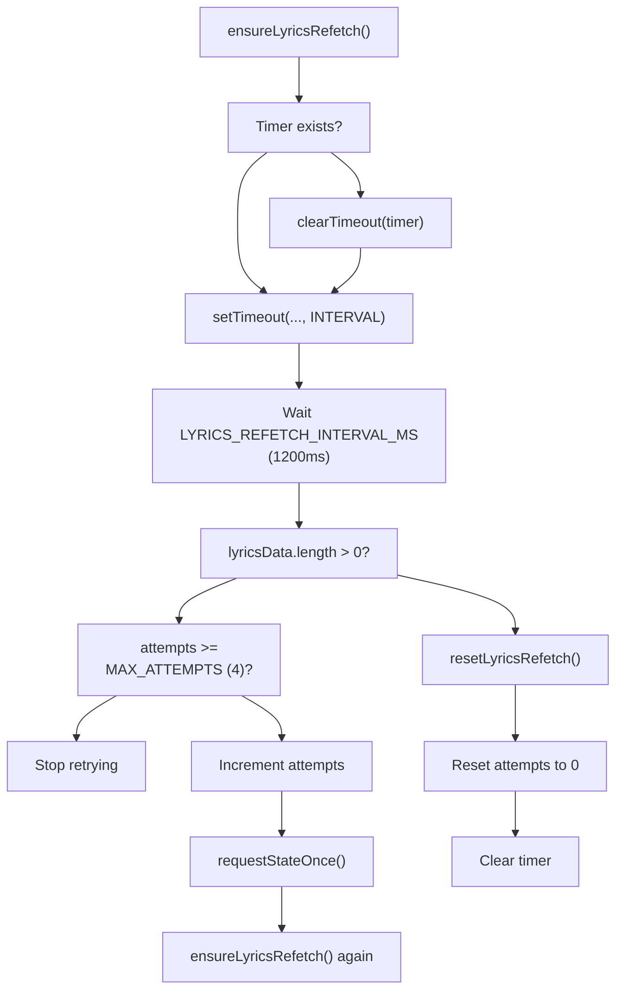

# AMLL Player (Lyrics-style.HTML-AMLL-v1.HTML)

> **Relevant source files**
> * [LICENSE](https://github.com/HKLHaoBin/LyricSphere/blob/7864cfe0/LICENSE)
> * [README.md](https://github.com/HKLHaoBin/LyricSphere/blob/7864cfe0/README.md)
> * [static/assets/amll-player.js](https://github.com/HKLHaoBin/LyricSphere/blob/7864cfe0/static/assets/amll-player.js)
> * [templates/Lyrics-style.HTML-AMLL-v1.HTML](https://github.com/HKLHaoBin/LyricSphere/blob/7864cfe0/templates/Lyrics-style.HTML-AMLL-v1.HTML)
> * [templates/amll_web_player.html](https://github.com/HKLHaoBin/LyricSphere/blob/7864cfe0/templates/amll_web_player.html)

## Purpose and Scope

This document describes the AMLL Player (`Lyrics-style.HTML-AMLL-v1.HTML`), an advanced lyric display interface that provides syllable-level animation, dynamic font rendering, and audio visualization. This player implements a full-featured presentation layer for synchronized lyrics with real-time updates via WebSocket or Server-Sent Events (SSE).

For information about the AMLL WebSocket server backend, see [2.5.1](/HKLHaoBin/LyricSphere/2.5.1-websocket-server). For the main dashboard interface where songs are managed, see [3.1](/HKLHaoBin/LyricSphere/3.1-main-dashboard-(lyricsphere.html)). For real-time communication protocols, see [2.5](/HKLHaoBin/LyricSphere/2.5-real-time-communication).

**Sources:** [templates/Lyrics-style.HTML-AMLL-v1.HTML L1-L250](https://github.com/HKLHaoBin/LyricSphere/blob/7864cfe0/templates/Lyrics-style.HTML-AMLL-v1.HTML#L1-L250)

---

## Architecture Overview

The AMLL Player is implemented as a single-page HTML application with embedded JavaScript that orchestrates multiple subsystems for lyric display, animation, and audio visualization.



**Description:** The AMLL Player coordinates multiple subsystems: real-time data ingestion via SSE, dual-clock playback tracking (global and per-line), font detection and loading, FLIP-based animation rendering, and optional AMLL background visualization. The architecture separates concerns between data acquisition, processing, rendering, and presentation.

**Sources:** [templates/Lyrics-style.HTML-AMLL-v1.HTML L343-L495](https://github.com/HKLHaoBin/LyricSphere/blob/7864cfe0/templates/Lyrics-style.HTML-AMLL-v1.HTML#L343-L495)

 [templates/Lyrics-style.HTML-AMLL-v1.HTML L718-L751](https://github.com/HKLHaoBin/LyricSphere/blob/7864cfe0/templates/Lyrics-style.HTML-AMLL-v1.HTML#L718-L751)

 [templates/Lyrics-style.HTML-AMLL-v1.HTML L252-L258](https://github.com/HKLHaoBin/LyricSphere/blob/7864cfe0/templates/Lyrics-style.HTML-AMLL-v1.HTML#L252-L258)

---

## Communication Mechanisms

### Real-time Data Flow

```mermaid
sequenceDiagram
  participant AMLL Player
  participant /player/animation-config
  participant /amll/state
  participant /amll/stream
  participant Backend Core

  AMLL Player->>/player/animation-config: POST animation params
  /player/animation-config->>/player/animation-config: {entryDuration, moveDuration, exitDuration}
  /player/animation-config->>AMLL Player: Normalize to 600ms default
  AMLL Player->>/amll/state: Set useComputedDisappear
  /amll/state->>AMLL Player: Return synced config
  AMLL Player->>AMLL Player: GET initial state
  AMLL Player->>/amll/stream: requestStateOnce()
  /amll/stream->>AMLL Player: {song, lyrics, translation, progress}
  loop [Real-time Updates]
    Backend Core->>/amll/stream: Initialize lyricsData, translationData
    /amll/stream->>AMLL Player: syncPlaybackProgress()
    AMLL Player->>AMLL Player: Connect EventSource
    AMLL Player->>AMLL Player: AMLL_STREAM_URL
    Backend Core->>/amll/stream: connection: open
    /amll/stream->>AMLL Player: Push lyric line update
    AMLL Player->>AMLL Player: event: lyric data
  end
  AMLL Player->>AMLL Player: Update displayedLines
  AMLL Player->>AMLL Player: prepareSyllableAnimations()
  note over AMLL Player,/amll/stream: Lyrics refetch attempts up to
```

**Description:** The player establishes three communication channels: (1) Animation configuration sync via POST to `/player/animation-config` to align frontend-reported durations with backend calculations; (2) Initial state fetch from `/amll/state` to populate song metadata and lyrics; (3) SSE stream from `/amll/stream` for continuous lyric and progress updates. A periodic resync timer and retry mechanism ensure data consistency.

**Sources:** [templates/Lyrics-style.HTML-AMLL-v1.HTML L252-L258](https://github.com/HKLHaoBin/LyricSphere/blob/7864cfe0/templates/Lyrics-style.HTML-AMLL-v1.HTML#L252-L258)

 [templates/Lyrics-style.HTML-AMLL-v1.HTML L752-L783](https://github.com/HKLHaoBin/LyricSphere/blob/7864cfe0/templates/Lyrics-style.HTML-AMLL-v1.HTML#L752-L783)

 [templates/Lyrics-style.HTML-AMLL-v1.HTML L785-L809](https://github.com/HKLHaoBin/LyricSphere/blob/7864cfe0/templates/Lyrics-style.HTML-AMLL-v1.HTML#L785-L809)

---

## Playback Clock System

The player maintains dual clock systems for accurate synchronization:

| Clock | Purpose | Update Mechanism |
| --- | --- | --- |
| `playbackClock` | Global song progress | Updated by SSE events, smoothed with easing |
| `lineClock` | Per-line progress tracking | Updated for each new lyric line |

### Playback Clock Implementation



**Description:** The `playbackClock` object tracks song position with smoothing to prevent jarring jumps. When a progress update arrives via SSE, if the delta exceeds 10ms, a smoothing animation is applied using `easeOutCubic` over a calculated duration (clamped between 180-900ms). The `getCurrentPlaybackMs()` function applies this smoothing in real-time during rendering.

**Sources:** [templates/Lyrics-style.HTML-AMLL-v1.HTML L718-L751](https://github.com/HKLHaoBin/LyricSphere/blob/7864cfe0/templates/Lyrics-style.HTML-AMLL-v1.HTML#L718-L751)

 [templates/Lyrics-style.HTML-AMLL-v1.HTML L752-L783](https://github.com/HKLHaoBin/LyricSphere/blob/7864cfe0/templates/Lyrics-style.HTML-AMLL-v1.HTML#L752-L783)

---

## Lyric Rendering System

### Data Structures

The player maintains several key data structures:

```javascript
// From template code
let lyricsData = [];        // Array of lyric line objects
let translationData = [];   // Array of translation line objects
let displayedLines = new Map(); // Map of currently displayed lines
```

Each lyric line object structure:

```yaml
{
  words: [
    {
      word: "text content",
      startTime: 1234,  // milliseconds
      endTime: 2345
    }
  ],
  startTime: 1234,
  endTime: 2345,
  translatedLyric: "translation text",
  romanLyric: "romanization text",
  isBG: false,          // background vocals flag
  isDuet: false         // duet flag
}
```

### Syllable Rendering Pipeline



**Description:** The syllable rendering pipeline processes each lyric line by: (1) extracting font metadata tags, (2) grouping syllables into word wrappers, (3) detecting script type per syllable, (4) loading appropriate fonts, (5) creating animated span elements, (6) auto-scaling to fit viewport, and (7) preparing FLIP animations with gradient backgrounds and transforms.

**Sources:** [templates/Lyrics-style.HTML-AMLL-v1.HTML L534-L554](https://github.com/HKLHaoBin/LyricSphere/blob/7864cfe0/templates/Lyrics-style.HTML-AMLL-v1.HTML#L534-L554)

 [templates/Lyrics-style.HTML-AMLL-v1.HTML L632-L705](https://github.com/HKLHaoBin/LyricSphere/blob/7864cfe0/templates/Lyrics-style.HTML-AMLL-v1.HTML#L632-L705)

 [templates/Lyrics-style.HTML-AMLL-v1.HTML L707-L716](https://github.com/HKLHaoBin/LyricSphere/blob/7864cfe0/templates/Lyrics-style.HTML-AMLL-v1.HTML#L707-L716)

---

## Font System

### Font Meta Tag Format

The player supports inline font metadata tags in lyric text:

```markdown
[font-family:FontName]                    # Global default font
[font-family:EnFont(en),JaFont(ja)]      # Per-script fonts
[font-family:Main(en),Sub(ja),Fallback]  # Multiple with fallback
[font-family:]                            # Clear font, restore default
```

### Font Loading Pipeline



**Description:** Font loading implements a multi-tier fallback strategy. The player first parses `[font-family:...]` tags to build a script-to-font map. For each syllable, it detects the script type (Chinese, Japanese, English, or other) and selects the appropriate font. If the font is unavailable, it attempts loading from: (1) local paths (`/songs/`, `/fonts/`), (2) Google Fonts API, (3) CDN sources. Special fonts (detected via name patterns) use pure color rendering instead of gradients for optimal per-syllable animation.

**Sources:** [templates/Lyrics-style.HTML-AMLL-v1.HTML L990-L1017](https://github.com/HKLHaoBin/LyricSphere/blob/7864cfe0/templates/Lyrics-style.HTML-AMLL-v1.HTML#L990-L1017)

 (resolveMediaUrl), inline font parsing logic (in truncated section)

---

## Animation System

### Auto-scaling Algorithm



**Description:** The auto-scaling system ensures all displayed lyrics fit within the viewport without overflow. It measures the cumulative height of all visible lines (categorized by normal/small and with/without translation), calculates a target scale factor based on available vertical space with a safety ratio (0.97) and padding (48px), then applies the scale via CSS custom property `--lyric-scale`. The algorithm uses epsilon-based change detection (AUTO_SCALE_EPS = 0.01) to avoid unnecessary re-renders.

**Sources:** [templates/Lyrics-style.HTML-AMLL-v1.HTML L515-L570](https://github.com/HKLHaoBin/LyricSphere/blob/7864cfe0/templates/Lyrics-style.HTML-AMLL-v1.HTML#L515-L570)

 [templates/Lyrics-style.HTML-AMLL-v1.HTML L572-L630](https://github.com/HKLHaoBin/LyricSphere/blob/7864cfe0/templates/Lyrics-style.HTML-AMLL-v1.HTML#L572-L630)

 [templates/Lyrics-style.HTML-AMLL-v1.HTML L632-L705](https://github.com/HKLHaoBin/LyricSphere/blob/7864cfe0/templates/Lyrics-style.HTML-AMLL-v1.HTML#L632-L705)

### FLIP Animation Architecture

The player uses the FLIP (First, Last, Invert, Play) technique for performant animations:

| Phase | Operation | Implementation |
| --- | --- | --- |
| **First** | Record initial state | Cache syllable positions and sizes |
| **Last** | Apply final state | Update DOM with new lyrics |
| **Invert** | Calculate delta | Compute transform offset |
| **Play** | Animate transition | Apply CSS transition with easing |

Key animation properties per syllable:

* `transform: translateY()` - Vertical floating animation
* `background-position` - Gradient sweep animation
* `opacity` - Fade in/out transitions
* `filter: blur()` - Optional blur effect

**Sources:** [templates/Lyrics-style.HTML-AMLL-v1.HTML L534-L554](https://github.com/HKLHaoBin/LyricSphere/blob/7864cfe0/templates/Lyrics-style.HTML-AMLL-v1.HTML#L534-L554)

 (refreshDisplayedLineAnimations)

---

## Background Visualizer

### AMLL Module Integration



**Description:** The AMLL background visualizer is loaded dynamically from `amll-player.js`. The initialization process: (1) patches `MediaCapabilities.encodingInfo` for compatibility, (2) creates stub DOM elements (skeleton structure) to satisfy AMLL's expectations, (3) imports the module and extracts `globalBackground`, (4) restores original DOM methods, (5) configures the background element with album art, flow speed (4), and device pixel ratio scaling, (6) attaches palette driver for beat synchronization.

**Sources:** [templates/Lyrics-style.HTML-AMLL-v1.HTML L915-L953](https://github.com/HKLHaoBin/LyricSphere/blob/7864cfe0/templates/Lyrics-style.HTML-AMLL-v1.HTML#L915-L953)

 (ensureMediaCapabilitiesCompat), [templates/Lyrics-style.HTML-AMLL-v1.HTML L874-L913](https://github.com/HKLHaoBin/LyricSphere/blob/7864cfe0/templates/Lyrics-style.HTML-AMLL-v1.HTML#L874-L913)

 (ensureAmllStubs), [templates/Lyrics-style.HTML-AMLL-v1.HTML L1019-L1081](https://github.com/HKLHaoBin/LyricSphere/blob/7864cfe0/templates/Lyrics-style.HTML-AMLL-v1.HTML#L1019-L1081)

 (prepareAmllBackground), [templates/Lyrics-style.HTML-AMLL-v1.HTML L1083-L1150](https://github.com/HKLHaoBin/LyricSphere/blob/7864cfe0/templates/Lyrics-style.HTML-AMLL-v1.HTML#L1083-L1150)

 (initAmllBackgroundFromAlbum)

### AMLL Stub System

The player creates stub DOM elements to satisfy AMLL module dependencies:

```javascript
const AMLL_SKELETON_IDS = new Set([
  'player', 'lyricsPanel', 'albumSidePanel',
  'songTitle', 'songArtist', 'albumInfo',
  'albumCoverContainer', 'albumCoverLarge',
  'progressBar', 'progressFill', 'waveformCanvas'
]);
```

The `ensureAmllSkeleton()` function generates a hidden skeleton structure containing these elements. The `document.getElementById` method is patched to return stub elements when AMLL module queries for them, then restored after initialization completes.

**Sources:** [templates/Lyrics-style.HTML-AMLL-v1.HTML L501-L513](https://github.com/HKLHaoBin/LyricSphere/blob/7864cfe0/templates/Lyrics-style.HTML-AMLL-v1.HTML#L501-L513)

 (AMLL_SKELETON_IDS), [templates/Lyrics-style.HTML-AMLL-v1.HTML L833-L872](https://github.com/HKLHaoBin/LyricSphere/blob/7864cfe0/templates/Lyrics-style.HTML-AMLL-v1.HTML#L833-L872)

 (ensureAmllSkeleton), [templates/Lyrics-style.HTML-AMLL-v1.HTML L874-L913](https://github.com/HKLHaoBin/LyricSphere/blob/7864cfe0/templates/Lyrics-style.HTML-AMLL-v1.HTML#L874-L913)

 (ensureAmllStubs)

---

## Resource Management

### URL Resolution

The `resolveMediaUrl()` function normalizes resource paths with special handling for localhost addresses:



**Description:** The resource resolver handles multiple URL formats: data URIs and blob URLs pass through unchanged; HTTP(S) URLs are parsed and localhost addresses (127.x.x.x, localhost, ::1, 0.0.0.0) are rewritten to use the current page's protocol, hostname, and port for proper proxying; relative paths are normalized to absolute paths starting with `/`.

**Sources:** [templates/Lyrics-style.HTML-AMLL-v1.HTML L990-L1017](https://github.com/HKLHaoBin/LyricSphere/blob/7864cfe0/templates/Lyrics-style.HTML-AMLL-v1.HTML#L990-L1017)

### Background Cleanup System

The player maintains a `backgroundCleanup` callback that manages lifecycle:

```javascript
backgroundCleanup = () => {
  // Stop AMLL background if active
  background.pause();
  stopAmllPaletteLoop({ clearBackground: true });
  
  // Remove from DOM
  element.parentElement.removeChild(element);
  
  // Return to stub host
  amllBackgroundState.host.appendChild(element);
  
  // Remove container
  container.remove();
};
backgroundCleanup.__kind = 'amll'; // or 'media' for video/image
```

Different cleanup types handle AMLL backgrounds vs. static media (video/image) backgrounds.

**Sources:** [templates/Lyrics-style.HTML-AMLL-v1.HTML L979-L988](https://github.com/HKLHaoBin/LyricSphere/blob/7864cfe0/templates/Lyrics-style.HTML-AMLL-v1.HTML#L979-L988)

 (removeExistingBackground), [templates/Lyrics-style.HTML-AMLL-v1.HTML L1102-L1114](https://github.com/HKLHaoBin/LyricSphere/blob/7864cfe0/templates/Lyrics-style.HTML-AMLL-v1.HTML#L1102-L1114)

 (AMLL cleanup), [templates/Lyrics-style.HTML-AMLL-v1.HTML L1209-L1213](https://github.com/HKLHaoBin/LyricSphere/blob/7864cfe0/templates/Lyrics-style.HTML-AMLL-v1.HTML#L1209-L1213)

 (media cleanup)

---

## Beat Visualization

### Beat Curve Loading



**Description:** Beat curves provide rhythm data for background animation. The player fetches beat curve files (binary format), parses them via `parseBeatCurve()`, and stores the result in `amllColorState.beatCurve`. This data drives the AMLL palette synchronization via `attachAmllPaletteDriver()`.

**Sources:** [templates/Lyrics-style.HTML-AMLL-v1.HTML L1152-L1175](https://github.com/HKLHaoBin/LyricSphere/blob/7864cfe0/templates/Lyrics-style.HTML-AMLL-v1.HTML#L1152-L1175)

### Background Control UI

The player provides a context menu (right-click) to toggle beat synchronization:

| Control | Function | Implementation |
| --- | --- | --- |
| Enable/Disable Beat | Toggle `amllBeatEnabled` flag | `setAmllBeatEnabled(boolean)` |
| Resume Background | Start AMLL palette loop | `attachAmllPaletteDriver()` |
| Pause Background | Stop palette loop | `stopAmllPaletteLoop()` |

The context menu button label updates dynamically: "开启律动背景" (Enable Background Beat) or "关闭律动背景" (Disable Background Beat).

**Sources:** [templates/Lyrics-style.HTML-AMLL-v1.HTML L362-L468](https://github.com/HKLHaoBin/LyricSphere/blob/7864cfe0/templates/Lyrics-style.HTML-AMLL-v1.HTML#L362-L468)

 (context menu creation and handlers)

---

## Configuration and State Management

### LocalStorage Protection

The `guardAmllSettingsStorage()` function protects AMLL settings from being cleared:



**Description:** The storage guard intercepts all localStorage operations. When other code calls `localStorage.clear()`, the AMLL settings are preserved in the `mirror` variable and restored immediately after the clear operation. This prevents settings loss from bulk storage clearing.

**Sources:** [templates/Lyrics-style.HTML-AMLL-v1.HTML L260-L337](https://github.com/HKLHaoBin/LyricSphere/blob/7864cfe0/templates/Lyrics-style.HTML-AMLL-v1.HTML#L260-L337)

### Animation Configuration Sync

The player POSTs animation parameters to `/player/animation-config` on initialization. The endpoint normalizes durations to a default of 600ms and returns a configuration object:

```yaml
{
  entryDuration: 600,      // Entry animation duration (ms)
  moveDuration: 600,       // Move/transition duration (ms)
  exitDuration: 600,       // Exit animation duration (ms)
  useComputedDisappear: true  // Whether to use backend-computed disappear times
}
```

The `useComputedDisappear` flag controls whether disappear times are calculated by the backend or by client-side animation logic.

**Sources:** Referenced in README.md description of animation-config endpoint

---

## Lyrics Refetch Mechanism



**Description:** The lyrics refetch mechanism ensures lyrics are loaded even if the initial load fails. If `lyricsData` remains empty after the first state request, it retries up to `LYRICS_REFETCH_MAX_ATTEMPTS` (4) times with `LYRICS_REFETCH_INTERVAL_MS` (1200ms) delays between attempts. This handles race conditions and temporary network issues.

**Sources:** [templates/Lyrics-style.HTML-AMLL-v1.HTML L785-L809](https://github.com/HKLHaoBin/LyricSphere/blob/7864cfe0/templates/Lyrics-style.HTML-AMLL-v1.HTML#L785-L809)

---

## URL Parameters and Customization

The player accepts URL query parameters for customization:

| Parameter | Purpose | Example |
| --- | --- | --- |
| `background` | Override background resource | `?background=/path/to/video.mp4` |
| `cover` | Override album cover | `?cover=/path/to/image.jpg` |

These parameters are extracted via `URLSearchParams`:

```javascript
const urlParams = new URLSearchParams(window.location.search);
const queryBackground = urlParams.get('background') || null;
const queryCover = urlParams.get('cover') || null;
```

The values override song metadata when loading backgrounds and covers.

**Sources:** [templates/Lyrics-style.HTML-AMLL-v1.HTML L498-L499](https://github.com/HKLHaoBin/LyricSphere/blob/7864cfe0/templates/Lyrics-style.HTML-AMLL-v1.HTML#L498-L499)

---

## Font Slider for Mobile Devices

The player includes a font size slider that appears only on mobile/touch devices:

```html
<div class="font-slider-container">
    <input type="range" min="0.5" max="1.5" value="1" step="0.05" id="fontSlider">
</div>
```

CSS media query enables the slider on small screens:

```
@media screen and (max-width: 768px), screen and (orientation: portrait) {
    .font-slider-container {
        display: block;
    }
}
```

The slider controls `userLyricScale`, which serves as the upper bound for auto-scaling. Users can adjust base font size, and auto-scaling further reduces it to fit the viewport if necessary.

**Sources:** [templates/Lyrics-style.HTML-AMLL-v1.HTML L226-L240](https://github.com/HKLHaoBin/LyricSphere/blob/7864cfe0/templates/Lyrics-style.HTML-AMLL-v1.HTML#L226-L240)

 (CSS), [templates/Lyrics-style.HTML-AMLL-v1.HTML L247-L249](https://github.com/HKLHaoBin/LyricSphere/blob/7864cfe0/templates/Lyrics-style.HTML-AMLL-v1.HTML#L247-L249)

 (HTML), [templates/Lyrics-style.HTML-AMLL-v1.HTML L528-L529](https://github.com/HKLHaoBin/LyricSphere/blob/7864cfe0/templates/Lyrics-style.HTML-AMLL-v1.HTML#L528-L529)

 (userLyricScale)

---

## Performance Optimizations

The player implements several performance optimizations:

| Optimization | Technique | Benefit |
| --- | --- | --- |
| **FLIP Animations** | Record-transform-animate pattern | 60 FPS smooth animations |
| **Line Metric Caching** | Pre-measure template elements | Avoid layout thrashing |
| **RAF Throttling** | `autoScaleRaf` ensures single request | Prevent excessive scaling calculations |
| **Epsilon-based Updates** | Skip updates if delta < `AUTO_SCALE_EPS` | Reduce DOM mutations |
| **Smoothed Clock** | Ease progress jumps over time | Visually smooth playback |
| **Font Availability Check** | Test with canvas before loading | Skip unnecessary font fetches |

**Sources:** [templates/Lyrics-style.HTML-AMLL-v1.HTML L523-L526](https://github.com/HKLHaoBin/LyricSphere/blob/7864cfe0/templates/Lyrics-style.HTML-AMLL-v1.HTML#L523-L526)

 (epsilon constants), [templates/Lyrics-style.HTML-AMLL-v1.HTML L572-L630](https://github.com/HKLHaoBin/LyricSphere/blob/7864cfe0/templates/Lyrics-style.HTML-AMLL-v1.HTML#L572-L630)

 (measureLineMetrics caching), [templates/Lyrics-style.HTML-AMLL-v1.HTML L707-L716](https://github.com/HKLHaoBin/LyricSphere/blob/7864cfe0/templates/Lyrics-style.HTML-AMLL-v1.HTML#L707-L716)

 (scheduleAutoScale RAF)

---

## Summary

The AMLL Player provides a comprehensive lyric display solution with:

* **Real-time synchronization** via SSE with dual-clock playback tracking
* **Advanced font system** with per-syllable script detection and multi-source loading (local/Google Fonts/CDN)
* **FLIP-based animations** for performant per-syllable rendering with auto-scaling
* **AMLL background visualizer** with dynamic album art and beat synchronization
* **Resource management** with URL normalization and cleanup lifecycle
* **Robust error handling** with lyrics refetch mechanism and fallback strategies

The player is accessible at `/templates/Lyrics-style.HTML-AMLL-v1.HTML` and integrates with backend systems via `/amll/state`, `/amll/stream`, and `/player/animation-config` endpoints.

**Sources:** [templates/Lyrics-style.HTML-AMLL-v1.HTML L1-L250](https://github.com/HKLHaoBin/LyricSphere/blob/7864cfe0/templates/Lyrics-style.HTML-AMLL-v1.HTML#L1-L250)

 [README.md L1-L172](https://github.com/HKLHaoBin/LyricSphere/blob/7864cfe0/README.md#L1-L172)