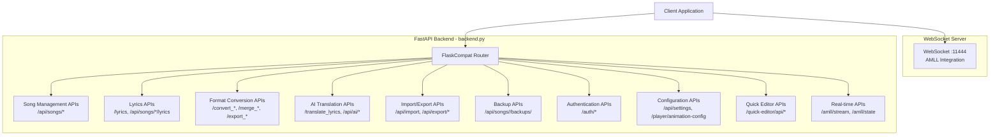
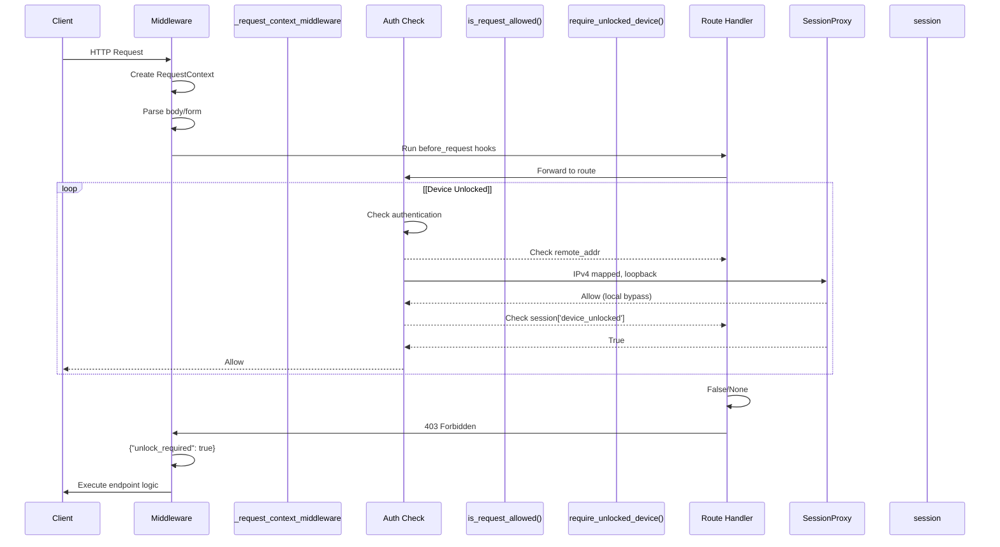
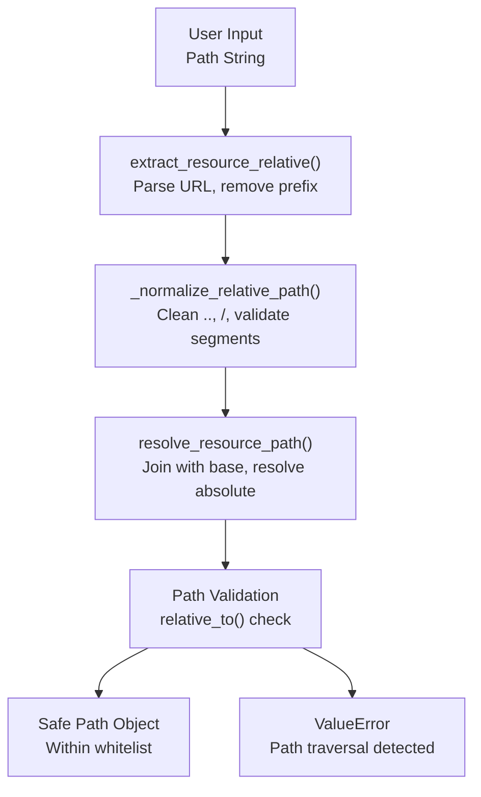

# API Endpoints Reference

> **Relevant source files**
> * [CLAUDE.md](https://github.com/HKLHaoBin/LyricSphere/blob/7864cfe0/CLAUDE.md)
> * [backend.py](https://github.com/HKLHaoBin/LyricSphere/blob/7864cfe0/backend.py)

This document provides a complete reference for all HTTP API endpoints, WebSocket connections, and Server-Sent Events (SSE) streams exposed by the LyricSphere backend. For information about the internal format conversion pipeline, see [Format Conversion Pipeline](/HKLHaoBin/LyricSphere/2.3-format-conversion-pipeline). For details on the AI translation system architecture, see [AI Translation System](/HKLHaoBin/LyricSphere/2.4-ai-translation-system). For real-time communication implementation details, see [Real-time Communication](/HKLHaoBin/LyricSphere/2.5-real-time-communication).

## API Structure Overview

The backend exposes over 60 API endpoints organized into functional categories. All HTTP endpoints return JSON responses with a consistent structure containing `success`, `data`, and `message` fields (unless otherwise specified).



**Sources:** [backend.py L760-L831](https://github.com/HKLHaoBin/LyricSphere/blob/7864cfe0/backend.py#L760-L831)

 [backend.py L854-L878](https://github.com/HKLHaoBin/LyricSphere/blob/7864cfe0/backend.py#L854-L878)

## Standard Response Format

All JSON API responses follow this structure:

```
{
  "success": true,
  "data": { /* endpoint-specific data */ },
  "message": "Operation completed successfully"
}
```

Error responses include HTTP status codes and descriptive messages:

```json
{
  "success": false,
  "error": "Error description",
  "code": 400
}
```

**Sources:** [backend.py L586-L606](https://github.com/HKLHaoBin/LyricSphere/blob/7864cfe0/backend.py#L586-L606)

 [backend.py L572-L583](https://github.com/HKLHaoBin/LyricSphere/blob/7864cfe0/backend.py#L572-L583)

## Song Management Endpoints

These endpoints handle CRUD operations for song metadata stored in JSON files under `static/songs/`.

| Method | Path | Description | Auth Required |
| --- | --- | --- | --- |
| GET | `/api/songs` | List all songs with metadata | No |
| POST | `/api/songs` | Create new song entry | Yes (unlock) |
| GET | `/api/songs/<song_id>` | Get song details | No |
| PUT | `/api/songs/<song_id>` | Update song metadata | Yes (unlock) |
| DELETE | `/api/songs/<song_id>` | Delete song and resources | Yes (unlock) |
| POST | `/api/songs/<song_id>/upload` | Upload song resources | Yes (unlock) |

### GET /api/songs

Returns a list of all songs with their metadata.

**Response:**

```json
{
  "success": true,
  "songs": [
    {
      "id": "song_filename",
      "meta": {
        "title": "Song Title",
        "artists": ["Artist Name"],
        "album": "Album Name",
        "duration": 240000,
        "lyrics": "songs/lyrics.lys"
      },
      "song": "songs/audio.mp3",
      "cover": "songs/cover.jpg"
    }
  ]
}
```

**Implementation:** The endpoint scans `SONGS_DIR` for JSON files, parses each file, and returns the combined list. It handles missing or malformed files gracefully.

**Sources:** [backend.py L950-L957](https://github.com/HKLHaoBin/LyricSphere/blob/7864cfe0/backend.py#L950-L957)

 [backend.py L1114-L1136](https://github.com/HKLHaoBin/LyricSphere/blob/7864cfe0/backend.py#L1114-L1136)

### POST /api/songs

Creates a new song entry from AMLL snapshot or manual input.

**Request Body:**

```json
{
  "source": "amll",
  "amll_data": {
    "musicName": "Song Title",
    "artists": ["Artist"],
    "duration": 240000,
    "cover_data_url": "data:image/jpeg;base64,..."
  }
}
```

**Response:**

```json
{
  "success": true,
  "song_id": "new_song_123",
  "file_path": "songs/new_song_123.json"
}
```

**Sources:** [backend.py L1186-L1214](https://github.com/HKLHaoBin/LyricSphere/blob/7864cfe0/backend.py#L1186-L1214)

 [backend.py L1642-L1651](https://github.com/HKLHaoBin/LyricSphere/blob/7864cfe0/backend.py#L1642-L1651)

### PUT /api/songs/<song_id>

Updates song metadata and resource paths.

**Request Body:**

```json
{
  "meta": {
    "title": "Updated Title",
    "artists": ["New Artist"],
    "lyrics": "::lrc::songs/lyrics.lys::songs/translation.lrc::!"
  },
  "song": "songs/new_audio.mp3",
  "cover": "songs/new_cover.jpg"
}
```

**Response:**

```json
{
  "success": true,
  "message": "Song updated successfully",
  "backup_created": true
}
```

**Implementation:** Creates automatic backup before modification using `build_backup_path()` and maintains up to 7 versions.

**Sources:** [backend.py L1318-L1331](https://github.com/HKLHaoBin/LyricSphere/blob/7864cfe0/backend.py#L1318-L1331)

 [backend.py L1293-L1295](https://github.com/HKLHaoBin/LyricSphere/blob/7864cfe0/backend.py#L1293-L1295)

### DELETE /api/songs/<song_id>

Deletes a song JSON file and optionally its associated resources.

**Query Parameters:**

* `delete_resources` (boolean): If true, deletes lyrics, audio, and cover files

**Response:**

```json
{
  "success": true,
  "message": "Song deleted successfully",
  "resources_deleted": 5
}
```

**Sources:** [backend.py L1114-L1136](https://github.com/HKLHaoBin/LyricSphere/blob/7864cfe0/backend.py#L1114-L1136)

 [backend.py L962-L986](https://github.com/HKLHaoBin/LyricSphere/blob/7864cfe0/backend.py#L962-L986)

## Lyrics Management Endpoints

These endpoints provide access to parsed lyrics in various formats and enable lyrics editing operations.

| Method | Path | Description | Auth Required |
| --- | --- | --- | --- |
| GET | `/lyrics` | Get parsed lyrics data | No |
| GET | `/api/songs/<song_id>/lyrics` | Get song lyrics content | No |
| PUT | `/api/songs/<song_id>/lyrics` | Save lyrics content | Yes (unlock) |
| POST | `/api/songs/<song_id>/lyrics/analyze` | Analyze lyrics tags | No |

### GET /lyrics

Parses and returns structured lyrics data with timing information.

**Query Parameters:**

* `path` (string): Relative path to lyrics file under `songs/`
* `format` (string, optional): Output format (`lys`, `ttml`, `lrc`)

**Response:**

```json
{
  "success": true,
  "lines": [
    {
      "line": "Full line text",
      "syllables": [
        {
          "text": "Syl",
          "startTime": 1.234,
          "duration": 0.456,
          "fontFamily": "CustomFont"
        }
      ],
      "style": {
        "align": "left",
        "fontSize": "normal",
        "fontFamily": "CustomFont"
      },
      "isBackground": false,
      "disappearTime": 2345
    }
  ],
  "format": "lys"
}
```

**Implementation:** Uses `parse_lys()` function to extract syllable-level timing data, applies `compute_disappear_times()` to calculate animation timing, and handles font-family metadata parsing.

**Sources:** [backend.py L2346-L2469](https://github.com/HKLHaoBin/LyricSphere/blob/7864cfe0/backend.py#L2346-L2469)

 [backend.py L2292-L2343](https://github.com/HKLHaoBin/LyricSphere/blob/7864cfe0/backend.py#L2292-L2343)

### PUT /api/songs/<song_id>/lyrics

Saves lyrics content to file with automatic backup creation.

**Request Body:**

```json
{
  "lyrics_content": "[0]歌(1000,500)词(1500,400)...",
  "format": "lys",
  "create_backup": true
}
```

**Response:**

```json
{
  "success": true,
  "message": "Lyrics saved",
  "backup_path": "backups/lyrics.lys.20240101_120000"
}
```

**Sources:** [backend.py L2203-L2289](https://github.com/HKLHaoBin/LyricSphere/blob/7864cfe0/backend.py#L2203-L2289)

 [backend.py L1318-L1331](https://github.com/HKLHaoBin/LyricSphere/blob/7864cfe0/backend.py#L1318-L1331)

## Format Conversion Endpoints

These endpoints convert between LRC, LYS, TTML, and LQE lyric formats.

| Method | Path | Description | Auth Required |
| --- | --- | --- | --- |
| POST | `/convert_to_ttml` | Convert LYS/LRC to TTML | Yes (unlock) |
| POST | `/convert_to_ttml_temp` | Temporary TTML conversion | No |
| POST | `/convert_ttml` | Convert TTML to LYS/LRC | Yes (unlock) |
| POST | `/merge_to_lqe` | Merge lyrics+translation to LQE | Yes (unlock) |
| POST | `/export_lyrics_csv` | Export lyrics to CSV | No |

### POST /convert_to_ttml

Converts LYS or LRC format lyrics to TTML (Apple Music style).

**Request Body:**

```json
{
  "lyrics_path": "songs/lyrics.lys",
  "translation_path": "songs/translation.lrc",
  "output_path": "songs/output.ttml",
  "options": {
    "include_translation": true,
    "detect_duet": true,
    "detect_background": true
  }
}
```

**Response:**

```json
{
  "success": true,
  "ttml_path": "songs/output.ttml",
  "has_duet": true,
  "has_background": false
}
```

**Implementation:** The conversion process:

1. Parses source format using format-specific parser
2. Detects duet markers (`[2]`, `[5]`) and background vocals (`[6]`, `[7]`, `[8]`)
3. Generates TTML XML with `ttm:agent` and `ttm:role` attributes
4. Applies timestamp synchronization

**Sources:** [backend.py L1963-L1981](https://github.com/HKLHaoBin/LyricSphere/blob/7864cfe0/backend.py#L1963-L1981)

 [backend.py L2346-L2469](https://github.com/HKLHaoBin/LyricSphere/blob/7864cfe0/backend.py#L2346-L2469)

### POST /convert_to_ttml_temp

Creates temporary TTML file for AMLL rule writing without saving to disk permanently.

**Request Body:**

```json
{
  "lyrics_content": "[0]歌(1000,500)词...",
  "format": "lys"
}
```

**Response:**

```json
{
  "success": true,
  "temp_id": "abc123def456",
  "ttml_url": "/static/temp/abc123def456.ttml",
  "expires_at": 1704067200
}
```

**Implementation:** Uses `TEMP_TTML_FILES` dict with TTL of 600 seconds. Files are automatically cleaned up after expiration.

**Sources:** [backend.py L53-L54](https://github.com/HKLHaoBin/LyricSphere/blob/7864cfe0/backend.py#L53-L54)

### POST /merge_to_lqe

Merges lyrics and translation into LQE format for specific player applications.

**Request Body:**

```json
{
  "lyrics_path": "songs/lyrics.lys",
  "translation_path": "songs/translation.lrc",
  "output_path": "songs/merged.lqe"
}
```

**Response:**

```json
{
  "success": true,
  "lqe_path": "songs/merged.lqe",
  "line_count": 45
}
```

**Sources:** For format conversion implementation details, see [Format Conversion Pipeline](/HKLHaoBin/LyricSphere/2.3-format-conversion-pipeline).

## AI Translation Endpoints

These endpoints provide AI-powered lyric translation capabilities with multiple provider support.

| Method | Path | Description | Auth Required |
| --- | --- | --- | --- |
| POST | `/translate_lyrics` | Translate lyrics with AI | Yes (unlock) |
| POST | `/api/ai/test` | Test AI provider connection | No |
| POST | `/api/ai/models` | Get available models | No |
| GET | `/api/ai/settings` | Get translation settings | No |
| POST | `/api/ai/settings` | Update translation settings | Yes (unlock) |

### POST /translate_lyrics

Translates lyrics using configured AI provider with streaming support.

**Request Body:**

```json
{
  "lyrics": "Line 1\nLine 2\nLine 3",
  "provider": "deepseek",
  "model": "deepseek-reasoner",
  "api_key": "sk-...",
  "base_url": "https://api.deepseek.com",
  "system_prompt": "Translate professionally...",
  "strip_brackets": false,
  "compat_mode": false,
  "thinking_enabled": true
}
```

**Response (Streaming):**

```
data: {"type": "thinking", "content": "Analyzing lyrics..."}

data: {"type": "translation", "line": 1, "content": "Translation 1"}

data: {"type": "translation", "line": 2, "content": "Translation 2"}

data: {"type": "complete", "total_lines": 3}
```

**Implementation Details:**

1. Validates provider and builds OpenAI-compatible client using `build_openai_client()` with SSL fallback
2. Preprocesses lyrics with optional `strip_bracket_blocks()` if enabled
3. Constructs prompt with system message and user content
4. If `thinking_enabled`, runs analysis with thinking model first
5. Streams translation chunks with progress tracking
6. Extracts reasoning chain from DeepSeek models
7. Synchronizes timestamps with original lyrics

**Sources:** [backend.py L910-L947](https://github.com/HKLHaoBin/LyricSphere/blob/7864cfe0/backend.py#L910-L947)

 [backend.py L1653-L1674](https://github.com/HKLHaoBin/LyricSphere/blob/7864cfe0/backend.py#L1653-L1674)

### POST /api/ai/test

Tests connection to AI provider with liveness check.

**Request Body:**

```json
{
  "provider": "deepseek",
  "api_key": "sk-...",
  "base_url": "https://api.deepseek.com"
}
```

**Response:**

```json
{
  "success": true,
  "available": true,
  "models_endpoint_available": false,
  "message": "Connection successful"
}
```

**Sources:** [backend.py L910-L947](https://github.com/HKLHaoBin/LyricSphere/blob/7864cfe0/backend.py#L910-L947)

### POST /api/ai/models

Retrieves available models from AI provider.

**Request Body:**

```json
{
  "provider": "openai",
  "api_key": "sk-...",
  "base_url": "https://api.openai.com/v1"
}
```

**Response:**

```json
{
  "success": true,
  "models": [
    {"id": "gpt-4", "name": "GPT-4"},
    {"id": "gpt-3.5-turbo", "name": "GPT-3.5 Turbo"}
  ]
}
```

**Sources:** For detailed translation workflow, see [AI Translation System](/HKLHaoBin/LyricSphere/2.4-ai-translation-system).

## Import and Export Endpoints

These endpoints handle batch file operations and package generation for sharing.

| Method | Path | Description | Auth Required |
| --- | --- | --- | --- |
| POST | `/api/import` | Import ZIP package | Yes (unlock) |
| POST | `/api/export` | Export single song | Yes (unlock) |
| POST | `/api/export/share` | Export share package | Yes (unlock) |
| POST | `/api/import/songs` | Import multiple songs | Yes (unlock) |

### POST /api/import

Imports a ZIP package containing songs and resources.

**Request (multipart/form-data):**

* `file`: ZIP archive
* `merge_strategy` (optional): `"replace"` or `"merge"` (default)

**Response:**

```json
{
  "success": true,
  "imported": 5,
  "skipped": 2,
  "errors": [],
  "details": [
    {
      "filename": "song1.json",
      "status": "imported",
      "resources": ["audio.mp3", "lyrics.lys", "cover.jpg"]
    }
  ]
}
```

**Implementation Flow:**

1. Extracts ZIP to temporary directory
2. Scans for JSON files in `static/` or root
3. Parses each JSON and collects referenced resources using `collect_song_resource_paths()`
4. Validates and resolves paths with `resolve_resource_path()`
5. Handles conflicts with `_resolve_import_target()`
6. Updates internal references with `_replace_import_paths()`
7. Copies files with integrity checks

**Sources:** [backend.py L1114-L1136](https://github.com/HKLHaoBin/LyricSphere/blob/7864cfe0/backend.py#L1114-L1136)

 [backend.py L1351-L1381](https://github.com/HKLHaoBin/LyricSphere/blob/7864cfe0/backend.py#L1351-L1381)

 [backend.py L1419-L1437](https://github.com/HKLHaoBin/LyricSphere/blob/7864cfe0/backend.py#L1419-L1437)

### POST /api/export/share

Creates a complete share package with all referenced resources.

**Request Body:**

```json
{
  "song_ids": ["song1", "song2", "song3"],
  "include_backups": false,
  "package_name": "MyCollection"
}
```

**Response:**

```json
{
  "success": true,
  "download_url": "/exports/MyCollection_20240101.zip",
  "size_bytes": 45678901,
  "files_included": 15
}
```

**Implementation:**

1. Collects all songs' JSON files
2. Extracts resource paths from metadata using `collect_song_resource_paths()`
3. Validates resource existence with `resolve_resource_path()`
4. Creates ZIP with normalized structure
5. Stores in `EXPORTS_DIR` with timestamp

**Sources:** [backend.py L1138-L1183](https://github.com/HKLHaoBin/LyricSphere/blob/7864cfe0/backend.py#L1138-L1183)

 [backend.py L850-L851](https://github.com/HKLHaoBin/LyricSphere/blob/7864cfe0/backend.py#L850-L851)

## Backup Management Endpoints

These endpoints manage automatic versioned backups with 7-version rotation.

| Method | Path | Description | Auth Required |
| --- | --- | --- | --- |
| GET | `/api/songs/<song_id>/backups` | List backups | No |
| POST | `/api/songs/<song_id>/backups/restore` | Restore backup | Yes (unlock) |
| DELETE | `/api/songs/<song_id>/backups/<timestamp>` | Delete backup | Yes (unlock) |

### GET /api/songs/<song_id>/backups

Lists all available backups for a song with metadata.

**Response:**

```json
{
  "success": true,
  "backups": [
    {
      "timestamp": "20240101_120000",
      "size_bytes": 12345,
      "created_at": "2024-01-01T12:00:00Z",
      "file_path": "backups/song.json.20240101_120000"
    }
  ],
  "total": 7
}
```

**Implementation:** Scans `BACKUP_DIR` for files matching `backup_prefix()` pattern.

**Sources:** [backend.py L1318-L1336](https://github.com/HKLHaoBin/LyricSphere/blob/7864cfe0/backend.py#L1318-L1336)

 [backend.py L1293-L1316](https://github.com/HKLHaoBin/LyricSphere/blob/7864cfe0/backend.py#L1293-L1316)

### POST /api/songs/<song_id>/backups/restore

Restores a song from a specific backup version.

**Request Body:**

```json
{
  "timestamp": "20240101_120000",
  "create_backup_of_current": true
}
```

**Response:**

```json
{
  "success": true,
  "message": "Backup restored successfully",
  "current_backed_up": true
}
```

**Sources:** [backend.py L1318-L1331](https://github.com/HKLHaoBin/LyricSphere/blob/7864cfe0/backend.py#L1318-L1331)

 [backend.py L952-L957](https://github.com/HKLHaoBin/LyricSphere/blob/7864cfe0/backend.py#L952-L957)

## Authentication Endpoints

Device-based authentication system with password protection using bcrypt hashing.

| Method | Path | Description | Auth Required |
| --- | --- | --- | --- |
| POST | `/auth/unlock` | Unlock device | No |
| POST | `/auth/lock` | Lock device | No |
| POST | `/auth/set_password` | Set/change password | No |
| GET | `/auth/devices` | List trusted devices | Yes (local) |
| DELETE | `/auth/devices/<device_id>` | Revoke device | Yes (local) |

### POST /auth/unlock

Authenticates device with password and adds to trusted devices list.

**Request Body:**

```json
{
  "password": "user_password",
  "device_id": "browser_generated_uuid"
}
```

**Response:**

```json
{
  "success": true,
  "message": "Device unlocked",
  "device_id": "abc123...",
  "expires_in_days": 30
}
```

**Implementation:**

1. Validates password with `bcrypt.checkpw()`
2. Generates or validates device ID
3. Stores in session via `SessionProxy`
4. Returns device identifier for client storage

**Sources:** For complete authentication flow, see [Device Authentication](/HKLHaoBin/LyricSphere/2.6.1-device-authentication).

## Configuration Endpoints

System configuration and settings management.

| Method | Path | Description | Auth Required |
| --- | --- | --- | --- |
| GET | `/api/settings` | Get all settings | No |
| POST | `/api/settings` | Update settings | Yes (unlock) |
| POST | `/player/animation-config` | Sync animation config | No |
| GET | `/player/animation-config` | Get animation config | No |

### POST /player/animation-config

Synchronizes animation timing configuration between frontend and backend.

**Request Body:**

```json
{
  "enterDuration": 500,
  "moveDuration": 500,
  "exitDuration": 500,
  "placeholderDuration": 50,
  "lineDisplayOffset": 0.7,
  "useComputedDisappear": false
}
```

**Response:**

```json
{
  "success": true,
  "config": {
    "enterDuration": 500,
    "moveDuration": 500,
    "exitDuration": 500,
    "placeholderDuration": 50,
    "lineDisplayOffset": 0.7,
    "useComputedDisappear": false
  },
  "last_update": 1704067200
}
```

**Implementation:** Uses thread-safe `_animation_config_lock` and `_animation_config_state` dict. The `compute_disappear_times()` function uses these values to calculate lyric line disappearance timing.

**Sources:** [backend.py L1678-L1738](https://github.com/HKLHaoBin/LyricSphere/blob/7864cfe0/backend.py#L1678-L1738)

 [backend.py L2292-L2343](https://github.com/HKLHaoBin/LyricSphere/blob/7864cfe0/backend.py#L2292-L2343)

## Quick Editor Endpoints

Real-time collaborative lyric editing with undo/redo support.

| Method | Path | Description | Auth Required |
| --- | --- | --- | --- |
| GET | `/quick-editor` | Editor UI page | No |
| POST | `/quick-editor/api/load` | Load document | Yes (unlock) |
| POST | `/quick-editor/api/move` | Move tokens | No |
| POST | `/quick-editor/api/undo` | Undo operation | No |
| POST | `/quick-editor/api/redo` | Redo operation | No |
| POST | `/quick-editor/api/newline` | Insert new line | No |
| POST | `/quick-editor/api/set_prefix` | Set line prefix | No |
| POST | `/quick-editor/api/save` | Save document | Yes (unlock) |
| GET | `/quick-editor/api/export` | Export as text | No |

### POST /quick-editor/api/load

Loads a song's lyrics into the quick editor with document structure.

**Request Body:**

```json
{
  "jsonFile": "songs/song123.json"
}
```

**Response:**

```json
{
  "status": "success",
  "doc": {
    "id": "doc_uuid",
    "version": 0,
    "lines": [
      {
        "id": "line_uuid",
        "prefix": "[0]",
        "is_meta": false,
        "tokens": [
          {"id": "token_uuid", "ts": "1000,500", "text": "歌"}
        ]
      }
    ]
  },
  "lyricsPath": "http://localhost:5000/songs/lyrics.lys",
  "translationPath": "",
  "songUrl": "http://localhost:5000/songs/audio.mp3",
  "title": "Song Title",
  "artists": ["Artist"]
}
```

**Implementation:**

1. Parses JSON file to get lyrics path
2. Ensures LYS format with `ensure_lys_file_for_editor()` (auto-converts TTML/LRC if needed)
3. Parses LYS content with `qe_parse_lys()` into structured document
4. Registers document in `QUICK_EDITOR_DOCS` dict
5. Initializes undo/redo stacks in `QUICK_EDITOR_UNDO` and `QUICK_EDITOR_REDO`

**Sources:** [backend.py L2592-L2690](https://github.com/HKLHaoBin/LyricSphere/blob/7864cfe0/backend.py#L2592-L2690)

 [backend.py L2003-L2068](https://github.com/HKLHaoBin/LyricSphere/blob/7864cfe0/backend.py#L2003-L2068)

 [backend.py L2203-L2289](https://github.com/HKLHaoBin/LyricSphere/blob/7864cfe0/backend.py#L2203-L2289)

### POST /quick-editor/api/move

Moves selected tokens to a new position in the document.

**Request Body:**

```json
{
  "document_id": "doc_uuid",
  "base_version": 0,
  "selection": [
    {
      "line_id": "line_uuid",
      "start_token_id": "token1_uuid",
      "end_token_id": "token3_uuid"
    }
  ],
  "target": {
    "type": "anchor",
    "line_id": "target_line_uuid",
    "anchor_token_id": "target_token_uuid",
    "position": "before"
  }
}
```

**Response:**

```
{
  "id": "doc_uuid",
  "version": 1,
  "lines": [ /* updated document structure */ ]
}
```

**Implementation:**

1. Validates document version to prevent conflicts
2. Normalizes selection with `qe_normalize_selection()`
3. Applies move operation with `qe_apply_move()`
4. Increments version counter
5. Pushes previous state to undo stack
6. Clears redo stack

**Sources:** [backend.py L2756-L2778](https://github.com/HKLHaoBin/LyricSphere/blob/7864cfe0/backend.py#L2756-L2778)

 [backend.py L2104-L2168](https://github.com/HKLHaoBin/LyricSphere/blob/7864cfe0/backend.py#L2104-L2168)

 [backend.py L2089-L2101](https://github.com/HKLHaoBin/LyricSphere/blob/7864cfe0/backend.py#L2089-L2101)

### POST /quick-editor/api/save

Saves the editor document back to the LYS file.

**Request Body:**

```json
{
  "doc_id": "doc_uuid",
  "create_backup": true
}
```

**Response:**

```json
{
  "success": true,
  "message": "Saved successfully",
  "backup_created": true,
  "lyrics_path": "songs/lyrics.lys"
}
```

**Implementation:**

1. Retrieves document from `QUICK_EDITOR_DOCS`
2. Gets metadata from `QUICK_EDITOR_META` (contains original file path)
3. Creates backup with `build_backup_path()` if requested
4. Serializes document with `qe_dump_lys()`
5. Writes to file with UTF-8 encoding

**Sources:** [backend.py L2054-L2068](https://github.com/HKLHaoBin/LyricSphere/blob/7864cfe0/backend.py#L2054-L2068)

 [backend.py L2183-L2200](https://github.com/HKLHaoBin/LyricSphere/blob/7864cfe0/backend.py#L2183-L2200)

## Real-time Communication

### WebSocket Server (Port 11444)

AMLL integration WebSocket for bidirectional real-time communication.

**Connection URL:**

```yaml
ws://localhost:11444
```

**Message Format (Client → Server):**

```json
{
  "type": "play",
  "timestamp": 12345
}
```

**Message Format (Server → Client):**

```json
{
  "type": "lyric_update",
  "line": {
    "text": "Lyric line",
    "startTime": 1.234,
    "duration": 0.567
  }
}
```

**Implementation:** Uses `websockets` library with async handlers. Maintains connection state and pushes updates from `AMLL_QUEUE`.

**Sources:** For WebSocket implementation details, see [WebSocket Server](/HKLHaoBin/LyricSphere/2.5.1-websocket-server).

### Server-Sent Events Endpoint

#### GET /amll/stream

SSE stream for real-time lyric updates to web clients.

**Response (text/event-stream):**

```yaml
event: lyric
data: {"line": "Current lyric line", "timestamp": 12345}

event: progress
data: {"current_ms": 12345, "duration_ms": 240000}

event: state
data: {"playing": true, "song": "Song Title"}
```

**Implementation:**

1. Opens persistent connection with `Content-Type: text/event-stream`
2. Reads from `AMLL_QUEUE` queue
3. Formats messages as SSE events
4. Handles client disconnection gracefully

**Sources:** [backend.py L1642-L1651](https://github.com/HKLHaoBin/LyricSphere/blob/7864cfe0/backend.py#L1642-L1651)

 For SSE details, see [Server-Sent Events (SSE)](/HKLHaoBin/LyricSphere/2.5.2-server-sent-events-(sse)).

### GET /amll/state

Provides snapshot of current AMLL state for client synchronization.

**Response:**

```json
{
  "success": true,
  "song": {
    "musicName": "Song Title",
    "artists": ["Artist"],
    "duration": 240000,
    "album": "Album Name",
    "cover": "http://localhost:5000/songs/cover.jpg",
    "cover_data_url": "data:image/jpeg;base64,..."
  },
  "progress_ms": 12345,
  "lines": [],
  "last_update": 1704067200
}
```

**Implementation:** Returns current state from `AMLL_STATE` global dict without blocking.

**Sources:** [backend.py L1642-L1651](https://github.com/HKLHaoBin/LyricSphere/blob/7864cfe0/backend.py#L1642-L1651)

## Endpoint Authentication Flow



**Sources:** [backend.py L1235-L1262](https://github.com/HKLHaoBin/LyricSphere/blob/7864cfe0/backend.py#L1235-L1262)

 [backend.py L466-L546](https://github.com/HKLHaoBin/LyricSphere/blob/7864cfe0/backend.py#L466-L546)

## Error Handling Standards

All endpoints follow consistent error handling patterns:

| HTTP Status | Meaning | Example Response |
| --- | --- | --- |
| 200 | Success | `{"success": true, "data": {...}}` |
| 400 | Bad Request | `{"success": false, "error": "Invalid parameter"}` |
| 403 | Forbidden | `{"success": false, "unlock_required": true}` |
| 404 | Not Found | `{"success": false, "error": "Resource not found"}` |
| 409 | Conflict | `{"success": false, "error": "Version conflict"}` |
| 500 | Server Error | `{"success": false, "error": "Internal error"}` |

**Implementation:** Error responses are generated via `abort()` function (raises `HTTPException`) or explicit JSONResponse with appropriate status codes.

**Sources:** [backend.py L572-L583](https://github.com/HKLHaoBin/LyricSphere/blob/7864cfe0/backend.py#L572-L583)

 [backend.py L586-L606](https://github.com/HKLHaoBin/LyricSphere/blob/7864cfe0/backend.py#L586-L606)

## Path Security and Validation

All file path operations use security validation:



**Key Functions:**

* `sanitize_filename()`: Removes dangerous characters from filenames [backend.py L997-L1004](https://github.com/HKLHaoBin/LyricSphere/blob/7864cfe0/backend.py#L997-L1004)
* `extract_resource_relative()`: Extracts relative path from URL [backend.py L1018-L1034](https://github.com/HKLHaoBin/LyricSphere/blob/7864cfe0/backend.py#L1018-L1034)
* `resolve_resource_path()`: Resolves to absolute path with validation [backend.py L1037-L1047](https://github.com/HKLHaoBin/LyricSphere/blob/7864cfe0/backend.py#L1037-L1047)
* `_normalize_relative_path()`: Validates path segments [backend.py L1006-L1015](https://github.com/HKLHaoBin/LyricSphere/blob/7864cfe0/backend.py#L1006-L1015)

**Whitelisted Directories:**

* `static/` - Static resources (`STATIC_DIR`)
* `songs/` - Song files and media (`SONGS_DIR`)
* `backups/` - Backup files (`BACKUP_DIR`)

**Sources:** [backend.py L988-L1062](https://github.com/HKLHaoBin/LyricSphere/blob/7864cfe0/backend.py#L988-L1062)

 For complete security implementation, see [Path Security and Validation](/HKLHaoBin/LyricSphere/2.6.2-path-security-and-validation).

## Request Context Management

All requests are wrapped in a context that provides Flask-like APIs on FastAPI:

**Key Classes:**

* `RequestContext`: Holds request data with lazy parsing [backend.py L278-L427](https://github.com/HKLHaoBin/LyricSphere/blob/7864cfe0/backend.py#L278-L427)
* `RequestProxy`: Global `request` object providing context access [backend.py L429-L463](https://github.com/HKLHaoBin/LyricSphere/blob/7864cfe0/backend.py#L429-L463)
* `SessionProxy`: Global `session` object for session management [backend.py L466-L546](https://github.com/HKLHaoBin/LyricSphere/blob/7864cfe0/backend.py#L466-L546)
* `FlaskCompat`: FastAPI subclass providing Flask-style routing [backend.py L760-L831](https://github.com/HKLHaoBin/LyricSphere/blob/7864cfe0/backend.py#L760-L831)

**Middleware Flow:**

```
Request → _request_context_middleware → Set ContextVar →
before_request hooks → Route handler → after_request hooks →
Apply CORS → Reset ContextVar → Response
```

**Sources:** [backend.py L1235-L1262](https://github.com/HKLHaoBin/LyricSphere/blob/7864cfe0/backend.py#L1235-L1262)

 [backend.py L51-L52](https://github.com/HKLHaoBin/LyricSphere/blob/7864cfe0/backend.py#L51-L52)