# Backend System

> **Relevant source files**
> * [CLAUDE.md](https://github.com/HKLHaoBin/LyricSphere/blob/7864cfe0/CLAUDE.md)
> * [backend.py](https://github.com/HKLHaoBin/LyricSphere/blob/7864cfe0/backend.py)

## Purpose and Scope

This document provides comprehensive technical documentation for the LyricSphere backend system. The backend is implemented in [backend.py](https://github.com/HKLHaoBin/LyricSphere/blob/7864cfe0/backend.py)

 and serves as the central orchestration layer for all lyric management, processing, and real-time distribution functionality.

The backend handles:

* HTTP API endpoints for lyric and resource management
* Real-time communication via WebSocket and SSE
* Lyric format parsing and conversion
* AI-powered translation
* Security and authentication
* File storage and backup management

For specific API endpoint documentation, see [API Endpoints Reference](/HKLHaoBin/LyricSphere/2.1-api-endpoints-reference). For detailed information about lyric format processing, see [Format Conversion Pipeline](/HKLHaoBin/LyricSphere/2.3-format-conversion-pipeline). For real-time communication specifics, see [Real-time Communication](/HKLHaoBin/LyricSphere/2.5-real-time-communication).

**Sources:** [backend.py L1-L50](https://github.com/HKLHaoBin/LyricSphere/blob/7864cfe0/backend.py#L1-L50)

 [CLAUDE.md L1-L163](https://github.com/HKLHaoBin/LyricSphere/blob/7864cfe0/CLAUDE.md#L1-L163)

---

## Architecture Overview

The backend system is built on FastAPI with a Flask-compatible API layer. The core application runs on port 5000 (default) and integrates with a WebSocket server on port 11444 for AMLL client communication.

### System Initialization and Configuration

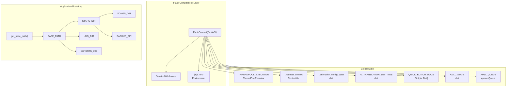

The application initialization sequence begins with `get_base_path()` which determines the runtime base directory (handles both development and packaged modes). All directory paths are constructed using `Path` objects relative to `BASE_PATH`.

**Sources:** [backend.py L838-L987](https://github.com/HKLHaoBin/LyricSphere/blob/7864cfe0/backend.py#L838-L987)

 [backend.py L1640-L1688](https://github.com/HKLHaoBin/LyricSphere/blob/7864cfe0/backend.py#L1640-L1688)

### Request Processing Pipeline

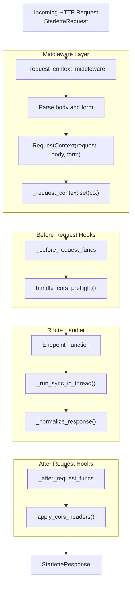

The `_request_context_middleware` intercepts every request at [backend.py L1236-L1263](https://github.com/HKLHaoBin/LyricSphere/blob/7864cfe0/backend.py#L1236-L1263)

 to establish request context using `ContextVar` for thread-safe state management. Synchronous route handlers are executed in `THREADPOOL_EXECUTOR` via `_run_sync_in_thread()` to prevent blocking the event loop.

**Sources:** [backend.py L1235-L1292](https://github.com/HKLHaoBin/LyricSphere/blob/7864cfe0/backend.py#L1235-L1292)

 [backend.py L741-L758](https://github.com/HKLHaoBin/LyricSphere/blob/7864cfe0/backend.py#L741-L758)

 [backend.py L760-L820](https://github.com/HKLHaoBin/LyricSphere/blob/7864cfe0/backend.py#L760-L820)

---

## Core Components

### FlaskCompat Layer

The `FlaskCompat` class provides a Flask-style API wrapper around FastAPI, enabling familiar Flask patterns while leveraging FastAPI's performance and async capabilities.

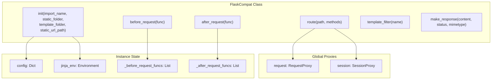

The decorator pattern in `route()` at [backend.py L791-L812](https://github.com/HKLHaoBin/LyricSphere/blob/7864cfe0/backend.py#L791-L812)

 converts Flask-style path parameters (e.g., `<name>`) to FastAPI format (e.g., `{name}`). It wraps route handlers to provide automatic response normalization via `_normalize_response()`.

**Key Methods:**

* `route(path, methods)`: Decorator that converts Flask routes to FastAPI routes
* `before_request(func)`: Registers pre-request hooks
* `after_request(func)`: Registers post-request hooks
* `template_filter(name)`: Adds Jinja2 template filters

**Sources:** [backend.py L760-L835](https://github.com/HKLHaoBin/LyricSphere/blob/7864cfe0/backend.py#L760-L835)

 [backend.py L833-L835](https://github.com/HKLHaoBin/LyricSphere/blob/7864cfe0/backend.py#L833-L835)

### Request Context Management

The request context system provides thread-safe access to request data throughout the application lifecycle using `ContextVar`.

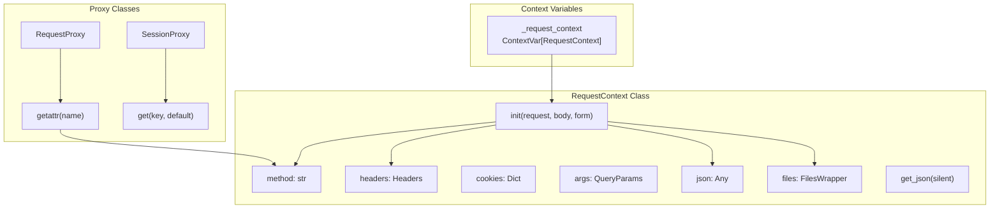

The `RequestContext` class at [backend.py L278-L427](https://github.com/HKLHaoBin/LyricSphere/blob/7864cfe0/backend.py#L278-L427)

 encapsulates all request data with lazy evaluation for JSON parsing and file access. Caching is implemented via `_MISSING` sentinel to avoid repeated parsing.

**Context Access Pattern:**

1. Global `request` proxy delegates to `RequestContext` via `__getattr__`
2. `RequestProxy._require_context()` retrieves current context or raises `RuntimeError`
3. Properties like `request.json` use cached values after first access

**Sources:** [backend.py L51-L52](https://github.com/HKLHaoBin/LyricSphere/blob/7864cfe0/backend.py#L51-L52)

 [backend.py L278-L427](https://github.com/HKLHaoBin/LyricSphere/blob/7864cfe0/backend.py#L278-L427)

 [backend.py L429-L464](https://github.com/HKLHaoBin/LyricSphere/blob/7864cfe0/backend.py#L429-L464)

 [backend.py L466-L547](https://github.com/HKLHaoBin/LyricSphere/blob/7864cfe0/backend.py#L466-L547)

### File Operations

File handling is abstracted through adapter classes that unify FastAPI's `UploadFile` interface with traditional file operations.

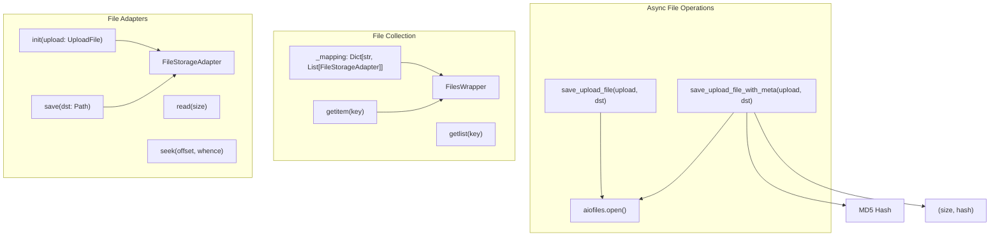

`FileStorageAdapter` at [backend.py L57-L121](https://github.com/HKLHaoBin/LyricSphere/blob/7864cfe0/backend.py#L57-L121)

 wraps `UploadFile` to provide a consistent interface. The `save()` method automatically creates parent directories and uses `shutil.copyfileobj` for efficient copying.

Async functions `save_upload_file()` and `save_upload_file_with_meta()` at [backend.py L196-L276](https://github.com/HKLHaoBin/LyricSphere/blob/7864cfe0/backend.py#L196-L276)

 use `aiofiles` for non-blocking I/O. The latter computes MD5 hash during write for integrity verification.

**Sources:** [backend.py L57-L220](https://github.com/HKLHaoBin/LyricSphere/blob/7864cfe0/backend.py#L57-L220)

 [backend.py L222-L276](https://github.com/HKLHaoBin/LyricSphere/blob/7864cfe0/backend.py#L222-L276)

---

## Lyric Processing System

The lyric processing system handles parsing, conversion, and computation for multiple lyric formats.

### Format Parsers

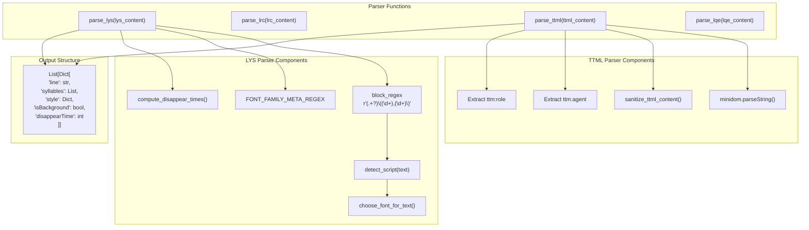

**LYS Format Parser** ([backend.py L2346-L2469](https://github.com/HKLHaoBin/LyricSphere/blob/7864cfe0/backend.py#L2346-L2469)

):

* Uses regex `r'(.+?)\((\d+),(\d+)\)'` to extract syllables with timing `text(start,dur)`
* Handles offset via `[offset:]` metadata tag
* Parses font-family metadata: `[font-family:FontName]` or `[font-family:Font1(en),Font2(ja)]`
* Detects background vocals via marker `[6]`, `[7]`, `[8]` or parenthetical content
* Applies `detect_script()` to choose appropriate fonts based on language
* Calls `compute_disappear_times()` to calculate line exit timing

**TTML Format Parser** (referenced in high-level diagrams):

* Parses XML using `minidom.parseString()`
* Extracts `ttm:agent="v2"` for duet lines
* Extracts `ttm:role="x-bg"` for background vocals
* Sanitizes content via whitelist filtering

**Output Structure:**
Each parser returns a list of line dictionaries containing:

* `line`: Full text of the line
* `syllables`: Array of `{text, startTime, duration, fontFamily}`
* `style`: Alignment, fontSize, fontFamily metadata
* `isBackground`: Boolean flag for background vocals
* `disappearTime`: Computed exit time in milliseconds

**Sources:** [backend.py L2346-L2469](https://github.com/HKLHaoBin/LyricSphere/blob/7864cfe0/backend.py#L2346-L2469)

 [backend.py L1750-L1822](https://github.com/HKLHaoBin/LyricSphere/blob/7864cfe0/backend.py#L1750-L1822)

 [backend.py L1756-L1767](https://github.com/HKLHaoBin/LyricSphere/blob/7864cfe0/backend.py#L1756-L1767)

 [backend.py L1769-L1774](https://github.com/HKLHaoBin/LyricSphere/blob/7864cfe0/backend.py#L1769-L1774)

### Timestamp Calculation

The `compute_disappear_times()` function calculates when each lyric line should exit the display.

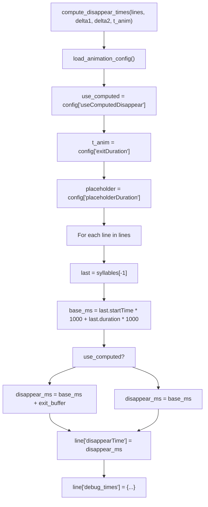

**Algorithm** ([backend.py L2292-L2343](https://github.com/HKLHaoBin/LyricSphere/blob/7864cfe0/backend.py#L2292-L2343)

):

1. Load animation configuration from `_animation_config_state`
2. For each line, find the last syllable's end time: `base_ms = startTime + duration`
3. If `useComputedDisappear` is true, add `exitDuration` buffer
4. Otherwise, use raw end time (frontend calculates exit)
5. Store result in `line['disappearTime']` (milliseconds)
6. Optionally log debug information for timing analysis

**Configuration Sync:**
The `/player/animation-config` endpoint allows frontend to report animation durations. The backend uses these values in disappear time calculations to ensure smooth transitions.

**Sources:** [backend.py L2292-L2343](https://github.com/HKLHaoBin/LyricSphere/blob/7864cfe0/backend.py#L2292-L2343)

 [backend.py L1678-L1738](https://github.com/HKLHaoBin/LyricSphere/blob/7864cfe0/backend.py#L1678-L1738)

### Format Converters

Format conversion enables interoperability between different lyric file types.

| Function | Input | Output | Description |
| --- | --- | --- | --- |
| `lys_to_ttml()` | LYS string | TTML XML | Converts syllable timing to TTML format |
| `ttml_to_lys()` | TTML file path | LYS file(s) | Extracts syllables from TTML, generates separate translation file if present |
| `lrc_to_ttml()` | LRC file path | TTML file | Converts line-level timing to TTML via intermediate processing |
| `merge_to_lqe()` | LYS/LRC + Translation | LQE JSON | Combines lyrics and translation into merged format |

**TTML Generation** (referenced in conversion pipeline):

* Creates XML structure with `<tt>`, `<head>`, `<body>` elements
* Wraps syllables in `<span>` tags with `begin` and `end` attributes
* Adds `ttm:agent="v2"` for duet lines (marker `[2]`, `[5]`)
* Adds `ttm:role="x-bg"` for background vocals (marker `[6]`, `[7]`, `[8]`)

**TTML Parsing** (for conversion to LYS):

* Extracts all `<span>` elements with timing attributes
* Groups spans by `<p>` elements to reconstruct lines
* Handles both main lyrics and translation in separate tracks

**Sources:** Referenced in [backend.py](https://github.com/HKLHaoBin/LyricSphere/blob/7864cfe0/backend.py)

 format conversion functions

---

## Real-time Communication

### WebSocket Server

The WebSocket server on port 11444 provides bidirectional communication with AMLL clients.

```

```

The WebSocket handler maintains global state in `AMLL_STATE` dictionary at [backend.py L1644-L1649](https://github.com/HKLHaoBin/LyricSphere/blob/7864cfe0/backend.py#L1644-L1649)

 Messages received from AMLL clients update this state and push events to `AMLL_QUEUE` for SSE distribution.

**Message Types:**

* `state`: Full song metadata (title, artists, album, cover, duration)
* `progress`: Current playback position in milliseconds
* `lines`: Array of current lyric lines with timing
* `cover`: Base64-encoded cover image data

**Cover Image Processing:**
When a cover is received, the server:

1. Decodes base64 data
2. Saves to `static/songs/amll_cover_{timestamp}.{ext}`
3. Updates `AMLL_STATE['song']['cover']` with URL

**Sources:** [backend.py L1644-L1651](https://github.com/HKLHaoBin/LyricSphere/blob/7864cfe0/backend.py#L1644-L1651)

 WebSocket handler referenced in system architecture

### Server-Sent Events (SSE)

The `/amll/stream` endpoint provides unidirectional event streaming to web clients.

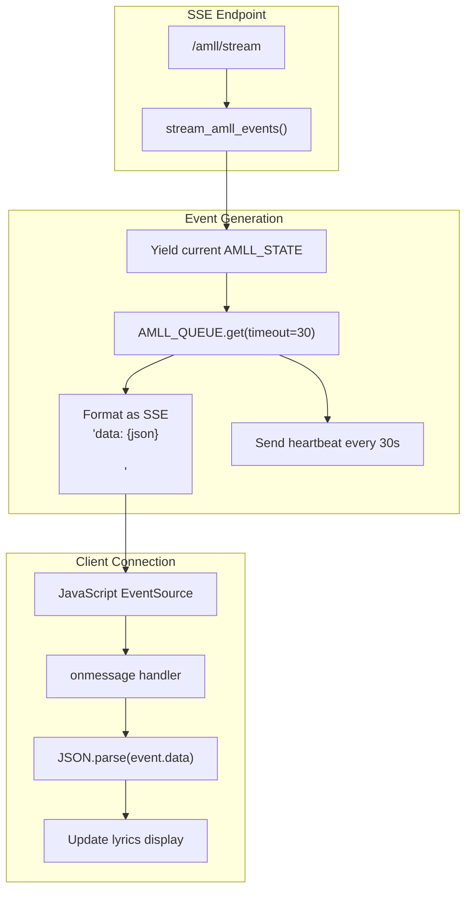

**Stream Implementation:**

1. Immediately yields current `AMLL_STATE` as snapshot
2. Blocks on `AMLL_QUEUE.get(timeout=30)`
3. Formats events as `data: {json}\n\n` per SSE spec
4. Sends periodic heartbeats to keep connection alive
5. Uses `stream_with_context()` to maintain request context

**Event Format:**

```sql
{
  "type": "update",
  "song": {
    "musicName": "Song Title",
    "artists": ["Artist Name"],
    "duration": 240000,
    "cover": "/songs/cover.jpg"
  },
  "progress_ms": 15000,
  "lines": [...]
}
```

**Sources:** [backend.py L1644-L1651](https://github.com/HKLHaoBin/LyricSphere/blob/7864cfe0/backend.py#L1644-L1651)

 [backend.py L558-L570](https://github.com/HKLHaoBin/LyricSphere/blob/7864cfe0/backend.py#L558-L570)

 SSE endpoint in route definitions

---

## AI Translation System

The AI translation system integrates multiple AI providers for lyric translation with streaming support.

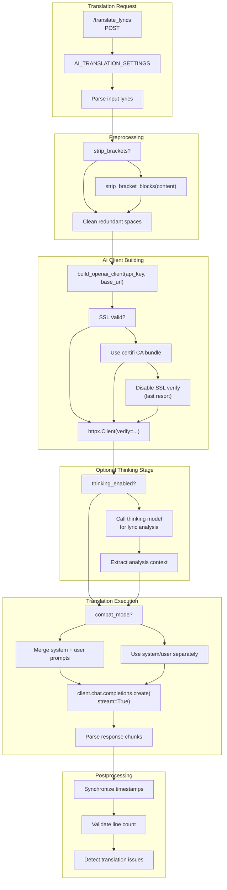

### AI Client Builder

The `build_openai_client()` function at [backend.py L910-L947](https://github.com/HKLHaoBin/LyricSphere/blob/7864cfe0/backend.py#L910-L947)

 implements a resilient SSL connection strategy:

1. **First Attempt**: Use default SSL verification
2. **Fallback 1**: Clear invalid SSL environment variables via `cleanup_missing_ssl_cert_env()`
3. **Fallback 2**: Use `certifi.where()` to locate CA bundle, create custom `httpx.Client`
4. **Fallback 3**: Disable SSL verification entirely (logs warning)

**Sources:** [backend.py L890-L947](https://github.com/HKLHaoBin/LyricSphere/blob/7864cfe0/backend.py#L890-L947)

### Translation Pipeline

**Settings Configuration** ([backend.py L1653-L1676](https://github.com/HKLHaoBin/LyricSphere/blob/7864cfe0/backend.py#L1653-L1676)

):

```
AI_TRANSLATION_SETTINGS = {
    'api_key': '',
    'system_prompt': '...',
    'provider': 'deepseek',
    'base_url': 'https://api.deepseek.com',
    'model': 'deepseek-reasoner',
    'expect_reasoning': True,
    'strip_brackets': False,
    'compat_mode': False,
    'thinking_enabled': True,
    'thinking_api_key': '',
    'thinking_provider': 'deepseek',
    'thinking_base_url': '...',
    'thinking_model': 'deepseek-reasoner',
    'thinking_system_prompt': '...'
}
```

**Thinking Model Integration:**
If `thinking_enabled` is true, the system:

1. Calls the thinking model with the full lyrics
2. Extracts analysis of themes, emotions, cultural context
3. Appends this context to the main translation prompt
4. Enhances translation quality through pre-analysis

**Bracket Stripping** ([backend.py L1810-L1822](https://github.com/HKLHaoBin/LyricSphere/blob/7864cfe0/backend.py#L1810-L1822)

):
Uses `str.translate()` with `BRACKET_TRANSLATION` table for high-performance bracket removal:

```
BRACKET_CHARACTERS = '()（）[]【】'
BRACKET_TRANSLATION = str.maketrans('', '', BRACKET_CHARACTERS)
```

This is significantly faster than regex-based approaches.

**Compatibility Mode:**
Some AI models don't support separate system/user messages. When `compat_mode` is true, the system prompt is merged into the user message.

**Sources:** [backend.py L1653-L1676](https://github.com/HKLHaoBin/LyricSphere/blob/7864cfe0/backend.py#L1653-L1676)

 [backend.py L1752-L1754](https://github.com/HKLHaoBin/LyricSphere/blob/7864cfe0/backend.py#L1752-L1754)

 [backend.py L1810-L1822](https://github.com/HKLHaoBin/LyricSphere/blob/7864cfe0/backend.py#L1810-L1822)

 [backend.py L890-L947](https://github.com/HKLHaoBin/LyricSphere/blob/7864cfe0/backend.py#L890-L947)

---

## Security and Path Management

### Path Security Architecture

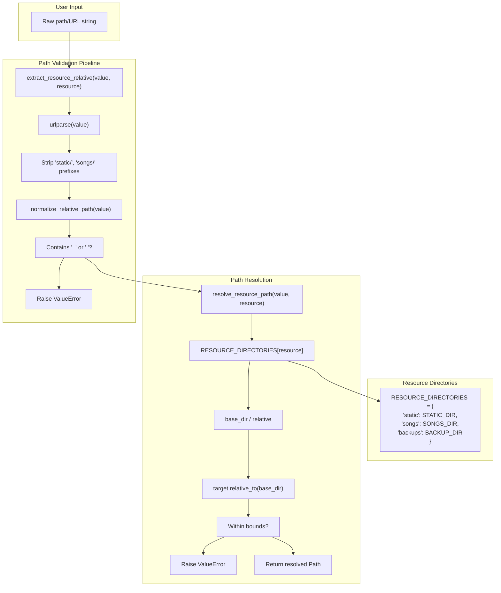

### Security Functions

**`sanitize_filename(value)`** ([backend.py L997-L1004](https://github.com/HKLHaoBin/LyricSphere/blob/7864cfe0/backend.py#L997-L1004)

):

* Removes dangerous characters via regex: `[^\w\u4e00-\u9fa5\-_. ]`
* Preserves spaces, hyphens, underscores, periods, and Unicode (Chinese characters)
* Replaces quotes with full-width equivalents to prevent injection

**`extract_resource_relative(value, resource)`** ([backend.py L1018-L1034](https://github.com/HKLHaoBin/LyricSphere/blob/7864cfe0/backend.py#L1018-L1034)

):

* Parses URL to extract path component
* Validates resource type against `RESOURCE_DIRECTORIES`
* Strips expected prefixes (e.g., `songs/`)
* Rejects absolute URLs without correct prefix
* Calls `_normalize_relative_path()` for segment validation

**`_normalize_relative_path(value)`** ([backend.py L1006-L1015](https://github.com/HKLHaoBin/LyricSphere/blob/7864cfe0/backend.py#L1006-L1015)

):

* Splits path into segments
* Rejects any segment that is `.` or `..` (path traversal prevention)
* Returns normalized forward-slash path

**`resolve_resource_path(value, resource)`** ([backend.py L1037-L1047](https://github.com/HKLHaoBin/LyricSphere/blob/7864cfe0/backend.py#L1037-L1047)

):

* Converts relative path to absolute `Path` object
* Resolves symlinks via `.resolve()`
* Validates result is within base directory using `.relative_to()`
* Raises `ValueError` if boundary check fails

**`resource_relative_from_path(path_value, resource)`** ([backend.py L1050-L1062](https://github.com/HKLHaoBin/LyricSphere/blob/7864cfe0/backend.py#L1050-L1062)

):

* Reverse operation: converts absolute path back to relative
* Validates path is within resource directory
* Returns normalized relative path string

**Sources:** [backend.py L988-L1062](https://github.com/HKLHaoBin/LyricSphere/blob/7864cfe0/backend.py#L988-L1062)

### Device Authentication

Device authentication uses bcrypt password hashing combined with trusted device management.

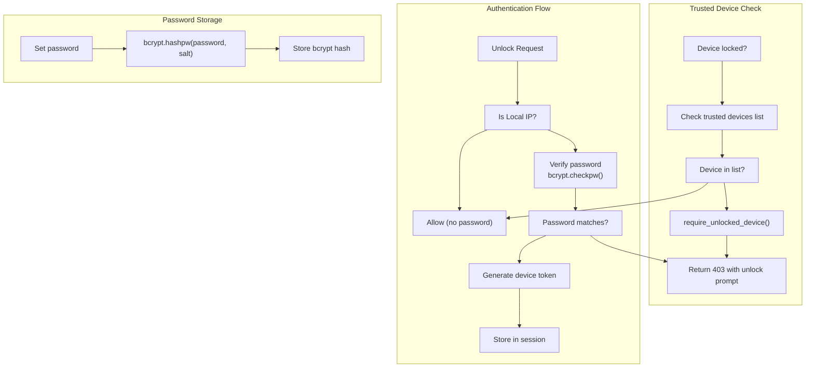

**Loopback Detection:**
The system checks for IPv4-mapped IPv6 addresses (e.g., `::ffff:127.0.0.1`) and standard loopback addresses to determine local access. Local requests bypass password requirements.

**bcrypt Integration:**

* Passwords are hashed using `bcrypt.hashpw()` with auto-generated salt
* Verification uses `bcrypt.checkpw()` for timing-attack resistance
* Hash stored in application state (not persisted to disk in base configuration)

**Trusted Devices:**
Client-side localStorage maintains a list of trusted device IDs. The `is_request_allowed()` function checks if the current device ID is in the trusted list before requiring password entry.

**Sources:** Referenced in security architecture, device authentication handlers in [backend.py](https://github.com/HKLHaoBin/LyricSphere/blob/7864cfe0/backend.py)

---

## Backup and Version Management

The backup system maintains automatic versioning with configurable retention limits.

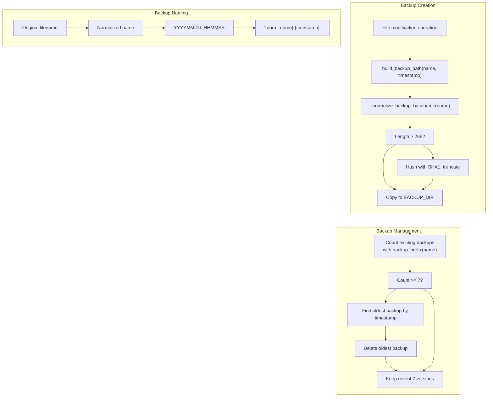

### Backup Functions

**`build_backup_path(name_or_path, timestamp, directory)`** ([backend.py L1318-L1330](https://github.com/HKLHaoBin/LyricSphere/blob/7864cfe0/backend.py#L1318-L1330)

):

* Extracts filename from path
* Normalizes via `_normalize_backup_basename()`
* Formats timestamp (default: `%Y%m%d_%H%M%S`)
* Returns `Path` object: `BACKUP_DIR / "{name}.{timestamp}"`

**`_normalize_backup_basename(original_name)`** ([backend.py L1299-L1315](https://github.com/HKLHaoBin/LyricSphere/blob/7864cfe0/backend.py#L1299-L1315)

):

* Ensures filename stays within 255-byte limit
* If too long: extracts suffix, generates 8-char SHA1 hash, truncates stem
* Result: `{truncated_stem}_{hash}{suffix}`
* Prevents filesystem errors from excessively long filenames

**`backup_prefix(name_or_path)`** ([backend.py L1333-L1336](https://github.com/HKLHaoBin/LyricSphere/blob/7864cfe0/backend.py#L1333-L1336)

):

* Returns normalized prefix for finding related backups
* Used to enumerate all versions of a file

**Rotation Strategy:**

1. Check existing backup count for file
2. If count >= 7, find oldest by parsing timestamp from filename
3. Delete oldest backup
4. Create new backup
5. Maintain circular buffer of 7 versions

**Sources:** [backend.py L1293-L1336](https://github.com/HKLHaoBin/LyricSphere/blob/7864cfe0/backend.py#L1293-L1336)

 [backend.py L1299-L1315](https://github.com/HKLHaoBin/LyricSphere/blob/7864cfe0/backend.py#L1299-L1315)

 [backend.py L1318-L1330](https://github.com/HKLHaoBin/LyricSphere/blob/7864cfe0/backend.py#L1318-L1330)

### Backup Integration

Most file write operations automatically create backups:

* JSON metadata updates
* Lyric file modifications
* Configuration changes
* Quick editor saves

**Example Pattern:**

```markdown
# Before writing file
backup_path = build_backup_path(target_path)
if target_path.exists():
    shutil.copy2(target_path, backup_path)

# Write new content
with open(target_path, 'w') as f:
    f.write(new_content)
```

**Sources:** Backup creation patterns throughout [backend.py](https://github.com/HKLHaoBin/LyricSphere/blob/7864cfe0/backend.py)

---

## Threading and Concurrency

The backend uses `ThreadPoolExecutor` for handling synchronous operations in an async context.

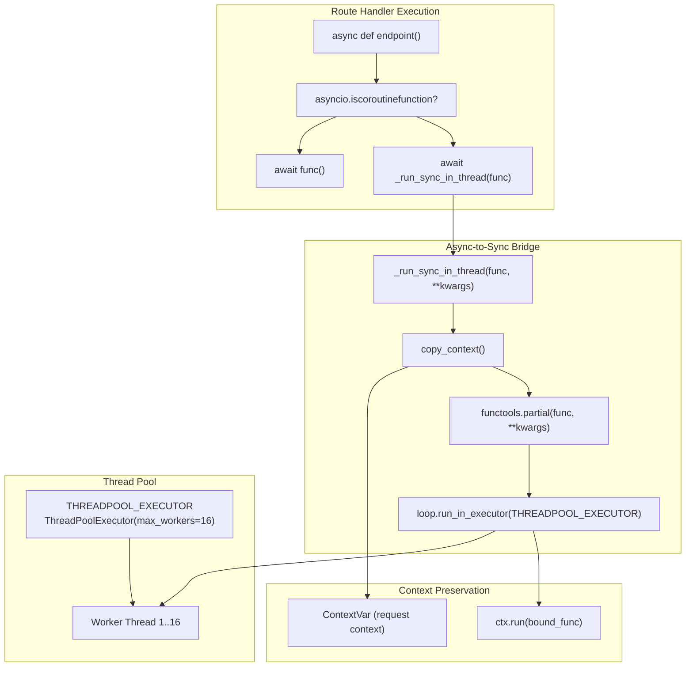

### Thread Pool Configuration

**Initialization** ([backend.py L885-L886](https://github.com/HKLHaoBin/LyricSphere/blob/7864cfe0/backend.py#L885-L886)

):

```
THREADPOOL_MAX_WORKERS = int(os.getenv("APP_THREADPOOL_WORKERS", "16"))
THREADPOOL_EXECUTOR = ThreadPoolExecutor(max_workers=THREADPOOL_MAX_WORKERS)
```

**Environment Variable:**

* `APP_THREADPOOL_WORKERS`: Sets thread pool size (default: 16)
* Configured based on expected concurrency and blocking I/O patterns

### Context Variable Propagation

**`_run_sync_in_thread(func, **kwargs)`** ([backend.py L741-L757](https://github.com/HKLHaoBin/LyricSphere/blob/7864cfe0/backend.py#L741-L757)

):

1. Captures current `copy_context()` (includes `_request_context`)
2. Creates `functools.partial` with bound arguments
3. Obtains running event loop
4. Executes `loop.run_in_executor(THREADPOOL_EXECUTOR, ctx.run, bound)`
5. Returns awaitable result

**Context Copying:**
The `copy_context()` function preserves all `ContextVar` values, ensuring thread-safe access to request data in worker threads. This allows synchronous route handlers to use the global `request` and `session` proxies.

**Usage in Routes** ([backend.py L801-L806](https://github.com/HKLHaoBin/LyricSphere/blob/7864cfe0/backend.py#L801-L806)

):

```python
async def endpoint(request: StarletteRequest):
    if asyncio.iscoroutinefunction(func):
        result = await func(**request.path_params)
    else:
        result = await _run_sync_in_thread(func, **request.path_params)
    return _normalize_response(result)
```

### Concurrency Patterns

**File Operations:**
Long-running file operations (backup creation, format conversion, ZIP extraction) execute in thread pool to avoid blocking the event loop.

**AI Translation:**
Streaming AI responses use thread pool for API calls while maintaining async generators for client streaming.

**WebSocket Handling:**
Each WebSocket connection runs in a dedicated async task, allowing concurrent connections without thread overhead.

**Beat Curve Tasks** ([backend.py L887-L888](https://github.com/HKLHaoBin/LyricSphere/blob/7864cfe0/backend.py#L887-L888)

):

```
BEAT_CURVE_TASKS: Dict[str, Dict[str, Any]] = {}
BEAT_CURVE_LOCK = threading.Lock()
```

Task state protected by `threading.Lock` for thread-safe access from both async and sync contexts.

**Sources:** [backend.py L741-L758](https://github.com/HKLHaoBin/LyricSphere/blob/7864cfe0/backend.py#L741-L758)

 [backend.py L885-L888](https://github.com/HKLHaoBin/LyricSphere/blob/7864cfe0/backend.py#L885-L888)

 [backend.py L801-L806](https://github.com/HKLHaoBin/LyricSphere/blob/7864cfe0/backend.py#L801-L806)

 [backend.py L1235-L1263](https://github.com/HKLHaoBin/LyricSphere/blob/7864cfe0/backend.py#L1235-L1263)

---

## Additional Components

### Quick Editor System

The Quick Editor provides an interactive interface for reordering and editing LYS format syllables.

**Document Structure:**

```css
QUICK_EDITOR_DOCS: Dict[str, Dict[str, Any]] = {}
# doc = {
#   "id": str,
#   "version": int,
#   "lines": [
#     {
#       "id": str,
#       "prefix": str,  # e.g., "[]", "[2]"
#       "is_meta": bool,
#       "tokens": [
#         {"id": str, "ts": "start,dur", "text": str}
#       ]
#     }
#   ]
# }
```

**Key Functions:**

* `qe_parse_lys(raw_text)`: Parses LYS text into structured document
* `qe_dump_lys(doc)`: Serializes document back to LYS format
* `qe_apply_move(doc, selection, target)`: Implements drag-and-drop reordering
* `qe_find_line(doc, line_id)`: Locates line by ID
* `qe_find_token_index(line, token_id)`: Locates token within line

**Undo/Redo System** ([backend.py L1846-L1849](https://github.com/HKLHaoBin/LyricSphere/blob/7864cfe0/backend.py#L1846-L1849)

):

```
QUICK_EDITOR_UNDO: Dict[str, List[Dict[str, Any]]] = {}
QUICK_EDITOR_REDO: Dict[str, List[Dict[str, Any]]] = {}
```

Each mutation clones the document state before modification, enabling full undo/redo history.

**Sources:** [backend.py L1846-L2290](https://github.com/HKLHaoBin/LyricSphere/blob/7864cfe0/backend.py#L1846-L2290)

 [backend.py L2003-L2290](https://github.com/HKLHaoBin/LyricSphere/blob/7864cfe0/backend.py#L2003-L2290)

### Animation Configuration Sync

The animation configuration system synchronizes timing parameters between frontend and backend.

**Configuration State** ([backend.py L1680-L1688](https://github.com/HKLHaoBin/LyricSphere/blob/7864cfe0/backend.py#L1680-L1688)

):

```
ANIMATION_CONFIG_DEFAULTS = {
    'enterDuration': 500,
    'moveDuration': 500,
    'exitDuration': 500,
    'placeholderDuration': 50,
    'lineDisplayOffset': 0.7,
    'useComputedDisappear': False
}
```

**Sync Endpoint:**
`POST /player/animation-config` updates global state and returns current configuration. Frontend reports its animation durations, backend uses these values in `compute_disappear_times()`.

**Thread Safety** ([backend.py L1689-L1691](https://github.com/HKLHaoBin/LyricSphere/blob/7864cfe0/backend.py#L1689-L1691)

):

```
_animation_config_state = dict(ANIMATION_CONFIG_DEFAULTS)
_animation_config_lock = threading.Lock()
_animation_config_last_update = 0.0
```

**Sources:** [backend.py L1678-L1738](https://github.com/HKLHaoBin/LyricSphere/blob/7864cfe0/backend.py#L1678-L1738)

---

This comprehensive documentation covers the core backend architecture, processing pipelines, real-time communication systems, security measures, and utility components that power the LyricSphere application.