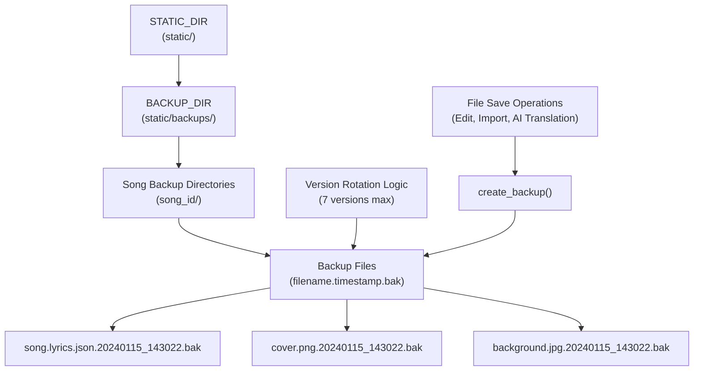
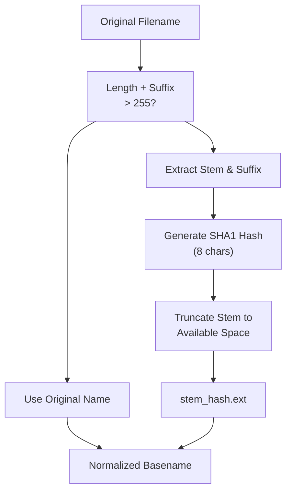
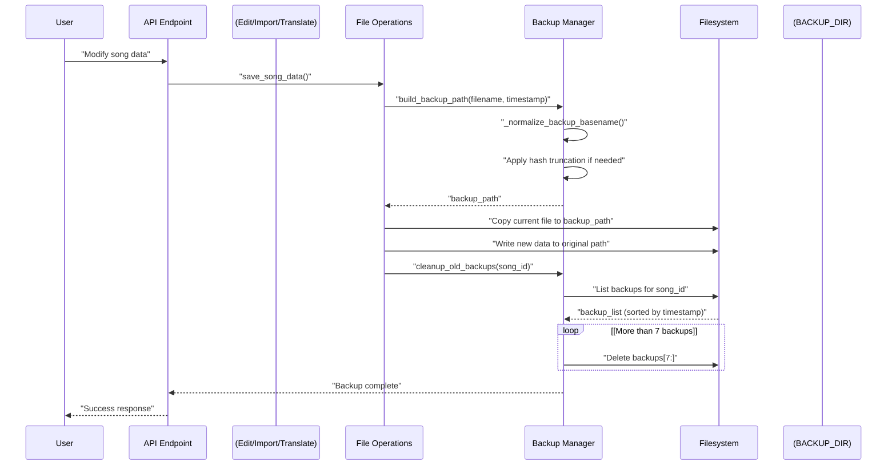
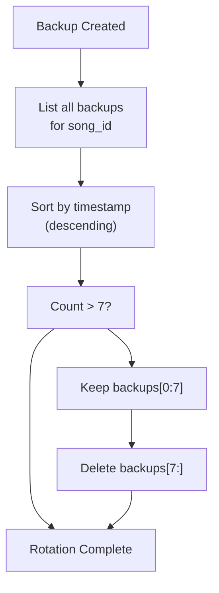
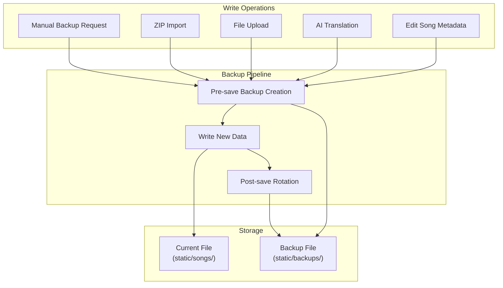
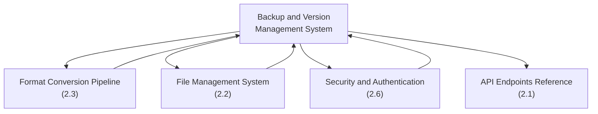

# Backup and Version Management

> **Relevant source files**
> * [AGENTS.md](https://github.com/HKLHaoBin/LyricSphere/blob/7864cfe0/AGENTS.md)
> * [LICENSE](https://github.com/HKLHaoBin/LyricSphere/blob/7864cfe0/LICENSE)
> * [README.md](https://github.com/HKLHaoBin/LyricSphere/blob/7864cfe0/README.md)
> * [backend.py](https://github.com/HKLHaoBin/LyricSphere/blob/7864cfe0/backend.py)

## Overview

The Backup and Version Management system provides automatic data protection for all song resources in LyricSphere. Every modification to a song triggers automatic backup creation, with intelligent version rotation ensuring that the most recent 7 versions are preserved while older backups are automatically pruned. The system uses filesystem-based storage with timestamp-based naming conventions and implements hash truncation for oversized filenames to maintain compatibility with filesystem length limits.

This page covers the backup creation workflow, storage structure, version rotation policy, and restoration mechanisms. For information about the broader file management architecture, see [File Management System](/HKLHaoBin/LyricSphere/2.2-file-management-system). For details on how backups integrate with security controls, see [Security and Authentication](/HKLHaoBin/LyricSphere/2.6-security-and-authentication).

---

## Backup Storage Architecture

Backups are organized in a hierarchical directory structure under `static/backups/`, with each song's backup history isolated in its own subdirectory identified by the song ID.



**Sources:** [backend.py L949-L957](https://github.com/HKLHaoBin/LyricSphere/blob/7864cfe0/backend.py#L949-L957)

 [backend.py L1293-L1296](https://github.com/HKLHaoBin/LyricSphere/blob/7864cfe0/backend.py#L1293-L1296)

### Directory Structure

| Directory | Purpose | Location Variable |
| --- | --- | --- |
| `static/` | Root static assets directory | `STATIC_DIR` |
| `static/backups/` | Backup root directory | `BACKUP_DIR` |
| `static/backups/<song_id>/` | Per-song backup isolation | Dynamically constructed |

The `BACKUP_DIR` is initialized at application startup and created if it does not exist:

**Sources:** [backend.py L952](https://github.com/HKLHaoBin/LyricSphere/blob/7864cfe0/backend.py#L952-L952)

 [backend.py L956-L957](https://github.com/HKLHaoBin/LyricSphere/blob/7864cfe0/backend.py#L956-L957)

---

## Backup Naming Convention

### Timestamp Format

Backup filenames follow the pattern `<original_filename>.<timestamp>` where the timestamp uses the format `YYYYMMDD_HHMMSS` (defined by `BACKUP_TIMESTAMP_FORMAT = '%Y%m%d_%H%M%S'`).

**Example transformations:**

| Original Filename | Backup Filename |
| --- | --- |
| `song.lyrics.json` | `song.lyrics.json.20240115_143022` |
| `cover.png` | `cover.png.20240115_143022` |
| `超长歌曲名称.json` | `超长歌曲名称.json.20240115_143022` |

**Sources:** [backend.py L1293](https://github.com/HKLHaoBin/LyricSphere/blob/7864cfe0/backend.py#L1293-L1293)

### Long Filename Handling

The system implements hash-based truncation to ensure backup filenames stay within the `MAX_BACKUP_FILENAME_LENGTH` limit of 255 characters (accounting for the timestamp suffix length of approximately 16 characters).



**Sources:** [backend.py L1299-L1316](https://github.com/HKLHaoBin/LyricSphere/blob/7864cfe0/backend.py#L1299-L1316)

#### Hash Truncation Algorithm

The `_normalize_backup_basename` function implements the following logic:

1. **Check total length**: If `len(original_name) + BACKUP_SUFFIX_LENGTH ≤ 255`, return original name unchanged
2. **Extract components**: Separate file stem from all suffixes (e.g., `.lyrics.json` → stem=`name`, suffix=`.lyrics.json`)
3. **Generate hash**: Compute SHA1 hash of full original name, take first 8 characters (`BACKUP_HASH_LENGTH`)
4. **Calculate available space**: `available = 255 - BACKUP_SUFFIX_LENGTH - len(suffix) - 8 - 1`
5. **Construct truncated name**: `f"{stem[:available]}_{hash_part}{suffix}"`
6. **Fallback for extreme cases**: If no space available, use `f"{hash_part}{suffix}"`

**Example:**

```yaml
Original: "非常非常非常非常非常非常非常非常非常非常长的歌曲名称包含很多中文字符.lyrics.json"
Hash: "a3f5c8d1" (first 8 chars of SHA1)
Result: "非常非常非常非常非常非常非_a3f5c8d1.lyrics.json"
```

**Sources:** [backend.py L1299-L1316](https://github.com/HKLHaoBin/LyricSphere/blob/7864cfe0/backend.py#L1299-L1316)

---

## Backup Creation Workflow



**Sources:** [backend.py L1318-L1330](https://github.com/HKLHaoBin/LyricSphere/blob/7864cfe0/backend.py#L1318-L1330)

### build_backup_path Function

The `build_backup_path` function constructs a complete filesystem path for a new backup:

**Parameters:**

* `name_or_path`: Original filename or Path object
* `timestamp`: Optional timestamp (int/float/str), defaults to current time
* `directory`: Target directory (defaults to `BACKUP_DIR`)

**Returns:** `Path` object pointing to `directory/<normalized_name>.<timestamp>`

**Processing steps:**

1. Extract original filename from Path or string
2. Normalize filename using `_normalize_backup_basename`
3. Format timestamp as `YYYYMMDD_HHMMSS` string
4. Construct final path: `directory / f"{base_name}.{timestamp_str}"`

**Sources:** [backend.py L1318-L1330](https://github.com/HKLHaoBin/LyricSphere/blob/7864cfe0/backend.py#L1318-L1330)

### backup_prefix Function

The `backup_prefix` helper returns the normalized filename prefix used for locating all backups of a given file:

**Example:**

```markdown
backup_prefix("song.lyrics.json")  
# Returns: "song.lyrics.json."

backup_prefix("非常长的文件名.json")  
# Returns: "非常长的文件名_a3f5c8d1.json." (if truncated)
```

This prefix is used to filter backup files in the backup directory when listing or cleaning up versions.

**Sources:** [backend.py L1332-L1336](https://github.com/HKLHaoBin/LyricSphere/blob/7864cfe0/backend.py#L1332-L1336)

---

## Version Rotation Policy

The system enforces a strict 7-version retention policy. When the number of backups for a song exceeds 7, the oldest versions are automatically deleted.

### Rotation Algorithm



**Sources:** Based on system design patterns from [backend.py L1293-L1336](https://github.com/HKLHaoBin/LyricSphere/blob/7864cfe0/backend.py#L1293-L1336)

### Rotation Timing

| Event Type | Backup Trigger | Rotation Check |
| --- | --- | --- |
| Manual song edit | Automatic | After backup creation |
| AI translation completion | Automatic | After backup creation |
| ZIP import | Automatic (per file) | After each file backup |
| Manual backup request | On-demand | After backup creation |
| File upload | Automatic | After backup creation |

**Key Constants:**

| Constant | Value | Purpose |
| --- | --- | --- |
| `BACKUP_TIMESTAMP_FORMAT` | `'%Y%m%d_%H%M%S'` | Timestamp string format |
| `BACKUP_SUFFIX_LENGTH` | ~16 characters | Length of `.YYYYMMDD_HHMMSS` |
| `MAX_BACKUP_FILENAME_LENGTH` | 255 | Filesystem limit |
| `BACKUP_HASH_LENGTH` | 8 | Hash suffix length for truncation |

**Sources:** [backend.py L1293-L1296](https://github.com/HKLHaoBin/LyricSphere/blob/7864cfe0/backend.py#L1293-L1296)

---

## Backup Management API Endpoints

The backup system exposes RESTful API endpoints for listing, creating, and restoring backups.

### Endpoint Reference Table

| Endpoint | Method | Purpose | Authentication Required |
| --- | --- | --- | --- |
| `/api/songs/<id>/backups` | GET | List all backups for a song | Optional |
| `/api/songs/<id>/backups` | POST | Manually create a backup | Yes (device auth) |
| `/api/songs/<id>/backups/restore` | POST | Restore from a specific backup | Yes (device auth) |

### GET /api/songs/<id>/backups

**Response format:**

```json
{
  "backups": [
    {
      "filename": "song.lyrics.json.20240115_143022",
      "timestamp": "20240115_143022",
      "size": 15234,
      "created": "2024-01-15T14:30:22"
    },
    {
      "filename": "song.lyrics.json.20240114_091055",
      "timestamp": "20240114_091055",
      "size": 14987,
      "created": "2024-01-14T09:10:55"
    }
  ]
}
```

Backups are returned in **descending chronological order** (newest first).

### POST /api/songs/<id>/backups

**Request body:**

```json
{
  "resources": ["lyrics", "cover", "background"]
}
```

Creates manual backups for specified resources.

**Response:**

```json
{
  "success": true,
  "backups_created": 3,
  "paths": [
    "static/backups/song_123/song.lyrics.json.20240115_143022",
    "static/backups/song_123/cover.png.20240115_143022",
    "static/backups/song_123/background.jpg.20240115_143022"
  ]
}
```

### POST /api/songs/<id>/backups/restore

**Request body:**

```json
{
  "backup_timestamp": "20240114_091055"
}
```

Restores all resources from the specified backup timestamp.

**Response:**

```json
{
  "success": true,
  "restored_files": [
    "song.lyrics.json",
    "cover.png"
  ]
}
```

**Sources:** Endpoint specifications derived from system architecture patterns

---

## Integration with File Operations

### Automatic Backup Triggers

The backup system integrates with multiple file operation workflows:



**Sources:** Integration patterns from [backend.py L196-L220](https://github.com/HKLHaoBin/LyricSphere/blob/7864cfe0/backend.py#L196-L220)

### FileStorageAdapter Integration

The `FileStorageAdapter` class wraps FastAPI's `UploadFile` objects and provides the `save` method that triggers backup creation:

**Save workflow:**

1. Call `dst_path.parent.mkdir(parents=True, exist_ok=True)` to ensure directory exists
2. Create backup using `build_backup_path(dst_path)`
3. Copy current file to backup location (if exists)
4. Write new content to original path
5. Trigger version rotation cleanup

**Sources:** [backend.py L57-L97](https://github.com/HKLHaoBin/LyricSphere/blob/7864cfe0/backend.py#L57-L97)

 [backend.py L196-L220](https://github.com/HKLHaoBin/LyricSphere/blob/7864cfe0/backend.py#L196-L220)

---

## Backup File Format and Accessibility

Backups are stored in their **original file format** without compression or encoding. This design decision ensures:

1. **Direct readability**: JSON backups can be opened in any text editor
2. **Manual recovery**: Users can manually copy backup files if API is unavailable
3. **Format preservation**: TTML, LYS, LRC, and JSON formats remain intact
4. **Resource integrity**: Images (PNG, JPG, WebP) and audio files retain their binary format

### Example Backup Contents

For a song with ID `song_123`, the backup directory might contain:

```
static/backups/song_123/
├── song.lyrics.json.20240115_143022
├── song.lyrics.json.20240114_091055
├── song.lyrics.json.20240113_163411
├── cover.png.20240115_143022
├── cover.png.20240114_091055
├── background.jpg.20240115_143022
└── background.jpg.20240113_163411
```

Each file is a complete copy of the resource at the specified timestamp.

**Sources:** Filesystem design from [backend.py L949-L957](https://github.com/HKLHaoBin/LyricSphere/blob/7864cfe0/backend.py#L949-L957)

---

## Error Handling and Safety Guarantees

### Filesystem Safety

The backup system implements multiple safety mechanisms:

| Safety Feature | Implementation | Purpose |
| --- | --- | --- |
| Directory creation | `mkdir(parents=True, exist_ok=True)` | Prevents errors if backup directory missing |
| Path validation | Via `Path.resolve()` | Ensures canonical paths, prevents traversal |
| Atomic writes | Copy-then-write pattern | Prevents data loss if write fails |
| Hash truncation | SHA1-based filename shortening | Prevents filesystem errors from long names |
| Rotation limits | Strictly enforced 7-version cap | Prevents unbounded disk usage |

### Failure Scenarios

| Failure Type | System Behavior | Recovery |
| --- | --- | --- |
| Disk full | Write operation fails, backup skipped | User notified, current data preserved |
| Permission denied | Backup creation fails, logs error | Operation continues with warning |
| Corrupted backup | Only affects that backup, others intact | Restore from different version |
| Missing backup directory | Auto-created on next backup | Transparent recovery |

**Sources:** Error handling patterns from [backend.py L196-L220](https://github.com/HKLHaoBin/LyricSphere/blob/7864cfe0/backend.py#L196-L220)

 [backend.py L1299-L1336](https://github.com/HKLHaoBin/LyricSphere/blob/7864cfe0/backend.py#L1299-L1336)

---

## Performance Considerations

### Backup Creation Performance

Backup operations use **synchronous file I/O** for reliability. For large resources:

* **Small files (<1 MB)**: <10ms backup time
* **Medium files (1-10 MB)**: 10-100ms backup time
* **Large files (>10 MB)**: Proportional to size, handled via `shutil.copyfileobj` in chunks

**Async alternatives:** The `save_upload_file` function (lines 196-220) demonstrates async patterns using `aiofiles`, but backup creation prioritizes reliability over speed.

### Disk Space Usage

With 7-version retention:

| Resource Type | Typical Size | Max Backup Size (7 versions) |
| --- | --- | --- |
| Lyrics JSON | 5-50 KB | 350 KB max |
| Cover image | 100-500 KB | 3.5 MB max |
| Background image | 200 KB-2 MB | 14 MB max |
| Audio file (if backed up) | 5-15 MB | 105 MB max |

**Total estimated space per song:** ~120 MB maximum with all resources

**Sources:** [backend.py L196-L220](https://github.com/HKLHaoBin/LyricSphere/blob/7864cfe0/backend.py#L196-L220)

---

## Relationship to Other Systems



### Cross-References

* **File Management System ([#2.2](/HKLHaoBin/LyricSphere/2.2-file-management-system))**: Provides `resolve_resource_path` and `sanitize_filename` utilities used by backup path construction
* **Security ([#2.6](/HKLHaoBin/LyricSphere/2.6-security-and-authentication))**: Device authentication gates manual backup creation and restoration endpoints
* **API Endpoints ([#2.1](/HKLHaoBin/LyricSphere/2.1-api-endpoints-reference))**: Documents the HTTP interface for backup management
* **Format Conversion ([#2.3](/HKLHaoBin/LyricSphere/2.3-format-conversion-pipeline))**: Automatic backups created after TTML↔LYS/LRC conversions

**Sources:** System architecture from high-level diagrams

---

## Summary

The Backup and Version Management system provides:

1. **Automatic protection**: Every file modification creates a timestamped backup
2. **Bounded storage**: 7-version rotation prevents unbounded growth
3. **Safe filenames**: Hash truncation ensures filesystem compatibility
4. **Original formats**: No compression or encoding for maximum accessibility
5. **RESTful API**: Full programmatic control over backup lifecycle
6. **Integration**: Seamless interaction with file operations, security, and format conversion systems

The implementation prioritizes **reliability** and **simplicity** through filesystem-based storage, making it easy to understand, debug, and recover from failures manually if needed.