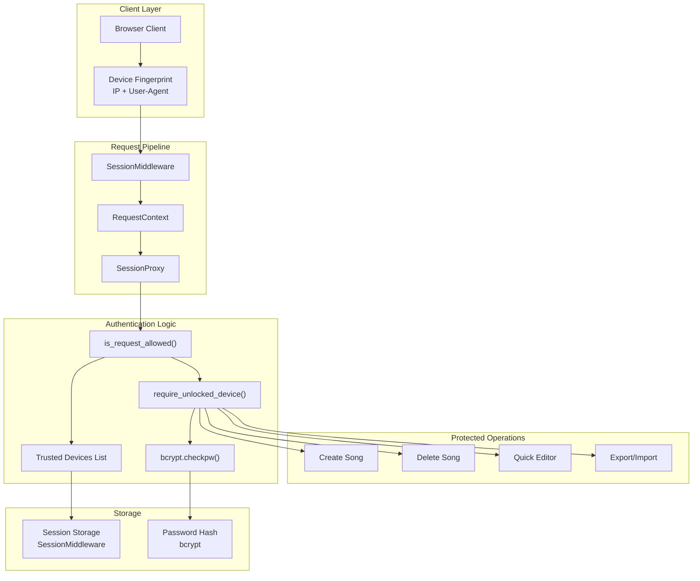
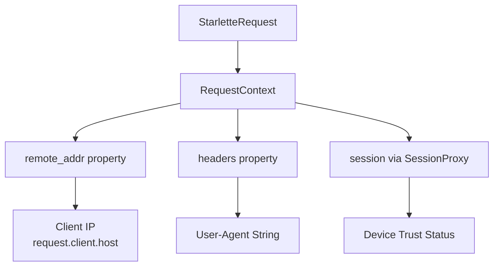
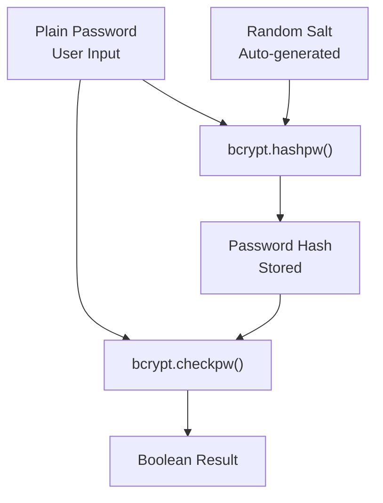
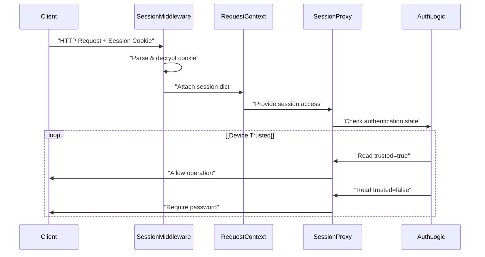
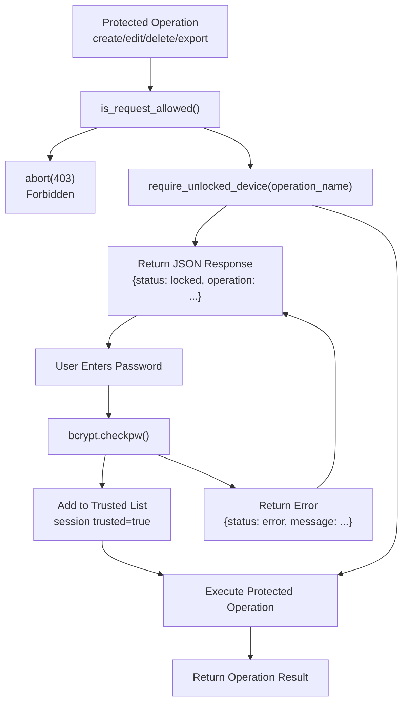
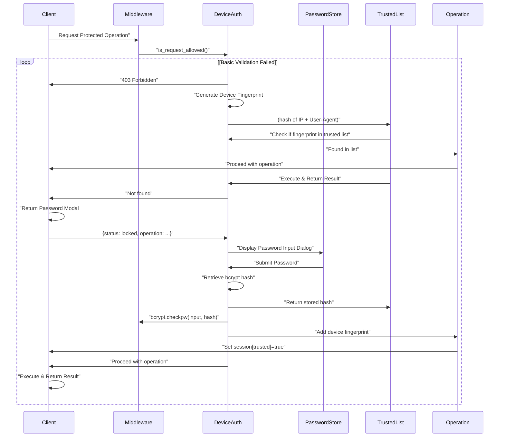
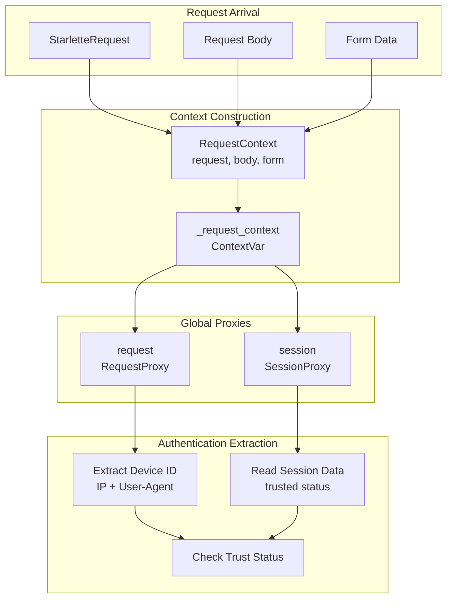
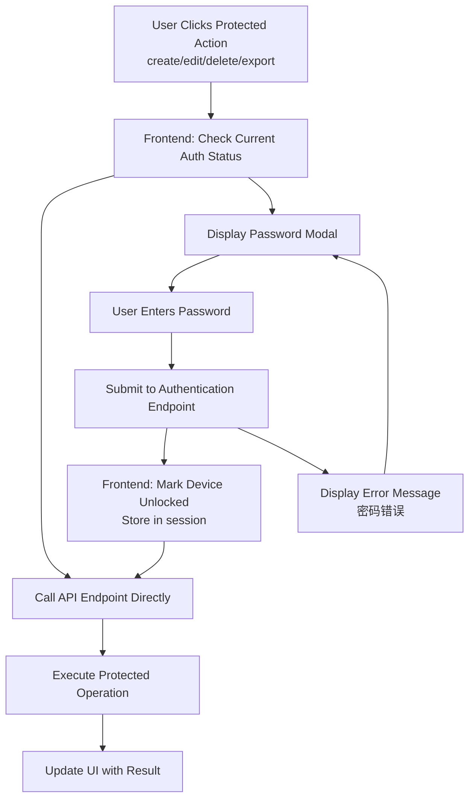
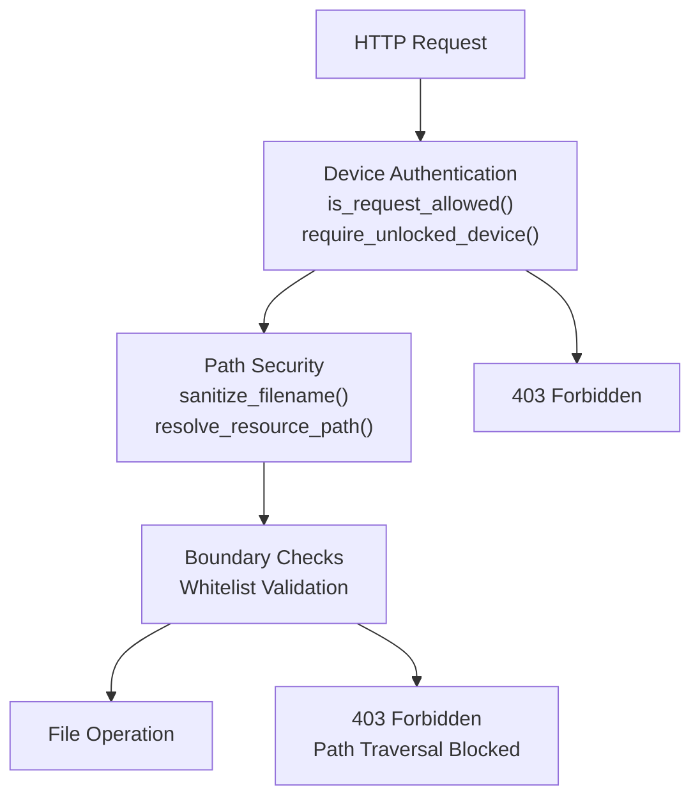

# Device Authentication

> **Relevant source files**
> * [CHANGELOG.md](https://github.com/HKLHaoBin/LyricSphere/blob/7864cfe0/CHANGELOG.md)
> * [backend.py](https://github.com/HKLHaoBin/LyricSphere/blob/7864cfe0/backend.py)

## Purpose and Scope

This document describes the device authentication system in LyricSphere, which provides secure access control through device fingerprinting and password verification. The system maintains a list of trusted devices to reduce frequent password prompts while ensuring only authorized devices can perform sensitive operations.

For information about path security and file access validation, see [Path Security and Validation](/HKLHaoBin/LyricSphere/2.6.2-path-security-and-validation). For general security architecture overview, see [Security and Authentication](/HKLHaoBin/LyricSphere/2.6-security-and-authentication).

## System Overview

The device authentication system implements a dual-layer security model combining device fingerprinting with password-based verification. Once a device is authenticated, it is added to a trusted devices list, allowing subsequent access without re-authentication while maintaining security through session management.

### Core Security Layers

1. **Device Fingerprinting**: Unique identification based on client IP address and User-Agent string
2. **Password Verification**: bcrypt-hashed password validation for initial trust establishment
3. **Trusted Device Management**: Persistent tracking of authenticated devices across sessions
4. **Session-based State**: Per-device authentication state maintained through encrypted session cookies

**Sources**: [backend.py L8](https://github.com/HKLHaoBin/LyricSphere/blob/7864cfe0/backend.py#L8-L8)

 [backend.py L31](https://github.com/HKLHaoBin/LyricSphere/blob/7864cfe0/backend.py#L31-L31)

 [backend.py L862](https://github.com/HKLHaoBin/LyricSphere/blob/7864cfe0/backend.py#L862-L862)

 [CHANGELOG.md L157-L159](https://github.com/HKLHaoBin/LyricSphere/blob/7864cfe0/CHANGELOG.md#L157-L159)

## Architecture Overview

### Component Interaction Diagram



**Sources**: [backend.py L8](https://github.com/HKLHaoBin/LyricSphere/blob/7864cfe0/backend.py#L8-L8)

 [backend.py L31](https://github.com/HKLHaoBin/LyricSphere/blob/7864cfe0/backend.py#L31-L31)

 [backend.py L466-L546](https://github.com/HKLHaoBin/LyricSphere/blob/7864cfe0/backend.py#L466-L546)

 [backend.py L862](https://github.com/HKLHaoBin/LyricSphere/blob/7864cfe0/backend.py#L862-L862)

 [backend.py L2695-L2698](https://github.com/HKLHaoBin/LyricSphere/blob/7864cfe0/backend.py#L2695-L2698)

## Device Fingerprinting

### Fingerprint Components

The system generates a unique device identifier by extracting and combining multiple request attributes:

| Component | Source | Purpose |
| --- | --- | --- |
| **Client IP** | `request.remote_addr` | Primary device identifier |
| **User-Agent** | `request.headers['User-Agent']` | Browser/client differentiation |
| **Session Cookie** | `SessionMiddleware` | Persistent session tracking |

### Request Property Extraction

The `RequestContext` class provides access to fingerprinting data:



The fingerprint serves multiple purposes:

* Identify returning devices without re-authentication
* Maintain separate trusted device lists per unique identifier
* Track device-specific authentication state
* Enable device revocation without affecting other devices

**Sources**: [backend.py L278-L427](https://github.com/HKLHaoBin/LyricSphere/blob/7864cfe0/backend.py#L278-L427)

 [backend.py L365-L371](https://github.com/HKLHaoBin/LyricSphere/blob/7864cfe0/backend.py#L365-L371)

 [backend.py L310-L316](https://github.com/HKLHaoBin/LyricSphere/blob/7864cfe0/backend.py#L310-L316)

### IPv4-Mapped Address Handling

The system includes special handling for IPv4-mapped IPv6 addresses to prevent authentication bypass:

* Detects patterns like `::ffff:127.0.0.1`
* Normalizes to canonical IPv4 representation
* Prevents loopback address spoofing attacks

This is critical for deployments in dual-stack environments where clients may connect via either IPv4 or IPv6.

**Sources**: [CHANGELOG.md L16](https://github.com/HKLHaoBin/LyricSphere/blob/7864cfe0/CHANGELOG.md#L16-L16)

## Password Management

### Password Hashing with bcrypt

LyricSphere uses the bcrypt algorithm for secure password storage:



#### bcrypt Security Properties

| Property | Benefit |
| --- | --- |
| **Adaptive Cost Factor** | Computational difficulty scales with hardware advances |
| **Built-in Salting** | Each password hash includes unique random salt |
| **Timing-Attack Resistance** | Constant-time comparison prevents information leakage |
| **Collision Resistance** | Extremely low probability of hash collisions |

**Sources**: [backend.py L8](https://github.com/HKLHaoBin/LyricSphere/blob/7864cfe0/backend.py#L8-L8)

### Password Verification Process

During authentication, password verification follows a timing-attack-resistant process:

1. Retrieve stored bcrypt hash from persistent storage
2. Accept user-provided password input
3. Execute `bcrypt.checkpw(password.encode('utf-8'), stored_hash)`
4. Return boolean success/failure without leaking timing information

The bcrypt library ensures constant-time comparison regardless of where password mismatch occurs, preventing attackers from inferring password correctness through timing analysis.

**Sources**: [backend.py L8](https://github.com/HKLHaoBin/LyricSphere/blob/7864cfe0/backend.py#L8-L8)

## Session Management

### SessionMiddleware Integration



The application configures the session middleware at startup:

```
app.add_middleware(SessionMiddleware, secret_key=app.secret_key)
```

Configuration properties:

* **Secret Key**: HMAC signing key for session cookie integrity (`app.secret_key`)
* **Cookie Name**: Default `session` identifier
* **Same-Site Policy**: Controls cross-site cookie transmission
* **Secure Flag**: Should be enabled in production (HTTPS only)

**Sources**: [backend.py L31](https://github.com/HKLHaoBin/LyricSphere/blob/7864cfe0/backend.py#L31-L31)

 [backend.py L861-L862](https://github.com/HKLHaoBin/LyricSphere/blob/7864cfe0/backend.py#L861-L862)

### SessionProxy Class

The `SessionProxy` class provides a dictionary-like interface to session data:

| Method | Signature | Purpose | Example Usage |
| --- | --- | --- | --- |
| `__getitem__` | `session[key]` | Get session value (raises KeyError if missing) | `session['device_id']` |
| `__setitem__` | `session[key] = value` | Set session value | `session['trusted'] = True` |
| `get` | `session.get(key, default)` | Safe retrieval with default | `session.get('device_id', None)` |
| `pop` | `session.pop(key, default)` | Remove and return value | `session.pop('temp_data')` |
| `clear` | `session.clear()` | Clear all session data | `session.clear()` |
| `__contains__` | `key in session` | Check key existence | `if 'trusted' in session` |

**Implementation Detail**: The proxy safely handles missing request contexts by returning empty dictionaries instead of raising exceptions, preventing authentication failures from causing application crashes.

**Sources**: [backend.py L466-L546](https://github.com/HKLHaoBin/LyricSphere/blob/7864cfe0/backend.py#L466-L546)

### Session Data Structure

Session state for authenticated devices typically includes:

```json
{
    "device_fingerprint": "hash_of_ip_and_ua",
    "trusted": true,
    "first_auth_timestamp": 1699564800,
    "last_seen_timestamp": 1699651200,
    "device_nickname": "Optional User Label"
}
```

**Sources**: [backend.py L466-L546](https://github.com/HKLHaoBin/LyricSphere/blob/7864cfe0/backend.py#L466-L546)

## Trusted Device Management

### Device Trust Lifecycle

```css
#mermaid-v5nsl9rdnxk{font-family:ui-sans-serif,-apple-system,system-ui,Segoe UI,Helvetica;font-size:16px;fill:#333;}@keyframes edge-animation-frame{from{stroke-dashoffset:0;}}@keyframes dash{to{stroke-dashoffset:0;}}#mermaid-v5nsl9rdnxk .edge-animation-slow{stroke-dasharray:9,5!important;stroke-dashoffset:900;animation:dash 50s linear infinite;stroke-linecap:round;}#mermaid-v5nsl9rdnxk .edge-animation-fast{stroke-dasharray:9,5!important;stroke-dashoffset:900;animation:dash 20s linear infinite;stroke-linecap:round;}#mermaid-v5nsl9rdnxk .error-icon{fill:#dddddd;}#mermaid-v5nsl9rdnxk .error-text{fill:#222222;stroke:#222222;}#mermaid-v5nsl9rdnxk .edge-thickness-normal{stroke-width:1px;}#mermaid-v5nsl9rdnxk .edge-thickness-thick{stroke-width:3.5px;}#mermaid-v5nsl9rdnxk .edge-pattern-solid{stroke-dasharray:0;}#mermaid-v5nsl9rdnxk .edge-thickness-invisible{stroke-width:0;fill:none;}#mermaid-v5nsl9rdnxk .edge-pattern-dashed{stroke-dasharray:3;}#mermaid-v5nsl9rdnxk .edge-pattern-dotted{stroke-dasharray:2;}#mermaid-v5nsl9rdnxk .marker{fill:#999;stroke:#999;}#mermaid-v5nsl9rdnxk .marker.cross{stroke:#999;}#mermaid-v5nsl9rdnxk svg{font-family:ui-sans-serif,-apple-system,system-ui,Segoe UI,Helvetica;font-size:16px;}#mermaid-v5nsl9rdnxk p{margin:0;}#mermaid-v5nsl9rdnxk defs #statediagram-barbEnd{fill:#999;stroke:#999;}#mermaid-v5nsl9rdnxk g.stateGroup text{fill:#dddddd;stroke:none;font-size:10px;}#mermaid-v5nsl9rdnxk g.stateGroup text{fill:#333;stroke:none;font-size:10px;}#mermaid-v5nsl9rdnxk g.stateGroup .state-title{font-weight:bolder;fill:#333;}#mermaid-v5nsl9rdnxk g.stateGroup rect{fill:#ffffff;stroke:#dddddd;}#mermaid-v5nsl9rdnxk g.stateGroup line{stroke:#999;stroke-width:1;}#mermaid-v5nsl9rdnxk .transition{stroke:#999;stroke-width:1;fill:none;}#mermaid-v5nsl9rdnxk .stateGroup .composit{fill:#f4f4f4;border-bottom:1px;}#mermaid-v5nsl9rdnxk .stateGroup .alt-composit{fill:#e0e0e0;border-bottom:1px;}#mermaid-v5nsl9rdnxk .state-note{stroke:#e6d280;fill:#fff5ad;}#mermaid-v5nsl9rdnxk .state-note text{fill:#333;stroke:none;font-size:10px;}#mermaid-v5nsl9rdnxk .stateLabel .box{stroke:none;stroke-width:0;fill:#ffffff;opacity:0.5;}#mermaid-v5nsl9rdnxk .edgeLabel .label rect{fill:#ffffff;opacity:0.5;}#mermaid-v5nsl9rdnxk .edgeLabel{background-color:#ffffff;text-align:center;}#mermaid-v5nsl9rdnxk .edgeLabel p{background-color:#ffffff;}#mermaid-v5nsl9rdnxk .edgeLabel rect{opacity:0.5;background-color:#ffffff;fill:#ffffff;}#mermaid-v5nsl9rdnxk .edgeLabel .label text{fill:#333;}#mermaid-v5nsl9rdnxk .label div .edgeLabel{color:#333;}#mermaid-v5nsl9rdnxk .stateLabel text{fill:#333;font-size:10px;font-weight:bold;}#mermaid-v5nsl9rdnxk .node circle.state-start{fill:#999;stroke:#999;}#mermaid-v5nsl9rdnxk .node .fork-join{fill:#999;stroke:#999;}#mermaid-v5nsl9rdnxk .node circle.state-end{fill:#dddddd;stroke:#f4f4f4;stroke-width:1.5;}#mermaid-v5nsl9rdnxk .end-state-inner{fill:#f4f4f4;stroke-width:1.5;}#mermaid-v5nsl9rdnxk .node rect{fill:#ffffff;stroke:#dddddd;stroke-width:1px;}#mermaid-v5nsl9rdnxk .node polygon{fill:#ffffff;stroke:#dddddd;stroke-width:1px;}#mermaid-v5nsl9rdnxk #statediagram-barbEnd{fill:#999;}#mermaid-v5nsl9rdnxk .statediagram-cluster rect{fill:#ffffff;stroke:#dddddd;stroke-width:1px;}#mermaid-v5nsl9rdnxk .cluster-label,#mermaid-v5nsl9rdnxk .nodeLabel{color:#333;}#mermaid-v5nsl9rdnxk .statediagram-cluster rect.outer{rx:5px;ry:5px;}#mermaid-v5nsl9rdnxk .statediagram-state .divider{stroke:#dddddd;}#mermaid-v5nsl9rdnxk .statediagram-state .title-state{rx:5px;ry:5px;}#mermaid-v5nsl9rdnxk .statediagram-cluster.statediagram-cluster .inner{fill:#f4f4f4;}#mermaid-v5nsl9rdnxk .statediagram-cluster.statediagram-cluster-alt .inner{fill:#f8f8f8;}#mermaid-v5nsl9rdnxk .statediagram-cluster .inner{rx:0;ry:0;}#mermaid-v5nsl9rdnxk .statediagram-state rect.basic{rx:5px;ry:5px;}#mermaid-v5nsl9rdnxk .statediagram-state rect.divider{stroke-dasharray:10,10;fill:#f8f8f8;}#mermaid-v5nsl9rdnxk .note-edge{stroke-dasharray:5;}#mermaid-v5nsl9rdnxk .statediagram-note rect{fill:#fff5ad;stroke:#e6d280;stroke-width:1px;rx:0;ry:0;}#mermaid-v5nsl9rdnxk .statediagram-note rect{fill:#fff5ad;stroke:#e6d280;stroke-width:1px;rx:0;ry:0;}#mermaid-v5nsl9rdnxk .statediagram-note text{fill:#333;}#mermaid-v5nsl9rdnxk .statediagram-note .nodeLabel{color:#333;}#mermaid-v5nsl9rdnxk .statediagram .edgeLabel{color:red;}#mermaid-v5nsl9rdnxk #dependencyStart,#mermaid-v5nsl9rdnxk #dependencyEnd{fill:#999;stroke:#999;stroke-width:1;}#mermaid-v5nsl9rdnxk .statediagramTitleText{text-anchor:middle;font-size:18px;fill:#333;}#mermaid-v5nsl9rdnxk :root{--mermaid-font-family:"trebuchet ms",verdana,arial,sans-serif;}"First Access""Requires Authentication""User Enters Password""bcrypt.checkpw() Success""Verification Failed""Subsequent Requests""Session Valid""Manual Removal""Trust Revoked""Operation Complete"NewDevicePasswordPromptPasswordVerificationTrustedDeviceAccessGrantedDeviceRevokedDevice stored intrusted devices listSession marked withtrusted=true flagTiming-attack resistantbcrypt.checkpw() comparisonNo information leakage
```

**Sources**: [backend.py L8](https://github.com/HKLHaoBin/LyricSphere/blob/7864cfe0/backend.py#L8-L8)

 [CHANGELOG.md L157-L159](https://github.com/HKLHaoBin/LyricSphere/blob/7864cfe0/CHANGELOG.md#L157-L159)

### Trust Persistence

Device trust is maintained across server restarts through:

1. **Session Cookie**: Contains encrypted session identifier sent with each request
2. **Server-Side Session Store**: Maps session ID to device fingerprint and trust status
3. **Persistent Storage**: Trusted device list survives application restarts

Trust is bound to the specific device fingerprint, so:

* Changing IP address or browser may require re-authentication
* Multiple devices can be trusted simultaneously
* Each device maintains independent trust state

**Sources**: [backend.py L862](https://github.com/HKLHaoBin/LyricSphere/blob/7864cfe0/backend.py#L862-L862)

 [backend.py L466-L546](https://github.com/HKLHaoBin/LyricSphere/blob/7864cfe0/backend.py#L466-L546)

### Device Revocation

To remove a device from the trusted list:

1. User accesses device management interface (if available)
2. Selects device to revoke by fingerprint
3. System removes fingerprint from trusted list
4. Active session invalidated if device currently connected
5. Device requires password on next access attempt

This mechanism allows users to maintain control over which devices can access their LyricSphere instance.

**Sources**: [CHANGELOG.md L158](https://github.com/HKLHaoBin/LyricSphere/blob/7864cfe0/CHANGELOG.md#L158-L158)

## Protected Operations

### Access Control Pattern

All sensitive operations implement a two-tier protection pattern:



**Sources**: [backend.py L2695-L2698](https://github.com/HKLHaoBin/LyricSphere/blob/7864cfe0/backend.py#L2695-L2698)

 [backend.py L2716-L2718](https://github.com/HKLHaoBin/LyricSphere/blob/7864cfe0/backend.py#L2716-L2718)

 [CHANGELOG.md L22](https://github.com/HKLHaoBin/LyricSphere/blob/7864cfe0/CHANGELOG.md#L22-L22)

### Implementation Example

The quick editor endpoints demonstrate the standard protection pattern:

```python
@app.route('/quick-editor/api/load', methods=['POST'])
def quick_editor_load():
    if not is_request_allowed():
        return abort(403)
    locked_response = require_unlocked_device('快速编辑歌词')
    if locked_response:
        return locked_response
    # ... proceed with operation
```

This implements defense-in-depth:

1. **First tier** (`is_request_allowed()`): Basic request validation (CORS, origin checking)
2. **Second tier** (`require_unlocked_device()`): Device authentication and password verification

**Sources**: [backend.py L2693-L2709](https://github.com/HKLHaoBin/LyricSphere/blob/7864cfe0/backend.py#L2693-L2709)

 [backend.py L2713-L2731](https://github.com/HKLHaoBin/LyricSphere/blob/7864cfe0/backend.py#L2713-L2731)

### Protected Endpoint Categories

| Category | Operations | Example Endpoints | Protection Level |
| --- | --- | --- | --- |
| **Song Management** | Create, delete, rename songs | `/songs/create`, `/songs/delete` | Required |
| **Lyric Editing** | Edit lyrics, quick editor ops | `/quick-editor/api/load`, `/quick-editor/api/move` | Required |
| **Import/Export** | ZIP import, export share | `/import-from-zip`, `/export-share` | Required |
| **File Uploads** | Image, audio, lyrics uploads | File upload handlers | Required |
| **Configuration** | AI settings, security config | Settings update endpoints | Required |

All operations in these categories invoke `require_unlocked_device()` before execution.

**Sources**: [backend.py L2693-L2834](https://github.com/HKLHaoBin/LyricSphere/blob/7864cfe0/backend.py#L2693-L2834)

 [CHANGELOG.md L6-L11](https://github.com/HKLHaoBin/LyricSphere/blob/7864cfe0/CHANGELOG.md#L6-L11)

 [CHANGELOG.md L22](https://github.com/HKLHaoBin/LyricSphere/blob/7864cfe0/CHANGELOG.md#L22-L22)

## Complete Authentication Flow

### End-to-End Authentication Sequence



**Sources**: [backend.py L2695-L2698](https://github.com/HKLHaoBin/LyricSphere/blob/7864cfe0/backend.py#L2695-L2698)

 [backend.py L8](https://github.com/HKLHaoBin/LyricSphere/blob/7864cfe0/backend.py#L8-L8)

 [backend.py L466-L546](https://github.com/HKLHaoBin/LyricSphere/blob/7864cfe0/backend.py#L466-L546)

 [CHANGELOG.md L157-L159](https://github.com/HKLHaoBin/LyricSphere/blob/7864cfe0/CHANGELOG.md#L157-L159)

## Request Context Integration

### Context-Based Authentication Data

The authentication system integrates with `RequestContext` and related proxies:



### Request Context Properties for Authentication

| Property | Access Pattern | Authentication Use |
| --- | --- | --- |
| `remote_addr` | `request.remote_addr` | Primary device identifier (client IP) |
| `headers` | `request.headers['User-Agent']` | Secondary device identifier |
| `headers` | `request.headers['Origin']` | CORS validation |
| `session` | `session['trusted']` | Persistent trust state |

The `ContextVar` mechanism ensures thread-safe access to request data across async operations.

**Sources**: [backend.py L51](https://github.com/HKLHaoBin/LyricSphere/blob/7864cfe0/backend.py#L51-L51)

 [backend.py L278-L427](https://github.com/HKLHaoBin/LyricSphere/blob/7864cfe0/backend.py#L278-L427)

 [backend.py L429-L464](https://github.com/HKLHaoBin/LyricSphere/blob/7864cfe0/backend.py#L429-L464)

 [backend.py L466-L546](https://github.com/HKLHaoBin/LyricSphere/blob/7864cfe0/backend.py#L466-L546)

 [backend.py L365-L371](https://github.com/HKLHaoBin/LyricSphere/blob/7864cfe0/backend.py#L365-L371)

## Security Considerations

### Defense-in-Depth Strategy

The device authentication system implements multiple security layers following the defense-in-depth principle:

```
Layer 1: CORS Validation → Origin checking before device authentication
Layer 2: Device Fingerprinting → Multi-factor device identification  
Layer 3: Password Hashing → bcrypt with adaptive cost factor
Layer 4: Session Security → Encrypted session cookies with secret key
Layer 5: Operation Gating → Explicit unlock requirement for sensitive actions
```

**Sources**: [backend.py L1265-L1291](https://github.com/HKLHaoBin/LyricSphere/blob/7864cfe0/backend.py#L1265-L1291)

 [backend.py L862](https://github.com/HKLHaoBin/LyricSphere/blob/7864cfe0/backend.py#L862-L862)

 [CHANGELOG.md L157-L159](https://github.com/HKLHaoBin/LyricSphere/blob/7864cfe0/CHANGELOG.md#L157-L159)

### Threat Mitigation Matrix

| Threat | Mitigation Strategy | Implementation |
| --- | --- | --- |
| **Password Cracking** | bcrypt with high cost factor, salted hashes | `bcrypt.hashpw()` with auto-generated salt |
| **Session Hijacking** | Encrypted session cookies, device fingerprint binding | `SessionMiddleware` with secret key |
| **Replay Attacks** | Session expiry, device-bound sessions | Session timeout configuration |
| **Brute Force** | Rate limiting (via middleware), account lockout | Can be added via middleware |
| **CSRF** | Session-based authentication, CORS validation | CORS headers, origin checking |
| **Timing Attacks** | Constant-time password comparison | `bcrypt.checkpw()` constant-time |
| **Path Traversal** | Combined with path validation system | See [Path Security](/HKLHaoBin/LyricSphere/2.6.2-path-security-and-validation) |

**Sources**: [backend.py L8](https://github.com/HKLHaoBin/LyricSphere/blob/7864cfe0/backend.py#L8-L8)

 [backend.py L862](https://github.com/HKLHaoBin/LyricSphere/blob/7864cfe0/backend.py#L862-L862)

 [backend.py L1265-L1291](https://github.com/HKLHaoBin/LyricSphere/blob/7864cfe0/backend.py#L1265-L1291)

## Configuration and Deployment

### Environment Variables

| Variable | Purpose | Default | Production Recommendation |
| --- | --- | --- | --- |
| `SECRET_KEY` | Session encryption key | Auto-generated | Set strong random value |
| `CORS_ALLOW_ORIGINS` | Permitted request origins | `*` | Restrict to specific domains |
| `CORS_ALLOW_HEADERS` | Permitted headers | `Authorization,Content-Type` | Review and restrict |
| `CORS_ALLOW_METHODS` | Permitted HTTP methods | `GET,POST,PUT,DELETE,OPTIONS` | Restrict as needed |

### Production Deployment Checklist

* Set strong random `SECRET_KEY` (minimum 32 bytes)
* Restrict `CORS_ALLOW_ORIGINS` to specific domains (never `*`)
* Enable HTTPS for session cookie security
* Configure secure session cookie flags (`Secure`, `HttpOnly`, `SameSite`)
* Implement rate limiting middleware
* Enable audit logging for authentication events
* Set session timeout for idle sessions
* Configure password complexity requirements
* Test IPv4/IPv6 dual-stack scenarios

**Sources**: [backend.py L861-L862](https://github.com/HKLHaoBin/LyricSphere/blob/7864cfe0/backend.py#L861-L862)

 [backend.py L1215-L1222](https://github.com/HKLHaoBin/LyricSphere/blob/7864cfe0/backend.py#L1215-L1222)

 [CHANGELOG.md L159](https://github.com/HKLHaoBin/LyricSphere/blob/7864cfe0/CHANGELOG.md#L159-L159)

## Error Handling and User Experience

### Authentication Response Codes

| Scenario | HTTP Status | Response Format | Client Action |
| --- | --- | --- | --- |
| Request not allowed | 403 | `abort(403)` | Display error page |
| Device locked | 200 | `{status: "locked", operation: "..."}` | Show password modal |
| Wrong password | 200 | `{status: "error", message: "密码错误"}` | Show error, retry |
| No password set | 200 | Modal requesting initial setup | Prompt password creation |
| Operation success | 200 | Operation-specific response | Continue workflow |

The system returns 200 status for locked states to trigger client-side modals rather than error pages, providing better user experience.

**Sources**: [backend.py L2695-L2709](https://github.com/HKLHaoBin/LyricSphere/blob/7864cfe0/backend.py#L2695-L2709)

### User Interaction Flow



This flow minimizes user friction by checking authentication state before prompting for passwords, avoiding unnecessary interruptions for already-trusted devices.

**Sources**: [backend.py L2695-L2709](https://github.com/HKLHaoBin/LyricSphere/blob/7864cfe0/backend.py#L2695-L2709)

## Integration with Other Systems

### Relationship to Path Security

Device authentication and path security operate in sequence:



**Key Principle**: Even authenticated devices must pass path validation checks. Device trust does not bypass security boundaries.

See [Path Security and Validation](/HKLHaoBin/LyricSphere/2.6.2-path-security-and-validation) for detailed path validation mechanisms.

**Sources**: [backend.py L997-L1047](https://github.com/HKLHaoBin/LyricSphere/blob/7864cfe0/backend.py#L997-L1047)

 [backend.py L2695-L2698](https://github.com/HKLHaoBin/LyricSphere/blob/7864cfe0/backend.py#L2695-L2698)

 [CHANGELOG.md L14-L18](https://github.com/HKLHaoBin/LyricSphere/blob/7864cfe0/CHANGELOG.md#L14-L18)

### Integration with Real-time Communication

Real-time endpoints have varied authentication requirements:

| Endpoint | Protocol | Authentication |
| --- | --- | --- |
| `/amll/stream` | SSE | May use passive authentication |
| `:11444` WebSocket | WebSocket | Device authentication for connection |
| `/amll/state` | HTTP GET | Protected by device authentication |
| `/player/animation-config` | HTTP POST | Protected by device authentication |

See [Real-time Communication](/HKLHaoBin/LyricSphere/2.5-real-time-communication) for details on WebSocket and SSE systems.

**Sources**: [backend.py L1642-L1651](https://github.com/HKLHaoBin/LyricSphere/blob/7864cfe0/backend.py#L1642-L1651)