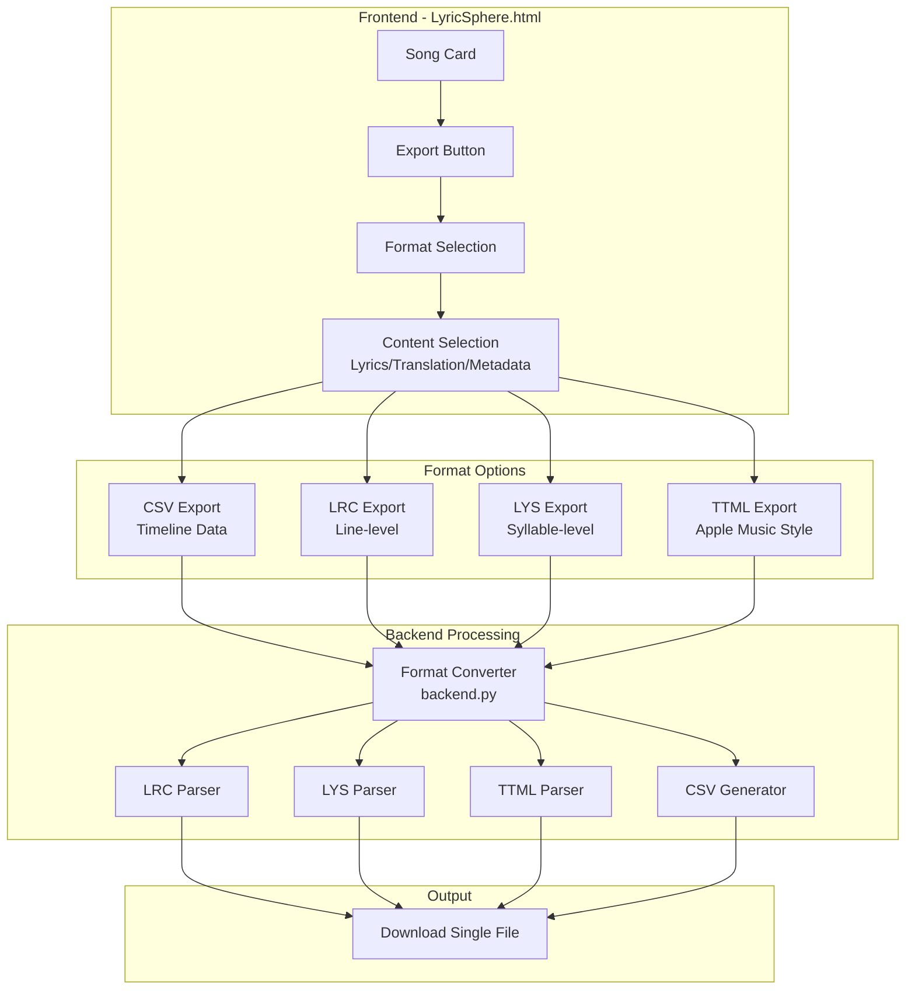
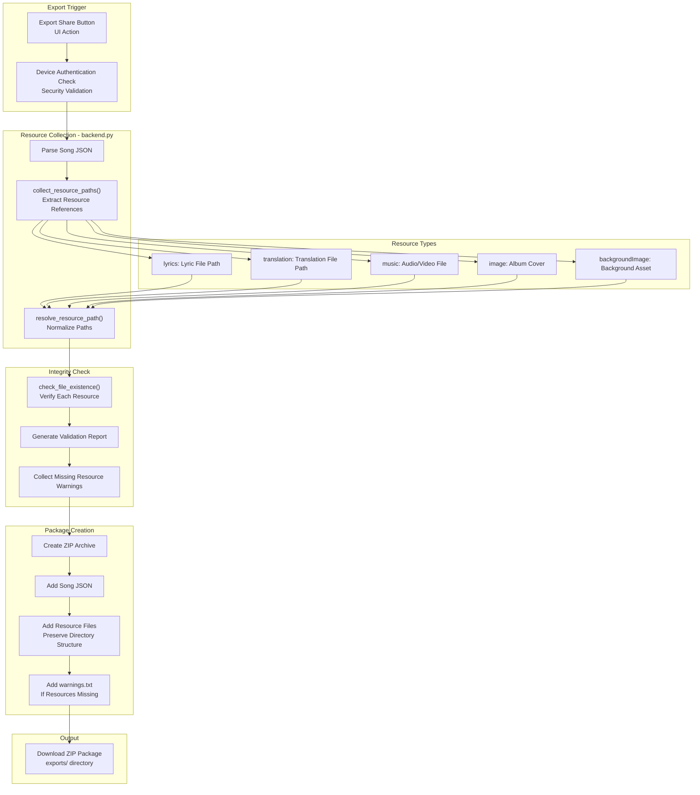
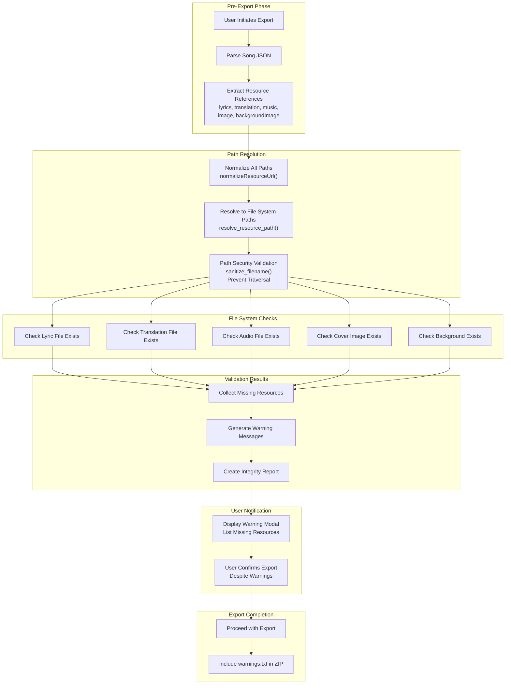
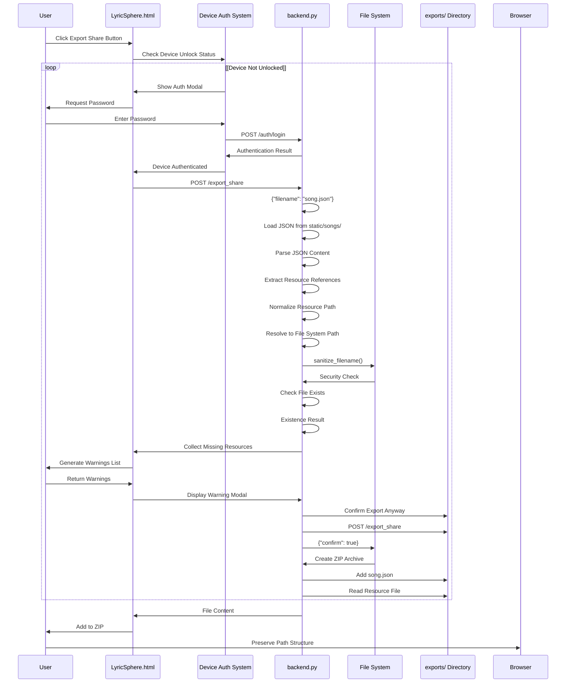
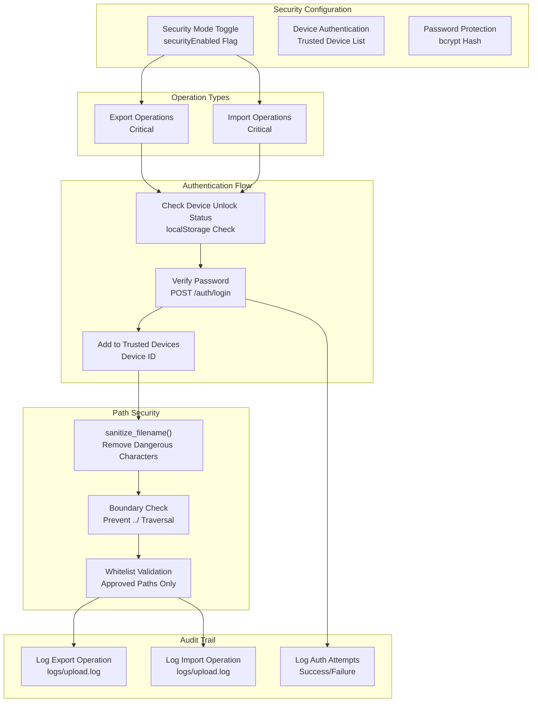

# Export and Sharing

> **Relevant source files**
> * [CHANGELOG.md](https://github.com/HKLHaoBin/LyricSphere/blob/7864cfe0/CHANGELOG.md)
> * [LICENSE](https://github.com/HKLHaoBin/LyricSphere/blob/7864cfe0/LICENSE)
> * [README.md](https://github.com/HKLHaoBin/LyricSphere/blob/7864cfe0/README.md)
> * [templates/LyricSphere.html](https://github.com/HKLHaoBin/LyricSphere/blob/7864cfe0/templates/LyricSphere.html)

## Purpose and Scope

This document describes LyricSphere's export and sharing functionality, which enables users to export lyric data in multiple formats and create shareable packages containing songs with all associated resources. The system includes resource integrity checking to ensure complete packages and supports both single-file exports and batch operations via ZIP archives.

For information about file management and resource path handling, see [File Management System](/HKLHaoBin/LyricSphere/2.2-file-management-system). For details on format conversion during export, see [Format Conversion Pipeline](/HKLHaoBin/LyricSphere/2.3-format-conversion-pipeline).

---

## Export Formats Overview

LyricSphere supports exporting lyric data in four primary formats, each serving different use cases:

| Format | Type | Use Case | Content Support |
| --- | --- | --- | --- |
| CSV | Timeline data | Analysis, external processing | Syllable-level timestamps, text |
| LRC | Line-level lyrics | Standard music players | Line timestamps, background vocals, duets |
| LYS | Syllable-level lyrics | LyricSphere internal format | Syllable timing, metadata |
| TTML | XML-based format | Apple Music compatibility | Full feature set, XML structure |
| ZIP | Package archive | Sharing, backup | JSON + all resources |

All export operations require device authentication when security mode is enabled.

**Sources:** [README.md L17-L18](https://github.com/HKLHaoBin/LyricSphere/blob/7864cfe0/README.md#L17-L18)

 [README.md L110-L123](https://github.com/HKLHaoBin/LyricSphere/blob/7864cfe0/README.md#L110-L123)

 [CHANGELOG.md L6-L9](https://github.com/HKLHaoBin/LyricSphere/blob/7864cfe0/CHANGELOG.md#L6-L9)

---

## Single File Export Architecture

### Export Format Selection

The export system provides format conversion at export time, allowing users to export lyrics in any supported format regardless of the source format:



**Sources:** [templates/LyricSphere.html L1606-L1640](https://github.com/HKLHaoBin/LyricSphere/blob/7864cfe0/templates/LyricSphere.html#L1606-L1640)

 [README.md L124-L130](https://github.com/HKLHaoBin/LyricSphere/blob/7864cfe0/README.md#L124-L130)

### CSV Export Format

CSV exports provide a tabular representation of lyric timeline data, useful for analysis and external processing:

**CSV Structure:**

* Timestamp column (milliseconds)
* Text content column
* Type indicator (lyric/translation/background)
* Agent information (for duet support)

The CSV format flattens the hierarchical lyric structure into a linear timeline suitable for spreadsheet applications or data analysis tools.

**Sources:** [README.md L42](https://github.com/HKLHaoBin/LyricSphere/blob/7864cfe0/README.md#L42-L42)

---

## Share Package Export System

### ZIP Package Architecture

The share package system creates self-contained archives that include the song's JSON metadata and all referenced resource files:



**Sources:** [CHANGELOG.md L6-L9](https://github.com/HKLHaoBin/LyricSphere/blob/7864cfe0/CHANGELOG.md#L6-L9)

 [README.md L23-L24](https://github.com/HKLHaoBin/LyricSphere/blob/7864cfe0/README.md#L23-L24)

 [README.md L95-L108](https://github.com/HKLHaoBin/LyricSphere/blob/7864cfe0/README.md#L95-L108)

### Resource Path Management

The system uses resource path collection and normalization functions defined in the frontend to prepare resource lists for export:

**Resource Configuration Structure:**

```
RESOURCE_CONFIG = {
    songs: { base: backendRootUrl + '/songs/', path: '/songs/', name: 'songs' },
    static: { base: backendRootUrl + '/static/', path: '/static/', name: 'static' },
    backups: { base: backendRootUrl + '/backups/', path: '/backups/', name: 'backups' }
}
```

**Key Functions:**

* `normalizeResourceUrl(value, resourceKey)` - Converts various path formats to absolute URLs
* `stripResourcePrefix(value, resourceKey)` - Removes URL prefixes for storage
* `normalizeSongsUrl(value)` - Specialized function for song resource paths
* `stripSongsPrefix(value)` - Strips song directory prefixes

These functions handle multiple input formats:

* Absolute URLs with protocol and host
* Relative paths starting with `/`
* Resource-prefixed paths (e.g., `songs/filename.mp3`)
* Windows-style backslash paths (converted to forward slashes)

**Sources:** [templates/LyricSphere.html L2185-L2277](https://github.com/HKLHaoBin/LyricSphere/blob/7864cfe0/templates/LyricSphere.html#L2185-L2277)

 [CHANGELOG.md L14-L15](https://github.com/HKLHaoBin/LyricSphere/blob/7864cfe0/CHANGELOG.md#L14-L15)

### Image Format Validation

The export system validates image file extensions to ensure only supported formats are included in packages:

**Supported Image Formats:**

* JPG/JPEG
* PNG
* GIF
* WEBP

**Supported Video Formats (for backgrounds):**

* MP4
* WEBM
* OGG
* M4V
* MOV

The `hasValidImageExtension()` function provides unified validation across the system to prevent unsupported file types from being included in export packages.

**Sources:** [CHANGELOG.md L15-L16](https://github.com/HKLHaoBin/LyricSphere/blob/7864cfe0/CHANGELOG.md#L15-L16)

 [templates/LyricSphere.html L1786-L1788](https://github.com/HKLHaoBin/LyricSphere/blob/7864cfe0/templates/LyricSphere.html#L1786-L1788)

 [templates/LyricSphere.html L1800-L1802](https://github.com/HKLHaoBin/LyricSphere/blob/7864cfe0/templates/LyricSphere.html#L1800-L1802)

---

## Resource Integrity Checking

### Integrity Check Process

Before creating an export package, the system verifies that all referenced resources exist and are accessible:



**Sources:** [CHANGELOG.md L9](https://github.com/HKLHaoBin/LyricSphere/blob/7864cfe0/CHANGELOG.md#L9-L9)

 [README.md L24](https://github.com/HKLHaoBin/LyricSphere/blob/7864cfe0/README.md#L24-L24)

 [README.md L162-L165](https://github.com/HKLHaoBin/LyricSphere/blob/7864cfe0/README.md#L162-L165)

### Warning Generation

When resources are missing, the system generates detailed warnings that include:

1. **Resource Type** - Lyric file, translation, audio, image, or background
2. **Expected Path** - The path referenced in the JSON
3. **Normalized Path** - The resolved file system path
4. **Recommendation** - Suggested action (e.g., "Upload missing file" or "Update path")

Warnings are both displayed in the UI and included as a text file in the ZIP package for reference by recipients.

**Sources:** [CHANGELOG.md L9](https://github.com/HKLHaoBin/LyricSphere/blob/7864cfe0/CHANGELOG.md#L9-L9)

 [README.md L24](https://github.com/HKLHaoBin/LyricSphere/blob/7864cfe0/README.md#L24-L24)

---

## Export Workflow

### Complete Export Process

The following diagram illustrates the end-to-end export workflow from user action to file download:



**Sources:** [CHANGELOG.md L6-L10](https://github.com/HKLHaoBin/LyricSphere/blob/7864cfe0/CHANGELOG.md#L6-L10)

 [README.md L23-L24](https://github.com/HKLHaoBin/LyricSphere/blob/7864cfe0/README.md#L23-L24)

### Batch Export Operations

The system supports batch export to create packages containing multiple songs:

**Batch Export Features:**

1. **Multi-selection** - Select multiple songs from the song list
2. **Bulk resource collection** - Gather all resources for selected songs
3. **Consolidated integrity check** - Validate all resources in one pass
4. **Single archive** - Create one ZIP containing multiple songs with resources
5. **Batch warnings** - Generate comprehensive report for all missing resources

Batch exports use the same integrity checking and security validation as single exports but optimize resource collection by deduplicating shared resources (e.g., the same cover art used by multiple songs).

**Sources:** [README.md L23](https://github.com/HKLHaoBin/LyricSphere/blob/7864cfe0/README.md#L23-L23)

---

## Quick Import System

### ZIP Import Architecture

The import system provides the inverse operation of export, allowing users to quickly import song packages:

```mermaid
flowchart TD

ImportBtn["Quick Import Button"]
FileInput["staticZipInput<br>File Input Accept .zip"]
UserSelect["User Selects ZIP File"]
AuthCheck["Check Device Unlock<br>Require Authentication"]
PasswordPrompt["Password Prompt Modal<br>If Not Unlocked"]
UploadZIP["POST /import_static<br>Upload ZIP File"]
ExtractZIP["Extract ZIP Archive<br>Temporary Directory"]
ValidateStructure["Validate ZIP Structure<br>Check for JSON Files"]
ParseJSONs["Parse All JSON Files"]
ExtractResources["Extract Resource Files"]
ValidatePaths["Validate Resource Paths<br>sanitize_filename()"]
CheckConflicts["Check for Existing Files<br>Name Conflicts"]
CopyJSON["Copy JSON to static/songs/"]
CopyResources["Copy Resources<br>Preserve Directory Structure"]
UpdatePaths["Update Resource Paths<br>If Necessary"]
CreateBackup["Create Backup<br>Of Existing Files If Overwrite"]
RefreshUI["Refresh Song List"]
ShowSummary["Display Import Summary<br>Success/Warning Messages"]
LogOperation["Log Import Operation<br>logs/upload.log"]

UserSelect --> AuthCheck
PasswordPrompt --> UploadZIP
ValidateStructure --> ParseJSONs
CheckConflicts --> CopyJSON
CheckConflicts --> CreateBackup
UpdatePaths --> RefreshUI

subgraph Post-Import ["Post-Import"]
    RefreshUI
    ShowSummary
    LogOperation
    RefreshUI --> ShowSummary
    ShowSummary --> LogOperation
end

subgraph subGraph4 ["File System Operations"]
    CopyJSON
    CopyResources
    UpdatePaths
    CreateBackup
    CreateBackup --> CopyJSON
    CopyJSON --> CopyResources
    CopyResources --> UpdatePaths
end

subgraph subGraph3 ["File Processing"]
    ParseJSONs
    ExtractResources
    ValidatePaths
    CheckConflicts
    ParseJSONs --> ExtractResources
    ExtractResources --> ValidatePaths
    ValidatePaths --> CheckConflicts
end

subgraph subGraph2 ["Import Processing - backend.py"]
    UploadZIP
    ExtractZIP
    ValidateStructure
    UploadZIP --> ExtractZIP
    ExtractZIP --> ValidateStructure
end

subgraph subGraph1 ["Security Validation"]
    AuthCheck
    PasswordPrompt
    AuthCheck --> PasswordPrompt
end

subgraph subGraph0 ["Import Trigger"]
    ImportBtn
    FileInput
    UserSelect
    ImportBtn --> FileInput
    FileInput --> UserSelect
end
```



**Sources:** [templates/LyricSphere.html L1545-L1547](https://github.com/HKLHaoBin/LyricSphere/blob/7864cfe0/templates/LyricSphere.html#L1545-L1547)

 [CHANGELOG.md L6](https://github.com/HKLHaoBin/LyricSphere/blob/7864cfe0/CHANGELOG.md#L6-L6)

 [README.md L23](https://github.com/HKLHaoBin/LyricSphere/blob/7864cfe0/README.md#L23-L23)

### Import Validation and Conflict Resolution

The import system performs several validation steps to ensure data integrity:

**Validation Checks:**

1. **ZIP Structure** - Verify valid ZIP format and structure
2. **JSON Validity** - Parse and validate all JSON files
3. **Resource References** - Verify resource paths in JSON are present in ZIP
4. **Path Security** - Apply `sanitize_filename()` to prevent path traversal
5. **Name Conflicts** - Detect existing files with same names

**Conflict Resolution:**

* **Automatic Backup** - Creates backup of existing file before overwrite (7-version rotation)
* **User Prompt** - Option to skip, overwrite, or rename conflicting files
* **Path Update** - Automatically adjusts resource paths if files are renamed

**Sources:** [README.md L26](https://github.com/HKLHaoBin/LyricSphere/blob/7864cfe0/README.md#L26-L26)

 [README.md L162-L165](https://github.com/HKLHaoBin/LyricSphere/blob/7864cfe0/README.md#L162-L165)

 [CHANGELOG.md L13-L14](https://github.com/HKLHaoBin/LyricSphere/blob/7864cfe0/CHANGELOG.md#L13-L14)

---

## Security and Authentication

### Export/Import Security Model

All export and import operations are subject to the security system's authentication requirements:



**Sources:** [README.md L23](https://github.com/HKLHaoBin/LyricSphere/blob/7864cfe0/README.md#L23-L23)

 [README.md L156-L166](https://github.com/HKLHaoBin/LyricSphere/blob/7864cfe0/README.md#L156-L166)

 [CHANGELOG.md L10-L11](https://github.com/HKLHaoBin/LyricSphere/blob/7864cfe0/CHANGELOG.md#L10-L11)

### Path Security Implementation

Export and import operations apply multiple layers of path security:

**Security Functions:**

* `sanitize_filename()` - Removes dangerous characters and path separators
* IPv4 mapped address detection - Prevents loopback bypass attempts
* Path traversal prevention - Blocks `../` sequences
* Whitelist validation - Ensures paths target allowed directories only

**Allowed Directories:**

* `static/songs/` - Song JSON and lyric files
* `static/` - Uploaded resources (audio, images)
* `exports/` - Generated export packages (read-only for users)

**Sources:** [README.md L162-L165](https://github.com/HKLHaoBin/LyricSphere/blob/7864cfe0/README.md#L162-L165)

 [CHANGELOG.md L13-L14](https://github.com/HKLHaoBin/LyricSphere/blob/7864cfe0/CHANGELOG.md#L13-L14)

---

## Storage and Output Locations

### Directory Structure

Export and import operations interact with specific directories in the LyricSphere file structure:

| Directory | Purpose | Access Level |
| --- | --- | --- |
| `static/songs/` | Song JSON files and lyrics | Read/Write (authenticated) |
| `static/` | Uploaded resources (audio, images, fonts) | Read/Write (authenticated) |
| `exports/` | Generated export packages (ZIP, CSV) | Write (system), Read (download) |
| `static/backups/` | Backup versions (7-version rotation) | Write (system), Read (restore) |
| `logs/` | Operation logs (`upload.log`) | Write (system), Read (admin) |

**Path Resolution:**
The system resolves resource paths through these configuration keys:

* `RESOURCE_CONFIG.songs` - Base URL and path for song resources
* `RESOURCE_CONFIG.static` - Base URL and path for static assets
* `RESOURCE_CONFIG.backups` - Base URL and path for backup files

**Sources:** [README.md L95-L108](https://github.com/HKLHaoBin/LyricSphere/blob/7864cfe0/README.md#L95-L108)

 [templates/LyricSphere.html L2190-L2196](https://github.com/HKLHaoBin/LyricSphere/blob/7864cfe0/templates/LyricSphere.html#L2190-L2196)

### Export File Naming

Export files follow consistent naming conventions:

**Single File Exports:**

* CSV: `{songname}_timeline.csv`
* LRC: `{songname}.lrc`
* LYS: `{songname}.lys`
* TTML: `{songname}.ttml`

**ZIP Package Exports:**

* Format: `{songname}_package.zip`
* Batch: `batch_export_{timestamp}.zip`

Long filenames are automatically truncated with hash suffixes to prevent file system issues (8-character hash appended to truncated names).

**Sources:** [README.md L26](https://github.com/HKLHaoBin/LyricSphere/blob/7864cfe0/README.md#L26-L26)

 [CHANGELOG.md L112-L113](https://github.com/HKLHaoBin/LyricSphere/blob/7864cfe0/CHANGELOG.md#L112-L113)