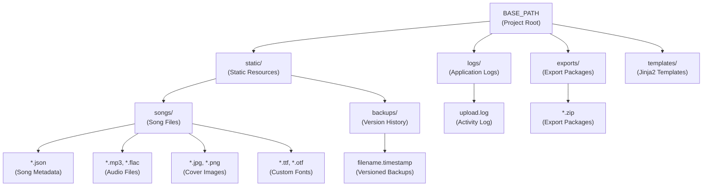
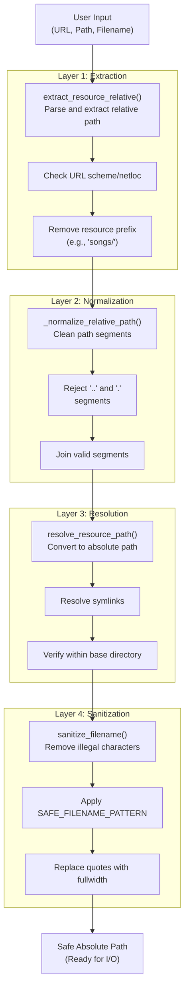
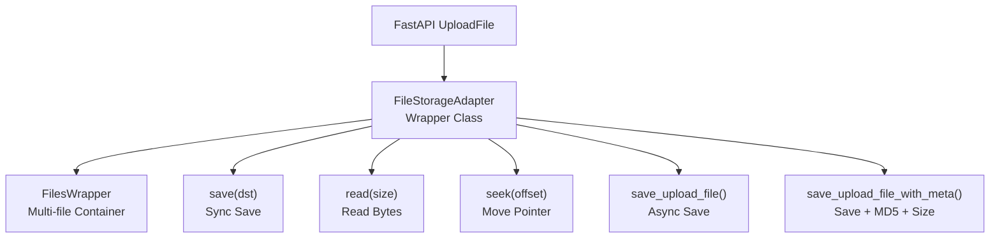
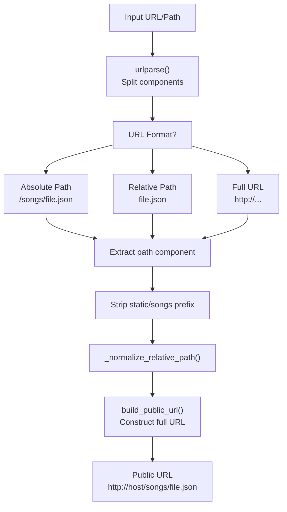
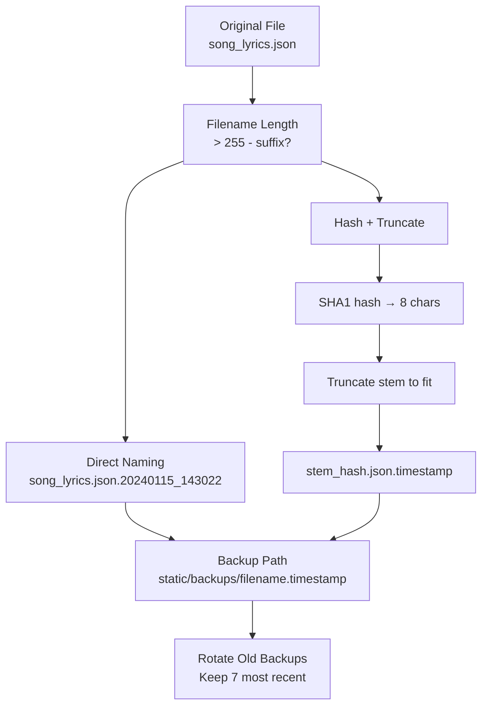

# File Management System

> **Relevant source files**
> * [AGENTS.md](https://github.com/HKLHaoBin/LyricSphere/blob/7864cfe0/AGENTS.md)
> * [LICENSE](https://github.com/HKLHaoBin/LyricSphere/blob/7864cfe0/LICENSE)
> * [README.md](https://github.com/HKLHaoBin/LyricSphere/blob/7864cfe0/README.md)
> * [backend.py](https://github.com/HKLHaoBin/LyricSphere/blob/7864cfe0/backend.py)

The File Management System manages all file storage, path resolution, and resource handling in LyricSphere. It provides a secure, organized structure for storing songs, backups, exports, and logs, with comprehensive path validation to prevent security vulnerabilities like path traversal attacks. The system supports both synchronous and asynchronous file operations with automatic backup rotation and filename sanitization.

For information about specific backup version management policies, see [Backup and Version Management](/HKLHaoBin/LyricSphere/2.7-backup-and-version-management). For details on security validation and authentication, see [Path Security and Validation](/HKLHaoBin/LyricSphere/2.6.2-path-security-and-validation).

## Directory Structure

LyricSphere organizes files into a hierarchical directory structure rooted at `BASE_PATH`, which adapts to both development and production (frozen/packaged) environments.



**Sources:** [backend.py L838-L851](https://github.com/HKLHaoBin/LyricSphere/blob/7864cfe0/backend.py#L838-L851)

 [backend.py L950-L957](https://github.com/HKLHaoBin/LyricSphere/blob/7864cfe0/backend.py#L950-L957)

### Base Path Resolution

The `get_base_path()` function intelligently determines the project root directory based on the execution context:

| Execution Mode | Detection Method | Resolved Path |
| --- | --- | --- |
| **Development** | `sys.frozen == False` | Directory containing `backend.py` |
| **Packaged (PyInstaller)** | `sys.frozen == True` | Directory containing executable |

This ensures consistent path resolution across development and production deployments.

**Sources:** [backend.py L838-L847](https://github.com/HKLHaoBin/LyricSphere/blob/7864cfe0/backend.py#L838-L847)

### Resource Directory Mapping

The `RESOURCE_DIRECTORIES` dictionary defines the three primary resource types and their corresponding filesystem locations:

```css
RESOURCE_DIRECTORIES = {
    'static': STATIC_DIR,    # BASE_PATH/static
    'songs': SONGS_DIR,      # BASE_PATH/static/songs
    'backups': BACKUP_DIR,   # BASE_PATH/static/backups
}
```

This mapping is used throughout the path security system to validate resource access.

**Sources:** [backend.py L988-L992](https://github.com/HKLHaoBin/LyricSphere/blob/7864cfe0/backend.py#L988-L992)

## Path Security System

LyricSphere implements a multi-layered path security system to prevent path traversal attacks, directory escape attempts, and unauthorized file access. All user-provided paths pass through validation functions before filesystem operations.



**Sources:** [backend.py L994-L1047](https://github.com/HKLHaoBin/LyricSphere/blob/7864cfe0/backend.py#L994-L1047)

### Filename Sanitization

The `sanitize_filename()` function removes dangerous characters while preserving Unicode characters, spaces, and safe punctuation:

**Implementation:**

* Uses precompiled regex pattern `SAFE_FILENAME_PATTERN = r'[^\w\u4e00-\u9fa5\-_. ]'`
* Preserves: alphanumeric, Chinese characters (U+4E00-U+9FA5), hyphens, underscores, dots, spaces
* Replaces straight quotes with fullwidth quotes to avoid shell injection
* Returns empty string for None/empty input

**Sources:** [backend.py L994-L1004](https://github.com/HKLHaoBin/LyricSphere/blob/7864cfe0/backend.py#L994-L1004)

### Relative Path Normalization

The `_normalize_relative_path()` function validates and normalizes relative paths:

**Process:**

1. Replace backslashes with forward slashes
2. Strip leading/trailing slashes
3. Split into segments and filter empty ones
4. Reject any segment that is `.` or `..`
5. Raise `ValueError` if invalid segments detected
6. Join validated segments with forward slashes

**Sources:** [backend.py L1006-L1016](https://github.com/HKLHaoBin/LyricSphere/blob/7864cfe0/backend.py#L1006-L1016)

### Resource Path Extraction

The `extract_resource_relative()` function extracts relative paths from various input formats:

**Supported Input Formats:**

* Relative paths: `"myfile.json"`, `"subdir/file.json"`
* Resource-prefixed: `"songs/myfile.json"`, `"static/songs/myfile.json"`
* URL paths: `"/songs/myfile.json"`, `"http://example.com/songs/file.json"`
* URL-encoded paths (automatically decoded)

**Validation:**

* Checks resource type exists in `RESOURCE_DIRECTORIES`
* Parses URLs using `urlparse()` to extract path component
* Strips URL schemes and network locations
* Removes resource prefix if present
* Passes result through `_normalize_relative_path()`
* Raises `ValueError` for invalid or external URLs

**Sources:** [backend.py L1018-L1034](https://github.com/HKLHaoBin/LyricSphere/blob/7864cfe0/backend.py#L1018-L1034)

### Path Resolution and Boundary Checking

The `resolve_resource_path()` function converts relative paths to absolute paths with security verification:

**Security Checks:**

1. Call `extract_resource_relative()` to get validated relative path
2. Resolve base directory (from `RESOURCE_DIRECTORIES`)
3. Construct candidate path: `(base_dir / relative).resolve()`
4. Verify candidate is within base directory using `Path.relative_to()`
5. Raise `ValueError` if path escapes base directory

**Sources:** [backend.py L1037-L1047](https://github.com/HKLHaoBin/LyricSphere/blob/7864cfe0/backend.py#L1037-L1047)

### Reverse Path Conversion

The `resource_relative_from_path()` function converts absolute paths back to resource-relative format:

**Use Cases:**

* Generating portable URLs for frontend
* Serializing paths in JSON responses
* Creating backup filenames

**Process:**

1. Resolve both input path and base directory to absolute
2. Compute relative path using `Path.relative_to()`
3. Pass through `_normalize_relative_path()` for consistency
4. Raise `ValueError` if path not within base directory

**Sources:** [backend.py L1050-L1062](https://github.com/HKLHaoBin/LyricSphere/blob/7864cfe0/backend.py#L1050-L1062)

## File Upload Adapters

LyricSphere uses adapter classes to provide a consistent interface for handling file uploads from FastAPI's multipart forms.



**Sources:** [backend.py L57-L120](https://github.com/HKLHaoBin/LyricSphere/blob/7864cfe0/backend.py#L57-L120)

 [backend.py L122-L194](https://github.com/HKLHaoBin/LyricSphere/blob/7864cfe0/backend.py#L122-L194)

### FileStorageAdapter

Wraps FastAPI's `UploadFile` to provide a Flask-like file storage interface:

**Attributes:**

* `filename`: Original uploaded filename
* `stream`: File-like object (UploadFile.file)
* `_upload`: Reference to original UploadFile

**Methods:**

* `save(dst)`: Synchronously save to destination path, creating parent directories
* `read(size)`: Read bytes from file stream
* `seek(offset, whence)`: Move file pointer
* `upload` property: Access original UploadFile object

**Sources:** [backend.py L57-L120](https://github.com/HKLHaoBin/LyricSphere/blob/7864cfe0/backend.py#L57-L120)

### FilesWrapper

Provides dictionary-like access to multiple uploaded files:

**Storage Format:**

* Internal mapping: `Dict[str, List[FileStorageAdapter]]`
* Supports multiple files per field name

**Methods:**

* `__getitem__(key)`: Get first file for field name (raises KeyError if missing)
* `get(key, default)`: Safe retrieval with default value
* `getlist(key)`: Get all files for field name as list
* `items()`: Iterate over (key, first_file) pairs
* `__contains__(key)`: Check if field has files

**Sources:** [backend.py L122-L194](https://github.com/HKLHaoBin/LyricSphere/blob/7864cfe0/backend.py#L122-L194)

### Async File Operations

#### save_upload_file()

Asynchronously saves uploaded files using `aiofiles` for non-blocking I/O:

**Process:**

1. Create parent directories with `Path.mkdir(parents=True, exist_ok=True)`
2. Seek to file beginning
3. Read in 1MB chunks
4. Write chunks asynchronously
5. Reset file pointer to beginning

**Sources:** [backend.py L196-L220](https://github.com/HKLHaoBin/LyricSphere/blob/7864cfe0/backend.py#L196-L220)

#### save_upload_file_with_meta()

Extended version that calculates file metadata during save:

**Additional Features:**

* Computes MD5 hash while writing
* Tracks total file size
* Returns tuple: `(size: int, md5: str)`

**Use Cases:**

* File integrity verification
* Duplicate detection
* Audit logging

**Sources:** [backend.py L222-L276](https://github.com/HKLHaoBin/LyricSphere/blob/7864cfe0/backend.py#L222-L276)

## Resource URL Normalization

The system handles various URL formats for resources referenced in song metadata.



**Sources:** [backend.py L1186-L1213](https://github.com/HKLHaoBin/LyricSphere/blob/7864cfe0/backend.py#L1186-L1213)

### Public URL Construction

The `build_public_url()` function constructs full URLs for resources:

**Parameters:**

* `resource`: Resource type ('songs', 'static', 'backups')
* `relative_path`: Relative path within resource directory

**Process:**

1. Normalize relative path
2. Get base URL from `get_public_base_url()`
3. Construct: `{base_url}/{resource}/{normalized_path}`

**Base URL Resolution Priority:**

1. Request context URL root (if available)
2. `PUBLIC_BASE_URL` config/environment variable
3. Default: `http://127.0.0.1:{PORT}`

**Sources:** [backend.py L1186-L1213](https://github.com/HKLHaoBin/LyricSphere/blob/7864cfe0/backend.py#L1186-L1213)

## Resource Path Collection

The system can analyze JSON payloads to extract all referenced resource paths, supporting both simple paths and multi-value fields.

### Song Resource Path Scanner

The `collect_song_resource_paths()` function recursively walks JSON structures to find resource references:

**Supported Structures:**

* Dictionaries (recursively process all values)
* Lists (recursively process all items)
* Strings (extract path if valid)
* Multi-value fields (split on `::` separator)

**Path Extraction Logic:**

1. Check for `::` delimiter (indicates multiple paths)
2. Parse each segment with `_extract_single_song_relative()`
3. Filter out `!` placeholders and empty values
4. Normalize and validate paths
5. Return set of unique relative paths

**Sources:** [backend.py L1114-L1135](https://github.com/HKLHaoBin/LyricSphere/blob/7864cfe0/backend.py#L1114-L1135)

### Single Path Extraction

The `_extract_single_song_relative()` helper handles individual path strings:

**Normalization Steps:**

1. Trim whitespace
2. Replace backslashes with forward slashes
3. Parse as URL to extract path component
4. Strip leading `./` and `/` sequences
5. Remove `static/` prefix if present
6. Verify starts with `songs/` prefix
7. Remove query strings and fragments
8. Validate with `_normalize_relative_path()`

**Sources:** [backend.py L1065-L1111](https://github.com/HKLHaoBin/LyricSphere/blob/7864cfe0/backend.py#L1065-L1111)

### Font File Extraction

The `extract_font_files_from_lys()` function parses LYS lyrics to find font-family metadata tags:

**Tag Format:**

```
[font-family:FontName]
[font-family:MainFont(en),SubFont(ja)]
[font-family:(ja),CustomFont(en)]
```

**Parsing Logic:**

1. Scan each line for `[font-family:...]` tags using `FONT_FAMILY_META_REGEX`
2. Split on commas to get font specifications
3. Parse each specification with regex: * `FontName(lang)` - Font with language specifier * `(lang)` - Language-only (no custom font) * `FontName` - Font without language specifier
4. Extract font names (exclude empty and language-only specs)
5. Return set of unique font filenames

**Use Cases:**

* Resource integrity checking before export
* Font file dependency tracking
* Missing resource warnings

**Sources:** [backend.py L1138-L1183](https://github.com/HKLHaoBin/LyricSphere/blob/7864cfe0/backend.py#L1138-L1183)

## Backup Management

The backup system maintains versioned copies of modified files with intelligent filename handling to avoid filesystem limitations.



**Sources:** [backend.py L1293-L1336](https://github.com/HKLHaoBin/LyricSphere/blob/7864cfe0/backend.py#L1293-L1336)

### Filename Length Handling

The `_normalize_backup_basename()` function prevents filesystem errors from excessively long filenames:

**Constants:**

* `MAX_BACKUP_FILENAME_LENGTH = 255` (filesystem limit)
* `BACKUP_SUFFIX_LENGTH` = length of timestamp (e.g., ".20240115_143022")
* `BACKUP_HASH_LENGTH = 8` (SHA1 hash prefix)

**Algorithm:**

1. If `len(name) + BACKUP_SUFFIX_LENGTH <= 255`: return unchanged
2. Extract file extension(s)
3. Compute SHA1 hash of original name, take first 8 hex chars
4. Calculate available space for stem
5. Truncate stem to fit: `{stem[:available]}_{hash}{suffix}`
6. If no space available, use hash-only name

**Sources:** [backend.py L1298-L1316](https://github.com/HKLHaoBin/LyricSphere/blob/7864cfe0/backend.py#L1298-L1316)

### Backup Path Construction

The `build_backup_path()` function creates filesystem-safe backup paths:

**Parameters:**

* `name_or_path`: Original filename or Path object
* `timestamp`: Optional timestamp (int, float, or string)
* `directory`: Backup directory (defaults to `BACKUP_DIR`)

**Timestamp Handling:**

* Numeric timestamps: converted to string
* String timestamps: used as-is
* `None`: generates current timestamp in format `YYYYMMDD_HHMMSS`

**Output Format:**

```
{directory}/{normalized_basename}.{timestamp}
```

**Sources:** [backend.py L1318-L1330](https://github.com/HKLHaoBin/LyricSphere/blob/7864cfe0/backend.py#L1318-L1330)

### Backup Prefix Matching

The `backup_prefix()` function returns the normalized prefix for locating related backups:

**Usage:**

```markdown
prefix = backup_prefix("long_song_name.json")
# Returns: "truncated_name_abc12345.json."
# Used to find: truncated_name_abc12345.json.20240115_120000
#              truncated_name_abc12345.json.20240115_130000
#              etc.
```

**Sources:** [backend.py L1333-L1336](https://github.com/HKLHaoBin/LyricSphere/blob/7864cfe0/backend.py#L1333-L1336)

## Integration with Other Systems

The File Management System serves as the foundation for several higher-level features:

| System Component | Integration Point | Description |
| --- | --- | --- |
| **API Endpoints** | Path resolution | Validates all file paths in requests |
| **Backup System** | Rotation logic | Creates versioned files with automatic cleanup |
| **Export/Import** | Resource collection | Scans JSON for dependencies, validates completeness |
| **Security Layer** | Boundary checks | Prevents path traversal and unauthorized access |
| **WebSocket Server** | Resource serving | Resolves and serves resources for AMLL clients |

**Sources:** [backend.py L57-L1336](https://github.com/HKLHaoBin/LyricSphere/blob/7864cfe0/backend.py#L57-L1336)