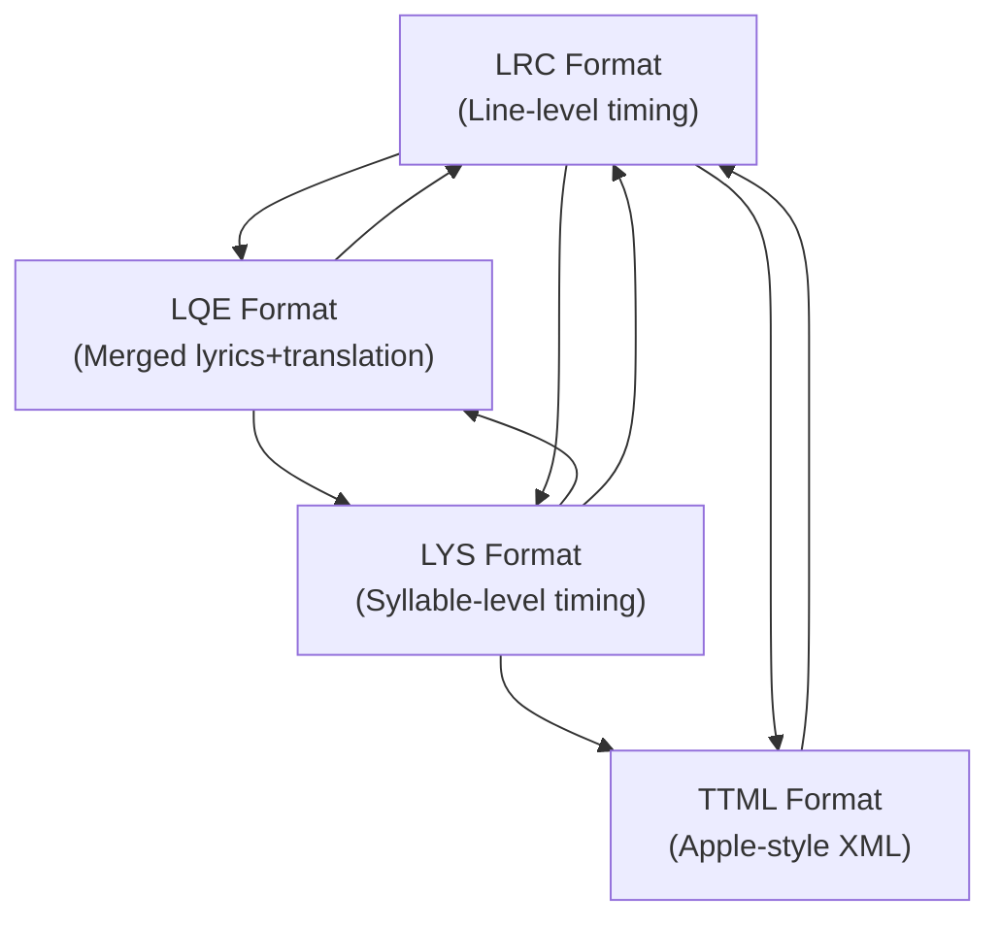
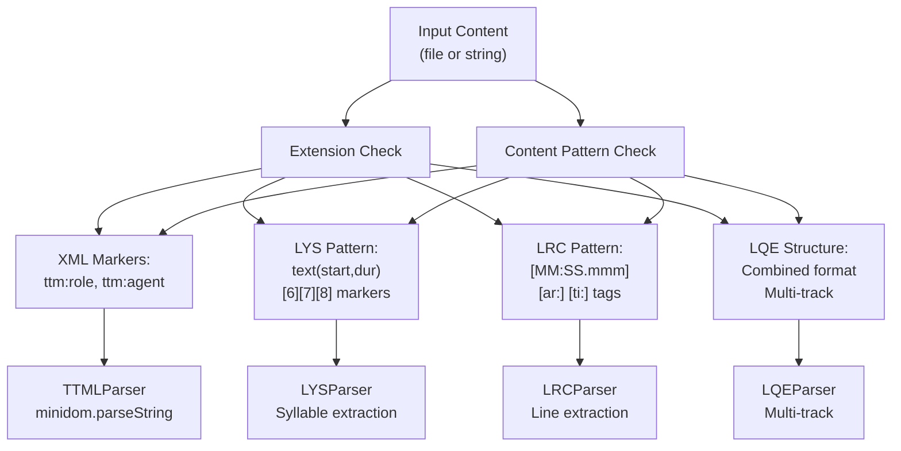
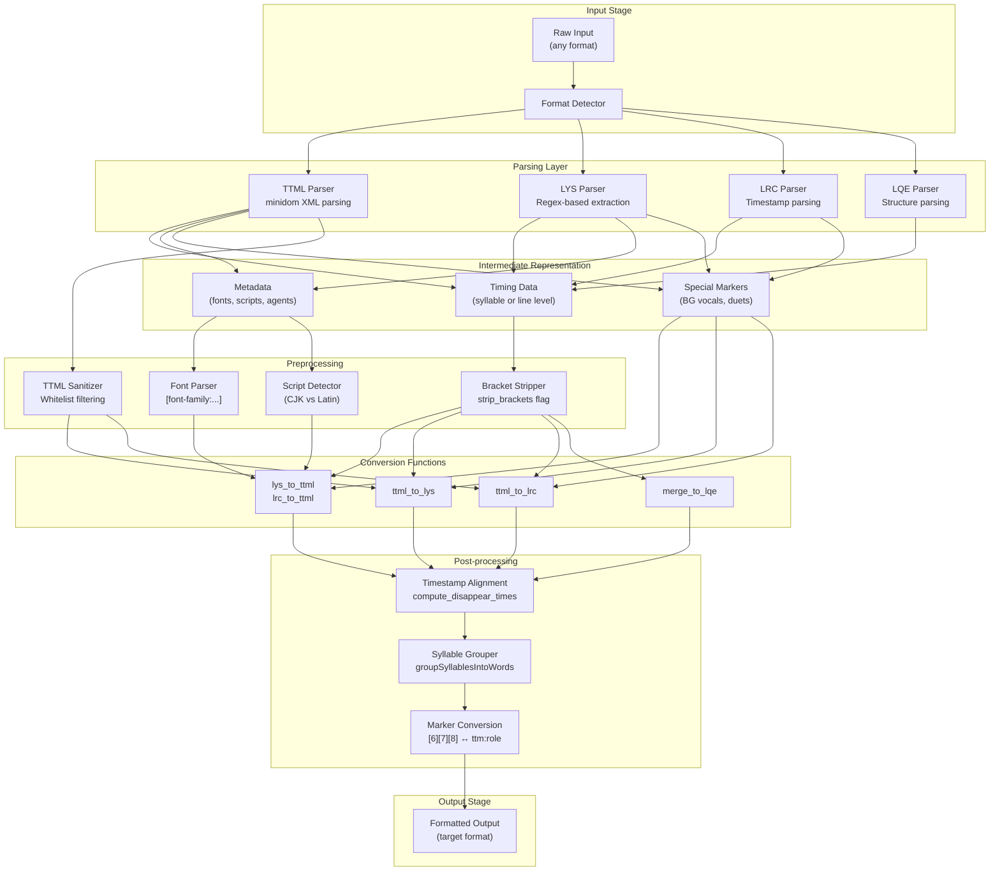
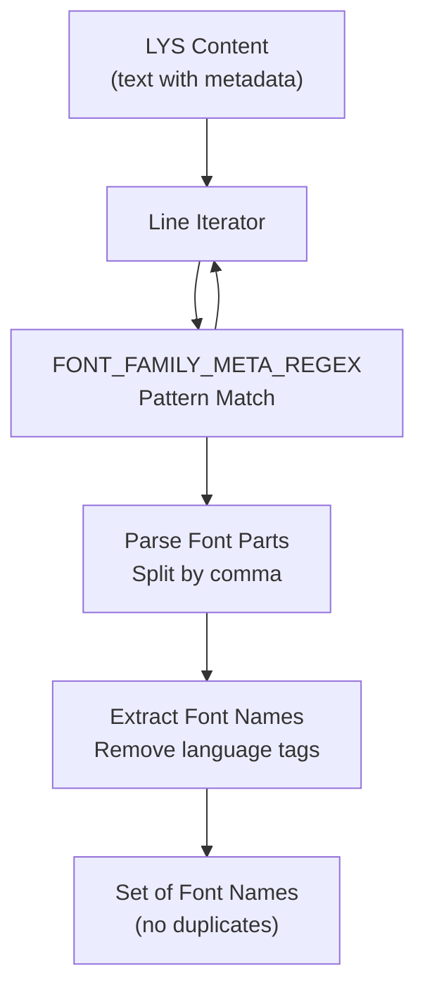
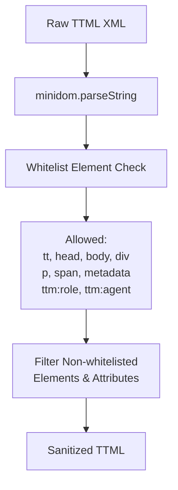
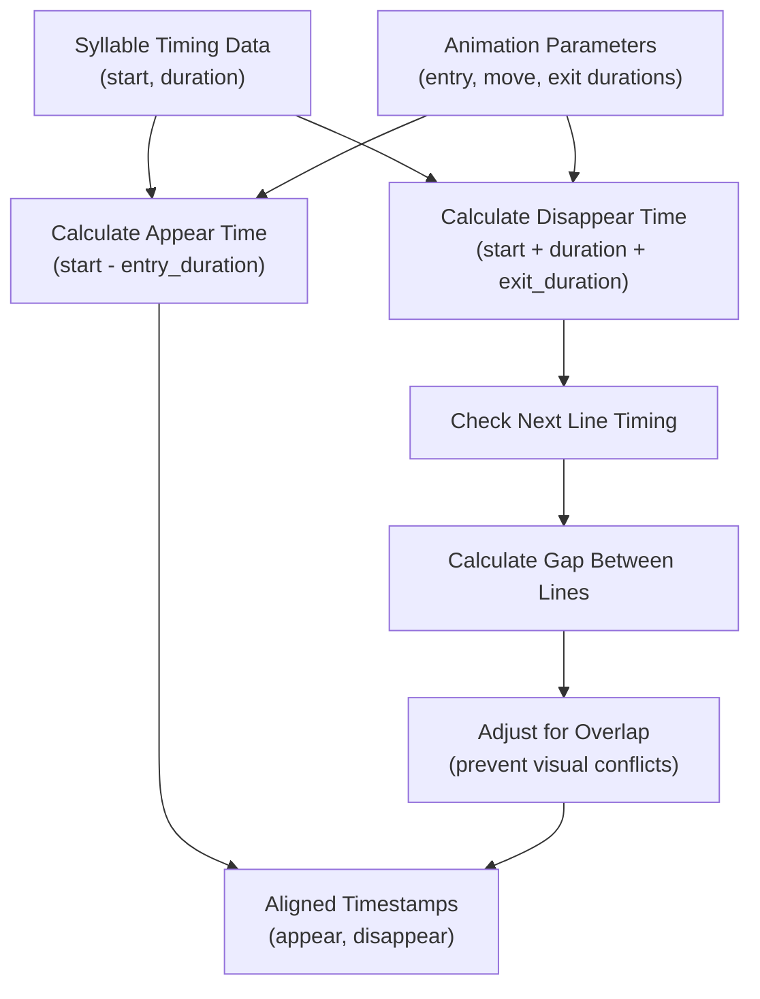
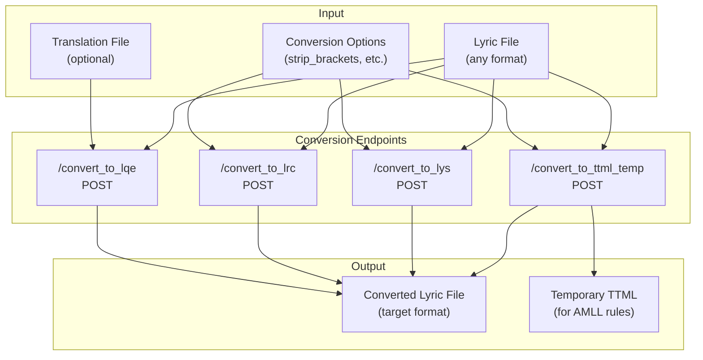

# Format Conversion Pipeline

> **Relevant source files**
> * [CHANGELOG.md](https://github.com/HKLHaoBin/LyricSphere/blob/7864cfe0/CHANGELOG.md)
> * [LICENSE](https://github.com/HKLHaoBin/LyricSphere/blob/7864cfe0/LICENSE)
> * [README.md](https://github.com/HKLHaoBin/LyricSphere/blob/7864cfe0/README.md)
> * [backend.py](https://github.com/HKLHaoBin/LyricSphere/blob/7864cfe0/backend.py)

This document describes the lyric format conversion system in LyricSphere, which provides bidirectional conversion between multiple lyric formats while preserving timing information, metadata, and special features like background vocals and duets.

For details on individual format specifications, see:

* [LRC Format](/HKLHaoBin/LyricSphere/2.3.1-lrc-format) - Line-level timing format
* [LYS Format](/HKLHaoBin/LyricSphere/2.3.2-lys-format) - Syllable-level timing format (internal representation)
* [TTML Format](/HKLHaoBin/LyricSphere/2.3.3-ttml-format) - XML-based Apple-style format
* [LQE Format](/HKLHaoBin/LyricSphere/2.3.4-lqe-format) - Merged lyrics and translation format

For AI-powered translation features that work with these formats, see [AI Translation System](/HKLHaoBin/LyricSphere/2.4-ai-translation-system).

## Overview

The format conversion pipeline transforms lyric files between LRC, LYS, TTML, and LQE formats through a multi-stage process: **Parse → Normalize → Convert → Validate → Output**. The system preserves timing precision, supports metadata extraction (including font families and script detection), and maintains special features like background vocals markers and duet annotations during conversion.

**Sources:** [backend.py L1-L50](https://github.com/HKLHaoBin/LyricSphere/blob/7864cfe0/backend.py#L1-L50)

 [README.md L110-L130](https://github.com/HKLHaoBin/LyricSphere/blob/7864cfe0/README.md#L110-L130)

## Supported Formats and Conversion Paths



| Conversion Path | Direction | Preserves | Special Handling |
| --- | --- | --- | --- |
| **LYS ↔ TTML** | Bidirectional | Syllable timing, BG vocals, duets | Converts `[6][7][8]` to `ttm:role="x-bg"`, `[2][5]` to `ttm:agent="v2"` |
| **LRC ↔ TTML** | Bidirectional | Line timing, BG vocals, duets | Converts LRC markers to TTML attributes |
| **LYS → LQE** | Merge | All timing | Combines lyrics and translation into single file |
| **TTML → LYS** | Extract | Syllable timing | Converts XML structure to text-based format |
| **LQE → LYS/LRC** | Extract | Original timing | Separates merged content |

**Sources:** [README.md L124-L130](https://github.com/HKLHaoBin/LyricSphere/blob/7864cfe0/README.md#L124-L130)

 [backend.py L1-L50](https://github.com/HKLHaoBin/LyricSphere/blob/7864cfe0/backend.py#L1-L50)

## Format Detection System

The pipeline begins by detecting the input format through a combination of file extensions and content analysis.



**Detection Logic:**

* **TTML**: Check for `<?xml` declaration, `ttm:role`, `ttm:agent` XML attributes
* **LYS**: Look for `text(start,dur)` pattern, bracket markers `[6]`, `[7]`, `[8]`
* **LRC**: Match `[MM:SS.mmm]` timestamp format, metadata tags `[ar:]`, `[ti:]`
* **LQE**: Identify combined structure with multiple tracks

**Sources:** [backend.py L36-L39](https://github.com/HKLHaoBin/LyricSphere/blob/7864cfe0/backend.py#L36-L39)

## Conversion Engine Architecture



**Sources:** [backend.py L1-L50](https://github.com/HKLHaoBin/LyricSphere/blob/7864cfe0/backend.py#L1-L50)

 [README.md L15-L44](https://github.com/HKLHaoBin/LyricSphere/blob/7864cfe0/README.md#L15-L44)

## Bracket Preprocessing

The `strip_brackets` configuration option controls whether bracketed content is removed during conversion. This preprocessing uses a high-performance character translation table instead of regex for optimal performance.

**Implementation:**

* Uses Python's `str.translate()` with a translation table
* Removes bracket characters `[]【】（）()` while preserving enclosed text
* Cleans redundant spaces after bracket removal
* Significantly faster than regex-based approaches

**Example:**

```yaml
Input:  "歌[詞]文本[background]"
Output: "歌詞文本background"
```

**Sources:** [README.md L44](https://github.com/HKLHaoBin/LyricSphere/blob/7864cfe0/README.md#L44-L44)

 [CHANGELOG.md L69-L76](https://github.com/HKLHaoBin/LyricSphere/blob/7864cfe0/CHANGELOG.md#L69-L76)

## Font Metadata Extraction

The pipeline extracts and processes `[font-family:...]` metadata tags embedded in lyrics, enabling per-syllable font selection based on script type.

### Font Tag Syntax

```markdown
[font-family:Hymmnos]                     # Global font
[font-family:Hymmnos(en),(ja)]            # English: Hymmnos, Japanese: default
[font-family:Main(en),Sub(ja),Extra]      # Multi-script mapping
[font-family:]                            # Clear font, revert to default
```

### Font File Extraction Function

The `extract_font_files_from_lys` function parses font metadata from LYS content:



**Implementation Details:**

* Matches pattern: `^\[font-family:([^\]]*)\]`
* Parses formats: `FontName`, `FontName(lang)`, `(lang)`
* Excludes empty strings and pure language tags
* Returns set of unique font file names (without extensions)

**Sources:** [backend.py L1138-L1183](https://github.com/HKLHaoBin/LyricSphere/blob/7864cfe0/backend.py#L1138-L1183)

 [README.md L48-L59](https://github.com/HKLHaoBin/LyricSphere/blob/7864cfe0/README.md#L48-L59)

## Special Marker Conversion

The pipeline automatically converts special markers between format-specific representations:

### Background Vocals Markers

| Source Format | Marker | Target Format | Converted To |
| --- | --- | --- | --- |
| LYS | `[6]`, `[7]`, `[8]` | TTML | `ttm:role="x-bg"` |
| LRC | BG line prefix/suffix | TTML | `ttm:role="x-bg"` |
| TTML | `ttm:role="x-bg"` | LYS | `[6]`, `[7]`, `[8]` |
| TTML | `ttm:role="x-bg"` | LRC | BG line markers |

### Duet Markers

| Source Format | Marker | Target Format | Converted To |
| --- | --- | --- | --- |
| LYS | `[2]`, `[5]` | TTML | `ttm:agent="v2"` |
| LRC | Duet line markers | TTML | `ttm:agent="v2"` |
| TTML | `ttm:agent="v2"` | LYS | `[2]`, `[5]` |
| TTML | `ttm:agent="v2"` | LRC | Duet line markers |

**Sources:** [README.md L113-L119](https://github.com/HKLHaoBin/LyricSphere/blob/7864cfe0/README.md#L113-L119)

 [CHANGELOG.md L141-L148](https://github.com/HKLHaoBin/LyricSphere/blob/7864cfe0/CHANGELOG.md#L141-L148)

## TTML Content Sanitization

When parsing TTML input, the pipeline applies whitelist-based filtering to remove potentially unsafe XML elements:



**Security Features:**

* Removes non-whitelisted XML elements
* Filters potentially dangerous attributes
* Preserves essential TTML structure and timing
* Prevents XML injection attacks

**Sources:** [README.md L36](https://github.com/HKLHaoBin/LyricSphere/blob/7864cfe0/README.md#L36-L36)

## Syllable Grouping

The `groupSyllablesIntoWords` function optimizes lyric rendering by intelligently grouping syllables into words, improving layout with dynamic `word-break` and `white-space` CSS control.

**Grouping Rules:**

* Groups consecutive syllables of the same script type (CJK vs Latin)
* Respects natural word boundaries in Latin text
* Maintains syllable-level timing within groups
* Optimizes for visual rendering and animation performance

**Sources:** [README.md L19](https://github.com/HKLHaoBin/LyricSphere/blob/7864cfe0/README.md#L19-L19)

 [CHANGELOG.md L93-L97](https://github.com/HKLHaoBin/LyricSphere/blob/7864cfe0/CHANGELOG.md#L93-L97)

## Timestamp Alignment

The `compute_disappear_times` function calculates when lyrics should disappear from the display, synchronizing with animation parameters:



**Default Animation Timings:**

* Entry duration: 600ms
* Move duration: 600ms
* Exit duration: 600ms
* Synchronized via `/player/animation-config` endpoint

**Sources:** [README.md L135](https://github.com/HKLHaoBin/LyricSphere/blob/7864cfe0/README.md#L135-L135)

 [CHANGELOG.md L107-L115](https://github.com/HKLHaoBin/LyricSphere/blob/7864cfe0/CHANGELOG.md#L107-L115)

## API Endpoints for Conversion



### Endpoint Specifications

| Endpoint | Method | Purpose | Input | Output |
| --- | --- | --- | --- | --- |
| `/convert_to_ttml_temp` | POST | Convert to temporary TTML for AMLL rule writing | LYS/LRC file, options | TTML file (10min TTL) |
| `/convert_to_lys` | POST | Convert any format to LYS | TTML/LRC/LQE file | LYS file |
| `/convert_to_lrc` | POST | Convert any format to LRC | TTML/LYS/LQE file | LRC file |
| `/convert_to_lqe` | POST | Merge lyrics and translation | LYS/LRC + translation | LQE file |

**Temporary TTML Files:**

* Stored in `TEMP_TTML_FILES` dictionary with timestamps
* Time-to-live (TTL): 10 minutes (`TEMP_TTML_TTL_SEC = 10 * 60`)
* Automatically cleaned up after expiration
* Used specifically for AMLL rule writing workflow

**Sources:** [backend.py L53-L54](https://github.com/HKLHaoBin/LyricSphere/blob/7864cfe0/backend.py#L53-L54)

 [CHANGELOG.md L145-L148](https://github.com/HKLHaoBin/LyricSphere/blob/7864cfe0/CHANGELOG.md#L145-L148)

## Conversion Workflow Examples

### Example 1: LYS to TTML with Translation

```mermaid
sequenceDiagram
  participant Client
  participant /convert_to_ttml_temp
  participant LYS Parser
  participant lys_to_ttml
  participant Post-processor

  Client->>/convert_to_ttml_temp: POST (LYS content, translation, options)
  /convert_to_ttml_temp->>LYS Parser: Parse LYS content
  LYS Parser->>LYS Parser: Extract syllables, timing, markers
  LYS Parser-->>/convert_to_ttml_temp: Syllable data + metadata
  /convert_to_ttml_temp->>lys_to_ttml: Convert to TTML structure
  lys_to_ttml->>lys_to_ttml: Convert [6][7][8] to ttm:role="x-bg"
  lys_to_ttml->>lys_to_ttml: Convert [2][5] to ttm:agent="v2"
  lys_to_ttml->>lys_to_ttml: Merge translation content
  lys_to_ttml-->>/convert_to_ttml_temp: TTML XML structure
  /convert_to_ttml_temp->>Post-processor: Apply post-processing
  Post-processor->>Post-processor: Align timestamps
  Post-processor->>Post-processor: Group syllables
  Post-processor->>Post-processor: Detect fonts
  Post-processor-->>/convert_to_ttml_temp: Final TTML
  /convert_to_ttml_temp-->>Client: TTML file (Apple-style)
```

### Example 2: TTML to LRC with Bracket Stripping

```mermaid
sequenceDiagram
  participant Client
  participant /convert_to_lrc
  participant TTML Parser
  participant Sanitizer
  participant Bracket Stripper
  participant ttml_to_lrc

  Client->>/convert_to_lrc: POST (TTML content, strip_brackets=true)
  /convert_to_lrc->>TTML Parser: Parse TTML XML
  TTML Parser->>Sanitizer: Apply whitelist filtering
  Sanitizer-->>TTML Parser: Safe TTML structure
  TTML Parser-->>/convert_to_lrc: Parsed timing + text
  /convert_to_lrc->>Bracket Stripper: Remove bracket content
  Bracket Stripper->>Bracket Stripper: Apply translation table
  Bracket Stripper->>Bracket Stripper: Clean redundant spaces
  Bracket Stripper-->>/convert_to_lrc: Cleaned text
  /convert_to_lrc->>ttml_to_lrc: Convert to LRC format
  ttml_to_lrc->>ttml_to_lrc: Convert ttm:role="x-bg" to BG markers
  ttml_to_lrc->>ttml_to_lrc: Convert ttm:agent="v2" to duet markers
  ttml_to_lrc->>ttml_to_lrc: Simplify syllable timing to line timing
  ttml_to_lrc-->>/convert_to_lrc: LRC format
  /convert_to_lrc-->>Client: LRC file
```

**Sources:** [backend.py L1-L50](https://github.com/HKLHaoBin/LyricSphere/blob/7864cfe0/backend.py#L1-L50)

 [README.md L124-L130](https://github.com/HKLHaoBin/LyricSphere/blob/7864cfe0/README.md#L124-L130)

 [CHANGELOG.md L69-L76](https://github.com/HKLHaoBin/LyricSphere/blob/7864cfe0/CHANGELOG.md#L69-L76)

## Error Handling and Validation

The conversion pipeline includes validation at each stage:

1. **Input Validation**: Verify file format, check for malformed content
2. **Parse Validation**: Ensure timing data is consistent and non-overlapping
3. **Conversion Validation**: Verify special markers are correctly transformed
4. **Output Validation**: Check for complete timestamp coverage, missing translations

**Common Validation Checks:**

* Timestamp ordering (must be monotonically increasing)
* Duration values (must be positive)
* Marker consistency (BG vocals, duet markers properly paired)
* Translation alignment (same number of lines/syllables)
* Font file references (verify font files exist)

**Sources:** [backend.py L1-L50](https://github.com/HKLHaoBin/LyricSphere/blob/7864cfe0/backend.py#L1-L50)

## Performance Considerations

The conversion pipeline is optimized for performance:

| Optimization | Implementation | Benefit |
| --- | --- | --- |
| **Bracket Stripping** | `str.translate()` translation table | 10-100x faster than regex |
| **Lazy Parsing** | Parse only when conversion needed | Reduced memory usage |
| **Syllable Grouping** | Single-pass algorithm | O(n) complexity |
| **Font Caching** | Set-based deduplication | Avoid redundant lookups |
| **Timestamp Cache** | Computed disappear times cached | Faster animation rendering |

**Sources:** [README.md L44](https://github.com/HKLHaoBin/LyricSphere/blob/7864cfe0/README.md#L44-L44)

 [CHANGELOG.md L73-L76](https://github.com/HKLHaoBin/LyricSphere/blob/7864cfe0/CHANGELOG.md#L73-L76)

## Integration with Other Systems

The format conversion pipeline integrates with:

* **AI Translation System** ([#2.4](/HKLHaoBin/LyricSphere/2.4-ai-translation-system)): Converts formats before/after translation
* **Quick Editor** ([#2.3.2](/HKLHaoBin/LyricSphere/2.3.2-lys-format)): Works with LYS internal representation
* **Player UIs** ([#3.6](/HKLHaoBin/LyricSphere/3.6-player-uis)): Converts to TTML for AMLL player
* **Export System** ([#3.4](/HKLHaoBin/LyricSphere/3.4-export-and-sharing)): Packages converted formats for distribution
* **File Management** ([#2.2](/HKLHaoBin/LyricSphere/2.2-file-management-system)): Stores converted files with proper naming

**Sources:** [backend.py L1-L50](https://github.com/HKLHaoBin/LyricSphere/blob/7864cfe0/backend.py#L1-L50)

 [README.md L1-L172](https://github.com/HKLHaoBin/LyricSphere/blob/7864cfe0/README.md#L1-L172)