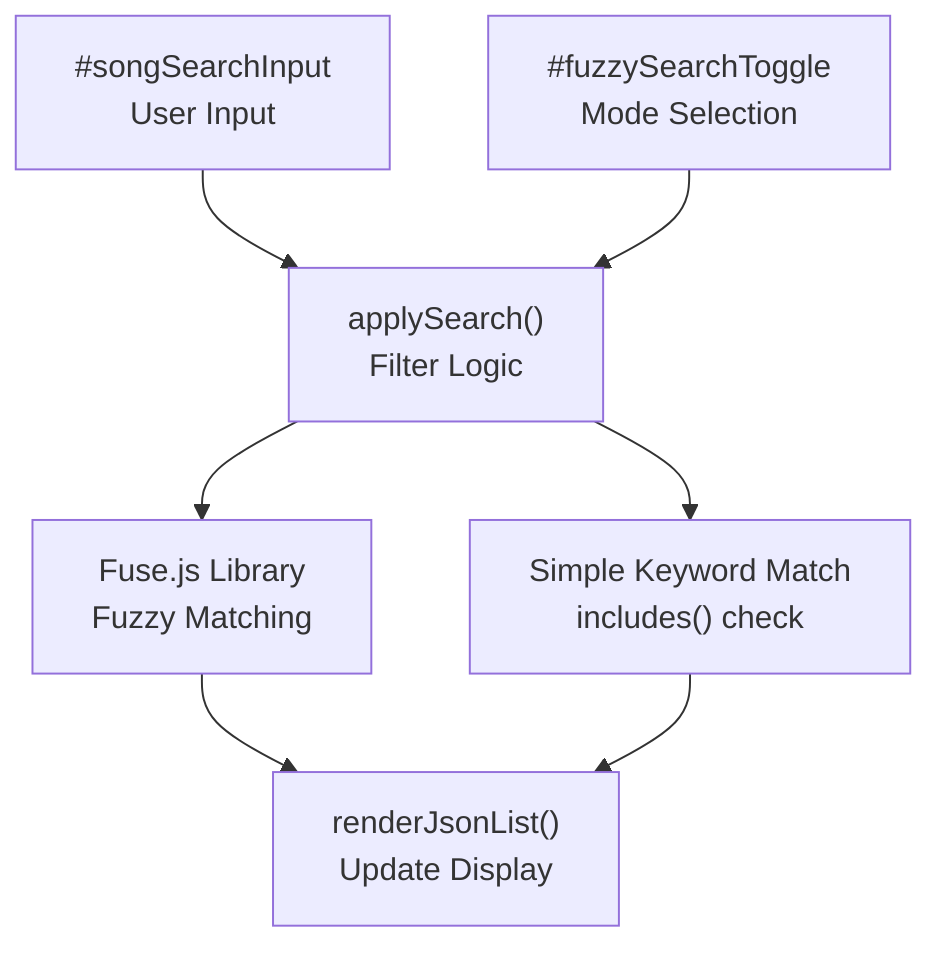
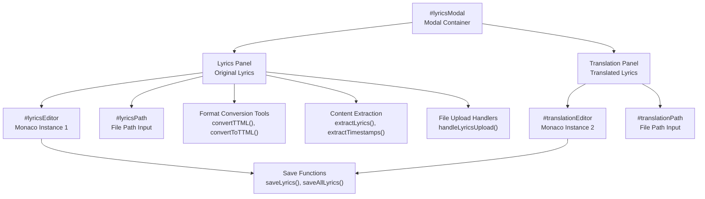
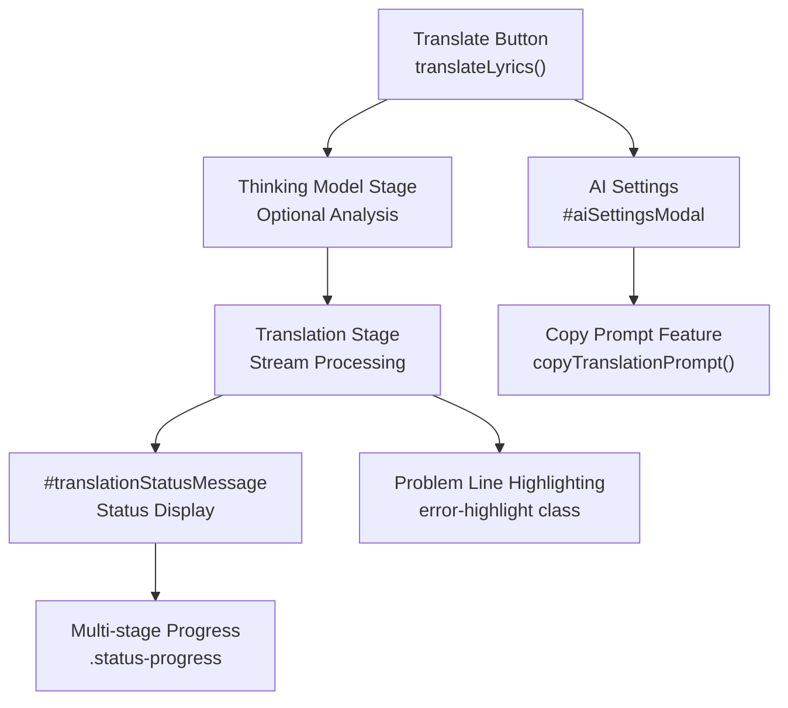
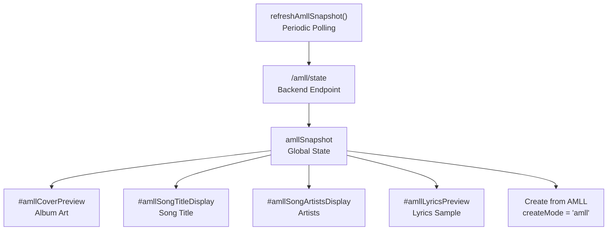
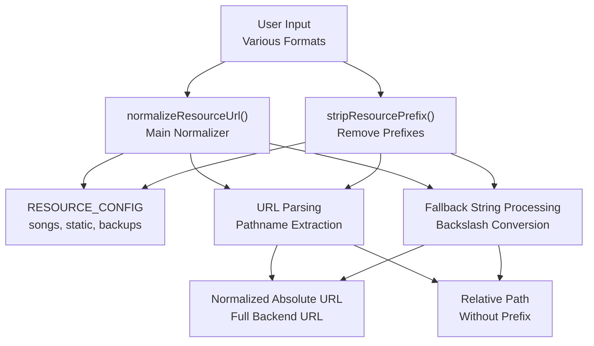
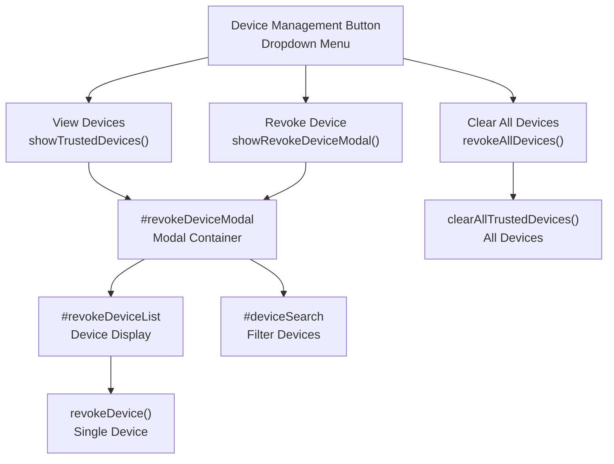
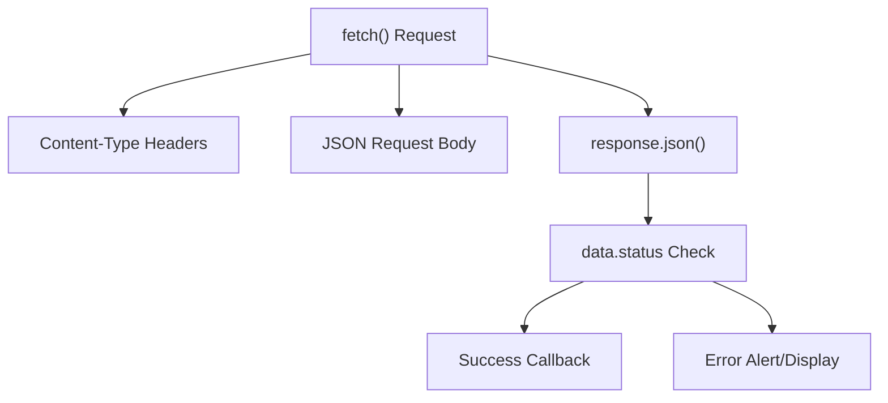
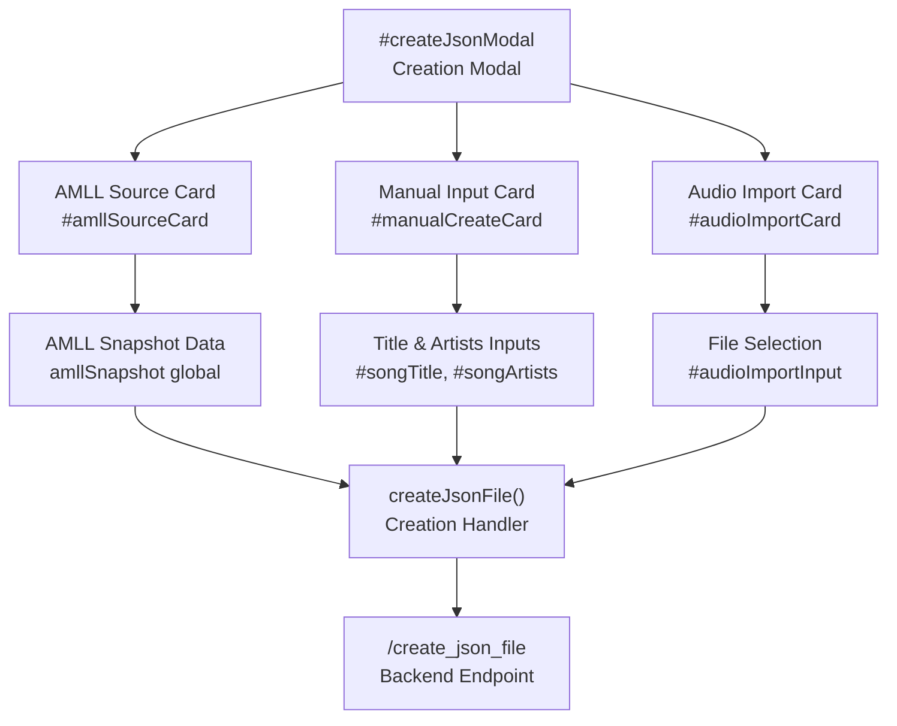

# Frontend Systems

> **Relevant source files**
> * [LICENSE](https://github.com/HKLHaoBin/LyricSphere/blob/7864cfe0/LICENSE)
> * [README.md](https://github.com/HKLHaoBin/LyricSphere/blob/7864cfe0/README.md)
> * [templates/LyricSphere.html](https://github.com/HKLHaoBin/LyricSphere/blob/7864cfe0/templates/LyricSphere.html)

## Purpose and Scope

This document covers the frontend user interfaces of LyricSphere, which provide web-based access to lyric management, editing, playback, and administration features. The frontend consists of multiple specialized HTML pages that communicate with the backend via REST APIs, WebSocket connections, and Server-Sent Events (SSE).

For backend API endpoints and data processing, see [Backend System](/HKLHaoBin/LyricSphere/2-backend-system). For real-time communication protocols, see [Real-time Communication](/HKLHaoBin/LyricSphere/2.5-real-time-communication). For player-specific features, see [Player UIs](/HKLHaoBin/LyricSphere/3.6-player-uis).

**Sources:** [README.md L1-L172](https://github.com/HKLHaoBin/LyricSphere/blob/7864cfe0/README.md#L1-L172)

 [templates/LyricSphere.html L1-L2515](https://github.com/HKLHaoBin/LyricSphere/blob/7864cfe0/templates/LyricSphere.html#L1-L2515)

## Frontend Architecture Overview

The LyricSphere frontend is organized as a collection of specialized HTML pages, each serving distinct user workflows. The main dashboard (`LyricSphere.html`) acts as the central hub, while dedicated players and editors provide focused interfaces for specific tasks.

```mermaid
flowchart TD

MainDashboard["LyricSphere.html<br>Main Dashboard"]
SearchUI["Search & Filter System<br>#songSearchInput, applySearch()"]
SongList["Dynamic Song List<br>#jsonList, renderJsonList()"]
ModalSystem["Modal Dialog System<br>Multiple specialized modals"]
LyricsModal["Lyrics Editing Modal<br>#lyricsModal"]
MonacoEditors["Monaco Editor Instances<br>lyricsEditor, translationEditor"]
QuickEditor["Quick Editor Page<br>lyrics_quick_editor.html"]
LDDCSearch["LDDC Search Modal<br>#lyricsSearchModal"]
AMLLPlayer["AMLL Player<br>Lyrics-style.HTML-AMLL-v1.HTML"]
AMLLWebPlayer["AMLL Web Player<br>amll_web_player.html"]
AnimationEngine["Animation Configuration<br>buildStyleQueryFromCache()"]
FileUploaders["File Upload Components<br>#musicUpload, #imageUpload, #lyricsUpload"]
URLNormalizer["URL Normalization<br>normalizeResourceUrl(), stripResourcePrefix()"]
PathHandlers["Path Input Fields<br>#lyricsPath, #translationPath"]
AuthModal["Authentication Modal<br>#authModal"]
PasswordModal["Password Setting Modal<br>#setPasswordModal"]
DeviceManagement["Device Management UI<br>#revokeDeviceModal"]
TranslationUI["AI Translation Interface<br>translateLyrics()"]
ProgressTracker["Translation Progress<br>#translationStatusMessage"]
AISettingsModal["AI Configuration Modal<br>#aiSettingsModal"]
RESTCalls["REST API Calls<br>fetch() to backend endpoints"]
WebSocketClient["WebSocket Client<br>Port 11444 for AMLL"]
SSEListener["SSE Event Listener<br>/amll/stream"]
Backend["Backend API<br>backend.py"]

ModalSystem --> LyricsModal
ModalSystem --> LDDCSearch
ModalSystem --> AuthModal
ModalSystem --> PasswordModal
ModalSystem --> AISettingsModal
LyricsModal --> TranslationUI
SongList --> AMLLPlayer
SongList --> AMLLWebPlayer
LyricsModal --> FileUploaders
MainDashboard --> RESTCalls
AMLLPlayer --> WebSocketClient
AMLLPlayer --> SSEListener
RESTCalls --> Backend
WebSocketClient --> Backend
SSEListener --> Backend

subgraph subGraph6 ["Backend Communication"]
    RESTCalls
    WebSocketClient
    SSEListener
end

subgraph subGraph5 ["AI Features UI"]
    TranslationUI
    ProgressTracker
    AISettingsModal
    TranslationUI --> ProgressTracker
    TranslationUI --> AISettingsModal
end

subgraph subGraph4 ["Security & Auth UI"]
    AuthModal
    PasswordModal
    DeviceManagement
    AuthModal --> DeviceManagement
end

subgraph subGraph3 ["Resource Management"]
    FileUploaders
    URLNormalizer
    PathHandlers
    FileUploaders --> URLNormalizer
    URLNormalizer --> PathHandlers
end

subgraph subGraph2 ["Player Layer"]
    AMLLPlayer
    AMLLWebPlayer
    AnimationEngine
    AMLLPlayer --> AnimationEngine
    AMLLWebPlayer --> AnimationEngine
end

subgraph subGraph1 ["Editing Layer"]
    LyricsModal
    MonacoEditors
    QuickEditor
    LDDCSearch
    LyricsModal --> MonacoEditors
    LyricsModal --> QuickEditor
end

subgraph subGraph0 ["Main Interface Layer"]
    MainDashboard
    SearchUI
    SongList
    ModalSystem
    MainDashboard --> SearchUI
    MainDashboard --> SongList
    MainDashboard --> ModalSystem
end
```



**Sources:** [templates/LyricSphere.html L1-L100](https://github.com/HKLHaoBin/LyricSphere/blob/7864cfe0/templates/LyricSphere.html#L1-L100)

 [templates/LyricSphere.html L2095-L2515](https://github.com/HKLHaoBin/LyricSphere/blob/7864cfe0/templates/LyricSphere.html#L2095-L2515)

 [README.md L95-L108](https://github.com/HKLHaoBin/LyricSphere/blob/7864cfe0/README.md#L95-L108)

## Main Dashboard (LyricSphere.html)

### Page Structure and Layout

The main dashboard is organized as a single-page application with a fixed search container at the top and a scrollable song list below. The interface uses CSS custom properties for theming and responsive design breakpoints for mobile/tablet adaptation.

**Core Layout Elements:**

| Element | Purpose | Key Identifiers |
| --- | --- | --- |
| Search Container | Fixed header with search and control buttons | `.search-container`, `#songSearchInput` |
| Song List | Dynamically rendered song cards | `#jsonList`, `.json-item` |
| Modal Dialogs | Overlay interfaces for editing and configuration | `#lyricsModal`, `#createJsonModal`, etc. |
| Theme System | CSS variables for light/dark mode | `:root`, `.dark-mode` |

**Sources:** [templates/LyricSphere.html L8-L1515](https://github.com/HKLHaoBin/LyricSphere/blob/7864cfe0/templates/LyricSphere.html#L8-L1515)

 [templates/LyricSphere.html L1519-L1589](https://github.com/HKLHaoBin/LyricSphere/blob/7864cfe0/templates/LyricSphere.html#L1519-L1589)

### Search and Filtering System

The search system implements both keyword matching and fuzzy search using the Fuse.js library. Search operations are performed client-side on the loaded song data.

**Search Implementation:**



**Key Functions:**

* `applySearch()`: Main search orchestrator that filters song list based on input
* `toggleSort()`: Sorts songs by name (A-Z) or modification time
* `renderJsonList()`: Updates DOM with filtered/sorted results

**Sources:** [templates/LyricSphere.html L1520-L1567](https://github.com/HKLHaoBin/LyricSphere/blob/7864cfe0/templates/LyricSphere.html#L1520-L1567)

 [templates/LyricSphere.html L931-L946](https://github.com/HKLHaoBin/LyricSphere/blob/7864cfe0/templates/LyricSphere.html#L931-L946)

### Song List Display

Songs are displayed as card-based items with metadata, preview images, and action buttons. Each card includes format indicators (duet tags, background vocals tags, instrumental tags) and quick-access playback links.

**Card Structure:**

* `.json-item`: Container with metadata display
* `.file-name`: Song title with optional album cover
* `.song-tags`: Visual indicators for special lyric features
* `.style-buttons`: Quick links to different player styles (AM, FS, FSLR)
* `.file-actions`: Edit, delete, rename, backup operations

**Sources:** [templates/LyricSphere.html L335-L498](https://github.com/HKLHaoBin/LyricSphere/blob/7864cfe0/templates/LyricSphere.html#L335-L498)

 [templates/LyricSphere.html L909-L956](https://github.com/HKLHaoBin/LyricSphere/blob/7864cfe0/templates/LyricSphere.html#L909-L956)

### Modal Dialog System

The dashboard uses multiple modal dialogs for different operations. Each modal follows a consistent pattern with a backdrop overlay and centered content area.

**Modal Types and Functions:**

| Modal ID | Purpose | Key Functions |
| --- | --- | --- |
| `#lyricsModal` | Edit lyrics and translations | `editLyrics()`, `saveLyrics()` |
| `#createJsonModal` | Create new song entries | `showCreateModal()`, `createJsonFile()` |
| `#lyricsSearchModal` | Search LDDC lyrics database | `openLyricsSearchModal()`, `performLyricsSearch()` |
| `#musicPathModal` | Update music file paths | `editMusicPath()`, `updateMusicPath()` |
| `#imagePathModal` | Update album art and backgrounds | `editImagePath()`, `updateImagePath()` |
| `#authModal` | Device authentication | `toggleAuthModal()`, `authLogin()` |
| `#setPasswordModal` | Password management | `showSetPasswordModal()`, `setPassword()` |
| `#revokeDeviceModal` | Trusted device management | `showRevokeDeviceModal()`, `revokeDevice()` |
| `#aiSettingsModal` | AI translation configuration | `showAISettings()`, `saveAISettings()` |

**Sources:** [templates/LyricSphere.html L504-L2092](https://github.com/HKLHaoBin/LyricSphere/blob/7864cfe0/templates/LyricSphere.html#L504-L2092)

## Lyrics Editing Interface

### Dual Monaco Editor System

The lyrics editing modal uses two Monaco Editor instances for simultaneous editing of original lyrics and translations. Monaco Editor provides syntax highlighting, code folding, and advanced editing features.



**Editor Configuration:**

* Syntax highlighting for LRC/LYS/TTML formats
* Line numbers and minimap enabled
* Auto-detection of file format based on content
* Word wrap and automatic layout updates

**Sources:** [templates/LyricSphere.html L1591-L1689](https://github.com/HKLHaoBin/LyricSphere/blob/7864cfe0/templates/LyricSphere.html#L1591-L1689)

 [templates/LyricSphere.html L641-L660](https://github.com/HKLHaoBin/LyricSphere/blob/7864cfe0/templates/LyricSphere.html#L641-L660)

### Format Conversion Tools

The editing interface provides one-click format conversion between supported lyric formats:

**Conversion Functions:**

* `convertTTML()`: Converts TTML to LYS or LRC format
* `convertToTTML()`: Converts LYS/LRC to Apple-style TTML
* `mergeToLQE()`: Merges lyrics and translation into LQE format
* `extractLyrics()`: Strips timestamps to get plain text
* `extractTimestamps()`: Adds timestamps from lyrics to translation

**Sources:** [templates/LyricSphere.html L1608-L1629](https://github.com/HKLHaoBin/LyricSphere/blob/7864cfe0/templates/LyricSphere.html#L1608-L1629)

### LDDC Lyrics Search Integration

The LDDC search modal provides a three-panel interface for searching, previewing, and applying lyrics from the LDDC online database.

**Search Workflow:**

```mermaid
sequenceDiagram
  participant User
  participant LDDC Search Modal
  participant applySearchNameFromFile()
  participant performLyricsMatchFromInputs()
  participant Monaco Preview Editors
  participant applyLyricsSearchResult()

  User->>LDDC Search Modal: Open search modal
  LDDC Search Modal->>applySearchNameFromFile(): Parse current filename
  applySearchNameFromFile()->>LDDC Search Modal: Extract title/artist
  User->>performLyricsMatchFromInputs(): Trigger auto-match
  performLyricsMatchFromInputs()->>LDDC Search Modal: Display results
  User->>Monaco Preview Editors: Click result item
  Monaco Preview Editors->>LDDC Search Modal: Load lyrics preview
  User->>applyLyricsSearchResult(): Apply to main editor
  applyLyricsSearchResult()->>LDDC Search Modal: Close modal
```

**Search Features:**

* Filename parsing with configurable regex patterns
* Auto-match by title and artist
* Keyword search with result list
* Live preview in Monaco editors before applying
* Direct application to main editing interface

**Sources:** [templates/LyricSphere.html L1692-L1742](https://github.com/HKLHaoBin/LyricSphere/blob/7864cfe0/templates/LyricSphere.html#L1692-L1742)

 [templates/LyricSphere.html L533-L621](https://github.com/HKLHaoBin/LyricSphere/blob/7864cfe0/templates/LyricSphere.html#L533-L621)

## AI Translation Interface

### Translation Workflow UI

The AI translation interface provides real-time feedback during the translation process, including multi-stage progress visualization and issue highlighting.

**Translation UI Components:**



**Progress States:**

1. **Pending**: Stage not yet started (`.status-progress__item--pending`)
2. **Active**: Currently processing (`.status-progress__item--active`)
3. **Success**: Stage completed (`.status-progress__item--success`)
4. **Error**: Stage failed (`.status-progress__item--error`)

**Sources:** [templates/LyricSphere.html L1643-L1683](https://github.com/HKLHaoBin/LyricSphere/blob/7864cfe0/templates/LyricSphere.html#L1643-L1683)

 [templates/LyricSphere.html L1029-L1192](https://github.com/HKLHaoBin/LyricSphere/blob/7864cfe0/templates/LyricSphere.html#L1029-L1192)

### AI Configuration Modal

The AI settings modal allows configuration of translation providers, models, prompts, and optional thinking model parameters.

**Configuration Options:**

| Setting | Input ID | Purpose |
| --- | --- | --- |
| Provider | `#aiProvider` | Select API provider (DeepSeek, OpenAI, etc.) |
| Base URL | `#aiBaseUrl` | API endpoint URL |
| Model Name | `#aiModel` | Specific model identifier |
| API Key | `#aiApiKey` | Authentication credential |
| System Prompt | `#aiSystemPrompt` | Translation guidelines |
| Expect Reasoning | `#aiExpectReasoning` | Enable reasoning chain support |
| Compat Mode | `#aiCompatMode` | Merge system prompt into user message |
| Strip Brackets | `#aiStripBrackets` | Preprocess lyrics to remove brackets |
| Thinking Enabled | `#aiThinkingEnabled` | Enable two-stage translation |
| Thinking Provider | `#aiThinkingProvider` | Separate provider for analysis |
| Thinking Model | `#aiThinkingModel` | Analysis model name |
| Thinking Prompt | `#aiThinkingPrompt` | Analysis guidelines |

**API Probing:**

* `probeAIConnection()`: Tests API connectivity before translation
* Separate probe functions for translation and thinking models
* Handles 404 responses gracefully for APIs without `/v1/models` endpoint

**Sources:** [templates/LyricSphere.html L1997-L2092](https://github.com/HKLHaoBin/LyricSphere/blob/7864cfe0/templates/LyricSphere.html#L1997-L2092)

## AMLL Integration

### AMLL Snapshot System

The AMLL snapshot feature polls the backend for current AMLL playback state and displays it in the song creation modal.

**Snapshot Display Components:**



**AMLL Source Card:**

* Displays current playing song from AMLL client
* Shows cover image, title, artists, album, and lyrics preview
* One-click creation using AMLL data
* Auto-refresh functionality with status indicator

**Sources:** [templates/LyricSphere.html L1822-L1843](https://github.com/HKLHaoBin/LyricSphere/blob/7864cfe0/templates/LyricSphere.html#L1822-L1843)

### AMLL Player Links

Song cards include quick links to open songs in different AMLL player styles. The links incorporate cached player settings from `localStorage`.

**Player Style Parameters:**

* `buildStyleQueryFromCache()`: Reads AMLL settings from `localStorage`
* `buildStyleQueryFromSettings()`: Constructs URL query parameters
* Parameter aliases defined in `STYLE_PARAM_ALIAS` (e.g., `lyricDelay` → `ms`)
* Excluded parameters in `STYLE_PARAM_EXCLUDE` (resource URLs, input fields)

**Player Styles:**

* AM Style: Apple Music-like appearance
* FS Style: Full-screen mode
* FSLR Style: Full-screen with left-to-right animation

**Sources:** [templates/LyricSphere.html L2108-L2176](https://github.com/HKLHaoBin/LyricSphere/blob/7864cfe0/templates/LyricSphere.html#L2108-L2176)

## Resource Management

### URL Normalization System

The frontend implements a sophisticated URL normalization system to handle various resource path formats and ensure consistent communication with the backend.

**Normalization Functions:**



**Resource Types:**

* `songs/`: Music files, lyrics, album art
* `static/`: Static assets and icons
* `backups/`: Backup versions of song data

**Helper Functions:**

* `normalizeSongsUrl()`: Normalize paths in `songs/` directory
* `stripSongsPrefix()`: Remove `songs/` prefix from paths
* `normalizeStaticUrl()`: Normalize paths in `static/` directory
* `normalizeBackupsUrl()`: Normalize paths in `backups/` directory
* `safeDecodeURIComponent()`: Decode URLs with error handling

**Sources:** [templates/LyricSphere.html L2185-L2284](https://github.com/HKLHaoBin/LyricSphere/blob/7864cfe0/templates/LyricSphere.html#L2185-L2284)

### File Upload Handlers

File upload functionality is implemented through hidden `<input type="file">` elements triggered by visible buttons.

**Upload Types and Handlers:**

| Upload Type | Input ID | Handler Function | Accepted Formats |
| --- | --- | --- | --- |
| Lyrics | `#lyricsUpload` | `handleLyricsUpload()` | `.lrc`, `.lys`, `.ttml` |
| Translation | `#translationUpload` | `handleTranslationUpload()` | `.lrc`, `.lys`, `.ttml` |
| Music | `#musicUpload` | `handleMusicUpload()` | `audio/*`, `video/*` |
| Album Image | `#imageUpload` | `handleImageUpload()` | `image/*` |
| Background | `#backgroundUpload` | `handleImageUpload()` | `image/*`, `video/*` |
| Audio Import | `#audioImportInput` | `handleCreateAudioImport()` | `audio/*`, `video/*` (multiple) |
| ZIP Import | `#staticZipInput` | `handleStaticImport()` | `.zip` |

**Upload Process:**

1. User clicks visible button/label
2. Hidden file input is triggered
3. File selected through browser dialog
4. Handler function processes file
5. File uploaded to backend via FormData
6. UI updated with new path/content

**Sources:** [templates/LyricSphere.html L1625-L1673](https://github.com/HKLHaoBin/LyricSphere/blob/7864cfe0/templates/LyricSphere.html#L1625-L1673)

 [templates/LyricSphere.html L1754-L1813](https://github.com/HKLHaoBin/LyricSphere/blob/7864cfe0/templates/LyricSphere.html#L1754-L1813)

### Path Input Fields

Resource paths are managed through dedicated input fields with update buttons. The fields use the `file-path-input` class for consistent styling.

**Path Management:**

* `#lyricsPath`: Path to lyrics file
* `#translationPath`: Path to translation file
* `#musicPath`: Path to audio/video file
* `#imagePath`: Path to album cover
* `#backgroundPath`: Path to background image/video
* `#newMusicPath`, `#newImagePath`, `#newBackgroundPath`: New path inputs in edit modals

**Update Functions:**

* `updateLyricsPath()`: Updates lyrics or translation file path
* `updateMusicPath()`: Updates music file path
* `updateImagePath()`: Updates album cover path
* `updateBackgroundPath()`: Updates background image/video path
* `saveAllImagePaths()`: Saves both album and background paths simultaneously

**Sources:** [templates/LyricSphere.html L1604-L1675](https://github.com/HKLHaoBin/LyricSphere/blob/7864cfe0/templates/LyricSphere.html#L1604-L1675)

 [templates/LyricSphere.html L1743-L1815](https://github.com/HKLHaoBin/LyricSphere/blob/7864cfe0/templates/LyricSphere.html#L1743-L1815)

## Authentication and Security UI

### Device Authentication Modal

The device authentication system provides a modal interface for unlocking editing permissions on new or untrusted devices.

**Authentication Flow:**

```mermaid
sequenceDiagram
  participant User
  participant authLogin()
  participant Backend /device/login

  User->>User: Click unlock button
  User->>User: toggleAuthModal()
  User->>authLogin(): Check device status
  authLogin()->>authLogin(): Show password input
  User->>authLogin(): Enter password
  authLogin()->>authLogin(): Submit credentials
  authLogin()->>Backend /device/login: POST with password
  Backend /device/login->>authLogin(): Return device_id + token
  authLogin()->>User: Show success message
  User->>User: Close modal
```

**Authentication Components:**

* `#authModal`: Modal container
* `#authStatus`: Status message display
* `#authForm`: Password input form
* `#authPassword`: Password input field
* `#authSuccess`: Success confirmation display

**Functions:**

* `toggleAuthModal()`: Opens/closes authentication modal
* `authLogin()`: Submits password and stores device token
* `authLogout()`: Removes device authentication
* `checkAuthStatus()`: Verifies current device status

**Sources:** [templates/LyricSphere.html L1915-L1941](https://github.com/HKLHaoBin/LyricSphere/blob/7864cfe0/templates/LyricSphere.html#L1915-L1941)

### Password Management Modal

The password setting modal allows administrators to create or update the system password.

**Password Setting UI:**

* `#setPasswordModal`: Modal container
* `#currentPassword`: Current password verification
* `#newPassword`: New password input (minimum 8 characters)
* `#confirmPassword`: Password confirmation
* `#setPasswordStatus`: Status/error messages

**Validation:**

* Minimum length check (8 characters)
* Password confirmation match
* Current password verification for updates
* Server-side bcrypt hashing

**Sources:** [templates/LyricSphere.html L1944-L1972](https://github.com/HKLHaoBin/LyricSphere/blob/7864cfe0/templates/LyricSphere.html#L1944-L1972)

### Trusted Device Management

The device revocation modal displays a list of all trusted devices and allows selective or bulk revocation.

**Device Management UI:**



**Device Display Format:**

* Device ID (truncated fingerprint)
* Added timestamp
* Last access timestamp
* Revoke button for each device

**Sources:** [templates/LyricSphere.html L1975-L1994](https://github.com/HKLHaoBin/LyricSphere/blob/7864cfe0/templates/LyricSphere.html#L1975-L1994)

 [templates/LyricSphere.html L1556-L1563](https://github.com/HKLHaoBin/LyricSphere/blob/7864cfe0/templates/LyricSphere.html#L1556-L1563)

## Theme and Responsive Design

### CSS Variable System

The frontend uses CSS custom properties (CSS variables) for centralized theming. All colors, spacing, and other design tokens are defined in the `:root` and `.dark-mode` selectors.

**Theme Variables:**

| Variable | Light Mode | Dark Mode | Usage |
| --- | --- | --- | --- |
| `--bg-color` | `#ffffff` | `#1a1a1a` | Page background |
| `--text-color` | `#000000` | `#ffffff` | Primary text |
| `--card-bg` | `#ffffff` | `rgba(45, 45, 45, 0.9)` | Card backgrounds |
| `--card-shadow` | `0 2px 8px rgba(0,0,0,0.08)` | `0 2px 8px rgba(0,0,0,0.3)` | Card shadows |
| `--input-bg` | `rgba(255, 255, 255, 0.9)` | `rgba(45, 45, 45, 0.9)` | Input backgrounds |
| `--border-color` | `#e9ecef` | `#404040` | Borders |
| `--modal-bg` | `#ffffff` | `#333333` | Modal backgrounds |
| `--button-bg` | `#495057` | `#606060` | Button backgrounds |

**Theme Toggle:**

* `toggleDarkMode()`: Switches between light and dark themes
* Theme preference stored in `localStorage`
* `.dark-mode` class applied to `<body>` element

**Sources:** [templates/LyricSphere.html L9-L55](https://github.com/HKLHaoBin/LyricSphere/blob/7864cfe0/templates/LyricSphere.html#L9-L55)

### Responsive Breakpoints

The interface adapts to different screen sizes using media queries with specific breakpoints:

**Mobile/Tablet Adaptations (`@media screen and (max-width: 768px)`):**

* Fixed search container becomes static to avoid scroll issues
* Grid layouts switch to single-column stacking
* Button groups expand to full width
* Dropdown menus become fixed overlays
* Modal dialogs occupy more screen space (95% width)
* Font sizes reduced for better fit

**Desktop/Landscape (`@media screen and (min-width: 769px) and (orientation: landscape)`):**

* Multi-column layouts for search tools
* Side-by-side editing panels
* Flexible button grouping
* Larger modal content areas

**Sources:** [templates/LyricSphere.html L68-L73](https://github.com/HKLHaoBin/LyricSphere/blob/7864cfe0/templates/LyricSphere.html#L68-L73)

 [templates/LyricSphere.html L1194-L1351](https://github.com/HKLHaoBin/LyricSphere/blob/7864cfe0/templates/LyricSphere.html#L1194-L1351)

### Card-Based Layout

Song items use a flexible card layout that adapts to container width:

**Card Specifications:**

* Base class: `.json-item`
* Max width: 570px
* Min width: 420px (desktop), flexible (mobile)
* Hover effects: `translateY(-2px)` lift and enhanced shadow
* Border radius: 30px for modern appearance
* Flexbox layout for internal organization

**Sources:** [templates/LyricSphere.html L335-L397](https://github.com/HKLHaoBin/LyricSphere/blob/7864cfe0/templates/LyricSphere.html#L335-L397)

## Communication with Backend

### REST API Integration

The frontend communicates with backend endpoints using the Fetch API. All API calls include appropriate error handling and response parsing.

**Common Request Patterns:**



**Key API Endpoints Used:**

* `/list_json_files`: Retrieve song list
* `/get_json_data`: Load song metadata
* `/save_lyrics`: Save lyrics/translation content
* `/create_json_file`: Create new song entry
* `/delete_json_file`: Remove song entry
* `/device/login`: Device authentication
* `/device/set_password`: Password management
* `/translate_lyrics`: AI translation
* `/check_lyrics`: Lyric format detection
* `/prepare_ttml_for_player`: Format conversion for player

**Error Handling:**

* Network errors caught with try-catch
* Status codes checked in response
* User-friendly error messages via `alert()` or status divs
* Automatic retry not implemented (user must retry manually)

**Sources:** [templates/LyricSphere.html L2095-L2515](https://github.com/HKLHaoBin/LyricSphere/blob/7864cfe0/templates/LyricSphere.html#L2095-L2515)

### WebSocket Communication

WebSocket connections are used for real-time AMLL integration, connecting to port 11444.

**WebSocket Usage:**

* AMLL clients connect to WebSocket server
* Backend pushes lyric updates through WebSocket
* Frontend players receive updates via SSE (Server-Sent Events)
* Bidirectional communication for AMLL rule processing

**Connection Establishment:**
The WebSocket connection is primarily managed by external AMLL clients, not directly by the main dashboard. The dashboard polls the `/amll/state` endpoint instead of maintaining a persistent WebSocket connection.

**Sources:** [README.md L131-L139](https://github.com/HKLHaoBin/LyricSphere/blob/7864cfe0/README.md#L131-L139)

### Server-Sent Events (SSE)

SSE provides unidirectional real-time updates from server to client for lyric streaming.

**SSE Implementation:**

* Endpoint: `/amll/stream`
* Used by player pages for lyric synchronization
* Events pushed during playback
* Automatic reconnection on disconnect
* Event data includes lyric lines, timestamps, and animation parameters

**Sources:** [README.md L131-L139](https://github.com/HKLHaoBin/LyricSphere/blob/7864cfe0/README.md#L131-L139)

## Song Creation Workflow

### Creation Modes

The song creation modal supports three distinct creation modes, selectable via card-based interface:



**Mode Selection:**

* `selectCreateMode()`: Switches active mode and updates UI
* `createMode` global variable: Tracks current mode ('amll', 'manual', 'audio')
* Visual feedback: `.selected` class on active card
* Disabled state: `.disabled` class for unavailable modes

**AMLL Mode:**

* Uses data from `amllSnapshot` global object
* Includes song title, artists, cover URL, and lyrics
* One-click creation without manual input
* Requires active AMLL connection

**Manual Mode:**

* User enters song title and artists manually
* Default mode when AMLL unavailable
* Artists separated by commas
* Creates empty song structure

**Audio Import Mode:**

* Supports single or multiple audio files
* Automatically extracts filename as song name
* Creates multiple songs in batch
* Uploads audio files simultaneously

**Sources:** [templates/LyricSphere.html L1818-L1882](https://github.com/HKLHaoBin/LyricSphere/blob/7864cfe0/templates/LyricSphere.html#L1818-L1882)

## Export and Sharing Features

### ZIP Export System

The export functionality packages a song and its resources into a downloadable ZIP archive.

**Export Workflow:**

```mermaid
sequenceDiagram
  participant User
  participant Export Button
  participant exportSong()
  participant /export/check_resources
  participant Resource Warning Dialog
  participant /export/song
  participant File Download

  User->>Export Button: Click export
  Export Button->>exportSong(): Trigger export
  exportSong()->>/export/check_resources: Check resource integrity
  /export/check_resources->>exportSong(): Return missing resources
  loop [Resources Missing]
    exportSong()->>Resource Warning Dialog: Display warnings
    Resource Warning Dialog->>User: Confirm export?
    User->>exportSong(): Proceed
  end
  exportSong()->>/export/song: Request ZIP creation
  /export/song->>exportSong(): Return ZIP file
  exportSong()->>File Download: Initiate download
```

**Resource Integrity Checking:**

* Validates existence of music file, lyrics, album art, background image
* Identifies missing resources before export
* Displays warning dialog with list of missing items
* User can proceed with incomplete export or cancel

**Export Contents:**

* Song JSON metadata file
* Associated audio/video file
* Lyrics and translation files
* Album cover image
* Background image/video
* All resources packaged in organized directory structure

**Sources:** [README.md L23-L24](https://github.com/HKLHaoBin/LyricSphere/blob/7864cfe0/README.md#L23-L24)

### Batch Import (ZIP)

The batch import feature allows uploading a `static.zip` file to quickly populate the songs directory.

**Import Process:**

* Trigger: `triggerStaticImport()` opens file picker
* Handler: `handleStaticImport()` processes selected ZIP
* Backend endpoint: `/import_static_zip`
* Uploads entire ZIP file via FormData
* Backend extracts and organizes contents
* Automatically refreshes song list after import

**Expected ZIP Structure:**

```
static.zip
├── songs/
│   ├── song1.json
│   ├── song1.mp3
│   ├── song1_lyrics.lrc
│   └── ...
└── ...
```

**Sources:** [templates/LyricSphere.html L1545-L1546](https://github.com/HKLHaoBin/LyricSphere/blob/7864cfe0/templates/LyricSphere.html#L1545-L1546)

 [README.md L23](https://github.com/HKLHaoBin/LyricSphere/blob/7864cfe0/README.md#L23-L23)

## Utility Features

### Filename Helper Functions

The interface includes utility functions for working with song names and file paths.

**Filename Operations:**

* `setCurrentFileNameAsLyrics()`: Uses current song name for lyrics filename
* `setCurrentFileNameAsTranslation()`: Uses current song name for translation filename
* `copyCurrentFileName()`: Copies song name to clipboard
* `copyTTMLForAMLL()`: Copies TTML content to clipboard for AMLL

**Path Extraction:**

* `applySearchNameFromFile()`: Parses title/artist from filename using regex
* Configurable regex patterns in LDDC search modal
* Default patterns: `^(.+?) -` for title, `- (.+)$` for artist

**Sources:** [templates/LyricSphere.html L1618-L1621](https://github.com/HKLHaoBin/LyricSphere/blob/7864cfe0/templates/LyricSphere.html#L1618-L1621)

 [templates/LyricSphere.html L1650-L1652](https://github.com/HKLHaoBin/LyricSphere/blob/7864cfe0/templates/LyricSphere.html#L1650-L1652)

### Quick Editor Integration

The quick editor provides a simplified interface for rapid lyric editing without the full modal overhead.

**Quick Editor Launch:**

* Button: "✂️ 快速编辑歌词"
* Function: `openQuickEdit()`
* Opens in new tab/window
* Passes song data via URL parameters or POST request
* Dedicated page: `lyrics_quick_editor.html`

**Return Workflow:**

* User completes edits in quick editor
* Returns to main dashboard
* Manual refresh required to see changes
* No automatic synchronization

**Sources:** [templates/LyricSphere.html L1634](https://github.com/HKLHaoBin/LyricSphere/blob/7864cfe0/templates/LyricSphere.html#L1634-L1634)

 [README.md L45](https://github.com/HKLHaoBin/LyricSphere/blob/7864cfe0/README.md#L45-L45)

### Player Preview Links

Song cards include multiple player preview buttons with different visual styles.

**Player Button Types:**

| Button Class | Style Name | Visual Theme | Gradient Colors |
| --- | --- | --- | --- |
| `.am-style` | Apple Music Style | Clean, modern | Blue to green (#4dabf7 → #69db7c) |
| `.fs-style` | Full Screen | Immersive | Red to orange (#ff6b6b → #ff922b) |
| `.fslr-style` | Full Screen Left-to-Right | Animated | Purple gradient (#da77f2 → #cc5de8) |

**Link Generation:**

* `openFamyliamCloud()`: Constructs player URLs with parameters
* Includes music, lyric, cover, title, artist parameters
* Applies cached style settings from `localStorage`
* TTML conversion performed server-side before opening

**Sources:** [templates/LyricSphere.html L399-L428](https://github.com/HKLHaoBin/LyricSphere/blob/7864cfe0/templates/LyricSphere.html#L399-L428)

 [templates/LyricSphere.html L2318-L2427](https://github.com/HKLHaoBin/LyricSphere/blob/7864cfe0/templates/LyricSphere.html#L2318-L2427)

### Status Notifications

The interface uses multiple mechanisms for displaying status information to users:

**Notification Types:**

1. **Toast Notifications (`.soft-notice`):** * Fixed position at bottom-right * Auto-dismiss after timeout * Slide-in animation * Used for non-critical confirmations
2. **Modal Status Messages (`.status-message`):** * Embedded in modal content * Color-coded by type (info, success, error) * Persistent until dismissed or modal closed * Supports multi-line text and lists
3. **Progress Displays (`.status-progress`):** * Multi-stage progress indicators * Visual state differentiation (pending, active, success, error) * Used during AI translation * Responsive layout adapts to screen size
4. **Alert Dialogs:** * Browser native `alert()` for critical errors * Blocking interaction until acknowledged * Used for authentication failures, API errors

**Sources:** [templates/LyricSphere.html L1008-L1027](https://github.com/HKLHaoBin/LyricSphere/blob/7864cfe0/templates/LyricSphere.html#L1008-L1027)

 [templates/LyricSphere.html L957-L1007](https://github.com/HKLHaoBin/LyricSphere/blob/7864cfe0/templates/LyricSphere.html#L957-L1007)

 [templates/LyricSphere.html L1133-L1192](https://github.com/HKLHaoBin/LyricSphere/blob/7864cfe0/templates/LyricSphere.html#L1133-L1192)

---

## Summary

The LyricSphere frontend provides a comprehensive web-based interface for managing, editing, and playing synchronized lyrics. The architecture separates concerns into specialized modals and pages, uses modern web technologies (Monaco Editor, Fetch API, CSS Variables), and maintains responsive design principles across all components. The interface communicates with the backend through well-defined REST endpoints and real-time channels (WebSocket, SSE), ensuring seamless data synchronization and user experience.

**Sources:** [templates/LyricSphere.html L1-L2515](https://github.com/HKLHaoBin/LyricSphere/blob/7864cfe0/templates/LyricSphere.html#L1-L2515)

 [README.md L1-L172](https://github.com/HKLHaoBin/LyricSphere/blob/7864cfe0/README.md#L1-L172)