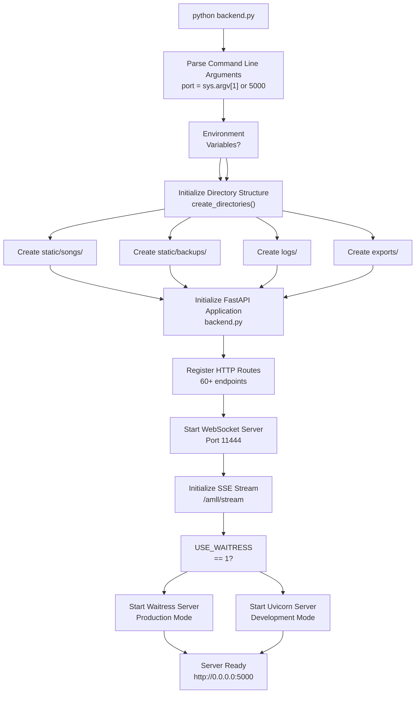
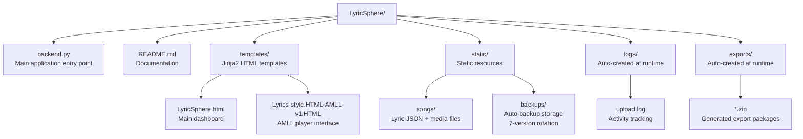
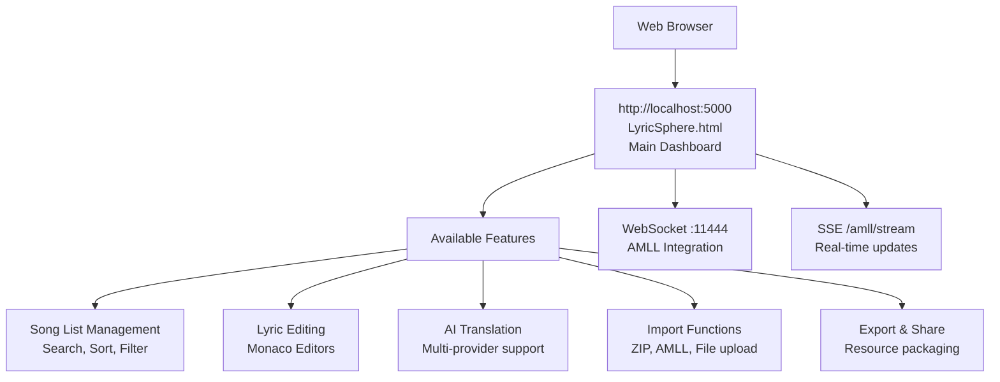

# Getting Started

> **Relevant source files**
> * [.gitignore](https://github.com/HKLHaoBin/LyricSphere/blob/7864cfe0/.gitignore)
> * [AGENTS.md](https://github.com/HKLHaoBin/LyricSphere/blob/7864cfe0/AGENTS.md)
> * [LICENSE](https://github.com/HKLHaoBin/LyricSphere/blob/7864cfe0/LICENSE)
> * [README.md](https://github.com/HKLHaoBin/LyricSphere/blob/7864cfe0/README.md)
> * [requirements-backend.txt](https://github.com/HKLHaoBin/LyricSphere/blob/7864cfe0/requirements-backend.txt)

This page provides step-by-step instructions for installing and running LyricSphere for the first time. It covers environment setup, dependency installation, application startup, and initial configuration. For information about the overall system architecture, see [System Architecture](/HKLHaoBin/LyricSphere/1.2-system-architecture). For detailed backend configuration options, see [Backend System](/HKLHaoBin/LyricSphere/2-backend-system).

---

## Prerequisites

LyricSphere requires the following environment:

| Requirement | Version | Purpose |
| --- | --- | --- |
| Python | 3.6+ | Runtime environment for backend |
| pip | Latest | Package manager for Python dependencies |
| Network Access | - | Required for AI translation features and external font loading |

The application runs on a single backend server process that handles both HTTP/HTTPS requests and WebSocket connections.

**Sources:** [README.md L72-L73](https://github.com/HKLHaoBin/LyricSphere/blob/7864cfe0/README.md#L72-L73)

---

## Installation

### Step 1: Clone the Repository

```
git clone https://github.com/HKLHaoBin/LyricSphere
cd LyricSphere
```

### Step 2: Install Dependencies

LyricSphere uses FastAPI (not Flask, despite some legacy documentation) as its backend framework. Install all required packages:

```
pip install fastapi uvicorn starlette jinja2 aiofiles openai bcrypt Pillow websockets requests python-multipart numpy librosa itsdangerous
```

Or use the requirements file:

```
pip install -r requirements-backend.txt
```

**Core Dependencies:**

| Package | Purpose |
| --- | --- |
| `fastapi` | Main backend framework with async support |
| `uvicorn` | ASGI server for FastAPI (development) |
| `starlette` | Web framework components used by FastAPI |
| `jinja2` | HTML template rendering engine |
| `aiofiles` | Async file I/O operations |
| `openai` | AI translation API client |
| `bcrypt` | Password hashing for authentication |
| `websockets` | WebSocket server for AMLL integration |

**Optional Dependencies:**

| Package | Purpose |
| --- | --- |
| `Pillow` | Image processing for cover art |
| `numpy` | Audio analysis support |
| `librosa` | Audio feature extraction |

**Sources:** [requirements-backend.txt L1-L15](https://github.com/HKLHaoBin/LyricSphere/blob/7864cfe0/requirements-backend.txt#L1-L15)

 [README.md L77-L79](https://github.com/HKLHaoBin/LyricSphere/blob/7864cfe0/README.md#L77-L79)

---

## Running the Application

### Basic Startup

The application is started by executing the `backend.py` module:

```
python backend.py
```

This starts the server on the default port **5000** and binds to all network interfaces (`0.0.0.0`).

### Custom Port Configuration

To specify a custom port, pass it as a command-line argument:

```
python backend.py 8080
```

The application will parse this argument in [backend.py](https://github.com/HKLHaoBin/LyricSphere/blob/7864cfe0/backend.py)

 and configure the server accordingly.

### Production Deployment

For production environments, set the `USE_WAITRESS` environment variable to use the Waitress WSGI server:

```
USE_WAITRESS=1 python backend.py
```

Waitress provides better performance and stability for production workloads compared to the development server.

### Debug Logging

Enable verbose logging output for troubleshooting:

```
DEBUG_LOGGING=1 python backend.py
```

This activates detailed console output showing request processing, file operations, and AI translation steps. Logs are also written to `logs/upload.log`.

**Sources:** [README.md L82-L93](https://github.com/HKLHaoBin/LyricSphere/blob/7864cfe0/README.md#L82-L93)

 [AGENTS.md L20-L21](https://github.com/HKLHaoBin/LyricSphere/blob/7864cfe0/AGENTS.md#L20-L21)

---

## Application Startup Flow



**Sources:** [README.md L82-L93](https://github.com/HKLHaoBin/LyricSphere/blob/7864cfe0/README.md#L82-L93)

 [AGENTS.md L20-L21](https://github.com/HKLHaoBin/LyricSphere/blob/7864cfe0/AGENTS.md#L20-L21)

---

## Directory Structure

On first run, LyricSphere automatically creates the following directory structure:



### Directory Purposes

| Directory | Purpose | Auto-created | User-editable |
| --- | --- | --- | --- |
| `static/songs/` | Stores song metadata JSON, audio files, cover images, and lyric files | Yes | Yes |
| `static/backups/` | Automatic backup storage with 7-version rotation for all edits | Yes | No |
| `logs/` | Application logs including upload activity and error traces | Yes | No |
| `exports/` | Temporary storage for ZIP exports before download | Yes | No |
| `templates/` | Jinja2 HTML templates for web interface | No | Yes |

**Key Files:**

* `backend.py`: Main application entry point containing FastAPI routes, lyric processing engine, AI translation system, and WebSocket server
* `LyricSphere.html`: Main web dashboard for song management, editing, and translation
* `Lyrics-style.HTML-AMLL-v1.HTML`: Advanced AMLL player with animation support

**Sources:** [README.md L95-L108](https://github.com/HKLHaoBin/LyricSphere/blob/7864cfe0/README.md#L95-L108)

 [AGENTS.md L10-L14](https://github.com/HKLHaoBin/LyricSphere/blob/7864cfe0/AGENTS.md#L10-L14)

---

## Accessing the Interface

After starting the server, access LyricSphere through a web browser:



### Primary Interface Endpoints

| URL | Purpose | Authentication |
| --- | --- | --- |
| `http://localhost:5000/` | Main song management dashboard | Optional (configurable) |
| `http://localhost:5000/player` | AMLL-style lyric player | None |
| `http://localhost:5000/quick-editor` | Advanced lyric editor | Device auth required |
| `ws://localhost:11444` | WebSocket for AMLL integration | None |

**Initial Setup:**

1. **No Configuration Required**: The application runs with sensible defaults
2. **Optional Security**: Device authentication and password protection can be configured after first launch
3. **Empty Song List**: Start by creating songs via the "Create Song" button or importing from AMLL/ZIP

**Sources:** [README.md L95-L108](https://github.com/HKLHaoBin/LyricSphere/blob/7864cfe0/README.md#L95-L108)

 [AGENTS.md L31-L33](https://github.com/HKLHaoBin/LyricSphere/blob/7864cfe0/AGENTS.md#L31-L33)

---

## Verification Steps

After starting the application, verify that all components are functioning:

### 1. Check Server Logs

Look for these startup messages in the console:

```
Server running on http://0.0.0.0:5000
WebSocket server started on port 11444
```

### 2. Test Main Dashboard

Open `http://localhost:5000` in a browser. You should see:

* Empty song list (on first run)
* Search bar and filter controls
* "Create Song" button
* Import/Export buttons

### 3. Verify Directory Creation

Check that these directories exist:

```
ls -la static/songs/
ls -la static/backups/
ls -la logs/
ls -la exports/
```

### 4. Test SSE Stream (Optional)

Verify the real-time lyric streaming endpoint:

```
curl -N http://localhost:5000/amll/stream | head
```

This should establish a connection and wait for events (press Ctrl+C to exit).

### 5. Check Upload Log

Verify logging is active:

```
tail -f logs/upload.log
```

This file tracks all file operations and API requests.

**Sources:** [AGENTS.md L30-L33](https://github.com/HKLHaoBin/LyricSphere/blob/7864cfe0/AGENTS.md#L30-L33)

---

## Next Steps

After successfully starting LyricSphere, proceed with these tasks:

| Task | Documentation |
| --- | --- |
| **Create Your First Song** | See [Song Creation and Import](/HKLHaoBin/LyricSphere/3.3-song-creation-and-import) |
| **Edit Lyrics** | See [Main Dashboard](/HKLHaoBin/LyricSphere/3.1-main-dashboard-(lyricsphere.html)) |
| **Configure AI Translation** | See [AI Provider Configuration](/HKLHaoBin/LyricSphere/2.4.2-ai-provider-configuration) |
| **Set Up Security** | See [Device Authentication](/HKLHaoBin/LyricSphere/2.6.1-device-authentication) |
| **Understand Lyric Formats** | See [Format Conversion Pipeline](/HKLHaoBin/LyricSphere/2.3-format-conversion-pipeline) |
| **Integrate AMLL Client** | See [WebSocket Server](/HKLHaoBin/LyricSphere/2.5.1-websocket-server) |

### Common First Actions

1. **Import Existing Lyrics**: Use the ZIP import feature to batch-import songs
2. **Connect AMLL**: Point your AMLL client to `ws://localhost:11444`
3. **Configure AI Keys**: Set up API keys for translation providers (optional)
4. **Enable Security**: Configure password protection for write operations (optional)

**Sources:** [README.md L46-L155](https://github.com/HKLHaoBin/LyricSphere/blob/7864cfe0/README.md#L46-L155)

---

## Troubleshooting

### Port Already in Use

If port 5000 is occupied:

```
python backend.py 5001
```

Or identify and stop the conflicting process.

### Missing Dependencies

If you encounter import errors:

```
pip install --upgrade -r requirements-backend.txt
```

### Permission Errors

Ensure the application has write permissions for:

* `static/songs/`
* `static/backups/`
* `logs/`
* `exports/`

### WebSocket Connection Failed

If AMLL clients cannot connect:

1. Verify port 11444 is not blocked by firewall
2. Check that the WebSocket server started (look for startup message)
3. Ensure no other service is using port 11444

**Sources:** [AGENTS.md L30-L33](https://github.com/HKLHaoBin/LyricSphere/blob/7864cfe0/AGENTS.md#L30-L33)

 [README.md L82-L93](https://github.com/HKLHaoBin/LyricSphere/blob/7864cfe0/README.md#L82-L93)