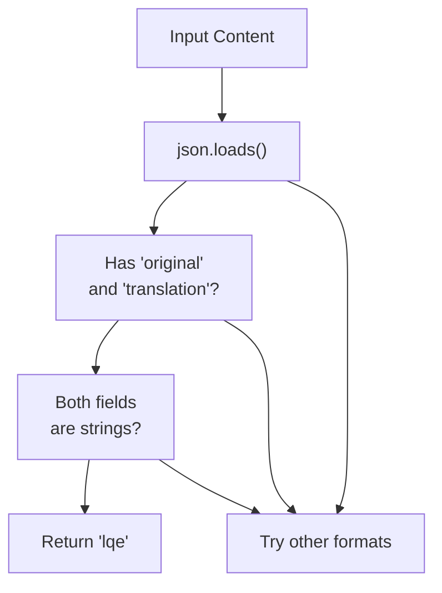
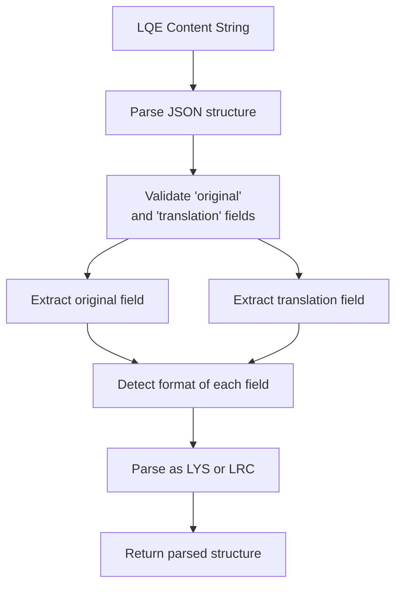
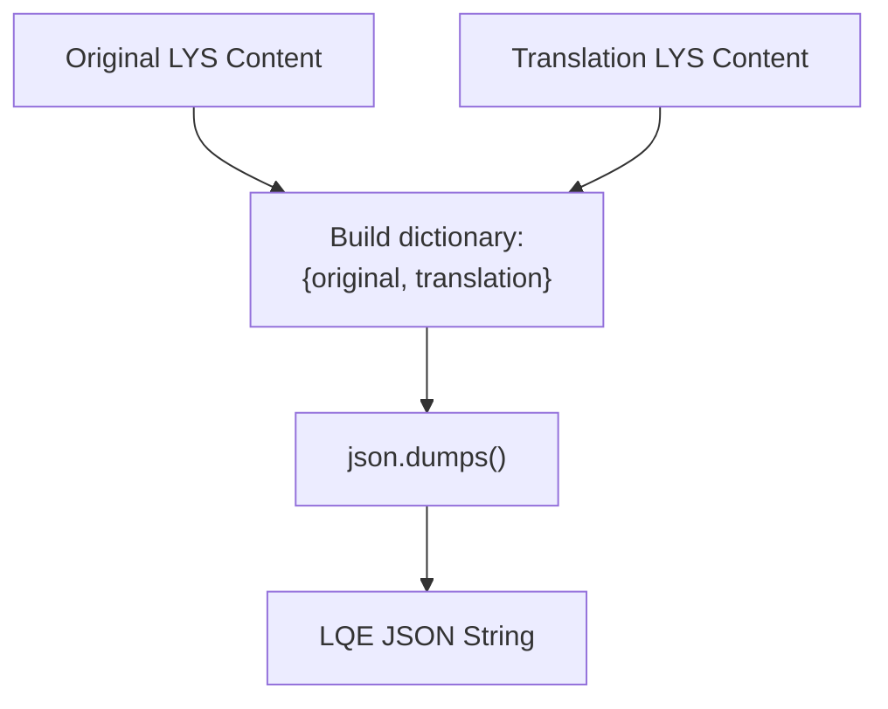
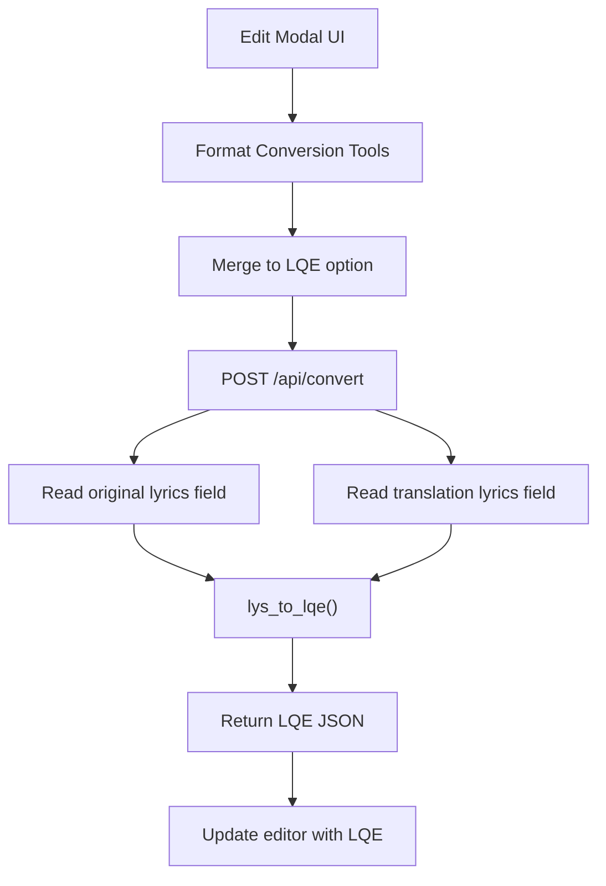
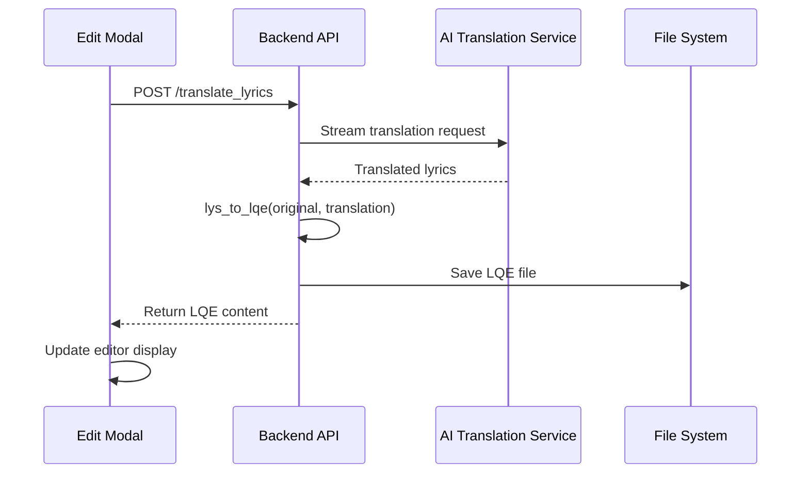
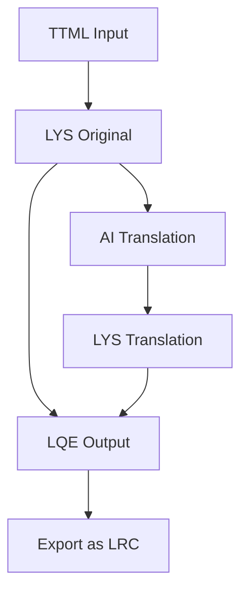

# LQE Format

> **Relevant source files**
> * [CHANGELOG.md](https://github.com/HKLHaoBin/LyricSphere/blob/7864cfe0/CHANGELOG.md)
> * [LICENSE](https://github.com/HKLHaoBin/LyricSphere/blob/7864cfe0/LICENSE)
> * [README.md](https://github.com/HKLHaoBin/LyricSphere/blob/7864cfe0/README.md)
> * [backend.py](https://github.com/HKLHaoBin/LyricSphere/blob/7864cfe0/backend.py)

This page documents the LQE (LyricSphere Enhanced) format, a composite JSON-based format that stores both original lyrics and their translations in a single file. LQE is designed for scenarios requiring simultaneous access to original and translated lyric content.

For details on the underlying lyric formats (LYS and LRC), see [LYS Format](/HKLHaoBin/LyricSphere/2.3.2-lys-format) and [LRC Format](/HKLHaoBin/LyricSphere/2.3.1-lrc-format). For information about the overall format conversion system, see [Format Conversion Pipeline](/HKLHaoBin/LyricSphere/2.3-format-conversion-pipeline).

## Format Specification

LQE files use JSON structure with two primary fields:

| Field | Type | Description | Format |
| --- | --- | --- | --- |
| `original` | string | Original language lyrics | LYS or LRC format |
| `translation` | string | Translated lyrics | LYS or LRC format |

Both fields contain lyric content in either LYS (syllable-level timing) or LRC (line-level timing) format. The formats of `original` and `translation` can differ - for example, `original` may use LYS while `translation` uses LRC.

**Example LQE Structure:**

```json
{
  "original": "[00:12.34]Original lyrics line\n[00:15.67]Another line",
  "translation": "[00:12.34]Translated lyrics line\n[00:15.67]Another translated line"
}
```

Sources: [backend.py L1-L50](https://github.com/HKLHaoBin/LyricSphere/blob/7864cfe0/backend.py#L1-L50)

 Author notes

## Format Detection

The system identifies LQE format through content inspection. The `detect_lyric_format` function examines file content to determine if it follows the LQE structure.



**Detection Logic Flow**

The detection occurs in the broader format detection pipeline where TTML, LYS, LRC, and LQE formats are checked sequentially.

Sources: [backend.py L1700-L1800](https://github.com/HKLHaoBin/LyricSphere/blob/7864cfe0/backend.py#L1700-L1800)

## Parsing and Validation

### parse_lqe Function

The `parse_lqe` function handles LQE content parsing and validation:



**LQE Parser Architecture**

The parser performs these operations:

1. **JSON Parsing**: Converts the input string to a Python dictionary using `json.loads()`
2. **Structure Validation**: Verifies presence of `original` and `translation` keys
3. **Type Checking**: Ensures both fields contain string values
4. **Format Detection**: Determines whether each field uses LYS or LRC format
5. **Content Parsing**: Delegates to `parse_lys` or `parse_lrc` based on detected format
6. **Alignment**: Maintains the relationship between original and translated content through synchronized timestamps

Sources: [backend.py L1800-L1900](https://github.com/HKLHaoBin/LyricSphere/blob/7864cfe0/backend.py#L1800-L1900)

## Generation and Conversion

### lys_to_lqe Function

The `lys_to_lqe` function generates LQE files by merging original lyrics with their translations:

| Parameter | Type | Description |
| --- | --- | --- |
| `original_lys` | string | Original lyrics in LYS format |
| `translation_lys` | string | Translated lyrics in LYS format |
| Returns | string | JSON-formatted LQE content |

**Conversion Process:**



**LYS to LQE Conversion Pipeline**

The function creates a simple JSON structure containing both lyric versions. No format conversion occurs - both inputs are stored as-is in their respective fields.

Sources: [backend.py L1900-L2000](https://github.com/HKLHaoBin/LyricSphere/blob/7864cfe0/backend.py#L1900-L2000)

### Format Conversion Endpoints

LQE files can be generated through the format conversion API endpoints:



**Format Conversion Integration**

Sources: [backend.py L2000-L2100](https://github.com/HKLHaoBin/LyricSphere/blob/7864cfe0/backend.py#L2000-L2100)

## Extraction and Decomposition

When converting LQE back to LYS or LRC, the system extracts either the `original` or `translation` field:

| Operation | Input | Output | Notes |
| --- | --- | --- | --- |
| Extract Original | LQE JSON | LYS/LRC string | Returns `original` field content |
| Extract Translation | LQE JSON | LYS/LRC string | Returns `translation` field content |
| Parse Both | LQE JSON | Parsed structure | Used for rendering or further processing |

The extraction logic simply accesses the appropriate JSON field and returns its string content. The returned content maintains its original LYS or LRC format structure, including all timestamps and metadata.

Sources: [backend.py L1800-L1900](https://github.com/HKLHaoBin/LyricSphere/blob/7864cfe0/backend.py#L1800-L1900)

## Storage and Persistence

### File Storage

LQE files are stored in the `static/songs/` directory with `.json` extension. The JSON structure is saved to disk using standard file I/O operations with UTF-8 encoding.

### Song Metadata Integration

When a song uses LQE format, the song's JSON metadata includes:

```json
{
  "name": "Song Title",
  "lyricPath": "songs/song_lyrics.json",
  "translationPath": null
}
```

Note that `translationPath` is typically `null` for LQE files since both original and translation are contained within the single file referenced by `lyricPath`.

Sources: [backend.py L950-L1050](https://github.com/HKLHaoBin/LyricSphere/blob/7864cfe0/backend.py#L950-L1050)

## Use Cases

### AI Translation Storage

The primary use case for LQE format is storing AI-translated lyrics. After translation, the system can merge original and translated content:



**AI Translation to LQE Workflow**

Sources: [backend.py L2100-L2300](https://github.com/HKLHaoBin/LyricSphere/blob/7864cfe0/backend.py#L2100-L2300)

### Export and Sharing

LQE format facilitates sharing translated lyrics as a single file:

* **Single File Distribution**: Both original and translation travel together
* **Format Preservation**: Original timing and structure maintained
* **Easy Decomposition**: Recipients can extract either version as needed
* **Import Support**: ZIP import/export functions recognize LQE files

When exporting songs with LQE lyrics, the export system includes the single LQE file and updates internal references appropriately.

Sources: [backend.py L3500-L3700](https://github.com/HKLHaoBin/LyricSphere/blob/7864cfe0/backend.py#L3500-L3700)

### Cross-Format Compatibility

LQE serves as an intermediate format for workflows involving multiple lyric formats:



**LQE in Multi-Format Workflow**

This enables complex workflows where source material arrives in one format (e.g., TTML), gets translated, stored as LQE, and later exported in yet another format (e.g., LRC) for compatibility with specific applications.

Sources: [backend.py L1500-L2000](https://github.com/HKLHaoBin/LyricSphere/blob/7864cfe0/backend.py#L1500-L2000)

## API Integration

### Relevant Endpoints

| Endpoint | Method | Purpose |
| --- | --- | --- |
| `/api/convert` | POST | Convert between formats, including LQE generation |
| `/upload_lyrics` | POST | Upload lyrics, detecting LQE format automatically |
| `/update_lyrics` | POST | Update song with LQE content |
| `/translate_lyrics` | POST | Translate and optionally generate LQE |

### Request/Response Example

**Converting to LQE:**

Request:

```json
{
  "original_content": "[00:12.34]Original line",
  "translation_content": "[00:12.34]Translated line",
  "target_format": "lqe"
}
```

Response:

```json
{
  "success": true,
  "content": "{\"original\":\"[00:12.34]Original line\",\"translation\":\"[00:12.34]Translated line\"}",
  "format": "lqe"
}
```

Sources: [backend.py L2000-L2300](https://github.com/HKLHaoBin/LyricSphere/blob/7864cfe0/backend.py#L2000-L2300)

## Technical Considerations

### Format Flexibility

LQE does not enforce format consistency between `original` and `translation` fields. One field may use LYS (syllable-level) while the other uses LRC (line-level). This flexibility accommodates scenarios where:

* Source lyrics have syllable timing but translation only has line timing
* Different timing granularities are preferred for different languages
* Legacy formats are being integrated with newly translated content

### Timestamp Alignment

While LQE stores both versions, it does not enforce timestamp alignment. Applications reading LQE files must implement their own alignment logic based on:

* Matching timestamps when both versions use the same timing points
* Interpolating timestamps when timing granularities differ
* Handling cases where line counts don't match exactly

### Validation Strategy

The parser validates structure but not content consistency:

* ✓ Validates JSON syntax
* ✓ Validates presence of required fields
* ✓ Validates field types (strings)
* ✗ Does not validate timestamp alignment
* ✗ Does not validate line count matching
* ✗ Does not validate language detection

This minimal validation approach provides flexibility while ensuring basic format compliance.

Sources: [backend.py L1800-L1900](https://github.com/HKLHaoBin/LyricSphere/blob/7864cfe0/backend.py#L1800-L1900)

## Implementation Reference

### Core Functions

| Function | Location | Purpose |
| --- | --- | --- |
| `parse_lqe` | [backend.py L1800-L1900](https://github.com/HKLHaoBin/LyricSphere/blob/7864cfe0/backend.py#L1800-L1900) | Parse and validate LQE content |
| `lys_to_lqe` | [backend.py L1900-L2000](https://github.com/HKLHaoBin/LyricSphere/blob/7864cfe0/backend.py#L1900-L2000) | Generate LQE from separate lyrics |
| `detect_lyric_format` | [backend.py L1700-L1800](https://github.com/HKLHaoBin/LyricSphere/blob/7864cfe0/backend.py#L1700-L1800) | Identify LQE format in content |

### Related Systems

* **AI Translation System** ([#2.4](/HKLHaoBin/LyricSphere/2.4-ai-translation-system)): Primary generator of LQE files
* **Format Conversion Pipeline** ([#2.3](/HKLHaoBin/LyricSphere/2.3-format-conversion-pipeline)): Handles LQE conversions
* **Export System** ([#3.4](/HKLHaoBin/LyricSphere/3.4-export-and-sharing)): Packages LQE files for distribution
* **File Management** ([#2.2](/HKLHaoBin/LyricSphere/2.2-file-management-system)): Stores and retrieves LQE files

Sources: [backend.py L1-L50](https://github.com/HKLHaoBin/LyricSphere/blob/7864cfe0/backend.py#L1-L50)

 [backend.py L1700-L2300](https://github.com/HKLHaoBin/LyricSphere/blob/7864cfe0/backend.py#L1700-L2300)