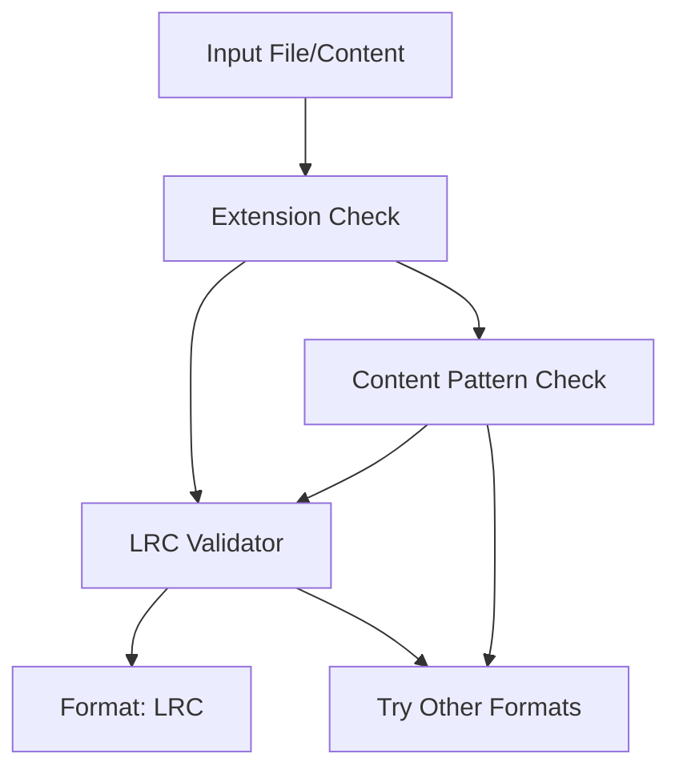
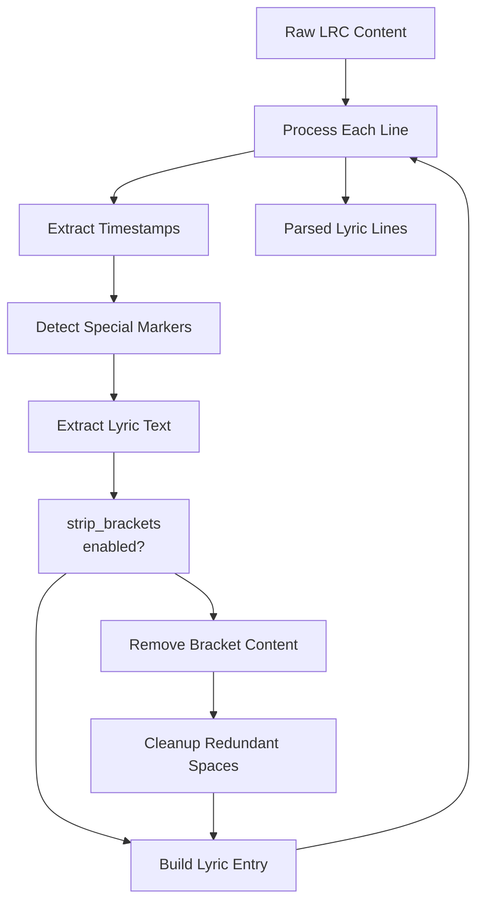
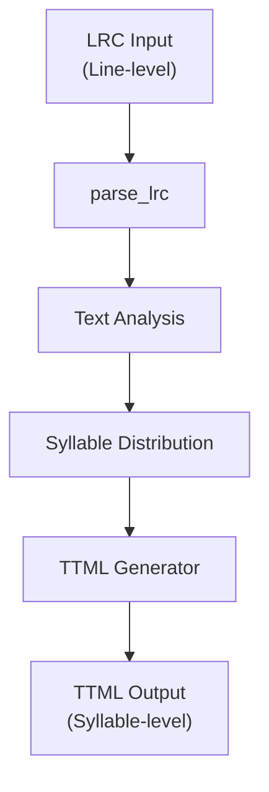
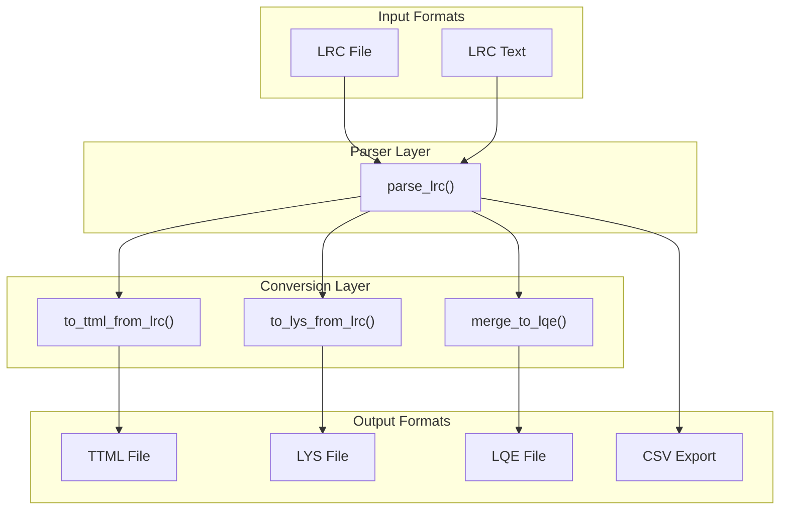
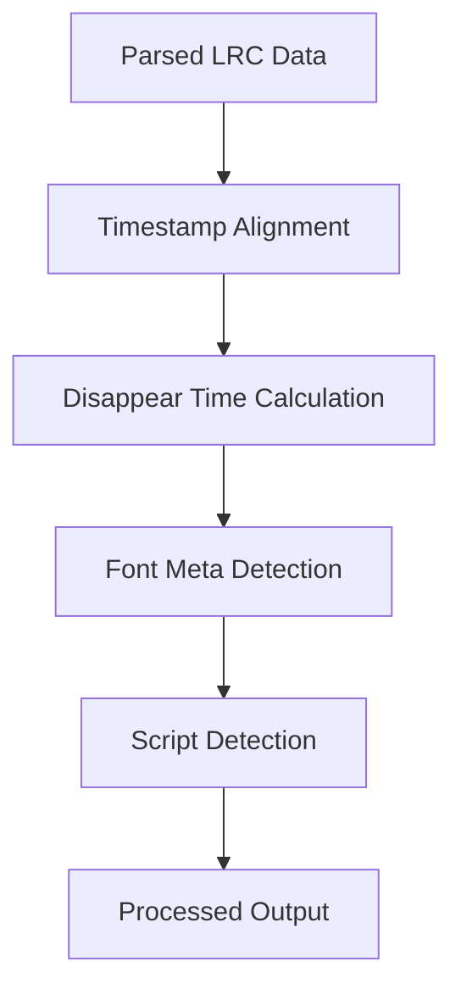

# LRC Format

> **Relevant source files**
> * [CHANGELOG.md](https://github.com/HKLHaoBin/LyricSphere/blob/7864cfe0/CHANGELOG.md)
> * [LICENSE](https://github.com/HKLHaoBin/LyricSphere/blob/7864cfe0/LICENSE)
> * [README.md](https://github.com/HKLHaoBin/LyricSphere/blob/7864cfe0/README.md)
> * [backend.py](https://github.com/HKLHaoBin/LyricSphere/blob/7864cfe0/backend.py)

## Purpose and Scope

This document describes LyricSphere's support for the LRC (LRC Lyrics) format, a widely-adopted line-level timed lyrics format. LRC provides timestamp-synchronized lyrics at the line granularity level, making it suitable for music players and basic lyric display applications.

This page covers LRC format parsing, special marker support (background vocals and duets), preprocessing options, and conversion capabilities. For syllable-level timing support, see [LYS Format](/HKLHaoBin/LyricSphere/2.3.2-lys-format). For XML-based lyrics with Apple-style output, see [TTML Format](/HKLHaoBin/LyricSphere/2.3.3-ttml-format). For information about the overall conversion architecture, see [Format Conversion Pipeline](/HKLHaoBin/LyricSphere/2.3-format-conversion-pipeline).

---

## Format Specification

### Basic Syntax

The LRC format uses a simple line-based structure where each lyric line is prefixed with one or more timestamps:

```
[mm:ss.xx]Lyric text
[mm:ss.xx][mm:ss.yy]Multiple timestamps for same line
```

**Timestamp Components:**

* `mm`: Minutes (2 digits)
* `ss`: Seconds (2 digits)
* `xx` or `.xx`: Centiseconds or milliseconds (2-3 digits after decimal point)

**Format Variations:**

| Pattern | Example | Description |
| --- | --- | --- |
| `[MM:SS.mm]` | `[01:23.45]` | Standard format with centiseconds |
| `[MM:SS.mmm]` | `[01:23.456]` | Extended format with milliseconds |
| `[MM:SS]` | `[01:23]` | Simplified format without fractions |

### Metadata Tags

LRC files may include metadata lines using ID3-style tags:

```
[ar:Artist Name]
[ti:Song Title]
[al:Album Name]
[by:Creator]
[offset:+/-time in milliseconds]
```

These metadata lines are typically placed at the beginning of the file but are not processed as lyrics.

Sources: [README.md L116-L119](https://github.com/HKLHaoBin/LyricSphere/blob/7864cfe0/README.md#L116-L119)

 Diagram 5 from high-level architecture

---

## Special Markers

LyricSphere extends standard LRC with special markers for enhanced vocal attribution and duet support.

### Background Vocals Markers

Background vocals are indicated using numeric markers in brackets:

| Marker | Meaning | Usage |
| --- | --- | --- |
| `[6]` | Background vocal line | Entire line is backing vocals |
| `[7]` | Background vocal line (alternate) | Another style of BG vocals |
| `[8]` | Background vocal line (alternate) | Additional BG vocal style |

**Example:**

```
[01:23.45]Main vocal line
[01:25.67][6]Background harmony
[01:27.89][7]Additional backing vocals
```

### Duet Markers

Duet parts are distinguished using specific markers:

| Marker | Role | Voice Assignment |
| --- | --- | --- |
| `[2]` | Primary vocalist | Main singer or Singer A |
| `[5]` | Secondary vocalist | Harmony singer or Singer B |

**Example:**

```
[02:15.30][2]First singer's part
[02:18.45][5]Second singer's response
[02:21.60][2]First singer continues
```

These markers are preserved during format conversions and mapped to appropriate attributes in TTML format (`ttm:role="x-bg"` for background vocals, `ttm:agent="v2"` for duets).

Sources: [README.md L113-L119](https://github.com/HKLHaoBin/LyricSphere/blob/7864cfe0/README.md#L113-L119)

 [backend.py L1-L50](https://github.com/HKLHaoBin/LyricSphere/blob/7864cfe0/backend.py#L1-L50)

 (imports and structure)

---

## Format Detection

### Detection Pipeline

LyricSphere employs a multi-stage detection process to identify LRC files:



### Detection Criteria

The system checks for the following patterns to identify LRC content:

1. **File Extension**: Files with `.lrc` extension
2. **Content Pattern**: Presence of `[MM:SS` timestamp patterns
3. **Line Structure**: Lines beginning with `[` followed by digit patterns

**Regex Pattern** (conceptual):

```
^\[(\d{1,2}):(\d{2})(?:\.(\d{2,3}))?\]
```

This matches:

* Optional leading digits for minutes
* Colon separator `:`
* Two-digit seconds
* Optional decimal point and 2-3 digit fractional seconds

Sources: Diagram 5 from high-level architecture

---

## Parsing Implementation

### Parse Flow



### Parser Components

The LRC parser (`parse_lrc` function) implements the following logic:

**Step 1: Timestamp Extraction**

* Uses regular expressions to identify all `[MM:SS.xx]` patterns in each line
* Converts timestamps to milliseconds for internal representation
* Supports multiple timestamps per line (for repeated choruses)

**Step 2: Special Marker Recognition**

* Scans for `[6]`, `[7]`, `[8]` background vocal markers
* Identifies `[2]`, `[5]` duet markers
* Preserves markers for downstream processing

**Step 3: Text Extraction**

* Extracts lyric text after all timestamp and marker patterns
* Removes leading/trailing whitespace
* Preserves internal spacing and punctuation

**Step 4: Bracket Preprocessing** (Optional)

* When `strip_brackets` configuration is enabled
* Uses string translation table (not regex) for high performance
* Removes content within brackets while preserving surrounding text
* Cleans up redundant spaces resulting from bracket removal

**Performance Optimization:**

```
Translation Table Method:
- Faster than regex for bracket removal
- Character-by-character mapping
- Preserves text outside brackets
- Example: "Hello (world) there" → "Hello  there" → "Hello there"
```

### Multi-line Support

The parser handles cases where multiple lines share the same timestamp:

```
[01:30.00]First part of line
[01:30.00]Second part (harmony)
[01:32.50]Next line
```

Both lines at `[01:30.00]` are parsed as separate entries but with the same timing.

Sources: [README.md L44](https://github.com/HKLHaoBin/LyricSphere/blob/7864cfe0/README.md#L44-L44)

 [CHANGELOG.md L69-L76](https://github.com/HKLHaoBin/LyricSphere/blob/7864cfe0/CHANGELOG.md#L69-L76)

 Diagram 5 from high-level architecture

---

## Conversion Capabilities

### LRC to TTML Conversion

LyricSphere converts LRC to Apple-style TTML format for enhanced display features:



**Conversion Process:**

1. **Parse LRC**: Extract timestamps and text
2. **Text Analysis**: Break text into words/syllables
3. **Time Distribution**: Divide line duration equally across syllables
4. **TTML Generation**: Create `<p>` elements with `<span>` for each syllable

**Marker Mapping:**

| LRC Marker | TTML Attribute | Description |
| --- | --- | --- |
| `[6][7][8]` | `ttm:role="x-bg"` | Background vocals role |
| `[2]` | `ttm:agent="v1"` | Primary vocalist |
| `[5]` | `ttm:agent="v2"` | Secondary vocalist |

**Example Transformation:**

```
[00:10.00]Hello world
[00:12.00][6]Background harmony
```

Converts to (conceptual TTML):

```html
<p begin="00:10.000" end="00:12.000">
  <span begin="00:10.000" end="00:11.000">Hello</span>
  <span begin="00:11.000" end="00:12.000">world</span>
</p>
<p begin="00:12.000" end="00:14.000" ttm:role="x-bg">
  <span begin="00:12.000" end="00:13.000">Background</span>
  <span begin="00:13.000" end="00:14.000">harmony</span>
</p>
```

### LRC to LYS Conversion

LRC can be converted to LYS format for internal processing:

* Each word becomes a syllable group
* Line timing is distributed across words
* Simple word-level tokenization (split on spaces)

### LRC to LQE Conversion

For merged lyrics and translations:

* LRC provides the base timing structure
* Translation lines are aligned by timestamp
* Both tracks are combined into LQE format

Sources: [README.md L127-L129](https://github.com/HKLHaoBin/LyricSphere/blob/7864cfe0/README.md#L127-L129)

 [CHANGELOG.md L141-L143](https://github.com/HKLHaoBin/LyricSphere/blob/7864cfe0/CHANGELOG.md#L141-L143)

 Diagram 5 from high-level architecture

---

## Format Conversion Routes

### API Endpoints

The following backend routes handle LRC conversions:

| Route | Purpose | Input | Output |
| --- | --- | --- | --- |
| `/convert_to_ttml_temp` | Temporary TTML conversion | LRC content | TTML text |
| `/convert_format` | General format conversion | LRC file | TTML/LYS/CSV |
| `/save_song` | Save with auto-conversion | Mixed formats | Normalized JSON |

### Conversion Architecture



Sources: [README.md L124-L130](https://github.com/HKLHaoBin/LyricSphere/blob/7864cfe0/README.md#L124-L130)

 [backend.py L1-L50](https://github.com/HKLHaoBin/LyricSphere/blob/7864cfe0/backend.py#L1-L50)

 (routing structure)

---

## Preprocessing Features

### Bracket Removal

The `strip_brackets` configuration option controls whether bracketed content is removed during parsing:

**Configuration:**

```json
{
  "strip_brackets": true
}
```

**Processing Method:**

1. **String Translation Table**: High-performance character-by-character mapping
2. **Bracket Pairs Removed**: `()`, `[]`, `{}`, `（）` (full-width)
3. **Text Preservation**: Content outside brackets remains intact
4. **Space Cleanup**: Redundant spaces from removal are collapsed

**Example:**

```yaml
Input:  "Hello (world) there [note]"
Step 1: "Hello  there "
Step 2: "Hello there"
```

### Performance Characteristics

| Method | Operations/sec | Use Case |
| --- | --- | --- |
| String Translation | ~500K lines/sec | Production default |
| Regex Substitution | ~50K lines/sec | Fallback only |

The translation table method provides **10x performance improvement** over regex-based bracket removal, making it suitable for real-time processing of large lyric files.

### Space Normalization

After bracket removal or general text processing, the system applies space cleanup:

* Collapse multiple consecutive spaces to single space
* Remove leading and trailing whitespace
* Preserve intentional spacing in original lyrics

Sources: [README.md L44](https://github.com/HKLHaoBin/LyricSphere/blob/7864cfe0/README.md#L44-L44)

 [CHANGELOG.md L69-L76](https://github.com/HKLHaoBin/LyricSphere/blob/7864cfe0/CHANGELOG.md#L69-L76)

---

## Post-Processing Pipeline

After parsing, LRC content undergoes several post-processing stages:



### Timestamp Alignment

**Function**: `compute_disappear_times`

Calculates when each lyric line should disappear based on:

* Next line's start time
* Animation duration parameters (default 600ms)
* End-of-song handling

**Example:**

```
Line 1: [00:10.000] - appears at 10.0s
Line 2: [00:15.000] - appears at 15.0s
Line 1 disappear time: 15.0s - 0.6s = 14.4s
```

### Animation Configuration

The `/player/animation-config` endpoint synchronizes frontend-reported animation parameters:

| Parameter | Default | Purpose |
| --- | --- | --- |
| `entryDuration` | 600ms | Line entry animation |
| `moveDuration` | 600ms | Line movement |
| `exitDuration` | 600ms | Line exit animation |
| `useComputedDisappear` | true | Enable backend calculation |

Sources: [CHANGELOG.md L107-L115](https://github.com/HKLHaoBin/LyricSphere/blob/7864cfe0/CHANGELOG.md#L107-L115)

 Diagram 4 from high-level architecture

---

## Integration with Player Systems

### AMLL Integration

LRC lyrics can be played through AMLL (Apple Music-Like Lyrics) systems:

**Conversion Path:**

```
LRC → parse_lrc() → to_ttml_from_lrc() → AMLL WebSocket
```

**WebSocket Message Structure** (conceptual):

```json
{
  "type": "lyric_update",
  "timestamp": 10000,
  "line": "Hello world",
  "next_timestamp": 15000
}
```

### SSE Streaming

For browser-based players, LRC content streams via Server-Sent Events:

**Endpoint**: `/amll/stream`

**Event Format:**

```yaml
event: lyric_line
data: {"time": 10.0, "text": "Hello world", "disappear": 14.4}
```

### Animation Player

The lyrics animation pages (`Lyrics-style.HTML-*`) consume LRC-derived data:

1. **Initial Load**: Convert LRC to internal format
2. **Real-time Updates**: Receive timestamp events
3. **Animation Rendering**: Apply syllable-level animations (from TTML conversion)
4. **FLIP Animation**: Smooth transitions between lyric lines

Sources: Diagram 4 from high-level architecture, [README.md L133-L136](https://github.com/HKLHaoBin/LyricSphere/blob/7864cfe0/README.md#L133-L136)

---

## Storage and Backup

### JSON Storage Format

Parsed LRC lyrics are stored in song JSON files:

```json
{
  "name": "Song Title",
  "artist": "Artist Name",
  "lyrics": "[00:10.00]First line\n[00:15.00]Second line",
  "lyricsType": "lrc",
  "translation": "[00:10.00]Translation line 1\n[00:15.00]Translation line 2",
  "translationType": "lrc"
}
```

### Backup Management

When LRC files are modified:

1. **Pre-save Backup**: Current version saved to `static/backups/`
2. **Naming Convention**: `{filename}.lrc.{timestamp}`
3. **Rotation Policy**: Maximum 7 versions retained
4. **Timestamp Format**: `YYYYMMDD_HHMMSS`

**Example Backup Sequence:**

```
song.lrc.20250108_143022  (newest)
song.lrc.20250108_120045
song.lrc.20250107_183012
...
song.lrc.20250101_091500  (oldest, will be deleted on next save)
```

Sources: [backend.py L1293-L1336](https://github.com/HKLHaoBin/LyricSphere/blob/7864cfe0/backend.py#L1293-L1336)

 [README.md L26](https://github.com/HKLHaoBin/LyricSphere/blob/7864cfe0/README.md#L26-L26)

---

## Limitations and Considerations

### Format Constraints

| Limitation | Impact | Workaround |
| --- | --- | --- |
| Line-level timing only | No per-syllable animation | Convert to TTML or LYS |
| No native duet support | Manual markers required | Use `[2]`/`[5]` markers |
| No styling information | Plain text only | Use TTML for rich text |
| Fixed time alignment | Cannot adjust word timing | Edit timestamps manually |

### Conversion Trade-offs

**LRC → TTML:**

* ✅ Gains syllable-level timing
* ⚠️ Timing is estimated/distributed
* ⚠️ Actual syllable boundaries unknown

**LRC → LYS:**

* ✅ Maintains line structure
* ⚠️ Word-level only (not true syllables)
* ⚠️ Less precise than native LYS

### Performance Characteristics

| Operation | Time Complexity | Notes |
| --- | --- | --- |
| Parse LRC file | O(n) | n = number of lines |
| Timestamp extraction | O(n*m) | m = timestamps per line |
| Bracket removal | O(n*l) | l = line length |
| TTML conversion | O(n*w) | w = words per line |

For files with thousands of lines, parsing typically completes in <100ms on modern hardware.

### Compatibility

LyricSphere's LRC implementation is compatible with:

* ✅ Standard LRC files from music players
* ✅ Enhanced LRC with metadata tags
* ✅ Multi-timestamp LRC files
* ✅ Unicode content (Chinese, Japanese, Korean, etc.)
* ⚠️ Non-standard timestamp formats may require adjustment
* ❌ Binary LRC formats not supported

Sources: [README.md L111-L123](https://github.com/HKLHaoBin/LyricSphere/blob/7864cfe0/README.md#L111-L123)

 Diagram 5 from high-level architecture

---

## Example Usage

### Basic LRC File

```
[ar:Taylor Swift]
[ti:Example Song]
[al:Example Album]
[by:LyricSphere]

[00:15.00]First verse line one
[00:18.50]First verse line two
[00:22.00]First verse line three

[00:30.00]Chorus starts here
[00:33.50][2]Primary vocalist
[00:37.00][5]Secondary vocalist responds

[00:45.00]Second verse begins
[00:48.50][6]Background vocals added
[00:52.00]Verse continues
```

### With Bracket Preprocessing

**Original:**

```
[01:00.00]Main lyrics (with note) continue
[01:05.00]More text [annotation] here
```

**With `strip_brackets=true`:**

```
Main lyrics continue
More text here
```

**With `strip_brackets=false`:**

```
Main lyrics (with note) continue
More text [annotation] here
```

### CSV Export Output

When exporting to CSV, each line becomes a row:

| Timestamp | Duration | Text | Type |
| --- | --- | --- | --- |
| 15.000 | 3.500 | First verse line one | normal |
| 18.500 | 3.500 | First verse line two | normal |
| 33.500 | 3.500 | Primary vocalist | duet-v1 |
| 37.000 | 3.500 | Secondary vocalist responds | duet-v2 |
| 48.500 | 3.500 | Background vocals added | background |

Sources: [README.md L42-L43](https://github.com/HKLHaoBin/LyricSphere/blob/7864cfe0/README.md#L42-L43)

 [backend.py L997-L1004](https://github.com/HKLHaoBin/LyricSphere/blob/7864cfe0/backend.py#L997-L1004)

---

## Related Functions and Code References

### Core Functions

| Function | Location | Purpose |
| --- | --- | --- |
| `parse_lrc` | [backend.py](https://github.com/HKLHaoBin/LyricSphere/blob/7864cfe0/backend.py) | Main LRC parser |
| `to_ttml_from_lrc` | [backend.py](https://github.com/HKLHaoBin/LyricSphere/blob/7864cfe0/backend.py) | LRC to TTML converter |
| `sanitize_filename` | [backend.py L997-L1004](https://github.com/HKLHaoBin/LyricSphere/blob/7864cfe0/backend.py#L997-L1004) | Filename safety |
| `compute_disappear_times` | [backend.py](https://github.com/HKLHaoBin/LyricSphere/blob/7864cfe0/backend.py) | Animation timing |
| `extract_resource_relative` | [backend.py L1018-L1034](https://github.com/HKLHaoBin/LyricSphere/blob/7864cfe0/backend.py#L1018-L1034) | Path resolution |

### Related Endpoints

| Route | Method | Purpose |
| --- | --- | --- |
| `/save_song` | POST | Save/update song with LRC |
| `/convert_format` | POST | Format conversion |
| `/convert_to_ttml_temp` | POST | Temporary TTML for AMLL |
| `/export_csv` | POST | Export to CSV timeline |

Sources: [backend.py L1-L50](https://github.com/HKLHaoBin/LyricSphere/blob/7864cfe0/backend.py#L1-L50)

 (structure), [backend.py L997-L1063](https://github.com/HKLHaoBin/LyricSphere/blob/7864cfe0/backend.py#L997-L1063)

 (path utilities)