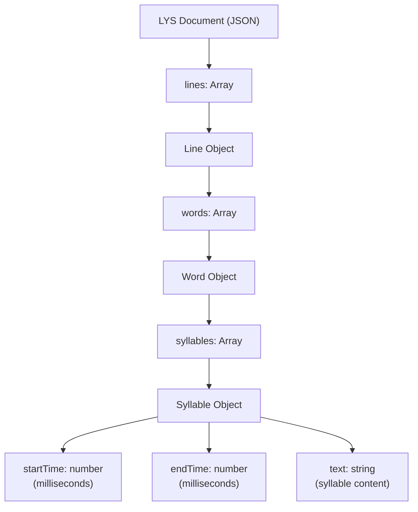
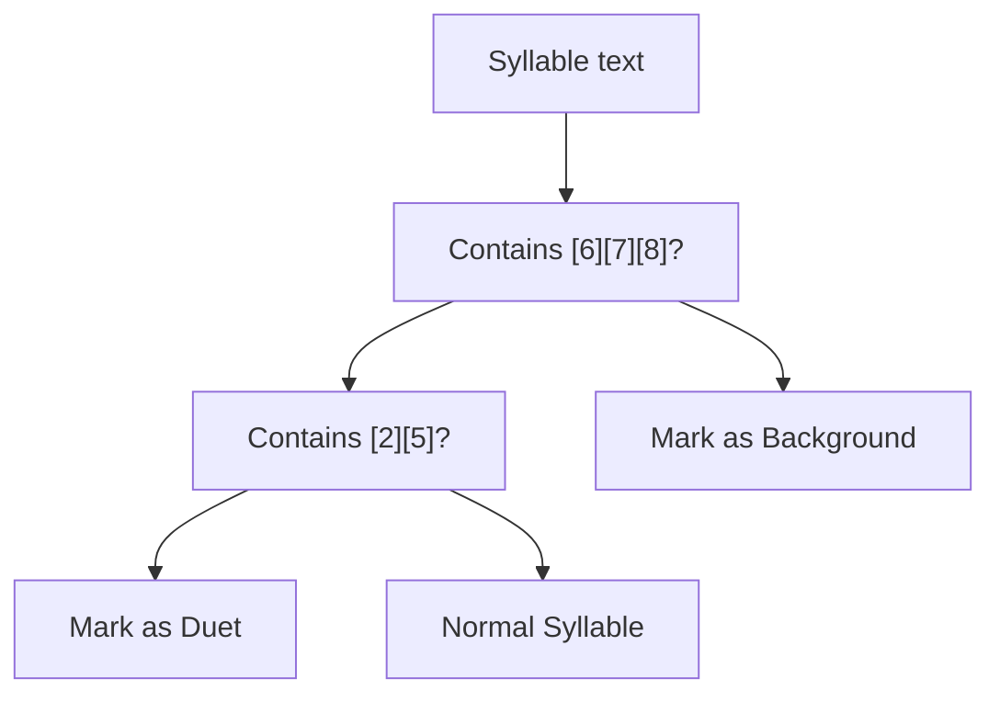
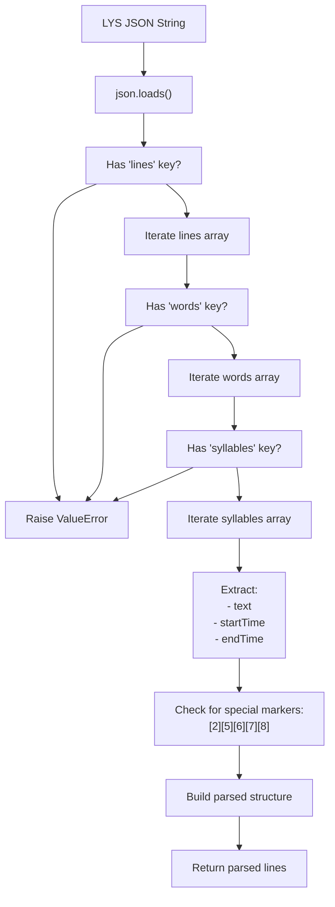
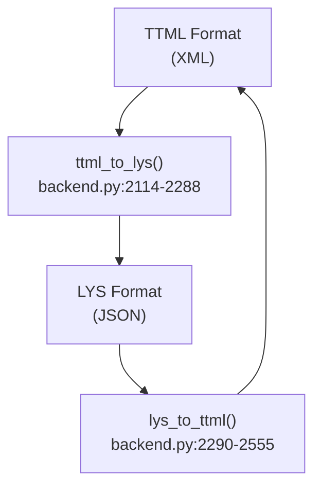
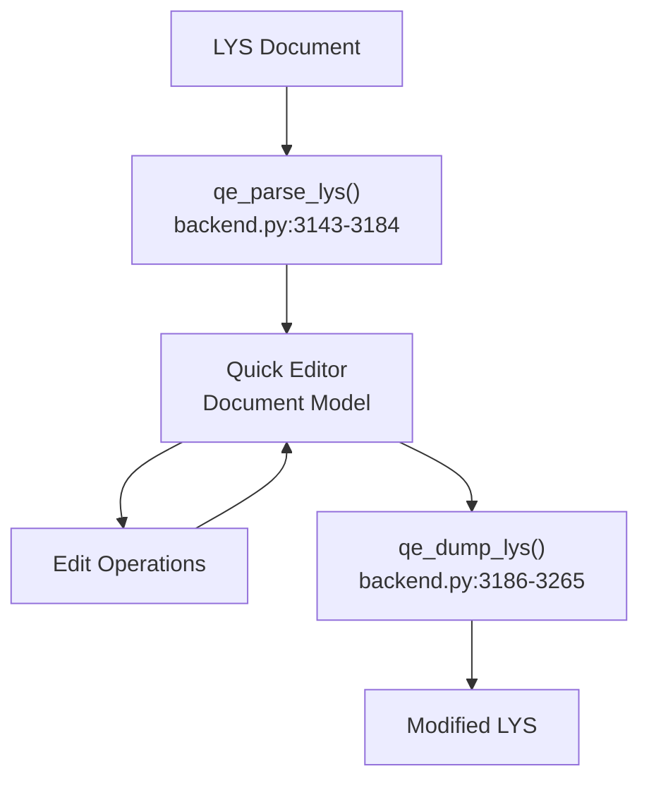

# LYS Format

> **Relevant source files**
> * [CHANGELOG.md](https://github.com/HKLHaoBin/LyricSphere/blob/7864cfe0/CHANGELOG.md)
> * [LICENSE](https://github.com/HKLHaoBin/LyricSphere/blob/7864cfe0/LICENSE)
> * [README.md](https://github.com/HKLHaoBin/LyricSphere/blob/7864cfe0/README.md)
> * [backend.py](https://github.com/HKLHaoBin/LyricSphere/blob/7864cfe0/backend.py)

This document describes the LYS (LyricSphere) format, a custom syllable-level timing format for precise lyric synchronization and animation. LYS is the internal representation format used throughout LyricSphere for high-quality per-syllable lyric display.

For line-level timing formats, see [LRC Format](/HKLHaoBin/LyricSphere/2.3.1-lrc-format). For XML-based formats, see [TTML Format](/HKLHaoBin/LyricSphere/2.3.3-ttml-format). For merged lyric and translation formats, see [LQE Format](/HKLHaoBin/LyricSphere/2.3.4-lqe-format).

---

## Format Overview

LYS is a JSON-based format that provides syllable-level timing precision, making it ideal for advanced lyric animations and word-by-word synchronization. Unlike line-based formats (LRC) or XML formats (TTML), LYS structures lyrics hierarchically as lines containing words containing syllables, with each syllable having precise start and end timestamps.

The format is the primary internal representation used by LyricSphere's lyric processing engine and supports advanced features including background vocal markers, duet indicators, font metadata tags, and syllable grouping for optimized rendering.

**Sources:** [backend.py L1886-L1977](https://github.com/HKLHaoBin/LyricSphere/blob/7864cfe0/backend.py#L1886-L1977)

 [README.md L112-L114](https://github.com/HKLHaoBin/LyricSphere/blob/7864cfe0/README.md#L112-L114)

---

## JSON Structure Specification

### Hierarchical Organization

LYS uses a three-level hierarchy to represent lyrics:



**Sources:** [backend.py L1886-L1977](https://github.com/HKLHaoBin/LyricSphere/blob/7864cfe0/backend.py#L1886-L1977)

### Data Model

| Level | Container | Contains | Purpose |
| --- | --- | --- | --- |
| **Document** | Root object | `lines` array | Top-level structure |
| **Line** | Line object | `words` array | Represents a lyric line or phrase |
| **Word** | Word object | `syllables` array | Groups syllables into semantic units |
| **Syllable** | Syllable object | `startTime`, `endTime`, `text` | Atomic timing unit with text |

### Field Specifications

#### Syllable Object

Each syllable is the atomic unit of timing in LYS format:

| Field | Type | Required | Description |
| --- | --- | --- | --- |
| `text` | string | Yes | The syllable text content |
| `startTime` | number | Yes | Start timestamp in milliseconds |
| `endTime` | number | Yes | End timestamp in milliseconds |

#### Word Object

Words group syllables for semantic organization:

| Field | Type | Required | Description |
| --- | --- | --- | --- |
| `syllables` | array | Yes | Array of syllable objects |

#### Line Object

Lines represent complete phrases or segments:

| Field | Type | Required | Description |
| --- | --- | --- | --- |
| `words` | array | Yes | Array of word objects |

### Example Structure

```json
{
  "lines": [
    {
      "words": [
        {
          "syllables": [
            {
              "text": "Hello",
              "startTime": 1000,
              "endTime": 1500
            }
          ]
        },
        {
          "syllables": [
            {
              "text": "world",
              "startTime": 1600,
              "endTime": 2000
            }
          ]
        }
      ]
    }
  ]
}
```

**Sources:** [backend.py L1886-L1977](https://github.com/HKLHaoBin/LyricSphere/blob/7864cfe0/backend.py#L1886-L1977)

 [backend.py L2114-L2288](https://github.com/HKLHaoBin/LyricSphere/blob/7864cfe0/backend.py#L2114-L2288)

---

## Special Markers

LYS supports inline markers for background vocals and duet parts, encoded as numeric tokens within the syllable text.

### Background Vocal Markers

Background vocals are marked with `[6]`, `[7]`, or `[8]` tokens:

| Marker | Meaning | TTML Equivalent |
| --- | --- | --- |
| `[6]` | Background vocal (type 1) | `ttm:role="x-bg"` |
| `[7]` | Background vocal (type 2) | `ttm:role="x-bg"` |
| `[8]` | Background vocal (type 3) | `ttm:role="x-bg"` |

### Duet Markers

Duet or alternate singer parts are marked with `[2]` or `[5]`:

| Marker | Meaning | TTML Equivalent |
| --- | --- | --- |
| `[2]` | Second singer (duet part) | `ttm:agent="v2"` |
| `[5]` | Alternate vocalist | `ttm:agent="v2"` |

### Marker Detection Logic



**Marker Detection Pattern**: The parser checks each syllable's text for the presence of these numeric bracket tokens using regex pattern `\[([0-9]+)\]`.

**Sources:** [backend.py L2114-L2288](https://github.com/HKLHaoBin/LyricSphere/blob/7864cfe0/backend.py#L2114-L2288)

 [backend.py L2290-L2555](https://github.com/HKLHaoBin/LyricSphere/blob/7864cfe0/backend.py#L2290-L2555)

 [README.md L113-L114](https://github.com/HKLHaoBin/LyricSphere/blob/7864cfe0/README.md#L113-L114)

---

## Parser Implementation

### parse_lys Function

The primary LYS parser is implemented in `parse_lys` which validates structure and extracts timing data:



### Validation Rules

The parser enforces strict structural validation:

| Validation | Level | Requirement |
| --- | --- | --- |
| Root structure | Document | Must be valid JSON with `lines` array |
| Line structure | Line | Each line must have `words` array |
| Word structure | Word | Each word must have `syllables` array |
| Syllable fields | Syllable | Must have `text`, `startTime`, `endTime` |
| Timestamp types | Syllable | `startTime` and `endTime` must be numbers |

### Error Handling

The `parse_lys` function raises `ValueError` with descriptive messages when:

* JSON parsing fails
* Required keys are missing at any level
* Timestamp fields are non-numeric or missing
* Array structures are malformed

**Sources:** [backend.py L1886-L1977](https://github.com/HKLHaoBin/LyricSphere/blob/7864cfe0/backend.py#L1886-L1977)

---

## Format Conversion

### Conversion Pipeline



### TTML to LYS Conversion

The `ttml_to_lys` function converts XML-based TTML to JSON-based LYS format:

**Process:**

1. Parse TTML XML using `minidom.parseString`
2. Extract `<div>` elements containing lyric paragraphs
3. Process `<p>` elements as lines
4. Extract `<span>` elements with timing attributes
5. Build syllable objects from span content and timing
6. Detect and preserve background vocal markers (`ttm:role="x-bg"`)
7. Detect and preserve duet markers (`ttm:agent="v2"`)
8. Group syllables into words (single word per span by default)
9. Construct JSON structure with lines/words/syllables hierarchy

**Marker Conversion:**

* `ttm:role="x-bg"` → `[6]` token in syllable text
* `ttm:agent="v2"` → `[2]` token in syllable text

**Sources:** [backend.py L2114-L2288](https://github.com/HKLHaoBin/LyricSphere/blob/7864cfe0/backend.py#L2114-L2288)

### LYS to TTML Conversion

The `lys_to_ttml` function builds Apple-style TTML XML from LYS JSON:

**Process:**

1. Parse LYS JSON structure
2. Create XML document with TTML namespace declarations
3. Build `<head>` with metadata
4. Create `<body>` with `<div>` container
5. For each line, create a `<p>` element
6. For each syllable, create `<span>` with timing attributes
7. Detect special markers in syllable text
8. Set `ttm:role="x-bg"` for background vocals (`[6][7][8]`)
9. Set `ttm:agent="v2"` for duets (`[2][5]`)
10. Generate TTML XML string with proper formatting

**Timing Attributes:**

* `begin` attribute set to syllable `startTime` (formatted as HH:MM:SS.mmm)
* `end` attribute set to syllable `endTime` (formatted as HH:MM:SS.mmm)

**Sources:** [backend.py L2290-L2555](https://github.com/HKLHaoBin/LyricSphere/blob/7864cfe0/backend.py#L2290-L2555)

### Conversion Function Signatures

| Function | Input | Output | Purpose |
| --- | --- | --- | --- |
| `ttml_to_lys` | TTML string | LYS dict | Parse TTML XML to LYS structure |
| `lys_to_ttml` | LYS dict | TTML string | Build TTML XML from LYS structure |
| `parse_lys` | LYS string | Parsed structure | Validate and parse LYS JSON |

**Sources:** [backend.py L2114-L2555](https://github.com/HKLHaoBin/LyricSphere/blob/7864cfe0/backend.py#L2114-L2555)

---

## Advanced Features

### Font Metadata Tags

LYS supports inline font metadata using `[font-family:...]` meta tags to control per-syllable font rendering:

#### Tag Syntax

```markdown
[font-family:]                       # Clear font, use default
[font-family:FontName]               # Use FontName for all scripts
[font-family:FontA(en),FontB(ja)]    # English uses FontA, Japanese uses FontB
[font-family:(ja),Custom(en)]        # Japanese uses default, English uses Custom
```

#### Font Detection Function

The `extract_font_files_from_lys` function parses font tags and extracts referenced font names:

**Process:**

1. Iterate through each line of LYS content
2. Match lines against `FONT_FAMILY_META_REGEX` pattern
3. Parse comma-separated font specifications
4. Extract font names (excluding language-only tags like `(ja)`)
5. Return set of unique font file names

**Pattern**: `\[font-family:([^\]]*)\]` matches font family tags

**Parsing Logic:**

* Split by comma to get individual font specifications
* Match pattern: `FontName(lang)` or `(lang)` or `FontName`
* Extract font name when present (ignore pure language markers)

**Sources:** [backend.py L1138-L1183](https://github.com/HKLHaoBin/LyricSphere/blob/7864cfe0/backend.py#L1138-L1183)

 [README.md L48-L59](https://github.com/HKLHaoBin/LyricSphere/blob/7864cfe0/README.md#L48-L59)

### Syllable Grouping

LYS supports syllable grouping optimization for improved layout rendering:

**Purpose:**

* Group syllables into words for better word-break behavior
* Optimize white-space handling in rendered lyrics
* Improve animation frame boundaries

**Function**: `groupSyllablesIntoWords` (referenced in frontend)

**Grouping Strategy:**

* Analyze syllable text patterns
* Detect word boundaries based on spacing
* Create word groups maintaining timing information
* Preserve special markers during grouping

**Sources:** [README.md L19](https://github.com/HKLHaoBin/LyricSphere/blob/7864cfe0/README.md#L19-L19)

 [CHANGELOG.md L93-L96](https://github.com/HKLHaoBin/LyricSphere/blob/7864cfe0/CHANGELOG.md#L93-L96)

### Quick Editor Integration

LYS format has specialized parsing for the Quick Editor system:



**Quick Editor Functions:**

| Function | Purpose | Lines |
| --- | --- | --- |
| `qe_parse_lys` | Parse LYS into Quick Editor document model | 3143-3184 |
| `qe_dump_lys` | Serialize Quick Editor document back to LYS | 3186-3265 |

These functions enable advanced editing operations including:

* Line insertion and deletion
* Syllable timing adjustments
* Time shifting operations
* Undo/redo support

**Sources:** [backend.py L3143-L3265](https://github.com/HKLHaoBin/LyricSphere/blob/7864cfe0/backend.py#L3143-L3265)

---

## Use Cases and Applications

### Per-Syllable Animation

LYS is the optimal format for syllable-level lyric animations:

**Animation Capabilities:**

* Precise timing for each syllable's appearance and disappearance
* Smooth transitions between syllables
* Support for FLIP animation techniques
* Synchronized with audio playback

**Animation Parameters:**

* Entry duration: 600ms (default)
* Move duration: 600ms (default)
* Exit duration: 600ms (default)
* Computed disappear times based on next syllable timing

**Sources:** [README.md L18-L19](https://github.com/HKLHaoBin/LyricSphere/blob/7864cfe0/README.md#L18-L19)

 [CHANGELOG.md L104-L109](https://github.com/HKLHaoBin/LyricSphere/blob/7864cfe0/CHANGELOG.md#L104-L109)

### Internal Representation

LYS serves as the primary internal format for LyricSphere:

**Storage:**

* Songs stored in `static/songs/` directory
* JSON files with `.lys` extension (or embedded in song metadata)
* Backup versions maintained in `static/backups/`

**Processing:**

* Parsed by `parse_lys` for validation and extraction
* Converted to TTML for AMLL player compatibility
* Serialized by Quick Editor for modifications

**Sources:** [backend.py L950-L957](https://github.com/HKLHaoBin/LyricSphere/blob/7864cfe0/backend.py#L950-L957)

 [backend.py L1886-L1977](https://github.com/HKLHaoBin/LyricSphere/blob/7864cfe0/backend.py#L1886-L1977)

### Conversion Target

LYS serves as the target format when importing from other formats:

**From TTML:**

* Preserves all timing information (syllable-level precision)
* Converts background vocal markers (`ttm:role="x-bg"` → `[6]`)
* Converts duet markers (`ttm:agent="v2"` → `[2]`)
* Maintains font metadata if present

**From LRC:**

* Line-level timing converted to syllable-level
* Estimated syllable boundaries calculated
* Background and duet markers preserved

**Quality Advantages:**

* No loss of timing precision during conversion
* All special markers preserved
* Font metadata maintained
* Structure suitable for advanced rendering

**Sources:** [backend.py L2114-L2288](https://github.com/HKLHaoBin/LyricSphere/blob/7864cfe0/backend.py#L2114-L2288)

 [README.md L124-L129](https://github.com/HKLHaoBin/LyricSphere/blob/7864cfe0/README.md#L124-L129)

---

## Format Comparison

### LYS vs Other Formats

| Feature | LYS | LRC | TTML |
| --- | --- | --- | --- |
| Timing Precision | Per-syllable | Per-line | Per-syllable |
| Format Type | JSON | Plain text | XML |
| Background Vocals | `[6][7][8]` | Marker prefix | `ttm:role="x-bg"` |
| Duet Support | `[2][5]` | Marker prefix | `ttm:agent="v2"` |
| Font Metadata | `[font-family:...]` | No | Limited |
| File Size | Medium | Small | Large |
| Human Readable | Moderate | High | Low |
| Animation Support | Excellent | Limited | Excellent |
| Parsing Complexity | Medium | Low | High |

### When to Use LYS

**Recommended for:**

* High-quality lyric display with per-syllable animation
* Internal storage and processing in LyricSphere
* Advanced editing operations via Quick Editor
* Projects requiring precise timing control
* Multi-language lyrics with font specifications

**Not recommended for:**

* Simple line-by-line display (use LRC instead)
* Compatibility with external players (use TTML or LRC)
* Manual editing without tools (JSON structure is verbose)

**Sources:** [README.md L112-L122](https://github.com/HKLHaoBin/LyricSphere/blob/7864cfe0/README.md#L112-L122)

---

## API Endpoints

### LYS Processing Endpoints

| Endpoint | Method | Purpose | Input | Output |
| --- | --- | --- | --- | --- |
| `/convert_to_ttml_temp` | POST | Convert LYS to temporary TTML | LYS content | TTML file URL |
| `/parse_lys` | POST | Validate and parse LYS | LYS JSON | Parsed structure |
| `/quick-editor` | GET/POST | Quick Editor interface | LYS content | Edited LYS |

### File Upload Handling

LYS files are processed during song creation and updates:

**Upload Flow:**

1. File uploaded to `/create` or `/update` endpoint
2. Content validated with `parse_lys`
3. Special markers detected and preserved
4. Font metadata extracted with `extract_font_files_from_lys`
5. Backup created before saving
6. File saved to `static/songs/` directory

**Sources:** [backend.py L1886-L1977](https://github.com/HKLHaoBin/LyricSphere/blob/7864cfe0/backend.py#L1886-L1977)

 [backend.py L1138-L1183](https://github.com/HKLHaoBin/LyricSphere/blob/7864cfe0/backend.py#L1138-L1183)

---

## Technical Considerations

### Performance

**Parsing Performance:**

* JSON parsing is generally fast (native Python `json` module)
* Nested iteration over lines/words/syllables has O(n) complexity
* Font tag extraction uses regex matching (minimal overhead)

**Memory Usage:**

* Full document loaded into memory during parsing
* Syllable-level granularity increases memory footprint vs line-based formats
* Typical song: 100-300 lines × 5-10 words × 2-5 syllables = 1000-15000 syllable objects

### Validation

**Strict Validation Ensures:**

* All required fields present at every level
* Timestamp values are numeric
* JSON structure is well-formed
* No missing array containers

**Error Messages:**

* Clear indication of which level failed validation
* Helpful for debugging malformed LYS files
* Prevents silent failures in rendering pipeline

**Sources:** [backend.py L1886-L1977](https://github.com/HKLHaoBin/LyricSphere/blob/7864cfe0/backend.py#L1886-L1977)

### Future Extensibility

The LYS format's JSON structure allows easy extension:

**Potential Additions:**

* Pitch information for karaoke scoring
* Emotion tags for animated expression
* Volume levels for vocal mixing
* Singer identification for chorus detection
* Pronunciation guides for language learning

**Backward Compatibility:**

* Parser ignores unknown fields
* Core fields (text, startTime, endTime) remain stable
* New features additive, not breaking changes

**Sources:** [backend.py L1886-L1977](https://github.com/HKLHaoBin/LyricSphere/blob/7864cfe0/backend.py#L1886-L1977)