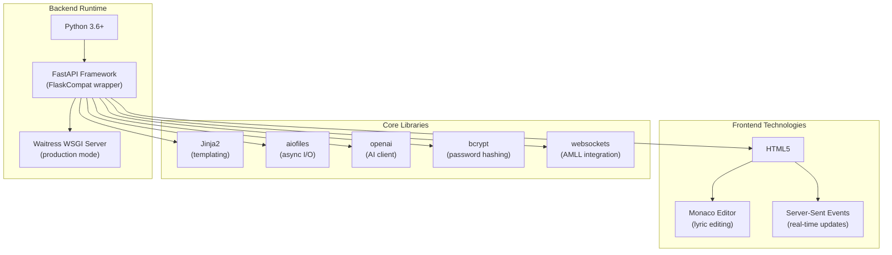
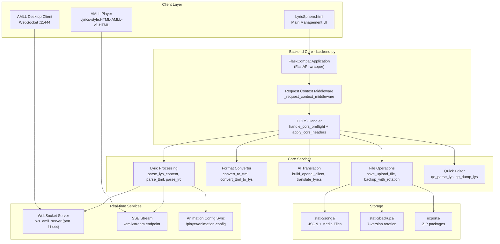
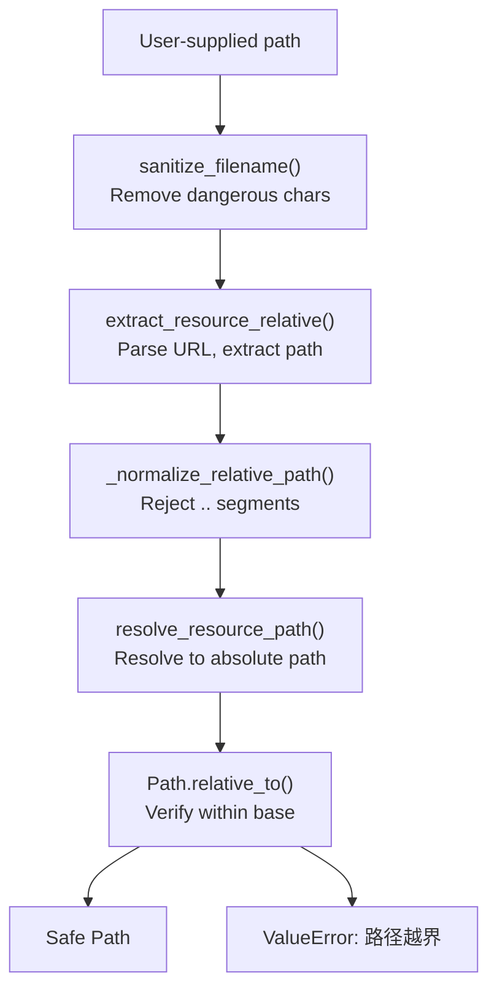
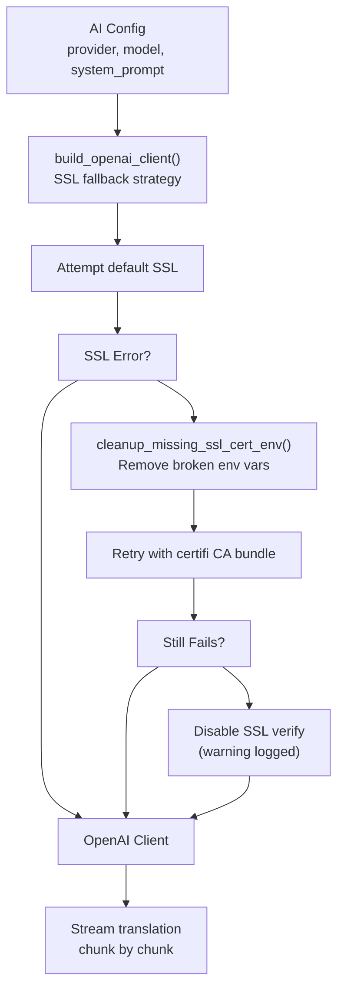

# LyricSphere Overview

> **Relevant source files**
> * [CLAUDE.md](https://github.com/HKLHaoBin/LyricSphere/blob/7864cfe0/CLAUDE.md)
> * [LICENSE](https://github.com/HKLHaoBin/LyricSphere/blob/7864cfe0/LICENSE)
> * [README.md](https://github.com/HKLHaoBin/LyricSphere/blob/7864cfe0/README.md)
> * [backend.py](https://github.com/HKLHaoBin/LyricSphere/blob/7864cfe0/backend.py)

## Purpose and Scope

LyricSphere is a web-based lyric management and display system designed for managing dynamic, time-synchronized lyrics across multiple formats. This page provides a high-level overview of the system's architecture, core capabilities, and primary components. For detailed information on specific subsystems, see [System Architecture](/HKLHaoBin/LyricSphere/1.2-system-architecture), [Backend System](/HKLHaoBin/LyricSphere/2-backend-system), and [Frontend Systems](/HKLHaoBin/LyricSphere/3-frontend-systems).

**Sources:** [README.md L1-L14](https://github.com/HKLHaoBin/LyricSphere/blob/7864cfe0/README.md#L1-L14)

 [backend.py L1-L50](https://github.com/HKLHaoBin/LyricSphere/blob/7864cfe0/backend.py#L1-L50)

## Key Features

LyricSphere provides a comprehensive lyric management pipeline covering creation, editing, translation, conversion, and real-time display:

| Feature Category | Capabilities |
| --- | --- |
| **Format Support** | LRC (line-level timing), LYS (syllable-level timing), TTML (XML-based), LQE (merged lyrics+translation) |
| **Real-time Display** | WebSocket server (`:11444`), Server-Sent Events (`/amll/stream`), synchronized animations with configurable disappear times |
| **AI Translation** | Multi-provider support (DeepSeek, OpenAI, OpenRouter, Together, Groq), streaming responses, automatic timestamp alignment |
| **Format Conversion** | Bidirectional TTML↔LYS/LRC conversion, LQE merging, CSV export |
| **Font Rendering** | Per-syllable font selection via `[font-family:...]` metadata, multi-source loading (local, Google Fonts, CDN), script detection (CJK/Latin) |
| **Security** | Device authentication with trusted device lists, bcrypt password hashing, path traversal prevention, CORS handling |
| **File Management** | Automatic backup with 7-version rotation, long filename hashing, resource integrity checking for exports |
| **Batch Operations** | ZIP import/export with resource collection, path rewriting for relocated assets |

**Sources:** [README.md L15-L44](https://github.com/HKLHaoBin/LyricSphere/blob/7864cfe0/README.md#L15-L44)

 [backend.py L854-L863](https://github.com/HKLHaoBin/LyricSphere/blob/7864cfe0/backend.py#L854-L863)

## Technology Stack



**Sources:** [backend.py L28-L49](https://github.com/HKLHaoBin/LyricSphere/blob/7864cfe0/backend.py#L28-L49)

 [README.md L61-L68](https://github.com/HKLHaoBin/LyricSphere/blob/7864cfe0/README.md#L61-L68)

## System Architecture

### High-Level Component Overview

The system follows a three-tier architecture with distinct client, backend, and storage layers:



**Sources:** [backend.py L760-L831](https://github.com/HKLHaoBin/LyricSphere/blob/7864cfe0/backend.py#L760-L831)

 [backend.py L854-L878](https://github.com/HKLHaoBin/LyricSphere/blob/7864cfe0/backend.py#L854-L878)

 [backend.py L1235-L1292](https://github.com/HKLHaoBin/LyricSphere/blob/7864cfe0/backend.py#L1235-L1292)

### Backend Module Structure

The `backend.py` file (4500+ lines) implements a monolithic architecture with Flask-compatible APIs on FastAPI:

```mermaid
flowchart TD

BuildOpenAIClient["build_openai_client()<br>SSL fallback strategy"]
CleanupSSLEnv["cleanup_missing_ssl_cert_env()<br>Env variable fix"]
TranslateLyrics["translate_lyrics()<br>Streaming translation"]
ParseLYS["parse_lys_content()<br>Syllable parser"]
ComputeDisappear["compute_disappear_times()<br>Animation timing"]
ParseTTML["parse_ttml()<br>XML minidom"]
ParseLRC["parse_lrc()<br>Line-level parser"]
ExtractFontFiles["extract_font_files_from_lys()<br>Font metadata"]
SanitizeFilename["sanitize_filename()<br>SAFE_FILENAME_PATTERN"]
ResolveResourcePath["resolve_resource_path()<br>Path validation"]
ExtractResourceRelative["extract_resource_relative()<br>URL normalization"]
BackupWithRotation["backup_with_rotation()<br>7-version limit"]
FileStorageAdapter["FileStorageAdapter<br>Wraps UploadFile"]
SaveUploadFile["save_upload_file()<br>Async file writing"]
FilesWrapper["FilesWrapper<br>Dict-like file access"]
SaveUploadFileMeta["save_upload_file_with_meta()<br>+ MD5 calculation"]
FlaskCompat["FlaskCompat class<br>FastAPI subclass with Flask-style routing"]
RequestContext["RequestContext class<br>Wraps StarletteRequest"]
RequestProxy["RequestProxy<br>Global 'request' object"]
SessionProxy["SessionProxy<br>Global 'session' object"]

subgraph subGraph4 ["AI Integration"]
    BuildOpenAIClient
    CleanupSSLEnv
    TranslateLyrics
    BuildOpenAIClient --> CleanupSSLEnv
    TranslateLyrics --> BuildOpenAIClient
end

subgraph subGraph3 ["Lyric Processing"]
    ParseLYS
    ComputeDisappear
    ParseTTML
    ParseLRC
    ExtractFontFiles
    ParseLYS --> ComputeDisappear
    ParseTTML --> ComputeDisappear
    ParseLRC --> ComputeDisappear
    ParseLYS --> ExtractFontFiles
end

subgraph subGraph2 ["Security Layer"]
    SanitizeFilename
    ResolveResourcePath
    ExtractResourceRelative
    BackupWithRotation
    SanitizeFilename --> ResolveResourcePath
    ResolveResourcePath --> ExtractResourceRelative
    BackupWithRotation --> SanitizeFilename
end

subgraph subGraph1 ["File Adaptation Layer"]
    FileStorageAdapter
    SaveUploadFile
    FilesWrapper
    SaveUploadFileMeta
    FileStorageAdapter --> SaveUploadFile
    FilesWrapper --> FileStorageAdapter
    SaveUploadFile --> SaveUploadFileMeta
end

subgraph subGraph0 ["Request Handling Layer"]
    FlaskCompat
    RequestContext
    RequestProxy
    SessionProxy
    FlaskCompat --> RequestContext
    RequestProxy --> RequestContext
    SessionProxy --> RequestContext
end
```



**Sources:** [backend.py L57-L219](https://github.com/HKLHaoBin/LyricSphere/blob/7864cfe0/backend.py#L57-L219)

 [backend.py L278-L547](https://github.com/HKLHaoBin/LyricSphere/blob/7864cfe0/backend.py#L278-L547)

 [backend.py L760-L831](https://github.com/HKLHaoBin/LyricSphere/blob/7864cfe0/backend.py#L760-L831)

 [backend.py L890-L948](https://github.com/HKLHaoBin/LyricSphere/blob/7864cfe0/backend.py#L890-L948)

 [backend.py L994-L1063](https://github.com/HKLHaoBin/LyricSphere/blob/7864cfe0/backend.py#L994-L1063)

## Core Component Responsibilities

### FlaskCompat Application

The `FlaskCompat` class [backend.py L760-L831](https://github.com/HKLHaoBin/LyricSphere/blob/7864cfe0/backend.py#L760-L831)

 provides a Flask-style API layer on top of FastAPI, enabling gradual migration while maintaining familiar routing patterns. The application instance is created at [backend.py L854-L863](https://github.com/HKLHaoBin/LyricSphere/blob/7864cfe0/backend.py#L854-L863)

 with dynamic path configuration based on runtime mode (packaged exe vs development).

**Key responsibilities:**

* Route registration via `@app.route()` decorator [backend.py L791-L812](https://github.com/HKLHaoBin/LyricSphere/blob/7864cfe0/backend.py#L791-L812)
* Request/response lifecycle management via `_request_context_middleware` [backend.py L1235-L1262](https://github.com/HKLHaoBin/LyricSphere/blob/7864cfe0/backend.py#L1235-L1262)
* CORS preflight handling via `handle_cors_preflight()` [backend.py L1265-L1270](https://github.com/HKLHaoBin/LyricSphere/blob/7864cfe0/backend.py#L1265-L1270)
* Jinja2 template rendering with custom filters [backend.py L786-L789](https://github.com/HKLHaoBin/LyricSphere/blob/7864cfe0/backend.py#L786-L789)

**Sources:** [backend.py L760-L831](https://github.com/HKLHaoBin/LyricSphere/blob/7864cfe0/backend.py#L760-L831)

 [backend.py L854-L878](https://github.com/HKLHaoBin/LyricSphere/blob/7864cfe0/backend.py#L854-L878)

### File Management System

File operations use an adapter pattern to unify FastAPI's `UploadFile` with Flask-style file handling:

| Component | Purpose | Key Methods |
| --- | --- | --- |
| `FileStorageAdapter` | Wraps `UploadFile` for compatibility | `save()`, `read()`, `seek()` |
| `FilesWrapper` | Dictionary-like access to uploaded files | `__getitem__()`, `getlist()` |
| `save_upload_file()` | Async file writing with chunking | Uses `aiofiles` for non-blocking I/O |
| `backup_with_rotation()` | Maintains 7-version history | Prunes old backups, hashes long filenames |

The backup system uses timestamp-based naming [backend.py L1293-L1330](https://github.com/HKLHaoBin/LyricSphere/blob/7864cfe0/backend.py#L1293-L1330)

 with `build_backup_path()` automatically truncating filenames exceeding 255 characters via SHA-1 hashing [backend.py L1299-L1315](https://github.com/HKLHaoBin/LyricSphere/blob/7864cfe0/backend.py#L1299-L1315)

**Sources:** [backend.py L57-L220](https://github.com/HKLHaoBin/LyricSphere/blob/7864cfe0/backend.py#L57-L220)

 [backend.py L1293-L1367](https://github.com/HKLHaoBin/LyricSphere/blob/7864cfe0/backend.py#L1293-L1367)

### Path Security System

Three-layer validation prevents path traversal attacks:

1. **Filename Sanitization** [backend.py L997-L1004](https://github.com/HKLHaoBin/LyricSphere/blob/7864cfe0/backend.py#L997-L1004) : `SAFE_FILENAME_PATTERN` removes dangerous characters while preserving Unicode
2. **Relative Path Normalization** [backend.py L1006-L1015](https://github.com/HKLHaoBin/LyricSphere/blob/7864cfe0/backend.py#L1006-L1015) : `_normalize_relative_path()` rejects `..` segments
3. **Boundary Checking** [backend.py L1037-L1047](https://github.com/HKLHaoBin/LyricSphere/blob/7864cfe0/backend.py#L1037-L1047) : `resolve_resource_path()` ensures resolved paths stay within `RESOURCE_DIRECTORIES`



**Sources:** [backend.py L994-L1063](https://github.com/HKLHaoBin/LyricSphere/blob/7864cfe0/backend.py#L994-L1063)

 [backend.py L1018-L1047](https://github.com/HKLHaoBin/LyricSphere/blob/7864cfe0/backend.py#L1018-L1047)

### Lyric Format Processing

The system supports four primary formats with bidirectional conversion:

| Format | Parser Function | Key Characteristics |
| --- | --- | --- |
| **LYS** | `parse_lys_content()` | Syllable-level timing: `text(start,dur)` |
| **LRC** | `parse_lrc()` | Line-level timing: `[MM:SS.mmm]text` |
| **TTML** | `parse_ttml()` | XML with `<p>` elements, supports `ttm:agent="v2"` (duet) and `ttm:role="x-bg"` (background vocals) |
| **LQE** | `parse_lqe()` | Merged format combining lyrics + translation tracks |

Conversion functions include:

* `convert_to_ttml()`: LYS/LRC → TTML with Apple-style formatting
* `convert_ttml_to_lys()`: TTML → LYS preserving syllable timing
* `merge_to_lqe()`: Combines lyrics + translation into single LQE document

**Sources:** [backend.py L1551-L1900](https://github.com/HKLHaoBin/LyricSphere/blob/7864cfe0/backend.py#L1551-L1900)

 (parsers), [backend.py L2100-L2400](https://github.com/HKLHaoBin/LyricSphere/blob/7864cfe0/backend.py#L2100-L2400)

 (converters)

### AI Translation Pipeline

Translation uses multi-provider OpenAI-compatible APIs with SSL resilience:



The `translate_lyrics()` endpoint [backend.py L3200-L3500](https://github.com/HKLHaoBin/LyricSphere/blob/7864cfe0/backend.py#L3200-L3500)

 supports:

* Multiple providers via `base_url` parameter
* Optional thinking model for pre-analysis
* Compatibility mode merging system prompt into user message
* Streaming responses with progress updates
* Automatic timestamp synchronization
* Issue detection for untranslated/malformed lines

**Sources:** [backend.py L890-L948](https://github.com/HKLHaoBin/LyricSphere/blob/7864cfe0/backend.py#L890-L948)

 [backend.py L3200-L3500](https://github.com/HKLHaoBin/LyricSphere/blob/7864cfe0/backend.py#L3200-L3500)

## Real-time Communication

### WebSocket Server

The `ws_amll_server()` function [backend.py L4200-L4300](https://github.com/HKLHaoBin/LyricSphere/blob/7864cfe0/backend.py#L4200-L4300)

 runs on port `11444` for AMLL desktop client integration:

* Maintains client connection registry
* Broadcasts lyric updates to all connected clients
* Handles client disconnection cleanup
* Formats lyrics as AMLL rules (proprietary format)

### Server-Sent Events

The `/amll/stream` endpoint provides one-directional updates for web clients:

* Streams lyric line updates with timing information
* Calculates disappear times using `compute_disappear_times()` [backend.py L1900-L2000](https://github.com/HKLHaoBin/LyricSphere/blob/7864cfe0/backend.py#L1900-L2000)
* Synchronizes with animation configuration from `/player/animation-config` [backend.py L3800-L3900](https://github.com/HKLHaoBin/LyricSphere/blob/7864cfe0/backend.py#L3800-L3900)

**Sources:** [backend.py L4200-L4300](https://github.com/HKLHaoBin/LyricSphere/blob/7864cfe0/backend.py#L4200-L4300)

 (WebSocket), [backend.py L3600-L3700](https://github.com/HKLHaoBin/LyricSphere/blob/7864cfe0/backend.py#L3600-L3700)

 (SSE)

## Getting Started

To run LyricSphere locally:

```markdown
# Install dependencies
pip install flask openai bcrypt waitress websockets aiofiles

# Run development server
python backend.py

# Run on specific port
python backend.py 5000

# Production mode (uses Waitress)
USE_WAITRESS=1 python backend.py
```

The application creates required directories automatically:

* `static/songs/` - Song metadata (JSON) and media files
* `static/backups/` - Version history (7 backups per file)
* `logs/` - Application logs with rotation
* `exports/` - Generated ZIP packages

For detailed setup instructions, see [Getting Started](/HKLHaoBin/LyricSphere/1.1-getting-started). For API endpoint reference, see [API Endpoints Reference](/HKLHaoBin/LyricSphere/2.1-api-endpoints-reference). For security configuration, see [Security and Authentication](/HKLHaoBin/LyricSphere/2.6-security-and-authentication).

**Sources:** [README.md L69-L108](https://github.com/HKLHaoBin/LyricSphere/blob/7864cfe0/README.md#L69-L108)

 [backend.py L838-L957](https://github.com/HKLHaoBin/LyricSphere/blob/7864cfe0/backend.py#L838-L957)

---

## Summary

LyricSphere is a production-ready lyric management system built on FastAPI with Flask-compatible APIs. The monolithic `backend.py` (4500+ lines) implements all functionality including format parsing, conversion, AI translation, real-time streaming, and secure file operations. The system emphasizes security through multi-layer path validation, supports real-time lyric display via WebSocket/SSE, and provides robust file versioning with automatic cleanup.

For detailed documentation on specific subsystems:

* **Backend internals**: [Backend System](/HKLHaoBin/LyricSphere/2-backend-system)
* **API reference**: [API Endpoints Reference](/HKLHaoBin/LyricSphere/2.1-api-endpoints-reference)
* **Format specifications**: [Format Conversion Pipeline](/HKLHaoBin/LyricSphere/2.3-format-conversion-pipeline)
* **AI features**: [AI Translation System](/HKLHaoBin/LyricSphere/2.4-ai-translation-system)
* **Frontend interfaces**: [Frontend Systems](/HKLHaoBin/LyricSphere/3-frontend-systems)

**Sources:** [backend.py L1-L4500](https://github.com/HKLHaoBin/LyricSphere/blob/7864cfe0/backend.py#L1-L4500)

 [README.md L1-L172](https://github.com/HKLHaoBin/LyricSphere/blob/7864cfe0/README.md#L1-L172)