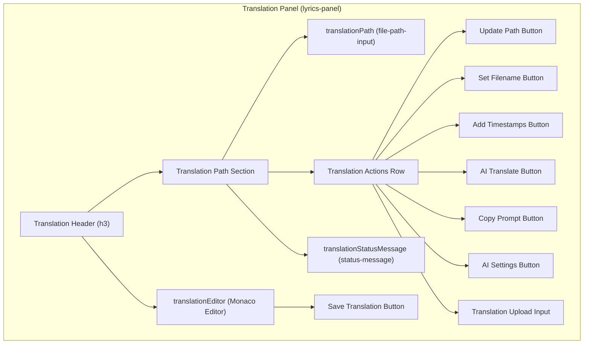
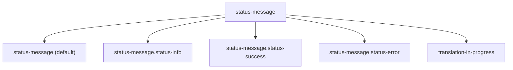
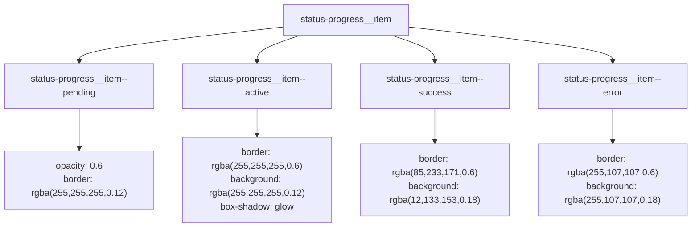
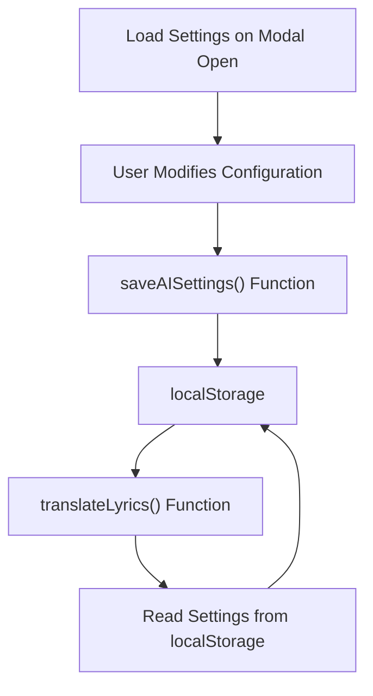

# Lyrics Translation Interface

> **Relevant source files**
> * [CHANGELOG.md](https://github.com/HKLHaoBin/LyricSphere/blob/7864cfe0/CHANGELOG.md)
> * [LICENSE](https://github.com/HKLHaoBin/LyricSphere/blob/7864cfe0/LICENSE)
> * [README.md](https://github.com/HKLHaoBin/LyricSphere/blob/7864cfe0/README.md)
> * [templates/LyricSphere.html](https://github.com/HKLHaoBin/LyricSphere/blob/7864cfe0/templates/LyricSphere.html)

## Purpose and Scope

The Lyrics Translation Interface provides a comprehensive UI for AI-powered lyric translation with real-time progress tracking, multi-provider configuration, and intelligent issue detection. This page documents the frontend components, configuration options, translation workflow, and status visualization systems that enable users to translate lyrics using various AI providers while monitoring translation quality.

For the underlying AI translation system architecture and backend processing, see [AI Translation System](/HKLHaoBin/LyricSphere/2.4-ai-translation-system). For the translation workflow and pipeline details, see [Translation Workflow](/HKLHaoBin/LyricSphere/2.4.1-translation-workflow). For AI provider backend configuration, see [AI Provider Configuration](/HKLHaoBin/LyricSphere/2.4.2-ai-provider-configuration).

---

## Translation Configuration Modal

The AI Settings Modal provides a centralized interface for configuring all translation parameters. It is implemented in [templates/LyricSphere.html L1997-L2092](https://github.com/HKLHaoBin/LyricSphere/blob/7864cfe0/templates/LyricSphere.html#L1997-L2092)

 and opened via the `showAISettings()` function.

### Configuration Components

The modal contains the following configuration sections:

| Configuration Option | HTML Element ID | Purpose |
| --- | --- | --- |
| API Provider | `aiProvider` | Select from DeepSeek, OpenAI, OpenRouter, Together, Groq, or Custom |
| Base URL | `aiBaseUrl` | API endpoint URL for the selected provider |
| Model Name | `aiModel` | Specific model identifier (e.g., `deepseek-reasoner`) |
| API Key | `aiApiKey` | Authentication key for API access |
| System Prompt | `aiSystemPrompt` | Instructions for translation style and behavior |
| Reasoning Chain | `aiExpectReasoning` | Checkbox to enable reasoning content extraction |
| Compatibility Mode | `aiCompatMode` | Merge system prompt into user message for single-role models |
| Bracket Preprocessing | `aiStripBrackets` | Remove bracketed content before translation |
| Thinking Mode | `aiThinkingEnabled` | Enable two-stage translation with analysis model |

### Provider Selection

The provider dropdown (`aiProvider`) supports six options with predefined base URLs:

```sql
// Provider selection triggers URL population
// <FileRef file-url="https://github.com/HKLHaoBin/LyricSphere/blob/7864cfe0/templates/LyricSphere.html#L2003-L2010" min=2003 max=2010 file-path="templates/LyricSphere.html">Hii</FileRef>
<select id="aiProvider" class="file-path-input">
    <option value="deepseek">DeepSeek</option>
    <option value="openai">OpenAI</option>
    <option value="openrouter">OpenRouter</option>
    <option value="together">Together</option>
    <option value="groq">Groq</option>
    <option value="custom">自定义</option>
</select>
```

When a provider is selected, the `aiBaseUrl` field is automatically populated with the corresponding API endpoint. Custom providers require manual URL entry.

**Sources:** [templates/LyricSphere.html L1997-L2092](https://github.com/HKLHaoBin/LyricSphere/blob/7864cfe0/templates/LyricSphere.html#L1997-L2092)

---

## Thinking Model Configuration

The thinking model subsystem enables a two-stage translation process where an analysis model first generates contextual understanding before the main translation model processes the lyrics.

### Thinking Model Parameters

The thinking model section [templates/LyricSphere.html L2052-L2083](https://github.com/HKLHaoBin/LyricSphere/blob/7864cfe0/templates/LyricSphere.html#L2052-L2083)

 provides independent configuration:

| Parameter | HTML Element ID | Fallback Behavior |
| --- | --- | --- |
| Thinking Provider | `aiThinkingProvider` | Uses translation provider if empty |
| Thinking Base URL | `aiThinkingBaseUrl` | Uses translation base URL if empty |
| Thinking Model | `aiThinkingModel` | Uses translation model if empty |
| Thinking API Key | `aiThinkingApiKey` | Uses translation API key if empty |
| Thinking Prompt | `aiThinkingPrompt` | Custom analysis instructions |

### Thinking Mode Toggle

The `aiThinkingEnabled` checkbox [templates/LyricSphere.html L2037-L2039](https://github.com/HKLHaoBin/LyricSphere/blob/7864cfe0/templates/LyricSphere.html#L2037-L2039)

 controls whether thinking mode is active. When enabled, the translation workflow executes in two phases:

1. **Analysis Phase:** Thinking model generates song understanding
2. **Translation Phase:** Translation model uses analysis as context

This configuration is stored in `localStorage` and persists across sessions via the `saveAISettings()` function.

**Sources:** [templates/LyricSphere.html L2052-L2083](https://github.com/HKLHaoBin/LyricSphere/blob/7864cfe0/templates/LyricSphere.html#L2052-L2083)

---

## Translation Interface Components

The translation interface is embedded within the main lyrics editing modal, providing side-by-side lyrics and translation editors with integrated AI controls.

### Translation Editor Layout



### Key UI Elements

**Translation Path Input** (`translationPath` [templates/LyricSphere.html L1647](https://github.com/HKLHaoBin/LyricSphere/blob/7864cfe0/templates/LyricSphere.html#L1647-L1647)

):

* Displays current translation file path
* Supports manual path editing and updates via `updateLyricsPath(1)`

**AI Translate Button** [templates/LyricSphere.html L1660-L1662](https://github.com/HKLHaoBin/LyricSphere/blob/7864cfe0/templates/LyricSphere.html#L1660-L1662)

:

* Triggers `translateLyrics()` function
* Initiates translation workflow with current configuration

**Copy Prompt Button** [templates/LyricSphere.html L1663-L1665](https://github.com/HKLHaoBin/LyricSphere/blob/7864cfe0/templates/LyricSphere.html#L1663-L1665)

:

* Executes `copyTranslationPrompt()` function
* Copies the complete prompt to clipboard for debugging/transparency

**AI Settings Button** [templates/LyricSphere.html L1666-L1668](https://github.com/HKLHaoBin/LyricSphere/blob/7864cfe0/templates/LyricSphere.html#L1666-L1668)

:

* Opens `aiSettingsModal` via `showAISettings()`
* Provides access to full configuration interface

**Translation Status Message** (`translationStatusMessage` [templates/LyricSphere.html L1675-L1678](https://github.com/HKLHaoBin/LyricSphere/blob/7864cfe0/templates/LyricSphere.html#L1675-L1678)

):

* Container for dynamic status display
* Shows progress stages, errors, and completion messages
* Applies CSS classes for different states

**Sources:** [templates/LyricSphere.html L1643-L1685](https://github.com/HKLHaoBin/LyricSphere/blob/7864cfe0/templates/LyricSphere.html#L1643-L1685)

---

## Progress Tracking and Status Display

The translation interface implements a sophisticated multi-stage progress tracking system with visual feedback for each phase of the translation process.

### Status Message System

The status display uses multiple CSS classes to indicate different states:



### CSS State Classes

| State Class | Background Variable | Color Variable | Usage |
| --- | --- | --- | --- |
| `status-message` (default) | `--status-bg-default` | `--status-color-default` | Initial/neutral messages |
| `status-info` | `--status-bg-info` | `--status-color-info` | Information messages |
| `status-success` | `--status-bg-success` | `--status-color-success` | Successful completion |
| `status-error` | `--status-bg-error` | `--status-color-error` | Error conditions |
| `translation-in-progress` | `--status-progress-bg` | `--status-progress-color` | Active translation |

### Multi-Stage Progress Indicators

When translation is active, the `translation-in-progress` class [templates/LyricSphere.html L1033-L1051](https://github.com/HKLHaoBin/LyricSphere/blob/7864cfe0/templates/LyricSphere.html#L1033-L1051)

 is applied, displaying:

**Animated Progress Badge** (`btn-shine` [templates/LyricSphere.html L1054-L1075](https://github.com/HKLHaoBin/LyricSphere/blob/7864cfe0/templates/LyricSphere.html#L1054-L1075)

):

* Animated gradient text showing current stage
* CSS animation with shimmer effect
* Positioned centrally with custom styling

**Progress Stage List** (`status-progress` [templates/LyricSphere.html L1133-L1152](https://github.com/HKLHaoBin/LyricSphere/blob/7864cfe0/templates/LyricSphere.html#L1133-L1152)

):

* Displays multiple concurrent stages
* Responsive grid layout (column on mobile, row on desktop)
* Each stage shows label and description

### Stage Item States

Each progress stage item can have one of four states:



### Typical Translation Stages

1. **Preparation Stage:** Initial request setup
2. **Analysis Stage:** Thinking model processing (if enabled)
3. **Translation Stage:** Main translation model processing
4. **Validation Stage:** Timestamp alignment and issue detection
5. **Completion Stage:** Final result processing

**Sources:** [templates/LyricSphere.html L969-L1193](https://github.com/HKLHaoBin/LyricSphere/blob/7864cfe0/templates/LyricSphere.html#L969-L1193)

 [templates/LyricSphere.html L1033-L1051](https://github.com/HKLHaoBin/LyricSphere/blob/7864cfe0/templates/LyricSphere.html#L1033-L1051)

---

## Issue Detection and Highlighting

The translation interface includes automatic detection and visual highlighting of problematic translations.

### Problem Line Detection

The system detects the following issues during translation:

| Issue Type | Detection Method | Indicator |
| --- | --- | --- |
| Missing Timestamp | Line without timestamp format | "时间戳异常" message |
| Untranslated Line | Original text remains unchanged | Highlighted in editor |
| Line Count Mismatch | Translation lines ≠ original lines | Warning message |
| Invalid Characters | Unexpected character patterns | Problem line list |

### Editor Highlighting

When issues are detected, the `lyrics-editor` element receives the `error-highlight` class [templates/LyricSphere.html L962-L965](https://github.com/HKLHaoBin/LyricSphere/blob/7864cfe0/templates/LyricSphere.html#L962-L965)

:

```css
.lyrics-editor.error-highlight {
    border-color: #ff6b6b;
    box-shadow: 0 0 0 2px rgba(255, 107, 107, 0.2);
}
```

This provides visual feedback directly on the editor containing problematic content.

### Status Message Detail

Error messages include structured information [templates/LyricSphere.html L1117-L1131](https://github.com/HKLHaoBin/LyricSphere/blob/7864cfe0/templates/LyricSphere.html#L1117-L1131)

:

```html
<div class="status-message__summary">
    <!-- Summary of issue count -->
</div>
<ul class="status-message__list">
    <!-- List of specific problem lines -->
    <li>Line N: [description of issue]</li>
</ul>
```

The monospace font (`font-family: 'Fira Code', monospace`) ensures proper alignment of line numbers and content.

**Sources:** [templates/LyricSphere.html L962-L965](https://github.com/HKLHaoBin/LyricSphere/blob/7864cfe0/templates/LyricSphere.html#L962-L965)

 [templates/LyricSphere.html L1117-L1131](https://github.com/HKLHaoBin/LyricSphere/blob/7864cfe0/templates/LyricSphere.html#L1117-L1131)

---

## Translation Workflow

The complete translation workflow integrates frontend UI components with backend processing through a series of user interactions and API calls.

### Workflow Diagram

```mermaid
sequenceDiagram
  participant User
  participant AI Translate Button
  participant AI Settings Modal
  participant translateLyrics()
  participant /translate_lyrics
  participant Status Message
  participant Translation Editor
  participant localStorage

  User->>AI Settings Modal: Open AI Settings
  AI Settings Modal->>User: Display configuration
  User->>AI Settings Modal: Configure provider, model, prompts
  User->>AI Settings Modal: Enable/disable thinking mode
  User->>AI Settings Modal: Save settings
  AI Settings Modal->>localStorage: Store configuration
  User->>AI Translate Button: Click "AI翻译"
  AI Translate Button->>translateLyrics(): Invoke function
  translateLyrics()->>localStorage: Read AI settings
  translateLyrics()->>Translation Editor: Get lyrics content
  translateLyrics()->>Status Message: Show "translation-in-progress"
  Status Message->>User: Display progress stages
  translateLyrics()->>/translate_lyrics: POST with lyrics and config
  /translate_lyrics->>/translate_lyrics: Optional thinking stage
  /translate_lyrics->>/translate_lyrics: Main translation stage
  /translate_lyrics->>/translate_lyrics: Timestamp alignment
  /translate_lyrics->>/translate_lyrics: Issue detection
  /translate_lyrics->>translateLyrics(): Stream translation result
  translateLyrics()->>Status Message: Update progress stages
  translateLyrics()->>Translation Editor: Populate translation
  translateLyrics()->>Status Message: Show success/warning
  loop [Issues detected]
    translateLyrics()->>Translation Editor: Apply error-highlight class
    translateLyrics()->>Status Message: Display problem lines
  end
  User->>Translation Editor: Review/edit translation
  User->>Translation Editor: Save translation
```

### Step-by-Step Process

**1. Configuration Phase**

* User opens AI Settings Modal via `showAISettings()`
* Configures provider, model, API key, and prompts
* Enables optional thinking mode and compatibility settings
* Saves configuration via `saveAISettings()` to `localStorage`

**2. Initiation Phase**

* User clicks "🤖 AI翻译" button
* `translateLyrics()` function is invoked [referenced L1660-L1662](https://github.com/HKLHaoBin/LyricSphere/blob/7864cfe0/referenced in templates/LyricSphere.html#L1660-L1662)
* Current lyrics content is extracted from the lyrics editor (Monaco instance)
* Translation path is determined or generated

**3. Request Phase**

* AI settings are read from `localStorage`
* Request payload is constructed with: * Original lyrics text * AI provider and model configuration * System prompt and user prompt * Compatibility mode flag * Bracket stripping flag * Thinking model configuration (if enabled)
* POST request is sent to `/translate_lyrics` endpoint

**4. Progress Display Phase**

* Status message element gains `translation-in-progress` class
* Animated "btn-shine" element displays current stage
* Progress stages are rendered with initial "pending" state
* Stages update to "active", "success", or "error" as processing occurs

**5. Processing Phase (Backend)**

* See [Translation Workflow](/HKLHaoBin/LyricSphere/2.4.1-translation-workflow) for detailed backend processing
* If thinking mode enabled: First call to thinking model generates analysis
* Main translation model receives lyrics (and optional thinking result)
* Backend streams response chunks to frontend
* Timestamps are synchronized with original lyrics
* Line count and format validation occurs

**6. Result Display Phase**

* Translation text is populated into translation editor (Monaco instance)
* Status message updates to show completion state
* If issues detected: * Editor receives `error-highlight` class * Problem lines are listed in status message * Specific line numbers and error types shown
* If successful: * Status shows success message * Editor contains translated lyrics with timestamps

**7. User Review Phase**

* User reviews translation in editor
* Can manually edit problematic lines
* Can re-run translation with different settings
* Saves final translation via "💾 保存翻译" button

### Copy Prompt Feature

The `copyTranslationPrompt()` function [referenced L1663-L1665](https://github.com/HKLHaoBin/LyricSphere/blob/7864cfe0/referenced in templates/LyricSphere.html#L1663-L1665)

 allows users to:

* Copy the complete prompt sent to the AI
* Include system prompt and user prompt
* Include thinking prompt if enabled
* Use for debugging or external translation tools

**Sources:** [templates/LyricSphere.html L1643-L1685](https://github.com/HKLHaoBin/LyricSphere/blob/7864cfe0/templates/LyricSphere.html#L1643-L1685)

 [templates/LyricSphere.html L1997-L2092](https://github.com/HKLHaoBin/LyricSphere/blob/7864cfe0/templates/LyricSphere.html#L1997-L2092)

---

## API Connectivity Testing

The translation interface provides built-in connectivity testing for both translation and thinking models before actual translation attempts.

### Probe Functions

Two test buttons in the AI Settings Modal [templates/LyricSphere.html L2085-L2086](https://github.com/HKLHaoBin/LyricSphere/blob/7864cfe0/templates/LyricSphere.html#L2085-L2086)

:

```xml
<button onclick="probeAIConnection('translation', this)">测试翻译模型</button>
<button onclick="probeAIConnection('thinking', this)">测试思考模型</button>
```

### Probe Workflow

The `probeAIConnection(modelType, buttonElement)` function:

1. Reads configuration for specified model type
2. Sends test request to backend `/probe_ai_model` endpoint
3. Backend attempts connection to AI provider
4. Returns success/failure status
5. Button visual feedback indicates result
6. Status message shows connection details or errors

### Error Handling

The probe system gracefully handles:

* **404 Responses:** Some providers don't support `/v1/models` endpoint
* **SSL Certificate Issues:** Falls back to certificate validation strategies
* **Timeout Errors:** Network connectivity problems
* **Authentication Failures:** Invalid API keys

This allows users to verify configuration before starting lengthy translations.

**Sources:** [templates/LyricSphere.html L2085-L2086](https://github.com/HKLHaoBin/LyricSphere/blob/7864cfe0/templates/LyricSphere.html#L2085-L2086)

---

## Data Persistence

All translation configuration is persisted in browser `localStorage` to maintain settings across sessions.

### Storage Keys

| Storage Key | Content |
| --- | --- |
| AI provider settings | Provider, base URL, model, API key |
| Translation prompts | System prompt for translation |
| Thinking settings | Thinking model configuration and prompts |
| Mode flags | Compatibility mode, bracket stripping, thinking enabled |

### Settings Lifecycle



When the AI Settings Modal opens, `showAISettings()` populates form fields from `localStorage`. When user saves, `saveAISettings()` writes updated values back to `localStorage`. During translation, `translateLyrics()` reads current settings to construct the API request.

**Sources:** [templates/LyricSphere.html L1997-L2092](https://github.com/HKLHaoBin/LyricSphere/blob/7864cfe0/templates/LyricSphere.html#L1997-L2092)

---

## Security and Authentication

Translation operations require device authentication when security mode is enabled.

### Authentication Requirements

* Translation initiation checks device unlock status
* Calls to `/translate_lyrics` endpoint validate device authentication
* Password verification required if device not in trusted list
* See [Device Authentication](/HKLHaoBin/LyricSphere/2.6.1-device-authentication) for full authentication details

### Authorization Flow

Before `translateLyrics()` sends request:

1. Check if security mode enabled via backend state
2. If enabled, verify device is unlocked
3. If not unlocked, show unlock modal
4. User enters password
5. Device added to trusted list on success
6. Translation request proceeds with authenticated session

**Sources:** Backend authentication system documented in [Device Authentication](/HKLHaoBin/LyricSphere/2.6.1-device-authentication)

---

## Related Systems

The Lyrics Translation Interface integrates with multiple system components:

* **[AI Translation System](/HKLHaoBin/LyricSphere/2.4-ai-translation-system):** Backend translation pipeline and provider integration
* **[Translation Workflow](/HKLHaoBin/LyricSphere/2.4.1-translation-workflow):** Detailed step-by-step backend processing
* **[AI Provider Configuration](/HKLHaoBin/LyricSphere/2.4.2-ai-provider-configuration):** Provider-specific settings and SSL handling
* **[Thinking Model Integration](/HKLHaoBin/LyricSphere/2.4.3-thinking-model-integration):** Two-stage translation architecture
* **[Main Dashboard](/HKLHaoBin/LyricSphere/3.1-main-dashboard-(lyricsphere.html)):** Access to translation interface from song list
* **[Device Authentication](/HKLHaoBin/LyricSphere/2.6.1-device-authentication):** Security requirements for translation operations

---

**Sources:** [templates/LyricSphere.html L969-L2092](https://github.com/HKLHaoBin/LyricSphere/blob/7864cfe0/templates/LyricSphere.html#L969-L2092)

 [README.md L39-L155](https://github.com/HKLHaoBin/LyricSphere/blob/7864cfe0/README.md#L39-L155)

 [CHANGELOG.md L1-L170](https://github.com/HKLHaoBin/LyricSphere/blob/7864cfe0/CHANGELOG.md#L1-L170)