# Main Dashboard (LyricSphere.html)

> **Relevant source files**
> * [LICENSE](https://github.com/HKLHaoBin/LyricSphere/blob/7864cfe0/LICENSE)
> * [README.md](https://github.com/HKLHaoBin/LyricSphere/blob/7864cfe0/README.md)
> * [templates/LyricSphere.html](https://github.com/HKLHaoBin/LyricSphere/blob/7864cfe0/templates/LyricSphere.html)

## Purpose and Scope

The Main Dashboard is the primary web interface for LyricSphere, providing comprehensive song library management through a single-page application. This interface handles all user interactions for creating, editing, searching, and organizing lyric files. It communicates with the backend via REST API endpoints and provides real-time feedback for operations like AI translation and AMLL integration.

For backend API endpoints used by this interface, see [API Endpoints Reference](/HKLHaoBin/LyricSphere/2.1-api-endpoints-reference). For AI translation features, see [AI Translation System](/HKLHaoBin/LyricSphere/2.4-ai-translation-system). For AMLL player integration, see [AMLL Player](/HKLHaoBin/LyricSphere/3.6.1-amll-player-(lyrics-style.html-amll-v1.html)).

---

## Page Architecture Overview

The dashboard implements a fixed-header layout with a scrollable content area, supporting both desktop and mobile viewports through responsive CSS media queries.

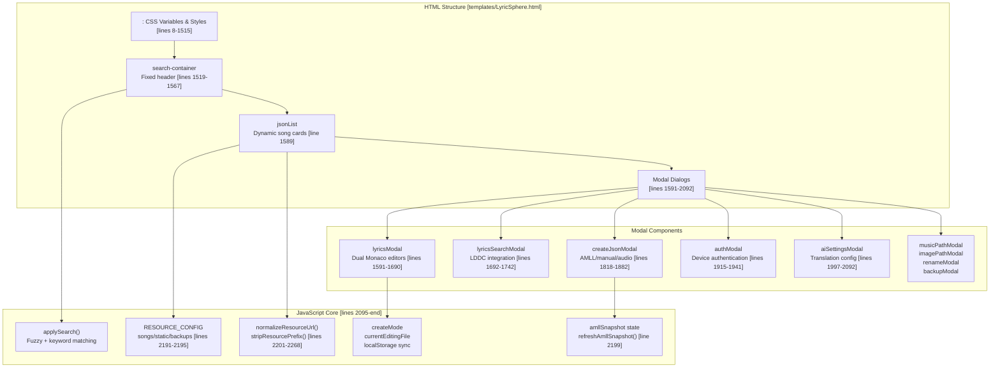

**Sources:** [templates/LyricSphere.html L1-L2700](https://github.com/HKLHaoBin/LyricSphere/blob/7864cfe0/templates/LyricSphere.html#L1-L2700)

---

## Search Container and Toolbar

The search container is a fixed-position header that remains visible during scroll, providing instant access to search, sorting, and system operations.

### Search Box and Filtering

The search system implements two modes: fuzzy matching and keyword-based filtering, controlled by a checkbox toggle at [templates/LyricSphere.html L1532-L1537](https://github.com/HKLHaoBin/LyricSphere/blob/7864cfe0/templates/LyricSphere.html#L1532-L1537)

| Component | Element ID | Functionality |
| --- | --- | --- |
| Search Input | `songSearchInput` | Main search input with autocomplete disabled [line 1527] |
| Fuzzy Toggle | `fuzzySearchToggle` | Switches between fuzzy/keyword search [line 1534] |
| Name Sort | `nameSortBtn` | Triggers `toggleSort('name')` [line 1540] |
| Time Sort | `timeSortBtn` | Triggers `toggleSort('time')` [line 1541] |

The input field uses `readonly` attribute initially [line 1530], removed by JavaScript after page load to prevent autofill interference.

### Action Buttons Grid

The toolbar is organized into four responsive rows at [templates/LyricSphere.html L1522-L1564](https://github.com/HKLHaoBin/LyricSphere/blob/7864cfe0/templates/LyricSphere.html#L1522-L1564)

:

```mermaid
flowchart TD

SearchBox["songSearchInput<br>fuzzySearchToggle"]
NameSort["nameSortBtn<br>toggleSort('name')"]
TimeSort["timeSortBtn<br>toggleSort('time')"]
Create["showCreateModal()"]
Import["triggerStaticImport()"]
V2Link["LyricSphere v2 link"]
Theme["toggleDarkMode()"]
PortSwitch["switchPortMode()"]
Security["toggleSecurityMode()<br>securityToggleBtn"]
Auth["toggleAuthModal()<br>authToggleBtn"]
AMLL["openAMLL()"]
DeviceDropdown["device-manage-button<br>Dropdown menu"]

SearchBox --> NameSort
TimeSort --> Create
Import --> Security

subgraph search-row--system ["search-row--system"]
    Security
    Auth
    AMLL
    DeviceDropdown
    Auth --> DeviceDropdown
end

subgraph search-row--main ["search-row--main"]
    Create
    Import
    V2Link
    Theme
    PortSwitch
end

subgraph search-row--sort ["search-row--sort"]
    NameSort
    TimeSort
end

subgraph search-row--focus ["search-row--focus"]
    SearchBox
end
```

The device management dropdown at [templates/LyricSphere.html L1555-L1563](https://github.com/HKLHaoBin/LyricSphere/blob/7864cfe0/templates/LyricSphere.html#L1555-L1563)

 provides four operations:

* Show trusted devices (`showTrustedDevices()`)
* Set password (`showSetPasswordModal()`)
* Revoke specific device (`showRevokeDeviceModal()`)
* Clear all devices (`revokeAllDevices()`)

**Sources:** [templates/LyricSphere.html L1519-L1567](https://github.com/HKLHaoBin/LyricSphere/blob/7864cfe0/templates/LyricSphere.html#L1519-L1567)

---

## Song List Display System

### Dynamic Card Rendering

The song list at `<ul id="jsonList">` [line 1589] is populated dynamically by JavaScript. Each song renders as a `json-item` card with structured metadata display.

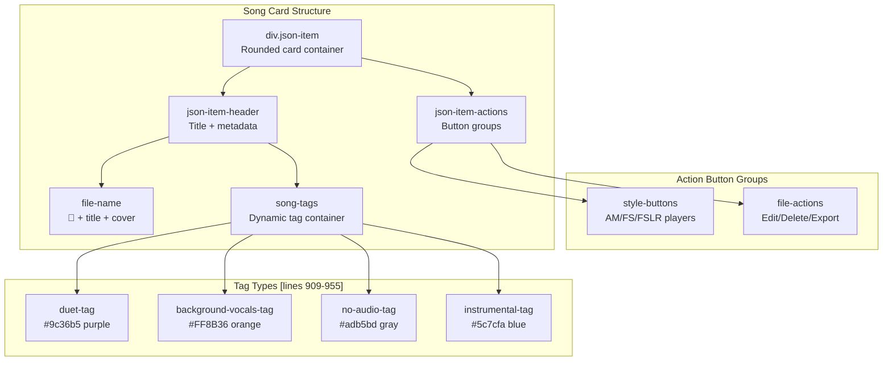

### Tag Detection System

Tags are dynamically added via the `checkLyrics()` function at [templates/LyricSphere.html L2287-L2316](https://github.com/HKLHaoBin/LyricSphere/blob/7864cfe0/templates/LyricSphere.html#L2287-L2316)

 which sends a POST request to `/check_lyrics` endpoint:

1. Sends lyric path to backend
2. Backend analyzes TTML/LYS for special markers: * Duet: `ttm:agent="v2"` attribute * Background vocals: `ttm:role="x-bg"` attribute
3. Creates appropriate tag elements in `tags-${filename}` container

### Cover Image Display

Album covers are conditionally rendered in the filename header at [templates/LyricSphere.html L371-L384](https://github.com/HKLHaoBin/LyricSphere/blob/7864cfe0/templates/LyricSphere.html#L371-L384)

:

```

```

The `.album-cover` class applies `height: 120px` and `object-fit: contain` styling [lines 379-384].

**Sources:** [templates/LyricSphere.html L335-L497](https://github.com/HKLHaoBin/LyricSphere/blob/7864cfe0/templates/LyricSphere.html#L335-L497)

 [templates/LyricSphere.html L909-L955](https://github.com/HKLHaoBin/LyricSphere/blob/7864cfe0/templates/LyricSphere.html#L909-L955)

 [templates/LyricSphere.html L2287-L2316](https://github.com/HKLHaoBin/LyricSphere/blob/7864cfe0/templates/LyricSphere.html#L2287-L2316)

---

## Lyrics Edit Modal System

The edit modal at `lyricsModal` [lines 1591-1690] implements a dual-pane editor for lyrics and translation, with extensive format conversion and AI translation tools.

### Modal Layout Structure

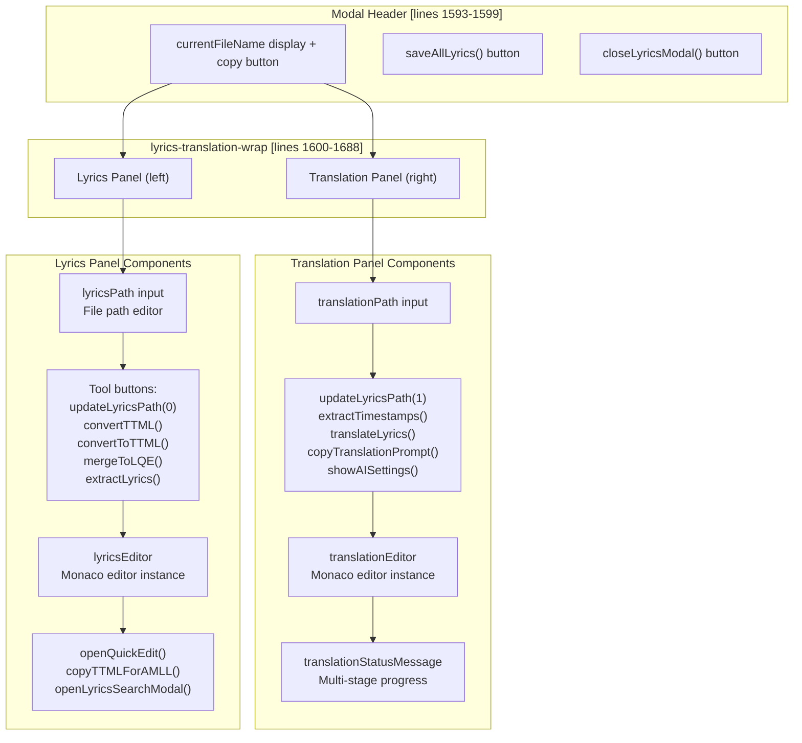

### Monaco Editor Integration

The editors are initialized as Monaco editor instances (not visible in template, created by JavaScript). The containers at [templates/LyricSphere.html L1632](https://github.com/HKLHaoBin/LyricSphere/blob/7864cfe0/templates/LyricSphere.html#L1632-L1632)

 and [line 1680] have class `lyrics-editor` which is styled as:

* Initial height: 176px [line 958]
* Flexible growth: `flex: 1; min-height: 220px` [lines 855-857]
* Error highlight: `.error-highlight` class adds red border [lines 962-965]

### Path Management Functions

The path update system uses index-based differentiation:

* `updateLyricsPath(0)`: Updates main lyrics file path
* `updateLyricsPath(1)`: Updates translation file path

File upload handlers at [lines 1626-1629] and [lines 1669-1673]:

* `handleLyricsUpload()`: Processes .lrc, .lys, .ttml files
* `handleTranslationUpload()`: Processes translation files

### Format Conversion Tools

| Button | Function | Operation |
| --- | --- | --- |
| TTML→LYS/LRC | `convertTTML()` | Backend converts TTML to line-level format |
| LYS/LRC→TTML | `convertToTTML()` | Backend generates Apple-style TTML |
| Merge to LQE | `mergeToLQE()` | Combines lyrics + translation into LQE format |
| Extract Lyrics | `extractLyrics()` | Strips timestamps for plain text output |
| Add Timestamps | `extractTimestamps()` | Syncs translation timestamps to original |

The "Merge to LQE" button has `id="mergeLQEButton"` with `display: none` by default [line 1615], shown only when both lyrics and translation exist.

**Sources:** [templates/LyricSphere.html L1591-L1690](https://github.com/HKLHaoBin/LyricSphere/blob/7864cfe0/templates/LyricSphere.html#L1591-L1690)

 [templates/LyricSphere.html L825-L871](https://github.com/HKLHaoBin/LyricSphere/blob/7864cfe0/templates/LyricSphere.html#L825-L871)

 [templates/LyricSphere.html L958-L965](https://github.com/HKLHaoBin/LyricSphere/blob/7864cfe0/templates/LyricSphere.html#L958-L965)

---

## AI Translation Interface

### Translation Status Display

The translation status container at [templates/LyricSphere.html L1675-L1678](https://github.com/HKLHaoBin/LyricSphere/blob/7864cfe0/templates/LyricSphere.html#L1675-L1678)

 implements multi-state visual feedback:

```css
#mermaid-h84r4usncig{font-family:ui-sans-serif,-apple-system,system-ui,Segoe UI,Helvetica;font-size:16px;fill:#333;}@keyframes edge-animation-frame{from{stroke-dashoffset:0;}}@keyframes dash{to{stroke-dashoffset:0;}}#mermaid-h84r4usncig .edge-animation-slow{stroke-dasharray:9,5!important;stroke-dashoffset:900;animation:dash 50s linear infinite;stroke-linecap:round;}#mermaid-h84r4usncig .edge-animation-fast{stroke-dasharray:9,5!important;stroke-dashoffset:900;animation:dash 20s linear infinite;stroke-linecap:round;}#mermaid-h84r4usncig .error-icon{fill:#dddddd;}#mermaid-h84r4usncig .error-text{fill:#222222;stroke:#222222;}#mermaid-h84r4usncig .edge-thickness-normal{stroke-width:1px;}#mermaid-h84r4usncig .edge-thickness-thick{stroke-width:3.5px;}#mermaid-h84r4usncig .edge-pattern-solid{stroke-dasharray:0;}#mermaid-h84r4usncig .edge-thickness-invisible{stroke-width:0;fill:none;}#mermaid-h84r4usncig .edge-pattern-dashed{stroke-dasharray:3;}#mermaid-h84r4usncig .edge-pattern-dotted{stroke-dasharray:2;}#mermaid-h84r4usncig .marker{fill:#999;stroke:#999;}#mermaid-h84r4usncig .marker.cross{stroke:#999;}#mermaid-h84r4usncig svg{font-family:ui-sans-serif,-apple-system,system-ui,Segoe UI,Helvetica;font-size:16px;}#mermaid-h84r4usncig p{margin:0;}#mermaid-h84r4usncig defs #statediagram-barbEnd{fill:#999;stroke:#999;}#mermaid-h84r4usncig g.stateGroup text{fill:#dddddd;stroke:none;font-size:10px;}#mermaid-h84r4usncig g.stateGroup text{fill:#333;stroke:none;font-size:10px;}#mermaid-h84r4usncig g.stateGroup .state-title{font-weight:bolder;fill:#333;}#mermaid-h84r4usncig g.stateGroup rect{fill:#ffffff;stroke:#dddddd;}#mermaid-h84r4usncig g.stateGroup line{stroke:#999;stroke-width:1;}#mermaid-h84r4usncig .transition{stroke:#999;stroke-width:1;fill:none;}#mermaid-h84r4usncig .stateGroup .composit{fill:#f4f4f4;border-bottom:1px;}#mermaid-h84r4usncig .stateGroup .alt-composit{fill:#e0e0e0;border-bottom:1px;}#mermaid-h84r4usncig .state-note{stroke:#e6d280;fill:#fff5ad;}#mermaid-h84r4usncig .state-note text{fill:#333;stroke:none;font-size:10px;}#mermaid-h84r4usncig .stateLabel .box{stroke:none;stroke-width:0;fill:#ffffff;opacity:0.5;}#mermaid-h84r4usncig .edgeLabel .label rect{fill:#ffffff;opacity:0.5;}#mermaid-h84r4usncig .edgeLabel{background-color:#ffffff;text-align:center;}#mermaid-h84r4usncig .edgeLabel p{background-color:#ffffff;}#mermaid-h84r4usncig .edgeLabel rect{opacity:0.5;background-color:#ffffff;fill:#ffffff;}#mermaid-h84r4usncig .edgeLabel .label text{fill:#333;}#mermaid-h84r4usncig .label div .edgeLabel{color:#333;}#mermaid-h84r4usncig .stateLabel text{fill:#333;font-size:10px;font-weight:bold;}#mermaid-h84r4usncig .node circle.state-start{fill:#999;stroke:#999;}#mermaid-h84r4usncig .node .fork-join{fill:#999;stroke:#999;}#mermaid-h84r4usncig .node circle.state-end{fill:#dddddd;stroke:#f4f4f4;stroke-width:1.5;}#mermaid-h84r4usncig .end-state-inner{fill:#f4f4f4;stroke-width:1.5;}#mermaid-h84r4usncig .node rect{fill:#ffffff;stroke:#dddddd;stroke-width:1px;}#mermaid-h84r4usncig .node polygon{fill:#ffffff;stroke:#dddddd;stroke-width:1px;}#mermaid-h84r4usncig #statediagram-barbEnd{fill:#999;}#mermaid-h84r4usncig .statediagram-cluster rect{fill:#ffffff;stroke:#dddddd;stroke-width:1px;}#mermaid-h84r4usncig .cluster-label,#mermaid-h84r4usncig .nodeLabel{color:#333;}#mermaid-h84r4usncig .statediagram-cluster rect.outer{rx:5px;ry:5px;}#mermaid-h84r4usncig .statediagram-state .divider{stroke:#dddddd;}#mermaid-h84r4usncig .statediagram-state .title-state{rx:5px;ry:5px;}#mermaid-h84r4usncig .statediagram-cluster.statediagram-cluster .inner{fill:#f4f4f4;}#mermaid-h84r4usncig .statediagram-cluster.statediagram-cluster-alt .inner{fill:#f8f8f8;}#mermaid-h84r4usncig .statediagram-cluster .inner{rx:0;ry:0;}#mermaid-h84r4usncig .statediagram-state rect.basic{rx:5px;ry:5px;}#mermaid-h84r4usncig .statediagram-state rect.divider{stroke-dasharray:10,10;fill:#f8f8f8;}#mermaid-h84r4usncig .note-edge{stroke-dasharray:5;}#mermaid-h84r4usncig .statediagram-note rect{fill:#fff5ad;stroke:#e6d280;stroke-width:1px;rx:0;ry:0;}#mermaid-h84r4usncig .statediagram-note rect{fill:#fff5ad;stroke:#e6d280;stroke-width:1px;rx:0;ry:0;}#mermaid-h84r4usncig .statediagram-note text{fill:#333;}#mermaid-h84r4usncig .statediagram-note .nodeLabel{color:#333;}#mermaid-h84r4usncig .statediagram .edgeLabel{color:red;}#mermaid-h84r4usncig #dependencyStart,#mermaid-h84r4usncig #dependencyEnd{fill:#999;stroke:#999;stroke-width:1;}#mermaid-h84r4usncig .statediagramTitleText{text-anchor:middle;font-size:18px;fill:#333;}#mermaid-h84r4usncig :root{--mermaid-font-family:"trebuchet ms",verdana,arial,sans-serif;}Initial statetranslateLyrics() calledStage 1 - AnalysisStage 2 - GenerationStage 3 - Quality checkNo issuesIssues detectedUser closesUser closesHiddenInProgressThinkingTranslatingValidatingSuccessWarning.translation-in-progress classShows btn-shine animation[lines 1033-1047].status-error classHighlights problem lines[lines 979-982]
```

The status message uses CSS class switching:

* `.status-message`: Base container [lines 967-977]
* `.status-error`: Red background for errors [lines 979-982]
* `.status-info`: Blue background for info [lines 984-987]
* `.status-success`: Green background for success [lines 989-992]
* `.translation-in-progress`: Special overlay mode [lines 1033-1047]

### Progress Tracking Component

The progress tracker at [templates/LyricSphere.html L1049-L1051](https://github.com/HKLHaoBin/LyricSphere/blob/7864cfe0/templates/LyricSphere.html#L1049-L1051)

 uses a list of `.status-progress__item` elements with state classes:

| State Class | Visual Styling | Semantic Meaning |
| --- | --- | --- |
| `--pending` | Opacity 0.6 [lines 1164-1166] | Not yet started |
| `--active` | White border + glow [lines 1168-1172] | Currently processing |
| `--success` | Green border [lines 1174-1177] | Completed successfully |
| `--error` | Red border [lines 1179-1182] | Failed with error |

Each item contains:

* `.status-progress__label`: Stage name (bold) [lines 1184-1187]
* `.status-progress__desc`: Stage description [lines 1189-1192]

### AI Settings Modal

The AI configuration modal at [templates/LyricSphere.html L1997-L2092](https://github.com/HKLHaoBin/LyricSphere/blob/7864cfe0/templates/LyricSphere.html#L1997-L2092)

 provides comprehensive translation customization:

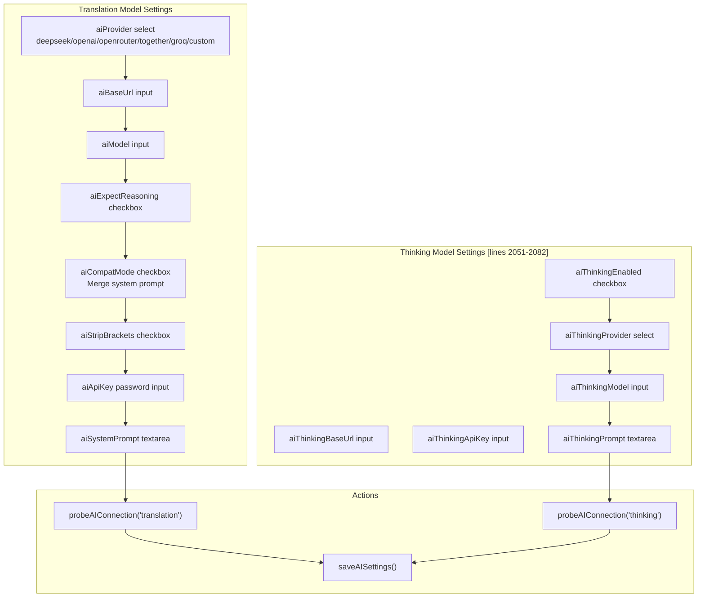

#### Two-Stage Translation Process

When `aiThinkingEnabled` is checked [line 2037], the translation executes in two stages:

1. **Thinking Stage**: Sends lyrics to thinking model for analysis * Uses `aiThinkingModel` (falls back to `aiModel` if empty) * Uses `aiThinkingApiKey` (falls back to `aiApiKey` if empty) * Generates understanding of song context, themes, wordplay
2. **Translation Stage**: Sends lyrics + thinking output to translation model * Uses main `aiModel` configuration * Incorporates thinking output as context * Produces final translation

The thinking model prompt at `aiThinkingPrompt` [lines 2080-2082] should instruct the model to analyze without translating.

#### Compatibility Mode

The `aiCompatMode` checkbox at [line 2027] controls prompt formatting:

* **Unchecked**: Sends separate system and user messages (OpenAI format)
* **Checked**: Merges system prompt into user message (for models without role support)

This affects backend prompt construction in the translation request.

**Sources:** [templates/LyricSphere.html L1675-L1678](https://github.com/HKLHaoBin/LyricSphere/blob/7864cfe0/templates/LyricSphere.html#L1675-L1678)

 [templates/LyricSphere.html L967-L1192](https://github.com/HKLHaoBin/LyricSphere/blob/7864cfe0/templates/LyricSphere.html#L967-L1192)

 [templates/LyricSphere.html L1997-L2092](https://github.com/HKLHaoBin/LyricSphere/blob/7864cfe0/templates/LyricSphere.html#L1997-L2092)

---

## Create Song Modal System

The creation modal at [templates/LyricSphere.html L1818-L1882](https://github.com/HKLHaoBin/LyricSphere/blob/7864cfe0/templates/LyricSphere.html#L1818-L1882)

 supports three source modes: AMLL snapshot, manual input, and audio file import.

### Mode Selection Interface

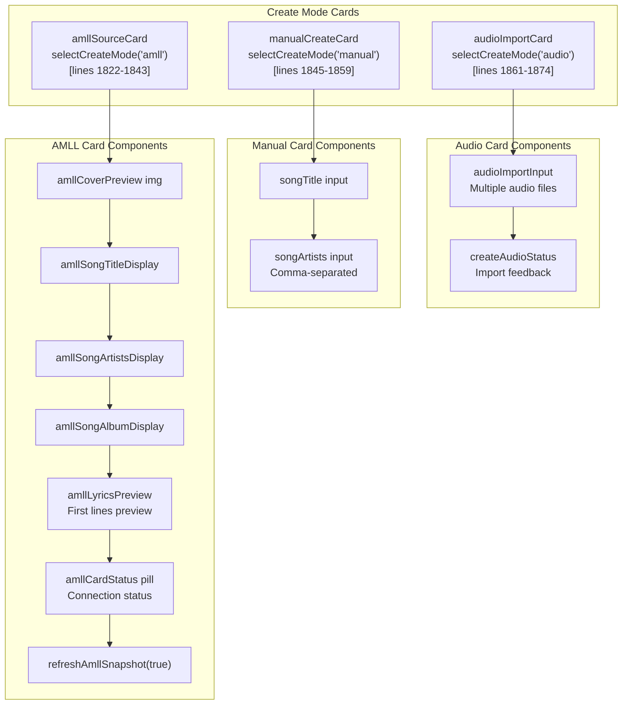

### AMLL Integration Flow

The AMLL card polls snapshot data via `refreshAmllSnapshot()` function (defined in JavaScript):

1. Sends GET request to `/amll/state` endpoint
2. Receives JSON with current playing song: * `musicName`: Song title * `musicArtists`: Array of artist names * `musicAlbum`: Album name * `albumImageUrl`: Cover URL * `lyric`: Full TTML lyric content
3. Updates preview elements: * `amllCoverPreview` src [line 1830] * `amllSongTitleDisplay` [line 1834] * `amllSongArtistsDisplay` [line 1835] * `amllSongAlbumDisplay` [line 1836] * `amllLyricsSummary` [line 1837] - Shows line count * `amllLyricsPreview` [line 1839] - Shows first few lines
4. Updates `amllCardStatus` pill [line 1825]: * "已连接" (Connected) if successful * "未连接" (Not connected) if failed

### Card Selection State

Cards use the `.selected` class [lines 726-729] to indicate active mode. The `selectCreateMode()` function:

* Removes `.selected` from all cards
* Adds `.selected` to clicked card
* Adds `.disabled` class to non-selected cards [lines 731-734]

Only the selected mode's data is used when `createJsonFile()` is called [line 1878].

### Audio Import Handler

The audio import at [lines 1867-1871] accepts multiple files via `multiple` attribute:

```

```

This function:

1. Iterates through selected audio files
2. Extracts filename (without extension) as song title
3. Creates one JSON entry per audio file
4. Uploads audio file to `/songs/` directory
5. Sets `meta.title` from filename
6. Leaves `meta.artists` empty (user can edit later)

**Sources:** [templates/LyricSphere.html L1818-L1882](https://github.com/HKLHaoBin/LyricSphere/blob/7864cfe0/templates/LyricSphere.html#L1818-L1882)

 [templates/LyricSphere.html L726-L734](https://github.com/HKLHaoBin/LyricSphere/blob/7864cfe0/templates/LyricSphere.html#L726-L734)

---

## Lyrics Search Modal (LDDC Integration)

The lyrics search modal at [templates/LyricSphere.html L1692-L1742](https://github.com/HKLHaoBin/LyricSphere/blob/7864cfe0/templates/LyricSphere.html#L1692-L1742)

 integrates with the LDDC (Lyrics Display and Download Center) API for automated lyric retrieval.

### Modal Layout

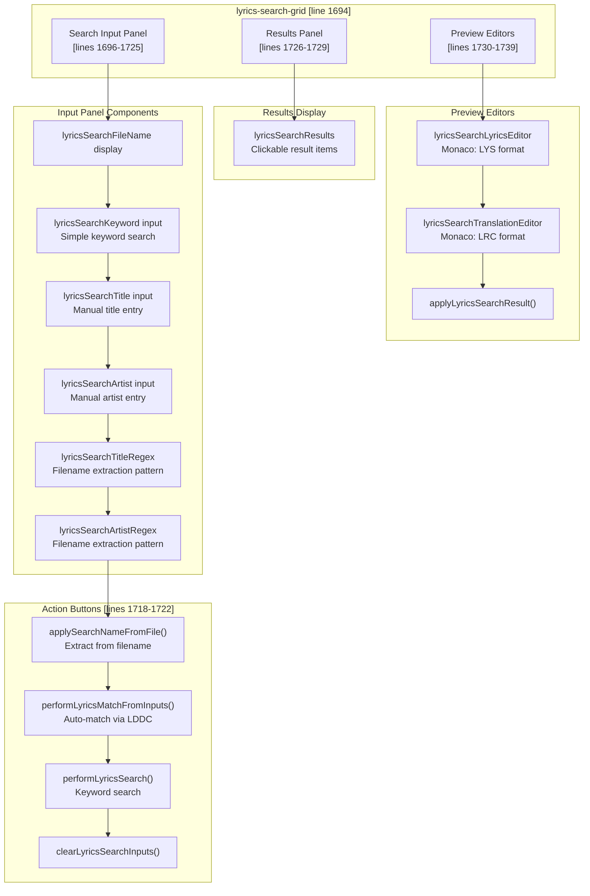

### Filename Parsing System

The regex inputs at [lines 1711-1717] allow custom extraction patterns. Default patterns:

| Field | Default Pattern | Example Match |
| --- | --- | --- |
| Title | `^(.+?) -` | "Song Name - Artist.json" → "Song Name" |
| Artist | `- (.+)$` | "Song Name - Artist.json" → "Artist" |

The `applySearchNameFromFile()` function:

1. Gets `currentFileName` from edit modal
2. Applies `lyricsSearchTitleRegex` pattern
3. Applies `lyricsSearchArtistRegex` pattern
4. Populates `lyricsSearchTitle` and `lyricsSearchArtist` inputs
5. Automatically calls `performLyricsMatchFromInputs()`

### LDDC API Integration

The modal supports two search modes:

**1. Auto-Match Mode** (`performLyricsMatchFromInputs()`):

* Sends title + artist to LDDC match endpoint
* Returns exact match if found
* Automatically loads lyrics into preview editors

**2. Keyword Search Mode** (`performLyricsSearch()`):

* Sends keyword to LDDC search endpoint
* Returns list of potential matches in `lyricsSearchResults` [line 1728]
* User clicks result to load preview

### Preview Editor Format

The preview editors at [lines 1732-1734] use Monaco editor instances:

* **Lyrics**: Always LYS format (syllable-level timing)
* **Translation**: Always LRC format (line-level timing)

The `applyLyricsSearchResult()` button [line 1736] copies content from preview editors back to main edit modal's `lyricsEditor` and `translationEditor`.

**Sources:** [templates/LyricSphere.html L1692-L1742](https://github.com/HKLHaoBin/LyricSphere/blob/7864cfe0/templates/LyricSphere.html#L1692-L1742)

 [templates/LyricSphere.html L533-L621](https://github.com/HKLHaoBin/LyricSphere/blob/7864cfe0/templates/LyricSphere.html#L533-L621)

---

## Resource Management System

### URL Normalization Architecture

The resource management system at [templates/LyricSphere.html L2185-L2284](https://github.com/HKLHaoBin/LyricSphere/blob/7864cfe0/templates/LyricSphere.html#L2185-L2284)

 implements safe URL handling for three resource types: songs, static assets, and backups.

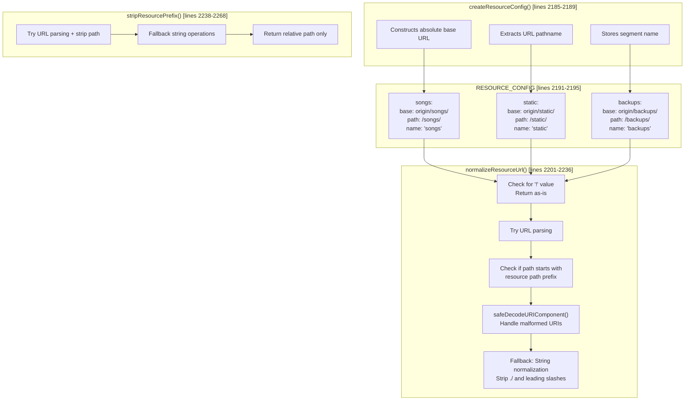

### Safe URI Decoding

The `safeDecodeURIComponent()` function at [templates/LyricSphere.html L2177-L2183](https://github.com/HKLHaoBin/LyricSphere/blob/7864cfe0/templates/LyricSphere.html#L2177-L2183)

 wraps `decodeURIComponent()` with try-catch:

```

```

This prevents crashes from invalid percent-encoding sequences (e.g., `%E0%A4%`).

### Convenience Wrappers

Four wrapper functions provide type-specific normalization:

| Function | Calls | Use Case |
| --- | --- | --- |
| `normalizeSongsUrl()` [line 2270] | `normalizeResourceUrl(value, 'songs')` | Lyric files, audio files, covers |
| `stripSongsPrefix()` [line 2274] | `stripResourcePrefix(value, 'songs')` | Convert URL to relative path for storage |
| `normalizeStaticUrl()` [line 2278] | `normalizeResourceUrl(value, 'static')` | Static assets like icons |
| `normalizeBackupsUrl()` [line 2282] | `normalizeResourceUrl(value, 'backups')` | Backup file references |

### Special Value Handling

The value `'!'` is treated as a special marker [lines 2205-2207]:

* Represents "no file" or "empty" resource
* Bypasses all normalization logic
* Returned unchanged

This allows distinguishing between:

* `null` / `undefined`: Field not set
* `''`: Empty string (may be normalized)
* `'!'`: Explicitly marked as absent

**Sources:** [templates/LyricSphere.html L2177-L2284](https://github.com/HKLHaoBin/LyricSphere/blob/7864cfe0/templates/LyricSphere.html#L2177-L2284)

---

## File Upload Handlers

### Upload Flow Architecture

```

```

### Handler Functions

The template defines multiple upload handlers for different resource types:

**1. Lyrics Upload** [templates/LyricSphere.html:1626-1629]

```

```

* Accepts: `.lrc`, `.lys`, `.ttml` formats
* Updates: `lyricsPath` input and `lyricsEditor` Monaco instance
* Endpoint: `/upload_file` with `resource_type=lyrics`

**2. Translation Upload** [lines 1669-1673]

```

```

* Same format support as lyrics
* Updates: `translationPath` and `translationEditor`

**3. Music Upload** [lines 1755-1757]

```

```

* Accepts: All audio and video MIME types
* Updates: `newMusicPath` input in music path modal
* Note at [lines 1759-1761] clarifies support for "all formats"

**4. Image Upload** [lines 1780-1784]

```

```

* Accepts: All image MIME types
* Passes file and type parameter ('album' or 'background')
* Updates: `newImagePath` input

**5. Background Upload** [lines 1799-1803]

```

```

* Accepts: Images and videos (for animated backgrounds)
* Supported formats noted at [lines 1804-1806]: JPG/PNG/GIF/WEBP/MP4/WEBM/OGG/M4V/MOV

**6. Batch Audio Import** [lines 1867-1871]

```

```

* Supports `multiple` attribute for batch creation
* Each file creates separate JSON entry

### Upload Button Pattern

All upload buttons follow the label-wrapping pattern for better UX:

```

```

This allows clicking the styled button to trigger the hidden file input [lines 1625-1629, 1669-1673, 1754-1757, 1780-1784, 1799-1803].

**Sources:** [templates/LyricSphere.html L1626-L1629](https://github.com/HKLHaoBin/LyricSphere/blob/7864cfe0/templates/LyricSphere.html#L1626-L1629)

 [templates/LyricSphere.html L1669-L1673](https://github.com/HKLHaoBin/LyricSphere/blob/7864cfe0/templates/LyricSphere.html#L1669-L1673)

 [templates/LyricSphere.html L1754-L1757](https://github.com/HKLHaoBin/LyricSphere/blob/7864cfe0/templates/LyricSphere.html#L1754-L1757)

 [templates/LyricSphere.html L1780-L1806](https://github.com/HKLHaoBin/LyricSphere/blob/7864cfe0/templates/LyricSphere.html#L1780-L1806)

 [templates/LyricSphere.html L1867-L1871](https://github.com/HKLHaoBin/LyricSphere/blob/7864cfe0/templates/LyricSphere.html#L1867-L1871)

---

## Authentication and Security Modals

### Device Authentication Modal

The authentication modal at [templates/LyricSphere.html L1915-L1941](https://github.com/HKLHaoBin/LyricSphere/blob/7864cfe0/templates/LyricSphere.html#L1915-L1941)

 implements the device unlock interface:

```css
#mermaid-3ma74pfemkm{font-family:ui-sans-serif,-apple-system,system-ui,Segoe UI,Helvetica;font-size:16px;fill:#333;}@keyframes edge-animation-frame{from{stroke-dashoffset:0;}}@keyframes dash{to{stroke-dashoffset:0;}}#mermaid-3ma74pfemkm .edge-animation-slow{stroke-dasharray:9,5!important;stroke-dashoffset:900;animation:dash 50s linear infinite;stroke-linecap:round;}#mermaid-3ma74pfemkm .edge-animation-fast{stroke-dasharray:9,5!important;stroke-dashoffset:900;animation:dash 20s linear infinite;stroke-linecap:round;}#mermaid-3ma74pfemkm .error-icon{fill:#dddddd;}#mermaid-3ma74pfemkm .error-text{fill:#222222;stroke:#222222;}#mermaid-3ma74pfemkm .edge-thickness-normal{stroke-width:1px;}#mermaid-3ma74pfemkm .edge-thickness-thick{stroke-width:3.5px;}#mermaid-3ma74pfemkm .edge-pattern-solid{stroke-dasharray:0;}#mermaid-3ma74pfemkm .edge-thickness-invisible{stroke-width:0;fill:none;}#mermaid-3ma74pfemkm .edge-pattern-dashed{stroke-dasharray:3;}#mermaid-3ma74pfemkm .edge-pattern-dotted{stroke-dasharray:2;}#mermaid-3ma74pfemkm .marker{fill:#999;stroke:#999;}#mermaid-3ma74pfemkm .marker.cross{stroke:#999;}#mermaid-3ma74pfemkm svg{font-family:ui-sans-serif,-apple-system,system-ui,Segoe UI,Helvetica;font-size:16px;}#mermaid-3ma74pfemkm p{margin:0;}#mermaid-3ma74pfemkm defs #statediagram-barbEnd{fill:#999;stroke:#999;}#mermaid-3ma74pfemkm g.stateGroup text{fill:#dddddd;stroke:none;font-size:10px;}#mermaid-3ma74pfemkm g.stateGroup text{fill:#333;stroke:none;font-size:10px;}#mermaid-3ma74pfemkm g.stateGroup .state-title{font-weight:bolder;fill:#333;}#mermaid-3ma74pfemkm g.stateGroup rect{fill:#ffffff;stroke:#dddddd;}#mermaid-3ma74pfemkm g.stateGroup line{stroke:#999;stroke-width:1;}#mermaid-3ma74pfemkm .transition{stroke:#999;stroke-width:1;fill:none;}#mermaid-3ma74pfemkm .stateGroup .composit{fill:#f4f4f4;border-bottom:1px;}#mermaid-3ma74pfemkm .stateGroup .alt-composit{fill:#e0e0e0;border-bottom:1px;}#mermaid-3ma74pfemkm .state-note{stroke:#e6d280;fill:#fff5ad;}#mermaid-3ma74pfemkm .state-note text{fill:#333;stroke:none;font-size:10px;}#mermaid-3ma74pfemkm .stateLabel .box{stroke:none;stroke-width:0;fill:#ffffff;opacity:0.5;}#mermaid-3ma74pfemkm .edgeLabel .label rect{fill:#ffffff;opacity:0.5;}#mermaid-3ma74pfemkm .edgeLabel{background-color:#ffffff;text-align:center;}#mermaid-3ma74pfemkm .edgeLabel p{background-color:#ffffff;}#mermaid-3ma74pfemkm .edgeLabel rect{opacity:0.5;background-color:#ffffff;fill:#ffffff;}#mermaid-3ma74pfemkm .edgeLabel .label text{fill:#333;}#mermaid-3ma74pfemkm .label div .edgeLabel{color:#333;}#mermaid-3ma74pfemkm .stateLabel text{fill:#333;font-size:10px;font-weight:bold;}#mermaid-3ma74pfemkm .node circle.state-start{fill:#999;stroke:#999;}#mermaid-3ma74pfemkm .node .fork-join{fill:#999;stroke:#999;}#mermaid-3ma74pfemkm .node circle.state-end{fill:#dddddd;stroke:#f4f4f4;stroke-width:1.5;}#mermaid-3ma74pfemkm .end-state-inner{fill:#f4f4f4;stroke-width:1.5;}#mermaid-3ma74pfemkm .node rect{fill:#ffffff;stroke:#dddddd;stroke-width:1px;}#mermaid-3ma74pfemkm .node polygon{fill:#ffffff;stroke:#dddddd;stroke-width:1px;}#mermaid-3ma74pfemkm #statediagram-barbEnd{fill:#999;}#mermaid-3ma74pfemkm .statediagram-cluster rect{fill:#ffffff;stroke:#dddddd;stroke-width:1px;}#mermaid-3ma74pfemkm .cluster-label,#mermaid-3ma74pfemkm .nodeLabel{color:#333;}#mermaid-3ma74pfemkm .statediagram-cluster rect.outer{rx:5px;ry:5px;}#mermaid-3ma74pfemkm .statediagram-state .divider{stroke:#dddddd;}#mermaid-3ma74pfemkm .statediagram-state .title-state{rx:5px;ry:5px;}#mermaid-3ma74pfemkm .statediagram-cluster.statediagram-cluster .inner{fill:#f4f4f4;}#mermaid-3ma74pfemkm .statediagram-cluster.statediagram-cluster-alt .inner{fill:#f8f8f8;}#mermaid-3ma74pfemkm .statediagram-cluster .inner{rx:0;ry:0;}#mermaid-3ma74pfemkm .statediagram-state rect.basic{rx:5px;ry:5px;}#mermaid-3ma74pfemkm .statediagram-state rect.divider{stroke-dasharray:10,10;fill:#f8f8f8;}#mermaid-3ma74pfemkm .note-edge{stroke-dasharray:5;}#mermaid-3ma74pfemkm .statediagram-note rect{fill:#fff5ad;stroke:#e6d280;stroke-width:1px;rx:0;ry:0;}#mermaid-3ma74pfemkm .statediagram-note rect{fill:#fff5ad;stroke:#e6d280;stroke-width:1px;rx:0;ry:0;}#mermaid-3ma74pfemkm .statediagram-note text{fill:#333;}#mermaid-3ma74pfemkm .statediagram-note .nodeLabel{color:#333;}#mermaid-3ma74pfemkm .statediagram .edgeLabel{color:red;}#mermaid-3ma74pfemkm #dependencyStart,#mermaid-3ma74pfemkm #dependencyEnd{fill:#999;stroke:#999;stroke-width:1;}#mermaid-3ma74pfemkm .statediagramTitleText{text-anchor:middle;font-size:18px;fill:#333;}#mermaid-3ma74pfemkm :root{--mermaid-font-family:"trebuchet ms",verdana,arial,sans-serif;}Modal openedDevice in trusted listDevice not trustedShow checkmarkShow authFormauthLogin() calledPassword correctPassword incorrectcloseAuthModal()RetryCheckingAlreadyTrustedNeedsAuthSuccessPasswordFormVerifyingErrorauthSuccess div shownGreen checkmark [lines 1933-1938]authPassword inputauthLogin() button[lines 1922-1931]
```

### Modal Components

| Element ID | Purpose | Lines |
| --- | --- | --- |
| `authStatus` | Status display (checking/trusted/error) | 1919-1921 |
| `authForm` | Password input form (hidden initially) | 1922-1931 |
| `authPassword` | Password input field | 1925 |
| `authLogoutBtn` | Logout from device (hidden initially) | 1929 |
| `authSuccess` | Success confirmation screen | 1933-1938 |

The success screen at [lines 1933-1938] displays:

* Large checkmark emoji (✅) at font-size: 3rem
* "设备已成功认证！" (Device successfully authenticated)
* Subtitle: "您现在可以编辑内容了" (You can now edit content)

### Password Setting Modal

The password configuration modal at [templates/LyricSphere.html L1944-L1972](https://github.com/HKLHaoBin/LyricSphere/blob/7864cfe0/templates/LyricSphere.html#L1944-L1972)

 allows changing system password:

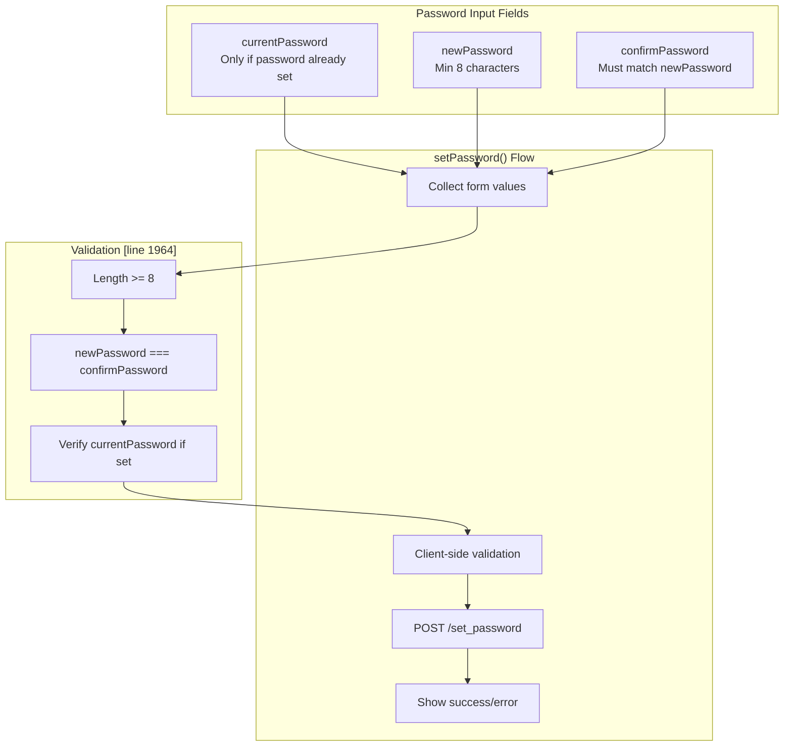

The requirement note at [lines 1963-1965] specifies:

* "💡 密码要求：最少8个字符，建议包含字母、数字和特殊字符"
* Translation: "Password requirements: minimum 8 characters, recommend letters, numbers, and special characters"

The status display at `setPasswordStatus` [line 1948] shows dynamic feedback during the operation.

### Device Revocation Modal

The revocation modal at [templates/LyricSphere.html L1975-L1994](https://github.com/HKLHaoBin/LyricSphere/blob/7864cfe0/templates/LyricSphere.html#L1975-L1994)

 manages trusted device list:

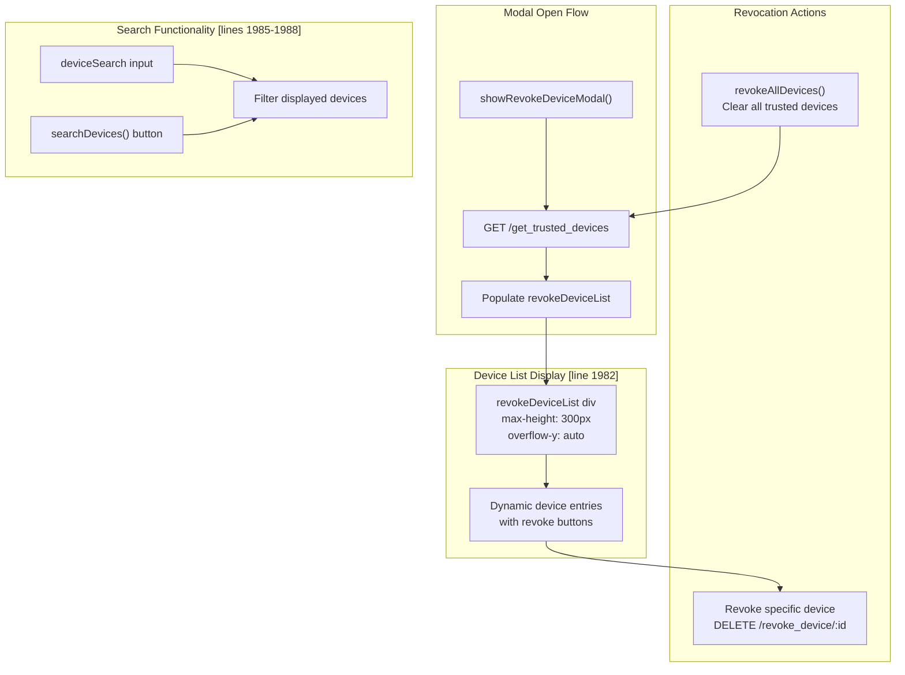

The list container at [line 1982] is initially hidden (`display: none`), shown only after devices load successfully.

The status display at `revokeDeviceStatus` [line 1979] shows:

* "正在加载设备列表..." (Loading device list...) during load
* Error message if load fails
* Device count after successful load

**Sources:** [templates/LyricSphere.html L1915-L1994](https://github.com/HKLHaoBin/LyricSphere/blob/7864cfe0/templates/LyricSphere.html#L1915-L1994)

---

## Responsive Design System

### Media Query Breakpoints

The template implements mobile-first responsive design with two primary breakpoints:

**Portrait/Mobile Breakpoint** [templates/LyricSphere.html:1195-1351]

```

```

**Desktop/Landscape Breakpoint** [lines 1437-1457]

```

```

### Mobile Layout Adaptations

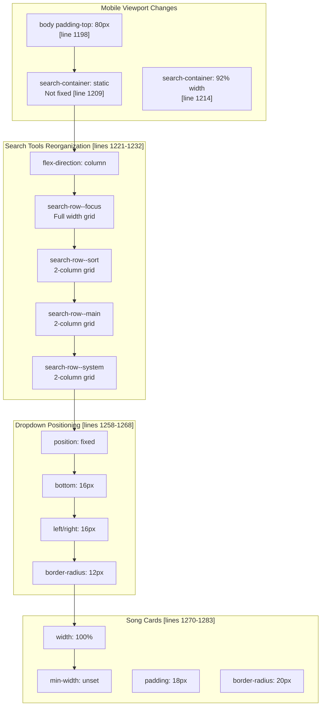

### Search Row Grid System

On mobile, each `search-row` class converts to a 2-column grid [lines 1243-1246]:

```

```

The focus row (containing search box) uses single column [lines 1235-1240]:

```

```

### Modal Adaptations

Mobile modals receive significant layout changes [lines 1316-1350]:

| Element | Desktop | Mobile |
| --- | --- | --- |
| `.modal-content` margin | `6% auto` | `40px auto` |
| `.modal-content` width | `95%` | `calc(100% - 24px)` |
| `.modal-content` height | `80%` | `calc(100% - 80px)` |
| `.modal-content` border-radius | `16px` | `14px` |
| `.lyrics-editor` height | `176px` | `220px` |

Modal header switches to vertical stacking [lines 1332-1336]:

```

```

All buttons become full-width [lines 1345-1350]:

```

```

### Desktop Layout Optimizations

The desktop media query [lines 1437-1457] enables horizontal layouts:

**Search Tools** [lines 1438-1450]:

* `flex-wrap: nowrap` - Prevents row wrapping
* `max-width: 1200px` - Constrains container
* `justify-content: center` - Centers button groups

**Translation Panel** [lines 843-852]:

```

```

This switches the lyrics and translation editors from vertical stack to side-by-side layout when viewport width exceeds 960px.

**Sources:** [templates/LyricSphere.html L1195-L1351](https://github.com/HKLHaoBin/LyricSphere/blob/7864cfe0/templates/LyricSphere.html#L1195-L1351)

 [templates/LyricSphere.html L1437-L1457](https://github.com/HKLHaoBin/LyricSphere/blob/7864cfe0/templates/LyricSphere.html#L1437-L1457)

 [templates/LyricSphere.html L843-L852](https://github.com/HKLHaoBin/LyricSphere/blob/7864cfe0/templates/LyricSphere.html#L843-L852)

---

## Theme System

### CSS Variable Architecture

The theme system uses CSS custom properties defined in `:root` and `.dark-mode` selectors [templates/LyricSphere.html:9-55]:

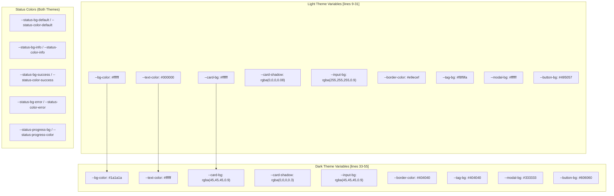

### Theme Toggle Mechanism

The theme toggle button at [templates/LyricSphere.html L1548](https://github.com/HKLHaoBin/LyricSphere/blob/7864cfe0/templates/LyricSphere.html#L1548-L1548)

 calls `toggleDarkMode()`:

1. Checks if `<body>` has `.dark-mode` class
2. If present: Removes class, stores `theme=light` in localStorage
3. If absent: Adds class, stores `theme=dark` in localStorage
4. All CSS rules using `var(--variable-name)` update automatically

### Status Message Color Scheme

Status messages have distinct color schemes for both themes:

**Light Theme Status Colors** [lines 20-30]:

| Status Type | Background | Text Color |
| --- | --- | --- |
| Default | `#e7f5ff` | `#1c7ed6` (Blue) |
| Info | `#e7f5ff` | `#1c7ed6` (Blue) |
| Success | `#e6fcf5` | `#0c8599` (Teal) |
| Error | `#ffe3e3` | `#c92a2a` (Red) |
| Progress | `rgba(33,33,33,0.92)` | `#ffffff` (White) |

**Dark Theme Status Colors** [lines 44-54]:

| Status Type | Background | Text Color |
| --- | --- | --- |
| Default | `rgba(77,171,247,0.18)` | `#9bd4ff` (Light blue) |
| Info | `rgba(77,171,247,0.18)` | `#9bd4ff` (Light blue) |
| Success | `rgba(18,184,134,0.2)` | `#7fe7c7` (Light teal) |
| Error | `rgba(255,107,107,0.25)` | `#ffb3b3` (Light red) |
| Progress | `rgba(20,20,20,0.92)` | `#ffffff` (White) |

The dark theme uses semi-transparent backgrounds with higher opacity text for better contrast on dark backgrounds.

### Smooth Transitions

The body element applies smooth theme transitions [lines 57-65]:

```

```

This creates a 300ms ease animation when switching between light and dark modes, preventing jarring visual changes.

**Sources:** [templates/LyricSphere.html L9-L65](https://github.com/HKLHaoBin/LyricSphere/blob/7864cfe0/templates/LyricSphere.html#L9-L65)

 [templates/LyricSphere.html L1548](https://github.com/HKLHaoBin/LyricSphere/blob/7864cfe0/templates/LyricSphere.html#L1548-L1548)

---

## JavaScript State Management

### Global State Variables

The JavaScript section maintains several global state variables:

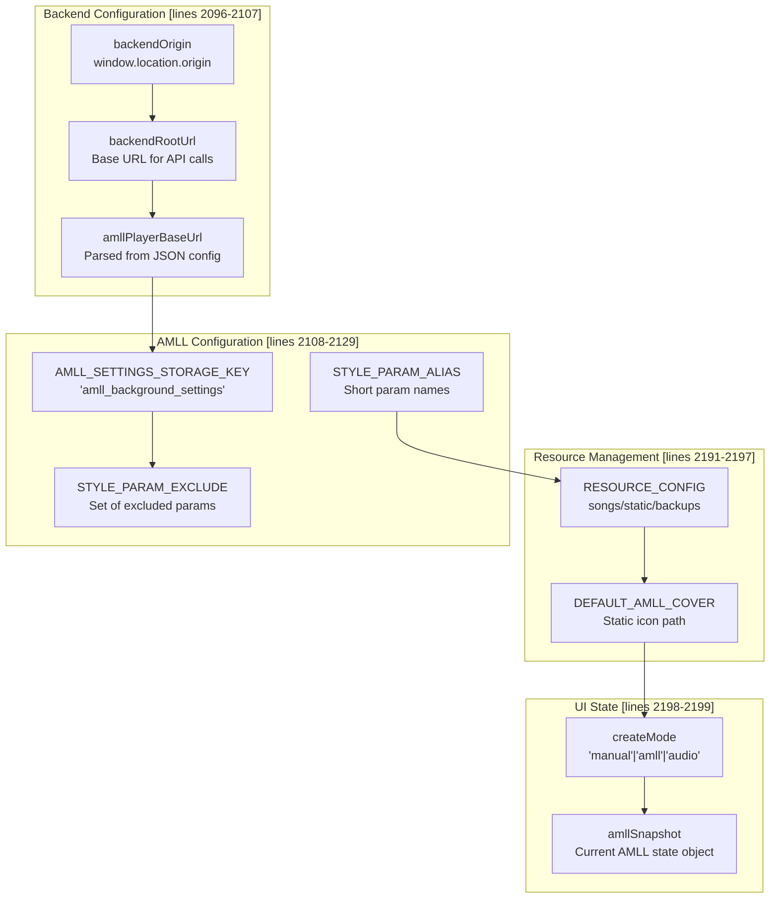

### AMLL Settings Persistence

The AMLL settings system [lines 2131-2175] uses localStorage to persist player configuration:

**Read Settings** (`readCachedAmllSettings()` at lines 2131-2143):

```

```

**Build Query String** (`buildStyleQueryFromSettings()` at lines 2145-2170):

1. Iterates through settings object
2. Skips excluded parameters (musicUrl, lyricUrl, etc.)
3. Applies parameter aliases (e.g., `lyricDelay` → `ms`)
4. Converts booleans to `1`/`0`
5. Returns URL query string like `&ms=500&x=1.2&vol=0.8&loop=1`

**Cache Access** (`buildStyleQueryFromCache()` at lines 2172-2175):

* Convenience wrapper combining read + build operations
* Used when opening AMLL player to apply user's saved preferences

### Parameter Exclusion Set

The `STYLE_PARAM_EXCLUDE` set at [lines 2109-2120] prevents certain parameters from appearing in URL:

```

```

This ensures resource URLs are handled distinctly from style parameters like volume, playback rate, and loop mode.

### Parameter Aliasing

The `STYLE_PARAM_ALIAS` object at [lines 2121-2129] provides URL-friendly short names:

| Long Name | Alias | Purpose |
| --- | --- | --- |
| `lyricDelay` | `ms` | Lyric timing offset in milliseconds |
| `playbackRate` | `x` | Playback speed multiplier (e.g., 1.5x) |
| `volume` | `vol` | Audio volume level (0.0-1.0) |
| `loopPlay` | `loop` | Enable loop mode (1/0) |
| `autoPlay` | `auto` | Enable autoplay (1/0) |
| `rangeStartTime` | `t` | Range playback start time |
| `rangeEndTime` | `te` | Range playback end time |

These shorter names reduce URL length when passing multiple parameters to the AMLL player.

**Sources:** [templates/LyricSphere.html L2096-L2199](https://github.com/HKLHaoBin/LyricSphere/blob/7864cfe0/templates/LyricSphere.html#L2096-L2199)

 [templates/LyricSphere.html L2131-L2175](https://github.com/HKLHaoBin/LyricSphere/blob/7864cfe0/templates/LyricSphere.html#L2131-L2175)

---

## Loading States and Animations

### WiFi Loader Component

The global loading indicator at [templates/LyricSphere.html L1570-L1588](https://github.com/HKLHaoBin/LyricSphere/blob/7864cfe0/templates/LyricSphere.html#L1570-L1588)

 uses a custom SVG animation:

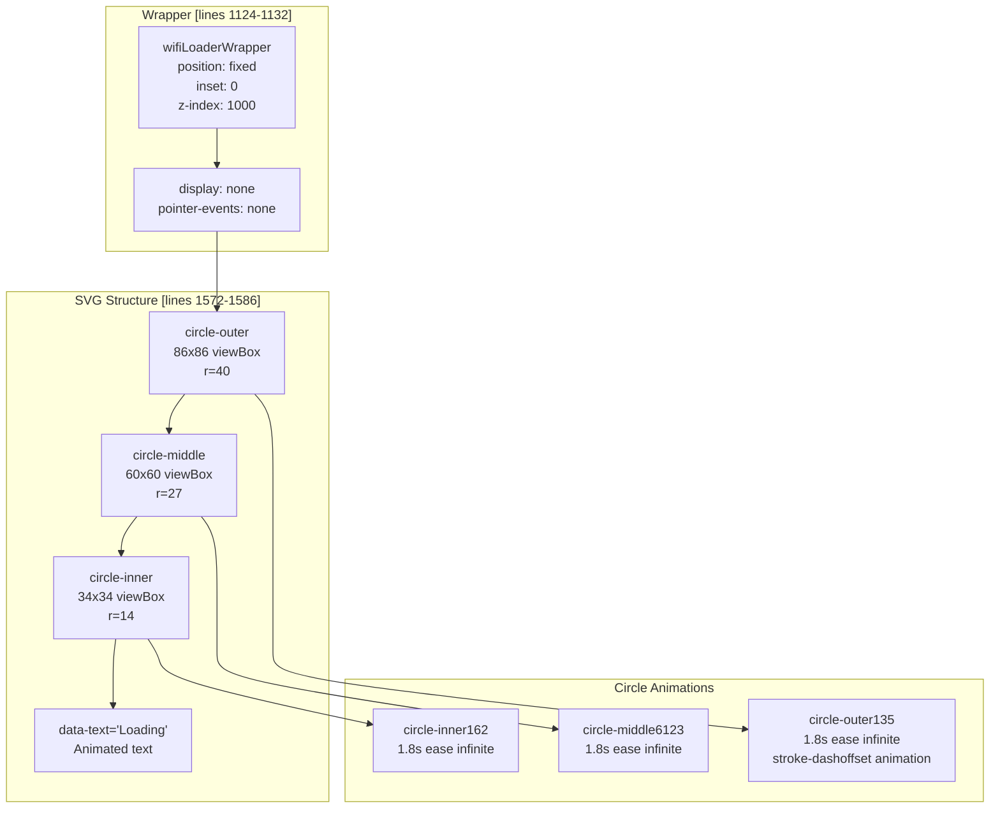

### Animation Keyframes

Three synchronized animations create the loading effect:

**Outer Circle** [lines 255-275]:

```

```

**Middle Circle** [lines 277-297]:

* Similar pattern with different dasharray: `42.5 127.5`
* Offset range: 17 → 0 → 204 → 187

**Inner Circle** [lines 299-319]:

* Smallest circle with dasharray: `22 66`
* Offset range: 9 → 0 → 106 → 97

Each circle has `.back` and `.front` elements with staggered animation delays (0.3s/0.15s, 0.25s/0.1s, 0.2s/0.05s) creating a cascading wave effect.

### Text Shimmer Animation

The "Loading" text uses a clip-path animation [lines 321-333]:

```

```

This creates a left-to-right reveal effect that loops continuously.

### Shine Button Animation

The translation progress uses a shine effect at [lines 1054-1115]:

```

```

This creates a horizontal shimmer that sweeps across text during translation operations.

**Sources:** [templates/LyricSphere.html L1124-L1132](https://github.com/HKLHaoBin/LyricSphere/blob/7864cfe0/templates/LyricSphere.html#L1124-L1132)

 [templates/LyricSphere.html L1570-L1588](https://github.com/HKLHaoBin/LyricSphere/blob/7864cfe0/templates/LyricSphere.html#L1570-L1588)

 [templates/LyricSphere.html L255-L333](https://github.com/HKLHaoBin/LyricSphere/blob/7864cfe0/templates/LyricSphere.html#L255-L333)

 [templates/LyricSphere.html L1054-L1115](https://github.com/HKLHaoBin/LyricSphere/blob/7864cfe0/templates/LyricSphere.html#L1054-L1115)

---

## Data Flow Summary

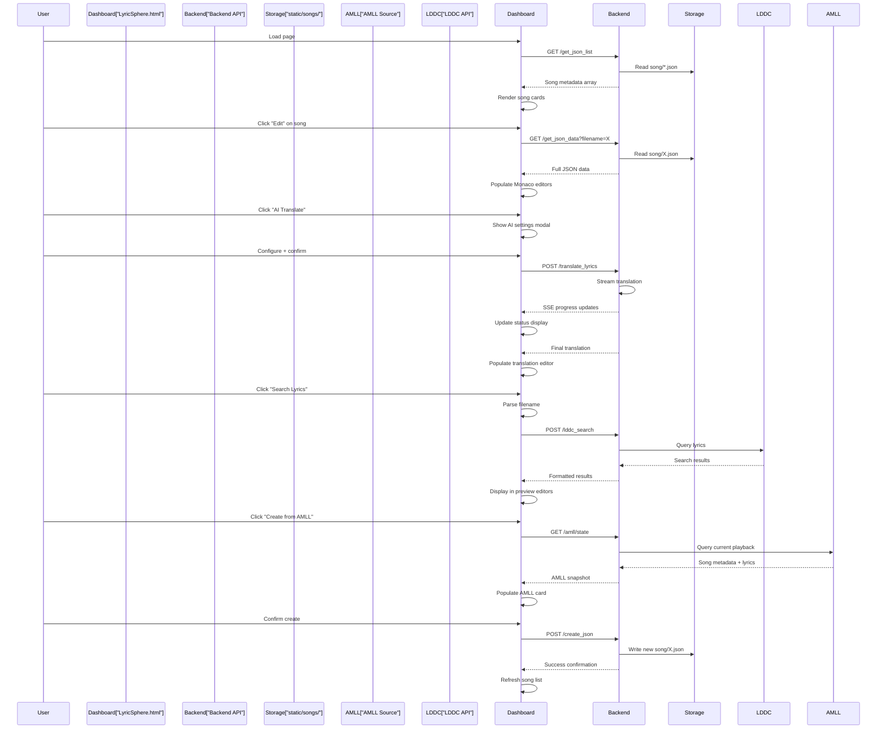

**Sources:** [templates/LyricSphere.html L1-L2700](https://github.com/HKLHaoBin/LyricSphere/blob/7864cfe0/templates/LyricSphere.html#L1-L2700)