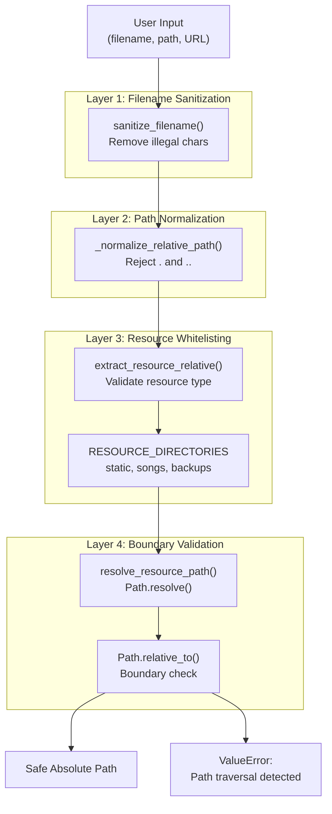
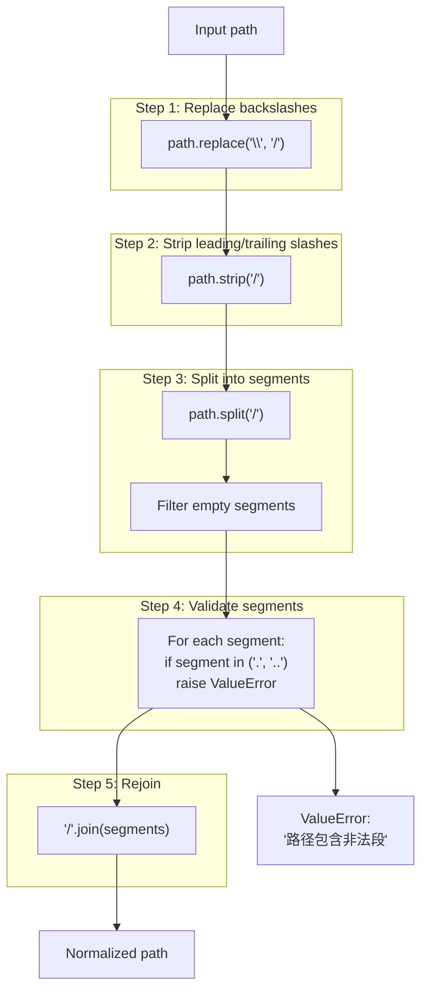
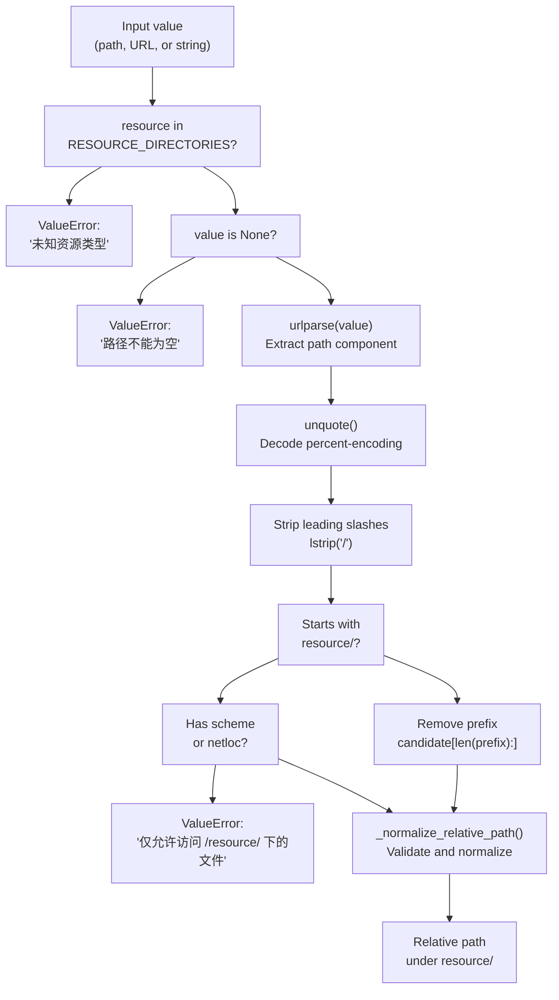
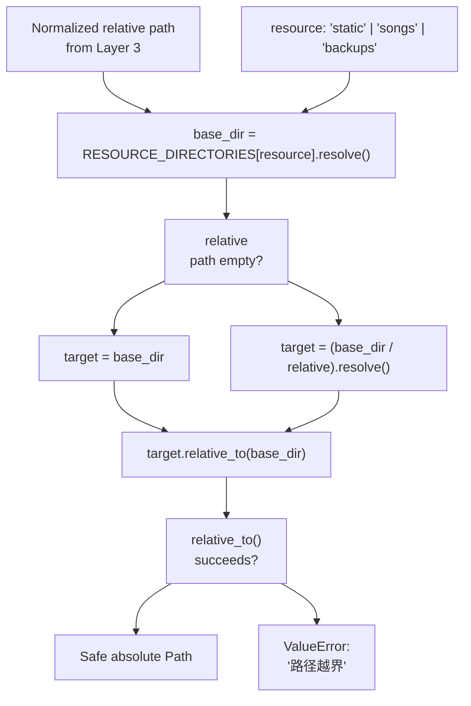
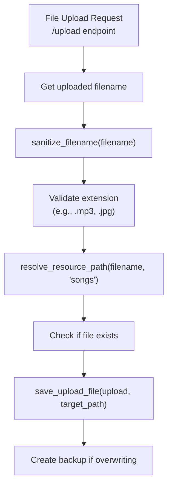
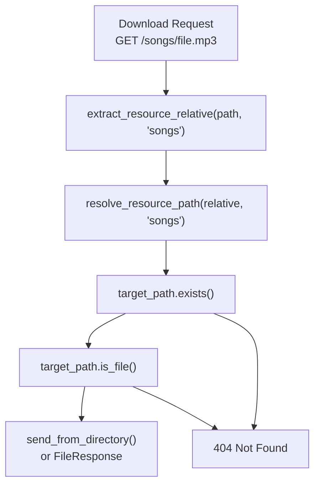

# Path Security and Validation

> **Relevant source files**
> * [CHANGELOG.md](https://github.com/HKLHaoBin/LyricSphere/blob/7864cfe0/CHANGELOG.md)
> * [LICENSE](https://github.com/HKLHaoBin/LyricSphere/blob/7864cfe0/LICENSE)
> * [README.md](https://github.com/HKLHaoBin/LyricSphere/blob/7864cfe0/README.md)
> * [backend.py](https://github.com/HKLHaoBin/LyricSphere/blob/7864cfe0/backend.py)

This document describes the path security and validation system that prevents unauthorized file access, path traversal attacks, and file system manipulation. The system enforces strict controls on all file operations through a defense-in-depth approach using filename sanitization, path normalization, directory whitelisting, and boundary validation.

For information about device authentication and password protection, see [Device Authentication](/HKLHaoBin/LyricSphere/2.6.1-device-authentication). For file backup and version management, see [Backup and Version Management](/HKLHaoBin/LyricSphere/2.7-backup-and-version-management).

## Purpose and Scope

The path security system protects LyricSphere from:

* **Path traversal attacks** using `..` or absolute paths to access files outside controlled directories
* **Malicious filenames** containing special characters, control sequences, or path separators
* **Directory boundary violations** through symlinks or path resolution exploits
* **Resource type confusion** by enforcing strict directory whitelisting

All file operations (upload, download, read, write, delete, rename) pass through this security layer before accessing the file system.

## Security Architecture

The path security system implements four defensive layers that execute in sequence:



**Sources:** [backend.py L988-L1047](https://github.com/HKLHaoBin/LyricSphere/blob/7864cfe0/backend.py#L988-L1047)

## Layer 1: Filename Sanitization

The `sanitize_filename()` function removes dangerous characters from user-provided filenames to prevent file system exploitation and command injection.

### Sanitization Rules

| Character Type | Action | Example |
| --- | --- | --- |
| Alphanumeric | Preserved | `abc123` → `abc123` |
| Chinese characters | Preserved | `歌词` → `歌词` |
| Hyphen, underscore, dot, space | Preserved | `song-1.lys` → `song-1.lys` |
| Double quotes `"` | Replaced with full-width | `"test"` → `＂test＂` |
| Single quotes `'` | Replaced with full-width | `'test'` → `＂test＂` |
| Path separators (`/`, `\`) | Removed | `path/to/file` → `pathtofile` |
| Control characters | Removed | `file\x00.txt` → `file.txt` |
| Special characters | Removed | `file*?.txt` → `file.txt` |

### Implementation

```python
SAFE_FILENAME_PATTERN = re.compile(r'[^\w\u4e00-\u9fa5\-_. ]')

def sanitize_filename(value: Optional[str]) -> str:
    if not value:
        return ''
    
    cleaned = SAFE_FILENAME_PATTERN.sub('', value)
    cleaned = cleaned.replace('"', '＂').replace("'", '＂')
    return cleaned.strip()
```

The regex pattern `[^\w\u4e00-\u9fa5\-_. ]` matches:

* `\w` - word characters (alphanumeric + underscore)
* `\u4e00-\u9fa5` - Chinese characters (CJK Unified Ideographs)
* `\-_.` - literal hyphen, underscore, dot
* `` - space character

All other characters are removed via `sub('', value)`.

**Sources:** [backend.py L994-L1004](https://github.com/HKLHaoBin/LyricSphere/blob/7864cfe0/backend.py#L994-L1004)

## Layer 2: Path Normalization

The `_normalize_relative_path()` function standardizes path separators and rejects traversal attempts.

### Normalization Process



### Examples

| Input | Output | Reason |
| --- | --- | --- |
| `songs/track.mp3` | `songs/track.mp3` | Valid relative path |
| `songs\\track.mp3` | `songs/track.mp3` | Backslash normalized |
| `/songs/track.mp3` | `songs/track.mp3` | Leading slash stripped |
| `songs/../config.json` | `ValueError` | Contains `..` traversal |
| `songs/./track.mp3` | `ValueError` | Contains `.` reference |
| `songs//track.mp3` | `songs/track.mp3` | Empty segments filtered |

**Sources:** [backend.py L1006-L1015](https://github.com/HKLHaoBin/LyricSphere/blob/7864cfe0/backend.py#L1006-L1015)

## Layer 3: Resource Whitelisting

The `extract_resource_relative()` function validates that paths reference only allowed resource directories.

### Allowed Resource Types

The system defines three permitted resource directories in `RESOURCE_DIRECTORIES`:

```css
RESOURCE_DIRECTORIES = {
    'static': STATIC_DIR,     # BASE_PATH / 'static'
    'songs': SONGS_DIR,       # STATIC_DIR / 'songs'
    'backups': BACKUP_DIR,    # STATIC_DIR / 'backups'
}
```

Any request for resources outside these directories is rejected with `ValueError`.

### Extraction Process



### URL Parsing Examples

| Input | Resource | Output | Notes |
| --- | --- | --- | --- |
| `songs/track.mp3` | `songs` | `track.mp3` | Simple relative path |
| `/songs/track.mp3` | `songs` | `track.mp3` | Absolute path stripped |
| `http://example.com/songs/track.mp3` | `songs` | `track.mp3` | URL path extracted |
| `static/songs/track.mp3` | `songs` | `track.mp3` | Parent prefix removed |
| `backups/file.json.1234` | `backups` | `file.json.1234` | Backup file |
| `http://evil.com/malicious` | `songs` | `ValueError` | External URL rejected |
| `data/file.txt` | `songs` | `ValueError` | Wrong prefix, has scheme-like format |

**Sources:** [backend.py L1018-L1034](https://github.com/HKLHaoBin/LyricSphere/blob/7864cfe0/backend.py#L1018-L1034)

## Layer 4: Boundary Validation

The `resolve_resource_path()` function resolves the normalized relative path to an absolute path and verifies it remains within the allowed directory boundary.

### Resolution and Validation Flow



### Path Resolution Mechanics

The validation uses two Python `pathlib.Path` methods:

1. **`Path.resolve()`** - Converts to absolute path, resolving symlinks and normalizing: ``` base_dir = RESOURCE_DIRECTORIES[resource].resolve() target = (base_dir / relative).resolve() ```
2. **`Path.relative_to()`** - Checks if target is within base_dir: ```markdown target.relative_to(base_dir)  # Raises ValueError if target is outside base_dir ```

### Attack Prevention Examples

| Scenario | Path Input | Result | Explanation |
| --- | --- | --- | --- |
| Normal access | `songs/track.mp3` | ✓ Allowed | Within songs directory |
| Parent traversal | `songs/../config.py` | ✗ Blocked | Rejected by Layer 2 (contains `..`) |
| Absolute path | `/etc/passwd` | ✗ Blocked | Rejected by Layer 3 (no resource prefix) |
| Symlink escape | `songs/link` → `/etc` | ✗ Blocked | `resolve()` follows symlink, `relative_to()` detects escape |
| Double encoding | `songs/%2e%2e/file` | ✗ Blocked | `unquote()` decodes to `..`, rejected by Layer 2 |
| Null byte | `songs/file\x00.txt` | ✗ Blocked | Removed by Layer 1 sanitization |

**Sources:** [backend.py L1037-L1047](https://github.com/HKLHaoBin/LyricSphere/blob/7864cfe0/backend.py#L1037-L1047)

## Integration with File Operations

Path security functions are called before all file system operations. Here are key integration points:

### File Upload Security



**Sources:** [backend.py L2059-L2219](https://github.com/HKLHaoBin/LyricSphere/blob/7864cfe0/backend.py#L2059-L2219)

### File Read/Download Security



**Sources:** [backend.py L713-L738](https://github.com/HKLHaoBin/LyricSphere/blob/7864cfe0/backend.py#L713-L738)

### Resource Path Collection (Export)

The `collect_song_resource_paths()` function walks through JSON payloads to identify all referenced resource files for export operations, using `_extract_single_song_relative()` to parse each path:

```python
def collect_song_resource_paths(payload: Union[dict, list, str]) -> Set[str]:
    collected: Set[str] = set()
    
    def _walk(value):
        if isinstance(value, str):
            relative = _extract_single_song_relative(value)
            if relative:
                collected.add(relative)
        # ... recursive traversal
    
    _walk(payload)
    return collected
```

Each collected path is then validated through `resolve_resource_path()` before inclusion in the export archive.

**Sources:** [backend.py L1114-L1135](https://github.com/HKLHaoBin/LyricSphere/blob/7864cfe0/backend.py#L1114-L1135)

## Path Validation Function Reference

### Core Functions

| Function | Purpose | Input | Output |
| --- | --- | --- | --- |
| `sanitize_filename(value)` | Remove illegal filename characters | String | Sanitized string |
| `_normalize_relative_path(value)` | Normalize and validate path segments | String | Normalized path or `ValueError` |
| `extract_resource_relative(value, resource)` | Extract and validate relative path for resource type | String, resource name | Relative path or `ValueError` |
| `resolve_resource_path(value, resource)` | Resolve to absolute path with boundary check | String, resource name | Absolute `Path` or `ValueError` |
| `resource_relative_from_path(path, resource)` | Convert absolute path to resource-relative | Path, resource name | Relative path or `ValueError` |

### Helper Functions

| Function | Purpose |
| --- | --- |
| `_extract_single_song_relative(value)` | Extract songs/ path from string (used in resource collection) |
| `collect_song_resource_paths(payload)` | Walk JSON and collect all referenced songs/ paths |
| `extract_font_files_from_lys(content)` | Parse LYS content for font file references |

**Sources:** [backend.py L994-L1184](https://github.com/HKLHaoBin/LyricSphere/blob/7864cfe0/backend.py#L994-L1184)

## Security Properties

The path security system guarantees:

1. **No Directory Traversal** - All paths containing `..` or `.` are rejected before file system access
2. **Directory Confinement** - All resolved paths are verified to be within allowed resource directories
3. **Filename Safety** - All filenames are sanitized to prevent command injection or file system exploits
4. **Symlink Protection** - `Path.resolve()` follows symlinks before boundary validation
5. **URL Injection Prevention** - External URLs and absolute paths are rejected unless they reference allowed resources
6. **Null Byte Protection** - Null bytes and control characters are removed during sanitization

### Error Handling

All security violations raise `ValueError` with Chinese error messages:

* `'未知资源类型'` - Unknown resource type requested
* `'路径不能为空'` - Empty path provided
* `'路径包含非法段'` - Path contains `.` or `..` segments
* `'仅允许访问 /resource/ 下的文件'` - External URL or wrong resource directory
* `'路径越界'` - Path resolves outside allowed directory

These errors are caught by endpoint handlers and returned as HTTP 400 Bad Request or 404 Not Found responses.

**Sources:** [backend.py L1018-L1047](https://github.com/HKLHaoBin/LyricSphere/blob/7864cfe0/backend.py#L1018-L1047)

## Testing Path Security

To test the path security system, try these edge cases:

| Test Case | Expected Result |
| --- | --- |
| `songs/../../etc/passwd` | Rejected (contains `..`) |
| `http://evil.com/payload` | Rejected (external URL) |
| `C:\Windows\System32\cmd.exe` | Rejected (absolute Windows path) |
| `songs/file%2e%2e/escape` | Rejected (URL-encoded `..`) |
| `songs/normal_file.mp3` | Allowed |
| `backups/song.json.20250101_120000` | Allowed |
| `static/songs/track.mp3` | Allowed (prefix removed) |
| `data/config.json` | Rejected (not in whitelist) |

All file operation endpoints (`/upload`, `/delete`, `/rename`, `/download`, etc.) should properly enforce these security checks.

**Sources:** [backend.py L988-L1047](https://github.com/HKLHaoBin/LyricSphere/blob/7864cfe0/backend.py#L988-L1047)