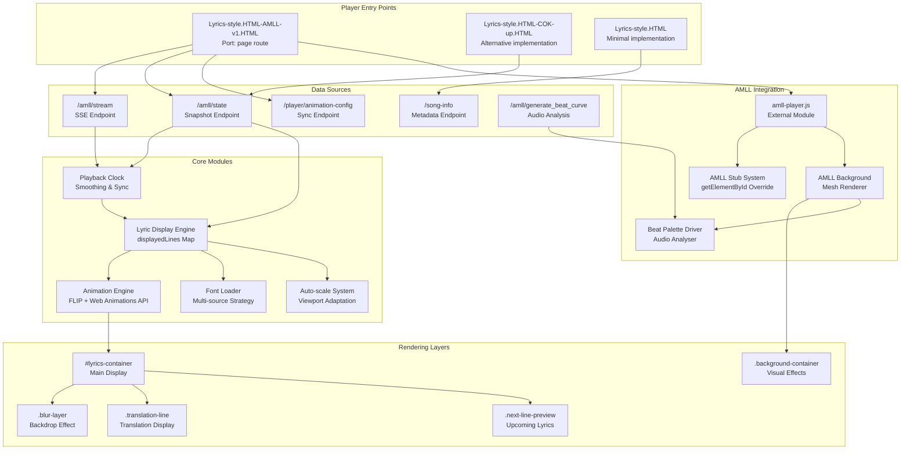
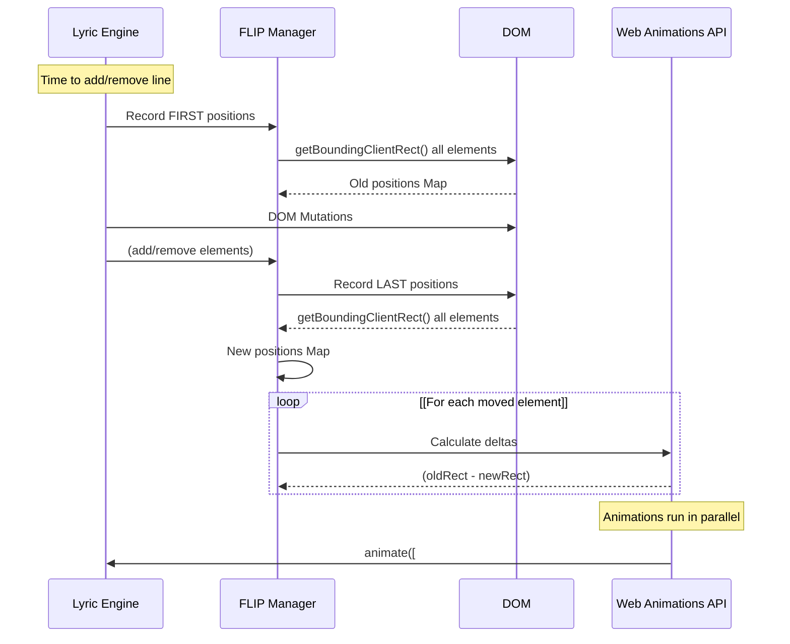
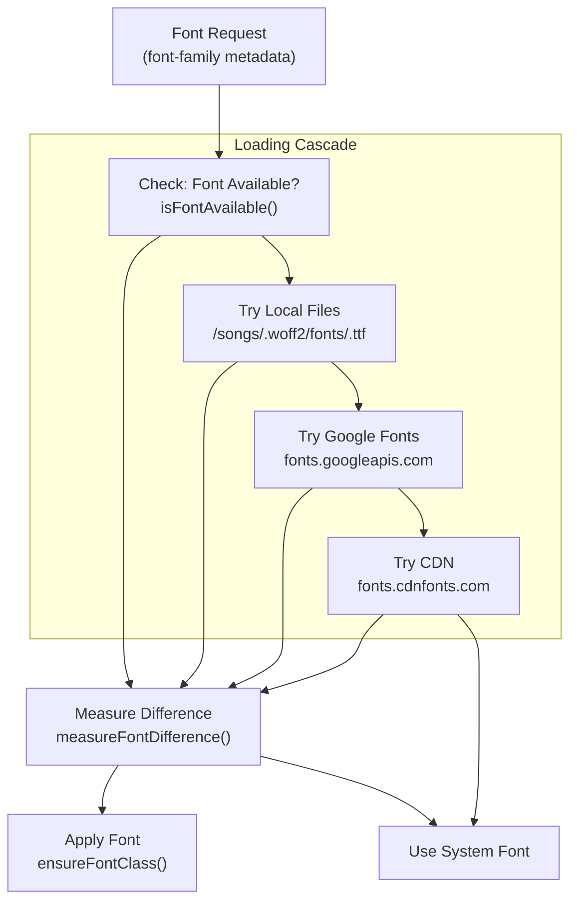
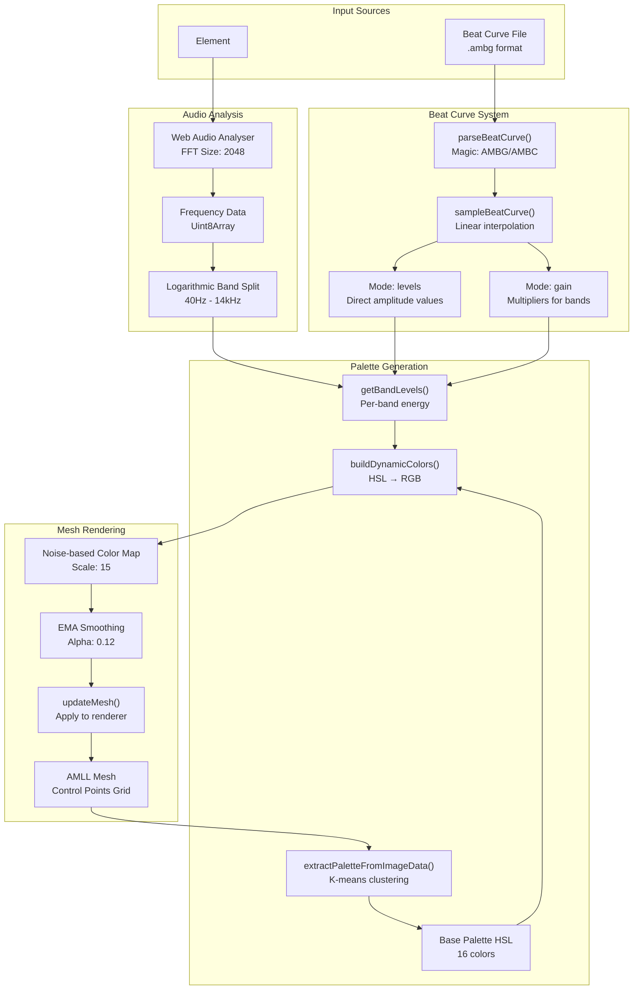

# Player UIs

> **Relevant source files**
> * [templates/Lyrics-style.HTML](https://github.com/HKLHaoBin/LyricSphere/blob/7864cfe0/templates/Lyrics-style.HTML)
> * [templates/Lyrics-style.HTML-AMLL-v1.HTML](https://github.com/HKLHaoBin/LyricSphere/blob/7864cfe0/templates/Lyrics-style.HTML-AMLL-v1.HTML)
> * [templates/Lyrics-style.HTML-COK-up.HTML](https://github.com/HKLHaoBin/LyricSphere/blob/7864cfe0/templates/Lyrics-style.HTML-COK-up.HTML)

This document describes the lyric display player interfaces available in LyricSphere. These players provide real-time lyric visualization with animations, font rendering, and background effects. For information about editing lyrics, see [Lyrics Translation Interface](/HKLHaoBin/LyricSphere/3.5-lyrics-translation-interface). For the main dashboard interface, see [Main Dashboard (LyricSphere.html)](/HKLHaoBin/LyricSphere/3.1-main-dashboard-(lyricsphere.html)).

## Overview

LyricSphere provides multiple player implementations optimized for different use cases:

| Player Variant | File | Primary Features |
| --- | --- | --- |
| **AMLL Player** | `Lyrics-style.HTML-AMLL-v1.HTML` | Full AMLL integration, background visualizer, audio-reactive effects, beat curve support |
| **COK-up Player** | `Lyrics-style.HTML-COK-up.HTML` | Next-line preview, breath dots animation, font overflow handling |
| **Basic Player** | `Lyrics-style.HTML` | Lightweight implementation, simple animations, translation support |

All players share common functionality: syllable-level lyric synchronization, FLIP-based smooth transitions, dynamic font loading, and responsive scaling.

Sources: [templates/Lyrics-style.HTML-AMLL-v1.HTML L1-L10](https://github.com/HKLHaoBin/LyricSphere/blob/7864cfe0/templates/Lyrics-style.HTML-AMLL-v1.HTML#L1-L10)

 [templates/Lyrics-style.HTML-COK-up.HTML L1-L10](https://github.com/HKLHaoBin/LyricSphere/blob/7864cfe0/templates/Lyrics-style.HTML-COK-up.HTML#L1-L10)

 [templates/Lyrics-style.HTML L1-L10](https://github.com/HKLHaoBin/LyricSphere/blob/7864cfe0/templates/Lyrics-style.HTML#L1-L10)

---

## Player Architecture



**Player Architecture**: The player system consists of three HTML templates that implement different feature sets. All players share a common lyric display engine using a `displayedLines` Map to track visible lines. The AMLL player extends this with external module integration through a stub system that intercepts `document.getElementById` calls. Real-time data flows through SSE or state polling endpoints, feeding into a smoothed playback clock that drives the animation engine.

Sources: [templates/Lyrics-style.HTML-AMLL-v1.HTML L252-L259](https://github.com/HKLHaoBin/LyricSphere/blob/7864cfe0/templates/Lyrics-style.HTML-AMLL-v1.HTML#L252-L259)

 [templates/Lyrics-style.HTML-COK-up.HTML L853-L868](https://github.com/HKLHaoBin/LyricSphere/blob/7864cfe0/templates/Lyrics-style.HTML-COK-up.HTML#L853-L868)

 [templates/Lyrics-style.HTML L238-L257](https://github.com/HKLHaoBin/LyricSphere/blob/7864cfe0/templates/Lyrics-style.HTML#L238-L257)

---

## AMLL Player Implementation

The AMLL Player ([templates/Lyrics-style.HTML-AMLL-v1.HTML](https://github.com/HKLHaoBin/LyricSphere/blob/7864cfe0/templates/Lyrics-style.HTML-AMLL-v1.HTML)

) is the most feature-rich implementation, providing full integration with the AMLL (Apple Music-Like Lyrics) rendering system.

### Key Constants and Configuration

```
// Stream endpoints
AMLL_STATE_URL = '/amll/state'
AMLL_STREAM_URL = '/amll/stream'
AMLL_MODULE_URL = '/static/assets/amll-player.js'

// Timing parameters
PROGRESS_RESYNC_INTERVAL_MS = 3000
LYRICS_REFETCH_INTERVAL_MS = 1200
LYRICS_REFETCH_MAX_ATTEMPTS = 4

// Auto-scaling
LYRIC_SCALE_MIN = 0.01
LYRIC_SCALE_DURATION_MS = 360
AUTO_SCALE_SAFETY_RATIO = 0.97
AUTO_SCALE_SAFETY_PADDING = 48
```

Sources: [templates/Lyrics-style.HTML-AMLL-v1.HTML L252-L259](https://github.com/HKLHaoBin/LyricSphere/blob/7864cfe0/templates/Lyrics-style.HTML-AMLL-v1.HTML#L252-L259)

 [templates/Lyrics-style.HTML-AMLL-v1.HTML L523-L531](https://github.com/HKLHaoBin/LyricSphere/blob/7864cfe0/templates/Lyrics-style.HTML-AMLL-v1.HTML#L523-L531)

### State Management

The player maintains multiple synchronized clocks and state objects:

| State Object | Purpose | Key Properties |
| --- | --- | --- |
| `playbackClock` | Master playback timer | `baseMs`, `lastUpdateAt`, `smoothing`, `synced` |
| `lineClock` | Per-line timing | `progressMs`, `updatedAt` |
| `amllColorState` | Background visualization | `basePaletteHsl`, `analyser`, `beatCurve`, `enabled` |
| `displayedLines` | Active lyric lines | Map of lineIndex → lineInfo |
| `latestProgressSample` | Resync reference | `progressMs`, `receivedAt` |

Sources: [templates/Lyrics-style.HTML-AMLL-v1.HTML L485-L493](https://github.com/HKLHaoBin/LyricSphere/blob/7864cfe0/templates/Lyrics-style.HTML-AMLL-v1.HTML#L485-L493)

 [templates/Lyrics-style.HTML-AMLL-v1.HTML L1385-L1402](https://github.com/HKLHaoBin/LyricSphere/blob/7864cfe0/templates/Lyrics-style.HTML-AMLL-v1.HTML#L1385-L1402)

### Playback Clock with Smoothing

The playback clock implements smooth progress synchronization with exponential smoothing to prevent visual jumps:

```javascript
function syncPlaybackProgress(progressMs, { immediate = false } = {}) {
    const now = performance.now();
    const current = getCurrentPlaybackMs();
    const delta = progressMs - current;
    
    playbackClock.baseMs = immediate ? progressMs : current;
    playbackClock.lastUpdateAt = now;
    playbackClock.synced = true;
    playbackClock.smoothing = null;
    
    // Apply smoothing for deltas > 10ms
    if (!immediate && Math.abs(delta) > 10) {
        const duration = clamp(Math.abs(delta) * 1.2, 180, 900);
        playbackClock.smoothing = { start: now, duration, delta };
    }
}
```

The smoothing uses cubic easing (`easeOutCubic`) to gradually adjust the displayed time over 180-900ms based on the delta magnitude.

Sources: [templates/Lyrics-style.HTML-AMLL-v1.HTML L753-L771](https://github.com/HKLHaoBin/LyricSphere/blob/7864cfe0/templates/Lyrics-style.HTML-AMLL-v1.HTML#L753-L771)

 [templates/Lyrics-style.HTML-AMLL-v1.HTML L718-L720](https://github.com/HKLHaoBin/LyricSphere/blob/7864cfe0/templates/Lyrics-style.HTML-AMLL-v1.HTML#L718-L720)

 [templates/Lyrics-style.HTML-AMLL-v1.HTML L722-L738](https://github.com/HKLHaoBin/LyricSphere/blob/7864cfe0/templates/Lyrics-style.HTML-AMLL-v1.HTML#L722-L738)

---

## Animation System

All player variants use the FLIP (First, Last, Invert, Play) technique for smooth lyric line transitions.



**FLIP Animation Flow**: The animation system captures element positions before and after DOM mutations, then animates the delta to create the illusion of smooth movement. This technique ensures constant 60fps performance even when multiple lines are added/removed simultaneously.

Sources: [templates/Lyrics-style.HTML L262-L347](https://github.com/HKLHaoBin/LyricSphere/blob/7864cfe0/templates/Lyrics-style.HTML#L262-L347)

 [templates/Lyrics-style.HTML-COK-up.HTML L975-L1437](https://github.com/HKLHaoBin/LyricSphere/blob/7864cfe0/templates/Lyrics-style.HTML-COK-up.HTML#L975-L1437)

### Animation Duration Configuration

The AMLL player reports animation durations to the backend through the `/player/animation-config` endpoint. The backend uses these values (default 600ms) when calculating `disappearTime` values in `compute_disappear_times()`.

```javascript
// Client-side defaults
const enterDuration = 700;   // Line entry animation
const moveDuration = 700;    // FLIP transition duration  
const exitDuration = 700;    // Line exit animation
const placeholderDuration = 50; // Placeholder removal delay
```

The backend synchronizes these to a common default:

```markdown
# backend.py
use_computed_disappear = params.get('useComputedDisappear', False)
default_duration = 600  # milliseconds
```

Sources: [templates/Lyrics-style.HTML L248-L253](https://github.com/HKLHaoBin/LyricSphere/blob/7864cfe0/templates/Lyrics-style.HTML#L248-L253)

 [templates/Lyrics-style.HTML-AMLL-v1.HTML L523-L527](https://github.com/HKLHaoBin/LyricSphere/blob/7864cfe0/templates/Lyrics-style.HTML-AMLL-v1.HTML#L523-L527)

### Line Display Lifecycle

```python
#mermaid-f1yjmgrhse{font-family:ui-sans-serif,-apple-system,system-ui,Segoe UI,Helvetica;font-size:16px;fill:#333;}@keyframes edge-animation-frame{from{stroke-dashoffset:0;}}@keyframes dash{to{stroke-dashoffset:0;}}#mermaid-f1yjmgrhse .edge-animation-slow{stroke-dasharray:9,5!important;stroke-dashoffset:900;animation:dash 50s linear infinite;stroke-linecap:round;}#mermaid-f1yjmgrhse .edge-animation-fast{stroke-dasharray:9,5!important;stroke-dashoffset:900;animation:dash 20s linear infinite;stroke-linecap:round;}#mermaid-f1yjmgrhse .error-icon{fill:#dddddd;}#mermaid-f1yjmgrhse .error-text{fill:#222222;stroke:#222222;}#mermaid-f1yjmgrhse .edge-thickness-normal{stroke-width:1px;}#mermaid-f1yjmgrhse .edge-thickness-thick{stroke-width:3.5px;}#mermaid-f1yjmgrhse .edge-pattern-solid{stroke-dasharray:0;}#mermaid-f1yjmgrhse .edge-thickness-invisible{stroke-width:0;fill:none;}#mermaid-f1yjmgrhse .edge-pattern-dashed{stroke-dasharray:3;}#mermaid-f1yjmgrhse .edge-pattern-dotted{stroke-dasharray:2;}#mermaid-f1yjmgrhse .marker{fill:#999;stroke:#999;}#mermaid-f1yjmgrhse .marker.cross{stroke:#999;}#mermaid-f1yjmgrhse svg{font-family:ui-sans-serif,-apple-system,system-ui,Segoe UI,Helvetica;font-size:16px;}#mermaid-f1yjmgrhse p{margin:0;}#mermaid-f1yjmgrhse defs #statediagram-barbEnd{fill:#999;stroke:#999;}#mermaid-f1yjmgrhse g.stateGroup text{fill:#dddddd;stroke:none;font-size:10px;}#mermaid-f1yjmgrhse g.stateGroup text{fill:#333;stroke:none;font-size:10px;}#mermaid-f1yjmgrhse g.stateGroup .state-title{font-weight:bolder;fill:#333;}#mermaid-f1yjmgrhse g.stateGroup rect{fill:#ffffff;stroke:#dddddd;}#mermaid-f1yjmgrhse g.stateGroup line{stroke:#999;stroke-width:1;}#mermaid-f1yjmgrhse .transition{stroke:#999;stroke-width:1;fill:none;}#mermaid-f1yjmgrhse .stateGroup .composit{fill:#f4f4f4;border-bottom:1px;}#mermaid-f1yjmgrhse .stateGroup .alt-composit{fill:#e0e0e0;border-bottom:1px;}#mermaid-f1yjmgrhse .state-note{stroke:#e6d280;fill:#fff5ad;}#mermaid-f1yjmgrhse .state-note text{fill:#333;stroke:none;font-size:10px;}#mermaid-f1yjmgrhse .stateLabel .box{stroke:none;stroke-width:0;fill:#ffffff;opacity:0.5;}#mermaid-f1yjmgrhse .edgeLabel .label rect{fill:#ffffff;opacity:0.5;}#mermaid-f1yjmgrhse .edgeLabel{background-color:#ffffff;text-align:center;}#mermaid-f1yjmgrhse .edgeLabel p{background-color:#ffffff;}#mermaid-f1yjmgrhse .edgeLabel rect{opacity:0.5;background-color:#ffffff;fill:#ffffff;}#mermaid-f1yjmgrhse .edgeLabel .label text{fill:#333;}#mermaid-f1yjmgrhse .label div .edgeLabel{color:#333;}#mermaid-f1yjmgrhse .stateLabel text{fill:#333;font-size:10px;font-weight:bold;}#mermaid-f1yjmgrhse .node circle.state-start{fill:#999;stroke:#999;}#mermaid-f1yjmgrhse .node .fork-join{fill:#999;stroke:#999;}#mermaid-f1yjmgrhse .node circle.state-end{fill:#dddddd;stroke:#f4f4f4;stroke-width:1.5;}#mermaid-f1yjmgrhse .end-state-inner{fill:#f4f4f4;stroke-width:1.5;}#mermaid-f1yjmgrhse .node rect{fill:#ffffff;stroke:#dddddd;stroke-width:1px;}#mermaid-f1yjmgrhse .node polygon{fill:#ffffff;stroke:#dddddd;stroke-width:1px;}#mermaid-f1yjmgrhse #statediagram-barbEnd{fill:#999;}#mermaid-f1yjmgrhse .statediagram-cluster rect{fill:#ffffff;stroke:#dddddd;stroke-width:1px;}#mermaid-f1yjmgrhse .cluster-label,#mermaid-f1yjmgrhse .nodeLabel{color:#333;}#mermaid-f1yjmgrhse .statediagram-cluster rect.outer{rx:5px;ry:5px;}#mermaid-f1yjmgrhse .statediagram-state .divider{stroke:#dddddd;}#mermaid-f1yjmgrhse .statediagram-state .title-state{rx:5px;ry:5px;}#mermaid-f1yjmgrhse .statediagram-cluster.statediagram-cluster .inner{fill:#f4f4f4;}#mermaid-f1yjmgrhse .statediagram-cluster.statediagram-cluster-alt .inner{fill:#f8f8f8;}#mermaid-f1yjmgrhse .statediagram-cluster .inner{rx:0;ry:0;}#mermaid-f1yjmgrhse .statediagram-state rect.basic{rx:5px;ry:5px;}#mermaid-f1yjmgrhse .statediagram-state rect.divider{stroke-dasharray:10,10;fill:#f8f8f8;}#mermaid-f1yjmgrhse .note-edge{stroke-dasharray:5;}#mermaid-f1yjmgrhse .statediagram-note rect{fill:#fff5ad;stroke:#e6d280;stroke-width:1px;rx:0;ry:0;}#mermaid-f1yjmgrhse .statediagram-note rect{fill:#fff5ad;stroke:#e6d280;stroke-width:1px;rx:0;ry:0;}#mermaid-f1yjmgrhse .statediagram-note text{fill:#333;}#mermaid-f1yjmgrhse .statediagram-note .nodeLabel{color:#333;}#mermaid-f1yjmgrhse .statediagram .edgeLabel{color:red;}#mermaid-f1yjmgrhse #dependencyStart,#mermaid-f1yjmgrhse #dependencyEnd{fill:#999;stroke:#999;stroke-width:1;}#mermaid-f1yjmgrhse .statediagramTitleText{text-anchor:middle;font-size:18px;fill:#333;}#mermaid-f1yjmgrhse :root{--mermaid-font-family:"trebuchet ms",verdana,arial,sans-serif;}Initial statecurrentTime >= startTime - offsetenterDuration elapsedcurrentTime >= disappearTimeexitDuration startedplaceholderDuration elapsedHiddenEnteringDisplayedExitingPlaceholderOpacity: 0 → 1Filter: blur(5px) → blur(0)Element cloned to absolute positionOriginal removed from layoutHeight maintained for FLIPTriggers reflow animations
```

**Line Lifecycle**: Each lyric line transitions through defined states. The placeholder phase (50-100ms) maintains layout stability while the exit animation completes, allowing other lines to smoothly reposition using FLIP transitions.

Sources: [templates/Lyrics-style.HTML L574-L729](https://github.com/HKLHaoBin/LyricSphere/blob/7864cfe0/templates/Lyrics-style.HTML#L574-L729)

 [templates/Lyrics-style.HTML-COK-up.HTML L1860-L2074](https://github.com/HKLHaoBin/LyricSphere/blob/7864cfe0/templates/Lyrics-style.HTML-COK-up.HTML#L1860-L2074)

---

## Real-time Communication

### SSE Stream Integration

The AMLL player uses Server-Sent Events for continuous lyric updates:

```javascript
function connectSSEStream() {
    if (streamSource) {
        try { streamSource.close(); } catch (e) {}
    }
    
    streamSource = new EventSource(AMLL_STREAM_URL);
    
    streamSource.addEventListener('song', (event) => {
        const data = JSON.parse(event.data);
        applySongUpdate(data);
    });
    
    streamSource.addEventListener('lines', (event) => {
        const data = JSON.parse(event.data);
        applyLyricsUpdate(data);
    });
    
    streamSource.addEventListener('progress', (event) => {
        const data = JSON.parse(event.data);
        syncPlaybackProgress(data.progress_ms, { immediate: false });
    });
    
    streamSource.addEventListener('audio_levels', (event) => {
        const data = JSON.parse(event.data);
        handleAudioLevels(data);
    });
}
```

Sources: [templates/Lyrics-style.HTML-AMLL-v1.HTML L2556-L2629](https://github.com/HKLHaoBin/LyricSphere/blob/7864cfe0/templates/Lyrics-style.HTML-AMLL-v1.HTML#L2556-L2629)

### State Snapshot Polling

For players without SSE support, state snapshots can be polled from `/amll/state`:

```javascript
async function requestStateOnce() {
    const response = await fetch(AMLL_STATE_URL);
    const state = await response.json();
    handleStateSnapshot(state);
}

function handleStateSnapshot(state) {
    if (state.song) applySongUpdate(state.song);
    if (Array.isArray(state.lines)) applyLyricsUpdate(state.lines);
    if (typeof state.progress_ms === 'number') {
        syncPlaybackProgress(state.progress_ms, { immediate: true });
    }
}
```

Sources: [templates/Lyrics-style.HTML-AMLL-v1.HTML L1372-L1383](https://github.com/HKLHaoBin/LyricSphere/blob/7864cfe0/templates/Lyrics-style.HTML-AMLL-v1.HTML#L1372-L1383)

### Progress Resynchronization

To compensate for clock drift, the player periodically resyncs playback position:

```javascript
function startProgressResync() {
    progressResyncTimer = setInterval(() => {
        if (!latestProgressSample) return;
        const now = performance.now();
        const projected = latestProgressSample.progressMs + 
                         (now - latestProgressSample.receivedAt);
        syncPlaybackProgress(projected, { immediate: true });
    }, PROGRESS_RESYNC_INTERVAL_MS); // 3000ms
}
```

Sources: [templates/Lyrics-style.HTML-AMLL-v1.HTML L773-L783](https://github.com/HKLHaoBin/LyricSphere/blob/7864cfe0/templates/Lyrics-style.HTML-AMLL-v1.HTML#L773-L783)

---

## Font Rendering System

### Font Loading Strategy



**Font Loading Cascade**: The font loader attempts multiple sources in sequence. Each successful load is validated by measuring its visual difference from the serif fallback. If a font loads but renders identically to serif, it's considered a failed load and the cascade continues.

Sources: [templates/Lyrics-style.HTML-COK-up.HTML L517-L758](https://github.com/HKLHaoBin/LyricSphere/blob/7864cfe0/templates/Lyrics-style.HTML-COK-up.HTML#L517-L758)

### Font Loading Implementation

```javascript
async function ensureFontLoaded(fontName) {
    if (fontLoadPromises.has(fontName)) {
        return fontLoadPromises.get(fontName);
    }
    
    const loader = (async () => {
        // Step 1: Try local files
        const fontStack = parseFontStack(fontName);
        const candidateAliases = buildFontAliases(fontName);
        const localUrl = await tryLocalFont(fontName, candidateAliases);
        
        if (localUrl && isFontAvailable(fontName)) {
            showFontTip(`Font ${fontName} loaded (local: ${localUrl})`);
            return;
        }
        
        // Step 2: Try Google Fonts
        try {
            await loadFontFromGoogle(fontName);
            showFontTip(`Font ${fontName} loaded (Google Fonts)`);
            return;
        } catch (err) {}
        
        // Step 3: Try CDN Fonts
        try {
            await loadFontFromCdnFonts(fontName);
            showFontTip(`Font ${fontName} loaded (CDN)`);
            return;
        } catch (err) {}
        
        // Step 4: Validate visual difference
        if (isFontAvailable(fontName) && measureFontDifference(fontName)) {
            return;
        }
        
        showFontTip(`Font ${fontName} load failed`);
    })();
    
    fontLoadPromises.set(fontName, loader);
    return loader;
}
```

Sources: [templates/Lyrics-style.HTML-COK-up.HTML L689-L758](https://github.com/HKLHaoBin/LyricSphere/blob/7864cfe0/templates/Lyrics-style.HTML-COK-up.HTML#L689-L758)

### Script-based Font Selection

Fonts can be configured per script (language) using metadata:

```javascript
function selectFontForText(text, fontMap, defaultFont, fallbackStack) {
    const script = detectScript(text); // 'ja', 'en', or ''
    
    // Check if fontMap has explicit mapping for this script
    if (fontMap && script && fontMap.hasOwnProperty(script)) {
        const mapped = fontMap[script];
        if (mapped) return mapped;  // Explicit font
        return '';  // Explicit empty: use system default
    }
    
    // Use default font for English or when no script detected
    if (defaultFont && (!script || script === 'en')) {
        return defaultFont;
    }
    
    return '';
}
```

This allows lyrics to specify different fonts for Japanese and English sections within the same song.

Sources: [templates/Lyrics-style.HTML-COK-up.HTML L641-L651](https://github.com/HKLHaoBin/LyricSphere/blob/7864cfe0/templates/Lyrics-style.HTML-COK-up.HTML#L641-L651)

---

## Auto-scaling System

The player automatically adjusts lyric size to fit the viewport without overflow:

### Scaling Algorithm

```javascript
function computeAutoScaleTarget() {
    const viewportHeight = window.innerHeight;
    const availableHeight = viewportHeight - AUTO_SCALE_SAFETY_PADDING; // -48px
    
    // Measure line metrics at scale=1
    const metrics = measureLineMetrics(); // {normal, small, normalTrans, smallTrans}
    
    // Count visible lines by type
    const lines = lyricsContainer.querySelectorAll('.lyric-line');
    let normal = 0, small = 0, normalTrans = 0, smallTrans = 0;
    
    lines.forEach((line) => {
        const isSmall = line.classList.contains('small-font');
        const hasTrans = line.querySelector('.translation-line');
        
        if (isSmall && hasTrans) smallTrans++;
        else if (isSmall) small++;
        else if (hasTrans) normalTrans++;
        else normal++;
    });
    
    // Calculate baseline total height at current user scale
    const baseSum = normal * metrics.normal + 
                   small * metrics.small + 
                   normalTrans * metrics.normalTrans + 
                   smallTrans * metrics.smallTrans;
    const baselineTotal = baseSum * userLyricScale;
    
    // Compute target scale with safety margin
    const ratio = availableHeight / baselineTotal;
    const adjustedRatio = ratio * AUTO_SCALE_SAFETY_RATIO; // 0.97
    const target = clamp(
        userLyricScale * adjustedRatio,
        LYRIC_SCALE_MIN,
        userLyricScale
    );
    
    return target;
}
```

The algorithm:

1. Measures each line type's height at scale=1
2. Counts visible lines by type (normal/small, with/without translation)
3. Calculates total height at current user scale
4. Computes target scale to fit viewport with 97% safety margin
5. Clamps result between minimum and user-selected maximum

Sources: [templates/Lyrics-style.HTML-AMLL-v1.HTML L632-L705](https://github.com/HKLHaoBin/LyricSphere/blob/7864cfe0/templates/Lyrics-style.HTML-AMLL-v1.HTML#L632-L705)

 [templates/Lyrics-style.HTML-COK-up.HTML L1922-L2035](https://github.com/HKLHaoBin/LyricSphere/blob/7864cfe0/templates/Lyrics-style.HTML-COK-up.HTML#L1922-L2035)

### Line Metric Measurement

```javascript
function measureLineMetrics() {
    if (lineMetricCache.metrics) return lineMetricCache.metrics;
    
    // Create offscreen host
    const host = document.createElement('div');
    host.style.position = 'absolute';
    host.style.left = '-9999px';
    host.style.visibility = 'hidden';
    host.style.setProperty('--lyric-scale', '1');
    document.body.appendChild(host);
    
    // Build sample lines
    const lines = [
        { key: 'normal', el: buildLine(false, false) },
        { key: 'small', el: buildLine(true, false) },
        { key: 'normalTrans', el: buildLine(false, true) },
        { key: 'smallTrans', el: buildLine(true, true) }
    ];
    
    lines.forEach(({ el }) => host.appendChild(el));
    
    // Measure heights
    const metrics = {};
    lines.forEach(({ key, el }) => {
        metrics[key] = el.offsetHeight || el.getBoundingClientRect().height;
    });
    
    host.remove();
    lineMetricCache.metrics = metrics;
    return metrics;
}
```

Measurements are cached to avoid repeated DOM operations.

Sources: [templates/Lyrics-style.HTML-AMLL-v1.HTML L572-L630](https://github.com/HKLHaoBin/LyricSphere/blob/7864cfe0/templates/Lyrics-style.HTML-AMLL-v1.HTML#L572-L630)

---

## Background Visualization System

### AMLL Background Integration

The AMLL player loads an external renderer module and integrates it into the page:

```javascript
async function prepareAmllBackground() {
    ensureMediaCapabilitiesCompat(); // Polyfill for Safari
    ensureAmllStubs(); // Override document.getElementById
    
    // Dynamically import AMLL module
    if (!window.globalBackground) {
        await import(AMLL_MODULE_URL); // /static/assets/amll-player.js
    }
    
    const background = await waitFor(() => window.globalBackground, 10000);
    const element = background.getElement();
    
    // Configure element
    element.style.position = 'absolute';
    element.style.width = '100%';
    element.style.height = '100%';
    element.style.pointerEvents = 'none';
    element.style.opacity = '1';
    
    return background;
}
```

Sources: [templates/Lyrics-style.HTML-AMLL-v1.HTML L1019-L1081](https://github.com/HKLHaoBin/LyricSphere/blob/7864cfe0/templates/Lyrics-style.HTML-AMLL-v1.HTML#L1019-L1081)

### AMLL Stub System

To prevent the AMLL module from interfering with the page's DOM, a stub system intercepts `getElementById` calls:

```javascript
function ensureAmllStubs() {
    const host = document.createElement('div');
    host.id = 'amll-stub-host';
    host.style.display = 'none';
    document.documentElement.appendChild(host);
    
    const stubMap = new Map();
    const originalGetElementById = document.getElementById.bind(document);
    
    document.getElementById = function(id) {
        const existing = originalGetElementById(id);
        if (existing) return existing;
        
        // Create stub elements for AMLL-expected IDs
        if (AMLL_SKELETON_IDS.has(id)) {
            ensureAmllSkeleton(stubMap, host);
        }
        
        if (stubMap.has(id)) return stubMap.get(id);
        
        const stub = createAmllStubElement(id);
        stub.id = id;
        stub.setAttribute('data-amll-stub', '1');
        host.appendChild(stub);
        stubMap.set(id, stub);
        return stub;
    };
}
```

The stub system creates a hidden skeleton DOM structure containing expected elements like `#player`, `#lyricsPanel`, `#albumSidePanel`, etc.

Sources: [templates/Lyrics-style.HTML-AMLL-v1.HTML L874-L913](https://github.com/HKLHaoBin/LyricSphere/blob/7864cfe0/templates/Lyrics-style.HTML-AMLL-v1.HTML#L874-L913)

 [templates/Lyrics-style.HTML-AMLL-v1.HTML L501-L513](https://github.com/HKLHaoBin/LyricSphere/blob/7864cfe0/templates/Lyrics-style.HTML-AMLL-v1.HTML#L501-L513)

### Beat-driven Color Palette



**Beat-driven Palette System**: The background visualization reacts to music by modulating mesh colors based on audio analysis. The system can use either real-time FFT analysis or pre-computed beat curves. Colors are extracted from the album cover using k-means clustering, then modulated per-band with noise-based spatial distribution.

Sources: [templates/Lyrics-style.HTML-AMLL-v1.HTML L1494-L1512](https://github.com/HKLHaoBin/LyricSphere/blob/7864cfe0/templates/Lyrics-style.HTML-AMLL-v1.HTML#L1494-L1512)

 [templates/Lyrics-style.HTML-AMLL-v1.HTML L2166-L2344](https://github.com/HKLHaoBin/LyricSphere/blob/7864cfe0/templates/Lyrics-style.HTML-AMLL-v1.HTML#L2166-L2344)

 [templates/Lyrics-style.HTML-AMLL-v1.HTML L1462-L1487](https://github.com/HKLHaoBin/LyricSphere/blob/7864cfe0/templates/Lyrics-style.HTML-AMLL-v1.HTML#L1462-L1487)

### Beat Curve Format

Beat curve files (`.ambg` extension) store pre-computed audio levels to reduce CPU load:

```javascript
function parseBeatCurve(buffer) {
    const view = new DataView(buffer);
    const magic = String.fromCharCode(
        view.getUint8(0), view.getUint8(1),
        view.getUint8(2), view.getUint8(3)
    );
    
    // 'AMBG' = gain mode, 'AMBC' = levels mode
    if (magic !== 'AMBG' && magic !== 'AMBC') return null;
    
    const version = view.getUint8(4);
    const bandCount = view.getUint8(5);
    const frameMs = view.getUint16(6, true);
    const frameCount = view.getUint32(8, true);
    
    const bytesPerFrame = magic === 'AMBC' ? bandCount + 1 : bandCount;
    const data = new Uint8Array(buffer, 12, frameCount * bytesPerFrame);
    
    return {
        bandCount,
        frameMs,
        frameCount,
        data,
        mode: magic === 'AMBC' ? 'levels' : 'gain'
    };
}
```

Format specification:

* Bytes 0-3: Magic number ('AMBG' or 'AMBC')
* Byte 4: Version (1)
* Byte 5: Band count (number of frequency bands)
* Bytes 6-7: Frame duration in milliseconds (little-endian uint16)
* Bytes 8-11: Frame count (little-endian uint32)
* Bytes 12+: Frame data (bandCount bytes per frame, or bandCount+1 for levels mode)

Sources: [templates/Lyrics-style.HTML-COK-up.HTML L1462-L1487](https://github.com/HKLHaoBin/LyricSphere/blob/7864cfe0/templates/Lyrics-style.HTML-COK-up.HTML#L1462-L1487)

---

## COK-up Player Features

The COK-up player variant ([templates/Lyrics-style.HTML-COK-up.HTML](https://github.com/HKLHaoBin/LyricSphere/blob/7864cfe0/templates/Lyrics-style.HTML-COK-up.HTML)

) adds unique features for previewing upcoming lyrics.

### Next Line Preview System

```javascript
// Preview hosts for displaying upcoming lines
const nextLinePreviewHost = document.getElementById('next-line-preview-host');
const nextLinePreviewHostTop = document.getElementById('next-line-preview-host-top');

function updateNextLinePreview() {
    if (!alwaysShowNextLine && !currentLine) return;
    
    // Find the next line after current
    const nextLineIndex = currentLineIndex + 1;
    if (nextLineIndex >= lyricsData.length) return;
    
    const nextLineEl = createLineElement(nextLineIndex);
    nextLineEl.classList.add('next-line-preview');
    
    // Position based on current line alignment
    const host = currentLineAlign === 'top' 
        ? nextLinePreviewHostTop 
        : nextLinePreviewHost;
    
    host.innerHTML = '';
    host.appendChild(nextLineEl);
}
```

The preview appears with reduced opacity (0.35) and desaturated colors to distinguish it from active lyrics.

Sources: [templates/Lyrics-style.HTML-COK-up.HTML L856-L858](https://github.com/HKLHaoBin/LyricSphere/blob/7864cfe0/templates/Lyrics-style.HTML-COK-up.HTML#L856-L858)

 [templates/Lyrics-style.HTML-COK-up.HTML L2809-L2858](https://github.com/HKLHaoBin/LyricSphere/blob/7864cfe0/templates/Lyrics-style.HTML-COK-up.HTML#L2809-L2858)

### Breath Dots Animation

Breath dots indicate rest periods in the lyrics:

```
.breath-dots {
    display: inline-flex;
    gap: 0.12em;
    align-items: center;
    animation: breath-pulse 7s ease-in-out infinite;
}

@keyframes breath-pulse {
    0% { transform: scale(1); }
    50% { transform: scale(1.35); }
    100% { transform: scale(1); }
}

.breath-dots-line.breath-dots-exit .breath-dots {
    animation: breath-exit 1s cubic-bezier(0.2, 0.8, 0.2, 1) forwards;
}

@keyframes breath-exit {
    0% { transform: scale(var(--breath-exit-start, 1)); }
    40% { transform: scale(1.7); }
    100% { transform: scale(0); opacity: 0; }
}
```

Breath dots gently pulse during playback and expand outward when exiting.

Sources: [templates/Lyrics-style.HTML-COK-up.HTML L175-L246](https://github.com/HKLHaoBin/LyricSphere/blob/7864cfe0/templates/Lyrics-style.HTML-COK-up.HTML#L175-L246)

### Custom Font Overflow Handling

For decorative fonts with ligatures that extend beyond bounding boxes:

```
.lyric-line.allow-overflow {
    overflow: visible;
}

.lyric-line.allow-overflow .blur-layer,
.lyric-line.allow-overflow .syllable,
.lyric-line.allow-overflow .blur-text,
.lyric-line.allow-overflow .word-wrapper {
    overflow: visible !important;
}
```

Lines can be marked with `allow-overflow` class to prevent clipping of extended glyphs.

Sources: [templates/Lyrics-style.HTML-COK-up.HTML L249-L257](https://github.com/HKLHaoBin/LyricSphere/blob/7864cfe0/templates/Lyrics-style.HTML-COK-up.HTML#L249-L257)

---

## Basic Player Implementation

The basic player ([templates/Lyrics-style.HTML](https://github.com/HKLHaoBin/LyricSphere/blob/7864cfe0/templates/Lyrics-style.HTML)

) provides a lightweight alternative without AMLL integration.

### Key Differences

| Feature | Basic Player | AMLL Player |
| --- | --- | --- |
| Module Dependencies | None | `amll-player.js` |
| Communication | `/song-info`, `/lyrics` | SSE `/amll/stream` |
| Background Effects | Static image/video | Audio-reactive mesh |
| Animation Complexity | Simple highlight | Karaoke gradient fill |
| Font Loading | None (system fonts) | Multi-source cascade |
| Auto-scaling | CSS only | Dynamic viewport calculation |

### Syllable Highlighting

The basic player uses CSS transitions instead of gradient backgrounds:

```python
.syllable {
    transition: color 0.2s linear;
    color: rgba(255, 255, 255, 0.2);
}

.syllable.highlight {
    color: #fff;
}

@keyframes syllableHighlight {
    from { color: rgba(255, 255, 255, 0.3); }
    to { color: #fff; }
}

.syllable.animated-highlight {
    animation-name: syllableHighlight;
    animation-fill-mode: forwards;
}
```

JavaScript applies the `animated-highlight` class at the appropriate time:

```javascript
syllables.forEach(syllableEl => {
    const start = parseFloat(syllableEl.dataset.startTime);
    const duration = parseFloat(syllableEl.dataset.duration);
    
    if (currentTime >= start - syllableDisplayOffset) {
        if (!syllableEl.classList.contains('animated-highlight')) {
            syllableEl.classList.add('animated-highlight');
            syllableEl.style.animationDuration = duration + 's';
        }
    }
});
```

Sources: [templates/Lyrics-style.HTML L132-L159](https://github.com/HKLHaoBin/LyricSphere/blob/7864cfe0/templates/Lyrics-style.HTML#L132-L159)

 [templates/Lyrics-style.HTML L824-L833](https://github.com/HKLHaoBin/LyricSphere/blob/7864cfe0/templates/Lyrics-style.HTML#L824-L833)

---

## Responsive Design

### Mobile Font Slider

All player variants include a font size slider visible only on mobile devices:

```
.font-slider-container {
    display: none;
    position: fixed;
    bottom: 20px;
    right: 20px;
    z-index: 1000;
}

@media screen and (max-width: 768px), screen and (orientation: portrait) {
    .font-slider-container {
        display: block;
    }
}
```

```javascript
fontSlider.addEventListener('input', (e) => {
    playerContainer.style.setProperty('--lyric-scale', e.target.value);
    localStorage.setItem('lyricScale', e.target.value);
});

// Restore saved scale on load
const savedScale = localStorage.getItem('lyricScale');
if (savedScale) {
    fontSlider.value = savedScale;
    playerContainer.style.setProperty('--lyric-scale', savedScale);
}
```

User preferences persist across sessions via `localStorage`.

Sources: [templates/Lyrics-style.HTML L176-L225](https://github.com/HKLHaoBin/LyricSphere/blob/7864cfe0/templates/Lyrics-style.HTML#L176-L225)

 [templates/Lyrics-style.HTML L893-L904](https://github.com/HKLHaoBin/LyricSphere/blob/7864cfe0/templates/Lyrics-style.HTML#L893-L904)

### Paused Mode Layout

When playback is paused, the player switches to full-page scrollable mode:

```javascript
audioPlayer.addEventListener('pause', () => {
    showAllLinesWhenPaused = true;
    playerContainer.classList.add('paused-mode');
    updateLyricsDisplay();
    
    // Scroll to current line
    setTimeout(() => {
        const currentLine = document.querySelector('.lyric-line.active');
        if (currentLine) {
            currentLine.scrollIntoView({ behavior: 'smooth', block: 'center' });
        }
    }, 100);
});
```

```
.player-container.paused-mode {
    height: 100%;
    overflow: auto;
    scrollbar-width: none; /* Firefox */
    -ms-overflow-style: none; /* IE 10+ */
}

.player-container.paused-mode::-webkit-scrollbar {
    display: none; /* Chrome/Safari */
}
```

Sources: [templates/Lyrics-style.HTML L840-L856](https://github.com/HKLHaoBin/LyricSphere/blob/7864cfe0/templates/Lyrics-style.HTML#L840-L856)

 [templates/Lyrics-style.HTML L46-L55](https://github.com/HKLHaoBin/LyricSphere/blob/7864cfe0/templates/Lyrics-style.HTML#L46-L55)

---

## Integration Points

### URL Parameters

Players accept query parameters for customization:

```javascript
const urlParams = new URLSearchParams(window.location.search);
const queryBackground = urlParams.get('background'); // Override background
const queryCover = urlParams.get('cover'); // Override album cover
```

Example URLs:

* `Lyrics-style.HTML-AMLL-v1.HTML?background=/songs/custom-bg.mp4`
* `Lyrics-style.HTML?cover=/songs/custom-cover.jpg`

Sources: [templates/Lyrics-style.HTML-AMLL-v1.HTML L498-L500](https://github.com/HKLHaoBin/LyricSphere/blob/7864cfe0/templates/Lyrics-style.HTML-AMLL-v1.HTML#L498-L500)

 [templates/Lyrics-style.HTML-COK-up.HTML L872-L874](https://github.com/HKLHaoBin/LyricSphere/blob/7864cfe0/templates/Lyrics-style.HTML-COK-up.HTML#L872-L874)

### Context Menu Controls

The AMLL player includes a right-click context menu for toggling features:

```javascript
document.addEventListener('contextmenu', (e) => {
    e.preventDefault();
    showContextMenu(e.clientX, e.clientY);
});

beatToggleButton.addEventListener('click', () => {
    amllBeatEnabled = !amllBeatEnabled;
    if (!amllBeatEnabled) {
        stopAmllPaletteLoop({ clearBackground: false });
    } else {
        ensureBeatCurveAuto();
        attachAmllPaletteDriver(amllColorState.background);
    }
    hideContextMenu();
});
```

Features can also be toggled programmatically via `postMessage`:

```javascript
window.addEventListener('message', (event) => {
    const data = event?.data;
    if (data?.type === 'amll-beat-toggle') {
        window.setAmllBeatEnabled(data.enabled);
    }
    if (data?.type === 'amll-next-line-toggle') {
        window.setAlwaysShowNextLine(data.enabled);
    }
});
```

Sources: [templates/Lyrics-style.HTML-AMLL-v1.HTML L422-L452](https://github.com/HKLHaoBin/LyricSphere/blob/7864cfe0/templates/Lyrics-style.HTML-AMLL-v1.HTML#L422-L452)

 [templates/Lyrics-style.HTML-COK-up.HTML L951-L960](https://github.com/HKLHaoBin/LyricSphere/blob/7864cfe0/templates/Lyrics-style.HTML-COK-up.HTML#L951-L960)

### Keyboard Shortcuts

All players support common keyboard controls:

| Key | Action |
| --- | --- |
| `Space` | Toggle play/pause |
| `←` | Seek backward 5 seconds |
| `→` | Seek forward 5 seconds |

```javascript
document.addEventListener('keydown', (event) => {
    if (event.key === ' ' || event.code === 'Space') {
        event.preventDefault();
        audioPlayer.paused ? audioPlayer.play() : audioPlayer.pause();
    } else if (event.key === 'ArrowLeft') {
        event.preventDefault();
        audioPlayer.currentTime = Math.max(0, audioPlayer.currentTime - 5);
    } else if (event.key === 'ArrowRight') {
        event.preventDefault();
        audioPlayer.currentTime = Math.min(
            audioPlayer.duration, 
            audioPlayer.currentTime + 5
        );
    }
});
```

Sources: [templates/Lyrics-style.HTML L866-L877](https://github.com/HKLHaoBin/LyricSphere/blob/7864cfe0/templates/Lyrics-style.HTML#L866-L877)

---

## Performance Optimizations

### Animation Locking

To prevent redundant animations during rapid state changes, elements use an `animationLock` flag:

```javascript
function addLine(lineIndex) {
    const incomingLine = createLineElement(lineIndex);
    
    if (incomingLine.animationLock) return; // Concurrent lock
    incomingLine.animationLock = true;
    
    lyricsContainer.appendChild(incomingLine);
    
    const animation = safeAnimate(incomingLine, keyframes, options);
    animation.onfinish = () => {
        incomingLine.animationLock = false; // Release
    };
}
```

Sources: [templates/Lyrics-style.HTML L589-L620](https://github.com/HKLHaoBin/LyricSphere/blob/7864cfe0/templates/Lyrics-style.HTML#L589-L620)

### FLIP Transition Cleanup

The FLIP system tracks in-progress transitions to prevent conflicts:

```javascript
const moveTransitionCleanup = new WeakMap();

function clearMoveTransition(element) {
    const record = moveTransitionCleanup.get(element);
    if (!record) return { residualX: 0, residualY: 0, progress: 0 };
    
    moveTransitionCleanup.delete(element);
    
    // Calculate residual displacement from interrupted animation
    const timing = record.animation.effect.getComputedTiming();
    const progress = clamp(timing.progress, 0, 1);
    const remaining = 1 - progress;
    const residualX = record.fromX * remaining;
    const residualY = record.fromY * remaining;
    
    record.animation.cancel();
    element.style.transform = '';
    
    return { residualX, residualY, progress };
}
```

When a new transition starts before the previous completes, residual displacement is carried forward and duration is reduced proportionally.

Sources: [templates/Lyrics-style.HTML L263-L300](https://github.com/HKLHaoBin/LyricSphere/blob/7864cfe0/templates/Lyrics-style.HTML#L263-L300)

### Metric Caching

Line metrics are measured once and cached:

```javascript
const lineMetricCache = { metrics: null };

function measureLineMetrics() {
    const cached = lineMetricCache.metrics;
    if (cached) return cached;
    
    // Perform measurement...
    
    lineMetricCache.metrics = metrics;
    return metrics;
}
```

Cache is invalidated when font or scale changes trigger `requestLyricAnimationResync()`.

Sources: [templates/Lyrics-style.HTML-AMLL-v1.HTML L532](https://github.com/HKLHaoBin/LyricSphere/blob/7864cfe0/templates/Lyrics-style.HTML-AMLL-v1.HTML#L532-L532)

 [templates/Lyrics-style.HTML-AMLL-v1.HTML L572-L630](https://github.com/HKLHaoBin/LyricSphere/blob/7864cfe0/templates/Lyrics-style.HTML-AMLL-v1.HTML#L572-L630)

---

## Browser Compatibility

### Safari Polyfills

The AMLL player includes polyfills for Safari compatibility:

```javascript
function ensureMediaCapabilitiesCompat() {
    const mediaCapabilities = navigator.mediaCapabilities;
    if (!mediaCapabilities) return;
    
    const originalEncodingInfo = mediaCapabilities.encodingInfo;
    if (originalEncodingInfo.__amllPatched) return;
    
    const wrapped = async (...args) => {
        try {
            return await originalEncodingInfo.apply(mediaCapabilities, args);
        } catch (error) {
            // Safari may throw on unsupported formats
            return { supported: false, smooth: false, powerEfficient: false };
        }
    };
    
    mediaCapabilities.encodingInfo = wrapped;
}
```

Sources: [templates/Lyrics-style.HTML-AMLL-v1.HTML L915-L953](https://github.com/HKLHaoBin/LyricSphere/blob/7864cfe0/templates/Lyrics-style.HTML-AMLL-v1.HTML#L915-L953)

### Animate API Fallback

For browsers without Web Animations API support:

```javascript
function safeAnimate(element, keyframes, options) {
    if (element.animate) {
        return element.animate(keyframes, options);
    } else {
        // Fallback: apply final state immediately
        Object.assign(element.style, keyframes[keyframes.length - 1]);
        return { onfinish: () => {} };
    }
}
```

Sources: [templates/Lyrics-style.HTML L907-L915](https://github.com/HKLHaoBin/LyricSphere/blob/7864cfe0/templates/Lyrics-style.HTML#L907-L915)

---

## Summary

The LyricSphere player system provides three variants optimized for different use cases:

1. **AMLL Player**: Full-featured with audio-reactive backgrounds, beat curves, and advanced font loading
2. **COK-up Player**: Enhanced with next-line preview and breath animation for performance lyrics
3. **Basic Player**: Lightweight implementation suitable for resource-constrained environments

All players share core functionality: FLIP-based smooth transitions, syllable-level synchronization, translation support, and responsive auto-scaling. The modular architecture allows easy customization through URL parameters, context menus, and programmatic control via `postMessage` API.

For real-time communication details, see [Real-time Communication](/HKLHaoBin/LyricSphere/2.5-real-time-communication). For editing lyrics before playback, see [Lyrics Translation Interface](/HKLHaoBin/LyricSphere/3.5-lyrics-translation-interface).