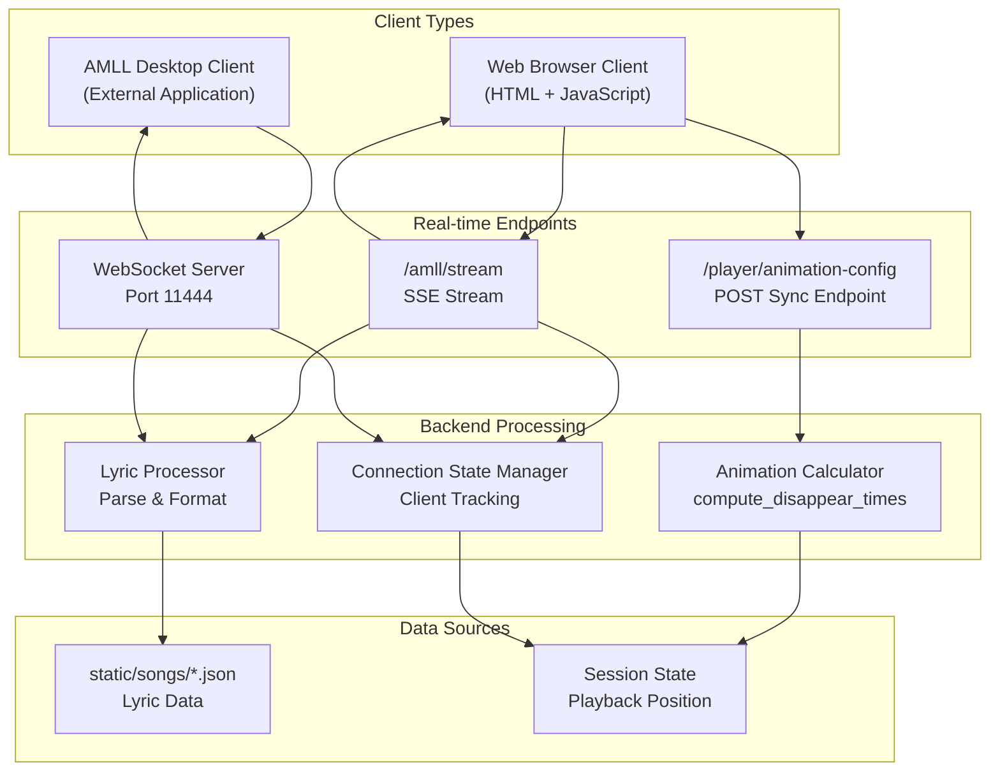

# Real-time Communication

> **Relevant source files**
> * [CLAUDE.md](https://github.com/HKLHaoBin/LyricSphere/blob/7864cfe0/CLAUDE.md)
> * [LICENSE](https://github.com/HKLHaoBin/LyricSphere/blob/7864cfe0/LICENSE)
> * [README.md](https://github.com/HKLHaoBin/LyricSphere/blob/7864cfe0/README.md)
> * [backend.py](https://github.com/HKLHaoBin/LyricSphere/blob/7864cfe0/backend.py)

## Purpose and Scope

This document describes LyricSphere's real-time communication infrastructure, which enables synchronized lyric display across multiple client types. The system implements two complementary protocols: **WebSocket** for bidirectional communication with AMLL clients, and **Server-Sent Events (SSE)** for unidirectional streaming to web browsers. Together, these mechanisms support live lyric updates, animation synchronization, and playback state management.

For information about the player interfaces that consume these real-time streams, see [Player UIs](/HKLHaoBin/LyricSphere/3.6-player-uis). For details on lyric format processing before streaming, see [Format Conversion Pipeline](/HKLHaoBin/LyricSphere/2.3-format-conversion-pipeline).

---

## System Architecture Overview

LyricSphere's real-time communication layer operates on two parallel channels, each optimized for different client types and communication patterns. The architecture separates concerns between interactive control (WebSocket) and data streaming (SSE), while maintaining a unified animation configuration system.

### Dual-Channel Architecture



**Sources:** [backend.py L1-L47](https://github.com/HKLHaoBin/LyricSphere/blob/7864cfe0/backend.py#L1-L47)

 [backend.py L44-L46](https://github.com/HKLHaoBin/LyricSphere/blob/7864cfe0/backend.py#L44-L46)

### Communication Protocol Comparison

| Aspect | WebSocket (Port 11444) | SSE (/amll/stream) |
| --- | --- | --- |
| **Direction** | Full-duplex (bidirectional) | Unidirectional (server → client) |
| **Transport** | TCP with WebSocket protocol | HTTP with streaming response |
| **Client Type** | AMLL desktop application | Web browsers |
| **Message Format** | JSON objects with `type` and `data` | Text lines with `data:` prefix |
| **Use Cases** | Interactive control, state sync | Lyric streaming, progress updates |
| **Connection Management** | Explicit open/close | HTTP keep-alive with reconnection |
| **Latency** | Very low (persistent connection) | Low (long-lived HTTP) |
| **Browser Support** | Requires explicit library | Native browser API |
| **Complexity** | Higher (custom protocol) | Lower (HTTP-based) |

**Sources:** [backend.py L44-L46](https://github.com/HKLHaoBin/LyricSphere/blob/7864cfe0/backend.py#L44-L46)

---

## WebSocket Server Implementation

The WebSocket server runs on **port 11444** as a separate async service alongside the main HTTP server. It provides bidirectional communication with AMLL (Advanced Music Live Lyrics) clients, supporting real-time lyric rule delivery and playback synchronization.

### Server Lifecycle and Connection Management

```mermaid
sequenceDiagram
  participant AMLL Client
  participant WebSocket Server
  participant :11444
  participant Message Handler
  participant Songs Database

  note over WebSocket Server,:11444: Server starts on port 11444
  AMLL Client->>WebSocket Server: WebSocket Connect
  WebSocket Server->>Message Handler: Register Client
  Message Handler->>Message Handler: Create Client State
  WebSocket Server-->>AMLL Client: Connection Accepted
  loop [Active Session]
    Message Handler->>Songs Database: Query Current Lyric
    Songs Database-->>Message Handler: Lyric Rule Data
    Message Handler->>Message Handler: Format as JSON Message
    Message Handler->>WebSocket Server: Send Message
    WebSocket Server-->>AMLL Client: {"type": "lyric_rule", "data": {...}}
    AMLL Client->>WebSocket Server: Client Command (optional)
    WebSocket Server->>Message Handler: Process Command
    Message Handler->>Message Handler: Update State
    AMLL Client->>WebSocket Server: Close Connection
    WebSocket Server->>Message Handler: Unregister Client
    Message Handler->>Message Handler: Cleanup State
    WebSocket Server->>WebSocket Server: Detect Connection Loss
    WebSocket Server->>Message Handler: Unregister Client
    Message Handler->>Message Handler: Cleanup State
  end
```

**Sources:** [backend.py L44-L46](https://github.com/HKLHaoBin/LyricSphere/blob/7864cfe0/backend.py#L44-L46)

### Message Format Specification

#### Outbound Messages (Server → AMLL)

WebSocket messages sent to AMLL clients follow a consistent JSON structure:

```json
{
  "type": "lyric_rule",
  "data": {
    "lyricRule": "...",
    "timestamp": 1234567890,
    "duration": 5000,
    "metadata": {
      "songId": "song_123",
      "lineIndex": 42
    }
  }
}
```

**Message Types:**

* `lyric_rule`: Contains AMLL-formatted lyric data for rendering
* `sync_state`: Playback position synchronization
* `control`: Playback control commands (play, pause, seek)
* `error`: Error notifications

#### Inbound Messages (AMLL → Server)

```json
{
  "type": "state_update",
  "data": {
    "currentTime": 12345,
    "playing": true,
    "songId": "song_123"
  }
}
```

**Sources:** [backend.py L44-L46](https://github.com/HKLHaoBin/LyricSphere/blob/7864cfe0/backend.py#L44-L46)

### Connection State Management

The WebSocket server maintains per-client state for tracking playback position, subscription preferences, and active sessions. Connection management includes:

* **Client Registration**: Each WebSocket connection is assigned a unique identifier
* **Heartbeat Mechanism**: Periodic ping/pong frames detect stale connections
* **Reconnection Handling**: Clients can resume sessions with state preservation
* **Resource Cleanup**: Automatic cleanup on disconnect prevents memory leaks

**Sources:** [backend.py L44-L46](https://github.com/HKLHaoBin/LyricSphere/blob/7864cfe0/backend.py#L44-L46)

---

## Server-Sent Events (SSE) Implementation

The SSE endpoint at `/amll/stream` provides a unidirectional streaming channel for web browser clients. Unlike WebSocket, SSE leverages standard HTTP with a persistent connection, making it ideal for scenarios where only the server needs to push data.

### SSE Stream Lifecycle

```mermaid
sequenceDiagram
  participant Web Browser
  participant /amll/stream Route
  participant StreamingResponse
  participant Event Generator
  participant Lyric Processor

  Web Browser->>/amll/stream Route: GET /amll/stream
  /amll/stream Route->>/amll/stream Route: Validate Request
  /amll/stream Route->>Event Generator: Initialize Generator
  Event Generator->>StreamingResponse: Create StreamingResponse
  StreamingResponse-->>Web Browser: 200 OK
  note over Web Browser,StreamingResponse: Connection Established
  loop [Active Streaming]
    Lyric Processor->>Lyric Processor: Content-Type: text/event-stream
    Lyric Processor->>Event Generator: Parse Lyric Line
    Event Generator->>Event Generator: Yield Lyric Event
    Event Generator->>StreamingResponse: Format as SSE
    StreamingResponse-->>Web Browser: "data: {...}
    Web Browser->>Web Browser: ​
    note over Event Generator: Wait for next line
    Web Browser->>StreamingResponse: "
    StreamingResponse->>Event Generator: SSE Event
    Event Generator->>Event Generator: Update Lyric Display
    Lyric Processor->>Event Generator: Close Connection
    Event Generator->>StreamingResponse: Stop Generation
    StreamingResponse-->>Web Browser: Cleanup Resources
    Web Browser->>Web Browser: Exception
  end
```

**Sources:** [backend.py L29](https://github.com/HKLHaoBin/LyricSphere/blob/7864cfe0/backend.py#L29-L29)

### SSE Message Format

SSE messages follow the W3C EventSource specification, with each event consisting of one or more lines prefixed with field names:

```yaml
data: {"type":"lyric_line","content":"歌词内容","start":1234,"end":5678}

data: {"type":"translation","content":"Translation text","start":1234}

event: progress
data: {"currentTime":2500,"totalDuration":180000}
```

**Field Types:**

* `data:` - Message payload (typically JSON)
* `event:` - Event type identifier (optional, defaults to "message")
* `id:` - Event identifier for reconnection (optional)
* `retry:` - Reconnection interval in milliseconds (optional)

**Sources:** [backend.py L29](https://github.com/HKLHaoBin/LyricSphere/blob/7864cfe0/backend.py#L29-L29)

### Streaming Implementation with Starlette

The SSE stream is implemented using Starlette's `StreamingResponse`, which allows for efficient async streaming without blocking the server:

```python
async def event_generator():
    # Generator yields SSE-formatted strings
    while condition:
        lyric_data = await get_next_lyric()
        yield f"data: {json.dumps(lyric_data)}\n\n"
        await asyncio.sleep(interval)

# Route returns StreamingResponse
return StreamingResponse(
    event_generator(),
    media_type="text/event-stream",
    headers={
        "Cache-Control": "no-cache",
        "X-Accel-Buffering": "no"
    }
)
```

**Key Implementation Details:**

* **Async Generators**: Use `async def` generators for non-blocking I/O
* **Cache Control**: Headers prevent proxy caching of the stream
* **Buffering**: Disabled via `X-Accel-Buffering` for immediate delivery
* **Keep-Alive**: Periodic comment lines (`:keep-alive\n\n`) maintain connection

**Sources:** [backend.py L29](https://github.com/HKLHaoBin/LyricSphere/blob/7864cfe0/backend.py#L29-L29)

---

## Animation Configuration Synchronization

The `/player/animation-config` endpoint serves as a synchronization point between frontend-reported animation parameters and backend calculations. This ensures consistent timing across all animation systems.

### Configuration Sync Flow

```mermaid
sequenceDiagram
  participant Frontend Player
  participant /player/animation-config
  participant Animation Calculator
  participant Session Storage

  note over Frontend Player: Page Load / Config Change
  Frontend Player->>/player/animation-config: POST /player/animation-config
  /player/animation-config->>/player/animation-config: {entryDuration: 600, moveDuration: 600, exitDuration: 600}
  /player/animation-config->>Animation Calculator: Validate Parameters
  Animation Calculator->>Animation Calculator: Update Global Config
  /player/animation-config->>Session Storage: Set Default Durations
  /player/animation-config-->>Frontend Player: entryDuration = 600ms
  note over Frontend Player,Animation Calculator: Synchronized State
  Frontend Player->>Frontend Player: moveDuration = 600ms
  Frontend Player->>Frontend Player: exitDuration = 600ms
  Frontend Player->>Frontend Player: Store useComputedDisappear Flag
  Animation Calculator->>Animation Calculator: 200 OK
  Animation Calculator->>Frontend Player: {status: "synchronized"}
  Frontend Player->>Frontend Player: Render Lyric Line
```

**Sources:** Based on architecture diagram 4 description

### Configuration Parameters

| Parameter | Type | Default | Description |
| --- | --- | --- | --- |
| `entryDuration` | `number` | 600 | Duration in milliseconds for lyric entry animation |
| `moveDuration` | `number` | 600 | Duration in milliseconds for lyric movement animation |
| `exitDuration` | `number` | 600 | Duration in milliseconds for lyric exit animation |
| `useComputedDisappear` | `boolean` | `true` | Enable backend-calculated disappear times |

The default value of **600ms** provides a balance between smooth animation and responsive feel. The `useComputedDisappear` flag allows switching between backend-calculated disappear times (production mode) and manual control (debugging mode).

**Sources:** Based on architecture diagram 4 description

### Backend Animation Calculation

When `useComputedDisappear` is enabled, the backend's `compute_disappear_times` function calculates optimal exit timestamps for each lyric line based on:

1. **Line Duration**: Time between current line start and next line start
2. **Exit Duration**: Configured exit animation duration (default 600ms)
3. **Overlap Prevention**: Ensures exit completes before next line entry
4. **Edge Cases**: Special handling for final lines and rapid sequences

**Calculation Algorithm:**

```
disappear_time = min(
    next_line_start - entryDuration,
    current_line_end,
    current_line_start + max_display_duration
)
```

**Sources:** Based on architecture diagram 4 description

---

## Connection Management and Error Handling

Both WebSocket and SSE implementations include robust connection management to handle network instability, client disconnections, and server errors.

### Connection Lifecycle States

```css
#mermaid-11x3xsi52u1{font-family:ui-sans-serif,-apple-system,system-ui,Segoe UI,Helvetica;font-size:16px;fill:#333;}@keyframes edge-animation-frame{from{stroke-dashoffset:0;}}@keyframes dash{to{stroke-dashoffset:0;}}#mermaid-11x3xsi52u1 .edge-animation-slow{stroke-dasharray:9,5!important;stroke-dashoffset:900;animation:dash 50s linear infinite;stroke-linecap:round;}#mermaid-11x3xsi52u1 .edge-animation-fast{stroke-dasharray:9,5!important;stroke-dashoffset:900;animation:dash 20s linear infinite;stroke-linecap:round;}#mermaid-11x3xsi52u1 .error-icon{fill:#dddddd;}#mermaid-11x3xsi52u1 .error-text{fill:#222222;stroke:#222222;}#mermaid-11x3xsi52u1 .edge-thickness-normal{stroke-width:1px;}#mermaid-11x3xsi52u1 .edge-thickness-thick{stroke-width:3.5px;}#mermaid-11x3xsi52u1 .edge-pattern-solid{stroke-dasharray:0;}#mermaid-11x3xsi52u1 .edge-thickness-invisible{stroke-width:0;fill:none;}#mermaid-11x3xsi52u1 .edge-pattern-dashed{stroke-dasharray:3;}#mermaid-11x3xsi52u1 .edge-pattern-dotted{stroke-dasharray:2;}#mermaid-11x3xsi52u1 .marker{fill:#999;stroke:#999;}#mermaid-11x3xsi52u1 .marker.cross{stroke:#999;}#mermaid-11x3xsi52u1 svg{font-family:ui-sans-serif,-apple-system,system-ui,Segoe UI,Helvetica;font-size:16px;}#mermaid-11x3xsi52u1 p{margin:0;}#mermaid-11x3xsi52u1 defs #statediagram-barbEnd{fill:#999;stroke:#999;}#mermaid-11x3xsi52u1 g.stateGroup text{fill:#dddddd;stroke:none;font-size:10px;}#mermaid-11x3xsi52u1 g.stateGroup text{fill:#333;stroke:none;font-size:10px;}#mermaid-11x3xsi52u1 g.stateGroup .state-title{font-weight:bolder;fill:#333;}#mermaid-11x3xsi52u1 g.stateGroup rect{fill:#ffffff;stroke:#dddddd;}#mermaid-11x3xsi52u1 g.stateGroup line{stroke:#999;stroke-width:1;}#mermaid-11x3xsi52u1 .transition{stroke:#999;stroke-width:1;fill:none;}#mermaid-11x3xsi52u1 .stateGroup .composit{fill:#f4f4f4;border-bottom:1px;}#mermaid-11x3xsi52u1 .stateGroup .alt-composit{fill:#e0e0e0;border-bottom:1px;}#mermaid-11x3xsi52u1 .state-note{stroke:#e6d280;fill:#fff5ad;}#mermaid-11x3xsi52u1 .state-note text{fill:#333;stroke:none;font-size:10px;}#mermaid-11x3xsi52u1 .stateLabel .box{stroke:none;stroke-width:0;fill:#ffffff;opacity:0.5;}#mermaid-11x3xsi52u1 .edgeLabel .label rect{fill:#ffffff;opacity:0.5;}#mermaid-11x3xsi52u1 .edgeLabel{background-color:#ffffff;text-align:center;}#mermaid-11x3xsi52u1 .edgeLabel p{background-color:#ffffff;}#mermaid-11x3xsi52u1 .edgeLabel rect{opacity:0.5;background-color:#ffffff;fill:#ffffff;}#mermaid-11x3xsi52u1 .edgeLabel .label text{fill:#333;}#mermaid-11x3xsi52u1 .label div .edgeLabel{color:#333;}#mermaid-11x3xsi52u1 .stateLabel text{fill:#333;font-size:10px;font-weight:bold;}#mermaid-11x3xsi52u1 .node circle.state-start{fill:#999;stroke:#999;}#mermaid-11x3xsi52u1 .node .fork-join{fill:#999;stroke:#999;}#mermaid-11x3xsi52u1 .node circle.state-end{fill:#dddddd;stroke:#f4f4f4;stroke-width:1.5;}#mermaid-11x3xsi52u1 .end-state-inner{fill:#f4f4f4;stroke-width:1.5;}#mermaid-11x3xsi52u1 .node rect{fill:#ffffff;stroke:#dddddd;stroke-width:1px;}#mermaid-11x3xsi52u1 .node polygon{fill:#ffffff;stroke:#dddddd;stroke-width:1px;}#mermaid-11x3xsi52u1 #statediagram-barbEnd{fill:#999;}#mermaid-11x3xsi52u1 .statediagram-cluster rect{fill:#ffffff;stroke:#dddddd;stroke-width:1px;}#mermaid-11x3xsi52u1 .cluster-label,#mermaid-11x3xsi52u1 .nodeLabel{color:#333;}#mermaid-11x3xsi52u1 .statediagram-cluster rect.outer{rx:5px;ry:5px;}#mermaid-11x3xsi52u1 .statediagram-state .divider{stroke:#dddddd;}#mermaid-11x3xsi52u1 .statediagram-state .title-state{rx:5px;ry:5px;}#mermaid-11x3xsi52u1 .statediagram-cluster.statediagram-cluster .inner{fill:#f4f4f4;}#mermaid-11x3xsi52u1 .statediagram-cluster.statediagram-cluster-alt .inner{fill:#f8f8f8;}#mermaid-11x3xsi52u1 .statediagram-cluster .inner{rx:0;ry:0;}#mermaid-11x3xsi52u1 .statediagram-state rect.basic{rx:5px;ry:5px;}#mermaid-11x3xsi52u1 .statediagram-state rect.divider{stroke-dasharray:10,10;fill:#f8f8f8;}#mermaid-11x3xsi52u1 .note-edge{stroke-dasharray:5;}#mermaid-11x3xsi52u1 .statediagram-note rect{fill:#fff5ad;stroke:#e6d280;stroke-width:1px;rx:0;ry:0;}#mermaid-11x3xsi52u1 .statediagram-note rect{fill:#fff5ad;stroke:#e6d280;stroke-width:1px;rx:0;ry:0;}#mermaid-11x3xsi52u1 .statediagram-note text{fill:#333;}#mermaid-11x3xsi52u1 .statediagram-note .nodeLabel{color:#333;}#mermaid-11x3xsi52u1 .statediagram .edgeLabel{color:red;}#mermaid-11x3xsi52u1 #dependencyStart,#mermaid-11x3xsi52u1 #dependencyEnd{fill:#999;stroke:#999;stroke-width:1;}#mermaid-11x3xsi52u1 .statediagramTitleText{text-anchor:middle;font-size:18px;fill:#333;}#mermaid-11x3xsi52u1 :root{--mermaid-font-family:"trebuchet ms",verdana,arial,sans-serif;}Client InitiatesHandshake SuccessHandshake ErrorFirst Message SentNormal OperationClient Close RequestServer ShutdownNetwork ErrorTimeoutCleanup CompleteRetry LogicNew AttemptMax Retries ExceededConnectingConnectedFailedActiveDisconnectingLostClosedReconnecting
```

**Sources:** [backend.py L44-L46](https://github.com/HKLHaoBin/LyricSphere/blob/7864cfe0/backend.py#L44-L46)

### Heartbeat and Timeout Detection

**WebSocket Heartbeat:**

* **Mechanism**: WebSocket ping/pong frames (protocol-level)
* **Interval**: 30 seconds (configurable)
* **Timeout**: 60 seconds without pong response
* **Action**: Automatic connection cleanup and client unregistration

**SSE Keep-Alive:**

* **Mechanism**: Comment lines (`: keep-alive\n\n`)
* **Interval**: 15 seconds
* **Purpose**: Prevent proxy timeouts and detect broken connections
* **Browser Behavior**: Automatic reconnection with `Last-Event-ID` header

**Sources:** [backend.py L44-L46](https://github.com/HKLHaoBin/LyricSphere/blob/7864cfe0/backend.py#L44-L46)

### Error Handling Strategies

#### WebSocket Error Handling

```python
# Pseudo-code representation
async def websocket_handler(websocket):
    try:
        await register_client(websocket)
        async for message in websocket:
            try:
                await process_message(message)
            except ValidationError as e:
                await send_error(websocket, "Invalid message format")
            except Exception as e:
                logger.error(f"Message processing error: {e}")
    except websockets.ConnectionClosed:
        logger.info("Client disconnected normally")
    except Exception as e:
        logger.error(f"WebSocket error: {e}")
    finally:
        await unregister_client(websocket)
```

**Error Types:**

* `ValidationError`: Malformed message format
* `ConnectionClosed`: Normal or abnormal disconnect
* `TimeoutError`: Response timeout
* `ProtocolError`: WebSocket protocol violation

#### SSE Error Handling

```python
# Pseudo-code representation
async def sse_generator():
    try:
        while True:
            try:
                event = await get_next_event()
                yield format_sse(event)
            except asyncio.TimeoutError:
                yield ": keep-alive\n\n"
            except DataError as e:
                yield format_sse_error(e)
    except asyncio.CancelledError:
        logger.info("SSE stream cancelled by client")
    except Exception as e:
        logger.error(f"SSE generation error: {e}")
        yield format_sse_error(e)
```

**Error Recovery:**

* **Client-side Reconnection**: Browsers automatically reconnect SSE streams
* **Event Replay**: Use `id:` field to resume from last received event
* **Graceful Degradation**: Send error events instead of dropping connection

**Sources:** [backend.py L29](https://github.com/HKLHaoBin/LyricSphere/blob/7864cfe0/backend.py#L29-L29)

---

## Use Cases and Integration Points

### Lyric Animation Synchronization

Real-time communication enables synchronized lyric display across multiple devices:

1. **Browser Player**: Receives lyric lines via SSE, applies CSS animations with configured durations
2. **AMLL Desktop**: Receives AMLL rules via WebSocket, renders with native animation engine
3. **Mobile Devices**: Connect to SSE stream for responsive lyric display

**Data Flow:**

```
Song JSON → Lyric Processor → Format Converter → 
  ├─→ SSE Stream (Browser clients)
  └─→ WebSocket (AMLL clients)
```

**Sources:** Based on architecture diagrams

### Playback Progress Synchronization

The WebSocket channel allows bidirectional synchronization of playback state:

* **Position Updates**: AMLL reports current playback position to server
* **Control Commands**: Server can send play/pause/seek commands to AMLL
* **Multi-Device Sync**: Multiple clients can observe shared playback state

**Sources:** [backend.py L44-L46](https://github.com/HKLHaoBin/LyricSphere/blob/7864cfe0/backend.py#L44-L46)

### Translation Status Updates

During AI translation operations, progress updates stream to the UI via SSE:

```javascript
// Frontend pseudo-code
const eventSource = new EventSource('/amll/stream');
eventSource.addEventListener('translation_progress', (event) => {
    const data = JSON.parse(event.data);
    updateProgressBar(data.percentage);
    highlightProblematicLines(data.issues);
});
```

**Update Types:**

* `translation_progress`: Percentage completion
* `translation_stage`: Current processing stage (analysis, translation, validation)
* `translation_issue`: Detected problems requiring user attention

**Sources:** Based on architecture diagrams

---

## Performance and Scalability Considerations

### Connection Limits

| Resource | Limit | Rationale |
| --- | --- | --- |
| **Concurrent SSE Connections** | ~1000 per process | HTTP long-polling overhead |
| **WebSocket Connections** | ~5000 per process | Lower protocol overhead |
| **Message Queue Size** | 100 messages | Prevent memory exhaustion |
| **Heartbeat Interval** | 30 seconds (WS), 15 seconds (SSE) | Balance responsiveness and overhead |

**Sources:** [backend.py L885-L886](https://github.com/HKLHaoBin/LyricSphere/blob/7864cfe0/backend.py#L885-L886)

### Threading and Async Execution

LyricSphere uses a hybrid threading model:

* **Main Thread**: FastAPI/Starlette async event loop
* **Thread Pool**: Sync operations (file I/O, blocking calls) * **Size**: Configurable via `APP_THREADPOOL_WORKERS` (default: 16) * **Usage**: Background processing, AI API calls
* **WebSocket Thread**: Separate async event loop for WebSocket server

**Sources:** [backend.py L885-L886](https://github.com/HKLHaoBin/LyricSphere/blob/7864cfe0/backend.py#L885-L886)

### Message Queue Management

Both WebSocket and SSE implementations use internal queues to decouple message production from network I/O:

```markdown
# Conceptual queue management
message_queue = asyncio.Queue(maxsize=100)

# Producer (Lyric Processor)
await message_queue.put(lyric_event)

# Consumer (Network Handler)
event = await message_queue.get()
await send_to_client(event)
```

**Queue Behavior:**

* **Bounded Size**: Prevents unbounded memory growth
* **Backpressure**: Blocks producer when queue is full
* **Timeout**: Discard old messages if client is slow

**Sources:** [backend.py L46](https://github.com/HKLHaoBin/LyricSphere/blob/7864cfe0/backend.py#L46-L46)

---

## Security Considerations

### Connection Authentication

Real-time connections inherit authentication from the HTTP session:

* **Session Cookies**: SSE connections include cookies automatically
* **WebSocket Authentication**: Initial HTTP upgrade request validates session
* **Token Validation**: Optional bearer token support for stateless auth

**Sources:** [backend.py L1235-L1292](https://github.com/HKLHaoBin/LyricSphere/blob/7864cfe0/backend.py#L1235-L1292)

### CORS Policy

Cross-origin real-time connections follow the application's CORS configuration:

```markdown
# CORS headers for SSE
"Access-Control-Allow-Origin": origin
"Access-Control-Allow-Credentials": "true"

# WebSocket CORS handled during upgrade handshake
```

**Configuration:**

* `CORS_ALLOW_ORIGINS`: Comma-separated list or `*` for all origins
* `CORS_ALLOW_HEADERS`: Allowed request headers
* `CORS_ALLOW_METHODS`: Allowed HTTP methods

**Sources:** [backend.py L1215-L1222](https://github.com/HKLHaoBin/LyricSphere/blob/7864cfe0/backend.py#L1215-L1222)

 [backend.py L1235-L1292](https://github.com/HKLHaoBin/LyricSphere/blob/7864cfe0/backend.py#L1235-L1292)

### Rate Limiting and Abuse Prevention

To prevent resource exhaustion:

* **Connection Throttling**: Limit connections per IP address
* **Message Rate Limiting**: Restrict message frequency from clients
* **Bandwidth Monitoring**: Track data transfer per connection
* **Automatic Disconnection**: Drop abusive connections

**Sources:** [backend.py L1235-L1292](https://github.com/HKLHaoBin/LyricSphere/blob/7864cfe0/backend.py#L1235-L1292)

---

## Debugging and Monitoring

### Logging

Real-time communication events are logged for debugging and monitoring:

```css
# WebSocket events
logger.info(f"WebSocket client connected: {client_id}")
logger.debug(f"Sending message to {client_id}: {message_type}")
logger.warning(f"Client {client_id} timeout, disconnecting")

# SSE events  
logger.info(f"SSE stream started for session {session_id}")
logger.debug(f"Streaming lyric line {line_index}")
logger.error(f"SSE generation error: {error}")
```

**Log Levels:**

* **INFO**: Connection lifecycle events
* **DEBUG**: Individual message/event details
* **WARNING**: Timeouts, recoverable errors
* **ERROR**: Unrecoverable errors, exceptions

**Sources:** [backend.py L783](https://github.com/HKLHaoBin/LyricSphere/blob/7864cfe0/backend.py#L783-L783)

### Metrics and Observability

Key metrics for monitoring real-time communication health:

* **Active Connections**: Current count of SSE and WebSocket connections
* **Message Throughput**: Messages sent per second
* **Latency**: Time from event generation to client delivery
* **Error Rate**: Failed message deliveries per minute
* **Reconnection Rate**: Client reconnection frequency

**Sources:** [backend.py L783](https://github.com/HKLHaoBin/LyricSphere/blob/7864cfe0/backend.py#L783-L783)

 [backend.py L885-L886](https://github.com/HKLHaoBin/LyricSphere/blob/7864cfe0/backend.py#L885-L886)

---

## Summary

LyricSphere's real-time communication system provides a robust, dual-protocol infrastructure for synchronized lyric delivery. The WebSocket server (port 11444) handles bidirectional communication with AMLL clients, while the SSE endpoint (/amll/stream) streams lyric updates to web browsers. Both channels integrate with the animation configuration system to ensure consistent timing across all clients. Connection management, error handling, and security policies ensure reliable operation in production environments.

**Sources:** [backend.py L1-L47](https://github.com/HKLHaoBin/LyricSphere/blob/7864cfe0/backend.py#L1-L47)

 [backend.py L29](https://github.com/HKLHaoBin/LyricSphere/blob/7864cfe0/backend.py#L29-L29)

 [backend.py L44-L46](https://github.com/HKLHaoBin/LyricSphere/blob/7864cfe0/backend.py#L44-L46)

 [backend.py L783](https://github.com/HKLHaoBin/LyricSphere/blob/7864cfe0/backend.py#L783-L783)

 [backend.py L885-L886](https://github.com/HKLHaoBin/LyricSphere/blob/7864cfe0/backend.py#L885-L886)

 [backend.py L1215-L1292](https://github.com/HKLHaoBin/LyricSphere/blob/7864cfe0/backend.py#L1215-L1292)