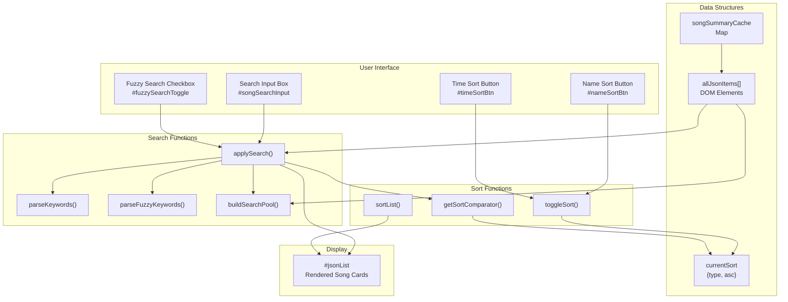
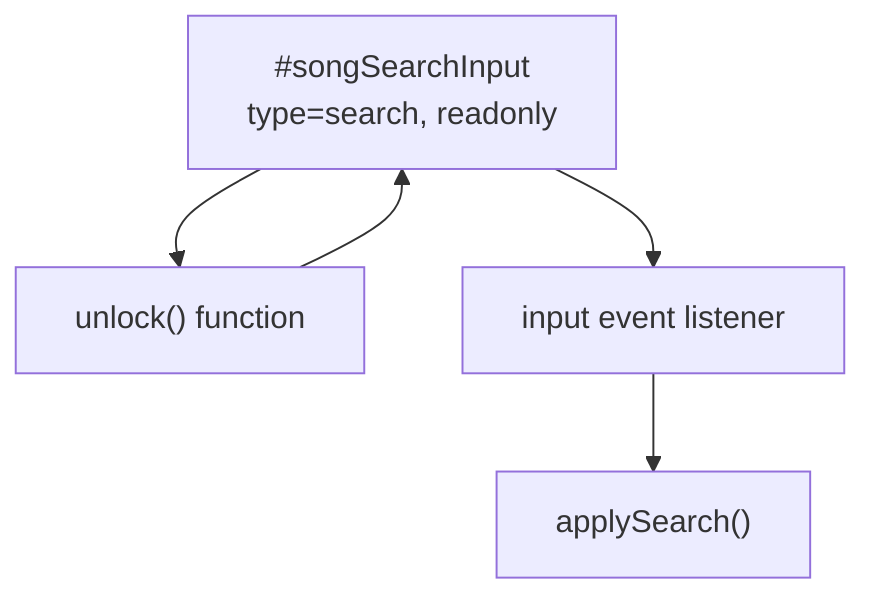
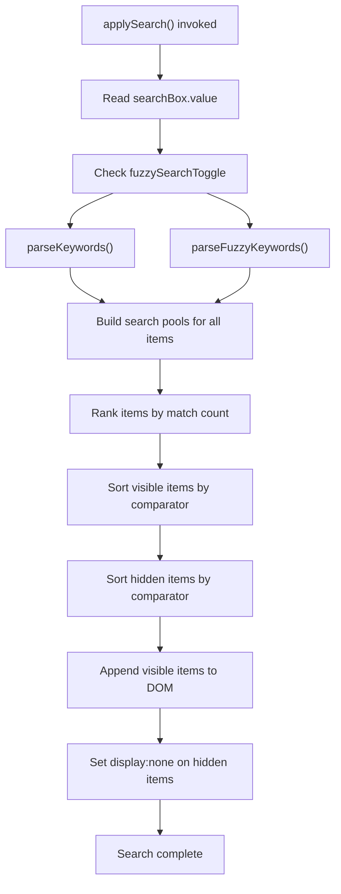
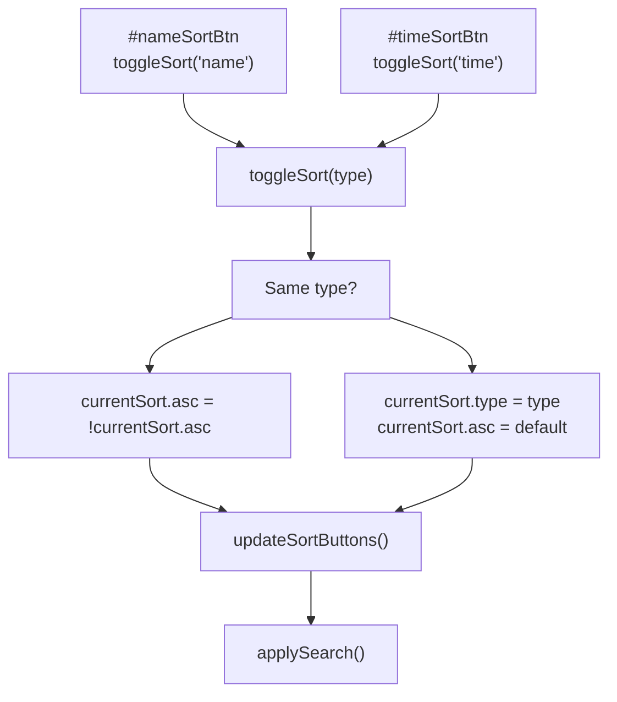
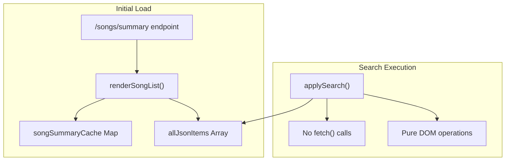
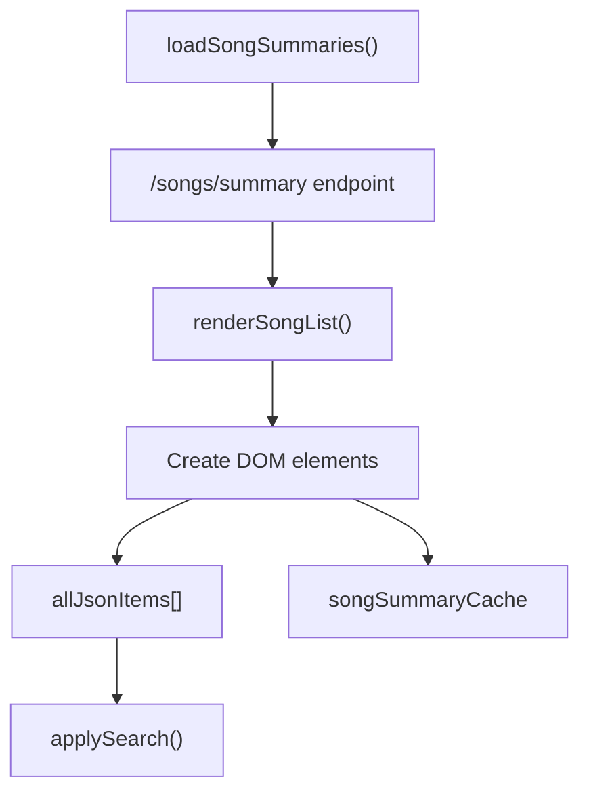
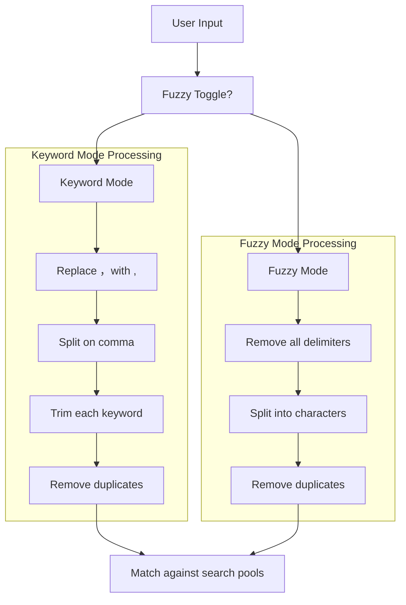

# Search and Filtering

> **Relevant source files**
> * [templates/LyricSphere.html](https://github.com/HKLHaoBin/LyricSphere/blob/7864cfe0/templates/LyricSphere.html)

## Purpose and Scope

This document describes the search and filtering system in LyricSphere's main dashboard interface. The system provides real-time search capabilities with two distinct modes (keyword and fuzzy), multi-criteria filtering, and flexible sorting options. Users can quickly locate songs from their library by searching through song names, artist information, and metadata tags.

For information about searching external lyric databases, see the LDDC Integration section in [3.1](/HKLHaoBin/LyricSphere/3.1-main-dashboard-(lyricsphere.html)). For details on the main dashboard UI, see [3.1](/HKLHaoBin/LyricSphere/3.1-main-dashboard-(lyricsphere.html)).

---

## System Architecture

The search and filtering system operates entirely client-side using JavaScript, processing song metadata loaded from the backend's `/songs/summary` endpoint. All search operations execute in real-time without requiring server round-trips.



**Sources:** [templates/LyricSphere.html:2436-2450], [templates/LyricSphere.html:3076-3134], [templates/LyricSphere.html:3136-3139]

---

## Search Input Components

### Search Box

The primary search input is a text field with autocomplete disabled to prevent browser interference. The field starts in readonly mode and unlocks on first interaction to prevent unwanted autofill behavior.



**Implementation Details:**

* HTML: [templates/LyricSphere.html:1527-1531]
* Unlock logic: [templates/LyricSphere.html:2439-2446]
* Event binding: [templates/LyricSphere.html:3136]

### Fuzzy Search Toggle

A checkbox control enables switching between keyword and fuzzy search modes. Changes to this toggle immediately re-execute the search without requiring re-entry of search terms.

**Implementation:** [templates/LyricSphere.html:1534-1536], [templates/LyricSphere.html:3137-3139]

**Sources:** [templates/LyricSphere.html:1527-1537], [templates/LyricSphere.html:2439-2446], [templates/LyricSphere.html:3136-3139]

---

## Search Modes

### Keyword Search Mode

In keyword search mode (fuzzy toggle OFF), the system interprets input as comma-separated keywords. Each keyword is matched against song metadata independently.

#### Keyword Parsing

The `parseKeywords()` function normalizes input by converting full-width commas (，) to ASCII commas, then splits on commas:

```javascript
// Simplified flow from parseKeywords()
normalized = rawText.replace(/，/g, ',')
keywords = normalized.split(',')
           .map(keyword => keyword.trim())
           .filter(Boolean)
return Array.from(new Set(keywords))  // Deduplicate
```

**Implementation:** [templates/LyricSphere.html:2467-2471]

#### Matching Logic

Each keyword is checked for substring presence (case-insensitive) in the search pool. Songs are ranked by the number of keyword matches:

| Match Count | Display Behavior |
| --- | --- |
| All keywords match | Displayed first, sorted by current sort setting |
| Partial match | Displayed in rank order, then by sort setting |
| Zero matches | Hidden (`display: none`) |

### Fuzzy Search Mode

In fuzzy search mode (fuzzy toggle ON), the entire input string is decomposed into individual characters, and each character is matched independently.

#### Fuzzy Parsing

The `parseFuzzyKeywords()` function removes all delimiters and splits input into individual characters:

```python
// Simplified flow from parseFuzzyKeywords()
normalized = rawText.replace(/[,，\s\-_]+/g, '')
keywords = Array.from(normalized).filter(Boolean)
return Array.from(new Set(keywords))  // Deduplicate
```

**Implementation:** [templates/LyricSphere.html:2473-2477]

#### Use Cases

Fuzzy search excels when:

* Searching with partial/incomplete information
* Matching songs with non-English characters
* Ignoring word boundaries and delimiters

**Example:** Input `周杰伦` matches "周杰伦 - 晴天.json", "周杰伦_青花瓷.json", even "周星驰-杰作-伦敦.json" (matches all three characters)

**Sources:** [templates/LyricSphere.html:2467-2477], [templates/LyricSphere.html:3076-3134]

---

## Search Pool Construction

The `buildSearchPool()` function creates searchable text from each song card by concatenating:

1. **File name** from `.file-name` element
2. **Metadata tags** from `.song-tags` element (e.g., "包含对唱歌词", "纯音乐")

All text is converted to lowercase for case-insensitive matching.

```

```

**Implementation:** [templates/LyricSphere.html:3070-3074]

**Sources:** [templates/LyricSphere.html:3070-3074]

---

## Filtering Implementation

### Core Search Function

The `applySearch()` function is the central coordinator for all search and filter operations. It executes these steps:



**Implementation:** [templates/LyricSphere.html:3076-3134]

### Match Ranking

Items are ranked by their match count, which is the number of keywords found in the search pool:

```javascript
// Simplified from applySearch()
const rankedItems = listItems.map(item => {
    const searchPool = buildSearchPool(item)
    const matchCount = keywords.reduce(
        (count, keyword) => searchPool.includes(keyword) ? count + 1 : count, 
        0
    )
    return { item, matchCount }
})
```

**Ranking Table:**

| Match Count | Behavior |
| --- | --- |
| > 0 | Item is visible, higher match count = higher rank |
| 0 | Item is hidden |

Within each match count tier, items are sorted according to the active sort setting (name or time).

**Sources:** [templates/LyricSphere.html:3076-3134]

---

## Sorting System

### Sort State Management

The sort state is stored in the `currentSort` object:

```
// Default state: [templates/LyricSphere.html:3150]
currentSort = { type: 'time', asc: false }  // Time descending (newest first)
```

| Property | Values | Description |
| --- | --- | --- |
| `type` | `'name'`, `'time'` | Sort criterion |
| `asc` | `true`, `false` | Sort direction (ascending/descending) |

### Sort Buttons

Two buttons control sorting:



**Implementation:** [templates/LyricSphere.html:3154-3163]

### Sort Comparators

The `getSortComparator()` function returns a comparison function based on current sort state:

```typescript
// Simplified from getSortComparator()
if (currentSort.type === 'name') {
    const textA = a.querySelector('.file-name').textContent.toLowerCase()
    const textB = b.querySelector('.file-name').textContent.toLowerCase()
    return currentSort.asc 
        ? textA.localeCompare(textB, 'zh-Hans-CN')
        : textB.localeCompare(textA, 'zh-Hans-CN')
}
// type === 'time'
const timeA = parseFloat(a.dataset.mtime)
const timeB = parseFloat(b.dataset.mtime)
return currentSort.asc ? timeA - timeB : timeB - timeA
```

**Key Features:**

* **Name sort:** Uses `localeCompare()` with Chinese locale for proper CJK character ordering
* **Time sort:** Compares numeric `mtime` (modification time) from `dataset.mtime` attribute
* **Direction:** Ascending or descending controlled by `currentSort.asc`

**Implementation:** [templates/LyricSphere.html:2453-2465]

**Sources:** [templates/LyricSphere.html:2453-2465], [templates/LyricSphere.html:3154-3171]

---

## Performance Optimizations

### Debouncing Strategy

The search system does NOT implement explicit debouncing. Instead, it relies on:

1. **Synchronous execution:** `applySearch()` completes in a single event loop tick
2. **DOM manipulation batching:** All visibility changes applied before browser repaint
3. **Event coalescing:** Browser naturally coalesces rapid input events

### Data Structure Efficiency



**Optimization Techniques:**

| Technique | Implementation | Benefit |
| --- | --- | --- |
| Cached DOM elements | `allJsonItems` array stores references | Avoids repeated `querySelectorAll()` |
| Map lookup | `songSummaryCache` for metadata | O(1) access vs O(n) array search |
| Lowercase pooling | Pre-lowercase in `buildSearchPool()` | One `.toLowerCase()` per item vs per keyword |
| Batch DOM updates | Remove all children, then append all | Minimizes reflows |
| No regex | Uses `includes()` for matching | Faster than regex compilation |

**Sources:** [templates/LyricSphere.html:3038-3049], [templates/LyricSphere.html:3076-3134]

---

## Real-time Search Flow

The complete flow from user input to display update:

```mermaid
sequenceDiagram
  participant User
  participant applySearch()
  participant parseKeywords/parseFuzzyKeywords
  participant buildSearchPool()
  participant getSortComparator()

  User->>User: Types search text
  applySearch()->>applySearch(): input event
  applySearch()->>applySearch(): Get value
  applySearch()->>parseKeywords/parseFuzzyKeywords: Parse keywords
  parseKeywords/parseFuzzyKeywords-->>applySearch(): keyword array
  loop [For each song item]
    applySearch()->>buildSearchPool(): Build search pool
    buildSearchPool()-->>applySearch(): searchable text
    applySearch()->>applySearch(): Count keyword matches
    applySearch()->>applySearch(): Separate visible/hidden
    applySearch()->>getSortComparator(): Get sort function
    getSortComparator()-->>applySearch(): comparator(a, b)
    applySearch()->>applySearch(): Sort visible items
    applySearch()->>applySearch(): Sort hidden items
    applySearch()->>getSortComparator(): Clear all children
    applySearch()->>getSortComparator(): Append item (display: '')
    applySearch()->>getSortComparator(): Append item (display: none)
  end
  getSortComparator()-->>User: Updated display
```

**Sources:** [templates/LyricSphere.html:3076-3134], [templates/LyricSphere.html:3136-3139]

---

## UI Layout and Responsiveness

### Desktop Layout (≥769px, landscape)

The search container is fixed at the top with all controls in a single horizontal row:

```sql
┌─────────────────────────────────────────────────────────────┐
│ [Search Input] [☑ Fuzzy] [A-Z↓] [Time] [Create] [...] [⚙]  │
└─────────────────────────────────────────────────────────────┘
```

**CSS Classes:**

* `.search-container` - Fixed positioning [templates/LyricSphere.html:445-459]
* `.search-tools` - Flex container with nowrap [templates/LyricSphere.html:1438-1457]

### Mobile Layout (<768px or portrait)

Controls are reorganized into a vertical stack with grid-based button groups:

```sql
┌─────────────────────┐
│  [Search Input]     │
│  [☑ Fuzzy Search]   │
├─────────────────────┤
│  [A-Z]  │  [Time]   │
├─────────────────────┤
│ [Create] │ [Import] │
├─────────────────────┤
│  ...more buttons... │
└─────────────────────┘
```

**Responsive CSS:** [templates/LyricSphere.html:1195-1351]

**Mobile-Specific Features:**

* Static positioning (not fixed)
* 2-column grid for buttons
* Dropdown menus repositioned to fixed bottom
* Increased touch target sizes

**Sources:** [templates/LyricSphere.html:445-459], [templates/LyricSphere.html:1195-1351], [templates/LyricSphere.html:1413-1461]

---

## Search Metadata

### Searchable Fields

The search pool includes content from these DOM elements:

| Element | Content | Example |
| --- | --- | --- |
| `.file-name` | Song title and filename | "周杰伦 - 晴天" |
| `.song-tag.instrumental-tag` | "纯音乐" | Instrumental marker |
| `.song-tag.no-audio-tag` | "无音源" | No audio file |
| `.song-tag.duet-tag` | "包含对唱歌词" | Duet lyrics present |
| `.song-tag.background-vocals-tag` | "包含背景歌词" | Background vocals |

**Tag Generation:** [templates/LyricSphere.html:2711-2728]

### Case Sensitivity

All searches are case-insensitive. The search pool is converted to lowercase before matching:

```
// From buildSearchPool()
return `${fileName} ${tagsText}`.toLowerCase()
```

**Implementation:** [templates/LyricSphere.html:3070-3074]

**Sources:** [templates/LyricSphere.html:2711-2728], [templates/LyricSphere.html:3070-3074]

---

## Integration Points

### Song List Loading

The search system operates on song items loaded by `loadSongSummaries()`, which fetches from `/songs/summary`:



**Implementation:** [templates/LyricSphere.html:3051-3068]

### Initial Sort State

On page load, the system applies default sorting (time descending) without search filters:

```sql
// From window DOMContentLoaded
updateSortButtons()       // Update button labels
loadSongSummaries()       // Fetch and render, triggers initial sort
```

**Implementation:** [templates/LyricSphere.html:3192-3196]

**Sources:** [templates/LyricSphere.html:3051-3068], [templates/LyricSphere.html:3192-3196]

---

## Keyword vs. Fuzzy Search Comparison



**Example Comparison:**

| Input | Keyword Mode Keywords | Fuzzy Mode Keywords |
| --- | --- | --- |
| `周杰伦,青花瓷` | `["周杰伦", "青花瓷"]` | `["周","杰","伦","青","花","瓷"]` |
| `Jay Chou, Blue` | `["jay chou", "blue"]` | `["j","a","y","c","h","o","u","b","l","e"]` |
| `晴天 - 周杰伦` | `["晴天 - 周杰伦"]` | `["晴","天","周","杰","伦"]` |

**Sources:** [templates/LyricSphere.html:2467-2477], [templates/LyricSphere.html:3076-3134]

---

## Error Handling

The search system is fault-tolerant:

1. **Empty search:** Returns all items in sorted order [templates/LyricSphere.html:3090-3099]
2. **No items:** Safely handles empty `allJsonItems` [templates/LyricSphere.html:3083-3088]
3. **Invalid DOM structure:** `querySelector()` returns null, text content becomes empty string
4. **NaN timestamps:** `parseFloat()` returns NaN, sorted to end via numeric comparison
5. **Missing elements:** Optional chaining not used, but checks prevent crashes

**Sources:** [templates/LyricSphere.html:3076-3134]