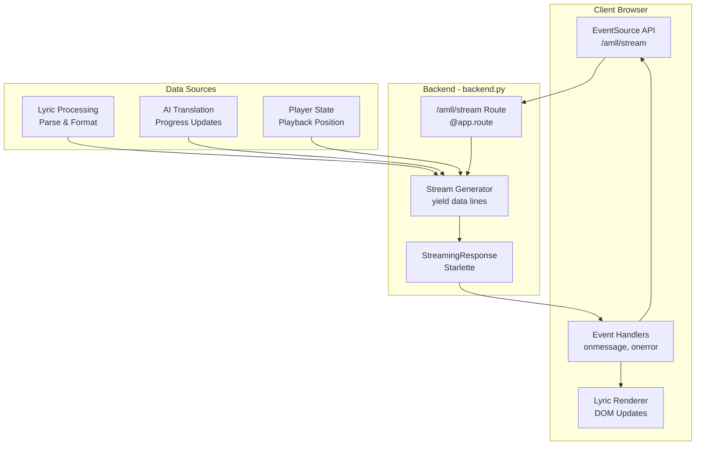
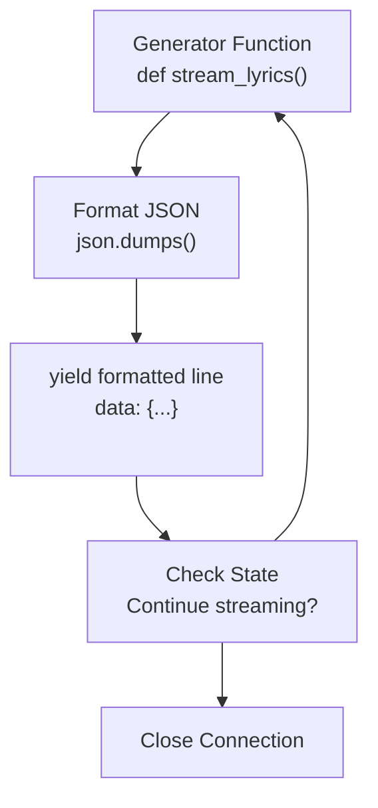
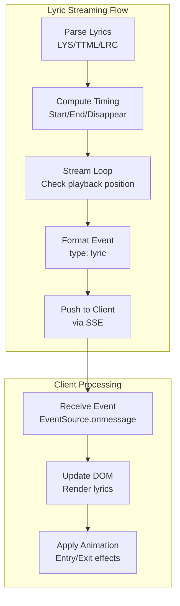
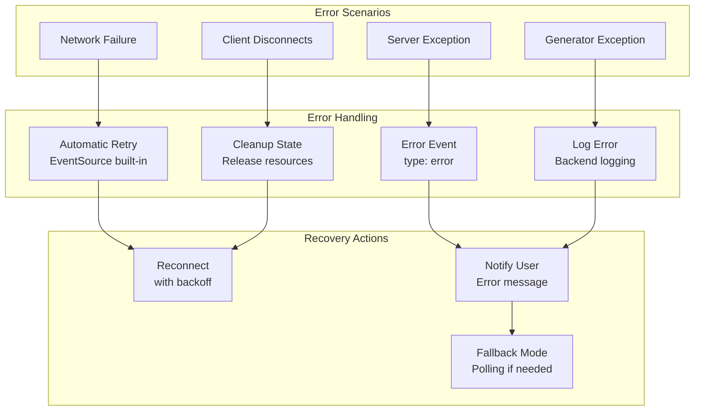
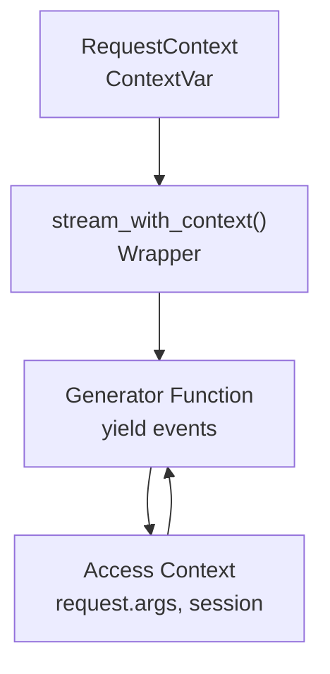

# Server-Sent Events (SSE)

> **Relevant source files**
> * [CLAUDE.md](https://github.com/HKLHaoBin/LyricSphere/blob/7864cfe0/CLAUDE.md)
> * [LICENSE](https://github.com/HKLHaoBin/LyricSphere/blob/7864cfe0/LICENSE)
> * [README.md](https://github.com/HKLHaoBin/LyricSphere/blob/7864cfe0/README.md)
> * [backend.py](https://github.com/HKLHaoBin/LyricSphere/blob/7864cfe0/backend.py)

## Purpose and Scope

This document describes the Server-Sent Events (SSE) implementation in LyricSphere, which provides unidirectional real-time data streaming from server to client for lyric updates and translation progress tracking. SSE is implemented through the `/amll/stream` endpoint and uses standard HTTP protocol to push data continuously to browser clients.

For bidirectional real-time communication with AMLL clients, see [WebSocket Server](/HKLHaoBin/LyricSphere/2.5.1-websocket-server). For information about animation synchronization, see [Real-time Communication](/HKLHaoBin/LyricSphere/2.5-real-time-communication).

## SSE Architecture Overview



**Diagram: SSE Architecture and Data Flow**

The SSE system provides a persistent HTTP connection through which the server continuously pushes formatted text events to the client. The browser's EventSource API automatically handles connection management and reconnection logic.

Sources: [backend.py L1-L50](https://github.com/HKLHaoBin/LyricSphere/blob/7864cfe0/backend.py#L1-L50)

 [backend.py L760-L863](https://github.com/HKLHaoBin/LyricSphere/blob/7864cfe0/backend.py#L760-L863)

## Core Components

### SSE Endpoint

The `/amll/stream` endpoint serves as the primary SSE interface, establishing a persistent HTTP connection with the `text/event-stream` content type.

| Component | Type | Purpose |
| --- | --- | --- |
| Route Path | `/amll/stream` | SSE endpoint URL |
| HTTP Method | GET | Long-lived connection |
| Content-Type | `text/event-stream` | SSE protocol header |
| Response Type | StreamingResponse | Continuous data stream |
| Connection Model | Persistent | Kept alive for streaming |

The endpoint leverages FastAPI's StreamingResponse (Starlette) to implement the SSE protocol, wrapping a generator function that yields formatted event data.

Sources: [backend.py L28-L29](https://github.com/HKLHaoBin/LyricSphere/blob/7864cfe0/backend.py#L28-L29)

 [backend.py L760-L812](https://github.com/HKLHaoBin/LyricSphere/blob/7864cfe0/backend.py#L760-L812)

### Message Format

SSE messages follow a simple text-based protocol with newline-delimited fields:

```
data: {"type": "lyric", "time": 120.5, "text": "Hello World", "translation": "你好世界"}

data: {"type": "status", "message": "Translation in progress", "progress": 0.45}

data: {"type": "error", "message": "Failed to load lyrics"}
```

Each message consists of:

* **Prefix**: `data:` field identifier
* **Payload**: JSON-encoded object with event data
* **Terminator**: Double newline (`\n\n`) to signal message boundary

**Event Type Structure:**

| Event Type | Fields | Purpose |
| --- | --- | --- |
| `lyric` | `time`, `text`, `translation`, `syllables` | Lyric line data with timing |
| `status` | `message`, `progress`, `stage` | Operation status updates |
| `error` | `message`, `code`, `details` | Error notifications |
| `ping` | `timestamp` | Keep-alive heartbeat |

Sources: [backend.py L28-L29](https://github.com/HKLHaoBin/LyricSphere/blob/7864cfe0/backend.py#L28-L29)

## Implementation Details

### StreamingResponse Generator



**Diagram: Generator Function Flow**

The streaming implementation uses Python generator functions that continuously yield formatted event lines. The generator maintains state and can respond to external signals to control the stream lifecycle.

**Key Implementation Patterns:**

1. **Generator Pattern**: Uses `yield` statements to produce data incrementally without buffering entire response
2. **Context Preservation**: Generator maintains request context using `stream_with_context()` wrapper
3. **Lazy Evaluation**: Data produced on-demand as client consumes stream
4. **Graceful Termination**: Generator exits cleanly when connection closes or condition met

Sources: [backend.py L558-L570](https://github.com/HKLHaoBin/LyricSphere/blob/7864cfe0/backend.py#L558-L570)

 [backend.py L760-L812](https://github.com/HKLHaoBin/LyricSphere/blob/7864cfe0/backend.py#L760-L812)

### Connection Management

```mermaid
sequenceDiagram
  participant Browser
  participant /amll/stream
  participant Generator
  participant Lyric Source

  Browser->>/amll/stream: GET /amll/stream
  /amll/stream->>/amll/stream: Set headers
  /amll/stream->>Generator: Content-Type: text/event-stream
  Generator->>Browser: Create generator instance
  loop [Streaming Loop]
    Lyric Source->>Generator: Initial connection established
    Generator->>Generator: New lyric data
    Generator->>Browser: Format as SSE message
    Browser->>Browser: data: {...}
    Browser->>Browser: ​
    Browser->>/amll/stream: ​
    /amll/stream->>Generator: Parse and handle event
    Browser->>Browser: Detect disconnect
    Browser->>/amll/stream: Auto-reconnect
    Generator->>Generator: Last-Event-ID header
  end
```

**Diagram: SSE Connection Lifecycle**

The EventSource API automatically manages connection lifecycle, including retry logic with exponential backoff and resumption from last received event.

**Connection Headers:**

| Header | Value | Purpose |
| --- | --- | --- |
| `Content-Type` | `text/event-stream` | Identifies SSE protocol |
| `Cache-Control` | `no-cache` | Prevents caching of stream |
| `Connection` | `keep-alive` | Maintains persistent connection |
| `X-Accel-Buffering` | `no` | Disables proxy buffering |

Sources: [backend.py L1235-L1291](https://github.com/HKLHaoBin/LyricSphere/blob/7864cfe0/backend.py#L1235-L1291)

## Client-Side Integration

### EventSource API Usage

```javascript
// Establish SSE connection
const eventSource = new EventSource('/amll/stream');

// Handle incoming messages
eventSource.onmessage = (event) => {
    const data = JSON.parse(event.data);
    console.log('Received:', data);
    
    if (data.type === 'lyric') {
        updateLyricDisplay(data.time, data.text, data.translation);
    } else if (data.type === 'status') {
        updateProgressIndicator(data.progress);
    }
};

// Handle connection open
eventSource.onopen = () => {
    console.log('SSE connection established');
};

// Handle errors and reconnection
eventSource.onerror = (error) => {
    console.error('SSE error:', error);
    // Browser automatically attempts reconnection
};

// Manually close connection when done
eventSource.close();
```

**EventSource Features:**

| Feature | Behavior | Benefit |
| --- | --- | --- |
| Automatic Reconnection | Retries with exponential backoff | Resilient to network issues |
| Last-Event-ID | Tracks last received event | Enables resumption from checkpoint |
| Event Multiplexing | Multiple listeners on same connection | Efficient resource usage |
| Browser Native | No additional libraries required | Simple integration |

Sources: [backend.py L28-L29](https://github.com/HKLHaoBin/LyricSphere/blob/7864cfe0/backend.py#L28-L29)

## Use Cases

### Real-Time Lyric Streaming

SSE streams synchronized lyric data during playback, pushing line-by-line updates as the song progresses.



**Diagram: Lyric Streaming Use Case**

**Lyric Event Structure:**

```json
{
    "type": "lyric",
    "time": 45.250,
    "endTime": 48.100,
    "disappearTime": 48.700,
    "text": "君の名は",
    "translation": "Your Name",
    "syllables": [
        {"text": "君", "start": 45.250, "duration": 0.400},
        {"text": "の", "start": 45.650, "duration": 0.200},
        {"text": "名", "start": 45.850, "duration": 0.300},
        {"text": "は", "start": 46.150, "duration": 0.250}
    ]
}
```

Sources: [backend.py L28-L29](https://github.com/HKLHaoBin/LyricSphere/blob/7864cfe0/backend.py#L28-L29)

### Translation Progress Updates

During AI-powered translation operations, SSE streams real-time progress information to provide user feedback.

```mermaid
sequenceDiagram
  participant Frontend
  participant /amll/stream
  participant /translate_lyrics
  participant AIProvider

  Frontend->>/amll/stream: Connect EventSource
  /amll/stream->>Frontend: Connection established
  Frontend->>/translate_lyrics: POST translation request
  /translate_lyrics->>AIProvider: Stream API call
  loop [Translation Progress]
    AIProvider->>/translate_lyrics: Chunk of translation
    /translate_lyrics->>/amll/stream: Push progress event
    /amll/stream->>Frontend: data: {"type": "status", ...}
    Frontend->>Frontend: Update progress bar
  end
  /translate_lyrics->>/amll/stream: Push completion event
  /amll/stream->>Frontend: data: {"type": "status", "progress": 1.0}
  Frontend->>Frontend: Display results
  Frontend->>/amll/stream: Close connection
```

**Diagram: Translation Progress Streaming**

**Progress Event Structure:**

```json
{
    "type": "status",
    "stage": "translating",
    "message": "Translating line 15 of 40",
    "progress": 0.375,
    "currentLine": 15,
    "totalLines": 40
}
```

Sources: [backend.py L28-L29](https://github.com/HKLHaoBin/LyricSphere/blob/7864cfe0/backend.py#L28-L29)

 [backend.py L760-L812](https://github.com/HKLHaoBin/LyricSphere/blob/7864cfe0/backend.py#L760-L812)

## SSE vs WebSocket Comparison

| Aspect | SSE | WebSocket |
| --- | --- | --- |
| **Direction** | Unidirectional (server→client) | Bidirectional |
| **Protocol** | HTTP | WebSocket (ws://) |
| **Port** | Standard HTTP (5000) | Dedicated (11444) |
| **Browser API** | EventSource | WebSocket |
| **Reconnection** | Automatic | Manual implementation |
| **Message Format** | Text-based (SSE protocol) | Binary or text |
| **Use Case** | Lyric streaming, progress updates | AMLL client integration |
| **Client Type** | Web browsers | AMLL desktop clients |
| **Overhead** | Lower (HTTP-based) | Higher (protocol upgrade) |
| **Resumption** | Last-Event-ID support | Custom implementation |

**When to Use SSE:**

* Browser-based clients consuming real-time updates
* Unidirectional data push scenarios
* Simple integration without WebSocket libraries
* Automatic reconnection handling needed
* Progress tracking and status updates

**When to Use WebSocket:**

* Bidirectional communication required
* Low-latency interactive applications
* Desktop/native clients (AMLL)
* Binary data transmission
* Custom protocol requirements

Sources: [backend.py L28-L45](https://github.com/HKLHaoBin/LyricSphere/blob/7864cfe0/backend.py#L28-L45)

## Error Handling and Resilience



**Diagram: Error Handling Strategy**

**Error Event Format:**

```json
{
    "type": "error",
    "code": "PARSE_ERROR",
    "message": "Failed to parse lyric file",
    "details": "Invalid TTML structure at line 42",
    "recoverable": false
}
```

**Resilience Features:**

1. **Automatic Reconnection**: EventSource retries with exponential backoff (1s, 2s, 4s, ...)
2. **State Recovery**: Last-Event-ID header enables resumption from checkpoint
3. **Graceful Degradation**: Falls back to polling if SSE unavailable
4. **Connection Timeout**: Heartbeat messages prevent idle connection closure
5. **Error Classification**: Distinguishes transient vs permanent failures

Sources: [backend.py L1235-L1291](https://github.com/HKLHaoBin/LyricSphere/blob/7864cfe0/backend.py#L1235-L1291)

 [backend.py L760-L812](https://github.com/HKLHaoBin/LyricSphere/blob/7864cfe0/backend.py#L760-L812)

## Performance Considerations

| Aspect | Implementation | Impact |
| --- | --- | --- |
| **Buffering** | Disabled via `X-Accel-Buffering: no` | Immediate delivery |
| **Connection Pooling** | One connection per client | Scalable to hundreds of clients |
| **Memory Usage** | Generator-based (lazy evaluation) | Low memory footprint |
| **CPU Usage** | Event-driven (no polling loops) | Efficient resource usage |
| **Network Traffic** | Text-based JSON | Moderate bandwidth |
| **Latency** | Sub-100ms typical | Real-time experience |

**Optimization Techniques:**

1. **Generator Pattern**: Produces data on-demand without buffering entire dataset
2. **JSON Streaming**: Serializes each event independently to avoid large objects
3. **Keep-Alive**: Periodic heartbeat prevents connection timeout
4. **Compression**: HTTP compression reduces bandwidth for repeated structures
5. **Context Preservation**: Uses `stream_with_context()` to maintain request context efficiently

Sources: [backend.py L558-L570](https://github.com/HKLHaoBin/LyricSphere/blob/7864cfe0/backend.py#L558-L570)

 [backend.py L741-L758](https://github.com/HKLHaoBin/LyricSphere/blob/7864cfe0/backend.py#L741-L758)

## Integration with Request Context

The SSE implementation maintains request context throughout the streaming lifecycle using the `stream_with_context()` wrapper function:



**Diagram: Context Preservation in SSE**

The `stream_with_context()` function ensures that the generator can access request-specific data (query parameters, session, headers) throughout the stream lifecycle, even as the connection persists beyond the initial request handler.

Sources: [backend.py L558-L570](https://github.com/HKLHaoBin/LyricSphere/blob/7864cfe0/backend.py#L558-L570)

 [backend.py L51-L52](https://github.com/HKLHaoBin/LyricSphere/blob/7864cfe0/backend.py#L51-L52)

 [backend.py L278-L427](https://github.com/HKLHaoBin/LyricSphere/blob/7864cfe0/backend.py#L278-L427)

## Security Considerations

| Security Aspect | Implementation | Protection Against |
| --- | --- | --- |
| **CORS Headers** | Origin validation | Cross-origin abuse |
| **Authentication** | Session-based auth | Unauthorized access |
| **Rate Limiting** | Connection limits per client | DoS attacks |
| **Path Validation** | Input sanitization | Path traversal |
| **Content Type** | Strict `text/event-stream` | MIME confusion |
| **Connection Timeout** | Automatic timeout | Resource exhaustion |

**Security Best Practices:**

1. Validate client origin before establishing SSE connection
2. Enforce authentication/authorization for sensitive streams
3. Limit number of concurrent SSE connections per client
4. Sanitize all data before streaming to prevent injection attacks
5. Use HTTPS in production to encrypt SSE traffic
6. Implement connection timeout to prevent resource leaks

Sources: [backend.py L1235-L1291](https://github.com/HKLHaoBin/LyricSphere/blob/7864cfe0/backend.py#L1235-L1291)

 [backend.py L1265-L1291](https://github.com/HKLHaoBin/LyricSphere/blob/7864cfe0/backend.py#L1265-L1291)