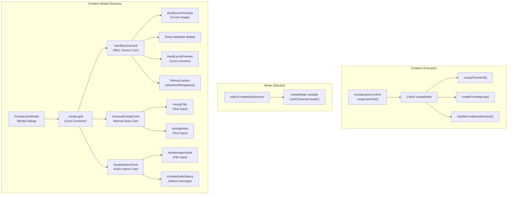
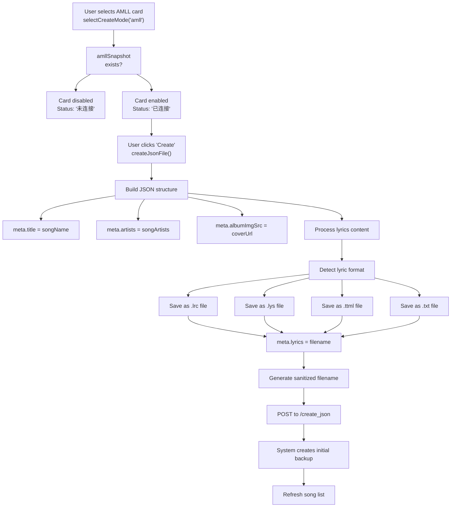
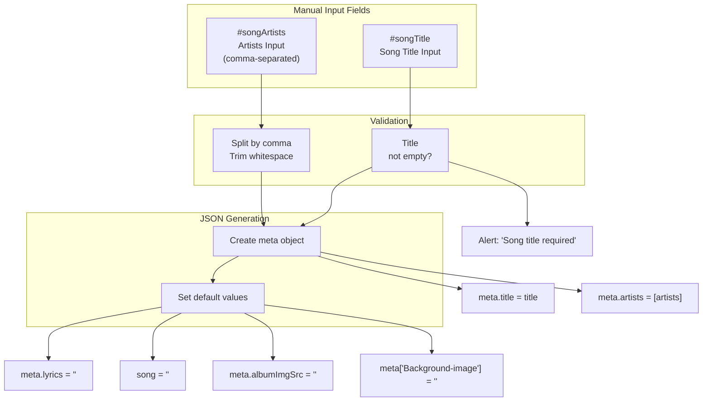
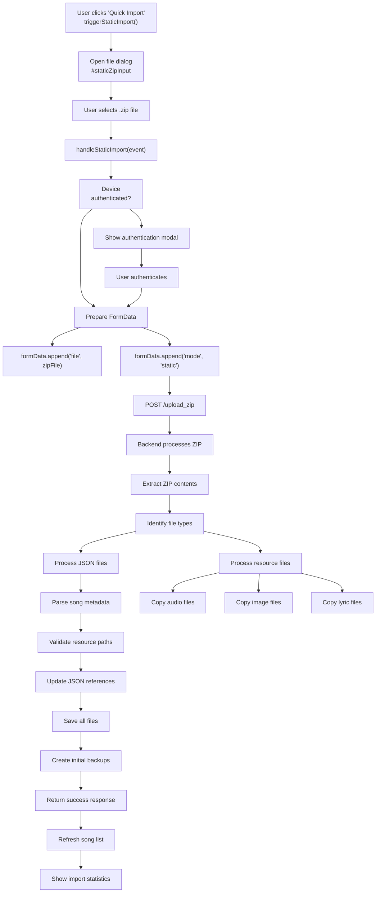
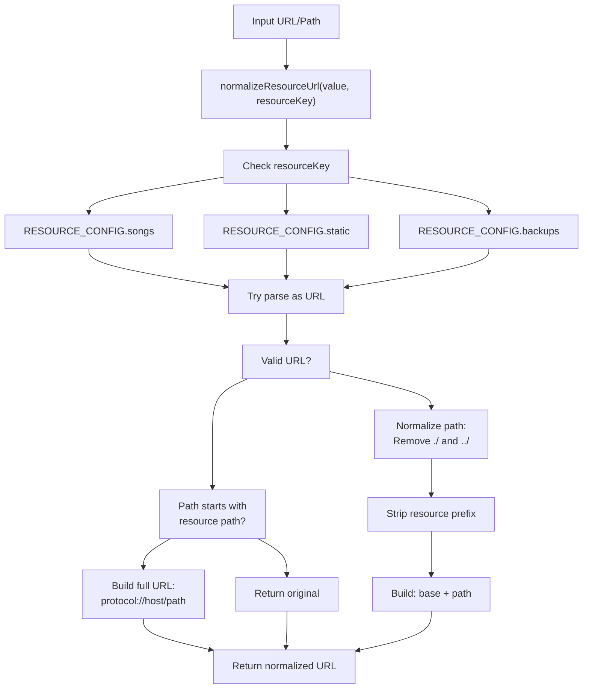
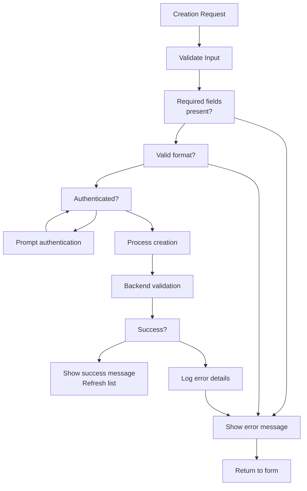
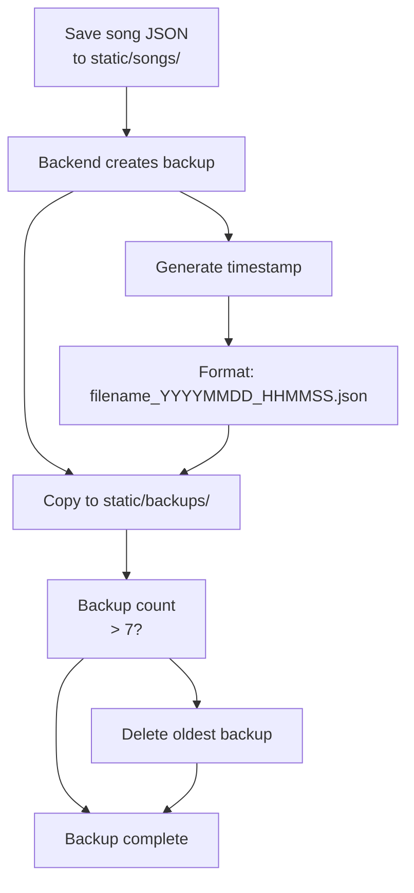

# Song Creation and Import

> **Relevant source files**
> * [LICENSE](https://github.com/HKLHaoBin/LyricSphere/blob/7864cfe0/LICENSE)
> * [README.md](https://github.com/HKLHaoBin/LyricSphere/blob/7864cfe0/README.md)
> * [templates/LyricSphere.html](https://github.com/HKLHaoBin/LyricSphere/blob/7864cfe0/templates/LyricSphere.html)

This document describes the song creation and import functionality in LyricSphere, covering all methods for adding songs to the system. For information about editing existing songs, see [Lyric Editing](/HKLHaoBin/LyricSphere/3.1-main-dashboard-(lyricsphere.html)). For exporting songs, see [Export and Sharing](/HKLHaoBin/LyricSphere/3.4-export-and-sharing).

## Overview

LyricSphere provides multiple methods for creating and importing songs:

* **AMLL Source Creation**: Automatically capture song metadata and lyrics from a connected AMLL player instance
* **Manual Input**: Create songs by manually entering title, artists, and other metadata
* **Audio File Import**: Batch create song entries from audio files using filename-based metadata extraction
* **ZIP Import**: Bulk import complete song packages containing JSON metadata and resource files

All creation operations require device authentication when security mode is enabled. Created songs are stored as JSON files in the `static/songs/` directory, with automatic backup creation on first save.

**Sources**: [templates/LyricSphere.html L1818-L1882](https://github.com/HKLHaoBin/LyricSphere/blob/7864cfe0/templates/LyricSphere.html#L1818-L1882)

## Creation Modal Architecture

The creation interface is implemented through a modal dialog with three selectable creation modes represented as cards.



**Sources**: [templates/LyricSphere.html L1818-L1882](https://github.com/HKLHaoBin/LyricSphere/blob/7864cfe0/templates/LyricSphere.html#L1818-L1882)

 [templates/LyricSphere.html L2197-L2199](https://github.com/HKLHaoBin/LyricSphere/blob/7864cfe0/templates/LyricSphere.html#L2197-L2199)

## AMLL Source Creation

### AMLL Snapshot Polling

The system continuously polls the AMLL player state to retrieve currently playing song information.

```mermaid
sequenceDiagram
  participant Frontend UI
  participant AMLL Snapshot Poller
  participant /amll/state Endpoint
  participant AMLL Card Display

  Frontend UI->>AMLL Snapshot Poller: showCreateModal()
  AMLL Snapshot Poller->>/amll/state Endpoint: GET /amll/state
  loop [AMLL Connected]
    /amll/state Endpoint->>AMLL Snapshot Poller: {status: 'success', data: {...}}
    AMLL Snapshot Poller->>AMLL Card Display: Update
    AMLL Snapshot Poller->>AMLL Card Display: Update
    AMLL Snapshot Poller->>AMLL Card Display: Update
    AMLL Snapshot Poller->>AMLL Card Display: Update
    AMLL Snapshot Poller->>AMLL Card Display: Set card status to "已连接"
    note over AMLL Snapshot Poller,AMLL Card Display: amllSnapshot stored globally
    /amll/state Endpoint->>AMLL Snapshot Poller: {status: 'error'}
    AMLL Snapshot Poller->>AMLL Card Display: Set card status to "未连接"
    AMLL Snapshot Poller->>AMLL Card Display: Show default cover
    AMLL Snapshot Poller->>AMLL Card Display: Display placeholder text
  end
  Frontend UI->>AMLL Snapshot Poller: User clicks "刷新"
  AMLL Snapshot Poller->>/amll/state Endpoint: Refresh snapshot
```

**AMLL Snapshot Data Structure**:

| Field | Description | Usage |
| --- | --- | --- |
| `songName` | Current song title | Copied to JSON `meta.title` |
| `songArtists` | Array of artist names | Joined and copied to `meta.artists` |
| `albumName` | Album name | Displayed in preview |
| `coverUrl` | Album cover URL | Copied to `meta.albumImgSrc` |
| `lyrics` | Raw lyrics content | Processed and stored based on format |

**Sources**: [templates/LyricSphere.html L1822-L1843](https://github.com/HKLHaoBin/LyricSphere/blob/7864cfe0/templates/LyricSphere.html#L1822-L1843)

### Creation from AMLL Workflow



**Filename Sanitization**: The system uses `sanitize_filename()` on the backend to remove unsafe characters and prevent path traversal attacks. Filenames are generated from song title and artists, with automatic truncation and hash suffixes for overly long names.

**Sources**: [templates/LyricSphere.html L1822-L1843](https://github.com/HKLHaoBin/LyricSphere/blob/7864cfe0/templates/LyricSphere.html#L1822-L1843)

 [templates/LyricSphere.html L2197-L2199](https://github.com/HKLHaoBin/LyricSphere/blob/7864cfe0/templates/LyricSphere.html#L2197-L2199)

## Manual Input Creation

Manual creation allows users to enter song metadata through input fields.

### Manual Input Form Structure



**Default Structure**: Manually created songs start with empty resource paths, which users can populate later through the edit modal. The system generates a filename from the song title and first artist.

**Sources**: [templates/LyricSphere.html L1845-L1859](https://github.com/HKLHaoBin/LyricSphere/blob/7864cfe0/templates/LyricSphere.html#L1845-L1859)

## Audio File Import

The audio import feature enables batch song creation from audio files, automatically extracting metadata from filenames.

### Audio Import Process

```mermaid
sequenceDiagram
  participant User
  participant handleCreateAudioImport()
  participant File Upload Handler
  participant Backend API
  participant static/songs/

  User->>User: Select audio file(s)
  User->>handleCreateAudioImport(): onchange event with files
  loop [For each audio file]
    handleCreateAudioImport()->>handleCreateAudioImport(): Extract filename (no extension)
    handleCreateAudioImport()->>handleCreateAudioImport(): Parse title from filename
    handleCreateAudioImport()->>handleCreateAudioImport(): Generate JSON filename
    handleCreateAudioImport()->>File Upload Handler: Upload audio file
    File Upload Handler->>Backend API: POST /upload_file
    Backend API->>static/songs/: Save audio file
    Backend API->>File Upload Handler: Return file path
    handleCreateAudioImport()->>handleCreateAudioImport(): Build JSON structure
    note over handleCreateAudioImport(): meta.title = parsed title
    handleCreateAudioImport()->>Backend API: POST /create_json
    Backend API->>static/songs/: Save JSON file
    Backend API->>Backend API: Create initial backup
    Backend API->>handleCreateAudioImport(): Success response
  end
  handleCreateAudioImport()->>User: Show completion status
  handleCreateAudioImport()->>handleCreateAudioImport(): Refresh song list
```

**Filename Parsing**: The system removes file extensions and uses the remaining name as the song title. Artists are left empty for user input later.

**Supported Audio Formats**: The file input accepts `audio/*` and `video/*` MIME types, supporting common formats like MP3, FLAC, WAV, M4A, MP4, and OGG.

**Sources**: [templates/LyricSphere.html L1861-L1874](https://github.com/HKLHaoBin/LyricSphere/blob/7864cfe0/templates/LyricSphere.html#L1861-L1874)

## ZIP Import System

ZIP import provides bulk import functionality for complete song packages.

### ZIP Package Structure

A valid ZIP import package should contain:

```markdown
package.zip
├── songs/                  # Song metadata directory
│   ├── song1.json         # Individual song files
│   ├── song2.json
│   └── ...
├── <audio files>          # Audio resources (any location)
├── <image files>          # Image resources (any location)
└── <lyric files>          # Lyric files (any location)
```

### ZIP Import Workflow



**File Type Detection**: The system identifies files by extension:

* JSON: `.json` files in `songs/` directory
* Audio: `.mp3`, `.flac`, `.wav`, `.m4a`, `.ogg`, `.opus`
* Images: `.jpg`, `.jpeg`, `.png`, `.gif`, `.webp`
* Lyrics: `.lrc`, `.lys`, `.ttml`, `.txt`

**Path Resolution**: After import, the system normalizes all resource paths in JSON files to use the correct relative paths within `static/songs/`.

**Sources**: [templates/LyricSphere.html L1544-L1546](https://github.com/HKLHaoBin/LyricSphere/blob/7864cfe0/templates/LyricSphere.html#L1544-L1546)

## Creation API Endpoints

### POST /create_json

Creates a new song entry with the provided metadata.

**Request Body**:

```json
{
  "filename": "Song Title - Artist.json",
  "jsonData": {
    "meta": {
      "title": "Song Title",
      "artists": ["Artist Name"],
      "lyrics": "path/to/lyrics.lys",
      "albumImgSrc": "path/to/cover.jpg",
      "Background-image": "path/to/background.jpg"
    },
    "song": "path/to/audio.mp3"
  }
}
```

**Response**:

```json
{
  "status": "success",
  "message": "Song created successfully",
  "filename": "sanitized_filename.json"
}
```

**Security**: Requires device authentication. The filename is sanitized to prevent directory traversal attacks.

### POST /upload_zip

Processes a ZIP file for bulk song import.

**Request**: `multipart/form-data` with:

* `file`: ZIP file binary
* `mode`: Import mode (`"static"` for full package import)

**Response**:

```json
{
  "status": "success",
  "imported": 15,
  "skipped": 2,
  "errors": ["Error details..."]
}
```

**Processing Steps**:

1. Validate ZIP file integrity
2. Extract to temporary directory
3. Identify and categorize files
4. Process JSON metadata files
5. Copy resource files to appropriate directories
6. Update JSON references
7. Create backups for all new songs
8. Clean up temporary files

**Sources**: [templates/LyricSphere.html L1544-L1546](https://github.com/HKLHaoBin/LyricSphere/blob/7864cfe0/templates/LyricSphere.html#L1544-L1546)

## Resource Upload and Path Normalization

When creating songs, resource files (audio, images, lyrics) are uploaded and their paths normalized.

### Resource URL Normalization



**Resource Configuration** (defined at [templates/LyricSphere.html L2189-L2195](https://github.com/HKLHaoBin/LyricSphere/blob/7864cfe0/templates/LyricSphere.html#L2189-L2195)

):

```
RESOURCE_CONFIG = {
  songs: { base: "/songs/", path: "/songs/", name: "songs" },
  static: { base: "/static/", path: "/static/", name: "static" },
  backups: { base: "/backups/", path: "/backups/", name: "backups" }
}
```

**Normalization Functions**:

* `normalizeResourceUrl(value, resourceKey)`: Converts any path format to full URL
* `stripResourcePrefix(value, resourceKey)`: Removes base path to get relative path
* `normalizeSongsUrl(value)`: Shorthand for songs resource normalization
* `stripSongsPrefix(value)`: Shorthand for songs prefix removal

**Sources**: [templates/LyricSphere.html L2189-L2284](https://github.com/HKLHaoBin/LyricSphere/blob/7864cfe0/templates/LyricSphere.html#L2189-L2284)

## Security and Authentication

### Device Authentication Flow

```mermaid
sequenceDiagram
  participant User
  participant Create Button
  participant Authentication Check
  participant Auth Modal
  participant /auth/login
  participant Creation Function

  User->>Create Button: Click create/import
  Create Button->>Authentication Check: Check device status
  loop [Auth Success]
    Authentication Check->>Creation Function: Proceed with creation
    Authentication Check->>Auth Modal: Show auth modal
    Auth Modal->>User: Prompt for password
    User->>Auth Modal: Enter password
    Auth Modal->>/auth/login: POST credentials
    /auth/login->>Auth Modal: Token + device_id
    Auth Modal->>Authentication Check: Store in localStorage
    Authentication Check->>Creation Function: Proceed with creation
    /auth/login->>Auth Modal: Error message
    Auth Modal->>User: Show error
  end
  Creation Function->>/auth/login: Create song with auth token
```

**Authentication Storage**:

* Device token stored in `localStorage` as `device_token`
* Device ID stored in `localStorage` as `device_id`
* Trusted status persists across sessions

**Security Features**:

* Password hashing using bcrypt on backend
* Device fingerprinting for trusted device management
* Token validation on all write operations
* Automatic session expiration

**Sources**: [templates/LyricSphere.html L1914-L1941](https://github.com/HKLHaoBin/LyricSphere/blob/7864cfe0/templates/LyricSphere.html#L1914-L1941)

 [templates/LyricSphere.html L1548-L1564](https://github.com/HKLHaoBin/LyricSphere/blob/7864cfe0/templates/LyricSphere.html#L1548-L1564)

## Creation Validation and Error Handling

### Validation Rules

| Field | Validation | Error Message |
| --- | --- | --- |
| Title | Not empty | "Please enter a song title" |
| Filename | Sanitized, no path traversal | "Invalid filename" |
| Audio file | Valid MIME type | "Unsupported audio format" |
| Image file | Valid image MIME type | "Unsupported image format" |
| Lyric file | Valid format (.lrc/.lys/.ttml) | "Unsupported lyric format" |
| ZIP file | Valid ZIP structure | "Invalid ZIP file" |

### Error Handling Pattern



**Error Logging**: All creation errors are logged to browser console with detailed context. Backend errors are logged to `logs/upload.log` with timestamps and request details.

**Sources**: [templates/LyricSphere.html L1818-L1882](https://github.com/HKLHaoBin/LyricSphere/blob/7864cfe0/templates/LyricSphere.html#L1818-L1882)

## Initial Backup Creation

Upon successful song creation, the system automatically creates an initial backup.

### Backup Creation Process



**Backup Rotation**: The system maintains up to 7 backup versions per song. When this limit is exceeded, the oldest backup is automatically deleted to maintain disk space efficiency.

**Backup Naming**: Backups use the format `{original_filename}_{timestamp}.json` where timestamp is in `YYYYMMDD_HHMMSS` format.

**Sources**: [README.md L26](https://github.com/HKLHaoBin/LyricSphere/blob/7864cfe0/README.md#L26-L26)

## Post-Creation Operations

After successful song creation, several automatic operations occur:

1. **List Refresh**: The main song list is reloaded to display the new entry
2. **Lyric Analysis**: If lyrics are present, the system checks for special features: * Duet markers (`ttm:agent="v2"` in TTML, `[2][5]` in LYS/LRC) * Background vocals (`ttm:role="x-bg"` in TTML, `[6][7][8]` in LYS/LRC)
3. **Tag Display**: Detected features are displayed as tags on the song card
4. **Modal Closure**: The creation modal closes automatically
5. **Status Notification**: A temporary notification shows creation success

**Tag Detection Function** (defined at [templates/LyricSphere.html L2287-L2316](https://github.com/HKLHaoBin/LyricSphere/blob/7864cfe0/templates/LyricSphere.html#L2287-L2316)

):

```javascript
function checkLyrics(lyricsPath, filename) {
  // Sends POST to /check_lyrics
  // Returns: {status, hasDuet, hasBackgroundVocals}
  // Updates song tags accordingly
}
```

**Sources**: [templates/LyricSphere.html L2287-L2316](https://github.com/HKLHaoBin/LyricSphere/blob/7864cfe0/templates/LyricSphere.html#L2287-L2316)