# System Architecture

> **Relevant source files**
> * [CLAUDE.md](https://github.com/HKLHaoBin/LyricSphere/blob/7864cfe0/CLAUDE.md)
> * [LICENSE](https://github.com/HKLHaoBin/LyricSphere/blob/7864cfe0/LICENSE)
> * [README.md](https://github.com/HKLHaoBin/LyricSphere/blob/7864cfe0/README.md)
> * [backend.py](https://github.com/HKLHaoBin/LyricSphere/blob/7864cfe0/backend.py)

## Purpose and Scope

This document provides a comprehensive overview of LyricSphere's system architecture, describing how the major components interact to deliver lyric management, format conversion, real-time synchronization, and AI translation capabilities. It covers the layered architecture design, core backend systems, frontend interfaces, real-time communication mechanisms, storage organization, and security implementations.

For detailed information about specific subsystems:

* API endpoint specifications: see [API Endpoints Reference](/HKLHaoBin/LyricSphere/2.1-api-endpoints-reference)
* Format conversion internals: see [Format Conversion Pipeline](/HKLHaoBin/LyricSphere/2.3-format-conversion-pipeline)
* AI translation implementation: see [AI Translation System](/HKLHaoBin/LyricSphere/2.4-ai-translation-system)
* Real-time communication details: see [Real-time Communication](/HKLHaoBin/LyricSphere/2.5-real-time-communication)
* Security mechanisms: see [Security and Authentication](/HKLHaoBin/LyricSphere/2.6-security-and-authentication)

---

## Layered Architecture Overview

LyricSphere implements a six-layer architecture that separates concerns and enables modular development:

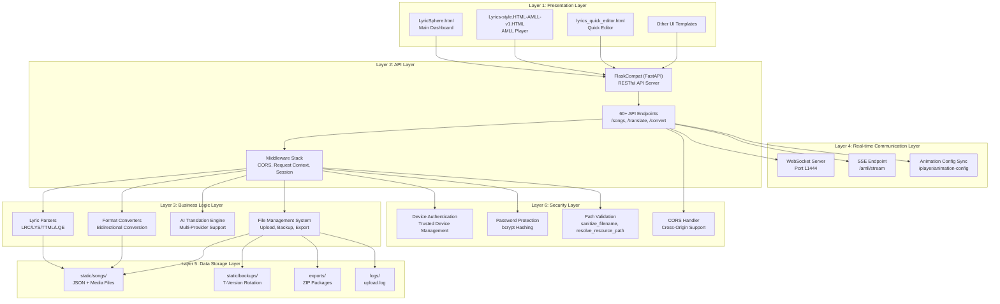

**Sources:** [backend.py L760-L831](https://github.com/HKLHaoBin/LyricSphere/blob/7864cfe0/backend.py#L760-L831)

 [backend.py L854-L878](https://github.com/HKLHaoBin/LyricSphere/blob/7864cfe0/backend.py#L854-L878)

 [backend.py L950-L993](https://github.com/HKLHaoBin/LyricSphere/blob/7864cfe0/backend.py#L950-L993)

 [README.md L96-L108](https://github.com/HKLHaoBin/LyricSphere/blob/7864cfe0/README.md#L96-L108)

---

## Core Backend Architecture

### FastAPI/Flask Compatibility Layer

The backend uses `FlaskCompat`, a custom wrapper that provides Flask-style APIs on top of FastAPI for easier migration and familiar development patterns.

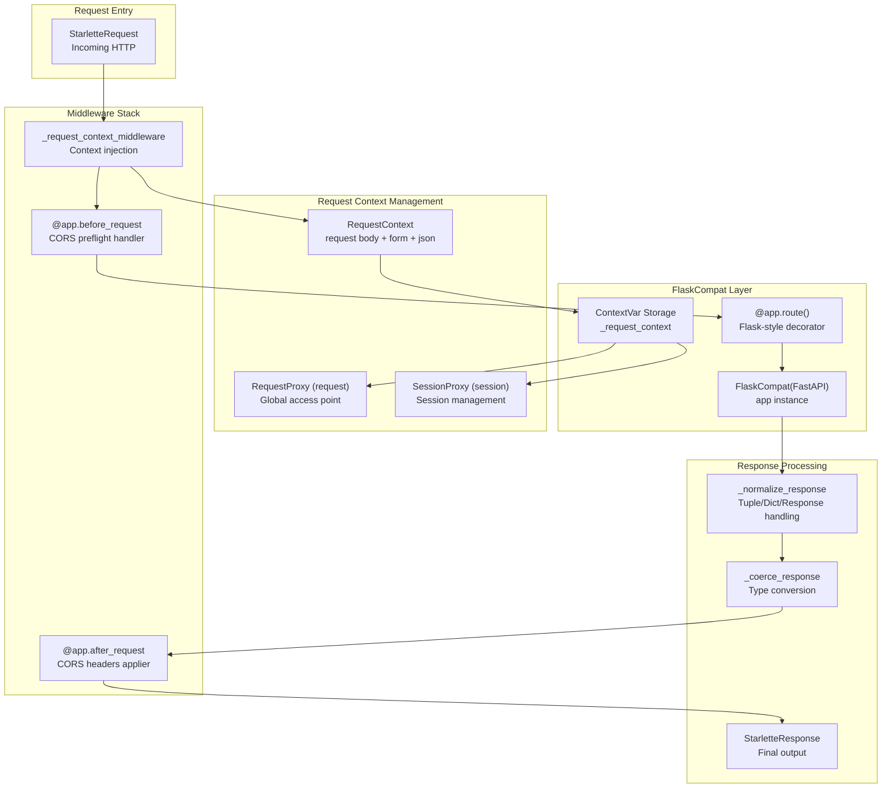

**Key Components:**

| Component | Location | Purpose |
| --- | --- | --- |
| `FlaskCompat` | [backend.py L760-L831](https://github.com/HKLHaoBin/LyricSphere/blob/7864cfe0/backend.py#L760-L831) | FastAPI subclass providing Flask-compatible API |
| `RequestContext` | [backend.py L278-L427](https://github.com/HKLHaoBin/LyricSphere/blob/7864cfe0/backend.py#L278-L427) | Encapsulates HTTP request data with caching |
| `RequestProxy` | [backend.py L429-L463](https://github.com/HKLHaoBin/LyricSphere/blob/7864cfe0/backend.py#L429-L463) | Global `request` object for Flask-style access |
| `SessionProxy` | [backend.py L466-L546](https://github.com/HKLHaoBin/LyricSphere/blob/7864cfe0/backend.py#L466-L546) | Global `session` object for session management |
| `_request_context` | [backend.py L51](https://github.com/HKLHaoBin/LyricSphere/blob/7864cfe0/backend.py#L51-L51) | ContextVar for storing current request context |
| `_request_context_middleware` | [backend.py L1235-L1262](https://github.com/HKLHaoBin/LyricSphere/blob/7864cfe0/backend.py#L1235-L1262) | Middleware that injects context into each request |

**Sources:** [backend.py L51-L52](https://github.com/HKLHaoBin/LyricSphere/blob/7864cfe0/backend.py#L51-L52)

 [backend.py L278-L546](https://github.com/HKLHaoBin/LyricSphere/blob/7864cfe0/backend.py#L278-L546)

 [backend.py L760-L831](https://github.com/HKLHaoBin/LyricSphere/blob/7864cfe0/backend.py#L760-L831)

 [backend.py L833-L835](https://github.com/HKLHaoBin/LyricSphere/blob/7864cfe0/backend.py#L833-L835)

 [backend.py L1235-L1262](https://github.com/HKLHaoBin/LyricSphere/blob/7864cfe0/backend.py#L1235-L1262)

### File Management Architecture

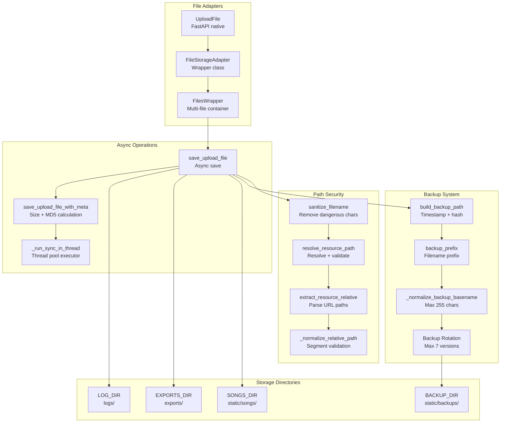

**Key File Management Functions:**

| Function | Location | Purpose |
| --- | --- | --- |
| `FileStorageAdapter` | [backend.py L57-L120](https://github.com/HKLHaoBin/LyricSphere/blob/7864cfe0/backend.py#L57-L120) | Adapts FastAPI UploadFile to common interface |
| `save_upload_file` | [backend.py L196-L219](https://github.com/HKLHaoBin/LyricSphere/blob/7864cfe0/backend.py#L196-L219) | Async file saving with directory creation |
| `save_upload_file_with_meta` | [backend.py L222-L275](https://github.com/HKLHaoBin/LyricSphere/blob/7864cfe0/backend.py#L222-L275) | Save file + compute size and MD5 hash |
| `sanitize_filename` | [backend.py L997-L1004](https://github.com/HKLHaoBin/LyricSphere/blob/7864cfe0/backend.py#L997-L1004) | Remove unsafe characters from filenames |
| `resolve_resource_path` | [backend.py L1037-L1047](https://github.com/HKLHaoBin/LyricSphere/blob/7864cfe0/backend.py#L1037-L1047) | Validate and resolve resource paths |
| `build_backup_path` | [backend.py L1318-L1330](https://github.com/HKLHaoBin/LyricSphere/blob/7864cfe0/backend.py#L1318-L1330) | Generate timestamped backup filename |
| `_normalize_backup_basename` | [backend.py L1299-L1315](https://github.com/HKLHaoBin/LyricSphere/blob/7864cfe0/backend.py#L1299-L1315) | Ensure backup names fit 255-char limit |

**Sources:** [backend.py L57-L275](https://github.com/HKLHaoBin/LyricSphere/blob/7864cfe0/backend.py#L57-L275)

 [backend.py L838-L851](https://github.com/HKLHaoBin/LyricSphere/blob/7864cfe0/backend.py#L838-L851)

 [backend.py L950-L993](https://github.com/HKLHaoBin/LyricSphere/blob/7864cfe0/backend.py#L950-L993)

 [backend.py L994-L1063](https://github.com/HKLHaoBin/LyricSphere/blob/7864cfe0/backend.py#L994-L1063)

 [backend.py L1293-L1336](https://github.com/HKLHaoBin/LyricSphere/blob/7864cfe0/backend.py#L1293-L1336)

---

## Frontend Architecture

LyricSphere provides multiple frontend interfaces for different use cases:

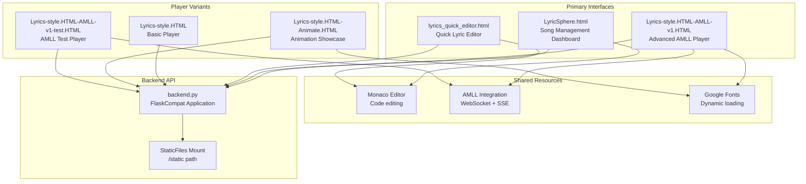

**Frontend Interface Responsibilities:**

| Interface | File | Primary Purpose |
| --- | --- | --- |
| Main Dashboard | `LyricSphere.html` | Song CRUD, search, batch import/export |
| AMLL Player V1 | `Lyrics-style.HTML-AMLL-v1.HTML` | Full-featured player with background visualizer |
| Quick Editor | `lyrics_quick_editor.html` | Fast lyric editing with document operations |
| Basic Player | `Lyrics-style.HTML` | Simple lyric display player |
| Animation Showcase | `Lyrics-style.HTML-Animate.HTML` | Animation effect demonstrations |
| AMLL Test Player | `Lyrics-style.HTML-AMLL-v1-test.HTML` | AMLL integration testing |

**Sources:** [README.md L102-L108](https://github.com/HKLHaoBin/LyricSphere/blob/7864cfe0/README.md#L102-L108)

 [CLAUDE.md L9-L17](https://github.com/HKLHaoBin/LyricSphere/blob/7864cfe0/CLAUDE.md#L9-L17)

 Diagram 3 from provided context

---

## Real-time Communication Architecture

### Dual-Channel Communication System

LyricSphere implements two parallel real-time communication channels optimized for different client types:

```mermaid
sequenceDiagram
  participant Browser
  participant /amll/stream
  participant SSE Endpoint
  participant WebSocket Server
  participant Port 11444
  participant AMLL Client
  participant backend.py
  participant Route Handlers

  Browser->>backend.py: GET /player page
  backend.py-->>Browser: HTML + initial config
  Browser->>/amll/stream: Connect SSE stream
  /amll/stream-->>Browser: Connection established
  AMLL Client->>WebSocket Server: WebSocket connect :11444
  WebSocket Server-->>AMLL Client: Connection accepted
  loop [Playback Loop]
    backend.py->>/amll/stream: Push lyric line event
    /amll/stream-->>Browser: data: {line, timestamp}
    Browser->>Browser: Render + animate
    backend.py->>WebSocket Server: Push AMLL rule message
    WebSocket Server-->>AMLL Client: JSON lyric rule
    AMLL Client->>AMLL Client: Parse + render
  end
  Browser->>backend.py: POST /player/animation-config
  backend.py-->>Browser: Sync animation params (600ms)
  note over Browser,Route Handlers: Frontend reports params,
```

**Real-time Components:**

| Component | Location | Protocol | Purpose |
| --- | --- | --- | --- |
| WebSocket Server | Runs on port 11444 | WebSocket | AMLL client integration |
| SSE Endpoint | `/amll/stream` route | Server-Sent Events | Browser real-time updates |
| Animation Sync | `/player/animation-config` | HTTP POST | Synchronize animation timing |

**Sources:** [backend.py (WebSocket implementation)](https://github.com/HKLHaoBin/LyricSphere/blob/7864cfe0/backend.py (WebSocket implementation))

 [README.md L133-L136](https://github.com/HKLHaoBin/LyricSphere/blob/7864cfe0/README.md#L133-L136)

 [CLAUDE.md L65-L71](https://github.com/HKLHaoBin/LyricSphere/blob/7864cfe0/CLAUDE.md#L65-L71)

 Diagram 4 from provided context

### Animation Configuration Flow

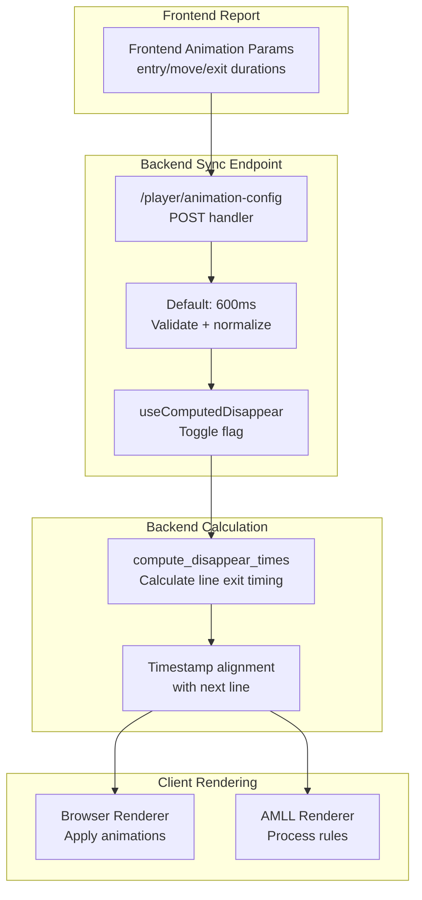

**Sources:** [backend.py (animation config endpoint)](https://github.com/HKLHaoBin/LyricSphere/blob/7864cfe0/backend.py (animation config endpoint))

 [README.md L135-L136](https://github.com/HKLHaoBin/LyricSphere/blob/7864cfe0/README.md#L135-L136)

 [CLAUDE.md L147](https://github.com/HKLHaoBin/LyricSphere/blob/7864cfe0/CLAUDE.md#L147-L147)

---

## Storage and File Organization

### Directory Structure

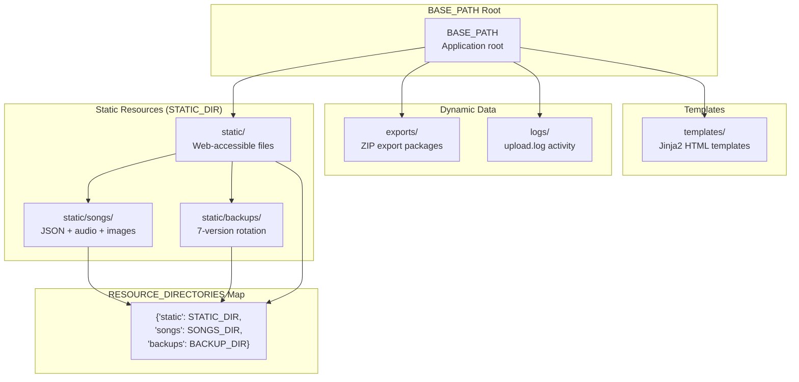

**Path Resolution Constants:**

| Constant | Location | Value | Purpose |
| --- | --- | --- | --- |
| `BASE_PATH` | [backend.py L847](https://github.com/HKLHaoBin/LyricSphere/blob/7864cfe0/backend.py#L847-L847) | `get_base_path()` result | Application root (handles frozen/dev mode) |
| `STATIC_DIR` | [backend.py L950](https://github.com/HKLHaoBin/LyricSphere/blob/7864cfe0/backend.py#L950-L950) | `BASE_PATH / 'static'` | Web-accessible resources |
| `SONGS_DIR` | [backend.py L951](https://github.com/HKLHaoBin/LyricSphere/blob/7864cfe0/backend.py#L951-L951) | `STATIC_DIR / 'songs'` | Song JSON + media files |
| `BACKUP_DIR` | [backend.py L952](https://github.com/HKLHaoBin/LyricSphere/blob/7864cfe0/backend.py#L952-L952) | `STATIC_DIR / 'backups'` | Versioned backup files |
| `EXPORTS_DIR` | [backend.py L850](https://github.com/HKLHaoBin/LyricSphere/blob/7864cfe0/backend.py#L850-L850) | `BASE_PATH / 'exports'` | ZIP export packages |
| `LOG_DIR` | [backend.py L953](https://github.com/HKLHaoBin/LyricSphere/blob/7864cfe0/backend.py#L953-L953) | `BASE_PATH / 'logs'` | Application logs |
| `RESOURCE_DIRECTORIES` | [backend.py L988-L992](https://github.com/HKLHaoBin/LyricSphere/blob/7864cfe0/backend.py#L988-L992) | Directory mapping dict | Path validation whitelist |

**Sources:** [backend.py L838-L857](https://github.com/HKLHaoBin/LyricSphere/blob/7864cfe0/backend.py#L838-L857)

 [backend.py L950-L993](https://github.com/HKLHaoBin/LyricSphere/blob/7864cfe0/backend.py#L950-L993)

### Backup Version Management

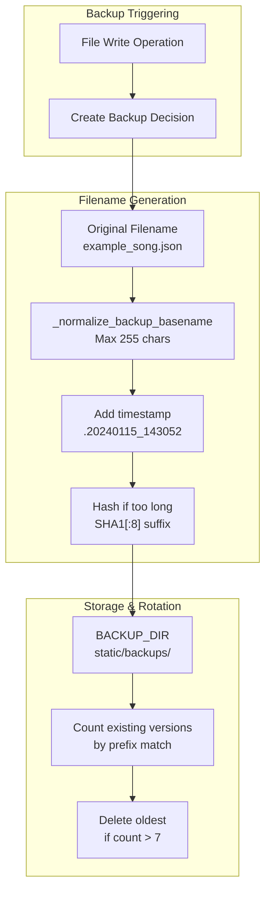

**Backup System Constants:**

| Constant | Location | Value | Purpose |
| --- | --- | --- | --- |
| `BACKUP_TIMESTAMP_FORMAT` | [backend.py L1293](https://github.com/HKLHaoBin/LyricSphere/blob/7864cfe0/backend.py#L1293-L1293) | `'%Y%m%d_%H%M%S'` | Backup timestamp format |
| `MAX_BACKUP_FILENAME_LENGTH` | [backend.py L1295](https://github.com/HKLHaoBin/LyricSphere/blob/7864cfe0/backend.py#L1295-L1295) | `255` | Filesystem filename limit |
| `BACKUP_HASH_LENGTH` | [backend.py L1296](https://github.com/HKLHaoBin/LyricSphere/blob/7864cfe0/backend.py#L1296-L1296) | `8` | SHA1 hash truncation length |
| Max backup versions | Implicit | `7` | Version rotation limit |

**Sources:** [backend.py L1293-L1336](https://github.com/HKLHaoBin/LyricSphere/blob/7864cfe0/backend.py#L1293-L1336)

 [README.md L26](https://github.com/HKLHaoBin/LyricSphere/blob/7864cfe0/README.md#L26-L26)

 [CLAUDE.md L113](https://github.com/HKLHaoBin/LyricSphere/blob/7864cfe0/CLAUDE.md#L113-L113)

---

## Security Architecture

### Multi-Layer Security System

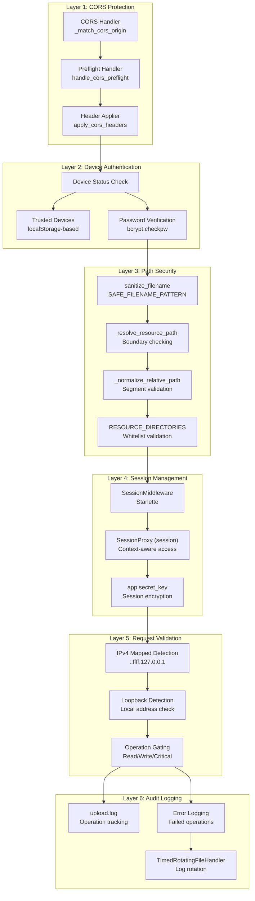

**Security Functions and Mechanisms:**

| Component | Location | Purpose |
| --- | --- | --- |
| `sanitize_filename` | [backend.py L997-L1004](https://github.com/HKLHaoBin/LyricSphere/blob/7864cfe0/backend.py#L997-L1004) | Remove dangerous characters, prevent injection |
| `_normalize_relative_path` | [backend.py L1006-L1015](https://github.com/HKLHaoBin/LyricSphere/blob/7864cfe0/backend.py#L1006-L1015) | Validate path segments, block `..` traversal |
| `resolve_resource_path` | [backend.py L1037-L1047](https://github.com/HKLHaoBin/LyricSphere/blob/7864cfe0/backend.py#L1037-L1047) | Resolve + validate against base directory |
| `SAFE_FILENAME_PATTERN` | [backend.py L994](https://github.com/HKLHaoBin/LyricSphere/blob/7864cfe0/backend.py#L994-L994) | Regex whitelist for safe characters |
| `RESOURCE_DIRECTORIES` | [backend.py L988-L992](https://github.com/HKLHaoBin/LyricSphere/blob/7864cfe0/backend.py#L988-L992) | Whitelist of allowed resource paths |
| `_match_cors_origin` | [backend.py L1225-L1232](https://github.com/HKLHaoBin/LyricSphere/blob/7864cfe0/backend.py#L1225-L1232) | Validate CORS origin against allowed list |
| `SessionMiddleware` | [backend.py L862](https://github.com/HKLHaoBin/LyricSphere/blob/7864cfe0/backend.py#L862-L862) | Starlette session middleware for state |
| bcrypt password hashing | Imported at [backend.py L8](https://github.com/HKLHaoBin/LyricSphere/blob/7864cfe0/backend.py#L8-L8) | Password protection with salt |

**Sources:** [backend.py L8](https://github.com/HKLHaoBin/LyricSphere/blob/7864cfe0/backend.py#L8-L8)

 [backend.py L862](https://github.com/HKLHaoBin/LyricSphere/blob/7864cfe0/backend.py#L862-L862)

 [backend.py L988-L1047](https://github.com/HKLHaoBin/LyricSphere/blob/7864cfe0/backend.py#L988-L1047)

 [backend.py L1225-L1291](https://github.com/HKLHaoBin/LyricSphere/blob/7864cfe0/backend.py#L1225-L1291)

 [README.md L156-L165](https://github.com/HKLHaoBin/LyricSphere/blob/7864cfe0/README.md#L156-L165)

 Diagram 6 from provided context

---

## External Integrations

### AI Provider Integration Architecture

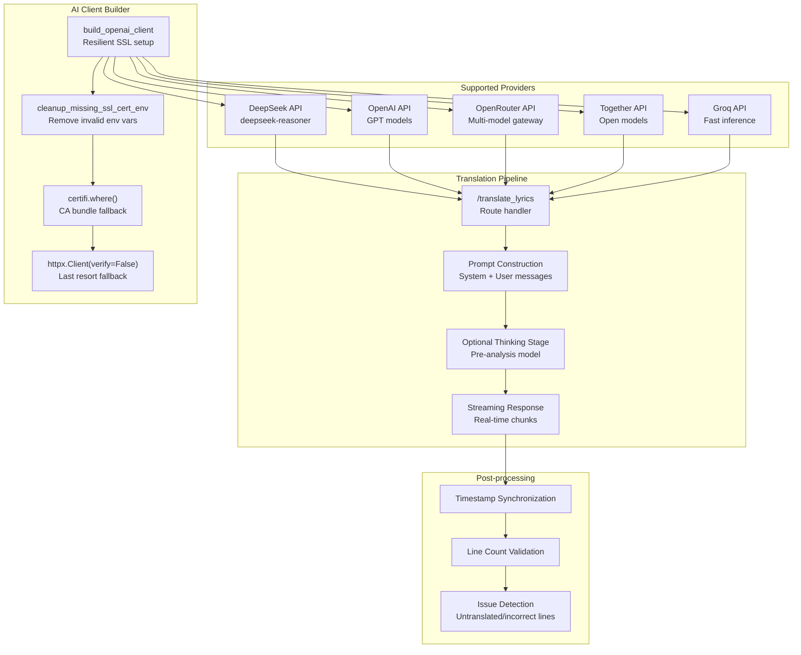

**AI Integration Components:**

| Component | Location | Purpose |
| --- | --- | --- |
| `build_openai_client` | [backend.py L910-L947](https://github.com/HKLHaoBin/LyricSphere/blob/7864cfe0/backend.py#L910-L947) | Create OpenAI-compatible client with SSL fallback |
| `cleanup_missing_ssl_cert_env` | [backend.py L890-L907](https://github.com/HKLHaoBin/LyricSphere/blob/7864cfe0/backend.py#L890-L907) | Remove invalid SSL cert environment variables |
| Translation endpoint | Route: `/translate_lyrics` | AI-powered lyric translation with streaming |
| Thinking model support | In translation pipeline | Optional pre-analysis for better translation |
| Provider configuration | Environment variables + UI | User-configurable AI provider selection |

**Sources:** [backend.py L8](https://github.com/HKLHaoBin/LyricSphere/blob/7864cfe0/backend.py#L8-L8)

 [backend.py L40](https://github.com/HKLHaoBin/LyricSphere/blob/7864cfe0/backend.py#L40-L40)

 [backend.py L890-L947](https://github.com/HKLHaoBin/LyricSphere/blob/7864cfe0/backend.py#L890-L947)

 [README.md L67](https://github.com/HKLHaoBin/LyricSphere/blob/7864cfe0/README.md#L67-L67)

 [README.md L143-L154](https://github.com/HKLHaoBin/LyricSphere/blob/7864cfe0/README.md#L143-L154)

 Diagram 7 from provided context

### Font Service Integration

Fonts are dynamically loaded from multiple sources with fallback mechanisms:

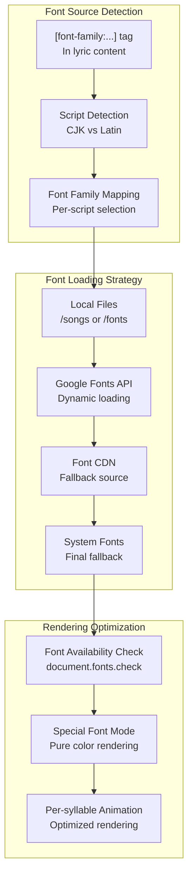

**Font System Features:**

* Parse `[font-family:FontName]` metadata tags from lyric content
* Script detection (Chinese, Japanese, English) for appropriate font selection
* Multi-source loading: local files → Google Fonts → CDN → system fallback
* Font availability checking before rendering
* Special handling for decorative fonts (pure color mode)
* Per-syllable font application for fine-grained control

**Sources:** [backend.py L1138-L1183](https://github.com/HKLHaoBin/LyricSphere/blob/7864cfe0/backend.py#L1138-L1183)

 (extract_font_files_from_lys function), [README.md L46-L59](https://github.com/HKLHaoBin/LyricSphere/blob/7864cfe0/README.md#L46-L59)

 [CLAUDE.md L22](https://github.com/HKLHaoBin/LyricSphere/blob/7864cfe0/CLAUDE.md#L22-L22)

 Diagram 4 from provided context

### LDDC Integration

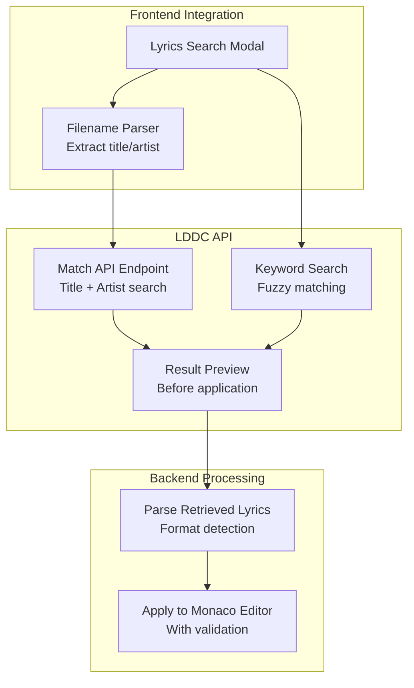

**Sources:** [README.md L11](https://github.com/HKLHaoBin/LyricSphere/blob/7864cfe0/README.md#L11-L11)

 Diagram 3 from provided context

---

## Key Data Flows

### Song Creation Flow

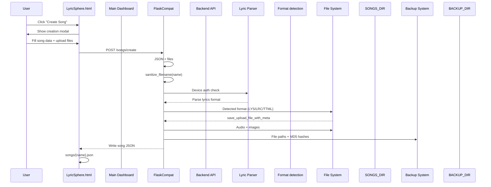

**Sources:** [backend.py L196-L275](https://github.com/HKLHaoBin/LyricSphere/blob/7864cfe0/backend.py#L196-L275)

 (file save functions), [backend.py L997-L1004](https://github.com/HKLHaoBin/LyricSphere/blob/7864cfe0/backend.py#L997-L1004)

 (sanitize_filename), [backend.py L1318-L1330](https://github.com/HKLHaoBin/LyricSphere/blob/7864cfe0/backend.py#L1318-L1330)

 (backup path generation)

### Format Conversion Flow

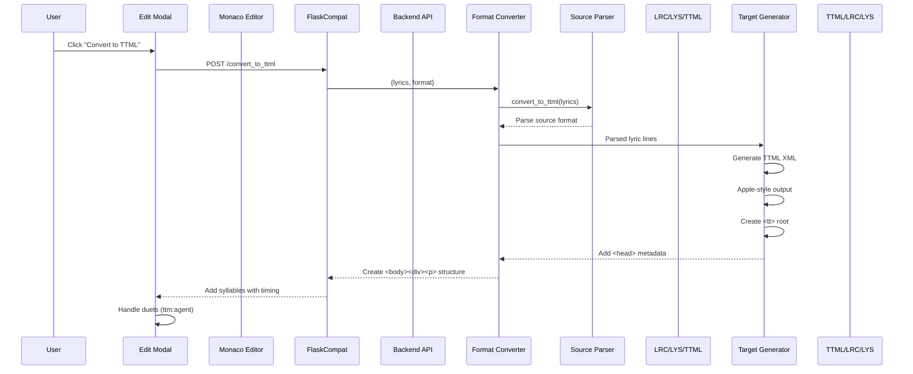

**Sources:** Format conversion implementation in [backend.py](https://github.com/HKLHaoBin/LyricSphere/blob/7864cfe0/backend.py)

 [CLAUDE.md L123-L144](https://github.com/HKLHaoBin/LyricSphere/blob/7864cfe0/CLAUDE.md#L123-L144)

 Diagram 5 from provided context

### AI Translation Flow

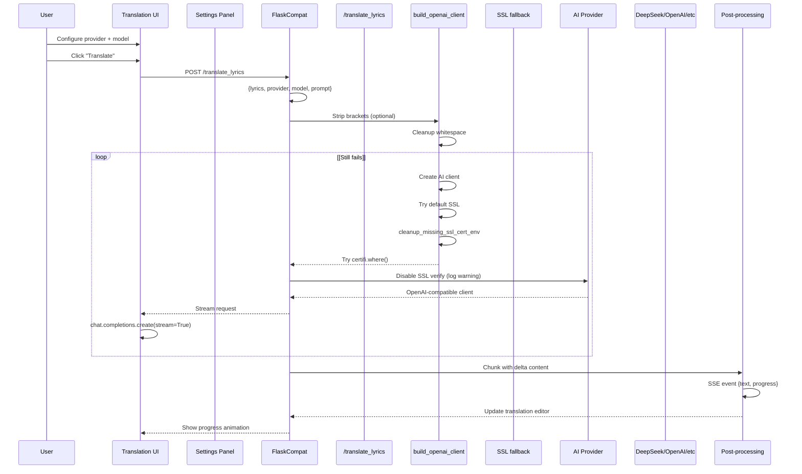

**Sources:** [backend.py L890-L947](https://github.com/HKLHaoBin/LyricSphere/blob/7864cfe0/backend.py#L890-L947)

 (build_openai_client), [README.md L143-L154](https://github.com/HKLHaoBin/LyricSphere/blob/7864cfe0/README.md#L143-L154)

 [CLAUDE.md L153-L162](https://github.com/HKLHaoBin/LyricSphere/blob/7864cfe0/CLAUDE.md#L153-L162)

 Diagram 7 from provided context

### Real-time Lyric Streaming Flow

```mermaid
sequenceDiagram
  participant Browser
  participant /amll/stream
  participant SSE Endpoint
  participant Backend Routes
  participant Lyric Processor
  participant Timestamp calculator
  participant WebSocket Server
  participant Port 11444
  participant AMLL Desktop Client

  Browser->>Backend Routes: Load player page
  Backend Routes-->>Browser: HTML + song JSON
  Browser->>/amll/stream: Connect EventSource
  /amll/stream-->>Browser: GET /amll/stream?songId=X
  AMLL Desktop Client->>WebSocket Server: Connection established
  WebSocket Server-->>AMLL Desktop Client: Connect WebSocket
  Browser->>Backend Routes: ws://localhost:11444
  Backend Routes->>Lyric Processor: Connection accepted
  Lyric Processor->>Lyric Processor: Report playback start
  loop [Playback Updates]
    Backend Routes->>/amll/stream: Current timestamp
    /amll/stream-->>Browser: Get lyric lines
    Browser->>Browser: with timing data
    Backend Routes->>WebSocket Server: compute_disappear_times
    WebSocket Server-->>AMLL Desktop Client: Calculate exit timing
    AMLL Desktop Client->>AMLL Desktop Client: Push lyric line
  end
```

**Sources:** WebSocket and SSE implementation in [backend.py](https://github.com/HKLHaoBin/LyricSphere/blob/7864cfe0/backend.py)

 [README.md L133-L136](https://github.com/HKLHaoBin/LyricSphere/blob/7864cfe0/README.md#L133-L136)

 [CLAUDE.md L65-L71](https://github.com/HKLHaoBin/LyricSphere/blob/7864cfe0/CLAUDE.md#L65-L71)

 Diagram 4 from provided context

---

## Component Interaction Matrix

| Component | Interacts With | Protocol/Mechanism | Purpose |
| --- | --- | --- | --- |
| `FlaskCompat` | All route handlers | Python function calls | Main application orchestrator |
| `RequestContext` | All route handlers | ContextVar | Request state management |
| `FileStorageAdapter` | File upload routes | Wrapper pattern | FastAPI file handling |
| `sanitize_filename` | All file operations | Function call | Security validation |
| `resolve_resource_path` | Resource serving routes | Function call | Path security |
| WebSocket Server | AMLL clients | WebSocket protocol (port 11444) | Real-time lyric updates |
| SSE Endpoint | Browser clients | Server-Sent Events | Real-time streaming |
| AI Client Builder | Translation endpoint | OpenAI SDK | AI provider abstraction |
| Backup System | File write operations | Automatic trigger | Version management |
| CORS Handler | All HTTP requests | Middleware | Cross-origin security |
| Session Middleware | Authentication routes | Starlette middleware | State persistence |

**Sources:** [backend.py L760-L831](https://github.com/HKLHaoBin/LyricSphere/blob/7864cfe0/backend.py#L760-L831)

 [backend.py L278-L546](https://github.com/HKLHaoBin/LyricSphere/blob/7864cfe0/backend.py#L278-L546)

 [backend.py L57-L275](https://github.com/HKLHaoBin/LyricSphere/blob/7864cfe0/backend.py#L57-L275)

 [backend.py L997-L1047](https://github.com/HKLHaoBin/LyricSphere/blob/7864cfe0/backend.py#L997-L1047)

 [backend.py L890-L947](https://github.com/HKLHaoBin/LyricSphere/blob/7864cfe0/backend.py#L890-L947)

 [backend.py L1235-L1291](https://github.com/HKLHaoBin/LyricSphere/blob/7864cfe0/backend.py#L1235-L1291)

---

## Deployment Architecture

LyricSphere supports flexible deployment modes:

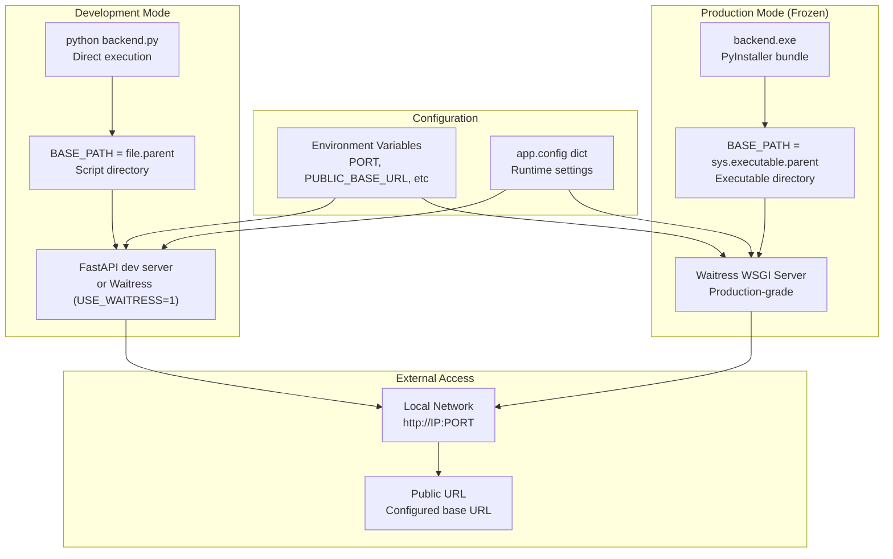

**Key Deployment Functions:**

| Function/Constant | Location | Purpose |
| --- | --- | --- |
| `get_base_path()` | [backend.py L838-L844](https://github.com/HKLHaoBin/LyricSphere/blob/7864cfe0/backend.py#L838-L844) | Detect frozen vs dev mode, return correct base path |
| `BASE_PATH` | [backend.py L847](https://github.com/HKLHaoBin/LyricSphere/blob/7864cfe0/backend.py#L847-L847) | Global application root directory |
| `USE_WAITRESS` env var | Runtime check | Switch to Waitress production server |
| `PORT` env var | Runtime config | Configure listening port (default 5000) |
| `PUBLIC_BASE_URL` env var | Runtime config | Override public URL for proxied deployments |

**Sources:** [backend.py L838-L857](https://github.com/HKLHaoBin/LyricSphere/blob/7864cfe0/backend.py#L838-L857)

 [README.md L69-L93](https://github.com/HKLHaoBin/LyricSphere/blob/7864cfe0/README.md#L69-L93)

 [CLAUDE.md L21-L45](https://github.com/HKLHaoBin/LyricSphere/blob/7864cfe0/CLAUDE.md#L21-L45)

---

This architecture enables LyricSphere to maintain clear separation of concerns while supporting complex operations like real-time synchronization, multi-format conversion, and AI-powered translation across multiple client types.