# TTML Format

> **Relevant source files**
> * [CHANGELOG.md](https://github.com/HKLHaoBin/LyricSphere/blob/7864cfe0/CHANGELOG.md)
> * [LICENSE](https://github.com/HKLHaoBin/LyricSphere/blob/7864cfe0/LICENSE)
> * [README.md](https://github.com/HKLHaoBin/LyricSphere/blob/7864cfe0/README.md)
> * [backend.py](https://github.com/HKLHaoBin/LyricSphere/blob/7864cfe0/backend.py)

## Purpose and Scope

This document describes LyricSphere's implementation of the TTML (Timed Text Markup Language) format for synchronized lyrics. TTML is an XML-based format that supports rich metadata and hierarchical structure, making it ideal for platforms like Apple Music.

This page covers TTML parsing, content sanitization, and bidirectional conversion with other formats. For information about LYS (syllable-level) format, see [2.3.2](/HKLHaoBin/LyricSphere/2.3.2-lys-format). For LRC (line-level) format, see [2.3.1](/HKLHaoBin/LyricSphere/2.3.1-lrc-format). For the overall format conversion architecture, see [2.3](/HKLHaoBin/LyricSphere/2.3-format-conversion-pipeline).

## Format Specification

### XML Document Structure

TTML documents follow a hierarchical XML structure optimized for Apple-style lyric display:

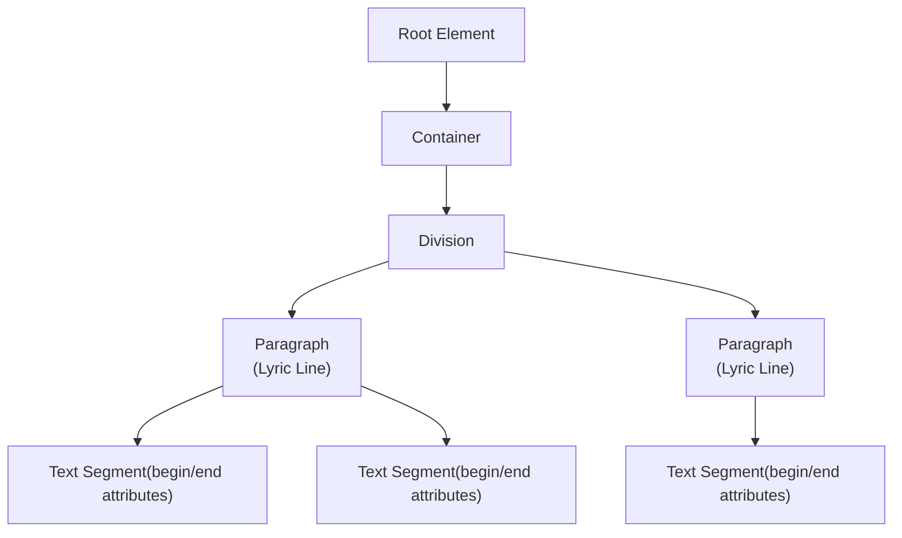

**Sources:** [backend.py L37-L39](https://github.com/HKLHaoBin/LyricSphere/blob/7864cfe0/backend.py#L37-L39)

### Element Hierarchy

| Element | Purpose | Key Attributes |
| --- | --- | --- |
| `<tt>` | Root element | Namespace declarations |
| `<body>` | Content container | None |
| `<div>` | Logical grouping | None |
| `<p>` | Lyric paragraph (line) | `begin`, `end`, `ttm:agent`, `ttm:role` |
| `<span>` | Text segment (syllable/word) | `begin`, `end` |

**Sources:** [README.md L119](https://github.com/HKLHaoBin/LyricSphere/blob/7864cfe0/README.md#L119-L119)

 [backend.py L37-L39](https://github.com/HKLHaoBin/LyricSphere/blob/7864cfe0/backend.py#L37-L39)

### Timing Attributes

TTML uses `begin` and `end` attributes to specify timing in the format `HH:MM:SS.mmm`:

```xml
<span begin="00:00:12.500" end="00:00:13.200">Example</span>
```

All timing values are absolute timestamps from the beginning of the audio track.

**Sources:** [backend.py L37-L39](https://github.com/HKLHaoBin/LyricSphere/blob/7864cfe0/backend.py#L37-L39)

## Special Metadata Attributes

### Background Vocals: ttm:role="x-bg"

The `ttm:role` attribute marks background vocal lines that should be visually distinguished from main vocals:

```html
<p ttm:role="x-bg" begin="00:01:23.000" end="00:01:25.500">
  <span begin="00:01:23.000" end="00:01:24.000">(Oh</span>
  <span begin="00:01:24.000" end="00:01:25.500">yeah)</span>
</p>
```

These lines are typically rendered with reduced opacity or different styling in player interfaces.

**Sources:** [README.md L119](https://github.com/HKLHaoBin/LyricSphere/blob/7864cfe0/README.md#L119-L119)

 Diagram 5 (BGDetector)

### Duet/Multi-Voice: ttm:agent="v2"

The `ttm:agent` attribute identifies which vocalist is singing, enabling duet and multi-voice support:

```html
<p ttm:agent="v1" begin="00:02:10.000" end="00:02:12.000">
  <span begin="00:02:10.000" end="00:02:12.000">First singer line</span>
</p>
<p ttm:agent="v2" begin="00:02:12.000" end="00:02:14.000">
  <span begin="00:02:12.000" end="00:02:14.000">Second singer line</span>
</p>
```

Agents `v1` (default) and `v2` are supported. Player interfaces can render different voices with distinct colors or positions.

**Sources:** [README.md L119](https://github.com/HKLHaoBin/LyricSphere/blob/7864cfe0/README.md#L119-L119)

 Diagram 5 (DuetDetector)

## Parsing Implementation

### TTML Parser Architecture

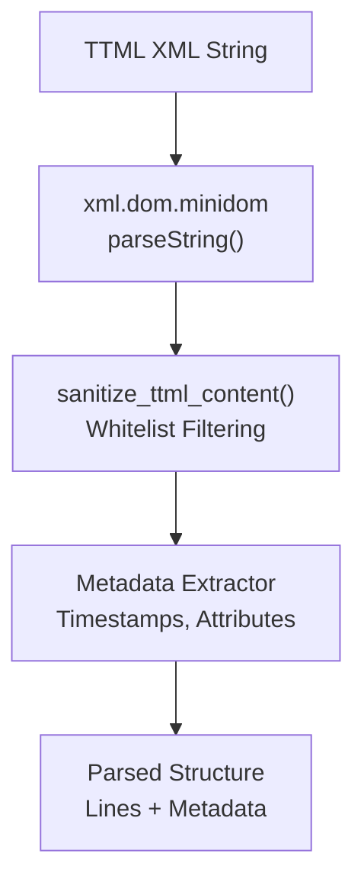

**Sources:** [backend.py L18](https://github.com/HKLHaoBin/LyricSphere/blob/7864cfe0/backend.py#L18-L18)

 [backend.py L37-L39](https://github.com/HKLHaoBin/LyricSphere/blob/7864cfe0/backend.py#L37-L39)

 Diagram 5 (TTMLParser, Sanitizer)

### XML Parsing with minidom

The parser uses Python's `xml.dom.minidom` module to parse TTML content safely:

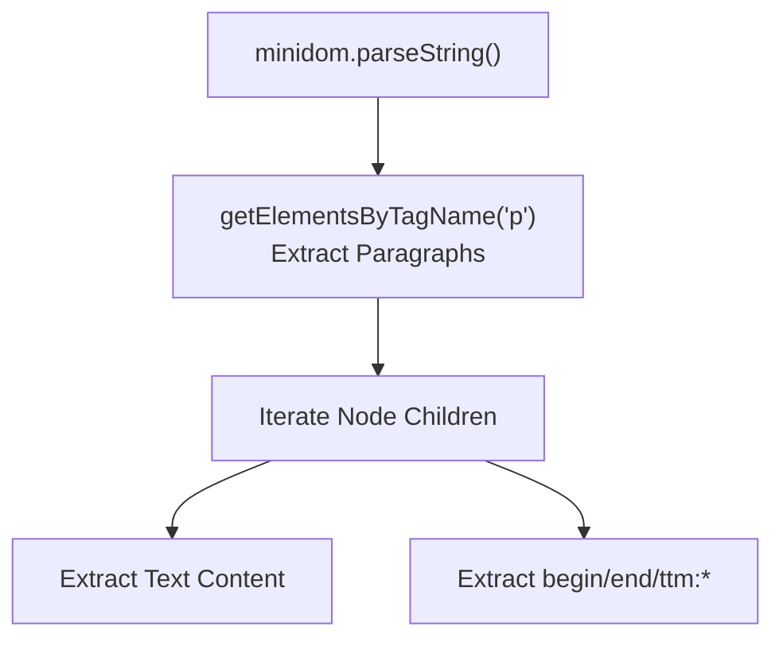

Key parsing operations:

1. Parse XML string into DOM tree
2. Extract all `<p>` elements (lyric lines)
3. For each `<p>`, extract `<span>` elements (syllables)
4. Read `begin`, `end`, `ttm:role`, and `ttm:agent` attributes
5. Preserve text content and whitespace handling

**Sources:** [backend.py L37-L39](https://github.com/HKLHaoBin/LyricSphere/blob/7864cfe0/backend.py#L37-L39)

 Diagram 5 (TTMLParser)

### Content Sanitization

TTML content undergoes security filtering to prevent XML injection attacks:

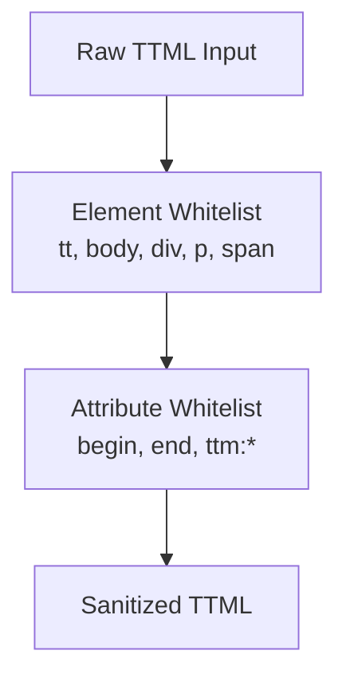

The sanitizer:

* Allows only whitelisted XML elements (`<tt>`, `<body>`, `<div>`, `<p>`, `<span>`)
* Permits only safe attributes (`begin`, `end`, `ttm:role`, `ttm:agent`)
* Strips unknown elements and attributes
* Removes script tags, style tags, and external references

**Sources:** [README.md L36](https://github.com/HKLHaoBin/LyricSphere/blob/7864cfe0/README.md#L36-L36)

 Diagram 5 (TTML Sanitizer)

### Whitespace Handling

TTML parsing includes special whitespace normalization:

| Context | Handling |
| --- | --- |
| Leading/trailing spaces | Trimmed from `<span>` text |
| Multiple spaces | Collapsed to single space |
| Newlines in XML | Ignored (not preserved in output) |
| Explicit spaces between `<span>` | Preserved as word boundaries |

**Sources:** [CHANGELOG.md L49](https://github.com/HKLHaoBin/LyricSphere/blob/7864cfe0/CHANGELOG.md#L49-L49)

## Conversion from TTML to LYS/LRC

### Conversion Pipeline

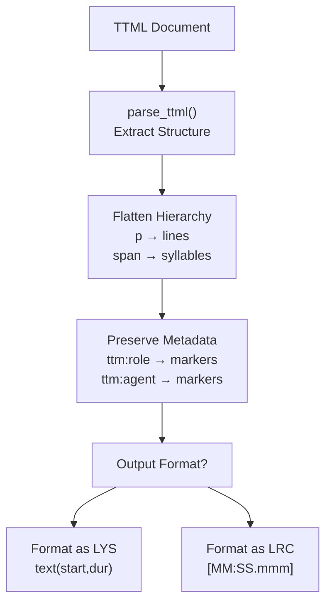

**Sources:** [README.md L127](https://github.com/HKLHaoBin/LyricSphere/blob/7864cfe0/README.md#L127-L127)

 Diagram 5 (ToLYS, ToLRC)

### Metadata Preservation

When converting to LYS/LRC, TTML metadata is preserved using format-specific markers:

| TTML Attribute | LYS Marker | LRC Marker |
| --- | --- | --- |
| `ttm:role="x-bg"` | `[6]`, `[7]`, `[8]` prefix | `[6]`, `[7]`, `[8]` prefix |
| `ttm:agent="v2"` | `[2]`, `[5]` prefix | `[2]`, `[5]` prefix |

Example conversion:

```html
<!-- TTML -->
<p ttm:role="x-bg" ttm:agent="v2">
  <span begin="00:01:00.000" end="00:01:01.000">Background</span>
</p>

<!-- LYS -->
[2][6]Background(60000,1000)

<!-- LRC -->
[01:00.000][2][6]Background
```

**Sources:** [README.md L113](https://github.com/HKLHaoBin/LyricSphere/blob/7864cfe0/README.md#L113-L113)

 [README.md L116](https://github.com/HKLHaoBin/LyricSphere/blob/7864cfe0/README.md#L116-L116)

### Timestamp Calculation

The conversion process includes `compute_disappear_times()` to calculate when lyrics should disappear:

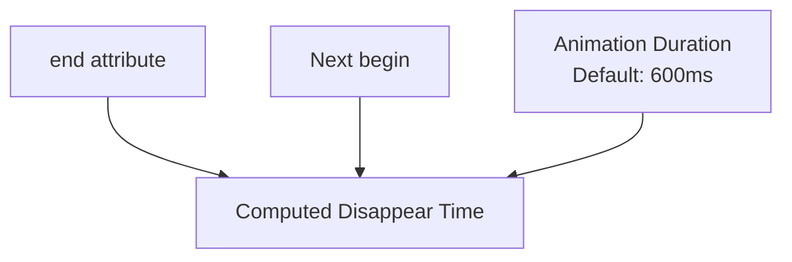

The disappear time is calculated as `min(span_end, next_span_begin - animation_duration)` to prevent overlap during transitions.

**Sources:** Diagram 5 (TimestampCalc, compute_disappear_times), [CHANGELOG.md L107-L108](https://github.com/HKLHaoBin/LyricSphere/blob/7864cfe0/CHANGELOG.md#L107-L108)

## Conversion from LYS/LRC to TTML

### Apple-Style TTML Generation

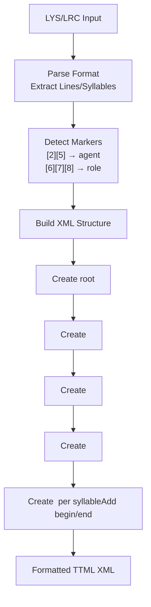

**Sources:** [README.md L128](https://github.com/HKLHaoBin/LyricSphere/blob/7864cfe0/README.md#L128-L128)

 Diagram 5 (ToTTML)

### Translation Merging

When converting with translation, the system can merge original and translated lyrics into a single TTML document:

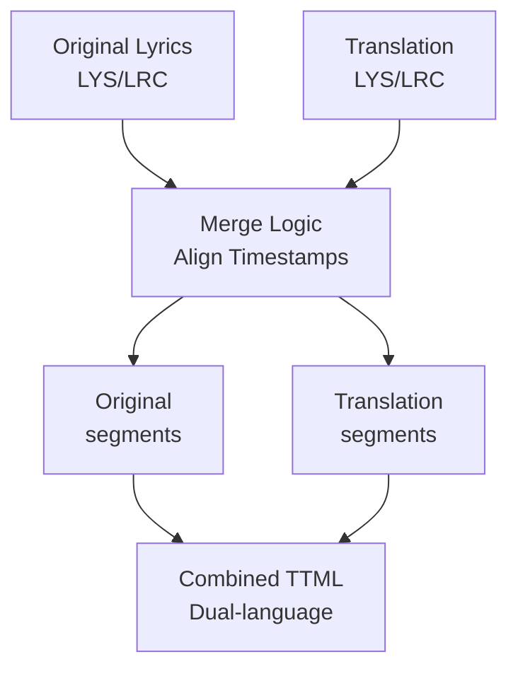

Each language appears in separate `<p>` elements with synchronized timestamps, enabling side-by-side or alternating display.

**Sources:** [README.md L128](https://github.com/HKLHaoBin/LyricSphere/blob/7864cfe0/README.md#L128-L128)

### Temporary TTML Conversion

The system provides temporary TTML conversion for AMLL rule writing via `/convert_to_ttml_temp`:

| Feature | Implementation |
| --- | --- |
| Input formats | LYS, LRC |
| Output format | Apple-style TTML |
| Caching | 10-minute TTL in `TEMP_TTML_FILES` |
| Use case | AMLL rule editor preview |
| Cleanup | Automatic expiration after 10 minutes |

**Sources:** [backend.py L53-L54](https://github.com/HKLHaoBin/LyricSphere/blob/7864cfe0/backend.py#L53-L54)

 [CHANGELOG.md L39](https://github.com/HKLHaoBin/LyricSphere/blob/7864cfe0/CHANGELOG.md#L39-L39)

## Code Entity Reference

### Key Functions and Data Structures

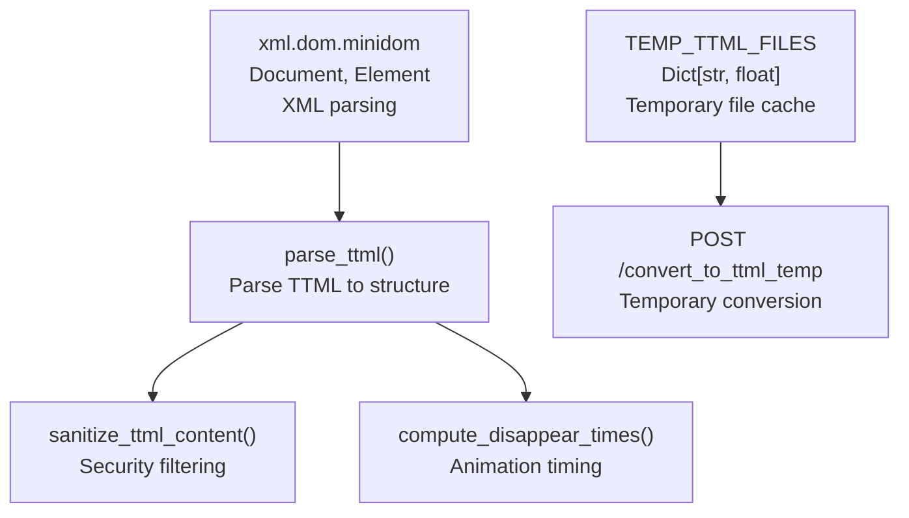

**Sources:** [backend.py L53-L54](https://github.com/HKLHaoBin/LyricSphere/blob/7864cfe0/backend.py#L53-L54)

 [backend.py L37-L39](https://github.com/HKLHaoBin/LyricSphere/blob/7864cfe0/backend.py#L37-L39)

### Parser Configuration

| Constant | Value | Purpose |
| --- | --- | --- |
| `TEMP_TTML_TTL_SEC` | `10 * 60` (600 seconds) | Temporary file expiration time |
| Animation default duration | `600ms` | Default for entry/move/exit animations |

**Sources:** [backend.py L54](https://github.com/HKLHaoBin/LyricSphere/blob/7864cfe0/backend.py#L54-L54)

 [CHANGELOG.md L112](https://github.com/HKLHaoBin/LyricSphere/blob/7864cfe0/CHANGELOG.md#L112-L112)

## Use Cases and Integration

### Apple Music Compatibility

TTML format is designed for Apple Music-style lyric display with:

* Word-by-word highlighting using `<span>` timing
* Background vocal differentiation via `ttm:role="x-bg"`
* Duet support via `ttm:agent="v2"`
* Smooth animation transitions using computed disappear times

**Sources:** [README.md L119](https://github.com/HKLHaoBin/LyricSphere/blob/7864cfe0/README.md#L119-L119)

### AMLL Rule Writing

The AMLL (Advanced Music Live Lyrics) integration uses TTML for rule authoring:

1. User edits lyrics in LYS/LRC format
2. System converts to temporary TTML via `/convert_to_ttml_temp`
3. AMLL rule editor displays TTML structure
4. Rules reference TTML elements for custom animations
5. Temporary TTML expires after 10 minutes

**Sources:** [CHANGELOG.md L39](https://github.com/HKLHaoBin/LyricSphere/blob/7864cfe0/CHANGELOG.md#L39-L39)

 [backend.py L53-L54](https://github.com/HKLHaoBin/LyricSphere/blob/7864cfe0/backend.py#L53-L54)

### Player Integration

TTML is consumed by player interfaces through:

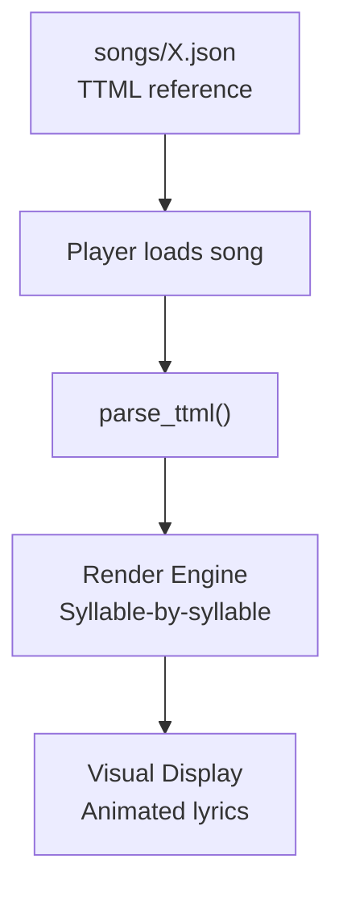

The player engine:

* Parses TTML on load
* Builds animation timeline from `begin`/`end` attributes
* Applies different styling for `ttm:role="x-bg"` lines
* Renders `ttm:agent="v2"` lines in distinct colors/positions

**Sources:** Diagram 4 (Real-time Communication), [README.md L119](https://github.com/HKLHaoBin/LyricSphere/blob/7864cfe0/README.md#L119-L119)

## Security Considerations

### XML Injection Prevention

The TTML sanitizer prevents common XML attacks:

* **External entity injection**: All external references stripped
* **Script injection**: No `<script>` tags allowed
* **Style injection**: No `<style>` tags allowed
* **Attribute injection**: Only whitelisted attributes preserved

**Sources:** [README.md L36](https://github.com/HKLHaoBin/LyricSphere/blob/7864cfe0/README.md#L36-L36)

### Whitelist Implementation

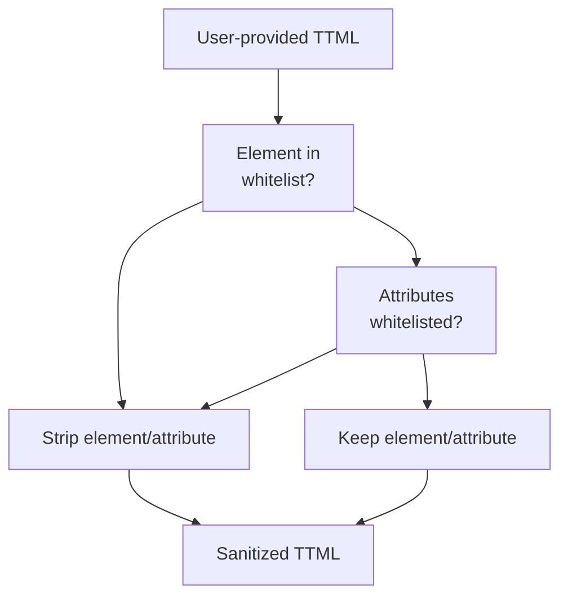

Whitelisted elements: `tt`, `body`, `div`, `p`, `span`  

Whitelisted attributes: `begin`, `end`, `ttm:role`, `ttm:agent`

**Sources:** [README.md L36](https://github.com/HKLHaoBin/LyricSphere/blob/7864cfe0/README.md#L36-L36)

 Diagram 5 (TTML Sanitizer)