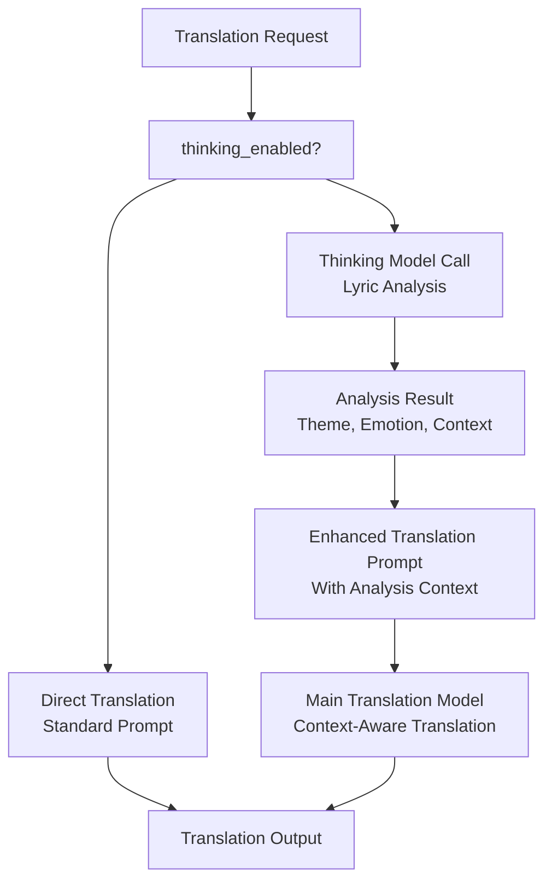
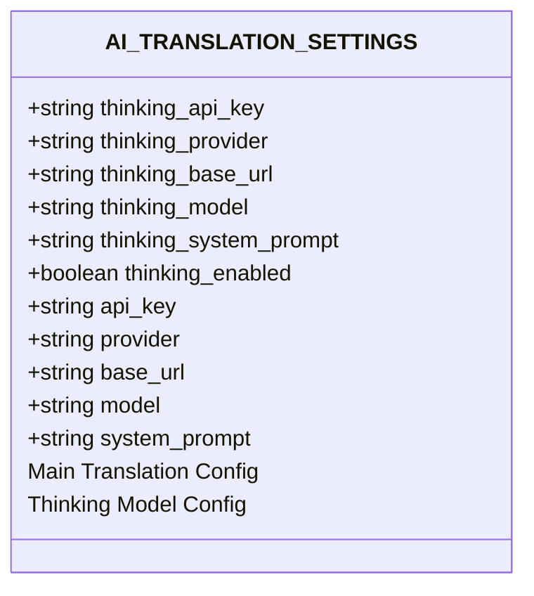
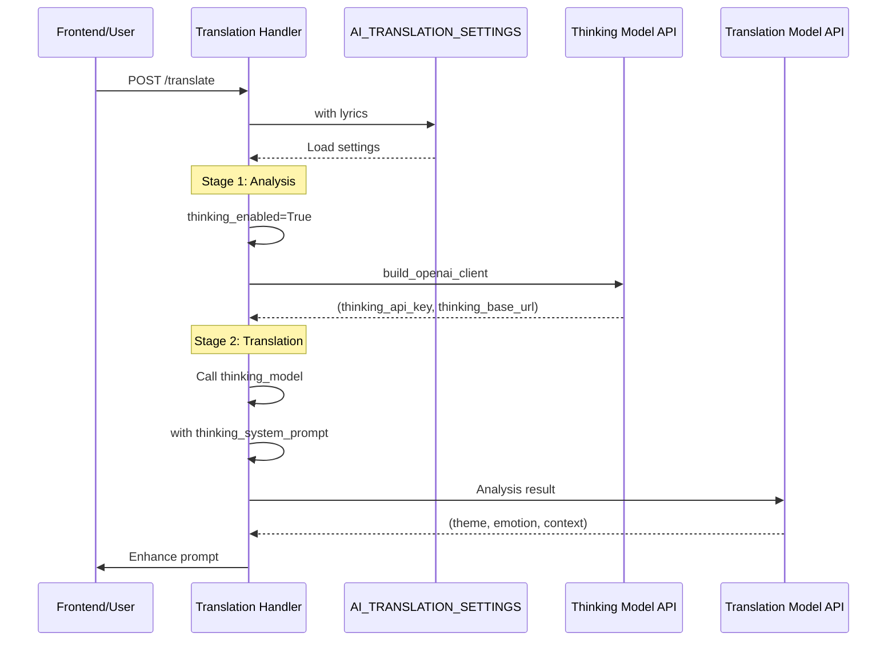
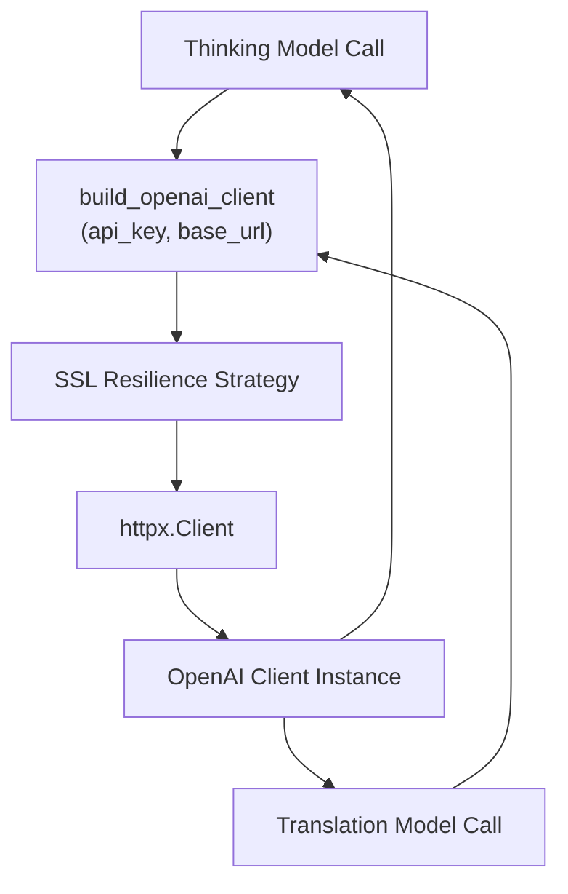
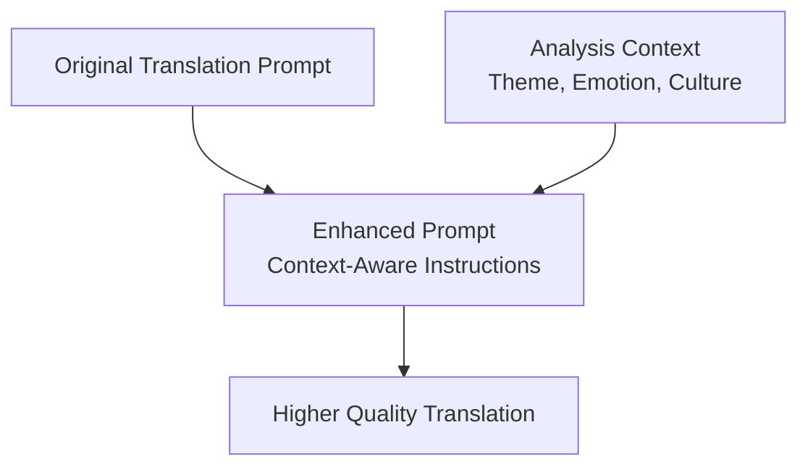

# Thinking Model Integration

> **Relevant source files**
> * [CHANGELOG.md](https://github.com/HKLHaoBin/LyricSphere/blob/7864cfe0/CHANGELOG.md)
> * [backend.py](https://github.com/HKLHaoBin/LyricSphere/blob/7864cfe0/backend.py)

This page documents the thinking model integration feature that implements a two-stage translation process for improved lyric translation quality. The thinking model performs deep analysis of lyrics before translation, generating insights about theme, emotion, cultural background, and translation challenges that inform the main translation stage.

For information about the overall translation workflow, see [Translation Workflow](/HKLHaoBin/LyricSphere/2.4.1-translation-workflow). For AI provider configuration details, see [AI Provider Configuration](/HKLHaoBin/LyricSphere/2.4.2-ai-provider-configuration).

---

## Overview and Architecture

The thinking model integration adds an optional pre-analysis stage to the translation pipeline. When enabled, the system calls a dedicated analysis model before the main translation model, using the analysis results to construct more contextually accurate translation prompts.

### Two-Stage Translation Architecture



**Sources:** [backend.py L1653-L1674](https://github.com/HKLHaoBin/LyricSphere/blob/7864cfe0/backend.py#L1653-L1674)

 Diagram 7 from high-level architecture

### Key Benefits

| Benefit | Description |
| --- | --- |
| **Cultural Understanding** | Analysis model identifies cultural references and contextual nuances |
| **Theme Recognition** | Explicit identification of song themes guides translation tone |
| **Emotional Accuracy** | Analysis captures emotional intent, ensuring tonal consistency |
| **Translation Difficulty Detection** | Pre-identifies challenging phrases or wordplay for special attention |
| **User Transparency** | Analysis results can be displayed to users for translation insights |

---

## Configuration Parameters

The thinking model system uses dedicated configuration parameters stored in the `AI_TRANSLATION_SETTINGS` dictionary, separate from the main translation model settings.

### Configuration Structure



**Sources:** [backend.py L1653-L1674](https://github.com/HKLHaoBin/LyricSphere/blob/7864cfe0/backend.py#L1653-L1674)

### Configuration Parameters Table

| Parameter | Type | Default Value | Description |
| --- | --- | --- | --- |
| `thinking_enabled` | boolean | `True` | Master switch to enable/disable thinking model |
| `thinking_api_key` | string | `''` | API key for thinking model provider |
| `thinking_provider` | string | `'deepseek'` | Provider name (deepseek, openai, etc.) |
| `thinking_base_url` | string | `'https://api.deepseek.com'` | Base URL for thinking model API |
| `thinking_model` | string | `'deepseek-reasoner'` | Model identifier for analysis |
| `thinking_system_prompt` | string | (see below) | System prompt guiding lyric analysis |

### Default Thinking System Prompt

The default prompt instructs the model to act as a senior lyric analyst:

```
你是一位资深的歌词分析师。请通读整首歌的歌词，生成对歌曲主题、情绪、叙事视角和潜在文化背景的综合理解，并指出可能影响翻译语气的关键细节。
```

Translation: *"You are a senior lyric analyst. Please read through the entire lyrics and generate a comprehensive understanding of the song's theme, emotion, narrative perspective, and potential cultural background, pointing out key details that may affect translation tone."*

**Sources:** [backend.py L1672-L1673](https://github.com/HKLHaoBin/LyricSphere/blob/7864cfe0/backend.py#L1672-L1673)

---

## Two-Stage Workflow

The thinking model integration implements a sequential two-stage process where analysis precedes and informs translation.

### Workflow Sequence



**Sources:** [backend.py L910-L947](https://github.com/HKLHaoBin/LyricSphere/blob/7864cfe0/backend.py#L910-L947)

 (`build_openai_client`), [backend.py L1653-L1674](https://github.com/HKLHaoBin/LyricSphere/blob/7864cfe0/backend.py#L1653-L1674)

 (configuration)

### Stage-by-Stage Processing

#### Stage 1: Analysis Phase

1. **Configuration Check**: Verify `thinking_enabled` is `True`
2. **Client Creation**: Call `build_openai_client()` with thinking model credentials
3. **Prompt Construction**: Use `thinking_system_prompt` as system message
4. **API Call**: Send original lyrics to thinking model
5. **Response Processing**: Extract analysis covering: * Song theme and subject matter * Emotional tone and intensity * Narrative perspective (first-person, third-person, etc.) * Cultural references and background * Translation challenges and key details

#### Stage 2: Translation Phase

1. **Prompt Enhancement**: Incorporate analysis results into translation prompt
2. **Client Creation**: Call `build_openai_client()` with main translation credentials
3. **Contextualized Translation**: Main model translates with full context
4. **Quality Validation**: Apply standard timestamp alignment and validation
5. **Result Compilation**: Return translation with optional analysis display

**Sources:** Diagram 7 from high-level architecture, [backend.py L1653-L1674](https://github.com/HKLHaoBin/LyricSphere/blob/7864cfe0/backend.py#L1653-L1674)

---

## Implementation Details

### Client Builder Integration

Both thinking and translation stages use the `build_openai_client()` function with provider-specific credentials:



**Sources:** [backend.py L910-L947](https://github.com/HKLHaoBin/LyricSphere/blob/7864cfe0/backend.py#L910-L947)

### SSL Resilience for Both Stages

The `build_openai_client()` function implements a three-tier fallback strategy that applies to both thinking and translation models:

1. **Default SSL Context**: Attempt standard certificate verification
2. **Certifi CA Bundle**: Fall back to `certifi.where()` with custom `httpx.Client`
3. **SSL Verification Disabled**: Last resort with warning logging

This ensures both analysis and translation stages can function even in environments with SSL certificate issues.

**Sources:** [backend.py L910-L947](https://github.com/HKLHaoBin/LyricSphere/blob/7864cfe0/backend.py#L910-L947)

### Configuration Storage and Defaults

The thinking model configuration is stored alongside main translation settings in `AI_TRANSLATION_SETTINGS`:

```css
AI_TRANSLATION_SETTINGS = {
    # Main translation settings
    'api_key': '',
    'provider': 'deepseek',
    'base_url': 'https://api.deepseek.com',
    'model': 'deepseek-reasoner',
    
    # Thinking model settings
    'thinking_enabled': True,
    'thinking_api_key': '',
    'thinking_provider': 'deepseek',
    'thinking_base_url': 'https://api.deepseek.com',
    'thinking_model': 'deepseek-reasoner',
    'thinking_system_prompt': '...'
}
```

A complete copy is stored in `AI_TRANSLATION_DEFAULTS` for reset functionality.

**Sources:** [backend.py L1653-L1676](https://github.com/HKLHaoBin/LyricSphere/blob/7864cfe0/backend.py#L1653-L1676)

---

## Analysis Results and Usage

### Analysis Output Structure

The thinking model generates structured analysis that covers multiple dimensions:

| Analysis Dimension | Description | Translation Impact |
| --- | --- | --- |
| **Theme** | Primary subject matter and message | Guides word choice and formality level |
| **Emotion** | Emotional tone and intensity | Controls translation expressiveness |
| **Narrative Perspective** | Point of view and speaker identity | Affects pronoun usage and voice |
| **Cultural Background** | References, idioms, historical context | Identifies elements requiring localization |
| **Key Details** | Wordplay, metaphors, critical phrases | Highlights translation challenges |

### Frontend Display Options

Analysis results can be displayed to users through the frontend interface, providing:

* **Transparency**: Users see what the model understands about the lyrics
* **Context**: Explanation of translation choices
* **Quality Insight**: Understanding of how analysis improves results
* **Educational Value**: Learning about cultural and linguistic nuances

### Prompt Enhancement Strategy



The analysis results are incorporated into the translation prompt, typically by:

1. Prepending context summary to user prompt
2. Adding specific translation guidelines based on detected themes
3. Including cultural notes for proper localization
4. Highlighting challenging elements for careful handling

**Sources:** Author notes, [backend.py L1653-L1674](https://github.com/HKLHaoBin/LyricSphere/blob/7864cfe0/backend.py#L1653-L1674)

---

## Configuration and Enabling

### Enabling Thinking Model

The thinking model is controlled by the `thinking_enabled` boolean flag in `AI_TRANSLATION_SETTINGS`. When disabled, the system skips the analysis stage and proceeds directly to translation.

### Provider Flexibility

Thinking and translation models can use different providers. Common configurations:

| Configuration | Thinking Model | Translation Model | Use Case |
| --- | --- | --- | --- |
| **Same Provider** | `deepseek-reasoner` | `deepseek-chat` | Unified API, consistent quality |
| **Specialized** | `deepseek-reasoner` | `gpt-4` | Deep analysis + high-quality translation |
| **Cost-Optimized** | `gpt-3.5-turbo` | `gpt-4` | Budget-friendly analysis, premium translation |

### Model Selection Criteria

Recommended models for thinking stage:

* **Reasoning Models**: `deepseek-reasoner`, models with chain-of-thought capabilities
* **Analysis-Focused**: Models trained on literary or analytical tasks
* **Context-Aware**: Models with large context windows for full lyric analysis

**Sources:** [backend.py L1653-L1674](https://github.com/HKLHaoBin/LyricSphere/blob/7864cfe0/backend.py#L1653-L1674)

 author notes

---

## Related Systems

* **Translation Workflow** [2.4.1](/HKLHaoBin/LyricSphere/2.4.1-translation-workflow): Overall translation pipeline
* **AI Provider Configuration** [2.4.2](/HKLHaoBin/LyricSphere/2.4.2-ai-provider-configuration): Multi-provider setup details
* **Lyrics Translation Interface** [3.5](/HKLHaoBin/LyricSphere/3.5-lyrics-translation-interface): Frontend translation controls

**Sources:** Wiki table of contents