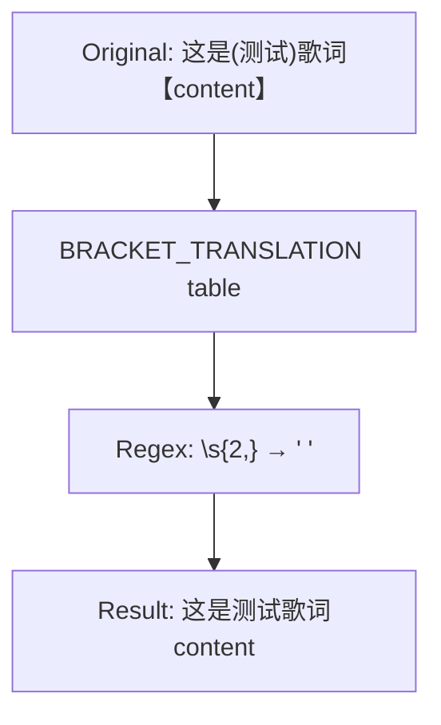
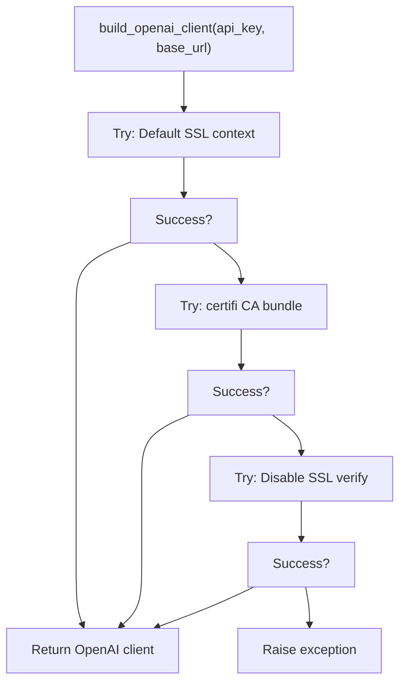
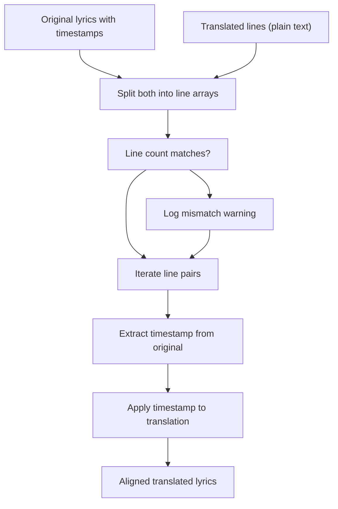

# Translation Workflow

> **Relevant source files**
> * [CHANGELOG.md](https://github.com/HKLHaoBin/LyricSphere/blob/7864cfe0/CHANGELOG.md)
> * [backend.py](https://github.com/HKLHaoBin/LyricSphere/blob/7864cfe0/backend.py)

## Purpose and Scope

This document describes the end-to-end workflow for AI-powered lyric translation in LyricSphere. The translation system processes lyric text through multiple stages—from request validation and preprocessing to API invocation and timestamp synchronization—before delivering aligned translated lyrics to the frontend.

For configuration details of AI providers and models, see [AI Provider Configuration](/HKLHaoBin/LyricSphere/2.4.2-ai-provider-configuration). For information about the optional two-stage translation process, see [Thinking Model Integration](/HKLHaoBin/LyricSphere/2.4.3-thinking-model-integration).

---

## Workflow Overview

The translation workflow consists of 10 sequential stages:

| Stage | Name | Description |
| --- | --- | --- |
| 1 | Request Reception | Frontend sends POST request to `/api/translate` with lyrics and configuration |
| 2 | Request Validation | Validates API key, model selection, and prompt configuration |
| 3 | Lyric Preprocessing | Optional bracket removal and timestamp anomaly detection |
| 4 | Thinking Model Analysis | Optional pre-translation analysis for context understanding |
| 5 | Prompt Construction | Builds system and user prompts, handles compatibility mode |
| 6 | Translation API Call | Invokes AI provider via OpenAI client with SSL fallback |
| 7 | Stream Processing | Real-time processing of streaming API responses |
| 8 | Timestamp Alignment | Synchronizes translated lines with original timestamps |
| 9 | Post-processing | Cleanup of extra whitespace and special character handling |
| 10 | Response Delivery | Returns translated text with status indicators |

---

## Complete Translation Flow

```mermaid
sequenceDiagram
  participant Frontend UI
  participant /api/translate
  participant Request Validator
  participant strip_bracket_blocks
  participant Thinking Model API
  participant Prompt Constructor
  participant build_openai_client
  participant Translation API
  participant Stream Processor
  participant Timestamp Aligner
  participant Post-processor

  Frontend UI->>/api/translate: POST lyrics + config
  /api/translate->>Request Validator: Validate API key, model, prompt
  loop [Validation fails]
    Request Validator-->>Frontend UI: 400 Bad Request
    Request Validator->>strip_bracket_blocks: Apply strip_brackets if enabled
    strip_bracket_blocks->>strip_bracket_blocks: Remove bracket characters
    strip_bracket_blocks->>strip_bracket_blocks: Cleanup redundant spaces
    strip_bracket_blocks->>Thinking Model API: Send lyrics for analysis
    Thinking Model API-->>Prompt Constructor: Return analysis context
    Prompt Constructor->>Prompt Constructor: Build system prompt
    Prompt Constructor->>Prompt Constructor: Build user prompt with lyrics
    Prompt Constructor->>Prompt Constructor: Merge system into user message
    Prompt Constructor->>build_openai_client: Create client with SSL fallback
    build_openai_client->>Translation API: Stream chat completion
    Translation API-->>Stream Processor: Chunk data
    Stream Processor->>Stream Processor: Parse delta content
    Stream Processor-->>Frontend UI: Progress update (SSE)
  end
  Stream Processor->>Timestamp Aligner: Align with original timestamps
  Timestamp Aligner->>Post-processor: Clean output
  Post-processor-->>Frontend UI: Translated lyrics + status
```

**Sources:** [backend.py L1654-L1676](https://github.com/HKLHaoBin/LyricSphere/blob/7864cfe0/backend.py#L1654-L1676)

 [backend.py L890-L947](https://github.com/HKLHaoBin/LyricSphere/blob/7864cfe0/backend.py#L890-L947)

 [backend.py L1810-L1816](https://github.com/HKLHaoBin/LyricSphere/blob/7864cfe0/backend.py#L1810-L1816)

---

## Stage 1: Request Reception

The translation workflow begins when the frontend sends a POST request to `/api/translate` containing:

**Request Payload Structure:**

```json
{
  "lyrics": "歌词内容...",
  "api_key": "sk-...",
  "base_url": "https://api.deepseek.com",
  "model": "deepseek-reasoner",
  "system_prompt": "翻译指导...",
  "strip_brackets": false,
  "compat_mode": false,
  "thinking_enabled": true,
  "thinking_api_key": "sk-...",
  "thinking_base_url": "https://api.deepseek.com",
  "thinking_model": "deepseek-reasoner",
  "thinking_system_prompt": "分析指导..."
}
```

The endpoint extracts configuration from the request body and merges it with the global `AI_TRANSLATION_SETTINGS` dictionary for default values.

**Sources:** [backend.py L1654-L1676](https://github.com/HKLHaoBin/LyricSphere/blob/7864cfe0/backend.py#L1654-L1676)

---

## Stage 2: Request Validation

The validation stage checks three critical configuration parameters:

| Parameter | Validation Rule | Error Response |
| --- | --- | --- |
| `api_key` | Non-empty string | 400: "缺少 API Key" |
| `model` | Non-empty string | 400: "缺少模型名称" |
| `system_prompt` | Non-empty after strip | Uses default from `AI_TRANSLATION_DEFAULTS` |

If validation succeeds, the workflow proceeds to preprocessing. Empty or whitespace-only prompts trigger fallback to the default system prompt defined in `AI_TRANSLATION_DEFAULTS`.

**Sources:** [backend.py L1654-L1676](https://github.com/HKLHaoBin/LyricSphere/blob/7864cfe0/backend.py#L1654-L1676)

---

## Stage 3: Lyric Preprocessing

### Bracket Removal

When `strip_brackets` is enabled, the `strip_bracket_blocks` function removes all bracket characters while preserving the enclosed text:



The function uses a pre-compiled character translation table (`BRACKET_TRANSLATION`) for performance, defined at [backend.py L1752](https://github.com/HKLHaoBin/LyricSphere/blob/7864cfe0/backend.py#L1752-L1752)

 Supported bracket types include: `()`, `（）`, `[]`, `【】`.

### Timestamp Detection

The preprocessor scans for timing tags using `NUMERIC_TAG_REGEX` pattern: `\(\d+,\d+\)`. Lines without timestamps are flagged for special handling during alignment.

**Sources:** [backend.py L1750-L1822](https://github.com/HKLHaoBin/LyricSphere/blob/7864cfe0/backend.py#L1750-L1822)

---

## Stage 4: Thinking Model Analysis (Optional)

When `thinking_enabled` is `True`, the system performs a two-stage translation:

```css
#mermaid-5gr1snpq26a{font-family:ui-sans-serif,-apple-system,system-ui,Segoe UI,Helvetica;font-size:16px;fill:#333;}@keyframes edge-animation-frame{from{stroke-dashoffset:0;}}@keyframes dash{to{stroke-dashoffset:0;}}#mermaid-5gr1snpq26a .edge-animation-slow{stroke-dasharray:9,5!important;stroke-dashoffset:900;animation:dash 50s linear infinite;stroke-linecap:round;}#mermaid-5gr1snpq26a .edge-animation-fast{stroke-dasharray:9,5!important;stroke-dashoffset:900;animation:dash 20s linear infinite;stroke-linecap:round;}#mermaid-5gr1snpq26a .error-icon{fill:#dddddd;}#mermaid-5gr1snpq26a .error-text{fill:#222222;stroke:#222222;}#mermaid-5gr1snpq26a .edge-thickness-normal{stroke-width:1px;}#mermaid-5gr1snpq26a .edge-thickness-thick{stroke-width:3.5px;}#mermaid-5gr1snpq26a .edge-pattern-solid{stroke-dasharray:0;}#mermaid-5gr1snpq26a .edge-thickness-invisible{stroke-width:0;fill:none;}#mermaid-5gr1snpq26a .edge-pattern-dashed{stroke-dasharray:3;}#mermaid-5gr1snpq26a .edge-pattern-dotted{stroke-dasharray:2;}#mermaid-5gr1snpq26a .marker{fill:#999;stroke:#999;}#mermaid-5gr1snpq26a .marker.cross{stroke:#999;}#mermaid-5gr1snpq26a svg{font-family:ui-sans-serif,-apple-system,system-ui,Segoe UI,Helvetica;font-size:16px;}#mermaid-5gr1snpq26a p{margin:0;}#mermaid-5gr1snpq26a defs #statediagram-barbEnd{fill:#999;stroke:#999;}#mermaid-5gr1snpq26a g.stateGroup text{fill:#dddddd;stroke:none;font-size:10px;}#mermaid-5gr1snpq26a g.stateGroup text{fill:#333;stroke:none;font-size:10px;}#mermaid-5gr1snpq26a g.stateGroup .state-title{font-weight:bolder;fill:#333;}#mermaid-5gr1snpq26a g.stateGroup rect{fill:#ffffff;stroke:#dddddd;}#mermaid-5gr1snpq26a g.stateGroup line{stroke:#999;stroke-width:1;}#mermaid-5gr1snpq26a .transition{stroke:#999;stroke-width:1;fill:none;}#mermaid-5gr1snpq26a .stateGroup .composit{fill:#f4f4f4;border-bottom:1px;}#mermaid-5gr1snpq26a .stateGroup .alt-composit{fill:#e0e0e0;border-bottom:1px;}#mermaid-5gr1snpq26a .state-note{stroke:#e6d280;fill:#fff5ad;}#mermaid-5gr1snpq26a .state-note text{fill:#333;stroke:none;font-size:10px;}#mermaid-5gr1snpq26a .stateLabel .box{stroke:none;stroke-width:0;fill:#ffffff;opacity:0.5;}#mermaid-5gr1snpq26a .edgeLabel .label rect{fill:#ffffff;opacity:0.5;}#mermaid-5gr1snpq26a .edgeLabel{background-color:#ffffff;text-align:center;}#mermaid-5gr1snpq26a .edgeLabel p{background-color:#ffffff;}#mermaid-5gr1snpq26a .edgeLabel rect{opacity:0.5;background-color:#ffffff;fill:#ffffff;}#mermaid-5gr1snpq26a .edgeLabel .label text{fill:#333;}#mermaid-5gr1snpq26a .label div .edgeLabel{color:#333;}#mermaid-5gr1snpq26a .stateLabel text{fill:#333;font-size:10px;font-weight:bold;}#mermaid-5gr1snpq26a .node circle.state-start{fill:#999;stroke:#999;}#mermaid-5gr1snpq26a .node .fork-join{fill:#999;stroke:#999;}#mermaid-5gr1snpq26a .node circle.state-end{fill:#dddddd;stroke:#f4f4f4;stroke-width:1.5;}#mermaid-5gr1snpq26a .end-state-inner{fill:#f4f4f4;stroke-width:1.5;}#mermaid-5gr1snpq26a .node rect{fill:#ffffff;stroke:#dddddd;stroke-width:1px;}#mermaid-5gr1snpq26a .node polygon{fill:#ffffff;stroke:#dddddd;stroke-width:1px;}#mermaid-5gr1snpq26a #statediagram-barbEnd{fill:#999;}#mermaid-5gr1snpq26a .statediagram-cluster rect{fill:#ffffff;stroke:#dddddd;stroke-width:1px;}#mermaid-5gr1snpq26a .cluster-label,#mermaid-5gr1snpq26a .nodeLabel{color:#333;}#mermaid-5gr1snpq26a .statediagram-cluster rect.outer{rx:5px;ry:5px;}#mermaid-5gr1snpq26a .statediagram-state .divider{stroke:#dddddd;}#mermaid-5gr1snpq26a .statediagram-state .title-state{rx:5px;ry:5px;}#mermaid-5gr1snpq26a .statediagram-cluster.statediagram-cluster .inner{fill:#f4f4f4;}#mermaid-5gr1snpq26a .statediagram-cluster.statediagram-cluster-alt .inner{fill:#f8f8f8;}#mermaid-5gr1snpq26a .statediagram-cluster .inner{rx:0;ry:0;}#mermaid-5gr1snpq26a .statediagram-state rect.basic{rx:5px;ry:5px;}#mermaid-5gr1snpq26a .statediagram-state rect.divider{stroke-dasharray:10,10;fill:#f8f8f8;}#mermaid-5gr1snpq26a .note-edge{stroke-dasharray:5;}#mermaid-5gr1snpq26a .statediagram-note rect{fill:#fff5ad;stroke:#e6d280;stroke-width:1px;rx:0;ry:0;}#mermaid-5gr1snpq26a .statediagram-note rect{fill:#fff5ad;stroke:#e6d280;stroke-width:1px;rx:0;ry:0;}#mermaid-5gr1snpq26a .statediagram-note text{fill:#333;}#mermaid-5gr1snpq26a .statediagram-note .nodeLabel{color:#333;}#mermaid-5gr1snpq26a .statediagram .edgeLabel{color:red;}#mermaid-5gr1snpq26a #dependencyStart,#mermaid-5gr1snpq26a #dependencyEnd{fill:#999;stroke:#999;stroke-width:1;}#mermaid-5gr1snpq26a .statediagramTitleText{text-anchor:middle;font-size:18px;fill:#333;}#mermaid-5gr1snpq26a :root{--mermaid-font-family:"trebuchet ms",verdana,arial,sans-serif;}enabled=Trueenabled=Falsecontext addedCheckThinkingEnabledBuildThinkingPromptBuildTranslationPromptCallThinkingAPIParseAnalysisCallTranslationAPI
```

The thinking model uses separate configuration:

* **API Key:** `thinking_api_key`
* **Base URL:** `thinking_base_url`
* **Model:** `thinking_model` (e.g., `deepseek-reasoner`)
* **System Prompt:** `thinking_system_prompt` (analysis instructions)

The analysis output is appended to the translation prompt as additional context, improving translation quality by providing thematic understanding and cultural background.

**Sources:** [backend.py L1669-L1674](https://github.com/HKLHaoBin/LyricSphere/blob/7864cfe0/backend.py#L1669-L1674)

---

## Stage 5: Prompt Construction

### Standard Mode

In standard mode, the system constructs two separate messages:

```
messages = [
    {"role": "system", "content": system_prompt},
    {"role": "user", "content": user_lyrics_content}
]
```

### Compatibility Mode

When `compat_mode` is `True`, the system merges the system prompt into the user message to support models that only accept single-role conversations:

```
messages = [
    {"role": "user", "content": f"{system_prompt}\n\n{user_lyrics_content}"}
]
```

The `parse_bool` utility function [backend.py L1740-L1748](https://github.com/HKLHaoBin/LyricSphere/blob/7864cfe0/backend.py#L1740-L1748)

 handles boolean conversion from various input formats (strings, integers, booleans).

**Sources:** [backend.py L1740-L1748](https://github.com/HKLHaoBin/LyricSphere/blob/7864cfe0/backend.py#L1740-L1748)

---

## Stage 6: Translation API Invocation

### OpenAI Client Construction

The `build_openai_client` function implements a three-tier SSL fallback strategy:



The SSL fallback sequence:

1. **Default:** Use system SSL certificates
2. **Certifi Fallback:** Load CA bundle from `certifi.where()` via custom `httpx.Client`
3. **Insecure Fallback:** Disable SSL verification (logs warning)

### API Call Execution

The client invokes the streaming chat completion endpoint:

```sql
stream = client.chat.completions.create(
    model=model,
    messages=messages,
    stream=True
)
```

**Sources:** [backend.py L890-L947](https://github.com/HKLHaoBin/LyricSphere/blob/7864cfe0/backend.py#L890-L947)

---

## Stage 7: Streaming Response Processing

### Chunk Parsing

The stream handler iterates over response chunks, extracting delta content:

```sql
for chunk in stream:
    if chunk.choices:
        delta = chunk.choices[0].delta
        if delta.content:
            accumulated_text += delta.content
            # Send progress update to frontend
```

### Progress Updates

During streaming, the system sends Server-Sent Events (SSE) to the frontend with status updates:

| Status | Description | Trigger |
| --- | --- | --- |
| `preparing` | Initial validation | Request received |
| `analyzing` | Thinking model active | Thinking API call |
| `translating` | Main translation | Translation API streaming |
| `completed` | Success | Full response received |
| `error` | Failure | Exception caught |

### Reasoning Extraction

For models like `deepseek-reasoner`, the system extracts reasoning chains from the response metadata for debugging purposes.

**Sources:** [backend.py L890-L947](https://github.com/HKLHaoBin/LyricSphere/blob/7864cfe0/backend.py#L890-L947)

---

## Stage 8: Timestamp Alignment

### Alignment Algorithm

The timestamp aligner synchronizes translated lines with original lyric timestamps:



**Line Count Validation:**

* If line counts differ, the system logs a warning but proceeds with alignment
* Missing timestamps are preserved as empty strings
* Extra translated lines retain their content without timestamps

**Sources:** [backend.py L2292-L2469](https://github.com/HKLHaoBin/LyricSphere/blob/7864cfe0/backend.py#L2292-L2469)

---

## Stage 9: Post-processing

### Whitespace Cleanup

The post-processor removes redundant whitespace:

```
cleaned = re.sub(r'\s{2,}', ' ', translated_text)
```

### Special Character Handling

The system preserves timing tags in the format `(start,duration)` and font-family metadata tags `[font-family:...]` during translation.

**Sources:** [backend.py L1810-L1822](https://github.com/HKLHaoBin/LyricSphere/blob/7864cfe0/backend.py#L1810-L1822)

---

## Stage 10: Response Delivery

### Response Structure

The translation endpoint returns a JSON response:

```json
{
  "status": "success",
  "translated_lyrics": "翻译后的歌词...",
  "original_line_count": 42,
  "translated_line_count": 42,
  "has_timestamps": true,
  "warnings": []
}
```

### Status Codes

| Code | Meaning | Scenario |
| --- | --- | --- |
| 200 | Success | Translation completed |
| 400 | Bad Request | Invalid configuration |
| 403 | Forbidden | Authentication failed |
| 500 | Server Error | API call failed |

**Sources:** [backend.py L586-L605](https://github.com/HKLHaoBin/LyricSphere/blob/7864cfe0/backend.py#L586-L605)

---

## Translation State Machine

```css
#mermaid-rm6e68w8g4r{font-family:ui-sans-serif,-apple-system,system-ui,Segoe UI,Helvetica;font-size:16px;fill:#333;}@keyframes edge-animation-frame{from{stroke-dashoffset:0;}}@keyframes dash{to{stroke-dashoffset:0;}}#mermaid-rm6e68w8g4r .edge-animation-slow{stroke-dasharray:9,5!important;stroke-dashoffset:900;animation:dash 50s linear infinite;stroke-linecap:round;}#mermaid-rm6e68w8g4r .edge-animation-fast{stroke-dasharray:9,5!important;stroke-dashoffset:900;animation:dash 20s linear infinite;stroke-linecap:round;}#mermaid-rm6e68w8g4r .error-icon{fill:#dddddd;}#mermaid-rm6e68w8g4r .error-text{fill:#222222;stroke:#222222;}#mermaid-rm6e68w8g4r .edge-thickness-normal{stroke-width:1px;}#mermaid-rm6e68w8g4r .edge-thickness-thick{stroke-width:3.5px;}#mermaid-rm6e68w8g4r .edge-pattern-solid{stroke-dasharray:0;}#mermaid-rm6e68w8g4r .edge-thickness-invisible{stroke-width:0;fill:none;}#mermaid-rm6e68w8g4r .edge-pattern-dashed{stroke-dasharray:3;}#mermaid-rm6e68w8g4r .edge-pattern-dotted{stroke-dasharray:2;}#mermaid-rm6e68w8g4r .marker{fill:#999;stroke:#999;}#mermaid-rm6e68w8g4r .marker.cross{stroke:#999;}#mermaid-rm6e68w8g4r svg{font-family:ui-sans-serif,-apple-system,system-ui,Segoe UI,Helvetica;font-size:16px;}#mermaid-rm6e68w8g4r p{margin:0;}#mermaid-rm6e68w8g4r defs #statediagram-barbEnd{fill:#999;stroke:#999;}#mermaid-rm6e68w8g4r g.stateGroup text{fill:#dddddd;stroke:none;font-size:10px;}#mermaid-rm6e68w8g4r g.stateGroup text{fill:#333;stroke:none;font-size:10px;}#mermaid-rm6e68w8g4r g.stateGroup .state-title{font-weight:bolder;fill:#333;}#mermaid-rm6e68w8g4r g.stateGroup rect{fill:#ffffff;stroke:#dddddd;}#mermaid-rm6e68w8g4r g.stateGroup line{stroke:#999;stroke-width:1;}#mermaid-rm6e68w8g4r .transition{stroke:#999;stroke-width:1;fill:none;}#mermaid-rm6e68w8g4r .stateGroup .composit{fill:#f4f4f4;border-bottom:1px;}#mermaid-rm6e68w8g4r .stateGroup .alt-composit{fill:#e0e0e0;border-bottom:1px;}#mermaid-rm6e68w8g4r .state-note{stroke:#e6d280;fill:#fff5ad;}#mermaid-rm6e68w8g4r .state-note text{fill:#333;stroke:none;font-size:10px;}#mermaid-rm6e68w8g4r .stateLabel .box{stroke:none;stroke-width:0;fill:#ffffff;opacity:0.5;}#mermaid-rm6e68w8g4r .edgeLabel .label rect{fill:#ffffff;opacity:0.5;}#mermaid-rm6e68w8g4r .edgeLabel{background-color:#ffffff;text-align:center;}#mermaid-rm6e68w8g4r .edgeLabel p{background-color:#ffffff;}#mermaid-rm6e68w8g4r .edgeLabel rect{opacity:0.5;background-color:#ffffff;fill:#ffffff;}#mermaid-rm6e68w8g4r .edgeLabel .label text{fill:#333;}#mermaid-rm6e68w8g4r .label div .edgeLabel{color:#333;}#mermaid-rm6e68w8g4r .stateLabel text{fill:#333;font-size:10px;font-weight:bold;}#mermaid-rm6e68w8g4r .node circle.state-start{fill:#999;stroke:#999;}#mermaid-rm6e68w8g4r .node .fork-join{fill:#999;stroke:#999;}#mermaid-rm6e68w8g4r .node circle.state-end{fill:#dddddd;stroke:#f4f4f4;stroke-width:1.5;}#mermaid-rm6e68w8g4r .end-state-inner{fill:#f4f4f4;stroke-width:1.5;}#mermaid-rm6e68w8g4r .node rect{fill:#ffffff;stroke:#dddddd;stroke-width:1px;}#mermaid-rm6e68w8g4r .node polygon{fill:#ffffff;stroke:#dddddd;stroke-width:1px;}#mermaid-rm6e68w8g4r #statediagram-barbEnd{fill:#999;}#mermaid-rm6e68w8g4r .statediagram-cluster rect{fill:#ffffff;stroke:#dddddd;stroke-width:1px;}#mermaid-rm6e68w8g4r .cluster-label,#mermaid-rm6e68w8g4r .nodeLabel{color:#333;}#mermaid-rm6e68w8g4r .statediagram-cluster rect.outer{rx:5px;ry:5px;}#mermaid-rm6e68w8g4r .statediagram-state .divider{stroke:#dddddd;}#mermaid-rm6e68w8g4r .statediagram-state .title-state{rx:5px;ry:5px;}#mermaid-rm6e68w8g4r .statediagram-cluster.statediagram-cluster .inner{fill:#f4f4f4;}#mermaid-rm6e68w8g4r .statediagram-cluster.statediagram-cluster-alt .inner{fill:#f8f8f8;}#mermaid-rm6e68w8g4r .statediagram-cluster .inner{rx:0;ry:0;}#mermaid-rm6e68w8g4r .statediagram-state rect.basic{rx:5px;ry:5px;}#mermaid-rm6e68w8g4r .statediagram-state rect.divider{stroke-dasharray:10,10;fill:#f8f8f8;}#mermaid-rm6e68w8g4r .note-edge{stroke-dasharray:5;}#mermaid-rm6e68w8g4r .statediagram-note rect{fill:#fff5ad;stroke:#e6d280;stroke-width:1px;rx:0;ry:0;}#mermaid-rm6e68w8g4r .statediagram-note rect{fill:#fff5ad;stroke:#e6d280;stroke-width:1px;rx:0;ry:0;}#mermaid-rm6e68w8g4r .statediagram-note text{fill:#333;}#mermaid-rm6e68w8g4r .statediagram-note .nodeLabel{color:#333;}#mermaid-rm6e68w8g4r .statediagram .edgeLabel{color:red;}#mermaid-rm6e68w8g4r #dependencyStart,#mermaid-rm6e68w8g4r #dependencyEnd{fill:#999;stroke:#999;stroke-width:1;}#mermaid-rm6e68w8g4r .statediagramTitleText{text-anchor:middle;font-size:18px;fill:#333;}#mermaid-rm6e68w8g4r :root{--mermaid-font-family:"trebuchet ms",verdana,arial,sans-serif;}POST /api/translateExtract configValidation passedValidation failedThinking enabledThinking disabledAnalysis completeThinking API errorAPI call initiatedPrompt build failedStream completeAPI errorTimestamps syncedSync warnings loggedCleanup doneReturn responseReturn error responseIdlePreparingValidatingPreprocessingErrorAnalyzingPromptingTranslatingAligningPostprocessingCompleted
```

**Sources:** [backend.py L1654-L1676](https://github.com/HKLHaoBin/LyricSphere/blob/7864cfe0/backend.py#L1654-L1676)

---

## Error Handling

### Network Errors

**SSL Certificate Errors:**

* **Cause:** Missing or invalid SSL certificates
* **Recovery:** Three-tier fallback (default → certifi → insecure)
* **Logging:** Warning logged at each fallback level

**Timeout Errors:**

* **Cause:** API endpoint unreachable or slow
* **Recovery:** Configurable timeout via `httpx.Timeout(30.0)`
* **Response:** 500 error returned to frontend

### API Errors

**404 Not Found:**

* **Scenario:** Provider lacks `/v1/models` endpoint
* **Handling:** Gracefully skip liveness check, proceed with translation
* **Note:** Compatible with providers that don't support model listing

**401 Unauthorized:**

* **Cause:** Invalid API key
* **Recovery:** None; user must provide valid key
* **Response:** 400 error with message "API Key 无效"

**Rate Limiting (429):**

* **Cause:** Exceeded provider quota
* **Recovery:** None; user must wait or upgrade plan
* **Response:** 500 error with provider's rate limit message

### Timestamp Anomalies

**Missing Timestamps:**

* **Detection:** Lines without `(start,duration)` pattern
* **Handling:** Preserve line content, leave timestamp empty
* **Warning:** Logged but not blocking

**Mismatched Line Counts:**

* **Scenario:** Original has 40 lines, translation has 42 lines
* **Handling:** Align available lines, log warning
* **Result:** Extra lines kept without timestamps

**Sources:** [backend.py L890-L947](https://github.com/HKLHaoBin/LyricSphere/blob/7864cfe0/backend.py#L890-L947)

 [backend.py L1750-L1822](https://github.com/HKLHaoBin/LyricSphere/blob/7864cfe0/backend.py#L1750-L1822)

---

## Configuration Reference

### Global Settings Dictionary

The `AI_TRANSLATION_SETTINGS` dictionary stores persistent configuration:

| Key | Type | Default | Purpose |
| --- | --- | --- | --- |
| `api_key` | `str` | `''` | Main API authentication key |
| `system_prompt` | `str` | Multi-line string | Translation instructions |
| `provider` | `str` | `'deepseek'` | AI provider identifier |
| `base_url` | `str` | `'https://api.deepseek.com'` | API endpoint base URL |
| `model` | `str` | `'deepseek-reasoner'` | Model identifier |
| `expect_reasoning` | `bool` | `True` | Extract reasoning chains |
| `strip_brackets` | `bool` | `False` | Enable bracket removal |
| `compat_mode` | `bool` | `False` | Merge system into user prompt |
| `thinking_enabled` | `bool` | `True` | Enable two-stage translation |
| `thinking_api_key` | `str` | `''` | Thinking model API key |
| `thinking_provider` | `str` | `'deepseek'` | Thinking model provider |
| `thinking_base_url` | `str` | `'https://api.deepseek.com'` | Thinking model endpoint |
| `thinking_model` | `str` | `'deepseek-reasoner'` | Thinking model identifier |
| `thinking_system_prompt` | `str` | Multi-line string | Analysis instructions |

### Default System Prompt

The default prompt instructs the AI to:

1. Preserve original mood and emotion
2. Ensure accurate line-by-line correspondence
3. Maintain line numbering format (e.g., `1.翻译内容`)
4. Avoid adding explanations
5. Keep each line independent (no merging)

**Sources:** [backend.py L1654-L1676](https://github.com/HKLHaoBin/LyricSphere/blob/7864cfe0/backend.py#L1654-L1676)

---

## Integration Points

### Frontend Communication

**Request Initiation:**

* Frontend calls `translateLyrics()` JavaScript function
* Function serializes configuration from UI form fields
* Sends POST request with `Content-Type: application/json`

**Progress Display:**

* Frontend establishes SSE connection for real-time updates
* Progress bar reflects current stage (preparing → analyzing → translating → completed)
* Issue highlighter marks problematic lines after completion

### Storage Persistence

**Settings Persistence:**

* Configuration saved to browser localStorage after successful translation
* Keys: `aiTranslationSettings_*` for each setting
* Restored on page reload

**Translation History:**

* Not persisted; user must manually save translated lyrics
* Integration with Monaco editor for direct content replacement

**Sources:** [backend.py L1654-L1676](https://github.com/HKLHaoBin/LyricSphere/blob/7864cfe0/backend.py#L1654-L1676)