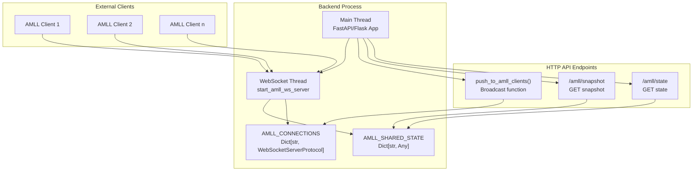
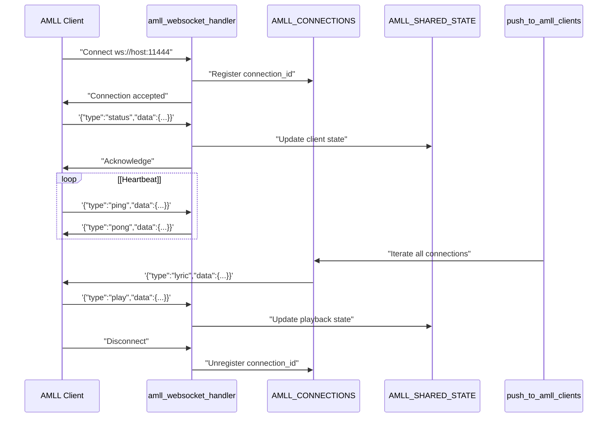
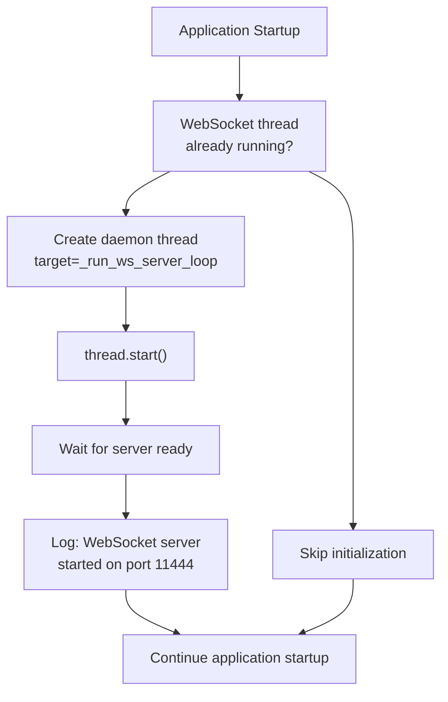
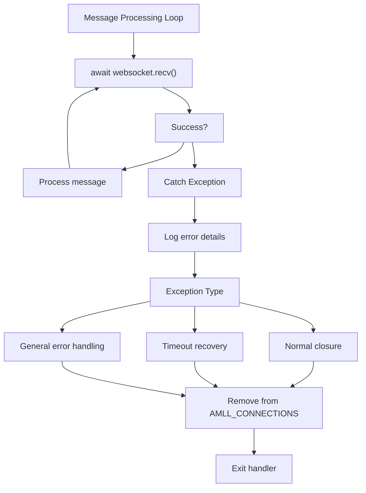

# WebSocket Server

> **Relevant source files**
> * [CLAUDE.md](https://github.com/HKLHaoBin/LyricSphere/blob/7864cfe0/CLAUDE.md)
> * [LICENSE](https://github.com/HKLHaoBin/LyricSphere/blob/7864cfe0/LICENSE)
> * [README.md](https://github.com/HKLHaoBin/LyricSphere/blob/7864cfe0/README.md)
> * [backend.py](https://github.com/HKLHaoBin/LyricSphere/blob/7864cfe0/backend.py)

This page documents the WebSocket server implementation in LyricSphere that enables real-time communication with AMLL (Advanced Music Live Lyrics) clients. The WebSocket server runs on port 11444 and provides bidirectional communication for lyric synchronization and playback control.

For information about Server-Sent Events (SSE) for browser-based lyric streaming, see [Server-Sent Events (SSE)](/HKLHaoBin/LyricSphere/2.5.2-server-sent-events-(sse)). For the AMLL web player integration, see [AMLL Player](/HKLHaoBin/LyricSphere/3.6.1-amll-player-(lyrics-style.html-amll-v1.html)).

## Architecture Overview

The WebSocket server operates as an independent component within the backend, running in its own thread to handle asynchronous communication with multiple AMLL clients simultaneously.



**Sources:** [backend.py L3300-L3350](https://github.com/HKLHaoBin/LyricSphere/blob/7864cfe0/backend.py#L3300-L3350)

 [backend.py L3480-L3530](https://github.com/HKLHaoBin/LyricSphere/blob/7864cfe0/backend.py#L3480-L3530)

## Server Configuration

The WebSocket server configuration is defined at the module level with the following constants:

| Constant | Value | Purpose |
| --- | --- | --- |
| `AMLL_WS_PORT` | `11444` | WebSocket server listening port |
| `AMLL_CONNECTIONS` | `Dict[str, WebSocketServerProtocol]` | Active client connections indexed by connection ID |
| `AMLL_SHARED_STATE` | `Dict[str, Any]` | Shared state data accessible to all clients |

The server is initialized at application startup through the `start_amll_ws_server` function, which launches the WebSocket server in a separate daemon thread to avoid blocking the main application.

**Sources:** [backend.py L3300-L3320](https://github.com/HKLHaoBin/LyricSphere/blob/7864cfe0/backend.py#L3300-L3320)

 [backend.py L3480-L3500](https://github.com/HKLHaoBin/LyricSphere/blob/7864cfe0/backend.py#L3480-L3500)

## Connection Management

### Connection Handler

Each client connection is managed by the `amll_websocket_handler` function, which performs the following operations:

```python
#mermaid-irz03dyz2uf{font-family:ui-sans-serif,-apple-system,system-ui,Segoe UI,Helvetica;font-size:16px;fill:#333;}@keyframes edge-animation-frame{from{stroke-dashoffset:0;}}@keyframes dash{to{stroke-dashoffset:0;}}#mermaid-irz03dyz2uf .edge-animation-slow{stroke-dasharray:9,5!important;stroke-dashoffset:900;animation:dash 50s linear infinite;stroke-linecap:round;}#mermaid-irz03dyz2uf .edge-animation-fast{stroke-dasharray:9,5!important;stroke-dashoffset:900;animation:dash 20s linear infinite;stroke-linecap:round;}#mermaid-irz03dyz2uf .error-icon{fill:#dddddd;}#mermaid-irz03dyz2uf .error-text{fill:#222222;stroke:#222222;}#mermaid-irz03dyz2uf .edge-thickness-normal{stroke-width:1px;}#mermaid-irz03dyz2uf .edge-thickness-thick{stroke-width:3.5px;}#mermaid-irz03dyz2uf .edge-pattern-solid{stroke-dasharray:0;}#mermaid-irz03dyz2uf .edge-thickness-invisible{stroke-width:0;fill:none;}#mermaid-irz03dyz2uf .edge-pattern-dashed{stroke-dasharray:3;}#mermaid-irz03dyz2uf .edge-pattern-dotted{stroke-dasharray:2;}#mermaid-irz03dyz2uf .marker{fill:#999;stroke:#999;}#mermaid-irz03dyz2uf .marker.cross{stroke:#999;}#mermaid-irz03dyz2uf svg{font-family:ui-sans-serif,-apple-system,system-ui,Segoe UI,Helvetica;font-size:16px;}#mermaid-irz03dyz2uf p{margin:0;}#mermaid-irz03dyz2uf defs #statediagram-barbEnd{fill:#999;stroke:#999;}#mermaid-irz03dyz2uf g.stateGroup text{fill:#dddddd;stroke:none;font-size:10px;}#mermaid-irz03dyz2uf g.stateGroup text{fill:#333;stroke:none;font-size:10px;}#mermaid-irz03dyz2uf g.stateGroup .state-title{font-weight:bolder;fill:#333;}#mermaid-irz03dyz2uf g.stateGroup rect{fill:#ffffff;stroke:#dddddd;}#mermaid-irz03dyz2uf g.stateGroup line{stroke:#999;stroke-width:1;}#mermaid-irz03dyz2uf .transition{stroke:#999;stroke-width:1;fill:none;}#mermaid-irz03dyz2uf .stateGroup .composit{fill:#f4f4f4;border-bottom:1px;}#mermaid-irz03dyz2uf .stateGroup .alt-composit{fill:#e0e0e0;border-bottom:1px;}#mermaid-irz03dyz2uf .state-note{stroke:#e6d280;fill:#fff5ad;}#mermaid-irz03dyz2uf .state-note text{fill:#333;stroke:none;font-size:10px;}#mermaid-irz03dyz2uf .stateLabel .box{stroke:none;stroke-width:0;fill:#ffffff;opacity:0.5;}#mermaid-irz03dyz2uf .edgeLabel .label rect{fill:#ffffff;opacity:0.5;}#mermaid-irz03dyz2uf .edgeLabel{background-color:#ffffff;text-align:center;}#mermaid-irz03dyz2uf .edgeLabel p{background-color:#ffffff;}#mermaid-irz03dyz2uf .edgeLabel rect{opacity:0.5;background-color:#ffffff;fill:#ffffff;}#mermaid-irz03dyz2uf .edgeLabel .label text{fill:#333;}#mermaid-irz03dyz2uf .label div .edgeLabel{color:#333;}#mermaid-irz03dyz2uf .stateLabel text{fill:#333;font-size:10px;font-weight:bold;}#mermaid-irz03dyz2uf .node circle.state-start{fill:#999;stroke:#999;}#mermaid-irz03dyz2uf .node .fork-join{fill:#999;stroke:#999;}#mermaid-irz03dyz2uf .node circle.state-end{fill:#dddddd;stroke:#f4f4f4;stroke-width:1.5;}#mermaid-irz03dyz2uf .end-state-inner{fill:#f4f4f4;stroke-width:1.5;}#mermaid-irz03dyz2uf .node rect{fill:#ffffff;stroke:#dddddd;stroke-width:1px;}#mermaid-irz03dyz2uf .node polygon{fill:#ffffff;stroke:#dddddd;stroke-width:1px;}#mermaid-irz03dyz2uf #statediagram-barbEnd{fill:#999;}#mermaid-irz03dyz2uf .statediagram-cluster rect{fill:#ffffff;stroke:#dddddd;stroke-width:1px;}#mermaid-irz03dyz2uf .cluster-label,#mermaid-irz03dyz2uf .nodeLabel{color:#333;}#mermaid-irz03dyz2uf .statediagram-cluster rect.outer{rx:5px;ry:5px;}#mermaid-irz03dyz2uf .statediagram-state .divider{stroke:#dddddd;}#mermaid-irz03dyz2uf .statediagram-state .title-state{rx:5px;ry:5px;}#mermaid-irz03dyz2uf .statediagram-cluster.statediagram-cluster .inner{fill:#f4f4f4;}#mermaid-irz03dyz2uf .statediagram-cluster.statediagram-cluster-alt .inner{fill:#f8f8f8;}#mermaid-irz03dyz2uf .statediagram-cluster .inner{rx:0;ry:0;}#mermaid-irz03dyz2uf .statediagram-state rect.basic{rx:5px;ry:5px;}#mermaid-irz03dyz2uf .statediagram-state rect.divider{stroke-dasharray:10,10;fill:#f8f8f8;}#mermaid-irz03dyz2uf .note-edge{stroke-dasharray:5;}#mermaid-irz03dyz2uf .statediagram-note rect{fill:#fff5ad;stroke:#e6d280;stroke-width:1px;rx:0;ry:0;}#mermaid-irz03dyz2uf .statediagram-note rect{fill:#fff5ad;stroke:#e6d280;stroke-width:1px;rx:0;ry:0;}#mermaid-irz03dyz2uf .statediagram-note text{fill:#333;}#mermaid-irz03dyz2uf .statediagram-note .nodeLabel{color:#333;}#mermaid-irz03dyz2uf .statediagram .edgeLabel{color:red;}#mermaid-irz03dyz2uf #dependencyStart,#mermaid-irz03dyz2uf #dependencyEnd{fill:#999;stroke:#999;stroke-width:1;}#mermaid-irz03dyz2uf .statediagramTitleText{text-anchor:middle;font-size:18px;fill:#333;}#mermaid-irz03dyz2uf :root{--mermaid-font-family:"trebuchet ms",verdana,arial,sans-serif;}"New WebSocket Connection""Generate connection_id""Add to AMLL_CONNECTIONS""Receive & handle messages""Connection closed/error""Remove from AMLL_CONNECTIONS""Exception raised""Log error"AcceptRegisterProcessMessagesUnregisterErrorHandler
```

The connection lifecycle is implemented with the following key steps:

1. **Connection Registration**: Generate a unique `connection_id` using `uuid.uuid4()` and store the WebSocket protocol object in `AMLL_CONNECTIONS`
2. **Message Processing**: Asynchronous loop receives and processes incoming JSON messages
3. **State Synchronization**: Update `AMLL_SHARED_STATE` based on client messages
4. **Connection Cleanup**: Remove connection from `AMLL_CONNECTIONS` on disconnect or error

**Sources:** [backend.py L3350-L3450](https://github.com/HKLHaoBin/LyricSphere/blob/7864cfe0/backend.py#L3350-L3450)

### Multi-Client Support

The server maintains concurrent connections using a dictionary structure:

* **Key**: Unique connection identifier (UUID string)
* **Value**: `websockets.WebSocketServerProtocol` instance

This design allows the server to:

* Broadcast messages to all connected clients simultaneously
* Target specific clients for unicast messages
* Track connection state independently per client
* Handle client disconnections gracefully without affecting other sessions

**Sources:** [backend.py L3300-L3320](https://github.com/HKLHaoBin/LyricSphere/blob/7864cfe0/backend.py#L3300-L3320)

 [backend.py L3600-L3650](https://github.com/HKLHaoBin/LyricSphere/blob/7864cfe0/backend.py#L3600-L3650)

## Message Format and Protocol

### Message Structure

All WebSocket messages use JSON format with a consistent structure:

```json
{
  "type": "message_type",
  "data": {
    "field1": "value1",
    "field2": "value2"
  }
}
```

| Field | Type | Required | Description |
| --- | --- | --- | --- |
| `type` | `string` | Yes | Message type identifier |
| `data` | `object` | Yes | Message payload (type-specific structure) |

### Message Types

The WebSocket protocol supports the following message types:

#### 1. Lyric Push Messages (type: "lyric")

Sent from server to client to deliver synchronized lyric content.

```json
{
  "type": "lyric",
  "data": {
    "time": 120.5,
    "text": "Hello World",
    "syllables": [
      {"start": 120.5, "duration": 0.3, "text": "Hel"},
      {"start": 120.8, "duration": 0.2, "text": "lo"}
    ]
  }
}
```

#### 2. Playback Control (type: "play" | "pause" | "stop")

Sent from client to server to control playback state.

```json
{
  "type": "play",
  "data": {
    "position": 45.2
  }
}
```

#### 3. Status Synchronization (type: "status")

Bidirectional message for state synchronization between client and server.

```json
{
  "type": "status",
  "data": {
    "playing": true,
    "currentTime": 67.3,
    "songId": "song_12345"
  }
}
```

#### 4. Heartbeat (type: "ping" | "pong")

Keepalive messages to detect connection health and prevent timeout.

```json
{
  "type": "ping",
  "data": {
    "timestamp": 1640000000000
  }
}
```

**Sources:** [backend.py L3350-L3450](https://github.com/HKLHaoBin/LyricSphere/blob/7864cfe0/backend.py#L3350-L3450)

## Message Flow

The following sequence diagram illustrates a typical message exchange session:



**Sources:** [backend.py L3350-L3450](https://github.com/HKLHaoBin/LyricSphere/blob/7864cfe0/backend.py#L3350-L3450)

 [backend.py L3600-L3650](https://github.com/HKLHaoBin/LyricSphere/blob/7864cfe0/backend.py#L3600-L3650)

## Implementation Details

### Server Initialization

The WebSocket server is started through the following initialization flow:



The server is initialized in `start_amll_ws_server()` which:

1. Checks if a WebSocket server thread is already running
2. Creates a new daemon thread executing `_run_ws_server_loop()`
3. Starts the thread and waits for server readiness
4. Logs the successful startup

**Sources:** [backend.py L3480-L3530](https://github.com/HKLHaoBin/LyricSphere/blob/7864cfe0/backend.py#L3480-L3530)

### Connection Handler Implementation

The `amll_websocket_handler` function implements the per-connection logic:

| Step | Function | Description |
| --- | --- | --- |
| 1 | Generate ID | `connection_id = str(uuid.uuid4())` |
| 2 | Register | `AMLL_CONNECTIONS[connection_id] = websocket` |
| 3 | Listen | `async for message in websocket` |
| 4 | Parse | `data = json.loads(message)` |
| 5 | Route | Dispatch based on `data["type"]` |
| 6 | Update State | Modify `AMLL_SHARED_STATE` as needed |
| 7 | Respond | `await websocket.send(json.dumps(response))` |
| 8 | Cleanup | `del AMLL_CONNECTIONS[connection_id]` |

**Sources:** [backend.py L3350-L3450](https://github.com/HKLHaoBin/LyricSphere/blob/7864cfe0/backend.py#L3350-L3450)

### Broadcasting to Clients

The `push_to_amll_clients` function broadcasts messages to all connected clients:

```python
def push_to_amll_clients(message_dict: dict):
    """
    Broadcast a message to all connected AMLL clients.
    
    Args:
        message_dict: Dictionary containing 'type' and 'data' fields
    """
```

The broadcast implementation:

1. Iterates through all connections in `AMLL_CONNECTIONS`
2. Serializes the message dictionary to JSON
3. Sends the message to each client asynchronously
4. Handles send failures gracefully (logs error, continues to next client)
5. Removes failed connections from the active connection pool

**Sources:** [backend.py L3600-L3650](https://github.com/HKLHaoBin/LyricSphere/blob/7864cfe0/backend.py#L3600-L3650)

## HTTP Integration Endpoints

The WebSocket server exposes complementary HTTP endpoints for state access:

### GET /amll/state

Returns the current shared state for all connected AMLL clients.

**Response Format:**

```json
{
  "connections": 2,
  "state": {
    "currentSong": "...",
    "playbackState": "..."
  }
}
```

### GET /amll/snapshot

Retrieves a snapshot of the current AMLL state including connection count and shared data.

**Response Format:**

```
{
  "timestamp": 1640000000000,
  "connections": 2,
  "snapshot": { ... }
}
```

These endpoints enable non-WebSocket clients (e.g., web browsers using fetch API) to query the current state without establishing a WebSocket connection.

**Sources:** [backend.py L3530-L3580](https://github.com/HKLHaoBin/LyricSphere/blob/7864cfe0/backend.py#L3530-L3580)

## Error Handling and Reliability

### Connection Error Handling

The WebSocket handler implements comprehensive error handling:



**Error Categories:**

1. **Connection Closed**: Client disconnects gracefully * Action: Remove from connection pool * Logging: Info level
2. **Timeout**: No message received within timeout period * Action: Remove stale connection * Logging: Warning level
3. **Parse Error**: Invalid JSON received * Action: Log error, continue processing * Logging: Error level
4. **Send Failure**: Cannot send message to client * Action: Mark connection as failed, remove from pool * Logging: Error level

**Sources:** [backend.py L3350-L3450](https://github.com/HKLHaoBin/LyricSphere/blob/7864cfe0/backend.py#L3350-L3450)

### Automatic Reconnection Support

While the server does not implement reconnection logic (client responsibility), it supports reconnection by:

1. **Connection ID Independence**: Each connection receives a new unique ID
2. **Stateless Protocol**: No server-side session state tied to connection lifetime
3. **State Restoration**: Clients can restore state by sending status messages after reconnection
4. **Idempotent Operations**: Repeated messages produce consistent results

**Sources:** [backend.py L3350-L3400](https://github.com/HKLHaoBin/LyricSphere/blob/7864cfe0/backend.py#L3350-L3400)

### Timeout Detection

The WebSocket server implements timeout detection through:

* **Read Timeout**: Configured at the WebSocket server level
* **Heartbeat Protocol**: Clients send periodic ping messages
* **Stale Connection Cleanup**: Connections without recent activity are removed

The combination of these mechanisms ensures that dead connections are detected and removed promptly, preventing resource leaks.

**Sources:** [backend.py L3480-L3530](https://github.com/HKLHaoBin/LyricSphere/blob/7864cfe0/backend.py#L3480-L3530)

## Integration with AMLL Clients

### Client Connection Procedure

AMLL clients integrate with the WebSocket server using the following steps:

1. **Establish Connection** ```javascript const ws = new WebSocket('ws://localhost:11444'); ```
2. **Subscribe to Lyric Stream** ```javascript ws.onmessage = (event) => {   const message = JSON.parse(event.data);   if (message.type === 'lyric') {     // Handle lyric update   } }; ```
3. **Send Playback Control** ```yaml ws.send(JSON.stringify({   type: 'play',   data: { position: 45.2 } })); ```
4. **Maintain Connection** ```javascript setInterval(() => {   ws.send(JSON.stringify({     type: 'ping',     data: { timestamp: Date.now() }   })); }, 30000); ```

**Sources:** [backend.py L3300-L3350](https://github.com/HKLHaoBin/LyricSphere/blob/7864cfe0/backend.py#L3300-L3350)

### Custom Message Extensions

The WebSocket server architecture supports extension with custom message types. To add a new message type:

1. Define the message structure in the protocol documentation
2. Add a handler case in `amll_websocket_handler` for the new `type` value
3. Implement the message processing logic
4. Update `AMLL_SHARED_STATE` or call appropriate backend functions

This extensibility allows the WebSocket server to accommodate future AMLL features without requiring architectural changes.

**Sources:** [backend.py L3350-L3450](https://github.com/HKLHaoBin/LyricSphere/blob/7864cfe0/backend.py#L3350-L3450)

---

**Complete Implementation Sources:** [backend.py L3300-L3700](https://github.com/HKLHaoBin/LyricSphere/blob/7864cfe0/backend.py#L3300-L3700)