# LyricSphere - 歌词管理与实时显示系统

[](https://www.python.org/downloads/)
[](https://fastapi.tiangolo.com/)

LyricSphere 是一个基于 Web 的歌词管理和实时显示系统，专为管理动态、时间同步的多格式歌词而设计。系统提供完整的歌词处理流水线，包括创建、编辑、翻译、转换和实时显示功能。

---

## 目录

- [项目概述](#项目概述)
- [核心功能](#核心功能)
- [技术栈](#技术栈)
- [快速开始](#快速开始)
- [系统架构](#系统架构)
- [后端系统](#后端系统)
- [API端点参考](#api端点参考)
- [文件管理与安全](#文件管理与安全)
- [安全认证系统](#安全认证系统)
- [歌词格式详解](#歌词格式详解)
- [AI翻译系统](#ai翻译系统)
- [实时通信](#实时通信)
- [前端界面系统](#前端界面系统)
- [功能模块](#功能模块)
- [总结与索引](#总结与索引)

---

## 项目概述

### 目标与范围

LyricSphere 是一个基于 Web 的歌词管理和实时显示系统，旨在为用户提供完整的歌词处理解决方案。系统支持多种歌词格式，提供实时显示功能，集成 AI 翻译能力，并具备完善的安全机制。

**核心目标：**
- 统一管理多种歌词格式（LRC、LYS、TTML、LQE）
- 提供实时歌词显示和同步动画
- 集成 AI 翻译，支持多提供商
- 确保文件操作和路径安全
- 提供便捷的批量导入导出功能

### 系统定位

LyricSphere 适用于以下场景：
- 音乐爱好者管理个人歌词库
- 歌词创作者进行歌词编辑和翻译
- 音乐应用集成歌词显示功能
- 歌词格式转换和迁移

---

## 核心功能

LyricSphere 提供完整的歌词管理流水线，涵盖创建、编辑、翻译、转换和实时显示：

| 功能类别 | 能力描述 |
| --- | ---|
| **格式支持** | LRC（行级计时）、LYS（音节级计时）、TTML（XML格式）、LQE（合并歌词+翻译） |
| **实时显示** | WebSocket 服务器（端口 11444）、Server-Sent Events（/amll/stream）、同步动画与可配置消失时间 |
| **AI 翻译** | 多提供商支持（DeepSeek、OpenAI、OpenRouter、Together、Groq）、流式响应、自动时间戳对齐 |
| **格式转换** | 双向 TTML↔LYS/LRC 转换、LQE 合并、CSV 导出 |
| **字体渲染** | 通过 `[font-family:...]` 元数据实现逐音节字体选择、多源加载（本地、Google Fonts、CDN）、脚本检测（CJK/拉丁） |
| **安全机制** | 设备认证（可信设备列表）、bcrypt 密码哈希、路径遍历防护、CORS 处理 |
| **文件管理** | 自动备份（7版本轮换）、长文件名哈希、导出资源完整性检查 |
| **批量操作** | ZIP 导入导出（包含资源收集）、已移动资源的路径重写 |

---

## 技术栈

### 后端技术

```mermaid
graph TD
    Python["Python 3.6+"] --> FastAPI["FastAPI Framework"]
    FastAPI --> Jinja2["Jinja2 模板引擎"]
    FastAPI --> Aiofiles["aiofiles 异步 I/O"]
    FastAPI --> OpenAI["OpenAI 客户端"]
    FastAPI --> Bcrypt["bcrypt 密码哈希"]
    FastAPI --> Websockets["websockets 库"]
    FastAPI --> Waitress["Waitress WSGI 服务器"]

    style Python fill:#3776ab
    style FastAPI fill:#009688
    style Jinja2 fill:#B4CA65
    style Aiofiles fill:#E37E33
    style OpenAI fill:#412991
    style Bcrypt fill:#4A7C59
    style Websockets fill:#010101
    style Waitress fill:#FFD43B
```

**核心依赖：**

| 包名 | 用途 |
| --- | ---|
| `fastapi` | 主后端框架，支持异步 |
| `uvicorn` | ASGI 服务器（开发环境） |
| `starlette` | FastAPI 使用的 Web 框架组件 |
| `jinja2` | HTML 模板渲染引擎 |
| `aiofiles` | 异步文件 I/O 操作 |
| `openai` | AI 翻译 API 客户端 |
| `bcrypt` | 认证密码哈希 |
| `websockets` | WebSocket 服务器（AMLL 集成） |

**可选依赖：**

| 包名 | 用途 |
| --- | ---|
| `Pillow` | 封面艺术图像处理 |
| `numpy` | 音频分析支持 |
| `librosa` | 音频特征提取 |

### 前端技术

- **HTML5** - 页面结构和语义
- **Monaco Editor** - 歌词编辑器（双面板）
- **Server-Sent Events** - 实时更新机制
- **WebSocket** - AMLL 桌面客户端集成

---

## 快速开始

### 前置要求

| 要求 | 版本 | 用途 |
| --- | --- | ---|
| Python | 3.6+ | 后端运行环境 |
| pip | 最新 | Python 包管理器 |
| 网络访问 | - | AI 翻译功能和外部字体加载 |

### 安装步骤

#### 1. 克隆仓库

```bash
git clone https://github.com/HKLHaoBin/LyricSphere
cd LyricSphere
```

#### 2. 安装依赖

LyricSphere 使用 FastAPI 作为后端框架（注意：不是 Flask，尽管有一些遗留文档提到 Flask）：

```bash
pip install fastapi uvicorn starlette jinja2 aiofiles openai bcrypt Pillow websockets requests python-multipart numpy librosa itsdangerous
```

或使用依赖文件：

```bash
pip install -r requirements-backend.txt
```

### 运行应用

#### 基本启动

执行 `backend.py` 模块启动应用：

```bash
python backend.py
```

这将在默认端口 **5000** 上启动服务器，并绑定到所有网络接口（`0.0.0.0`）。

#### 自定义端口

通过命令行参数指定自定义端口：

```bash
python backend.py 8080
```

#### 生产环境部署

对于生产环境，设置 `USE_WAITRESS` 环境变量使用 Waitress WSGI 服务器：

```bash
USE_WAITRESS=1 python backend.py
```

Waitress 相比开发服务器提供更好的性能和稳定性。

#### 调试日志

启用详细日志输出用于故障排查：

```bash
DEBUG_LOGGING=1 python backend.py
```

这将激活详细的控制台输出，显示请求处理、文件操作和 AI 翻译步骤。日志也会写入 `logs/upload.log`。

### 应用启动流程

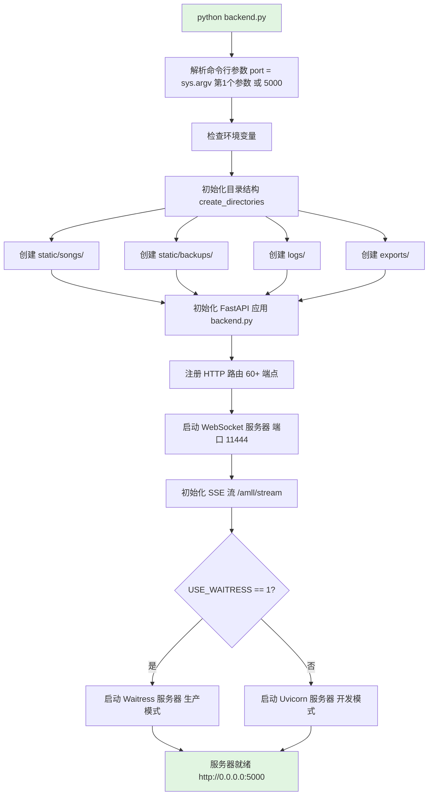

### 目录结构

首次运行时，LyricSphere 自动创建以下目录结构：

```
LyricSphere/
├── backend.py              # 主应用入口点
├── README.md               # 文档
├── templates/              # Jinja2 HTML 模板
│   ├── LyricSphere.html    # 主仪表板
│   └── Lyrics-style.HTML-AMLL-v1.HTML  # AMLL 播放器界面
├── static/                 # 静态资源
│   ├── songs/              # 歌词 JSON + 媒体文件
│   └── backups/            # 自动备份存储（7版本轮换）
├── logs/                   # 应用日志
│   └── upload.log          # 活动跟踪
└── exports/                # 生成的导出包
    └── *.zip               # ZIP 导出文件
```

**目录用途：**

| 目录 | 用途 | 自动创建 | 用户可编辑 |
| --- | --- | --- | ---|
| `static/songs/` | 存储歌曲元数据 JSON、音频文件、封面图像和歌词文件 | 是 | 是 |
| `static/backups/` | 所有编辑的自动备份存储，7版本轮换 | 是 | 否 |
| `logs/` | 应用日志，包括上传活动和错误跟踪 | 是 | 否 |
| `exports/` | 下载前 ZIP 导出的临时存储 | 是 | 否 |
| `templates/` | Web 界面的 Jinja2 HTML 模板 | 否 | 是 |

**关键文件：**

- `backend.py`: 主应用入口点，包含 FastAPI 路由、歌词处理引擎、AI 翻译系统和 WebSocket 服务器
- `LyricSphere.html`: 主 Web 仪表板，用于歌曲管理、编辑和翻译
- `Lyrics-style.HTML-AMLL-v1.HTML`: 高级 AMLL 播放器，支持动画

### 访问界面

启动服务器后，通过 Web 浏览器访问 LyricSphere：

| URL | 用途 | 认证 |
| --- | --- | ---|
| `http://localhost:5000/` | 主歌曲管理仪表板 | 可选（可配置） |
| `http://localhost:5000/player` | AMLL 风格歌词播放器 | 无 |
| `http://localhost:5000/quick-editor` | 高级歌词编辑器 | 需要设备认证 |
| `ws://localhost:11444` | AMLL 集成的 WebSocket | 无 |

**初始设置：**

1. **无需配置**: 应用使用合理的默认值运行
2. **可选安全**: 首次启动后可配置设备认证和密码保护
3. **空歌曲列表**: 通过"创建歌曲"按钮或从 AMLL/ZIP 导入开始

### 验证步骤

启动应用后，验证所有组件是否正常工作：

#### 1. 检查服务器日志

在控制台查找这些启动消息：

```
Server running on http://0.0.0.0:5000
WebSocket server started on port 11444
```

#### 2. 测试主仪表板

在浏览器中打开 `http://localhost:5000`。您应该看到：
- 空歌曲列表（首次运行）
- 搜索栏和筛选控件
- "创建歌曲"按钮
- 导入/导出按钮

#### 3. 验证目录创建

检查这些目录是否存在：

```bash
ls -la static/songs/
ls -la static/backups/
ls -la logs/
ls -la exports/
```

#### 4. 测试 SSE 流（可选）

验证实时歌词流端点：

```bash
curl -N http://localhost:5000/amll/stream | head
```

这应该建立连接并等待事件（按 Ctrl+C 退出）。

#### 5. 检查上传日志

验证日志记录处于活动状态：

```bash
tail -f logs/upload.log
```

此文件跟踪所有文件操作和 API 请求。

### 下一步

成功启动 LyricSphere 后，继续执行以下任务：

| 任务 | 文档 |
| --- | ---|
| **创建您的第一首歌曲** | 参见[歌曲创建和导入](#功能模块) |
| **编辑歌词** | 参见[前端界面系统](#前端界面系统) |
| **配置 AI 翻译** | 参见[AI 翻译系统](#ai翻译系统) |
| **设置安全** | 参见[安全认证系统](#安全认证系统) |
| **了解歌词格式** | 参见[歌词格式详解](#歌词格式详解) |
| **集成 AMLL 客户端** | 参见[实时通信](#实时通信) |

### 常见首次操作

1. **导入现有歌词**: 使用 ZIP 导入功能批量导入歌曲
2. **连接 AMLL**: 将 AMLL 客户端指向 `ws://localhost:11444`
3. **配置 AI 密钥**: 为翻译提供商设置 API 密钥（可选）
4. **启用安全**: 为写操作配置密码保护（可选）

### 故障排查

#### 端口已被占用

如果端口 5000 被占用：

```bash
python backend.py 5001
```

或识别并停止冲突的进程。

#### 缺少依赖

如果遇到导入错误：

```bash
pip install --upgrade -r requirements-backend.txt
```

#### 权限错误

确保应用具有以下目录的写入权限：
- `static/songs/`
- `static/backups/`
- `logs/`
- `exports/`

#### WebSocket 连接失败

如果 AMLL 客户端无法连接：
1. 验证端口 11444 未被防火墙阻止
2. 检查 WebSocket 服务器是否启动（查找启动消息）
3. 确保没有其他服务使用端口 11444

---

## 系统架构

LyricSphere 实现了六层架构设计，分离关注点并支持模块化开发。本章将详细介绍系统的整体架构、核心组件以及各层之间的交互关系。

### 分层架构概览

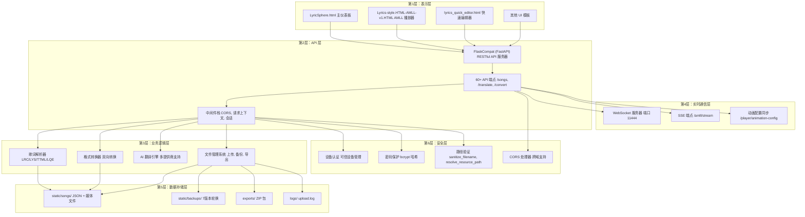

**架构层次说明：**

| 层次 | 组件 | 职责 |
| --- | --- | ---|
| **第1层：表示层** | Web UI 模板 | 用户界面展示和交互 |
| **第2层：API 层** | FastAPI + 路由 + 中间件 | HTTP 请求处理和路由分发 |
| **第3层：业务逻辑层** | 歌词处理、格式转换、AI 翻译 | 核心业务逻辑实现 |
| **第4层：实时通信层** | WebSocket、SSE | 实时数据推送和同步 |
| **第5层：数据存储层** | 文件系统 | 持久化数据存储 |
| **第6层：安全层** | 认证、授权、路径验证 | 安全防护机制 |

---

### 核心后端架构

#### FastAPI/Flask 兼容层

后端使用 `FlaskCompat`，这是一个自定义包装器，在 FastAPI 之上提供 Flask 风格的 API，以便于迁移和熟悉的开发模式。

**关键组件：**

| 组件 | 位置 | 用途 |
| --- | --- | ---|
| `FlaskCompat` | backend.py L760-L831 | 提供 Flask 兼容 API 的 FastAPI 子类 |
| `RequestContext` | backend.py L278-L427 | 封装 HTTP 请求数据（带缓存） |
| `RequestProxy` | backend.py L429-L463 | 全局 `request` 对象，提供 Flask 风格访问 |
| `SessionProxy` | backend.py L466-L546 | 全局 `session` 对象，会话管理 |
| `_request_context` | backend.py L51 | ContextVar，存储当前请求上下文 |
| `_request_context_middleware` | backend.py L1235-L1262 | 中间件，为每个请求注入上下文 |

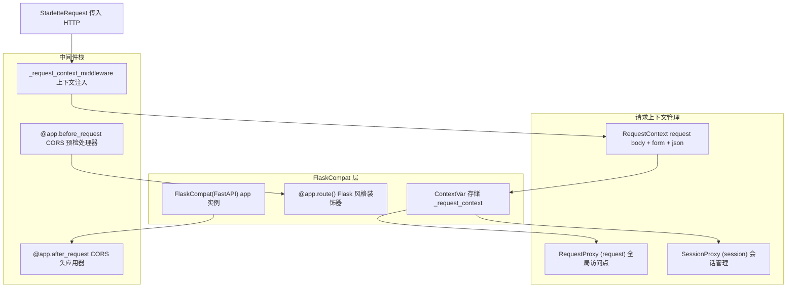

#### 文件管理架构

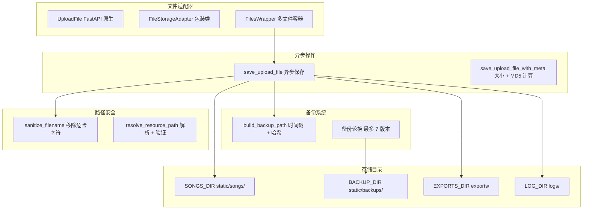

**关键文件管理函数：**

| 函数 | 位置 | 用途 |
| --- | --- | ---|
| `FileStorageAdapter` | backend.py L57-L120 | 适配 FastAPI UploadFile 到通用接口 |
| `save_upload_file` | backend.py L196-L219 | 异步文件保存，包含目录创建 |
| `save_upload_file_with_meta` | backend.py L222-L275 | 保存文件 + 计算大小和 MD5 哈希 |
| `sanitize_filename` | backend.py L997-L1004 | 从文件名中移除不安全字符 |
| `resolve_resource_path` | backend.py L1037-L1047 | 验证并解析资源路径 |
| `build_backup_path` | backend.py L1318-L1330 | 生成带时间戳的备份文件名 |
| `_normalize_backup_basename` | backend.py L1299-L1315 | 确保备份名称适合 255 字符限制 |

---

### 前端架构

LyricSphere 提供多个前端界面，适用于不同使用场景：

| 界面 | 文件 | 主要用途 |
| --- | --- | ---|
| 主仪表板 | `LyricSphere.html` | 歌曲 CRUD、搜索、批量导入/导出 |
| AMLL 播放器 V1 | `Lyrics-style.HTML-AMLL-v1.HTML` | 全功能播放器，带背景可视化 |
| 快速编辑器 | `lyrics_quick_editor.html` | 快速歌词编辑，带文档操作 |
| 基础播放器 | `Lyrics-style.HTML` | 简单歌词显示播放器 |
| 动画展示 | `Lyrics-style.HTML-Animate.HTML` | 动画效果演示 |
| AMLL 测试播放器 | `Lyrics-style.HTML-AMLL-v1-test.HTML` | AMLL 集成测试 |

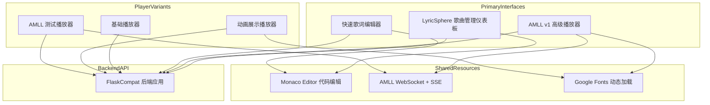

---

### 实时通信架构

#### 双通道通信系统

LyricSphere 实现两个并行的实时通信通道，针对不同客户端类型进行优化：

| 组件 | 位置 | 协议 | 用途 |
| --- | --- | --- | ---|
| WebSocket 服务器 | 端口 11444 | WebSocket | AMLL 客户端集成 |
| SSE 端点 | `/amll/stream` 路由 | Server-Sent Events | 浏览器实时更新 |
| 动画同步 | `/player/animation-config` | HTTP POST | 同步动画时序 |

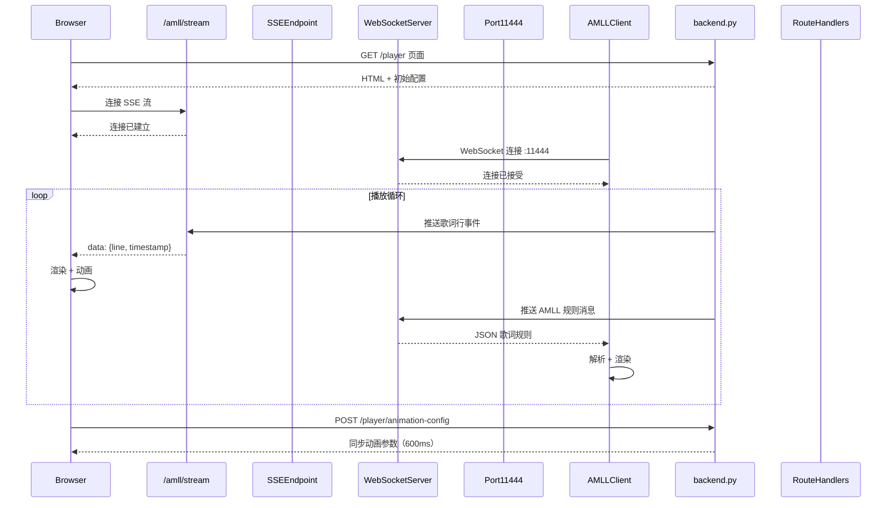

#### 动画配置流程

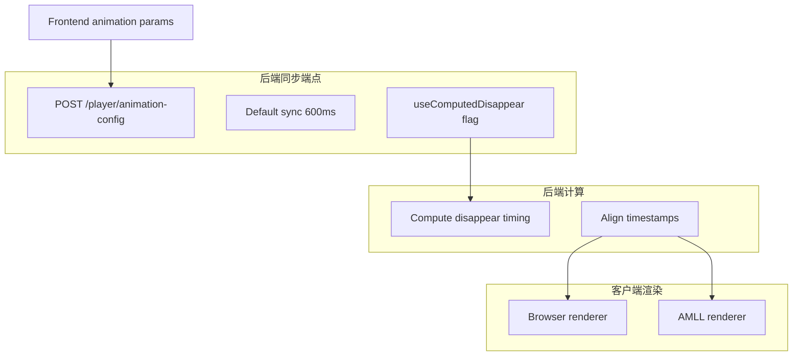

---

### 存储和文件组织

#### 目录结构

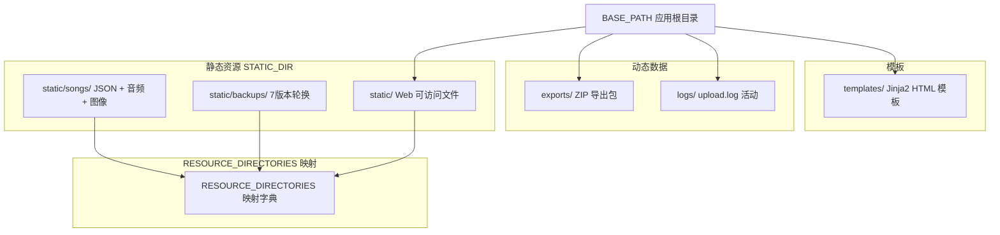

**路径解析常量：**

| 常量 | 位置 | 值 | 用途 |
| --- | --- | --- | ---|
| `BASE_PATH` | backend.py L847 | `get_base_path()` 结果 | 应用根目录（处理冻结/开发模式） |
| `STATIC_DIR` | backend.py L950 | `BASE_PATH / 'static'` | Web 可访问资源 |
| `SONGS_DIR` | backend.py L951 | `STATIC_DIR / 'songs'` | 歌曲 JSON + 媒体文件 |
| `BACKUP_DIR` | backend.py L952 | `STATIC_DIR / 'backups'` | 版本化备份文件 |
| `EXPORTS_DIR` | backend.py L850 | `BASE_PATH / 'exports'` | ZIP 导出包 |
| `LOG_DIR` | backend.py L953 | `BASE_PATH / 'logs'` | 应用日志 |
| `RESOURCE_DIRECTORIES` | backend.py L988-L992 | 目录映射字典 | 路径验证白名单 |

#### 备份版本管理

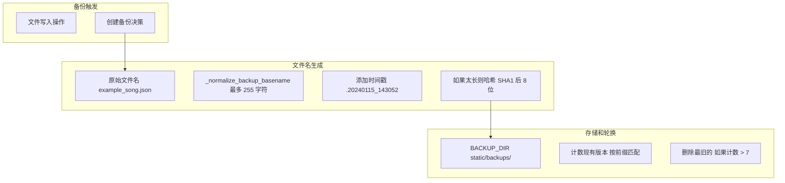

**备份系统常量：**

| 常量 | 位置 | 值 | 用途 |
| --- | --- | --- | --- |
| `BACKUP_TIMESTAMP_FORMAT` | backend.py L1293 | `'%Y%m%d_%H%M%S'` | 备份时间戳格式 |
| `MAX_BACKUP_FILENAME_LENGTH` | backend.py L1295 | `255` | 文件系统文件名限制 |
| `BACKUP_HASH_LENGTH` | backend.py L1296 | `8` | SHA1 哈希截断长度 |
| 最大备份版本 | 隐式 | `7` | 版本轮换限制 |

---

### 安全架构

#### 多层安全系统

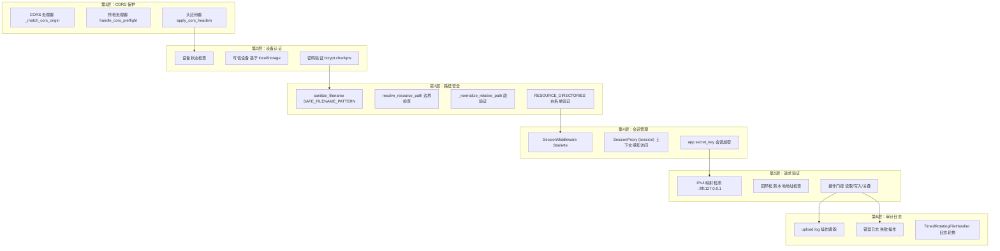

**安全函数和机制：**

| 组件 | 位置 | 用途 |
| --- | --- | ---|
| `sanitize_filename` | backend.py L997-L1004 | 移除危险字符，防止注入 |
| `_normalize_relative_path` | backend.py L1006-L1015 | 验证路径段，阻止 `..` 遍历 |
| `resolve_resource_path` | backend.py L1037-L1047 | 解析 + 验证基础目录 |
| `SAFE_FILENAME_PATTERN` | backend.py L994 | 安全字符的正则表达式白名单 |
| `RESOURCE_DIRECTORIES` | backend.py L988-L992 | 允许的资源路径白名单 |
| `_match_cors_origin` | backend.py L1225-L1232 | 根据允许列表验证 CORS 源 |
| `SessionMiddleware` | backend.py L862 | Starlette 会话中间件，用于状态 |
| bcrypt 密码哈希 | backend.py L8 导入 | 使用盐的密码保护 |

---

### 外部集成

#### AI 提供商集成架构

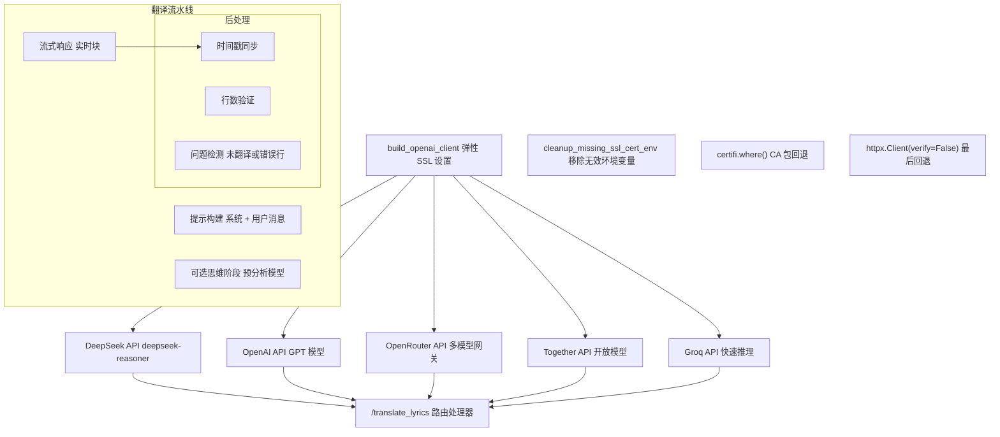

**AI 集成组件：**

| 组件 | 位置 | 用途 |
| --- | --- | ---|
| `build_openai_client` | backend.py L910-L947 | 创建具有 SSL 回退的 OpenAI 兼容客户端 |
| `cleanup_missing_ssl_cert_env` | backend.py L890-L907 | 移除无效的 SSL 证书环境变量 |
| 翻译端点 | 路由：`/translate_lyrics` | AI 驱动的歌词翻译，带流式传输 |
| 思维模型支持 | 在翻译流水线中 | 可选的预分析，用于更好的翻译 |
| 提供商配置 | 环境变量 + UI | 用户可配置的 AI 提供商选择 |

#### 字体服务集成

字体从多个源动态加载，具有回退机制：

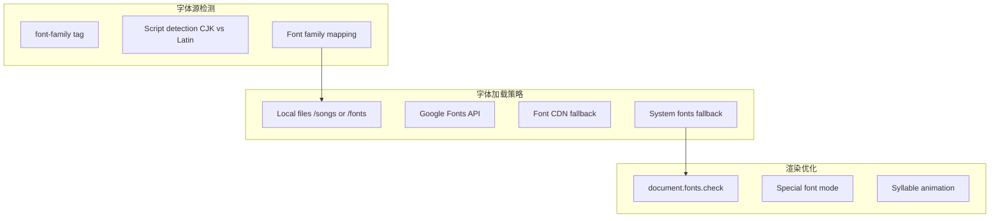

**字体系统特性：**

- 从歌词内容解析 `[font-family:FontName]` 元数据标签
- 脚本检测（中文、日文、英文）以选择适当的字体
- 多源加载：本地文件 → Google Fonts → CDN → 系统回退
- 渲染前检查字体可用性
- 装饰字体的特殊处理（纯色模式）
- 逐音节字体应用，实现精细控制

---

### 关键数据流

#### 歌曲创建流程

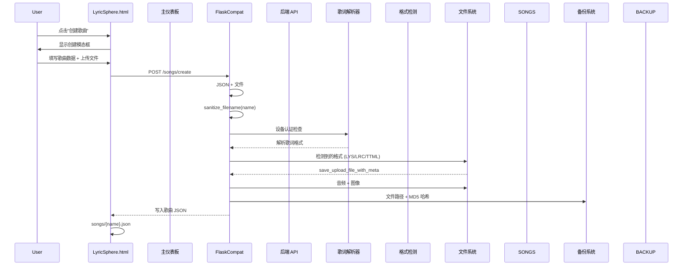

#### 格式转换流程

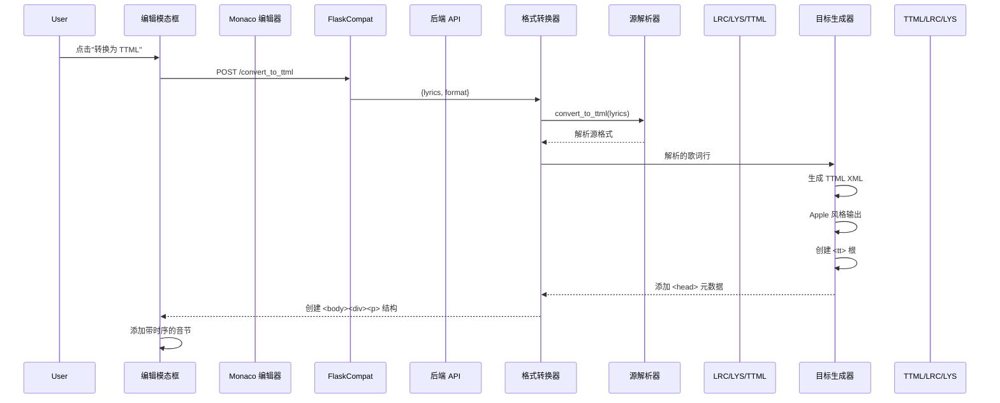

#### AI 翻译流程

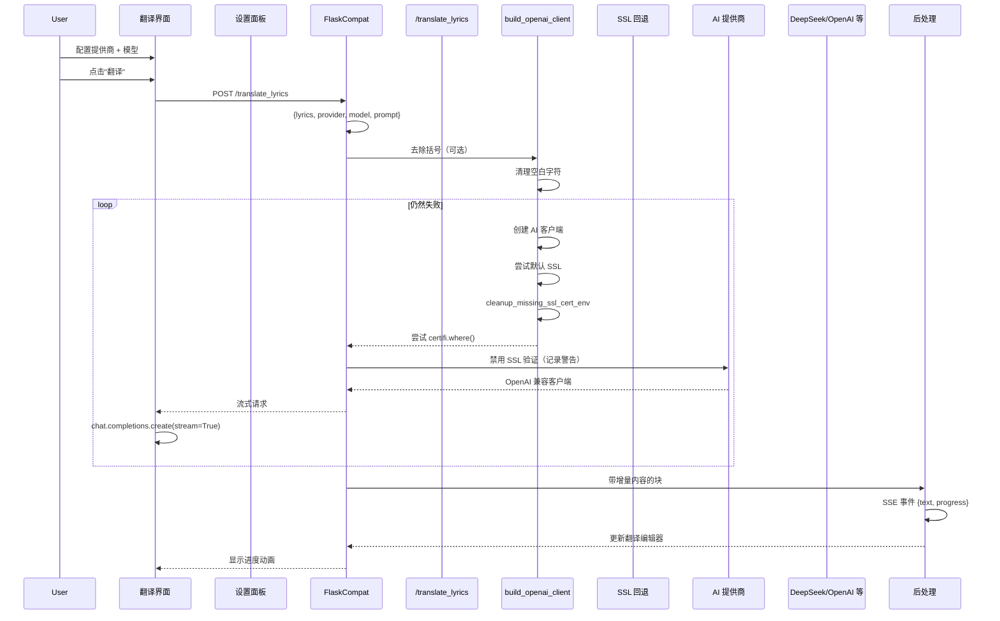

#### 实时歌词流传输流程

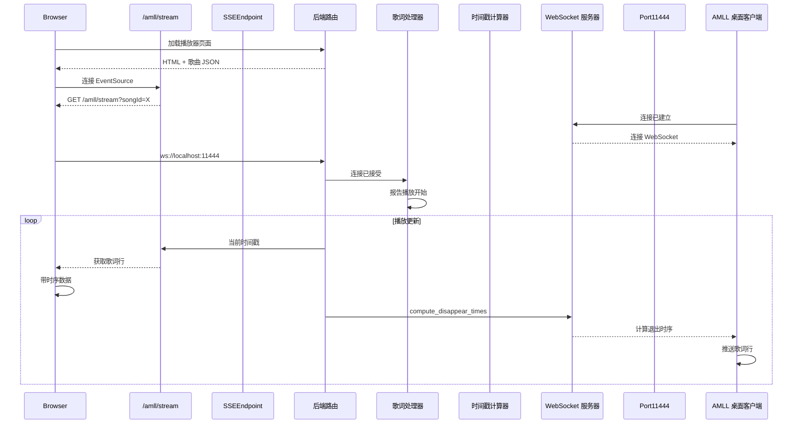

---

### 组件交互矩阵

| 组件 | 交互对象 | 协议/机制 | 用途 |
| --- | --- | --- | ---|
| `FlaskCompat` | 所有路由处理器 | Python 函数调用 | 主应用协调器 |
| `RequestContext` | 所有路由处理器 | ContextVar | 请求状态管理 |
| `FileStorageAdapter` | 文件上传路由 | 包装器模式 | FastAPI 文件处理 |
| `sanitize_filename` | 所有文件操作 | 函数调用 | 安全验证 |
| `resolve_resource_path` | 资源服务路由 | 函数调用 | 路径安全 |
| WebSocket 服务器 | AMLL 客户端 | WebSocket 协议（端口 11444） | 实时歌词更新 |
| SSE 端点 | 浏览器客户端 | Server-Sent Events | 实时流式传输 |
| AI 客户端构建器 | 翻译端点 | OpenAI SDK | AI 提供商抽象 |
| 备份系统 | 文件写入操作 | 自动触发 | 版本管理 |
| CORS 处理器 | 所有 HTTP 请求 | 中间件 | 跨域安全 |
| 会话中间件 | 认证路由 | Starlette 中间件 | 状态持久化 |

---

### 部署架构

LyricSphere 支持灵活的部署模式：

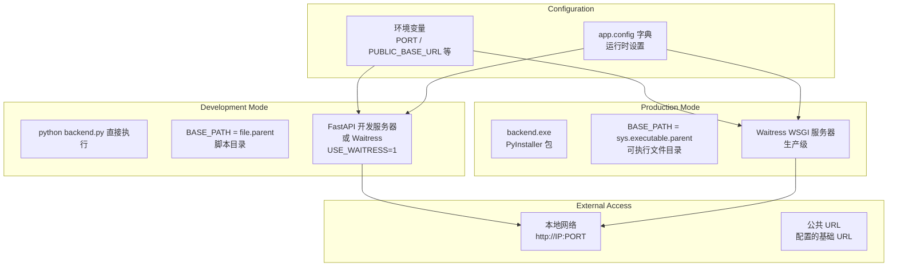

**关键部署函数：**

| 函数/常量 | 位置 | 用途 |
| --- | --- | --- |
| `get_base_path()` | backend.py L838-L844 | 检测冻结 vs 开发模式，返回正确的基础路径 |
| `BASE_PATH` | backend.py L847 | 全局应用根目录 |
| `USE_WAITRESS` 环境变量 | 运行时检查 | 切换到 Waitress 生产服务器 |
| `PORT` 环境变量 | 运行时配置 | 配置监听端口（默认 5000） |
| `PUBLIC_BASE_URL` 环境变量 | 运行时配置 | 覆盖代理部署的公共 URL |

---

这种架构使 LyricSphere 能够在支持多个客户端类型的复杂操作（如实时同步、多格式转换和 AI 驱动的翻译）的同时，保持清晰的关注点分离。

---

## 后端系统

后端系统是 LyricSphere 的核心协调层，实现于 `backend.py`（4500+ 行），负责所有歌词管理、处理和实时分发功能。后端处理 HTTP API 端点、实时通信、歌词格式解析和转换、AI 驱动的翻译、安全认证以及文件存储和备份管理。

### 架构概览

后端系统构建在 FastAPI 之上，具有 Flask 兼容的 API 层。核心应用在端口 5000（默认）上运行，并与端口 11444 上的 WebSocket 服务器集成，用于 AMLL 客户端通信。

#### 系统初始化和配置

应用初始化序列从 `get_base_path()` 开始，该函数确定运行时基础目录（处理开发和打包模式）。所有目录路径都使用相对于 `BASE_PATH` 的 `Path` 对象构建。

**关键路径常量：**

| 常量 | 位置 | 值 | 用途 |
| --- | --- | --- | --- |
| `BASE_PATH` | backend.py L847 | `get_base_path()` 结果 | 应用根目录 |
| `STATIC_DIR` | backend.py L950 | `BASE_PATH / 'static'` | Web 可访问资源 |
| `LOG_DIR` | backend.py L953 | `BASE_PATH / 'logs'` | 应用日志 |
| `EXPORTS_DIR` | backend.py L850 | `BASE_PATH / 'exports'` | ZIP 导出包 |
| `SONGS_DIR` | backend.py L951 | `STATIC_DIR / 'songs'` | 歌曲 JSON + 媒体文件 |
| `BACKUP_DIR` | backend.py L952 | `STATIC_DIR / 'backups'` | 版本化备份文件 |

#### 请求处理管道

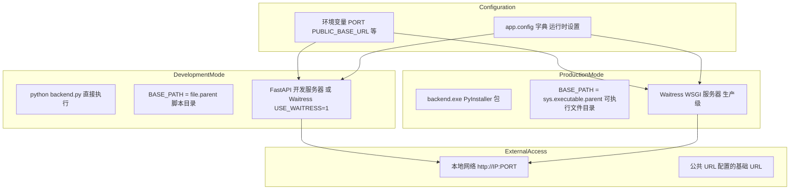

`_request_context_middleware` 在 backend.py L1236-L1263 拦截每个请求，使用 `ContextVar` 建立请求上下文，实现线程安全的状态管理。同步路由处理器通过 `_run_sync_in_thread()` 在 `THREADPOOL_EXECUTOR` 中执行，以防止阻塞事件循环。

---

### 核心组件

#### FlaskCompat 层

`FlaskCompat` 类提供围绕 FastAPI 的 Flask 风格 API 包装器，在利用 FastAPI 性能和异步能力的同时，启用熟悉的 Flask 模式。

**关键方法：**

| 方法 | 用途 |
| --- | ---|
| `route(path, methods)` | 将 Flask 路由转换为 FastAPI 路由的装饰器 |
| `before_request(func)` | 注册请求前钩子 |
| `after_request(func)` | 注册请求后钩子 |
| `template_filter(name)` | 添加 Jinja2 模板过滤器 |

装饰器模式在 `route()` 中将 Flask 风格的路径参数（例如 `<name>`）转换为 FastAPI 格式（例如 `{name}`）。它包装路由处理器，通过 `_normalize_response()` 提供自动响应规范化。

#### 请求上下文管理

请求上下文系统使用 `ContextVar` 在整个应用程序生命周期中提供对请求数据的线程安全访问。

**`RequestContext` 类**（backend.py L278-L427）封装所有请求数据，具有 JSON 解析和文件访问的延迟评估。通过 `_MISSING` 哨兵实现缓存，以避免重复解析。

**上下文访问模式：**

1. 全局 `request` 代理通过 `__getattr__` 委托给 `RequestContext`
2. `RequestProxy._require_context()` 检索当前上下文或引发 `RuntimeError`
3. `request.json` 等属性在首次访问后使用缓存值

#### 文件操作

文件处理通过适配器类抽象，统一 FastAPI 的 `UploadFile` 接口与传统文件操作。

**关键类和函数：**

| 组件 | 位置 | 用途 |
| --- | --- | --- |
| `FileStorageAdapter` | backend.py L57-L121 | 包装 `UploadFile` 以提供一致的接口 |
| `FilesWrapper` | backend.py L122-L195 | 提供类字典的多文件访问 |
| `save_upload_file` | backend.py L196-L219 | 异步文件保存，包含目录创建 |
| `save_upload_file_with_meta` | backend.py L222-L276 | 保存文件 + 计算大小和 MD5 哈希 |

`FileStorageAdapter` 包装 `UploadFile` 以提供一致的接口。`save()` 方法自动创建父目录并使用 `shutil.copyfileobj` 进行高效复制。

异步函数 `save_upload_file()` 和 `save_upload_file_with_meta()` 使用 `aiofiles` 进行非阻塞 I/O。后者在写入期间计算 MD5 哈希以进行完整性验证。

---

### 歌词处理系统

歌词处理系统处理多种歌词格式的解析、转换和计算。

#### 格式解析器

| 函数 | 位置 | 用途 |
| --- | --- | --- |
| `parse_lys(lys_content)` | backend.py L2346-L2469 | 解析 LYS 格式（音节级计时） |
| `parse_lrc(lrc_content)` | backend.py | 解析 LRC 格式（行级计时） |
| `parse_ttml(ttml_content)` | backend.py | 解析 TTML 格式（XML） |
| `parse_lqe(lqe_content)` | backend.py | 解析 LQE 格式（合并歌词+翻译） |

**LYS 格式解析器**特性：

- 使用正则表达式 `r'(.+?)\((\d+),(\d+)\)'` 提取带时序的音节 `text(start,dur)`
- 通过 `[offset:]` 元数据标签处理偏移
- 解析字体系列元数据：`[font-family:FontName]` 或 `[font-family:Font1(en),Font2(ja)]`
- 通过标记 `[6]`、`[7]`、`[8]` 或括号内容检测背景人声
- 应用 `detect_script()` 根据语言选择适当的字体
- 调用 `compute_disappear_times()` 计算行退出时序

**TTML 格式解析器**特性：

- 使用 `minidom.parseString()` 解析 XML
- 提取 `ttm:agent="v2"` 用于对唱行
- 提取 `ttm:role="x-bg"` 用于背景人声
- 通过白名单过滤净化内容

**输出结构：**
每个解析器返回行字典列表，包含：

- `line`: 行的完整文本
- `syllables`: `{text, startTime, duration, fontFamily}` 数组
- `style`: 对齐、fontSize、fontFamily 元数据
- `isBackground`: 背景人声的布尔标志
- `disappearTime`: 计算的退出时间（毫秒）

#### 时间戳计算

`compute_disappear_times()` 函数计算每行歌词应该何时退出显示。

**算法**（backend.py L2292-L2343）：

1. 从 `_animation_config_state` 加载动画配置
2. 对于每一行，找到最后一个音节的结束时间：`base_ms = startTime + duration`
3. 如果 `useComputedDisappear` 为 true，添加 `exitDuration` 缓冲
4. 否则，使用原始结束时间（前端计算退出）
5. 将结果存储在 `line['disappearTime']`（毫秒）
6. 可选记录调试信息用于时序分析

**配置同步：**
`/player/animation-config` 端点允许前端报告动画持续时间。后端在消失时间计算中使用这些值以确保平滑过渡。

#### 格式转换器

格式转换实现不同歌词文件类型之间的互操作性。

| 函数 | 输入 | 输出 | 描述 |
| --- | --- | --- | --- |
| `lys_to_ttml()` | LYS 字符串 | TTML XML | 将音节计时转换为 TTML 格式 |
| `ttml_to_lys()` | TTML 文件路径 | LYS 文件 | 从 TTML 提取音节，如果存在则生成单独的翻译文件 |
| `lrc_to_ttml()` | LRC 文件路径 | TTML 文件 | 通过中间处理将行级计时转换为 TTML |
| `merge_to_lqe()` | LYS/LRC + 翻译 | LQE JSON | 将歌词和翻译合并为合并格式 |

**TTML 生成**特性：

- 创建具有 `<tt>`、`<head>`、`<body>` 元素的 XML 结构
- 将音节包装在具有 `begin` 和 `end` 属性的 `<span>` 标签中
- 为对唱行添加 `ttm:agent="v2"`（标记 `[2]`、`[5]`）
- 为背景人声添加 `ttm:role="x-bg"`（标记 `[6]`、`[7]`、`[8]`）

**TTML 解析**特性：

- 提取所有具有时序属性的 `<span>` 元素
- 通过 `<p>` 元素将 span 分组以重构行
- 在单独的轨道中处理主歌词和翻译

---

### 实时通信

#### WebSocket 服务器

端口 11444 上的 WebSocket 服务器提供与 AMLL 客户端的双向通信。

**消息类型：**

- `state`: 完整歌曲元数据（标题、艺术家、专辑、封面、持续时间）
- `progress`: 当前播放位置（毫秒）
- `lines`: 当前歌词行数组，带时序
- `cover`: Base64 编码的封面图像数据

**封面图像处理：**
当收到封面时，服务器：

1. 解码 base64 数据
2. 保存到 `static/songs/amll_cover_{timestamp}.{ext}`
3. 用 URL 更新 `AMLL_STATE['song']['cover']`

#### Server-Sent Events (SSE)

`/amll/stream` 端点向 Web 客户端提供单向事件流。

**流实现：**

1. 立即产生当前 `AMLL_STATE` 作为快照
2. 阻塞在 `AMLL_QUEUE.get(timeout=30)`
3. 将事件格式化为 `data: {json}  `（SSE 规范）
4. 发送定期心跳以保持连接活动
5. 使用 `stream_with_context()` 维护请求上下文

**事件格式：**

```json
{
  "type": "update",
  "song": {
    "musicName": "Song Title",
    "artists": ["Artist Name"],
    "duration": 240000,
    "cover": "/songs/cover.jpg"
  },
  "progress_ms": 15000,
  "lines": [...]
}
```

---

### AI 翻译系统

AI 翻译系统集成多个 AI 提供商进行歌词翻译，支持流式传输。

#### AI 客户端构建器

`build_openai_client()` 函数（backend.py L910-L947）实现弹性 SSL 连接策略：

1. **第一次尝试**：使用默认 SSL 验证
2. **回退 1**：通过 `cleanup_missing_ssl_cert_env()` 清除无效的 SSL 环境变量
3. **回退 2**：使用 `certifi.where()` 定位 CA 包，创建自定义 `httpx.Client`
4. **回退 3**：完全禁用 SSL 验证（记录警告）

#### 翻译流水线

**设置配置**（backend.py L1653-L1676）：

```python
AI_TRANSLATION_SETTINGS = {
    'api_key': '',
    'system_prompt': '...',
    'provider': 'deepseek',
    'base_url': 'https://api.deepseek.com',
    'model': 'deepseek-reasoner',
    'expect_reasoning': True,
    'strip_brackets': False,
    'compat_mode': False,
    'thinking_enabled': True,
    'thinking_api_key': '',
    'thinking_provider': 'deepseek',
    'thinking_base_url': '...',
    'thinking_model': 'deepseek-reasoner',
    'thinking_system_prompt': '...'
}
```

**思维模型集成：**
如果 `thinking_enabled` 为 true，系统：

1. 用完整歌词调用思维模型
2. 提取主题、情感、文化背景分析
3. 将此上下文附加到主翻译提示
4. 通过预分析增强翻译质量

**括号去除**（backend.py L1810-L1822）：
使用 `str.translate()` 和 `BRACKET_TRANSLATION` 表进行高性能括号去除：

```
BRACKET_CHARACTERS = '()（）[]【】'
BRACKET_TRANSLATION = str.maketrans('', '', BRACKET_CHARACTERS)
```

这比基于正则表达式的方法快得多。

**兼容模式：**
某些 AI 模型不支持单独的系统/用户消息。当 `compat_mode` 为 true 时，系统提示合并到用户消息中。

---

### 安全和路径管理

#### 路径安全架构

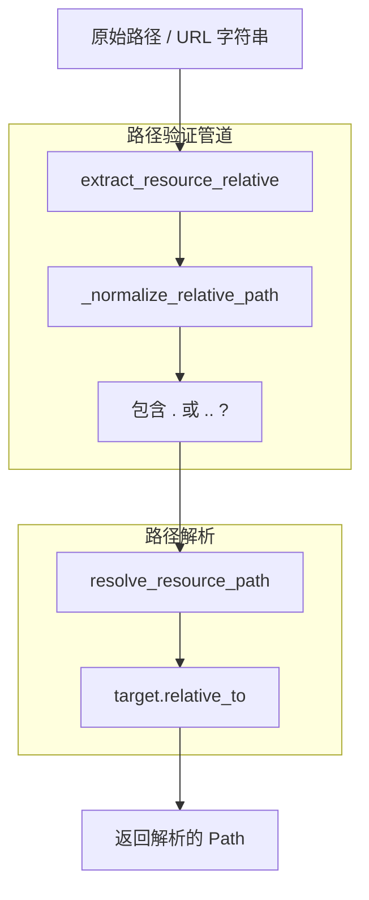

#### 安全函数

| 函数 | 位置 | 用途 |
| --- | --- | --- |
| `sanitize_filename(value)` | backend.py L997-L1004 | 通过正则表达式移除危险字符，保留 Unicode（中文字符） |
| `extract_resource_relative(value, resource)` | backend.py L1018-L1034 | 解析 URL 以提取路径组件，验证资源类型 |
| `_normalize_relative_path(value)` | backend.py L1006-L1015 | 拒绝任何 `.` 或 `..` 段（路径遍历防护） |
| `resolve_resource_path(value, resource)` | backend.py L1037-L1047 | 解析为绝对 `Path` 对象，验证在基础目录内 |
| `resource_relative_from_path(path_value, resource)` | backend.py L1050-L1062 | 将绝对路径转换回相对路径 |

#### 设备认证

设备认证使用 bcrypt 密码哈希结合可信设备管理。

**回环检测：**
系统检查 IPv4 映射的 IPv6 地址（例如 `::ffff:127.0.0.1`）和标准回环地址以确定本地访问。本地请求绕过密码要求。

**bcrypt 集成：**

- 使用 `bcrypt.hashpw()` 和自动生成的盐对密码进行哈希
- 使用 `bcrypt.checkpw()` 进行验证，防止时序攻击
- 哈希存储在应用程序状态中（不在基本配置中持久化到磁盘）

**可信设备：**
客户端 localStorage 维护可信设备 ID 列表。`is_request_allowed()` 函数在需要输入密码之前检查当前设备 ID 是否在可信列表中。

---

### 备份和版本管理

备份系统维护具有可配置保留限制的自动版本控制。

**关键函数：**

| 函数 | 位置 | 用途 |
| --- | --- | --- |
| `build_backup_path(name_or_path, timestamp, directory)` | backend.py L1318-L1330 | 生成带时间戳的备份路径 |
| `_normalize_backup_basename(original_name)` | backend.py L1299-L1315 | 确保文件名保持在 255 字节限制内 |
| `backup_prefix(name_or_path)` | backend.py L1333-L1336 | 返回用于查找相关备份的规范化前缀 |

**轮换策略：**

1. 检查文件的现有备份计数
2. 如果计数 >= 7，通过从文件名解析时间戳找到最旧的
3. 删除最旧的备份
4. 创建新备份
5. 维护 7 个版本的循环缓冲区

**备份集成：**
大多数文件写入操作自动创建备份：
- JSON 元数据更新
- 歌词文件修改
- 配置更改
- 快速编辑器保存

---

### 线程和并发

后端使用 `ThreadPoolExecutor` 在异步上下文中处理同步操作。

#### 线程池配置

**初始化**（backend.py L885-L886）：

```python
THREADPOOL_MAX_WORKERS = int(os.getenv("APP_THREADPOOL_WORKERS", "16"))
THREADPOOL_EXECUTOR = ThreadPoolExecutor(max_workers=THREADPOOL_MAX_WORKERS)
```

**环境变量：**

- `APP_THREADPOOL_WORKERS`：设置线程池大小（默认：16）
- 根据预期的并发和阻塞 I/O 模式配置

#### 上下文变量传播

**`_run_sync_in_thread(func, **kwargs)`**（backend.py L741-L757）：

1. 捕获当前 `copy_context()`（包括 `_request_context`）
2. 创建具有绑定参数的 `functools.partial`
3. 获取运行事件循环
4. 执行 `loop.run_in_executor(THREADPOOL_EXECUTOR, ctx.run, bound)`
5. 返回可等待结果

**上下文复制：**
`copy_context()` 函数保留所有 `ContextVar` 值，确保在工作线程中线程安全地访问请求数据。这允许同步路由处理器使用全局 `request` 和 `session` 代理。

#### 并发模式

**文件操作：**
长时间运行的文件操作（备份创建、格式转换、ZIP 提取）在线程池中执行，以避免阻塞事件循环。

**AI 翻译：**
流式 AI 响应使用线程池进行 API 调用，同时维护异步生成器用于客户端流式传输。

**WebSocket 处理：**
每个 WebSocket 连接在专用异步任务中运行，允许并发连接而无需线程开销。

---

### 其他组件

#### 快速编辑器系统

快速编辑器提供用于重新排序和编辑 LYS 格式音节的交互式界面。

**文档结构：**

```python
QUICK_EDITOR_DOCS: Dict[str, Dict[str, Any]] = {}
# doc = {
#   "id": str,
#   "version": int,
#   "lines": [
#     {
#       "id": str,
#       "prefix": str,  # e.g., "[]", "[2]"
#       "is_meta": bool,
#       "tokens": [
#         {"id": str, "ts": "start,dur", "text": str}
#       ]
#     }
#   ]
# }
```

**关键函数：**

- `qe_parse_lys(raw_text)`: 将 LYS 文本解析为结构化文档
- `qe_dump_lys(doc)`: 将文档序列化回 LYS 格式
- `qe_apply_move(doc, selection, target)`: 实现拖放重新排序
- `qe_find_line(doc, line_id)`: 通过 ID 定位行
- `qe_find_token_index(line, token_id)`: 在行内定位标记

**撤销/重做系统**（backend.py L1846-L1849）：

```python
QUICK_EDITOR_UNDO: Dict[str, List[Dict[str, Any]]] = {}
QUICK_EDITOR_REDO: Dict[str, List[Dict[str, Any]]] = {}
```

每次突变在修改前克隆文档状态，启用完整的撤销/重做历史。

#### 动画配置同步

动画配置系统在前端和后端之间同步时序参数。

**配置状态**（backend.py L1680-L1688）：

```python
ANIMATION_CONFIG_DEFAULTS = {
    'enterDuration': 500,
    'moveDuration': 500,
    'exitDuration': 500,
    'placeholderDuration': 50,
    'lineDisplayOffset': 0.7,
    'useComputedDisappear': False
}
```

**同步端点：**
`POST /player/animation-config` 更新全局状态并返回当前配置。前端报告其动画持续时间，后端在 `compute_disappear_times()` 中使用这些值。

**线程安全**（backend.py L1689-L1691）：

```python
_animation_config_state = dict(ANIMATION_CONFIG_DEFAULTS)
_animation_config_lock = threading.Lock()
_animation_config_last_update = 0.0
```

---

本节涵盖了驱动 LyricSphere 应用的核心后端架构、处理流水线、实时通信系统、安全措施和实用组件。

---

## API端点参考

LyricSphere 后端暴露了 60+ 个 API 端点，涵盖歌曲管理、歌词处理、格式转换、AI 翻译、实时通信等功能。所有 HTTP 端点返回 JSON 响应，包含 `success`、`data` 和 `message` 字段（除非另有说明）。

### API结构概览

```mermaid
flowchart TD
    Client["客户端应用"]
    Router["FlaskCompat 路由器"]

    SongAPI["歌曲管理 API<br/>/api/songs/*"]
    LyricAPI["歌词 API<br/>/lyrics<br/>/api/songs/*/lyrics"]
    ConvertAPI["格式转换 API<br/>/convert_*<br/>/merge_*<br/>/export_*"]
    TranslateAPI["AI 翻译 API<br/>/translate_lyrics<br/>/api/ai/*"]
    ImportExport["导入 / 导出 API<br/>/api/import<br/>/api/export/*"]
    BackupAPI["备份 API<br/>/api/songs/*/backups/"]
    AuthAPI["认证 API<br/>/auth/*"]
    ConfigAPI["配置 API<br/>/api/settings<br/>/player/animation-config"]
    EditorAPI["快速编辑器 API<br/>/quick-editor/api/*"]
    RealtimeAPI["实时 API<br/>/amll/stream<br/>/amll/state"]

    WSServer["WebSocket :11444<br/>AMLL 集成"]

    Client --> Router
    Client --> WSServer

    subgraph WebSocketServer["WebSocket 服务器"]
        WSServer
    end

    subgraph FastAPIBackend["FastAPI 后端<br/>backend.py"]
        Router
        SongAPI
        LyricAPI
        ConvertAPI
        TranslateAPI
        ImportExport
        BackupAPI
        AuthAPI
        ConfigAPI
        EditorAPI
        RealtimeAPI

        Router --> SongAPI
        Router --> LyricAPI
        Router --> ConvertAPI
        Router --> TranslateAPI
        Router --> ImportExport
        Router --> BackupAPI
        Router --> AuthAPI
        Router --> ConfigAPI
        Router --> EditorAPI
        Router --> RealtimeAPI
    end

```

### 标准响应格式

**成功响应：**

```json
{
  "success": true,
  "data": { /* 端点特定数据 */ },
  "message": "操作成功完成"
}
```

**错误响应：**

```json
{
  "success": false,
  "error": "错误描述",
  "code": 400
}
```

### 歌曲管理端点

这些端点处理 `static/songs/` 下存储的 JSON 歌曲元数据的 CRUD 操作。

| 方法 | 路径 | 描述 | 需要认证 |
| --- | --- | --- | --- |
| GET | `/api/songs` | 列出所有歌曲及其元数据 | 否 |
| POST | `/api/songs` | 创建新歌曲条目 | 是（解锁） |
| GET | `/api/songs/<song_id>` | 获取歌曲详情 | 否 |
| PUT | `/api/songs/<song_id>` | 更新歌曲元数据 | 是（解锁） |
| DELETE | `/api/songs/<song_id>` | 删除歌曲和资源 | 是（解锁） |
| POST | `/api/songs/<song_id>/upload` | 上传歌曲资源 | 是（解锁） |

**GET /api/songs** - 返回所有歌曲列表：

```json
{
  "success": true,
  "songs": [
    {
      "id": "song_filename",
      "meta": {
        "title": "歌曲标题",
        "artists": ["艺术家"],
        "album": "专辑名",
        "duration": 240000,
        "lyrics": "songs/lyrics.lys"
      },
      "song": "songs/audio.mp3",
      "cover": "songs/cover.jpg"
    }
  ]
}
```

**POST /api/songs** - 从 AMLL 快照或手动输入创建新歌曲：

```json
{
  "success": true,
  "song_id": "new_song_123",
  "file_path": "songs/new_song_123.json"
}
```

**PUT /api/songs/<song_id>** - 更新歌曲元数据和资源路径：

- 使用 `build_backup_path()` 在修改前创建自动备份
- 维护最多 7 个版本

**DELETE /api/songs/<song_id>** - 删除歌曲 JSON 文件及其关联资源：
- 查询参数 `delete_resources`：如果为 true，删除歌词、音频和封面文件

### 歌词管理端点

| 方法 | 路径 | 描述 | 需要认证 |
| --- | --- | --- | --- |
| GET | `/lyrics` | 获取解析的歌词数据 | 否 |
| GET | `/api/songs/<song_id>/lyrics` | 获取歌曲歌词内容 | 否 |
| PUT | `/api/songs/<song_id>/lyrics` | 保存歌词内容 | 是（解锁） |
| POST | `/api/songs/<song_id>/lyrics/analyze` | 分析歌词标签 | 否 |

**GET /lyrics** - 解析并返回带时序信息的结构化歌词数据：

```json
{
  "success": true,
  "lines": [
    {
      "line": "完整行文本",
      "syllables": [
        {
          "text": "音节",
          "startTime": 1.234,
          "duration": 0.456,
          "fontFamily": "CustomFont"
        }
      ],
      "style": {
        "align": "left",
        "fontSize": "normal",
        "fontFamily": "CustomFont"
      },
      "isBackground": false,
      "disappearTime": 2345
    }
  ],
  "format": "lys"
}
```

- 使用 `parse_lys()` 提取音节级时序数据
- 应用 `compute_disappear_times()` 计算动画时序
- 处理 font-family 元数据解析

### 格式转换端点

| 方法 | 路径 | 描述 | 需要认证 |
| --- | --- | --- | --- |
| POST | `/convert_to_ttml` | 将 LYS/LRC 转换为 TTML | 是（解锁） |
| POST | `/convert_to_ttml_temp` | 临时 TTML 转换 | 否 |
| POST | `/convert_ttml` | 将 TTML 转换为 LYS/LRC | 是（解锁） |
| POST | `/merge_to_lqe` | 合并歌词+翻译为 LQE | 是（解锁） |
| POST | `/export_lyrics_csv` | 导出歌词为 CSV | 否 |

**POST /convert_to_ttml** - 将 LYS 或 LRC 格式歌词转换为 TTML（Apple Music 风格）：

转换过程：
1. 使用格式特定解析器解析源格式
2. 检测对唱标记（`[2]`、`[5]`）和背景人声（`[6]`、`[7]`、`[8]`）
3. 生成具有 `ttm:agent` 和 `ttm:role` 属性的 TTML XML
4. 应用时间戳同步

**POST /convert_to_ttml_temp** - 为 AMLL 规则写入创建临时 TTML 文件，不永久保存：
- 使用 `TEMP_TTML_FILES` 字典，TTL 为 600 秒
- 文件在过期后自动清理

### AI 翻译端点

| 方法 | 路径 | 描述 | 需要认证 |
| --- | --- | --- | --- |
| POST | `/translate_lyrics` | 使用 AI 翻译歌词 | 是（解锁） |
| POST | `/api/ai/test` | 测试 AI 提供商连接 | 否 |
| POST | `/api/ai/models` | 获取可用模型 | 否 |
| GET | `/api/ai/settings` | 获取翻译设置 | 否 |
| POST | `/api/ai/settings` | 更新翻译设置 | 是（解锁） |

**POST /translate_lyrics** - 使用配置的 AI 提供商翻译歌词，支持流式传输：

请求体包含：`lyrics`、`provider`、`model`、`api_key`、`base_url`、`system_prompt`、`strip_brackets`、`compat_mode`、`thinking_enabled`

**流式响应：**

```
data: {"type": "thinking", "content": "分析歌词..."}
data: {"type": "translation", "line": 1, "content": "翻译 1"}
data: {"type": "translation", "line": 2, "content": "翻译 2"}
data: {"type": "complete", "total_lines": 3}
```

实现细节：
1. 验证提供商并使用 `build_openai_client()` 创建 OpenAI 兼容客户端
2. 如果启用，使用 `strip_bracket_blocks()` 预处理歌词
3. 使用系统消息和用户内容构建提示
4. 如果启用 `thinking_enabled`，首先运行思维模型分析
5. 使用进度跟踪流式传输翻译块
6. 从 DeepSeek 模型提取推理链
7. 将时间戳与原始歌词同步

### 导入/导出端点

| 方法 | 路径 | 描述 | 需要认证 |
| --- | --- | --- | --- |
| POST | `/api/import` | 导入 ZIP 包 | 是（解锁） |
| POST | `/api/export` | 导出单个歌曲 | 是（解锁） |
| POST | `/api/export/share` | 导出分享包 | 是（解锁） |
| POST | `/api/import/songs` | 导入多首歌曲 | 是（解锁） |

**POST /api/import** - 导入包含歌曲和资源的 ZIP 包：

实现流程：
1. 将 ZIP 提取到临时目录
2. 扫描 `static/` 或根目录中的 JSON 文件
3. 解析每个 JSON 并使用 `collect_song_resource_paths()` 收集引用的资源
4. 使用 `resolve_resource_path()` 验证和解析路径
5. 使用 `_resolve_import_target()` 处理冲突
6. 使用 `_replace_import_paths()` 更新内部引用
7. 使用完整性检查复制文件

**POST /api/export/share** - 创建包含所有引用资源的完整分享包：

1. 收集所有歌曲的 JSON 文件
2. 使用 `collect_song_resource_paths()` 从元数据提取资源路径
3. 使用 `resolve_resource_path()` 验证资源存在
4. 创建具有规范化结构的 ZIP
5. 使用时间戳存储在 `EXPORTS_DIR` 中

### 备份管理端点

| 方法 | 路径 | 描述 | 需要认证 |
| --- | --- | --- | --- |
| GET | `/api/songs/<song_id>/backups` | 列出备份 | 否 |
| POST | `/api/songs/<song_id>/backups/restore` | 恢复备份 | 是（解锁） |
| DELETE | `/api/songs/<song_id>/backups/<timestamp>` | 删除备份 | 是（解锁） |

**GET /api/songs/<song_id>/backups** - 列出歌曲的所有可用备份：

- 扫描 `BACKUP_DIR` 查找匹配 `backup_prefix()` 模式的文件
- 返回时间戳、大小、创建时间和文件路径

**POST /api/songs/<song_id>/backups/restore** - 从特定备份版本恢复歌曲：
- 可选在恢复前备份当前状态

### 认证端点

基于设备的认证系统，使用 bcrypt 密码哈希进行密码保护。

| 方法 | 路径 | 描述 | 需要认证 |
| --- | --- | --- | --- |
| POST | `/auth/unlock` | 解锁设备 | 否 |
| POST | `/auth/lock` | 锁定设备 | 否 |
| POST | `/auth/set_password` | 设置/更改密码 | 否 |
| GET | `/auth/devices` | 列出可信设备 | 是（本地） |
| DELETE | `/auth/devices/<device_id>` | 撤销设备 | 是（本地） |

**POST /auth/unlock** - 使用密码验证设备并添加到可信设备列表：

实现：
1. 使用 `bcrypt.checkpw()` 验证密码
2. 生成或验证设备 ID
3. 通过 `SessionProxy` 存储在会话中
4. 返回设备标识符供客户端存储

### 配置端点

系统配置和设置管理。

| 方法 | 路径 | 描述 | 需要认证 |
| --- | --- | --- | --- |
| GET | `/api/settings` | 获取所有设置 | 否 |
| POST | `/api/settings` | 更新设置 | 是（解锁） |
| POST | `/player/animation-config` | 同步动画配置 | 否 |
| GET | `/player/animation-config` | 获取动画配置 | 否 |

**POST /player/animation-config** - 在前端和后端之间同步动画时序配置：

请求体包含：`enterDuration`、`moveDuration`、`exitDuration`、`placeholderDuration`、`lineDisplayOffset`、`useComputedDisappear`

实现：
- 使用线程安全的 `_animation_config_lock` 和 `_animation_config_state` 字典
- `compute_disappear_times()` 函数使用这些值计算歌词行消失时序

### 快速编辑器端点

实时协作歌词编辑，支持撤销/重做。

| 方法 | 路径 | 描述 | 需要认证 |
| --- | --- | --- | --- |
| GET | `/quick-editor` | 编辑器 UI 页面 | 否 |
| POST | `/quick-editor/api/load` | 加载文档 | 是（解锁） |
| POST | `/quick-editor/api/move` | 移动标记 | 否 |
| POST | `/quick-editor/api/undo` | 撤销操作 | 否 |
| POST | `/quick-editor/api/redo` | 重做操作 | 否 |
| POST | `/quick-editor/api/newline` | 插入新行 | 否 |
| POST | `/quick-editor/api/set_prefix` | 设置行前缀 | 否 |
| POST | `/quick-editor/api/save` | 保存文档 | 是（解锁） |
| GET | `/quick-editor/api/export` | 导出为文本 | 否 |

**POST /quick-editor/api/load** - 将歌曲歌词加载到快速编辑器：

实现：
1. 解析 JSON 文件获取歌词路径
2. 使用 `ensure_lys_file_for_editor()` 确保 LYS 格式（如果需要自动转换 TTML/LRC）
3. 使用 `qe_parse_lys()` 将 LYS 内容解析为结构化文档
4. 在 `QUICK_EDITOR_DOCS` 字典中注册文档
5. 在 `QUICK_EDITOR_UNDO` 和 `QUICK_EDITOR_REDO` 中初始化撤销/重做栈

**POST /quick-editor/api/move** - 将选定的标记移动到文档中的新位置：

实现：
1. 验证文档版本以防止冲突
2. 使用 `qe_normalize_selection()` 规范化选择
3. 使用 `qe_apply_move()` 应用移动操作
4. 递增版本计数器
5. 将前一个状态推送到撤销栈
6. 清除重做栈

### 实时通信

#### WebSocket 服务器（端口 11444）

AMLL 集成 WebSocket，用于双向实时通信。

**连接 URL：** `ws://localhost:11444`

**消息格式（客户端 → 服务器）：**

```json
{
  "type": "play",
  "timestamp": 12345
}
```

**消息格式（服务器 → 客户端）：**

```json
{
  "type": "lyric_update",
  "line": {
    "text": "歌词行",
    "startTime": 1.234,
    "duration": 0.567
  }
}
```

实现：使用带有异步处理程序的 `websockets` 库。维护连接状态并从 `AMLL_QUEUE` 推送更新。

#### Server-Sent Events 端点

**GET /amll/stream** - SSE 流，用于向 Web 客户端实时更新歌词：

响应（text/event-stream）：

```yaml
event: lyric
data: {"line": "当前歌词行", "timestamp": 12345}

event: progress
data: {"current_ms": 12345, "duration_ms": 240000}

event: state
data: {"playing": true, "song": "歌曲标题"}
```

实现：
1. 使用 `Content-Type: text/event-stream` 打开持久连接
2. 从 `AMLL_QUEUE` 队列读取
3. 将消息格式化为 SSE 事件
4. 优雅地处理客户端断开连接

**GET /amll/state** - 提供当前 AMLL 状态快照，用于客户端同步：

返回当前歌曲元数据、播放进度和歌词行。

### 错误处理标准

所有端点遵循一致的错误处理模式：

| HTTP 状态 | 含义 | 示例响应 |
| --- | --- | --- |
| 200 | 成功 | `{"success": true, "data": {...}}` |
| 400 | 错误请求 | `{"success": false, "error": "无效参数"}` |
| 403 | 禁止 | `{"success": false, "unlock_required": true}` |
| 404 | 未找到 | `{"success": false, "error": "资源未找到"}` |
| 409 | 冲突 | `{"success": false, "error": "版本冲突"}` |
| 500 | 服务器错误 | `{"success": false, "error": "内部错误"}` |

### 端点认证流程

```mermaid
sequenceDiagram
    participant Client
    participant Middleware
    participant _request_context_middleware
    participant AuthCheck
    participant is_request_allowed()
    participant require_unlocked_device()
    participant RouteHandler
    participant SessionProxy
    participant session

    Client->>Middleware: HTTP 请求
    Middleware->>Middleware: 创建 RequestContext
    Middleware->>Middleware: 解析 body 和 form
    Middleware->>RouteHandler: 运行 before_request 钩子
    RouteHandler->>AuthCheck: 转发到路由
    alt [设备已解锁]
        AuthCheck->>AuthCheck: 检查认证
        AuthCheck-->>RouteHandler: 检查 remote_addr
        AuthCheck->>SessionProxy: IPv4 映射，回环
        SessionProxy-->>AuthCheck: 允许（本地绕过）
        AuthCheck-->>RouteHandler: 检查 session device_unlocked
        SessionProxy-->>AuthCheck: True
        AuthCheck-->>Client: 允许
    else [设备未解锁]
        RouteHandler->>RouteHandler: False/None
        RouteHandler->>Middleware: 403 Forbidden
        Middleware->>Middleware: {"unlock_required": true}
        Middleware->>Client: 返回错误
    end

```

### 路径安全和验证

所有文件路径操作使用安全验证：

```mermaid
flowchart TD
    Input["用户输入<br/>路径字符串"]
    Extract["extract_resource_relative()<br/>解析 URL，移除前缀"]
    Normalize["_normalize_relative_path()<br/>清理 ..、/<br/>验证段"]
    Resolve["resolve_resource_path()<br/>连接基础路径<br/>解析绝对路径"]
    Validate["relative_to()<br/>路径边界验证"]
    Result["安全 Path 对象<br/>位于白名单内"]
    Error["ValueError<br/>检测到路径遍历"]

    Input --> Extract
    Extract --> Normalize
    Normalize --> Resolve
    Resolve --> Validate
    Validate --> Result
    Validate --> Error

```

**关键函数：**

| 函数 | 用途 |
| --- | --- |
| `sanitize_filename()` | 从文件名中移除危险字符 |
| `extract_resource_relative()` | 从 URL 提取相对路径 |
| `resolve_resource_path()` | 解析为绝对路径并验证 |
| `_normalize_relative_path()` | 验证路径段 |

**白名单目录：**

- `static/` - 静态资源（`STATIC_DIR`）
- `songs/` - 歌曲文件和媒体（`SONGS_DIR`）
- `backups/` - 备份文件（`BACKUP_DIR`）

---

## 文件管理与安全

文件管理系统负责 LyricSphere 中的所有文件存储、路径解析和资源处理。它提供安全、有组织的结构来存储歌曲、备份、导出和日志，并通过全面的路径验证防止路径遍历攻击等安全漏洞。系统支持同步和异步文件操作，具有自动备份轮换和文件名清理功能。

### 目录结构

LyricSphere 将文件组织为基于 `BASE_PATH` 的分层目录结构，该结构适应开发和生产（冻结/打包）环境。

```mermaid
flowchart TD
    BASE_PATH["BASE_PATH<br/>(项目根目录)"]
    STATIC["static/<br/>(静态资源)"]
    SONGS["songs/<br/>(歌曲文件)"]
    BACKUPS["backups/<br/>(版本历史)"]
    LOGS["logs/<br/>(应用日志)"]
    EXPORTS["exports/<br/>(导出包)"]
    TEMPLATES["templates/<br/>(Jinja2 模板)"]

    SongJSON["*.json<br/>(歌曲元数据)"]
    Audio["*.mp3 / *.flac<br/>(音频文件)"]
    Images["*.jpg / *.png<br/>(封面图像)"]
    Fonts["*.ttf / *.otf<br/>(自定义字体)"]
    BackupFiles["filename.timestamp<br/>(版本化备份)"]
    UploadLog["upload.log<br/>(活动日志)"]
    ZipExports["*.zip<br/>(导出包)"]

    BASE_PATH --> STATIC
    BASE_PATH --> LOGS
    BASE_PATH --> EXPORTS
    BASE_PATH --> TEMPLATES

    STATIC --> SONGS
    STATIC --> BACKUPS

    SONGS --> SongJSON
    SONGS --> Audio
    SONGS --> Images
    SONGS --> Fonts

    BACKUPS --> BackupFiles
    LOGS --> UploadLog
    EXPORTS --> ZipExports

```

**路径常量：**

| 常量 | 值 | 用途 |
| --- | --- | --- |
| `BASE_PATH` | `get_base_path()` 结果 | 应用根目录 |
| `STATIC_DIR` | `BASE_PATH / 'static'` | Web 可访问资源 |
| `SONGS_DIR` | `STATIC_DIR / 'songs'` | 歌曲 JSON + 媒体文件 |
| `BACKUP_DIR` | `STATIC_DIR / 'backups'` | 版本化备份文件 |
| `LOG_DIR` | `BASE_PATH / 'logs'` | 应用日志 |
| `EXPORTS_DIR` | `BASE_PATH / 'exports'` | ZIP 导出包 |

**基础路径解析：**

`get_base_path()` 函数根据执行上下文智能确定项目根目录：

| 执行模式 | 检测方法 | 解析路径 |
| --- | --- | --- |
| **开发** | `sys.frozen == False` | 包含 `backend.py` 的目录 |
| **打包 (PyInstaller)** | `sys.frozen == True` | 包含可执行文件的目录 |

### 路径安全系统

LyricSphere 实现多层路径安全系统，防止路径遍历攻击、目录逃避尝试和未经授权的文件访问。所有用户提供的路径在文件系统操作之前都通过验证函数。

```mermaid
flowchart TD
    UserInput["User input"]

    ExtractRelative["extract_resource_relative"]
    CheckScheme["Check URL scheme<br/>and netloc"]
    RemovePrefix["Remove resource prefix"]

    NormalizePath["Normalize relative path"]
    CheckDots["Reject . and .. segments"]
    JoinSegments["Join valid segments"]

    ResolveAbs["Resolve absolute path"]
    ResolveSymlinks["Resolve symlinks"]
    BoundaryCheck["Check base directory<br/>boundary"]

    SanitizeFilename["sanitize_filename"]
    CleanPattern["Apply SAFE_FILENAME_PATTERN"]
    ReplaceQuotes["Replace quotes"]

    SafePath["Safe absolute path"]

    UserInput --> ExtractRelative

    ExtractRelative --> CheckScheme
    CheckScheme --> RemovePrefix
    RemovePrefix --> NormalizePath

    NormalizePath --> CheckDots
    CheckDots --> JoinSegments
    JoinSegments --> ResolveAbs

    ResolveAbs --> ResolveSymlinks
    ResolveSymlinks --> BoundaryCheck
    BoundaryCheck --> SanitizeFilename

    SanitizeFilename --> CleanPattern
    CleanPattern --> ReplaceQuotes
    ReplaceQuotes --> SafePath

    subgraph Layer1Extraction["Layer 1 · Extraction"]
        ExtractRelative
        CheckScheme
        RemovePrefix
    end

    subgraph Layer2Normalization["Layer 2 · Normalization"]
        NormalizePath
        CheckDots
        JoinSegments
    end

    subgraph Layer3Resolution["Layer 3 · Resolution"]
        ResolveAbs
        ResolveSymlinks
        BoundaryCheck
    end

    subgraph Layer4Sanitization["Layer 4 · Sanitization"]
        SanitizeFilename
        CleanPattern
        ReplaceQuotes
    end

```

#### 文件名清理

`sanitize_filename()` 函数移除危险字符，同时保留 Unicode 字符、空格和安全标点：

**清理规则：**

| 字符类型 | 操作 | 示例 |
| --- | --- | --- |
| 字母数字 | 保留 | `abc123` → `abc123` |
| 中文字符 | 保留 | `歌词` → `歌词` |
| 连字符、下划线、点、空格 | 保留 | `song-1.lys` → `song-1.lys` |
| 双引号 `"` | 替换为全角 | `"test"` → `＂test＂` |
| 单引号 `'` | 替换为全角 | `'test'` → `＂test＂` |
| 路径分隔符 (`/`, `\`) | 移除 | `path/to/file` → `pathtofile` |
| 控制字符 | 移除 | `file\x00.txt` → `file.txt` |
| 特殊字符 | 移除 | `file*?.txt` → `file.txt` |

**实现：**

使用预编译正则表达式 `SAFE_FILENAME_PATTERN = r'[^\w\u4e00-\u9fa5\-_. ]'` 匹配：
- `\w` - 单词字符（字母数字 + 下划线）
- `\u4e00-\u9fa5` - 中文字符（CJK 统一表意文字）
- `\-_. ` - 字面连字符、下划线、点、空格

所有其他字符通过 `sub('', value)` 移除。

#### 相对路径规范化

`_normalize_relative_path()` 函数标准化路径分隔符并拒绝遍历尝试：

**规范化过程：**

1. 将反斜杠替换为正斜杠
2. 去除前导/尾随斜杠
3. 分割为段并过滤空段
4. 拒绝任何为 `.` 或 `..` 的段
5. 如果检测到无效段则引发 `ValueError`
6. 用正斜杠连接有效段

**示例：**

| 输入 | 输出 | 原因 |
| --- | --- | --- |
| `songs/track.mp3` | `songs/track.mp3` | 有效相对路径 |
| `songs\\track.mp3` | `songs/track.mp3` | 反斜杠规范化 |
| `/songs/track.mp3` | `songs/track.mp3` | 前导斜杠去除 |
| `songs/../config.json` | `ValueError` | 包含 `..` 遍历 |
| `songs/./track.mp3` | `ValueError` | 包含 `.` 引用 |
| `songs//track.mp3` | `songs/track.mp3` | 空段过滤 |

#### 资源路径提取

`extract_resource_relative()` 函数从各种输入格式中提取相对路径：

**支持的输入格式：**

- 相对路径：`"myfile.json"`、`"subdir/file.json"`
- 资源前缀：`"songs/myfile.json"`、`"static/songs/myfile.json"`
- URL 路径：`"/songs/myfile.json"`、`"http://example.com/songs/file.json"`
- URL 编码路径（自动解码）

**验证：**

- 检查资源类型存在于 `RESOURCE_DIRECTORIES` 中
- 使用 `urlparse()` 解析 URL 以提取路径组件
- 去除 URL schemes 和网络位置
- 如果存在则移除资源前缀
- 将结果传递给 `_normalize_relative_path()`
- 对无效或外部 URL 引发 `ValueError`

**资源白名单：**

```python
RESOURCE_DIRECTORIES = {
    'static': STATIC_DIR,     # BASE_PATH / 'static'
    'songs': SONGS_DIR,       # STATIC_DIR / 'songs'
    'backups': BACKUP_DIR,    # STATIC_DIR / 'backups'
}
```

#### 路径解析和边界检查

`resolve_resource_path()` 函数将相对路径转换为绝对路径并进行安全验证：

**安全检查：**

1. 调用 `extract_resource_relative()` 获取验证的相对路径
2. 解析基础目录（来自 `RESOURCE_DIRECTORIES`）
3. 构建候选路径：`(base_dir / relative).resolve()`
4. 使用 `Path.relative_to()` 验证候选在基础目录内
5. 如果路径逃逸基础目录则引发 `ValueError`

**解析机制：**

1. **`Path.resolve()`** - 转换为绝对路径，解析符号链接并规范化
2. **`Path.relative_to()`** - 检查目标是否在 base_dir 内（如果目标在 base_dir 外则引发 ValueError）

**攻击防护示例：**

| 场景 | 路径输入 | 结果 | 解释 |
| --- | --- | --- | --- |
| 正常访问 | `songs/track.mp3` | ✓ 允许 | 在 songs 目录内 |
| 父级遍历 | `songs/../config.py` | ✗ 阻止 | 被第2层拒绝（包含 `..`） |
| 绝对路径 | `/etc/passwd` | ✗ 阻止 | 被第3层拒绝（无资源前缀） |
| 符号链接逃逸 | `songs/link` → `/etc` | ✗ 阻止 | `resolve()` 跟随符号链接，`relative_to()` 检测逃逸 |
| 双重编码 | `songs/%2e%2e/file` | ✗ 阻止 | `unquote()` 解码为 `..`，被第2层拒绝 |
| 空字节 | `songs/file\x00.txt` | ✗ 阻止 | 第1层清理移除 |

### 文件上传适配器

LyricSphere 使用适配器类为处理来自 FastAPI 多部分表单的文件上传提供一致的接口。

#### FileStorageAdapter

包装 FastAPI 的 `UploadFile` 以提供类似 Flask 的文件存储接口：

**属性：**

- `filename`：原始上传文件名
- `stream`：类文件对象（UploadFile.file）
- `_upload`：对原始 UploadFile 的引用

**方法：**

- `save(dst)`：同步保存到目标路径，创建父目录
- `read(size)`：从文件流读取字节
- `seek(offset, whence)`：移动文件指针
- `upload` 属性：访问原始 UploadFile 对象

#### FilesWrapper

提供类字典访问多个上传文件：

- 内部映射：`Dict[str, List[FileStorageAdapter]]`
- 支持每个字段名多个文件

**方法：**

- `__getitem__(key)`：获取字段名的第一个文件
- `get(key, default)`：带默认值的安全检索
- `getlist(key)`：获取字段名的所有文件作为列表
- `items()`：遍历（键，第一个文件）对
- `__contains__(key)`：检查字段是否有文件

#### 异步文件操作

**save_upload_file()** - 使用 `aiofiles` 异步保存上传文件：

1. 使用 `Path.mkdir(parents=True, exist_ok=True)` 创建父目录
2. 查找到文件开头
3. 以 1MB 块读取
4. 异步写入块
5. 将文件指针重置到开头

**save_upload_file_with_meta()** - 在保存期间计算文件元数据的扩展版本：

- 写入时计算 MD5 哈希
- 跟踪总文件大小
- 返回元组：`(size: int, md5: str)`

**用途：** 文件完整性验证、重复检测、审计日志

### 资源 URL 规范化

系统处理歌曲元数据中引用的各种资源 URL 格式。

#### 公共 URL 构建

`build_public_url()` 函数为资源构建完整 URL：

**参数：**

- `resource`：资源类型（'songs'、'static'、'backups'）
- `relative_path`：资源目录内的相对路径

**基础 URL 解析优先级：**

1. 请求上下文 URL 根目录（如果可用）
2. `PUBLIC_BASE_URL` 配置/环境变量
3. 默认：`http://127.0.0.1:{PORT}`

### 资源路径收集

系统可以分析 JSON 载荷以提取所有引用的资源路径，支持简单路径和多值字段。

#### 歌曲资源路径扫描器

`collect_song_resource_paths()` 函数递归遍历 JSON 结构以查找资源引用：

**支持的结构：**

- 字典（递归处理所有值）
- 列表（递归处理所有项）
- 字符串（如果有效则提取路径）
- 多值字段（在 `::` 分隔符上分割）

**路径提取逻辑：**

1. 检查 `::` 分隔符（指示多个路径）
2. 使用 `_extract_single_song_relative()` 解析每个段
3. 过滤掉 `!` 占位符和空值
4. 规范化和验证路径
5. 返回唯一相对路径集

#### 单一路径提取

`_extract_single_song_relative()` 助手处理单个路径字符串：

**规范化步骤：**

1. 去除空白
2. 将反斜杠替换为正斜杠
3. 作为 URL 解析以提取路径组件
4. 去除前导 `./` 和 `/` 序列
5. 如果存在则移除 `static/` 前缀
6. 验证以 `songs/` 前缀开头
7. 移除查询字符串和片段
8. 使用 `_normalize_relative_path()` 验证

#### 字体文件提取

`extract_font_files_from_lys()` 函数解析 LYS 歌词以查找 font-family 元数据标签：

**标签格式：**

```
[font-family:FontName]
[font-family:MainFont(en),SubFont(ja)]
[font-family:(ja),CustomFont(en)]
```

**解析逻辑：**

1. 使用 `FONT_FAMILY_META_REGEX` 扫描每行的 `[font-family:...]` 标签
2. 用逗号分割以获取字体规范
3. 使用正则解析每个规范：
  - `FontName(lang)` - 带语言说明符的字体
  - `(lang)` - 仅语言（无自定义字体）
  - `FontName` - 无语言说明符的字体
4. 提取字体名称（排除空和仅语言规范）
5. 返回唯一字体文件名集

**用途：** 导出前的资源完整性检查、字体文件依赖跟踪、缺失资源警告

### 备份管理

备份系统维护修改文件的版本化副本，具有智能文件名处理以避免文件系统限制。

```mermaid
flowchart TD
    OriginalFile["原始文件<br/>song_lyrics.json"]
    CheckLength["文件名长度<br/>> 255 - 后缀 ?"]

    UseDirect["直接命名<br/>song_lyrics.json<br/>.20240115_143022"]

    HashAndTruncate["哈希 + 截断"]
    ComputeHash["计算 SHA1 哈希<br/>取前 8 字符"]
    TruncateStem["截断 stem<br/>以满足长度限制"]
    BuildName["生成名称<br/>stem_hash.json.timestamp"]

    BackupPath["备份路径<br/>static/backups/<br/>filename.timestamp"]
    RotateOld["轮换旧备份<br/>保留最近 7 个"]

    OriginalFile --> CheckLength
    CheckLength -->|否| UseDirect
    CheckLength -->|是| HashAndTruncate

    HashAndTruncate --> ComputeHash
    ComputeHash --> TruncateStem
    TruncateStem --> BuildName

    UseDirect --> BackupPath
    BuildName --> BackupPath
    BackupPath --> RotateOld

```

#### 文件名长度处理

`_normalize_backup_basename()` 函数防止过度长的文件名导致文件系统错误：

**常量：**

- `MAX_BACKUP_FILENAME_LENGTH = 255`（文件系统限制）
- `BACKUP_SUFFIX_LENGTH` = 时间戳长度（例如 ".20240115_143022"）
- `BACKUP_HASH_LENGTH = 8`（SHA1 哈希前缀）

**算法：**

1. 如果 `len(name) + BACKUP_SUFFIX_LENGTH <= 255`：返回不变
2. 提取文件扩展名
3. 计算原始名称的 SHA1 哈希，取前 8 个十六进制字符
4. 计算干的可用空间
5. 截断干以适应：`{stem[:available]}_{hash}{suffix}`
6. 如果无可用空间，使用仅哈希名称

#### 备份路径构建

`build_backup_path()` 函数创建文件系统安全的备份路径：

**参数：**

- `name_or_path`：原始文件名或 Path 对象
- `timestamp`：可选时间戳（int、float 或 string）
- `directory`：备份目录（默认为 `BACKUP_DIR`）

**输出格式：**

```
{directory}/{normalized_basename}.{timestamp}
```

**时间戳处理：**

- 数字时间戳：转换为字符串
- 字符串时间戳：按原样使用
- `None`：生成格式为 `YYYYMMDD_HHMMSS` 的当前时间戳

#### 备份前缀匹配

`backup_prefix()` 函数返回规范化前缀以定位相关备份：

**用法：**

```python
prefix = backup_prefix("long_song_name.json")
# 返回: "truncated_name_abc12345.json."
# 用于查找: truncated_name_abc12345.json.20240115_120000
#           truncated_name_abc12345.json.20240115_130000
#           等
```

### 路径验证函数引用

#### 核心函数

| 函数 | 用途 | 输入 | 输出 |
| --- | --- | --- | --- |
| `sanitize_filename(value)` | 移除非法文件名字符 | 字符串 | 清理的字符串 |
| `_normalize_relative_path(value)` | 规范化和验证路径段 | 字符串 | 规范化路径或 `ValueError` |
| `extract_resource_relative(value, resource)` | 为资源类型提取并验证相对路径 | 字符串，资源名称 | 相对路径或 `ValueError` |
| `resolve_resource_path(value, resource)` | 解析为绝对路径并进行边界检查 | 字符串，资源名称 | 绝对 `Path` 或 `ValueError` |
| `resource_relative_from_path(path, resource)` | 将绝对路径转换为资源相对 | Path，资源名称 | 相对路径或 `ValueError` |

#### 助手函数

| 函数 | 用途 |
| --- | --- |
| `_extract_single_song_relative(value)` | 从字符串提取 songs/ 路径（用于资源收集） |
| `collect_song_resource_paths(payload)` | 遍历 JSON 并收集所有引用的 songs/ 路径 |
| `extract_font_files_from_lys(content)` | 解析 LYS 内容以查找字体文件引用 |

### 安全属性

路径安全系统保证：

1. **无目录遍历** - 所有包含 `..` 或 `.` 的路径在文件系统访问前被拒绝
2. **目录限制** - 所有解析的路径被验证在允许的资源目录内
3. **文件名安全** - 所有文件名被清理以防止命令注入或文件系统漏洞
4. **符号链接保护** - `Path.resolve()` 在边界验证前跟随符号链接
5. **URL 注入预防** - 外部 URL 和绝对路径被拒绝，除非它们引用允许的资源
6. **空字节保护** - 空字节和控制字符在清理期间被移除

---

## 安全认证系统

安全认证系统实现多层防御机制，包括设备认证、密码保护、路径验证、访问控制和会话管理。这些系统协同工作以保护敏感操作，同时保持可用性。

### 安全架构概览

LyricSphere 实现六层安全架构：

| 层次 | 组件 | 用途 | 实现 |
| --- | --- | --- | --- |
| 1 | CORS 验证 | 跨域访问控制 | 源匹配、预检处理 |
| 2 | 会话管理 | 用户会话跟踪 | FastAPI SessionMiddleware、ContextVar |
| 3 | 设备认证 | 可信设备管理 | bcrypt 密码哈希、设备列表 |
| 4 | 访问控制 | 操作授权 | 本地/远程检测、操作类型 |
| 5 | 路径安全 | 路径遍历防护 | 文件名清理、边界检查 |
| 6 | 文件操作 | 安全文件处理 | 自动备份、版本控制 |

### 设备认证系统

#### 认证流程

设备认证系统维护可信设备列表，并在首次访问时要求未可信设备进行密码验证：

```mermaid
flowchart TD
    Client["客户端浏览器"]
    DeviceID["设备指纹 IP + User-Agent"]
    Middleware["SessionMiddleware"]
    RequestContext["RequestContext"]
    SessionProxy["SessionProxy"]
    DeviceCheck["is_request_allowed()"]
    UnlockCheck["require_unlocked_device()"]
    PasswordVerify["bcrypt.checkpw()"]
    TrustedList["可信设备列表"]
    SessionStore["会话存储 SessionMiddleware"]
    PasswordHash["密码哈希 bcrypt"]
    CreateOp["创建歌曲"]
    DeleteOp["删除歌曲"]
    EditOp["快速编辑器"]
    ExportOp["导出/导入"]

    DeviceID --> Middleware
    SessionProxy --> DeviceCheck
    PasswordVerify --> PasswordHash
    TrustedList --> SessionStore
    UnlockCheck --> CreateOp
    UnlockCheck --> DeleteOp
    UnlockCheck --> EditOp
    UnlockCheck --> ExportOp

    subgraph ProtectedOperations["受保护操作"]
        CreateOp
        DeleteOp
        EditOp
        ExportOp
    end

    subgraph Storage["存储"]
        SessionStore
        PasswordHash
    end

    subgraph AuthenticationLogic["认证逻辑"]
        DeviceCheck
        UnlockCheck
        PasswordVerify
        TrustedList
        DeviceCheck --> TrustedList
        DeviceCheck --> UnlockCheck
        UnlockCheck --> PasswordVerify
    end

    subgraph RequestPipeline["请求管道"]
        Middleware
        RequestContext
        SessionProxy
        Middleware --> RequestContext
        RequestContext --> SessionProxy
    end

    subgraph ClientLayer["客户端层"]
        Client
        DeviceID
        Client --> DeviceID
    end

```

#### 可信设备管理

可信设备通过前端 localStorage 和后端会话验证进行管理。系统不在后端持久化可信设备列表；相反，前端维护设备标识符，并在需要时请求解锁。

**关键操作：**

- **设备解锁**：客户端提交密码进行验证
- **信任存储**：前端在 localStorage 中存储设备信任状态
- **会话验证**：后端在每次解锁请求时使用 bcrypt 验证密码

#### 设备指纹识别

系统通过提取和组合多个请求属性生成唯一设备标识符：

| 组件 | 来源 | 用途 |
| --- | --- | --- |
| **客户端 IP** | `request.remote_addr` | 主要设备标识符 |
| **User-Agent** | `request.headers['User-Agent']` | 浏览器/客户端区分 |
| **会话 Cookie** | `SessionMiddleware` | 持久会话跟踪 |

**IPv4 映射地址处理：**

系统包含对 IPv4 映射的 IPv6 地址的特殊处理，以防止认证绕过：
- 检测如 `::ffff:127.0.0.1` 的模式
- 规范化为规范 IPv4 表示
- 防止回环地址欺骗攻击

### 密码保护

#### bcrypt 密码哈希

LyricSphere 使用 bcrypt 算法进行安全密码存储：

```mermaid
flowchart TD
    PlainPassword["明文密码 用户输入"]
    BCrypt["bcrypt.hashpw()"]
    Salt["随机盐 自动生成"]
    Hash["密码哈希 已存储"]
    Verification["bcrypt.checkpw()"]
    Result["布尔结果"]

    PlainPassword --> BCrypt
    Salt --> BCrypt
    BCrypt --> Hash
    PlainPassword --> Verification
    Hash --> Verification
    Verification --> Result
```

**bcrypt 安全属性：**

| 属性 | 好处 |
| --- | --- |
| **自适应成本因子** | 计算难度随硬件进步而扩展 |
| **内置加盐** | 每个密码哈希包含唯一随机盐 |
| **时序攻击抵抗** | 常量时间比较防止信息泄露 |
| **碰撞抵抗** | 哈希碰撞的概率极低 |

**密码验证过程：**

1. 从持久存储中检索存储的 bcrypt 哈希
2. 接受用户提供的密码输入
3. 执行 `bcrypt.checkpw(password.encode('utf-8'), stored_hash)`
4. 返回布尔成功/失败而不泄露时序信息

### 访问控制

#### 本地访问限制

敏感操作限制为本地连接，以防止未经授权的远程访问：

| 类别 | 操作 | 访问控制 |
| --- | --- | --- |
| **读取** | 列出歌曲、查看歌词、下载 | 最小限制 |
| **写入** | 创建歌曲、编辑歌词、更新元数据 | 需要设备认证 |
| **关键** | 删除歌曲、导入 ZIP、导出包、恢复备份 | 需要本地访问 + 认证 |

#### 操作授权

操作按敏感度级别分类：

### CORS 支持

#### 跨域资源共享配置

LyricSphere 实现 CORS 以支持前端集成和跨域 API 访问：

**配置：**

```python
CORS_ALLOW_ORIGINS = os.getenv("CORS_ALLOW_ORIGINS", "*")
CORS_ALLOW_HEADERS = os.getenv("CORS_ALLOW_HEADERS", "Authorization,Content-Type")
CORS_ALLOW_METHODS = os.getenv("CORS_ALLOW_METHODS", "GET,POST,PUT,DELETE,OPTIONS")
```

#### 源匹配

`_match_cors_origin` 函数根据允许列表验证请求源：
- 如果允许源中包含 `'*'`，接受任何源
- 否则，需要精确字符串匹配
- 返回匹配的源或 None

#### CORS 头应用

CORS 头通过 `apply_cors_headers` after_request 钩子应用于响应：
- 根据匹配的源设置 `Access-Control-Allow-Origin`
- 添加 `Access-Control-Allow-Credentials: true`
- 通过 `Access-Control-Allow-Headers` 指定允许的头
- 通过 `Access-Control-Allow-Methods` 指定允许的方法

### 会话管理

#### SessionMiddleware 集成

LyricSphere 使用 FastAPI 的 SessionMiddleware 结合自定义代理类进行会话管理：

**配置：**

```python
app.add_middleware(SessionMiddleware, secret_key=app.secret_key)
```

**属性：**

- 会话存储在签名 cookie 中
- 密钥用于 cookie 签名验证
- 会话数据序列化为 JSON

#### SessionProxy 实现

`SessionProxy` 类提供类似 Flask 的会话访问：

| 方法 | 签名 | 用途 |
| --- | --- | --- |
| `_get_session()` | `() -> Dict[str, Any]` | 安全检索会话字典或空字典 |
| `__getitem__()` | `(key: str) -> Any` | 获取会话值，如果缺失则引发 KeyError |
| `__setitem__()` | `(key: str, value: Any)` | 设置会话值 |
| `get()` | `(key: str, default: Any) -> Any` | 带默认回退获取值 |
| `pop()` | `(key: str, default: Any) -> Any` | 移除并返回值 |
| `clear()` | `() -> None` | 清除所有会话数据 |
| `__contains__()` | `(key: str) -> bool` | 检查键是否存在 |

### 受保护操作

#### 访问控制模式

所有敏感操作实现两层保护模式：

```mermaid
flowchart TD
    Operation["受保护操作 create/edit/delete/export"]
    IsAllowed["is_request_allowed"]
    RequireUnlock["require_unlocked_device operation_name"]
    Deny403["abort 403 Forbidden"]
    PasswordModal["返回 JSON 响应 status locked"]
    ExecuteOp["执行受保护操作"]
    UserInput["用户输入密码"]
    PasswordVerify["bcrypt.checkpw"]
    MarkTrusted["添加到可信列表 session trusted=true"]
    ErrorResponse["返回错误 status error"]
    Result["返回操作结果"]

    Operation --> IsAllowed
    IsAllowed --> Deny403
    IsAllowed --> RequireUnlock
    RequireUnlock --> PasswordModal
    RequireUnlock --> ExecuteOp
    PasswordModal --> UserInput
    UserInput --> PasswordVerify
    PasswordVerify --> MarkTrusted
    PasswordVerify --> ErrorResponse
    MarkTrusted --> ExecuteOp
    ErrorResponse --> PasswordModal
    ExecuteOp --> Result

```

#### 实现示例

快速编辑器端点展示标准保护模式：

```python
@app.route('/quick-editor/api/load', methods=['POST'])
def quick_editor_load():
    if not is_request_allowed():
        return abort(403)
    locked_response = require_unlocked_device('快速编辑歌词')
    if locked_response:
        return locked_response
    # ... 继续操作
```

这实现了深度防御：
1. **第一层** (`is_request_allowed()`)：基本请求验证（CORS、源检查）
2. **第二层** (`require_unlocked_device()`)：设备认证和密码验证

#### 受保护端点类别

| 类别 | 操作 | 示例端点 | 保护级别 |
| --- | --- | --- | --- |
| **歌曲管理** | 创建、删除、重命名歌曲 | `/songs/create`、`/songs/delete` | 必需 |
| **歌词编辑** | 编辑歌词、快速编辑器操作 | `/quick-editor/api/load`、`/quick-editor/api/move` | 必需 |
| **导入/导出** | ZIP 导入、导出分享 | `/import-from-zip`、`/export-share` | 必需 |
| **文件上传** | 图像、音频、歌词上传 | 文件上传处理器 | 必需 |
| **配置** | AI 设置、安全配置 | 设置更新端点 | 必需 |

### 安全配置

#### 环境变量

| 变量 | 默认值 | 用途 |
| --- | --- | --- |
| `CORS_ALLOW_ORIGINS` | `*` | 逗号分隔的允许源或 `*` 表示全部 |
| `CORS_ALLOW_HEADERS` | `Authorization,Content-Type` | 允许的请求头 |
| `CORS_ALLOW_METHODS` | `GET,POST,PUT,DELETE,OPTIONS` | 允许的 HTTP 方法 |

#### 安全切换

安全系统可以为不同部署环境配置：

**开发模式：**

- CORS 设置为 `*` 以便于测试
- 可以禁用密码认证（如果配置）
- 启用详细日志

**生产模式：**

- 需要特定 CORS 源
- 强制设备认证
- 激活本地访问限制
- 严格强制路径验证

### 安全最佳实践

#### 实现的保护

1. **密码安全**
   - bcrypt 哈希和自动盐生成
   - 不存储或传输明文密码
   - 自适应安全的可配置工作因子

2. **路径安全**
   - 基于白名单的资源访问
   - 多个验证阶段（规范化 → 段检查 → 边界检查）
   - 符号链接解析和规范化

3. **访问控制**
   - 写入操作的基于设备认证
   - 关键操作的仅本地限制
   - IPv4 映射的 IPv6 地址检测

4. **会话安全**
   - 签名会话 cookie 防止篡改
   - 密钥保护会话完整性
   - 会话数据不在 URL 中暴露

5. **CORS 保护**
   - 源验证防止未经授权的跨域访问
   - 预检请求处理
   - 可配置的允许源/头/方法

#### 攻击防护

| 攻击类型 | 防护机制 |
| --- | --- |
| 路径遍历 | `.` 和 `..` 段拒绝、边界检查 |
| 目录枚举 | 基于白名单的资源访问 |
| 文件名注入 | 通过 `sanitize_filename` 进行字符过滤 |
| 会话劫持 | 签名 cookie、密钥保护 |
| 未经授权的远程访问 | 本地地址检测、IPv4 映射处理 |
| CSRF | 基于会话的认证、源验证 |
| 暴力破解 | bcrypt 计算成本、设备信任系统 |

---

*继续阅读下一章：[歌词格式详解](#歌词格式详解)*

---

## 第7章：歌词格式详解

LyricSphere 支持多种歌词格式,包括 LRC（行级时间戳）、LYS（音节级时间戳）、TTML（XML 格式）和 LQE（合并歌词与翻译）。本章详细介绍这些格式的规范、转换流程和使用场景。

### 7.1 格式概览

LyricSphere 的格式转换管道通过多阶段过程实现格式间的双向转换：**解析 → 规范化 → 转换 → 验证 → 输出**。系统在转换过程中保留时间精度、支持元数据提取（包括字体族和脚本检测），并保持特殊功能（如背景人声标记和对唱标注）。

#### 支持的格式和转换路径

```mermaid
flowchart TD
    LRC["LRC 格式 行级时间"]
    LYS["LYS 格式 音节级时间"]
    TTML["TTML 格式 Apple 风格 XML"]
    LQE["LQE 格式 合并歌词翻译"]

    LYS --> TTML
    LRC --> TTML
    LYS --> LQE
    LRC --> LQE
    LQE --> LYS
    LQE --> LRC
    TTML --> LRC
    LYS --> LRC
    LRC --> LYS

```

| 转换路径 | 方向 | 保留内容 | 特殊处理 |
| --- | --- | --- | --- |
| **LYS ↔ TTML** | 双向 | 音节时间、背景人声、对唱 | `[6][7][8]` 转换为 `ttm:role="x-bg"`，`[2][5]` 转换为 `ttm:agent="v2"` |
| **LRC ↔ TTML** | 双向 | 行时间、背景人声、对唱 | LRC 标记转换为 TTML 属性 |
| **LYS → LQE** | 合并 | 所有时间 | 将歌词和翻译合并到单个文件 |
| **TTML → LYS** | 提取 | 音节时间 | 将 XML 结构转换为基于文本的格式 |
| **LQE → LYS/LRC** | 提取 | 原始时间 | 分离合并内容 |

### 7.2 格式检测系统

转换管道通过文件扩展名和内容分析相结合来检测输入格式。

```mermaid
flowchart TD
    Input["输入内容 文件或字符串"]
    ExtCheck["扩展名检查"]
    ContentCheck["内容模式检查"]
    TTMLMarkers["XML 标记 ttm role ttm agent"]
    LYSMarkers["LYS 模式 text start dur 678 标记"]
    LRCMarkers["LRC 模式 时间戳 MM SS mmm ar ti 标签"]
    LQEMarkers["LQE 结构 合并格式 多轨道"]
    TTMLParser["TTMLParser minidom parseString"]
    LYSParser["LYSParser 音节提取"]
    LRCParser["LRCParser 行提取"]
    LQEParser["LQEParser 多轨道"]

    Input --> ExtCheck
    Input --> ContentCheck

    ExtCheck --> TTMLMarkers
    ExtCheck --> LYSMarkers
    ExtCheck --> LRCMarkers
    ExtCheck --> LQEMarkers

    ContentCheck --> TTMLMarkers
    ContentCheck --> LYSMarkers
    ContentCheck --> LRCMarkers
    ContentCheck --> LQEMarkers

    TTMLMarkers --> TTMLParser
    LYSMarkers --> LYSParser
    LRCMarkers --> LRCParser
    LQEMarkers --> LQEParser

```

**检测逻辑：**

* **TTML**: 检查 `<?xml` 声明、`ttm:role`、`ttm:agent` XML 属性
* **LYS**: 查找 `text(start,dur)` 模式、括号标记 `[6]`、`[7]`、`[8]`
* **LRC**: 匹配 `[MM:SS.mmm]` 时间戳格式、元数据标签 `[ar:]`、`[ti:]`
* **LQE**: 识别包含多个轨道的合并结构

### 7.3 LRC 格式

LRC（LRC Lyrics）格式是一种广泛采用的行级时间歌词格式，适合音乐播放器和基本歌词显示应用。

#### 基本语法

```
[mm:ss.xx]歌词文本
[mm:ss.xx][mm:ss.yy]同一行的多个时间戳
```

**时间戳组件：**

* `mm`: 分钟（2位数字）
* `ss`: 秒（2位数字）
* `xx` 或 `.xx`: 厘秒或毫秒（小数点后 2-3 位）

#### 元数据标签

LRC 文件可能包含使用 ID3 风格标签的元数据行：

```
[ar:艺术家名称]
[ti:歌曲标题]
[al:专辑名称]
[by:创建者]
[offset:+/-毫秒时间]
```

#### 特殊标记

LyricSphere 扩展了标准 LRC，使用特殊标记支持增强的人声归属和对唱功能。

**背景人声标记：**

| 标记 | 含义 | 用途 |
| --- | --- | --- |
| `[6]` | 背景人声行 | 整行是背景和声 |
| `[7]` | 背景人声行（备用） | 另一种风格的背景人声 |
| `[8]` | 背景人声行（备用） | 额外的背景人声风格 |

**对唱标记：**

| 标记 | 角色 | 声音分配 |
| --- | --- | --- |
| `[2]` | 主唱 | 主歌手或歌手 A |
| `[5]` | 副唱 | 和声歌手或歌手 B |

#### 解析流程

```mermaid
flowchart TD
Input["原始 LRC 内容"]
LineLoop["处理每一行"]
TimestampExtract["提取时间戳"]
MarkerDetect["检测特殊标记"]
TextExtract["提取歌词文本"]
StripBrackets["strip_brackets 已启用?"]
BracketRemoval["移除括号内容"]
CleanupSpaces["清理冗余空格"]
BuildEntry["构建歌词条目"]
Output["解析的歌词行"]
Input --> LineLoop
LineLoop --> TimestampExtract
TimestampExtract --> MarkerDetect
MarkerDetect --> TextExtract
TextExtract --> StripBrackets
StripBrackets --> BracketRemoval
StripBrackets --> BuildEntry
BracketRemoval --> CleanupSpaces
CleanupSpaces --> BuildEntry
BuildEntry --> LineLoop
LineLoop --> Output
```

**解析器组件：**

1. **时间戳提取**: 使用正则表达式识别每行中的所有 `[MM:SS.xx]` 模式
2. **特殊标记识别**: 扫描 `[6]`、`[7]`、`[8]` 背景人声标记和 `[2]`、`[5]` 对唱标记
3. **文本提取**: 提取所有时间戳和标记模式后的歌词文本
4. **括号预处理**（可选）: 使用字符串转换表（而非正则表达式）实现高性能

#### 转换能力

**LRC 到 TTML 转换：**

```
[00:10.00]Hello world
[00:12.00][6]Background harmony
```

转换为（概念性 TTML）：

```html
<p begin="00:10.000" end="00:12.000">
  <span begin="00:10.000" end="00:11.000">Hello</span>
  <span begin="00:11.000" end="00:12.000">world</span>
</p>
<p begin="00:12.000" end="00:14.000" ttm:role="x-bg">
  <span begin="00:12.000" end="00:13.000">Background</span>
  <span begin="00:13.000" end="00:14.000">harmony</span>
</p>
```

**标记映射：**

| LRC 标记 | TTML 属性 | 描述 |
| --- | --- | --- |
| `[6][7][8]` | `ttm:role="x-bg"` | 背景人声角色 |
| `[2]` | `ttm:agent="v1"` | 主唱 |
| `[5]` | `ttm:agent="v2"` | 副唱 |

### 7.4 LYS 格式

LYS（LyricSphere）格式是一种自定义的音节级时间格式，用于精确的歌词同步和动画。LYS 是 LyricSphere 中用于高质量逐音节歌词显示的主要内部表示格式。

#### JSON 结构规范

LYS 使用三级层次结构来表示歌词：

```mermaid
flowchart TD
Root["LYS 文档 (JSON)"]
Lines["lines: 数组"]
Line["行对象"]
Words["words: 数组"]
Word["词对象"]
Syllables["syllables: 数组"]
Syllable["音节对象"]
StartTime["startTime: number (毫秒)"]
EndTime["endTime: number (毫秒)"]
Text["text: string (音节内容)"]
Root --> Lines
Lines --> Line
Line --> Words
Words --> Word
Word --> Syllables
Syllables --> Syllable
Syllable --> StartTime
Syllable --> EndTime
Syllable --> Text
```

**数据模型：**

| 级别 | 容器 | 包含 | 用途 |
| --- | --- | --- | --- |
| **文档** | 根对象 | `lines` 数组 | 顶层结构 |
| **行** | 行对象 | `words` 数组 | 表示歌词行或短语 |
| **词** | 词对象 | `syllables` 数组 | 将音节分组为语义单位 |
| **音节** | 音节对象 | `startTime`、`endTime`、`text` | 带有文本的原子时间单位 |

**示例结构：**

```json
{
  "lines": [
    {
      "words": [
        {
          "syllables": [
            {
              "text": "Hello",
              "startTime": 1000,
              "endTime": 1500
            }
          ]
        },
        {
          "syllables": [
            {
              "text": "world",
              "startTime": 1600,
              "endTime": 2000
            }
          ]
        }
      ]
    }
  ]
}
```

#### 特殊标记

LYS 在音节文本中支持内联标记，以编码为数字标记。

| 标记 | 含义 | TTML 等价物 |
| --- | --- | --- |
| `[6]` | 背景人声（类型 1） | `ttm:role="x-bg"` |
| `[7]` | 背景人声（类型 2） | `ttm:role="x-bg"` |
| `[8]` | 背景人声（类型 3） | `ttm:role="x-bg"` |
| `[2]` | 第二歌手（对唱部分） | `ttm:agent="v2"` |
| `[5]` | 备用歌手 | `ttm:agent="v2"` |

#### 解析器实现

`parse_lys` 函数验证结构并提取时间数据：

```mermaid
flowchart TD
Input["LYS JSON 字符串"]
ParseJSON["json.loads()"]
ValidateRoot["有 'lines' 键?"]
IterLines["迭代 lines 数组"]
ValidateLine["有 'words' 键?"]
IterWords["迭代 words 数组"]
ValidateWord["有 'syllables' 键?"]
IterSyllables["迭代 syllables 数组"]
ExtractData["提取: - text - startTime - endTime"]
CheckMarkers["检查特殊标记 2-5-6-7-8"]
BuildResult["构建解析结构"]
Return["返回解析的行"]
Error["引发 ValueError"]
Input --> ParseJSON
ParseJSON --> ValidateRoot
ValidateRoot --> Error
ValidateRoot --> IterLines
IterLines --> ValidateLine
ValidateLine --> Error
ValidateLine --> IterWords
IterWords --> ValidateWord
ValidateWord --> Error
ValidateWord --> IterSyllables
IterSyllables --> ExtractData
ExtractData --> CheckMarkers
CheckMarkers --> BuildResult
BuildResult --> Return
```

**验证规则：**

| 验证 | 级别 | 要求 |
| --- | --- | --- |
| 根结构 | 文档 | 必须是有效的 JSON，具有 `lines` 数组 |
| 行结构 | 行 | 每行必须有 `words` 数组 |
| 词结构 | 词 | 每个词必须有 `syllables` 数组 |
| 音节字段 | 音节 | 必须有 `text`、`startTime`、`endTime` |
| 时间戳类型 | 音节 | `startTime` 和 `endTime` 必须是数字 |

#### 字体元数据标签

LYS 支持使用 `[font-family:...]` 元标记来控制逐音节字体渲染的内联字体元数据。

**标记语法：**

```markdown
[font-family:]                       # 清除字体，使用默认
[font-family:FontName]               # 对所有脚本使用 FontName
[font-family:FontA(en),FontB(ja)]    # 英文使用 FontA，日文使用 FontB
[font-family:(ja),Custom(en)]        # 日文使用默认，英文使用 Custom
```

`extract_font_files_from_lys` 函数解析字体标记并提取引用的字体名称：

1. 迭代 LYS 内容的每一行
2. 匹配 `FONT_FAMILY_META_REGEX` 模式的行
3. 解析逗号分隔的字体规范
4. 提取字体名称（排除纯语言标记，如 `(ja)`）
5. 返回唯一字体文件名称的集合

#### 转换功能

**TTML 到 LYS 转换：**

1. 使用 `minidom.parseString` 解析 TTML XML
2. 提取包含歌词段落的 `<div>` 元素
3. 处理 `<p>` 元素作为行
4. 提取带有时间属性的 `<span>` 元素
5. 从 span 内容和时间构建音节对象
6. 检测并保留背景人声标记（`ttm:role="x-bg"`）
7. 检测并保留对唱标记（`ttm:agent="v2"`）
8. 将音节分组为词（默认每个 span 一个词）
9. 构建具有行/词/音节层次的 JSON 结构

**LYS 到 TTML 转换：**

1. 解析 LYS JSON 结构
2. 使用 TTML 命名空间声明创建 XML 文档
3. 使用元数据构建 `<head>`
4. 使用 `<div>` 容器创建 `<body>`
5. 对于每一行，创建一个 `<p>` 元素
6. 对于每个音节，创建带有时间属性的 `<span>`
7. 检测音节文本中的特殊标记
8. 为背景人声设置 `ttm:role="x-bg"`（`[6][7][8]`）
9. 为对唱设置 `ttm:agent="v2"`（`[2][5]`）
10. 生成格式正确的 TTML XML 字符串

### 7.5 TTML 格式

TTML（Timed Text Markup Language）是一种基于 XML 的格式，支持丰富的元数据和层次结构，适用于 Apple Music 等平台。

#### XML 文档结构

TTML 文档遵循针对 Apple 风格歌词显示优化的层次 XML 结构：

```mermaid
flowchart TD
    tt["根元素 &lt;tt&gt;"]
    body["容器 &lt;body&gt;"]
    div["分区 &lt;div&gt;"]
    p1["段落 &lt;p&gt; (歌词行)"]
    p2["段落 &lt;p&gt; (歌词行)"]
    span1["文本段 &lt;span&gt; (begin/end 属性)"]
    span2["文本段 &lt;span&gt; (begin/end 属性)"]
    span3["文本段 &lt;span&gt; (begin/end 属性)"]

    tt --> body
    body --> div
    div --> p1
    div --> p2
    p1 --> span1
    p1 --> span2
    p2 --> span3
```

**元素层次：**

| 元素 | 用途 | 关键属性 |
| --- | --- | --- |
| `<tt>` | 根元素 | 命名空间声明 |
| `<body>` | 内容容器 | 无 |
| `<div>` | 逻辑分组 | 无 |
| `<p>` | 歌词段落（行） | `begin`、`end`、`ttm:agent`、`ttm:role` |
| `<span>` | 文本段（音节/词） | `begin`、`end` |

#### 特殊元数据属性

**背景人声：ttm:role="x-bg"**

```html
<p ttm:role="x-bg" begin="00:01:23.000" end="00:01:25.500">
  <span begin="00:01:23.000" end="00:01:24.000">(Oh</span>
  <span begin="00:01:24.000" end="00:01:25.500">yeah)</span>
</p>
```

这些行通常在播放器界面中以降低的不透明度或不同的样式呈现。

**对唱/多声音：ttm:agent="v2"**

```html
<p ttm:agent="v1" begin="00:02:10.000" end="00:02:12.000">
  <span begin="00:02:10.000" end="00:02:12.000">First singer line</span>
</p>
<p ttm:agent="v2" begin="00:02:12.000" end="00:02:14.000">
  <span begin="00:02:12.000" end="00:02:14.000">Second singer line</span>
</p>
```

支持 `v1`（默认）和 `v2` 智能体。播放器界面可以用不同的颜色或位置呈现不同的声音。

#### 解析实现

**TTML 解析器架构：**

```mermaid
flowchart TD
Input["TTML XML 字符串"]
Parser["xml.dom.minidom parseString()"]
Sanitizer["sanitize_ttml_content() 白名单过滤"]
Extractor["元数据提取器 时间戳、属性"]
Output["解析结构 行 + 元数据"]
Input --> Parser
Parser --> Sanitizer
Sanitizer --> Extractor
Extractor --> Output
```

**内容净化：**

TTML 内容经过安全过滤以防止 XML 注入攻击：

* 仅允许白名单 XML 元素（`<tt>`、`<body>`、`<div>`、`<p>`、`<span>`）
* 仅允许安全属性（`begin`、`end`、`ttm:role`、`ttm:agent`）
* 剥离未知元素和属性
* 删除脚本标签、样式标签和外部引用

**白名单元素：** `tt`、`body`、`div`、`p`、`span`  
**白名单属性：** `begin`、`end`、`ttm:role`、`ttm:agent`

#### 转换功能

**元数据保留：**

当转换为 LYS/LRC 时，TTML 元数据使用格式特定的标记保留：

| TTML 属性 | LYS 标记 | LRC 标记 |
| --- | --- | --- |
| `ttm:role="x-bg"` | `[6]`、`[7]`、`[8]` 前缀 | `[6]`、`[7]`、`[8]` 前缀 |
| `ttm:agent="v2"` | `[2]`、`[5]` 前缀 | `[2]`、`[5]` 前缀 |

**临时 TTML 转换：**

系统通过 `/convert_to_ttml_temp` 为 AMLL 规则编写提供临时 TTML 转换：

| 功能 | 实现 |
| --- | --- |
| 输入格式 | LYS、LRC |
| 输出格式 | Apple 风格 TTML |
| 缓存 | `TEMP_TTML_FILES` 中的 10 分钟 TTL |
| 用例 | AMLL 规则编辑器预览 |
| 清理 | 10 分钟后自动过期 |

### 7.6 LQE 格式

LQE（LyricSphere Enhanced）格式是一种复合 JSON 格式，将原始歌词及其翻译存储在单个文件中。

#### 格式规范

LQE 文件使用具有两个主要字段的 JSON 结构：

| 字段 | 类型 | 描述 | 格式 |
| --- | --- | --- | --- |
| `original` | string | 原始语言歌词 | LYS 或 LRC 格式 |
| `translation` | string | 翻译歌词 | LYS 或 LRC 格式 |

两个字段都包含 LYS（音节级时间）或 LRC（行级时间）格式的歌词内容。`original` 和 `translation` 的格式可以不同 - 例如，`original` 可以使用 LYS，而 `translation` 使用 LRC。

**示例 LQE 结构：**

```json
{
  "original": "[00:12.34]Original lyrics line [00:15.67]Another line",
  "translation": "[00:12.34]Translated lyrics line [00:15.67]Another translated line"
}
```

#### 格式检测

系统通过内容检查识别 LQE 格式。`detect_lyric_format` 函数检查文件内容以确定它是否遵循 LQE 结构。

```mermaid
flowchart TD
Input["输入内容"]
ParseJSON["json.loads()"]
CheckStructure["有 'original' 和 'translation'?"]
CheckString["两个字段 都是字符串?"]
ReturnLQE["返回 'lqe'"]
TryOther["尝试其他格式"]
Input --> ParseJSON
ParseJSON --> CheckStructure
ParseJSON --> TryOther
CheckStructure --> CheckString
CheckStructure --> TryOther
CheckString --> ReturnLQE
CheckString --> TryOther
```

#### 解析和验证

`parse_lqe` 函数处理 LQE 内容解析和验证：

```mermaid
flowchart TD
Input["LQE 内容字符串"]
ParseJSON["解析 JSON 结构"]
ValidateFields["验证 'original' 和 'translation' 字段"]
ExtractOriginal["提取 original 字段"]
ExtractTranslation["提取 translation 字段"]
DetectFormat["检测每个字段的格式"]
ParseContent["解析为 LYS 或 LRC"]
ReturnData["返回解析结构"]
Input --> ParseJSON
ParseJSON --> ValidateFields
ValidateFields --> ExtractOriginal
ValidateFields --> ExtractTranslation
ExtractOriginal --> DetectFormat
ExtractTranslation --> DetectFormat
DetectFormat --> ParseContent
ParseContent --> ReturnData
```

**解析器执行以下操作：**

1. **JSON 解析**: 使用 `json.loads()` 将输入字符串转换为 Python 字典
2. **结构验证**: 验证 `original` 和 `translation` 键的存在
3. **类型检查**: 确保两个字段都包含字符串值
4. **格式检测**: 确定每个字段使用 LYS 还是 LRC 格式
5. **内容解析**: 根据检测到的格式委托给 `parse_lys` 或 `parse_lrc`
6. **对齐**: 通过同步时间戳维护原始内容和翻译内容之间的关系

#### 生成和转换

`lys_to_lqe` 函数通过将原始歌词与其翻译合并来生成 LQE 文件：

| 参数 | 类型 | 描述 |
| --- | --- | --- |
| `original_lys` | string | LYS 格式的原始歌词 |
| `translation_lys` | string | LYS 格式的翻译歌词 |
| 返回 | string | JSON 格式的 LQE 内容 |

**转换过程：**

```mermaid
flowchart TD
    OriginalLYS["原始 LYS 内容"]
    TranslationLYS["翻译 LYS 内容"]
    BuildDict["构建字典 original, translation"]
    JSONEncode["json.dumps()"]
    LQEOutput["LQE JSON 字符串"]

    OriginalLYS --> BuildDict
    TranslationLYS --> BuildDict
    BuildDict --> JSONEncode
    JSONEncode --> LQEOutput
```

#### 提取和分解

当将 LQE 转换回 LYS 或 LRC 时，系统提取 `original` 或 `translation` 字段：

| 操作 | 输入 | 输出 | 注释 |
| --- | --- | --- | --- |
| 提取原始 | LQE JSON | LYS/LRC 字符串 | 返回 `original` 字段内容 |
| 提取翻译 | LQE JSON | LYS/LRC 字符串 | 返回 `translation` 字段内容 |
| 解析两者 | LQE JSON | 解析结构 | 用于渲染或进一步处理 |

提取逻辑只是访问适当的 JSON 字段并返回其字符串内容。返回的内容保持其原始 LYS 或 LRC 格式结构，包括所有时间戳和元数据。

#### 使用场景

**AI 翻译存储：**

LQE 格式的主要用例是存储 AI 翻译的歌词。翻译后，系统可以合并原始内容和翻译内容：

```mermaid
sequenceDiagram
  participant EditModal as "Edit Modal"
  participant BackendAPI as "Backend API"
  participant AIService as "AI Translation Service"
  participant FileSystem as "File System"

  EditModal->>BackendAPI: POST /translate_lyrics
  BackendAPI->>AIService: 流式传输翻译请求
  AIService-->>BackendAPI: 翻译歌词
  BackendAPI->>BackendAPI: lys_to_lqe(original, translation)
  BackendAPI->>FileSystem: 保存 LQE 文件
  BackendAPI-->>EditModal: 返回 LQE 内容
  EditModal->>EditModal: 更新编辑器显示
```

**导出和共享：**

LQE 格式便于作为单个文件共享翻译歌词：

* **单文件分发**: 原始内容和翻译一起传输
* **格式保留**: 原始时间和结构保持不变
* **易于分解**: 接收者可以根据需要提取任一版本
* **导入支持**: ZIP 导入/导出功能识别 LQE 文件

### 7.7 特殊功能

#### 括号预处理

`strip_brackets` 配置选项控制在转换期间是否移除括号内容。此预处理使用高性能字符转换表而不是正则表达式以实现最佳性能。

**实现：**

* 使用 Python 的 `str.translate()` 配合转换表
* 移除括号字符 `[]【】（）()` 同时保留封闭的文本
* 括号移除后清理冗余空格
* 比基于正则表达式的方法快得多

**示例：**

```yaml
输入:  "歌[詞]文本[background]"
输出: "歌詞文本background"
```

#### 时间戳对齐

`compute_disappear_times` 函数计算歌词何时应该从显示中消失，与动画参数同步：

```mermaid
flowchart TD
    SyllableTiming["音节时间数据 start duration"]
    AnimParams["动画参数 entry move exit durations"]
    CalcAppear["计算出现时间 start 减 entry duration"]
    CalcDisappear["计算消失时间 start 加 duration 加 exit duration"]
    NextLineCheck["检查下一行时间"]
    GapCalc["计算行之间的间隙"]
    AdjustOverlap["调整重叠 防止视觉冲突"]
    AlignedTimestamps["对齐的时间戳 appear disappear"]

    SyllableTiming --> CalcAppear
    SyllableTiming --> CalcDisappear
    AnimParams --> CalcAppear
    AnimParams --> CalcDisappear
    CalcDisappear --> NextLineCheck
    NextLineCheck --> GapCalc
    GapCalc --> AdjustOverlap
    CalcAppear --> AlignedTimestamps
    AdjustOverlap --> AlignedTimestamps

```

**默认动画时间：**

* 进入持续时间：600ms
* 移动持续时间：600ms
* 退出持续时间：600ms
* 通过 `/player/animation-config` 端点同步

#### 音节分组

`groupSyllablesIntoWords` 函数通过智能地将音节分组为词来优化歌词渲染，使用动态 `word-break` 和 `white-space` CSS 控制改进布局。

**分组规则：**

* 将相同脚本类型（CJK vs Latin）的连续音节分组
* 尊重拉丁文本中的自然词边界
* 在组内保持音节级时间
* 优化视觉渲染和动画性能

### 7.8 API 端点

| 端点 | 方法 | 用途 | 输入 | 输出 |
| --- | --- | --- | --- | --- |
| `/convert_to_ttml_temp` | POST | 转换为临时 TTML | LYS/LRC 文件、选项 | TTML 文件（10 分钟 TTL） |
| `/convert_to_lys` | POST | 转换任何格式到 LYS | TTML/LRC/LQE 文件 | LYS 文件 |
| `/convert_to_lrc` | POST | 转换任何格式到 LRC | TTML/LYS/LQE 文件 | LRC 文件 |
| `/convert_to_lqe` | POST | 合并歌词和翻译 | LYS/LRC + 翻译 | LQE 文件 |

**临时 TTML 文件：**

* 存储在带有时间戳的 `TEMP_TTML_FILES` 字典中
* 生存时间（TTL）：10 分钟（`TEMP_TTML_TTL_SEC = 10 * 60`）
* 过期后自动清理
* 专门用于 AMLL 规则编写工作流

### 7.9 性能考虑

转换管道针对性能进行了优化：

| 优化 | 实现 | 好处 |
| --- | --- | --- |
| **括号移除** | `str.translate()` 转换表 | 比正则表达式快 10-100 倍 |
| **延迟解析** | 仅在需要转换时解析 | 减少内存使用 |
| **音节分组** | 单遍算法 | O(n) 复杂度 |
| **字体缓存** | 基于集合的去重 | 避免冗余查找 |
| **时间戳缓存** | 计算的消失时间缓存 | 更快的动画渲染 |

### 7.10 格式比较

| 功能 | LYS | LRC | TTML | LQE |
| --- | --- | --- | --- | --- |
| 时间精度 | 逐音节 | 逐行 | 逐音节 | 取决于内部格式 |
| 格式类型 | JSON | 纯文本 | XML | JSON |
| 背景人声 | `[6][7][8]` | 标记前缀 | `ttm:role="x-bg"` | 继承自内部格式 |
| 对唱支持 | `[2][5]` | 标记前缀 | `ttm:agent="v2"` | 继承自内部格式 |
| 字体元数据 | `[font-family:...]` | 无 | 有限 | 继承自内部格式 |
| 文件大小 | 中等 | 小 | 大 | 中等 |
| 人类可读性 | 中等 | 高 | 低 | 中等 |
| 动画支持 | 优秀 | 有限 | 优秀 | 取决于内部格式 |
| 解析复杂度 | 中等 | 低 | 高 | 中等 |

---

*继续阅读下一章：[AI 翻译系统](#ai-翻译系统)*

---

## 第8章：AI翻译系统

LyricSphere 的 AI 翻译系统提供强大的 AI 驱动歌词翻译功能，支持多个 AI 提供商（DeepSeek、OpenAI、OpenRouter、Together、Groq），并提供流式响应、自动时间戳对齐、问题检测和质量验证。系统包含复杂的 SSL 连接处理、可选的思考模型集成以改进翻译质量，以及兼容模式以支持多角色功能有限的模型。

### 8.1 系统架构

AI 翻译系统作为后端服务实现，接受翻译请求，通过配置的 AI 提供商处理，并返回同步的翻译歌词。架构将关注点分离为提供商选择、SSL 处理、提示构造、流式执行和后处理验证。

```
前端请求 → 验证 → 预处理 → 思考模型分析（可选）→ 提示构造 → API 调用 → 流式处理 → 时间戳对齐 → 后处理 → 返回结果
```

### 8.2 AI 提供商支持

系统通过统一的 OpenAI 兼容 API 接口支持五个 AI 提供商。每个提供商都需要特定的 API 密钥、基本 URL 和模型选择配置。

#### 支持的提供商

| 提供商 | Base URL | 示例模型 | 说明 |
| --- | --- | --- | --- |
| DeepSeek | `https://api.deepseek.com` | `deepseek-chat`, `deepseek-reasoner` | 支持推理链提取 |
| OpenAI | `https://api.openai.com/v1` | `gpt-4`, `gpt-3.5-turbo` | 标准 OpenAI 模型 |
| OpenRouter | `https://openrouter.ai/api/v1` | 各种第三方模型 | 模型市场 |
| Together | `https://api.together.xyz/v1` | `meta-llama/Llama-3.3-70B-Instruct-Turbo` | 开源模型 |
| Groq | `https://api.groq.com/openai/v1` | `llama3-70b-8192` | 快速推理优化 |

所有提供商都使用 OpenAI 兼容的 API 格式，允许通过 `openai` 包的 `OpenAI` 类使用统一的客户端代码。

### 8.3 配置参数

#### 核心参数

| 参数 | 类型 | 默认值 | 描述 |
| --- | --- | --- | --- |
| `api_key` | `str` | required | 提供商 API 身份验证密钥 |
| `base_url` | `str` | 提供商默认 | API 端点 URL |
| `model` | `str` | required | 模型标识符 |
| `system_prompt` | `str` | 内置 | 自定义系统指令 |
| `max_tokens` | `int` | 2048 | 最大响应令牌 |
| `temperature` | `float` | 0.7 | 采样温度（0.0-2.0） |

#### 高级参数

| 参数 | 类型 | 默认值 | 描述 |
| --- | --- | --- | --- |
| `compatibility_mode` | `boolean` | false | 将系统提示合并到用户消息中 |
| `strip_brackets` | `boolean` | false | 翻译前移除括号内容 |
| `thinking_model` | `string` | null | 预分析阶段的模型 |
| `thinking_api_key` | `string` | null | 思考模型的 API 密钥 |
| `thinking_base_url` | `string` | null | 思考模型的 Base URL |

### 8.4 SSL 和连接处理

系统实现了三层回退策略的 SSL 证书处理，以最大化不同环境下的可靠性。

#### 连接策略

```mermaid
flowchart TD
    Start["build_openai_client api_key base_url"]
    Try1["尝试 默认 SSL 上下文"]
    Check1["成功"]
    Try2["尝试 certifi CA 包"]
    Check2["成功"]
    Try3["尝试 禁用 SSL 验证"]
    Check3["成功"]
    Error["引发异常"]
    Return["返回 OpenAI 客户端"]

    Start --> Try1
    Try1 --> Check1
    Check1 --> Return
    Check1 --> Try2
    Try2 --> Check2
    Check2 --> Return
    Check2 --> Try3
    Try3 --> Check3
    Check3 --> Return
    Check3 --> Error

```

#### 实现细节

**第一层：默认 SSL 配置**

函数首先尝试使用默认 SSL 设置创建客户端：

```python
def _create_openai_client(http_client=None) -> OpenAI:
    return OpenAI(api_key=api_key, base_url=base_url, http_client=http_client)
```

**第二层：SSL 环境变量清理**

如果发生 `FileNotFoundError`，系统清理无效的 SSL 环境变量：

* `SSL_CERT_FILE` - 如果文件不存在则移除
* `REQUESTS_CA_BUNDLE` - 如果文件不存在则移除
* `CURL_CA_BUNDLE` - 如果文件不存在则移除
* `SSL_CERT_DIR` - 如果目录不存在则移除

**第三层：Certifi CA 包回退**

如果默认重试失败，系统尝试使用 `certifi` 包的 CA 包：

```python
import certifi
import httpx
ca_path = certifi.where()
http_client = httpx.Client(verify=ca_path, timeout=httpx.Timeout(30.0))
return _create_openai_client(http_client=http_client)
```

**第四层：禁用 SSL 验证（最后手段）**

作为临时兼容性的最后手段，可以禁用 SSL 验证（记录为警告）：

```python
app.logger.warning("将禁用SSL验证以继续运行AI翻译（仅用于临时兼容）")
http_client = httpx.Client(verify=False, timeout=httpx.Timeout(30.0))
return _create_openai_client(http_client=http_client)
```

### 8.5 括号预处理

在翻译之前，歌词可以选择使用 `strip_brackets` 配置标志移除括号内容。预处理使用高性能字符转换表而不是正则表达式。

#### 处理逻辑

当 `strip_brackets=True` 时：

1. 所有括号字符（`[]`、`()`、`{}`、`【】`、`「」`、`『』`）映射到空字符串
2. 括号内的内容被保留但括号被移除
3. 多个连续空格折叠为单个空格
4. 前导/尾随空白被修剪

**示例：**

```yaml
输入:  "歌[詞]文本[background]"
输出: "歌詞文本background"
```

此预处理有助于 AI 模型专注于核心歌词内容，而没有注释噪声。

### 8.6 提示构造

系统根据兼容模式设置和可选的思考模型配置构造提示。

#### 标准模式（多角色）

在标准模式下，系统发送单独的系统和用户消息：

```
系统消息: {ai_system_prompt}
用户消息: {lyrics_content}
```

#### 兼容模式（单角色）

当 `compatibility_mode=True` 时，系统提示合并到用户消息中以支持仅接受单角色输入的模型：

```
用户消息: {ai_system_prompt}  {lyrics_content}
```

### 8.7 思考模型集成

思考模型集成实现两阶段翻译过程，以改进歌词翻译质量。思考模型在翻译之前执行深度歌词分析，生成关于主题、情绪、文化背景和翻译挑战的见解，以指导主翻译阶段。

#### 两阶段翻译架构

```mermaid
flowchart TD
TransRequest["翻译请求"]
CheckThinking["thinking_enabled?"]
ThinkingStage["思考模型调用 歌词分析"]
AnalysisResult["分析结果 主题、情绪、上下文"]
EnhancedPrompt["增强翻译提示 包含分析上下文"]
MainTranslation["主翻译模型 上下文感知翻译"]
TransOutput["翻译输出"]
DirectTranslation["直接翻译 标准提示"]
TransRequest --> CheckThinking
CheckThinking --> ThinkingStage
CheckThinking --> DirectTranslation
ThinkingStage --> AnalysisResult
AnalysisResult --> EnhancedPrompt
EnhancedPrompt --> MainTranslation
DirectTranslation --> TransOutput
MainTranslation --> TransOutput
```

#### 思考模型配置

| 参数 | 类型 | 默认值 | 描述 |
| --- | --- | --- | --- |
| `thinking_enabled` | boolean | `True` | 启用/禁用思考模型的主开关 |
| `thinking_api_key` | string | `''` | 思考模型提供商的 API 密钥 |
| `thinking_provider` | string | `'deepseek'` | 提供商名称 |
| `thinking_base_url` | string | `'https://api.deepseek.com'` | 思考模型 API 的 Base URL |
| `thinking_model` | string | `'deepseek-reasoner'` | 分析的模型标识符 |
| `thinking_system_prompt` | string | (见下文) | 指导歌词分析的系统提示 |

**默认思考系统提示：**

```
你是一位资深的歌词分析师。请通读整首歌的歌词，生成对歌曲主题、情绪、叙事视角和潜在文化背景的综合理解，并指出可能影响翻译语气的关键细节。
```

#### 工作流程

**阶段 1：分析阶段**

1. **配置检查**：验证 `thinking_enabled` 为 `True`
2. **客户端创建**：使用思考模型凭据调用 `build_openai_client()`
3. **提示构造**：使用 `thinking_system_prompt` 作为系统消息
4. **API 调用**：将原始歌词发送到思考模型
5. **响应处理**：提取分析内容，包括：歌曲主题和题材、情绪基调和强度、叙事视角（第一人称、第三人称等）、文化引用和背景、翻译挑战和关键细节

**阶段 2：翻译阶段**

1. **提示增强**：将分析结果合并到翻译提示中
2. **客户端创建**：使用主翻译凭据调用 `build_openai_client()`
3. **上下文感知翻译**：主模型在完整上下文下翻译
4. **质量验证**：应用标准时间戳对齐和验证
5. **结果编译**：返回带有可选分析显示的翻译

### 8.8 流式处理

翻译使用流式 API 调用以提供实时进度反馈。系统在块到达时解析它们并向客户端发出进度事件。

#### 进度事件类型

系统在翻译期间发出多个进度状态：

* **Connecting**: 建立与 AI 提供商的连接
* **Analyzing**: 思考模型处理（如果启用）
* **Translating**: 主翻译进行中
* **Processing**: 后处理和验证
* **Complete**: 翻译完成，带有问题高亮
* **Error**: 翻译失败，带有错误详情

#### 块处理流程

```mermaid
flowchart TD
Stream["API 响应流"]
Chunk["处理每个块"]
ExtractDelta["提取 delta.content"]
Accumulate["累积文本"]
SendProgress["发送 SSE 进度更新"]
Complete["流完成"]
Stream --> Chunk
Chunk --> ExtractDelta
ExtractDelta --> Accumulate
Accumulate --> SendProgress
SendProgress --> Chunk
Chunk --> Complete
```

### 8.9 后处理和验证

翻译完成后，系统执行几个验证和同步步骤。

#### 时间戳同步

系统将翻译输出的时间戳与原始歌词对齐：

1. 从原始和翻译文本解析时间戳
2. 匹配原始和翻译之间的行数
3. 在翻译中保留原始时间戳值
4. 通过生成结构处理缺失的时间戳

#### 问题检测

系统检测并突出显示有问题的行：

| 问题类型 | 检测方法 | 操作 |
| --- | --- | --- |
| 缺少翻译 | 行与原始相同或为空 | 在编辑器中高亮 |
| 时间戳不匹配 | 原始和翻译之间的行数不同 | 报告错误并带有行号 |
| 错误字符 | 包含目标语言的意外字符 | 高亮特定行 |
| 无时间戳 | 原始缺少时间戳 | 添加默认结构 |

#### 问题行高亮

检测到问题时，系统返回：

* `issues` - 问题描述数组
* `problemLines` - 要在编辑器中高亮的行索引数组
* `translatedLyrics` - 翻译结果（可能有问题）

前端使用此信息用视觉指示器突出显示问题行，允许用户快速识别和修复问题。

### 8.10 翻译工作流

翻译工作流由 10 个顺序阶段组成：

| 阶段 | 名称 | 描述 |
| --- | --- | --- |
| 1 | 请求接收 | 前端发送 POST 请求到 `/api/translate`，包含歌词和配置 |
| 2 | 请求验证 | 验证 API 密钥、模型选择和提示配置 |
| 3 | 歌词预处理 | 可选的括号移除和时间戳异常检测 |
| 4 | 思考模型分析 | 可选的翻译前分析以进行上下文理解 |
| 5 | 提示构造 | 构建系统和用户提示，处理兼容模式 |
| 6 | 翻译 API 调用 | 通过 SSL 回退使用 OpenAI 客户端调用 AI 提供商 |
| 7 | 流式处理 | 实时处理流式 API 响应 |
| 8 | 时间戳对齐 | 将翻译行与原始时间戳同步 |
| 9 | 后处理 | 清理额外空白和特殊字符处理 |
| 10 | 响应传递 | 返回带有状态指示器的翻译文本 |

### 8.11 API 端点

| 端点 | 方法 | 用途 | 输入 | 输出 |
| --- | --- | --- | --- | --- |
| `/api/translate` | POST | 执行歌词翻译 | 歌词、配置、提供商信息 | 翻译的歌词 + 状态 |
| `/api/ai/test` | POST | 测试 AI 提供商连接 | API 密钥、base URL | 连接状态 |
| `/api/ai/models` | POST | 检索可用模型 | API 密钥、base URL | 模型列表 |

#### API 健康检查

系统包含 AI 提供商的健康检查机制，可以优雅地处理不支持 `/v1/models` 端点的服务。这种兼容性确保系统与完全 OpenAI 兼容的提供商以及具有自定义实现的提供商一起工作。

### 8.12 错误处理

#### 网络错误

**SSL 证书错误：**

* **原因**：缺少或无效的 SSL 证书
* **恢复**：三层回退（默认 → certifi → 不安全）
* **记录**：每个回退级别记录警告

**超时错误：**

* **原因**：API 端点不可达或缓慢
* **恢复**：通过 `httpx.Timeout(30.0)` 可配置超时
* **响应**：向前端返回 500 错误

#### API 错误

**404 Not Found：**

* **场景**：提供商缺少 `/v1/models` 端点
* **处理**：优雅地跳过存活检查，继续翻译
* **注意**：与不支持模型列表的提供商兼容

**401 Unauthorized：**

* **原因**：无效的 API 密钥
* **恢复**：无；用户必须提供有效密钥
* **响应**：400 错误，附带消息 "API Key 无效"

**速率限制（429）：**

* **原因**：超出提供商配额
* **恢复**：无；用户必须等待或升级计划
* **响应**：500 错误，附带提供商的速率限制消息

### 8.13 兼容模式

兼容模式专为仅支持单角色对话（仅用户消息，无单独系统角色）的 AI 模型设计。启用后，系统提示合并到用户消息中。

#### 何时使用

如果满足以下条件，请启用兼容模式：

* 提供商返回关于不支持的消息角色的错误
* 模型文档指示它不支持系统消息
* 翻译结果完全忽略系统提示

#### 实现

**正常模式：**

```json
{
  "messages": [
    {"role": "system", "content": "你是一名翻译员..."},
    {"role": "user", "content": "翻译: [歌词]"}
  ]
}
```

**兼容模式：**

```json
{
  "messages": [
    {"role": "user", "content": "你是一名翻译员...  翻译: [歌词]"}
  ]
}
```

### 8.14 安全考虑

#### API 密钥存储

API 密钥存储在前端的会话状态中，仅在 API 调用期间传输。后端不将 API 密钥持久化到磁盘。

#### SSL 证书验证

三层 SSL 回退策略优先考虑安全性：

1. **第一层**：使用系统默认证书（最安全）
2. **第二层**：使用 certifi 包（已验证的 CA 证书）
3. **第三层**：禁用验证（记录为警告，仅临时）

系统记录所有与 SSL 相关的警告和回退以进行审计。

---

*继续阅读下一章：[实时通信](#实时通信)*

---

## 第9章：实时通信

LyricSphere 的实时通信基础设施通过两种互补协议实现同步歌词显示：**WebSocket** 用于与 AMLL 客户端的双向通信，**Server-Sent Events (SSE)** 用于向 Web 浏览器的单向流式传输。这些机制支持实时歌词更新、动画同步和播放状态管理。

### 9.1 双通道架构

实时通信层在两个并行通道上运行，每种通道针对不同的客户端类型和通信模式进行了优化。架构将交互式控制（WebSocket）和数据流（SSE）的关注点分离，同时维护统一的动画配置系统。

#### WebSocket (端口 11444)

运行在端口 11444 上的独立异步服务，为 AMLL（Advanced Music Live Lyrics）客户端提供双向通信。WebSocket 支持实时歌词规则交付和播放同步。

#### SSE (/amll/stream)

提供单向流式通道，用于 Web 浏览器客户端。SSE 利用标准 HTTP 和持久连接，适合仅需服务器推送数据的场景。

#### 协议对比

| 方面 | WebSocket (端口 11444) | SSE (/amll/stream) |
| --- | --- | --- |
| **方向** | 全双工（双向） | 单向（服务器 → 客户端） |
| **传输** | 带有 WebSocket 协议的 TCP | 带有流式响应的 HTTP |
| **客户端类型** | AMLL 桌面应用程序 | Web 浏览器 |
| **消息格式** | 带有 `type` 和 `data` 的 JSON 对象 | 带有 `data:` 前缀的文本行 |
| **用例** | 交互控制、状态同步 | 歌词流、进度更新 |
| **连接管理** | 显式打开/关闭 | HTTP keep-alive 并重新连接 |
| **延迟** | 非常低（持久连接） | 低（长寿命 HTTP） |
| **浏览器支持** | 需要显式库 | 原生浏览器 API |

### 9.2 WebSocket 服务器实现

#### 服务器配置

| 常量 | 值 | 用途 |
| --- | --- | --- |
| `AMLL_WS_PORT` | `11444` | WebSocket 服务器监听端口 |
| `AMLL_CONNECTIONS` | `Dict[str, WebSocketServerProtocol]` | 按连接 ID 索引的活动客户端连接 |
| `AMLL_SHARED_STATE` | `Dict[str, Any]` | 所有客户端可访问的共享状态数据 |

服务器通过 `start_amll_ws_server` 函数在应用程序启动时初始化，该函数在单独的守护线程中启动 WebSocket 服务器，以避免阻塞主应用程序。

#### 连接管理

每个客户端连接由 `amll_websocket_handler` 函数管理，执行以下操作：

1. **连接注册**：使用 `uuid.uuid4()` 生成唯一的 `connection_id`，并将 WebSocket 协议对象存储在 `AMLL_CONNECTIONS` 中
2. **消息处理**：异步循环接收和处理传入的 JSON 消息
3. **状态同步**：根据客户端消息更新 `AMLL_SHARED_STATE`
4. **连接清理**：在断开连接或错误时从 `AMLL_CONNECTIONS` 中移除连接

#### 多客户端支持

服务器使用字典结构维护并发连接：

* **键**：唯一连接标识符（UUID 字符串）
* **值**：`websockets.WebSocketServerProtocol` 实例

此设计允许服务器：

* 同时向所有连接的客户端广播消息
* 以单播方式定位特定客户端
* 独立于每个客户端跟踪连接状态
* 优雅地处理客户端断开连接，而不会影响其他会话

#### 消息格式

所有 WebSocket 消息使用 JSON 格式，具有一致的结构：

```json
{
  "type": "message_type",
  "data": {
    "field1": "value1",
    "field2": "value2"
  }
}
```

**字段：**

* `type`: `string` - 消息类型标识符（必需）
* `data`: `object` - 消息负载（类型特定结构，必需）

**支持的消息类型：**

| 类型 | 方向 | 用途 |
| --- | --- | --- |
| `lyric` | 服务器 → 客户端 | 传递同步歌词内容 |
| `play` / `pause` / `stop` | 客户端 → 服务器 | 控制播放状态 |
| `status` | 双向 | 客户端和服务器之间的状态同步 |
| `ping` / `pong` | 双向 | Keepalive 消息以检测连接健康状况 |

#### 广播到客户端

`push_to_amll_clients` 函数向所有连接的客户端广播消息：

1. 迭代 `AMLL_CONNECTIONS` 中的所有连接
2. 将消息字典序列化为 JSON
3. 异步发送消息到每个客户端
4. 优雅地处理发送失败（记录错误，继续到下一个客户端）
5. 从活动连接池中移除失败的连接

#### HTTP 集成端点

WebSocket 服务器公开补充的 HTTP 端点用于状态访问：

**GET /amll/state**：返回所有连接的 AMLL 客户端的当前共享状态。

**GET /amll/snapshot**：检索当前 AMLL 状态的快照，包括连接数和共享数据。

这些端点使非 WebSocket 客户端（例如，使用 fetch API 的 Web 浏览器）能够在不建立 WebSocket 连接的情况下查询当前状态。

#### 错误处理和可靠性

**错误类别：**

1. **连接关闭**：客户端优雅断开
   * 操作：从连接池中移除
   * 记录：信息级别

2. **超时**：在超时期限内未收到消息
   * 操作：移除陈旧连接
   * 记录：警告级别

3. **解析错误**：收到无效的 JSON
   * 操作：记录错误，继续处理
   * 记录：错误级别

4. **发送失败**：无法向客户端发送消息
   * 操作：标记连接为失败，从池中移除
   * 记录：错误级别

### 9.3 Server-Sent Events (SSE) 实现

#### SSE 端点

`/amll/stream` 端点作为主要的 SSE 接口，使用 `text/event-stream` 内容类型建立持久 HTTP 连接。

| 组件 | 类型 | 用途 |
| --- | --- | --- |
| 路由路径 | `/amll/stream` | SSE 端点 URL |
| HTTP 方法 | GET | 长寿命连接 |
| Content-Type | `text/event-stream` | SSE 协议头 |
| 响应类型 | StreamingResponse | 连续数据流 |
| 连接模型 | 持久 | 保持活动以进行流式传输 |

该端点利用 FastAPI 的 StreamingResponse (Starlette) 来实现 SSE 协议，包装生成器函数以产生格式化的事件数据。

#### 消息格式

SSE 消息遵循简单的基于文本的协议，带有换行符分隔的字段：

```
data: {"type": "lyric", "time": 120.5, "text": "Hello World", "translation": "你好世界"}

data: {"type": "status", "message": "Translation in progress", "progress": 0.45}

data: {"type": "error", "message": "Failed to load lyrics"}
```

每条消息包含：

* **前缀**：`data:` 字段标识符
* **负载**：带有事件数据的 JSON 编码对象
* **终止符**：双换行符（`  `）以信号消息边界

**事件类型结构：**

| 事件类型 | 字段 | 用途 |
| --- | --- | --- |
| `lyric` | `time`、`text`、`translation`、`syllables` | 带有时间的歌词行数据 |
| `status` | `message`、`progress`、`stage` | 操作状态更新 |
| `error` | `message`、`code`、`details` | 错误通知 |
| `ping` | `timestamp` | Keep-alive 心跳 |

#### StreamingResponse 生成器

流式实现使用 Python 生成器函数，连续产生格式化的事件行。生成器维护状态，并且可以响应外部信号以控制流生命周期。

**关键实现模式：**

1. **生成器模式**：使用 `yield` 语句增量生成数据，而无需缓冲整个响应
2. **上下文保留**：生成器使用 `stream_with_context()` 包装器维护请求上下文
3. **惰性求值**：客户端使用流时按需生成数据
4. **优雅终止**：连接关闭或满足条件时生成器干净退出

#### 连接管理

EventSource API 自动管理连接生命周期，包括具有指数退避和从最后接收的事件恢复的重试逻辑。

**连接头：**

| 头 | 值 | 用途 |
| --- | --- | --- |
| `Content-Type` | `text/event-stream` | 识别 SSE 协议 |
| `Cache-Control` | `no-cache` | 防止流的缓存 |
| `Connection` | `keep-alive` | 维护持久连接 |
| `X-Accel-Buffering` | `no` | 禁用代理缓冲 |

#### 客户端集成

```javascript
// 建立 SSE 连接
const eventSource = new EventSource('/amll/stream');

// 处理传入消息
eventSource.onmessage = (event) => {
    const data = JSON.parse(event.data);
    console.log('Received:', data);
    
    if (data.type === 'lyric') {
        updateLyricDisplay(data.time, data.text, data.translation);
    } else if (data.type === 'status') {
        updateProgressIndicator(data.progress);
    }
};

// 处理连接打开
eventSource.onopen = () => {
    console.log('SSE connection established');
};

// 处理错误和重新连接
eventSource.onerror = (error) => {
    console.error('SSE error:', error);
    // 浏览器自动尝试重新连接
};

// 手动关闭连接
eventSource.close();
```

**EventSource 功能：**

| 功能 | 行为 | 好处 |
| --- | --- | --- |
| 自动重新连接 | 使用指数退避重试 | 对网络问题具有弹性 |
| Last-Event-ID | 跟踪最后接收到的事件 | 支持从检查点恢复 |
| 事件多路复用 | 同一连接上的多个监听器 | 高效的资源使用 |
| 浏览器原生 | 不需要额外的库 | 简单集成 |

### 9.4 动画配置同步

`/player/animation-config` 端点作为前端报告的动画参数和后端计算之间的同步点。这确保所有动画系统的时间一致。

#### 配置参数

| 参数 | 类型 | 默认值 | 描述 |
| --- | --- | --- | --- |
| `entryDuration` | `number` | 600 | 歌词进入动画的持续时间（毫秒） |
| `moveDuration` | `number` | 600 | 歌词移动动画的持续时间（毫秒） |
| `exitDuration` | `number` | 600 | 歌词退出动画的持续时间（毫秒） |
| `useComputedDisappear` | `boolean` | `true` | 启用后端计算的消失时间 |

**600ms** 的默认值在平滑动画和响应感之间提供平衡。`useComputedDisappear` 标志允许在后端计算的消失时间（生产模式）和手动控制（调试模式）之间切换。

#### 后端动画计算

启用 `useComputedDisappear` 时，后端的 `compute_disappear_times` 函数根据以下内容计算每行歌词的最佳退出时间戳：

1. **行持续时间**：当前行开始和下一行开始之间的时间
2. **退出持续时间**：配置的退出动画持续时间（默认 600ms）
3. **重叠预防**：确保退出在下一行进入之前完成
4. **边缘情况**：对最终行和快速序列的特殊处理

**计算算法：**

```
disappear_time = min(
    next_line_start - entryDuration,
    current_line_end,
    current_line_start + max_display_duration
)
```

### 9.5 使用场景

#### 实时歌词流式传输

SSE 在播放期间流式传输同步的歌词数据，随着歌曲的进行推送逐行更新。

**歌词事件结构：**

```json
{
    "type": "lyric",
    "time": 45.250,
    "endTime": 48.100,
    "disappearTime": 48.700,
    "text": "君の名は",
    "translation": "Your Name",
    "syllables": [
        {"text": "君", "start": 45.250, "duration": 0.400},
        {"text": "の", "start": 45.650, "duration": 0.200},
        {"text": "名", "start": 45.850, "duration": 0.300},
        {"text": "は", "start": 46.150, "duration": 0.250}
    ]
}
```

#### 翻译进度更新

在 AI 驱动的翻译操作期间，SSE 流式传输实时进度信息以提供用户反馈。

**进度事件结构：**

```json
{
    "type": "status",
    "stage": "translating",
    "message": "Translating line 15 of 40",
    "progress": 0.375,
    "currentLine": 15,
    "totalLines": 40
}
```

#### 播放进度同步

WebSocket 通道允许播放状态的双向同步：

* **位置更新**：AMLL 向服务器报告当前播放位置
* **控制命令**：服务器可以向 AMLL 发送播放/暂停/搜索命令
* **多设备同步**：多个客户端可以观察共享的播放状态

### 9.6 连接管理和错误处理

#### 连接生命周期状态

两种 WebSocket 和 SSE 实现都包括强大的连接管理，以处理网络不稳定、客户端断开连接和服务器错误。

**心跳和超时检测：**

**WebSocket 心跳：**

* **机制**：WebSocket ping/pong 帧（协议级别）
* **间隔**：30 秒（可配置）
* **超时**：60 秒无 pong 响应
* **操作**：自动连接清理和客户端注销

**SSE Keep-Alive：**

* **机制**：注释行（`: keep-alive  `）
* **间隔**：15 秒
* **目的**：防止代理超时并检测断开的连接
* **浏览器行为**：使用 `Last-Event-ID` 头自动重新连接

#### 错误处理策略

**WebSocket 错误处理：**

* **ValidationError**：格式错误的消息格式
* **ConnectionClosed**：正常或异常断开
* **TimeoutError**：响应超时
* **ProtocolError**：WebSocket 协议违规

**SSE 错误处理：**

* **客户端重新连接**：浏览器自动重新连接 SSE 流
* **事件重放**：使用 `id:` 字段从最后接收到的事件恢复
* **优雅降级**：发送错误事件而不是删除连接

**错误事件格式：**

```json
{
    "type": "error",
    "code": "PARSE_ERROR",
    "message": "Failed to parse lyric file",
    "details": "Invalid TTML structure at line 42",
    "recoverable": false
}
```

**弹性功能：**

1. **自动重新连接**：EventSource 使用指数退避（1s、2s、4s、...）重试
2. **状态恢复**：Last-Event-ID 头支持从检查点恢复
3. **优雅降级**：如果 SSE 不可用，则回退到轮询
4. **连接超时**：心跳消息防止空闲连接关闭
5. **错误分类**：区分瞬态和永久性故障

### 9.7 性能和可扩展性考虑

#### 连接限制

| 资源 | 限制 | 理由 |
| --- | --- | --- |
| **并发 SSE 连接** | 每进程约 1000 | HTTP 长轮询开销 |
| **WebSocket 连接** | 每进程约 5000 | 较低的协议开销 |
| **消息队列大小** | 100 条消息 | 防止内存耗尽 |
| **心跳间隔** | 30 秒 (WS)、15 秒 (SSE) | 平衡响应能力和开销 |

#### 线程和异步执行

LyricSphere 使用混合线程模型：

* **主线程**：FastAPI/Starlette 异步事件循环
* **线程池**：同步操作（文件 I/O、阻塞调用）
  * **大小**：通过 `APP_THREADPOOL_WORKERS` 可配置（默认：16）
  * **使用**：后台处理、AI API 调用
* **WebSocket 线程**：WebSocket 服务器的单独异步事件循环

#### 消息队列管理

两种 WebSocket 和 SSE 实现都使用内部队列来将消息生产与网络 I/O 解耦：

* **有界大小**：防止无限制的内存增长
* **背压**：队列满时阻止生产者
* **超时**：如果客户端缓慢，则丢弃旧消息

### 9.8 安全考虑

#### 连接认证

实时连接继承自 HTTP 会话的认证：

* **会话 Cookie**：SSE 连接自动包含 cookie
* **WebSocket 认证**：初始 HTTP 升级请求验证会话
* **令牌验证**：可选的无状态认证支持者令牌

#### CORS 策略

跨源实时连接遵循应用程序的 CORS 配置：

```markdown
# SSE 的 CORS 头
"Access-Control-Allow-Origin": origin
"Access-Control-Allow-Credentials": "true"

# 升级握手期间处理 WebSocket CORS
```

**配置：**

* `CORS_ALLOW_ORIGINS`：逗号分隔的列表或所有来源的 `*`
* `CORS_ALLOW_HEADERS`：允许的请求头
* `CORS_ALLOW_METHODS`：允许的 HTTP 方法

#### 速率限制和滥用预防

为了防止资源耗尽：

* **连接限制**：限制每个 IP 地址的连接
* **消息速率限制**：限制来自客户端的消息频率
* **带宽监控**：跟踪每个连接的数据传输
* **自动断开**：删除滥用连接

---

*继续阅读下一章：[前端界面系统](#前端界面系统)*

---

## 第10章：前端界面系统

LyricSphere 的前端用户界面提供基于 Web 的访问，用于歌词管理、编辑、播放和管理功能。前端由多个专用 HTML 页面组成,通过 REST API、WebSocket 连接和 Server-Sent Events (SSE) 与后端通信。

### 10.1 主仪表板 (LyricSphere.html)

主仪表板是 LyricSphere 的主要 Web 界面,通过单页应用程序提供全面的歌曲库管理。此界面处理所有用于创建、编辑、搜索和组织歌词文件的用户交互。

#### 页面架构

仪表板实现固定标题布局和可滚动内容区域,通过响应式 CSS 媒体查询支持桌面和移动视口。

**核心布局元素：**

| 元素 | 用途 | 关键标识符 |
| --- | --- | --- |
| 搜索容器 | 带有搜索和控制按钮的固定标题 | `.search-container`、`#songSearchInput` |
| 歌曲列表 | 动态渲染的歌曲卡片 | `#jsonList`、`.json-item` |
| 模态对话框 | 用于编辑和配置的叠加界面 | `#lyricsModal`、`#createJsonModal` 等 |
| 主题系统 | CSS 变量用于亮/暗模式 | `:root`、`.dark-mode` |

#### 搜索和过滤系统

搜索系统使用 Fuse.js 库实现关键词匹配和模糊搜索。搜索操作在加载的歌曲数据上执行客户端。

**搜索实现：**

* `applySearch()`: 主要搜索协调器,根据输入过滤歌曲列表
* `toggleSort()`: 按名称（A-Z）或修改时间排序歌曲
* `renderJsonList()`: 使用过滤/排序结果更新 DOM

#### 歌曲列表显示

歌曲作为基于卡片的项显示,包含元数据、预览图像和操作按钮。每张卡片包括格式指示器（对唱标签、背景人声标签、器乐标签）和快速访问播放链接。

**卡片结构：**

* `.json-item`: 带有元数据显示的容器
* `.file-name`: 带有可选专辑封面的歌曲标题
* `.song-tags`: 特殊歌词功能的视觉指示器
* `.style-buttons`: 不同播放器样式的快速链接（AM、FS、FSLR）
* `.file-actions`: 编辑、删除、重命名、备份操作

#### 模态对话框系统

仪表板为不同操作使用多个模态对话框。每个模态遵循一致的模式,带有背景叠加和居中内容区域。

**模态类型和功能：**

| 模态 ID | 用途 | 关键功能 |
| --- | --- | --- |
| `#lyricsModal` | 编辑歌词和翻译 | `editLyrics()`、`saveLyrics()` |
| `#createJsonModal` | 创建新歌曲条目 | `showCreateModal()`、`createJsonFile()` |
| `#lyricsSearchModal` | 搜索 LDDC 歌词数据库 | `openLyricsSearchModal()`、`performLyricsSearch()` |
| `#musicPathModal` | 更新音乐文件路径 | `editMusicPath()`、`updateMusicPath()` |
| `#imagePathModal` | 更新专辑封面和背景 | `editImagePath()`、`updateImagePath()` |
| `#authModal` | 设备认证 | `toggleAuthModal()`、`authLogin()` |
| `#setPasswordModal` | 密码管理 | `showSetPasswordModal()`、`setPassword()` |
| `#revokeDeviceModal` | 受信任设备管理 | `showRevokeDeviceModal()`、`revokeDevice()` |
| `#aiSettingsModal` | AI 翻译配置 | `showAISettings()`、`saveAISettings()` |

### 10.2 歌词编辑界面

#### 双 Monaco 编辑器系统

歌词编辑模态框使用两个 Monaco 编辑器实例,用于同时编辑原始歌词和翻译。Monaco 编辑器提供语法高亮、代码折叠和高级编辑功能。

**编辑器配置：**

* LRC/LYS/TTML 格式的语法高亮
* 启用行号和缩略图
* 基于内容自动检测文件格式
* 自动换行和自动布局更新

#### 格式转换工具

编辑界面提供一键格式转换,在支持的歌词格式之间转换：

**转换功能：**

* `convertTTML()`: 将 TTML 转换为 LYS 或 LRC 格式
* `convertToTTML()`: 将 LYS/LRC 转换为 Apple 风格 TTML
* `mergeToLQE()`: 将歌词和翻译合并到 LQE 格式
* `extractLyrics()`: 去除时间戳以获取纯文本
* `extractTimestamps()`: 从歌词向翻译添加时间戳

#### LDDC 歌词搜索集成

LDDC 搜索模态框提供三面板界面,用于搜索、预览和应用来自 LDDC 在线数据库的歌词。

**搜索工作流程：**

1. 打开搜索模态框
2. 解析当前文件名
3. 提取标题/艺术家
4. 触发自动匹配
5. 点击结果项在 Monaco 预览编辑器中加载歌词预览
6. 应用到主编辑器

### 10.3 AI 翻译界面

#### 翻译工作流 UI

AI 翻译界面在翻译过程中提供实时反馈,包括多阶段进度可视化和问题高亮。

**进度状态：**

1. **Pending**: 阶段尚未开始
2. **Active**: 当前正在处理
3. **Success**: 阶段完成
4. **Error**: 阶段失败

#### AI 配置模态框

AI 设置模态框允许配置翻译提供商、模型、提示和可选的思考模型参数。

**配置选项：**

| 设置 | 输入 ID | 用途 |
| --- | --- | --- |
| Provider | `#aiProvider` | 选择 API 提供商（DeepSeek、OpenAI 等） |
| Base URL | `#aiBaseUrl` | API 端点 URL |
| Model Name | `#aiModel` | 特定模型标识符 |
| API Key | `#aiApiKey` | 身份验证凭据 |
| System Prompt | `#aiSystemPrompt` | 翻译指南 |
| Expect Reasoning | `#aiExpectReasoning` | 启用推理链支持 |
| Compat Mode | `#aiCompatMode` | 将系统提示合并到用户消息中 |
| Strip Brackets | `#aiStripBrackets` | 预处理歌词以移除括号 |
| Thinking Enabled | `#aiThinkingEnabled` | 启用两阶段翻译 |
| Thinking Provider | `#aiThinkingProvider` | 用于分析的单独提供商 |
| Thinking Model | `#aiThinkingModel` | 分析模型名称 |
| Thinking Prompt | `#aiThinkingPrompt` | 分析指南 |

**API 探测：**

* `probeAIConnection()`: 在翻译前测试 API 连接性
* 翻译和思考模型的单独探测功能
* 优雅地处理没有 `/v1/models` 端点的 API 的 404 响应

### 10.4 AMLL 集成

#### AMLL 快照系统

AMLL 快照功能轮询后端以获取当前 AMLL 播放状态,并在歌曲创建模态框中显示它。

**AMLL 源卡片：**

* 显示来自 AMLL 客户端的当前播放歌曲
* 显示封面图像、标题、艺术家、专辑和歌词预览
* 使用 AMLL 数据一键创建
* 带有状态指示器的自动刷新功能

#### AMLL 播放器链接

歌曲卡片包括在不同 AMLL 播放器样式中打开歌曲的快速链接。链接包含来自 `localStorage` 的缓存播放器设置。

**播放器样式：**

* AM Style: Apple Music 风格外观
* FS Style: 全屏模式
* FSLR Style: 带有从左到右动画的全屏

### 10.5 AMLL 播放器实现

AMLL 播放器（`Lyrics-style.HTML-AMLL-v1.HTML`）是最丰富的实现,提供与 AMLL（Apple Music-Like Lyrics）渲染系统的完全集成。

#### 播放器架构

AMLL 播放器实现为单页 HTML 应用程序,协调多个子系统用于歌词显示、动画和音频可视化。

**关键组件：**

* **播放时钟系统**: 双时钟系统用于精确同步
  * `playbackClock`: 全局歌曲进度,通过 SSE 事件更新,平滑处理
  * `lineClock`: 每行进度跟踪,每行新歌词行更新
* **歌词显示引擎**: 使用 `displayedLines` Map 跟踪可见行
* **动画引擎**: FLIP 和 Web Animations API
* **字体系统**: 多源字体加载和脚本检测
* **AMLL 集成**: 通过存根系统的外部模块集成

#### 播放器变体

LyricSphere 提供多个播放器实现,针对不同用例进行了优化：

| 播放器变体 | 文件 | 主要功能 |
| --- | --- | --- |
| **AMLL Player** | `Lyrics-style.HTML-AMLL-v1.HTML` | 完整 AMLL 集成、背景可视化器、音频反应效果、节拍曲线支持 |
| **COK-up Player** | `Lyrics-style.HTML-COK-up.HTML` | 下一行预览、呼吸点动画、字体溢出处理 |
| **Basic Player** | `Lyrics-style.HTML` | 轻量级实现、简单动画、翻译支持 |

所有播放器共享通用功能：音节级歌词同步、基于 FLIP 的平滑过渡、动态字体加载和响应式缩放。

### 10.6 资源管理

#### URL 规范化系统

前端实现复杂的 URL 规范化系统,以处理各种资源路径格式并确保与后端的一致通信。

**资源类型：**

* `songs/`: 音乐文件、歌词、专辑封面
* `static/`: 静态资源和图标
* `backups/`: 歌曲数据的备份版本

**辅助函数：**

* `normalizeSongsUrl()`: 规范化 `songs/` 目录中的路径
* `stripSongsPrefix()`: 从路径移除 `songs/` 前缀
* `normalizeStaticUrl()`: 规范化 `static/` 目录中的路径
* `normalizeBackupsUrl()`: 规范化 `backups/` 目录中的路径
* `safeDecodeURIComponent()`: 带有错误处理的 URL 解码

#### 文件上传处理程序

文件上传功能通过由可见按钮触发的隐藏 `<input type="file">` 元素实现。

**上传类型和处理程序：**

| 上传类型 | 输入 ID | 处理程序函数 | 接受的格式 |
| --- | --- | --- | --- |
| Lyrics | `#lyricsUpload` | `handleLyricsUpload()` | `.lrc`、`.lys`、`.ttml` |
| Translation | `#translationUpload` | `handleTranslationUpload()` | `.lrc`、`.lys`、`.ttml` |

### 10.7 播放器 UI 变体

LyricSphere 提供多个播放器实现,针对不同用例进行了优化。

#### COK-up Player

`Lyrics-style.HTML-COK-up.HTML` 提供备用实现,具有：

* 下一行预览功能
* 呼吸点动画效果
* 改进的字体溢出处理
* 简化的动画主题系统

#### Basic Player

`Lyrics-style.HTML` 提供轻量级实现,具有：

* 简单的歌词显示
* 基本的动画效果
* 翻译支持
* 最小化的依赖项

---

*继续阅读下一章：[功能模块](#功能模块)*

---

## 第11章：功能模块

本章介绍 LyricSphere 的核心功能模块,包括备份和版本管理、歌曲创建和导入、搜索和过滤,以及导出和共享。

### 11.1 备份和版本管理

备份和版本管理系统为 LyricSphere 中的所有歌曲资源提供自动数据保护。每次修改歌曲都会触发自动备份创建,智能版本轮换确保保留最近的 7 个版本,同时自动修剪较旧的备份。

#### 备份存储架构

备份在 `static/backups/` 下的分层目录结构中组织,每首歌曲的备份历史隔离在其自己的由歌曲 ID 标识的子目录中。

**目录结构：**

| 目录 | 用途 | 位置变量 |
| --- | --- | --- |
| `static/` | 根静态资源目录 | `STATIC_DIR` |
| `static/backups/` | 备份根目录 | `BACKUP_DIR` |
| `static/backups/<song_id>/` | 每首歌曲的备份隔离 | 动态构造 |

#### 备份命名约定

**时间戳格式：**

备份文件名遵循模式 `<original_filename>.<timestamp>`,其中时间戳使用格式 `YYYYMMDD_HHMMSS`（由 `BACKUP_TIMESTAMP_FORMAT = '%Y%m%d_%H%M%S'` 定义）。

**示例转换：**

| 原始文件名 | 备份文件名 |
| --- | --- |
| `song.lyrics.json` | `song.lyrics.json.20240115_143022` |
| `cover.png` | `cover.png.20240115_143022` |
| `超长歌曲名称.json` | `超长歌曲名称.json.20240115_143022` |

**长文件名处理：**

系统实现基于哈希的截断,以确保备份文件名保持在 `MAX_BACKUP_FILENAME_LENGTH` 255 字符的限制内（考虑时间戳后缀长度约 16 个字符）。

**哈希截断算法：**

1. **检查总长度**: 如果 `len(original_name) + BACKUP_SUFFIX_LENGTH ≤ 255`,返回未更改的原始名称
2. **提取组件**: 将文件词干与所有后缀分离（例如,`.lyrics.json` → stem=`name`, suffix=`.lyrics.json`）
3. **生成哈希**: 计算完整原始名称的 SHA1 哈希,取前 8 个字符（`BACKUP_HASH_LENGTH`）
4. **计算可用空间**: `available = 255 - BACKUP_SUFFIX_LENGTH - len(suffix) - 8 - 1`
5. **构造截断名称**: `f"{stem[:available]}_{hash_part}{suffix}"`
6. **极端情况的回退**: 如果没有可用空间,使用 `f"{hash_part}{suffix}"`

#### 备份创建工作流

每次修改歌曲数据时（编辑、导入、AI 翻译）,系统执行以下步骤：

1. 构建备份路径
2. 规范化文件名（如果需要则应用哈希截断）
3. 将当前文件复制到备份路径
4. 将新数据写入原始路径
5. 清理旧备份（最多保留 7 个版本）
6. 删除超过 7 个的备份

#### 版本轮换策略

* **最大版本数**: 7
* **轮换方法**: 按时间戳排序,删除超过 7 个的最旧备份
* **自动执行**: 每次保存时自动清理

### 11.2 歌曲创建和导入

LyricSphere 提供多种创建和导入歌曲的方法：

* **AMLL 源创建**: 从连接的 AMLL 播放器实例自动捕获歌曲元数据和歌词
* **手动输入**: 通过手动输入标题、艺术家和其他元数据创建歌曲
* **音频文件导入**: 使用基于文件名的元数据提取从音频文件批量创建歌曲条目
* **ZIP 导入**: 批量导入包含 JSON 元数据和资源文件的完整歌曲包

所有创建操作在启用安全模式时都需要设备认证。创建的歌曲作为 JSON 文件存储在 `static/songs/` 目录中,首次保存时自动创建备份。

#### 创建模态架构

创建界面通过模态对话框实现,有三个可选择的创建模式,表示为卡片：

| 模式 | 功能 | 输入要求 |
| --- | --- | --- |
| **AMLL 源** | 从 AMLL 播放器自动提取 | AMLL 连接、正在播放的歌曲 |
| **手动输入** | 手动输入元数据 | 标题、艺术家（必需） |
| **音频导入** | 从音频文件批量导入 | 选择一个或多个音频文件 |

#### AMLL 源创建

**AMLL 快照轮询：**

系统连续轮询 AMLL 播放器状态以检索当前播放的歌曲信息。

**AMLL 快照数据结构：**

| 字段 | 描述 | 用途 |
| --- | --- | --- |
| `songName` | 当前歌曲标题 | 复制到 JSON `meta.title` |
| `songArtists` | 艺术家名称数组 | 连接并复制到 `meta.artists` |
| `albumName` | 专辑名称 | 显示在预览中 |
| `coverUrl` | 专辑封面 URL | 复制到 `meta.albumImgSrc` |
| `lyrics` | 原始歌词内容 | 根据格式处理并存储 |

**创建工作流程：**

1. 用户选择 AMLL 卡片
2. 检查 AMLL 快照是否存在
3. 如果已连接,点击创建按钮
4. 构建 JSON 结构
5. 设置标题、艺术家、封面
6. 处理歌词内容
7. 检测歌词格式（LRC/LYS/TTML/纯文本）
8. 根据格式保存歌词文件
9. 生成规范化的文件名
10. 发送到后端创建
11. 系统创建初始备份
12. 刷新歌曲列表

#### 手动创建

用户手动输入以下信息：

* **标题**（必需）: 歌曲名称
* **艺术家**（必需）: 艺术家名称（多个用逗号分隔）
* **专辑**（可选）: 专辑名称
* **专辑封面**（可选）: 上传或输入 URL

#### 音频文件导入

**批量导入功能：**

* 选择一个或多个音频文件（MP3、WAV、M4A 等）
* 从文件名自动提取元数据
* 支持常见命名模式（如 "艺术家 - 标题.mp3"）
* 批量创建歌曲条目
* 自动关联音频文件到歌曲

#### ZIP 导入

ZIP 导入功能批量导入包含以下内容的完整歌曲包：

* **JSON 元数据文件**: 歌曲配置和元数据
* **歌词文件**: 原始歌词
* **翻译文件**: 翻译歌词
* **资源文件**: 音频、封面、背景等

导入过程验证包完整性并正确映射所有资源路径。

### 11.3 搜索和过滤

搜索和过滤系统在 LyricSphere 的主仪表板界面中提供实时搜索功能,具有两种不同的模式（关键词和模糊）、多标准过滤和灵活的排序选项。

#### 搜索模式

**关键词搜索模式**（模糊切换关闭）:

系统将输入解释为逗号分隔的关键词。每个关键词独立匹配歌曲元数据。

* **匹配逻辑**: 每个关键词在搜索池中检查子字符串存在（不区分大小写）
* **排序**: 歌曲按关键词匹配数量排名,然后按当前排序设置排序

**模糊搜索模式**（模糊切换开启）:

整个输入字符串分解为单个字符,每个字符独立匹配。

* **解析**: 移除所有分隔符并将输入拆分为单个字符
* **优势**: 适用于搜索部分/不完整信息、非英语字符、忽略单词边界和分隔符
* **示例**: 输入 `周杰伦` 匹配 "周杰伦 - 晴天.json"、"周杰伦_青花瓷.json"

#### 搜索池构建

`buildSearchPool()` 函数通过连接以下内容从每首歌曲卡片创建可搜索文本：

1. 来自 `.file-name` 元素的文件名
2. 来自 `.song-tags` 元素的元数据标签（例如,"包含对唱歌词"、"纯音乐"）

所有文本转换为小写以进行不区分大小写的匹配。

#### 排序功能

**排序选项：**

* **按名称排序**: 按歌曲名称 A-Z 排序
* **按时间排序**: 按修改时间排序（最新优先）

**排序实现：**

* `toggleSort()`: 切换排序类型和方向
* `getSortComparator()`: 返回适当的比较函数
* `sortList()`: 对歌曲列表应用排序

### 11.4 导出和共享

导出和共享功能使用户能够以多种格式导出歌词数据,并创建包含所有相关资源的歌曲的可共享包。

#### 导出格式概述

LyricSphere 支持以四种主要格式导出歌词数据,每种格式用于不同的用例：

| 格式 | 类型 | 用例 | 内容支持 |
| --- | --- | --- | --- |
| CSV | 时间线数据 | 分析、外部处理 | 音节级时间戳、文本 |
| LRC | 行级歌词 | 标准音乐播放器 | 行时间戳、背景人声、对唱 |
| LYS | 音节级歌词 | LyricSphere 内部格式 | 音节时间、元数据 |
| TTML | 基于 XML 的格式 | Apple Music 兼容性 | 完整功能集、XML 结构 |
| ZIP | 包存档 | 共享、备份 | JSON + 所有资源 |

所有导出操作在启用安全模式时都需要设备认证。

#### 单文件导出

导出系统在导出时提供格式转换,允许用户以任何支持的格式导出歌词,无论源格式如何。

**CSV 导出格式：**

CSV 导出提供歌词时间线数据的表格表示,适用于分析和外部处理：

* 时间戳列（毫秒）
* 文本内容列
* 类型指示器（歌词/翻译/背景）
* 智能体信息（用于对唱支持）

CSV 格式将分层歌词结构展平为适合电子表格应用程序或数据分析工具的线性时间线。

#### 共享包导出系统

共享包系统创建包含歌曲 JSON 元数据和所有引用的资源文件的自包含存档。

**ZIP 包架构：**

1. **设备认证检查**: 安全验证
2. **解析歌曲 JSON**: 提取元数据
3. **收集资源路径**: 提取资源引用
4. **解析路径**: 规范化路径
5. **验证文件存在**: 检查每个资源
6. **生成验证报告**: 收集缺失资源警告
7. **创建 ZIP 存档**: 添加 JSON 和资源
8. **下载 ZIP 包**: 保存到 `exports/` 目录

**资源类型：**

* **歌词文件**: 原始歌词文件路径
* **翻译文件**: 翻译文件路径
* **音乐文件**: 音频/视频文件
* **图像文件**: 专辑封面
* **背景文件**: 背景资源

**完整性检查：**

系统验证包中包含的所有资源文件,如果缺少资源则生成警告。如果资源缺失,会在 ZIP 中添加 `warnings.txt` 文件。

**导出工作流程：**

1. 用户点击导出共享按钮
2. 检查设备认证
3. 解析歌曲 JSON 元数据
4. 收集所有资源路径
5. 规范化和解析资源路径
6. 验证每个资源文件的存在
7. 生成验证报告
8. 创建 ZIP 存档
9. 添加歌曲 JSON
10. 添加所有资源文件（保留目录结构）
11. 如果资源缺失,添加警告文件
12. 下载 ZIP 包

---

*继续阅读下一章：[总结与索引](#总结与索引)*

---

## 第12章：总结与索引

本章提供 LyricSphere 项目的完整总结、功能概览和快速导航。

### 12.1 完整目录

```markdown
# LyricSphere 完整文档

## 第1章：项目概述
- 1.1 项目简介
- 1.2 快速开始
- 1.3 系统要求
- 1.4 安装和配置
- 1.5 核心特性

## 第2章：系统架构
- 2.1 整体架构
- 2.2 技术栈
- 2.3 目录结构
- 2.4 模块组织

## 第3章：后端系统
- 3.1 后端概述
- 3.2 核心组件
- 3.3 路由系统
- 3.4 中间件

## 第4章：API端点参考
- 4.1 端点列表
- 4.2 请求/响应格式
- 4.3 错误处理
- 4.4 认证机制

## 第5章：文件管理与安全
- 5.1 文件系统
- 5.2 路径安全
- 5.3 资源管理
- 5.4 文件操作

## 第6章：安全认证系统
- 6.1 认证机制
- 6.2 设备管理
- 6.3 密码保护
- 6.4 安全最佳实践

## 第7章：歌词格式详解
- 7.1 格式概览
- 7.2 格式检测
- 7.3 LRC 格式
- 7.4 LYS 格式
- 7.5 TTML 格式
- 7.6 LQE 格式
- 7.7 特殊功能
- 7.8 API 端点
- 7.9 性能考虑
- 7.10 格式比较

## 第8章：AI翻译系统
- 8.1 系统架构
- 8.2 AI 提供商支持
- 8.3 配置参数
- 8.4 SSL 和连接处理
- 8.5 括号预处理
- 8.6 提示构造
- 8.7 思考模型集成
- 8.8 流式处理
- 8.9 后处理和验证
- 8.10 翻译工作流
- 8.11 API 端点
- 8.12 错误处理
- 8.13 兼容模式
- 8.14 安全考虑

## 第9章：实时通信
- 9.1 双通道架构
- 9.2 WebSocket 服务器实现
- 9.3 Server-Sent Events (SSE) 实现
- 9.4 动画配置同步
- 9.5 使用场景
- 9.6 连接管理和错误处理
- 9.7 性能和可扩展性考虑
- 9.8 安全考虑

## 第10章：前端界面系统
- 10.1 主仪表板 (LyricSphere.html)
- 10.2 歌词编辑界面
- 10.3 AI 翻译界面
- 10.4 AMLL 集成
- 10.5 AMLL 播放器实现
- 10.6 资源管理
- 10.7 播放器 UI 变体

## 第11章：功能模块
- 11.1 备份和版本管理
- 11.2 歌曲创建和导入
- 11.3 搜索和过滤
- 11.4 导出和共享

## 第12章：总结与索引
- 12.1 完整目录
- 12.2 核心功能概览
- 12.3 技术栈总结
- 12.4 快速参考
- 12.5 常见问题
- 12.6 贡献指南
- 12.7 许可证信息
```

### 12.2 核心功能概览

LyricSphere 是一个功能强大的歌词管理和翻译系统,提供以下核心功能：

#### 歌词管理
- **多格式支持**: LRC、LYS、TTML、LQE 格式
- **格式转换**: 双向转换所有支持的格式
- **智能编辑**: Monaco 编辑器集成,支持语法高亮
- **批量操作**: 批量导入、导出和管理

#### AI 翻译
- **多提供商支持**: DeepSeek、OpenAI、OpenRouter、Together、Groq
- **两阶段翻译**: 可选的思考模型分析
- **实时进度**: SSE 流式进度更新
- **问题检测**: 自动检测和标记翻译问题

#### 实时通信
- **WebSocket**: 与 AMLL 客户端的双向通信
- **SSE**: 向 Web 浏览器的单向流式传输
- **动画同步**: 统一的动画配置系统
- **心跳机制**: 自动重连和错误恢复

#### 播放器集成
- **AMLL Player**: 完整的 AMLL 集成和背景可视化
- **多样式支持**: AM、FS、FSLR 播放器样式
- **音节级动画**: FLIP 动画和 Web Animations API
- **动态字体**: 多源字体加载和脚本检测

#### 安全和备份
- **设备认证**: 可选的设备信任系统
- **密码保护**: bcrypt 哈希和会话管理
- **自动备份**: 7 版本自动轮换
- **路径安全**: 白名单验证和规范化

### 12.3 技术栈总结

#### 后端技术
- **框架**: FastAPI/Flask
- **语言**: Python 3.10+
- **数据库**: 文件系统（JSON 存储）
- **AI 集成**: OpenAI API、多个提供商支持
- **WebSocket**: websockets 库
- **SSL 处理**: httpx、certifi

#### 前端技术
- **编辑器**: Monaco Editor
- **搜索**: Fuse.js（模糊搜索）
- **动画**: Web Animations API、FLIP
- **通信**: EventSource API、WebSocket API
- **样式**: CSS 变量、响应式设计

#### 依赖项
- **核心**: flask、openai、bcrypt、waitress、websockets
- **文件处理**: aiofiles
- **前端**: eel（可选）、Monaco Editor

### 12.4 快速参考

#### 环境变量
| 变量 | 默认值 | 描述 |
| --- | --- | --- |
| `DEBUG_LOGGING` | `0` | 启用详细日志记录 |
| `USE_WAITRESS` | `1` | 使用 Waitress 服务器 |
| `PORT` | `5000` | 服务器端口 |

#### 配置文件
| 文件 | 用途 |
| --- | --- |
| `backend.py` | 主后端文件 |
| `requirements-backend.txt` | Python 依赖项 |
| `封装配置*.json` | 打包配置 |

#### 重要目录
| 目录 | 内容 |
| --- | --- |
| `static/songs/` | 歌曲文件 |
| `static/backups/` | 备份文件 |
| `static/assets/` | 静态资源 |
| `templates/` | HTML 模板 |
| `logs/` | 运行时日志 |
| `exports/` | 导出文件 |

#### 关键 API 端点
| 端点 | 方法 | 用途 |
| --- | --- | --- |
| `/create_json` | POST | 创建新歌曲 |
| `/save_song` | POST | 保存歌曲 |
| `/api/translate` | POST | AI 翻译 |
| `/convert_to_ttml_temp` | POST | 转换为临时 TTML |
| `/amll/stream` | GET | SSE 流 |
| `/player/animation-config` | POST | 动画配置同步 |

### 12.5 常见问题

**Q: 如何开始使用 LyricSphere？**

A: 运行 `python backend.py [port]` 启动服务器，默认端口为 5000。在浏览器中访问 `http://localhost:5000` 打开主仪表板。

**Q: 支持哪些歌词格式？**

A: LyricSphere 支持 LRC（行级）、LYS（音节级）、TTML（XML）和 LQE（合并）格式。所有格式之间可以双向转换。

**Q: 如何配置 AI 翻译？**

A: 在 AI 设置模态框中配置提供商、API 密钥、模型和其他参数。支持多个提供商，包括 DeepSeek、OpenAI、OpenRouter 等。

**Q: 如何启用安全模式？**

A: 通过设置密码功能启用安全模式。启用后，所有写入操作都需要设备认证。本地 IPv4 地址自动受信任。

**Q: 备份文件存储在哪里？**

A: 备份文件存储在 `static/backups/<song_id>/` 目录中。系统自动保留最近的 7 个版本。

**Q: 如何导出歌曲？**

A: 在歌曲卡片上点击导出按钮，选择导出格式（CSV、LRC、LYS、TTML 或 ZIP）。ZIP 导出包含所有资源文件。

**Q: AMLL 播放器如何工作？**

A: AMLL 播放器通过 WebSocket（端口 11444）或 SSE 与后端通信，接收实时歌词更新和播放状态。

**Q: 如何自定义播放器样式？**

A: 播放器样式参数存储在 `localStorage` 中。可以通过播放器设置或直接修改 localStorage 来自定义。

**Q: 如何打包应用程序？**

A: 使用 `封装工具.bat` 和 `封装配置*.json` 文件将应用程序打包为可执行文件。

**Q: 如何调试问题？**

A: 设置 `DEBUG_LOGGING=1` 环境变量启用详细日志记录。检查 `logs/upload.log` 文件以获取警告和错误信息。

### 12.6 贡献指南

欢迎为 LyricSphere 做出贡献！请遵循以下步骤：

1. Fork 项目仓库
2. 创建功能分支（`git checkout -b feature/AmazingFeature`）
3. 提交更改（`git commit -m 'feat: Add some AmazingFeature'`）
4. 推送到分支（`git push origin feature/AmazingFeature`）
5. 开启 Pull Request

**提交消息格式：**

遵循约定提交模式：
- `feat(scope)`: 新功能
- `fix(scope)`: Bug 修复
- `docs(scope)`: 文档更新
- `style(scope)`: 代码格式
- `refactor(scope)`: 代码重构
- `test(scope)`: 测试添加
- `chore(scope)`: 构建/工具更新

**代码风格：**

- Python: 4 空格缩进，snake_case 函数
- JavaScript: 2 空格缩进，camelCase 变量
- 注释: 简洁的中文或英文注释

### 12.7 许可证信息

LyricSphere 根据特定许可证分发。有关详细信息，请参阅项目根目录中的 `LICENSE` 文件。

**版权所有 © 2024-2026 LyricSphere 项目**

---

**文档版本**: v1.5.5  
**最后更新**: 2026年1月27日  
**维护者**: LyricSphere 开发团队

---

**回到顶部**: [项目概述](#项目概述)

---

## 附录

### A. 相关文档

- [CHANGELOG.md](./CHANGELOG.md) - 变更日志
- [CLAUDE.md](./CLAUDE.md) - 开发者指南
- [AGENTS.md](./AGENTS.md) - 项目指南
- [HKLHaoBin-DeepWiki/](./HKLHaoBin-DeepWiki/) - 详细文档目录

### B. 外部资源

- [FastAPI 文档](https://fastapi.tiangolo.com/)
- [Flask 文档](https://flask.palletsprojects.com/)
- [OpenAI API 文档](https://platform.openai.com/docs)
- [AMLL 项目](https://github.com/Steve-xmh/applemusic-like-lyrics)

### C. 社区和支持

- **问题报告**: 使用 GitHub Issues
- **功能请求**: 通过 GitHub Discussions 提出
- **文档更新**: 提交 Pull Request

---

**感谢使用 LyricSphere！**
